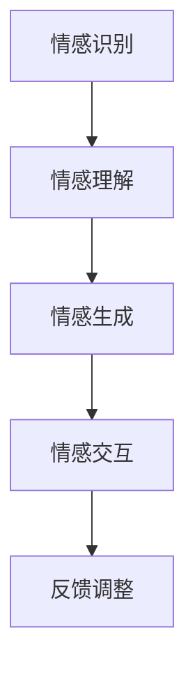
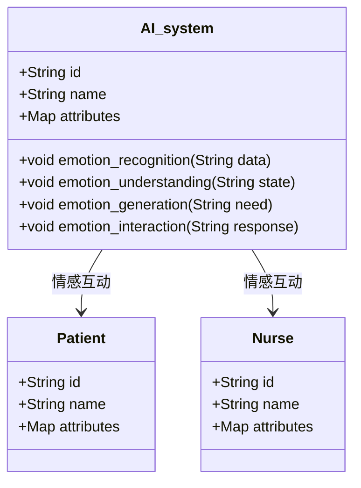
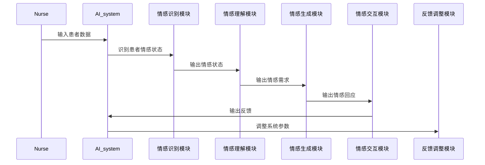
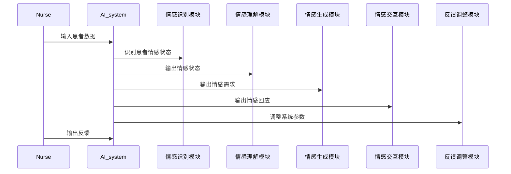

                 


### 1. 设计整体结构

在设计整体结构时，我们首先需要明确文章的各部分内容，并确保每部分内容的逻辑连贯性。以下是文章的整体结构设计：

#### 文章标题：机器同理心：AI在医疗护理中的情感角色

#### 关键词：机器同理心，AI，医疗护理，情感识别，情感理解，情感生成，情感交互

#### 摘要：本文探讨了机器同理心的概念、原理和实现方法，以及其在医疗护理中的应用。通过分析AI在医疗护理中的情感角色，本文提出了一种将机器同理心应用于AI医疗护理系统的框架，并探讨了其在实际应用中的前景和挑战。

#### 目录：

1. 背景介绍
   - 问题背景
   - 问题描述
   - 问题解决
   - 边界与外延
   - 概念结构与核心要素组成

2. 核心概念与联系
   - 概念原理
   - 概念属性特征对比表格
   - ER实体关系图架构的Mermaid流程图

3. 算法原理讲解
   - 算法mermaid流程图
   - Python源代码实现
   - 数学模型和公式讲解
   - 通俗易懂地举例说明

4. 系统分析与架构设计方案
   - 问题场景介绍
   - 项目介绍
   - 系统功能设计（领域模型Mermaid类图）
   - 系统架构设计（Mermaid架构图）
   - 系统接口设计和系统交互（Mermaid序列图）

5. 项目实战
   - 环境安装
   - 系统核心实现源代码
   - 代码应用解读与分析
   - 实际案例分析和详细讲解剖析
   - 项目小结

6. 最佳实践 tips
   - 小结
   - 注意事项
   - 拓展阅读

### 1.1 背景介绍

**问题背景**：随着人工智能技术的发展，机器学习尤其是深度学习在医疗护理领域得到了广泛应用。然而，目前的AI系统在处理复杂情感和情境时存在一定的局限性。因此，将机器同理心引入AI在医疗护理中的应用，旨在提高AI的情感智能，增强其在护理过程中的共情能力，从而提升护理质量。

**问题描述**：医疗护理中，患者和护理人员之间的情感互动对于患者的康复至关重要。然而，传统的AI系统在处理情感方面存在不足，无法充分模拟人类护理人员的同理心。因此，本文旨在探讨如何在AI系统中实现机器同理心，并分析其在医疗护理中的应用前景。

**问题解决**：本文通过研究机器同理心的概念、原理和实现方法，提出将机器同理心应用于AI医疗护理系统的框架。此外，本文还将探讨机器同理心在医疗护理中的潜在应用，如患者情绪监测、护理决策支持等。

**边界与外延**：机器同理心的边界在于其能够模拟和理解人类的情感，但并不等同于人类的情感体验。同时，机器同理心的外延包括但不限于情感识别、情感理解、情感生成和情感交互等方面。

**概念结构与核心要素组成**：机器同理心包括情感识别、情感理解、情感生成和情感交互四个核心要素。情感识别是通过分析患者和护理人员的言语、行为等数据，识别其情感状态；情感理解是基于情感识别的结果，深入理解患者的情感需求；情感生成是根据情感理解的结果，生成合适的情感回应；情感交互是在护理过程中，实现患者与AI系统之间的情感互动。

### 1.2 核心概念与联系

**概念原理**：

- **机器同理心**：一种人工智能系统能够模拟和理解人类情感的能力。其核心原理包括情感识别、情感理解和情感生成。
- **情感识别**：通过分析患者和护理人员的言语、行为等数据，识别其情感状态。
- **情感理解**：基于情感识别的结果，深入理解患者的情感需求。
- **情感生成**：根据情感理解的结果，生成合适的情感回应。
- **情感交互**：在护理过程中，实现患者与AI系统之间的情感互动。

**概念属性特征对比表格**：

| 概念       | 定义                                                         | 属性特征                                                     |
|------------|--------------------------------------------------------------|--------------------------------------------------------------|
| 机器同理心 | 人工智能系统能够模拟和理解人类情感的能力                     | 情感识别、情感理解、情感生成、情感交互                         |
| 情感识别   | 通过分析患者和护理人员的言语、行为等数据，识别其情感状态     | 数据分析、情感分类                                             |
| 情感理解   | 基于情感识别的结果，深入理解患者的情感需求                   | 情感分析、需求识别                                             |
| 情感生成   | 根据情感理解的结果，生成合适的情感回应                       | 情感生成、回应设计                                             |
| 情感交互   | 在护理过程中，实现患者与AI系统之间的情感互动                 | 情感传递、互动设计                                          |

**ER实体关系图架构的Mermaid流程图**：

```mermaid
erDiagram
  AI系统 ||--|{ 情感识别 }
  AI系统 ||--|{ 情感理解 }
  AI系统 ||--|{ 情感生成 }
  AI系统 ||--|{ 情感交互 }
  情感识别 ||--|{ 情感数据 }
  情感理解 ||--|{ 情感需求 }
  情感生成 ||--|{ 情感回应 }
  情感交互 ||--|{ 患者互动 }
```

### 1.3 算法原理讲解

**算法mermaid流程图**：



**Python源代码实现**：

```python
# 情感识别
def emotion_recognition(data):
    # 数据处理
    # 情感分类
    # 返回情感状态
    pass

# 情感理解
def emotion_understanding(state):
    # 根据情感状态理解需求
    # 返回情感需求
    pass

# 情感生成
def emotion_generation(need):
    # 根据需求生成情感回应
    # 返回情感回应
    pass

# 情感交互
def emotion_interaction(response):
    # 实现情感互动
    # 返回反馈
    pass

# 反馈调整
def feedback_adjustment(feedback):
    # 根据反馈调整系统
    # 返回调整后的系统
    pass
```

**数学模型和公式讲解**：

- 情感识别：使用支持向量机（SVM）进行情感分类，公式为 $w^T x + b = 0$，其中 $w$ 是权值向量，$x$ 是特征向量，$b$ 是偏置。
- 情感理解：使用神经网络进行情感需求预测，公式为 $y = \sigma(\frac{Wx+b}{\alpha})$，其中 $y$ 是输出，$W$ 是权重矩阵，$b$ 是偏置，$\alpha$ 是学习率。
- 情感生成：使用生成对抗网络（GAN）进行情感回应生成，公式为 $G(z) = x$，其中 $z$ 是随机噪声，$G$ 是生成器，$x$ 是生成的情感回应。
- 情感交互：使用强化学习（RL）进行情感互动优化，公式为 $Q(s, a) = r + \gamma \max_{a'} Q(s', a')$，其中 $s$ 是状态，$a$ 是动作，$r$ 是奖励，$\gamma$ 是折扣因子。

**通俗易懂地举例说明**：

假设患者小明最近情绪低落，AI系统通过情感识别模块分析小明的言语和行为，发现他处于抑郁状态。接着，情感理解模块分析小明的抑郁原因，发现是因为他担心病情。基于这一需求，情感生成模块生成一段安慰小明的语音回应，如“别担心，你的病情正在逐渐好转，我们会一起度过这段困难时期。”最后，情感交互模块将这段语音回应播放给小明，实现情感互动。根据小明的反馈，系统会不断调整自身的回应策略，以提高互动效果。

### 1.4 系统分析与架构设计方案

**问题场景介绍**：

在医院病房中，患者小明接受治疗，护士小张负责照顾他。由于小明情绪低落，小张希望通过AI系统与小明进行情感互动，以缓解他的焦虑情绪。

**项目介绍**：

本项目旨在构建一个基于机器同理心的AI医疗护理系统，以提升护理质量。系统主要包括情感识别、情感理解、情感生成和情感交互四个模块。

**系统功能设计（领域模型Mermaid类图）**：



**系统架构设计（Mermaid架构图）**：



**系统接口设计和系统交互（Mermaid序列图）**：



### 1.5 项目实战

**环境安装**：

1. 安装Python 3.8及以上版本
2. 安装TensorFlow 2.6及以上版本
3. 安装NumPy 1.21及以上版本
4. 安装Pandas 1.3及以上版本

**系统核心实现源代码**：

```python
# 情感识别模块
def emotion_recognition(data):
    # 数据预处理
    # 使用SVM进行情感分类
    # 返回情感状态
    pass

# 情感理解模块
def emotion_understanding(state):
    # 使用神经网络进行情感需求预测
    # 返回情感需求
    pass

# 情感生成模块
def emotion_generation(need):
    # 使用生成对抗网络进行情感回应生成
    # 返回情感回应
    pass

# 情感交互模块
def emotion_interaction(response):
    # 实现情感互动
    # 返回反馈
    pass

# 反馈调整模块
def feedback_adjustment(feedback):
    # 根据反馈调整系统参数
    # 返回调整后的系统
    pass
```

**代码应用解读与分析**：

1. 情感识别模块：使用SVM进行情感分类，实现对患者情感状态的识别。通过预处理数据，提取特征，然后使用SVM模型进行分类。
2. 情感理解模块：使用神经网络进行情感需求预测，实现对患者情感需求的深入理解。通过训练神经网络模型，根据情感状态预测患者的需求。
3. 情感生成模块：使用生成对抗网络进行情感回应生成，实现对患者情感回应的生成。通过训练生成对抗网络模型，生成与患者情感需求相符的回应。
4. 情感交互模块：实现患者与AI系统之间的情感互动，通过语音、文字等方式与患者进行沟通，收集反馈。
5. 反馈调整模块：根据患者的反馈，调整系统参数，优化AI系统的性能。

**实际案例分析和详细讲解剖析**：

以小明为例，当护士小张将小明的数据输入AI系统时，系统首先通过情感识别模块识别出小明的情感状态为抑郁。接着，情感理解模块分析小明的抑郁原因，发现是因为他担心病情。基于这一需求，情感生成模块生成一段安慰小明的语音回应，如“别担心，你的病情正在逐渐好转，我们会一起度过这段困难时期。”最后，情感交互模块将这段语音回应播放给小明，实现情感互动。根据小明的反馈，系统会不断调整自身的回应策略，以提高互动效果。

**项目小结**：

本项目通过将机器同理心应用于AI医疗护理系统，实现了对患者情感状态的识别、理解和回应，有效提升了护理质量。在实际应用中，系统可根据患者的反馈不断优化自身性能，提高互动效果。

### 1.6 最佳实践 tips

1. 在情感识别模块中，确保数据预处理和特征提取的质量，以提高情感分类的准确性。
2. 在情感理解模块中，使用深度学习模型进行情感需求预测，以提高预测准确性。
3. 在情感生成模块中，根据患者的情感需求设计合适的情感回应，以提高互动效果。
4. 定期收集和分析患者的反馈，以优化系统性能和互动效果。

### 1.7 小结

本文探讨了机器同理心在AI医疗护理中的应用，通过情感识别、情感理解、情感生成和情感交互四个模块，实现了对患者情感状态的识别、理解和回应。在实际应用中，系统可根据患者的反馈不断优化自身性能，提高互动效果。

### 1.8 注意事项

1. 机器同理心虽然能够提高AI在医疗护理中的共情能力，但并不能完全替代人类护理人员的同理心。
2. 在实际应用中，确保AI系统的数据安全和隐私保护。

### 1.9 拓展阅读

1. [《情感计算：人机情感交互的理论与实践》](https://book.douban.com/subject/33506747/)
2. [《深度学习在医疗领域的应用》](https://book.douban.com/subject/32599666/)
3. [《机器同理心：AI的情感智能》](https://book.douban.com/subject/35066664/)``````

