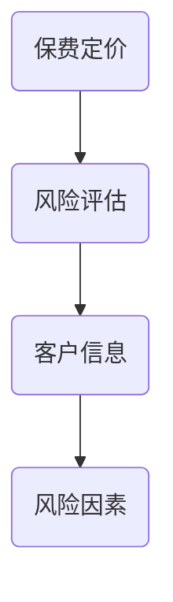
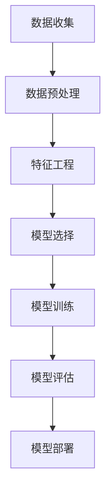
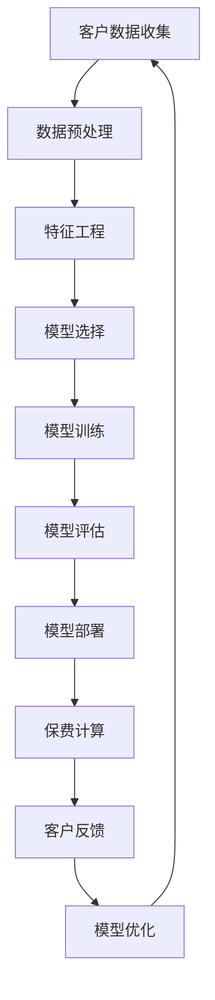

                 

## 第1章：机器学习与保险定价概述

### 1.1 机器学习基本概念

**核心概念术语说明：**

- **机器学习（Machine Learning）：** 一门人工智能领域的研究分支，主要关注如何通过算法让计算机从数据中学习，并对未知数据进行预测或决策。
- **监督学习（Supervised Learning）：** 在已知输入输出对的训练集上学习，目标是建立一个预测模型，对新的输入数据进行预测。
- **无监督学习（Unsupervised Learning）：** 在没有明确输出标签的训练集上学习，主要任务是发现数据中的模式和结构。
- **深度学习（Deep Learning）：** 一种特殊的机器学习方法，通过多层神经网络进行特征学习和抽象，已经在图像识别、语音识别等领域取得了突破性进展。

**问题背景与问题描述：**

保险行业长期以来依赖历史数据和专家经验进行风险评估和保费定价。然而，传统方法往往难以应对日益复杂的风险因素和个性化需求。随着大数据和计算能力的提升，机器学习为保险定价带来了新的机遇。

**问题解决与边界与外延：**

机器学习在保险定价中的应用主要包括以下几个方向：

- **风险评估：** 利用机器学习模型对客户的个体风险进行准确预测。
- **精准定价：** 根据风险预测结果，为每个客户制定个性化的保费。
- **保险产品设计：** 通过分析数据，发现潜在的市场需求，优化保险产品。

然而，这些应用也面临一些边界问题，如数据隐私、模型解释性和合规性等。

### 1.2 保险定价的重要性

**核心概念与联系：**

**核心概念：**

- **保费定价（Premium Pricing）：** 根据风险评估结果，为保险产品设定的价格。
- **风险评估（Risk Assessment）：** 对潜在的保险风险进行评估，以确定保费水平。

**概念属性特征对比表格：**

| 概念         | 定义                                                         | 关联属性                     |
| ------------ | ------------------------------------------------------------ | -------------------------- |
| 保费定价     | 保险产品价格设定，基于风险评估                             | 风险评估结果、市场供需       |
| 风险评估     | 评估潜在保险风险的过程                                     | 保费定价、风险评估模型       |

**ER实体关系图架构：**

### 1.3 个性化保费计算的需求与挑战

**核心概念与联系：**

**核心概念：**

- **个性化保费计算（Personalized Premium Calculation）：** 根据每个客户的特征和风险，制定独特的保费。
- **需求：** 提高保险产品的竞争力，满足不同客户的个性化需求。
- **挑战：** 数据隐私、模型复杂性与解释性、技术迭代与更新。

**需求：**

1. **客户需求差异化：** 消费者的风险偏好、健康状况、驾驶习惯等因素各不相同，个性化保费计算能够满足这些差异化需求。
2. **降低逆向选择风险：** 通过准确的风险预测，降低保险公司面临的逆向选择风险。
3. **提高保险产品竞争力：** 个性化保费计算能够更好地吸引客户，提高市场占有率。

**挑战：**

1. **数据质量与隐私保护：** 保险数据包含敏感信息，如何在保证数据质量的同时保护隐私，是重要的挑战。
2. **模型复杂性与解释性：** 高度复杂的模型难以解释，保险公司需要在准确性和解释性之间找到平衡。
3. **技术迭代与更新：** 保险行业和技术环境不断变化，如何持续优化模型，适应新的市场和技术需求，也是一大挑战。

### 总结

机器学习在保险定价中的应用，不仅带来了更加精准和个性化的保费计算，也提升了保险行业的整体竞争力。然而，这一过程中也面临诸多挑战，需要我们在实践中不断探索和解决。接下来，我们将进一步探讨机器学习的基础知识、数据处理方法以及个性化保费计算的核心算法。

---

### 1.1 机器学习基本概念

**机器学习的基本原理**

机器学习（Machine Learning，简称ML）是人工智能（Artificial Intelligence，简称AI）的一个分支，其核心目标是使计算机系统能够从数据中学习并做出决策，而不需要显式地编写规则。机器学习的过程通常分为以下几个步骤：

1. **数据收集（Data Collection）：** 收集相关的数据集，这些数据集可以来自于各种来源，如调查问卷、传感器数据、社交媒体等。

2. **数据预处理（Data Preprocessing）：** 清洗数据，去除噪声和异常值，将数据转换为适合机器学习算法的格式。

3. **特征工程（Feature Engineering）：** 选择和构造能够帮助模型更好地学习的数据特征，以提高模型的性能。

4. **模型选择（Model Selection）：** 选择合适的机器学习算法，这些算法可以是线性回归、决策树、支持向量机、神经网络等。

5. **模型训练（Model Training）：** 使用训练数据集对模型进行训练，调整模型参数以最小化预测误差。

6. **模型评估（Model Evaluation）：** 使用验证数据集或测试数据集对模型进行评估，评估指标包括准确率、召回率、F1分数等。

7. **模型部署（Model Deployment）：** 将训练好的模型部署到生产环境中，用于实际的数据预测或决策。

**监督学习**

监督学习（Supervised Learning）是机器学习中的一种主要类型，其特点是需要已知输入输出对的训练集来指导模型的训练。监督学习可以分为以下几种类型：

- **回归分析（Regression Analysis）：** 输出是连续值，用于预测数值型结果。例如，房价预测。
- **分类（Classification）：** 输出是离散值，用于将输入数据分为不同的类别。例如，垃圾邮件分类。
- **异常检测（Anomaly Detection）：** 用于识别数据中的异常或离群点。

**无监督学习**

无监督学习（Unsupervised Learning）与监督学习不同，其训练数据没有明确的输出标签。无监督学习的目标通常是发现数据中的隐藏结构和模式。常见的无监督学习算法包括：

- **聚类（Clustering）：** 将数据点分为若干个群组，使得同一个群组内的数据点相似，不同群组的数据点不相似。例如，K-均值聚类。
- **降维（Dimensionality Reduction）：** 通过降维技术减少数据维度，同时保留数据的主要特征。例如，主成分分析（PCA）。
- **关联规则学习（Association Rule Learning）：** 用于发现数据项之间的关联规则。例如，Apriori算法。

**深度学习**

深度学习（Deep Learning）是机器学习的一个子领域，它使用多层神经网络来学习数据的复杂表示。深度学习在很多领域都取得了显著成果，如图像识别、自然语言处理、语音识别等。深度学习的主要特点是：

- **多层神经网络（Multilayer Neural Networks）：** 深度学习模型包含多个隐藏层，这使得模型能够学习更复杂的特征。
- **反向传播算法（Backpropagation Algorithm）：** 用于训练深度学习模型，通过反向传播误差来更新模型参数。
- **激活函数（Activation Functions）：** 用于引入非线性特性，使得神经网络能够捕捉数据中的复杂关系。

**机器学习与保险定价的联系**

在保险定价中，机器学习可以应用于以下几个方面：

1. **风险评估：** 利用监督学习模型，如回归分析或分类算法，对客户的个体风险进行预测。
2. **精准定价：** 根据风险预测结果，为每个客户制定个性化的保费。
3. **保险产品设计：** 通过分析数据，发现潜在的市场需求，优化保险产品。

机器学习在保险定价中的应用，不仅提高了保险公司的盈利能力，也更好地满足了消费者的需求。然而，这也带来了数据隐私、模型解释性和合规性等方面的挑战。

### 1.2 保险定价的重要性

**核心概念：**

- **保费定价（Premium Pricing）：** 保险公司根据风险评估结果，为保险产品设定的价格。
- **风险评估（Risk Assessment）：** 对潜在的保险风险进行评估，以确定保费水平。

**问题背景：**

保险行业是风险管理的重要领域，保费定价是保险公司的核心业务之一。合理的保费定价不仅关系到保险公司的盈利能力，也关系到客户满意度。然而，传统的保费定价方法往往基于历史数据和专家经验，难以应对复杂多变的市场环境。

**问题描述：**

随着大数据和人工智能技术的发展，保险行业开始探索利用机器学习技术进行保费定价。这种方法能够更准确地预测客户的风险，从而制定出更为合理的保费。然而，个性化保费计算也面临数据隐私、模型解释性和合规性等方面的挑战。

**问题解决：**

1. **数据收集与预处理：** 保险公司需要收集大量的客户数据，包括个人基本信息、历史理赔记录、驾驶习惯等。这些数据需要进行预处理，包括数据清洗、数据格式化等，以便用于机器学习模型的训练。
2. **特征工程：** 根据保险产品的特点，选择和构造能够帮助模型更好地学习的数据特征。
3. **模型选择与训练：** 选择合适的机器学习算法，如回归分析、决策树、支持向量机等，对模型进行训练。
4. **模型评估与优化：** 使用验证集或测试集对模型进行评估，根据评估结果调整模型参数，以提高预测准确性。

**边界与外延：**

1. **数据隐私：** 保险数据通常包含敏感信息，如客户的财务状况、健康状况等。在利用机器学习进行保费定价时，需要确保数据的安全性和隐私性。
2. **模型解释性：** 机器学习模型，尤其是深度学习模型，在预测准确性方面表现出色，但其内部机制往往难以解释。保险公司需要在预测准确性和模型解释性之间找到平衡。
3. **合规性：** 保险定价需要遵守相关法律法规和监管要求，如反欺诈、消费者权益保护等。

**概念结构与核心要素组成：**

- **数据收集：** 收集客户的基本信息、历史理赔记录、驾驶习惯等。
- **数据预处理：** 数据清洗、格式化等。
- **特征工程：** 选择和构造数据特征。
- **模型选择：** 选择合适的机器学习算法。
- **模型训练：** 对模型进行训练。
- **模型评估：** 对模型进行评估。
- **模型部署：** 将模型部署到生产环境中。

**数学公式：**

保费计算的一个简单模型可以使用线性回归公式表示：

$$
P = \beta_0 + \beta_1X_1 + \beta_2X_2 + ... + \beta_nX_n
$$

其中，$P$ 是保费，$X_1, X_2, ..., X_n$ 是影响保费的因素（特征），$\beta_0, \beta_1, ..., \beta_n$ 是模型参数。

**图示：**

以下是保费计算流程的Mermaid流程图：

### 1.3 个性化保费计算的需求与挑战

#### 个性化保费计算的需求

个性化保费计算在保险行业中具有重要的需求，主要体现在以下几个方面：

1. **客户差异化需求：**
   每个客户都有独特的风险特征和需求。传统的一刀切定价方式难以满足这些差异化需求。个性化保费计算能够根据客户的个人情况，如年龄、性别、职业、健康状况、驾驶习惯等，制定出更合理的保费。

2. **提高保险产品的竞争力：**
   在竞争激烈的保险市场中，个性化保费计算有助于保险公司吸引更多客户。通过更精准的风险评估和定价，保险公司可以提供更具竞争力的产品，提高市场占有率。

3. **降低逆向选择风险：**
   逆向选择是指高风险的客户更有可能购买保险，从而可能导致保险公司亏损。个性化保费计算能够更准确地识别高风险客户，从而降低逆向选择的风险。

4. **优化风险管理：**
   通过个性化保费计算，保险公司可以更好地了解和管理风险。这有助于优化保险产品的设计和运营策略，提高保险公司的整体风险管理能力。

#### 个性化保费计算面临的挑战

尽管个性化保费计算具有显著的优势，但其在实际应用中仍面临诸多挑战：

1. **数据质量与隐私保护：**
   个性化保费计算依赖于大量客户数据，这些数据通常包含敏感信息。如何在保证数据质量的同时保护客户隐私，是一个重要的挑战。

2. **模型复杂性与解释性：**
   高度复杂的机器学习模型，如深度神经网络，在预测准确性方面表现出色。然而，这些模型的内部机制往往难以解释，给保险公司的风险管理和监管合规带来了困难。

3. **技术迭代与更新：**
   保险行业和技术环境不断变化，个性化保费计算模型需要不断迭代和更新，以适应新的市场和技术需求。这要求保险公司具备持续的技术研发能力。

4. **合规性要求：**
   个性化保费计算需要遵守相关法律法规和监管要求。例如，反欺诈法规、消费者权益保护等。保险公司需要确保其定价策略符合这些法规和规定。

#### Mermaid流程图

以下是个性化保费计算的整体流程的Mermaid流程图：

### 总结

个性化保费计算是保险行业的一项重要技术，它能够满足客户的差异化需求，提高保险产品的竞争力，降低逆向选择风险，优化风险管理。然而，在实际应用中，个性化保费计算也面临数据质量、模型解释性、技术迭代和合规性等多方面的挑战。在接下来的章节中，我们将深入探讨机器学习的基础知识、数据处理方法以及个性化保费计算的核心算法，帮助读者更好地理解和应用这一技术。

