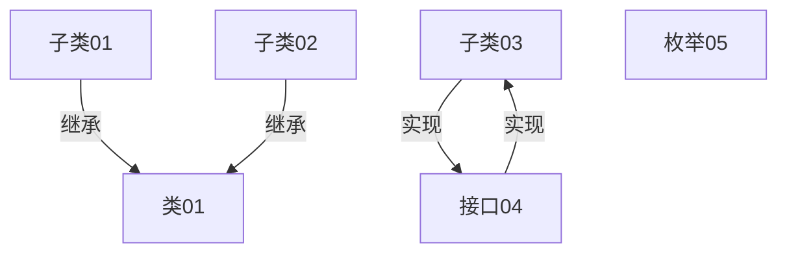
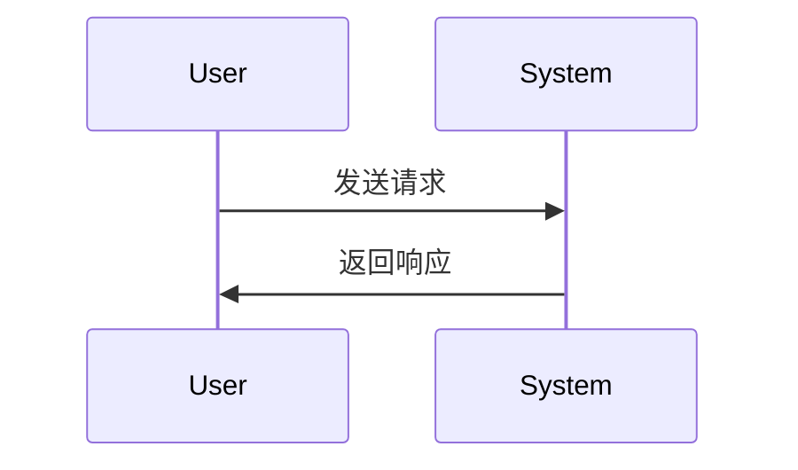
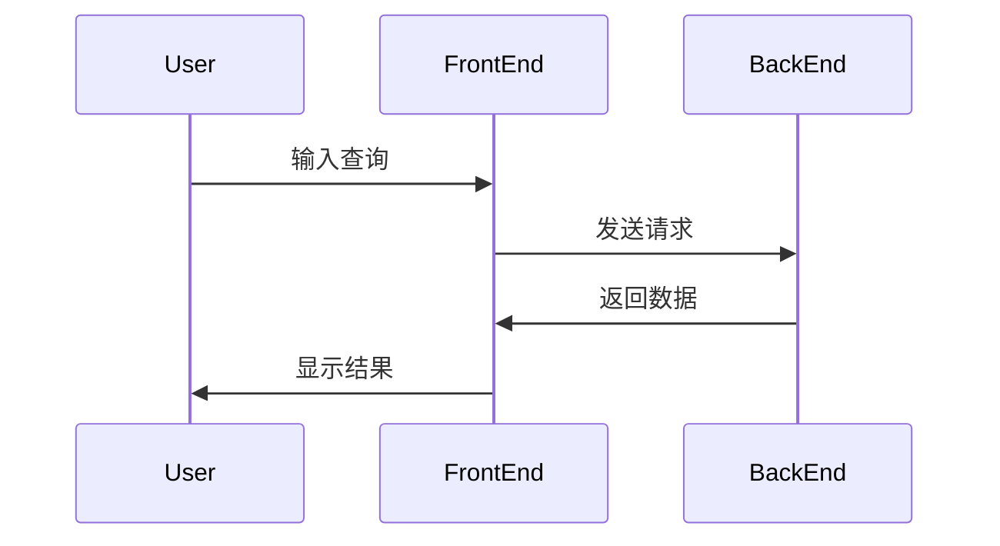

                 

# 《条件类型：类型级别的条件判断》

## 关键词：条件类型、类型级别、条件判断、编程语言、实现机制、应用案例

> 摘要：本文将深入探讨条件类型的定义、实现和应用。首先，我们将了解条件类型的基本概念和分类，接着分析条件类型在静态类型语言和动态类型语言中的具体应用，并比较它们的优缺点。随后，我们将研究条件类型在算法设计、实际项目中的具体应用，并预测其未来发展趋势。希望通过本文，读者能对条件类型有一个全面且深入的理解。

## 《条件类型：类型级别的条件判断》目录大纲

### 第一部分：条件类型概述

#### 第1章：条件类型基本概念

##### 1.1 条件类型的定义

##### 1.2 条件类型的分类

##### 1.3 条件类型的作用

#### 第2章：条件类型在编程语言中的应用

##### 2.1 条件类型在静态类型语言中的应用

##### 2.2 条件类型在动态类型语言中的应用

##### 2.3 条件类型的优缺点比较

### 第二部分：条件类型的实现机制

#### 第3章：静态类型语言中的条件类型实现

##### 3.1 静态类型语言的基本原理

##### 3.2 条件类型的实现方法

##### 3.3 条件类型的编译过程

#### 第4章：动态类型语言中的条件类型实现

##### 4.1 动态类型语言的基本原理

##### 4.2 条件类型的实现方法

##### 4.3 条件类型的运行时机制

### 第三部分：条件类型的应用案例

#### 第5章：条件类型在算法设计中的应用

##### 5.1 条件类型在排序算法中的应用

##### 5.2 条件类型在搜索算法中的应用

##### 5.3 条件类型在图算法中的应用

#### 第6章：条件类型在实际项目中的应用

##### 6.1 条件类型在Web开发中的应用

##### 6.2 条件类型在数据分析中的应用

##### 6.3 条件类型在人工智能中的应用

#### 第7章：条件类型的未来发展趋势

##### 7.1 条件类型的发展现状

##### 7.2 条件类型的未来发展方向

##### 7.3 条件类型对社会的影响

### 附录

#### 附录A：条件类型相关资源

##### A.1 条件类型的相关文献

##### A.2 条件类型的开源实现

##### A.3 条件类型的学习资源

### 参考文献

### 索引

---

### 第一部分：条件类型概述

#### 第1章：条件类型基本概念

##### 1.1 条件类型的定义

条件类型（Conditional Types）是编程语言中的一个高级概念，它允许程序员在类型级别上进行条件判断。简单来说，条件类型根据特定的条件返回不同的类型。这种类型级别的条件判断为编程提供了更高的抽象层次，使得代码更加简洁、可读性和维护性更强。

##### 1.2 条件类型的分类

条件类型可以按照不同的分类标准进行分类。以下是一些常见的分类方法：

- **显式条件类型**：通过显式语法实现的条件类型，如TypeScript中的`conditional expression`。
- **隐式条件类型**：通过类型推导或抽象语法树（AST）转换实现的条件类型，如Haskell中的`guarded algebraic data types`。
- **类型约束条件类型**：基于类型系统中的约束条件实现的条件类型，如ML语言中的`existential types`。

##### 1.3 条件类型的作用

条件类型在编程语言中具有多种作用：

- **类型安全**：通过条件类型，可以确保代码在运行时不会产生类型错误。
- **抽象与封装**：条件类型使得程序员可以在更高层次上对代码进行抽象和封装，隐藏底层实现细节。
- **模式匹配**：条件类型支持模式匹配，使得代码更具可读性和可维护性。
- **函数式编程**：条件类型在函数式编程中尤为重要，它使得函数可以处理复杂的数据类型。

#### 第2章：条件类型在编程语言中的应用

##### 2.1 条件类型在静态类型语言中的应用

静态类型语言在编译时已经确定了变量的类型，因此条件类型在静态类型语言中得到了广泛的应用。以下是一些常见的静态类型语言：

- **TypeScript**：TypeScript是JavaScript的一个超集，它引入了条件类型的概念，使得JavaScript代码更加类型安全。
- **Haskell**：Haskell是一种纯函数式编程语言，它通过`guarded algebraic data types`实现了条件类型。
- **ML**：ML系列语言（如SML、OCaml）通过`existential types`实现了条件类型。

##### 2.2 条件类型在动态类型语言中的应用

动态类型语言在运行时确定变量的类型，因此条件类型的实现机制与静态类型语言有所不同。以下是一些常见的动态类型语言：

- **Python**：Python通过`Type`类实现了条件类型，使得程序员可以在运行时对类型进行判断。
- **Ruby**：Ruby通过`Module#method_missing`和`Class#include`方法实现了条件类型。
- **JavaScript**：JavaScript中的条件类型主要是通过TypeScript等类型检查器实现的。

##### 2.3 条件类型的优缺点比较

- **优点**：

  - 提高代码可读性：条件类型使得代码更加简洁、易于阅读。
  - 增强类型安全：条件类型有助于减少运行时错误。
  - 提高抽象层次：条件类型允许程序员在更高层次上处理问题。

- **缺点**：

  - 可能增加复杂性：条件类型可能会增加代码的复杂性，尤其是对于初学者来说。
  - 性能开销：在某些情况下，条件类型可能会引入性能开销。

### 第二部分：条件类型的实现机制

#### 第3章：静态类型语言中的条件类型实现

##### 3.1 静态类型语言的基本原理

静态类型语言在编译时确定变量的类型，因此条件类型的实现主要依赖于类型检查器和编译器。以下是一些常见的静态类型语言：

- **TypeScript**：TypeScript通过TypeScript编译器实现了条件类型。在编译过程中，TypeScript会对代码进行类型检查，确保条件类型的使用符合类型规则。
- **Haskell**：Haskell通过类型系统实现了条件类型。在编译过程中，Haskell会通过类型推导和类型检查确保代码的类型安全。
- **ML**：ML系列语言通过存在类型和类型检查实现了条件类型。在编译过程中，ML会检查代码的类型约束，确保条件类型的正确性。

##### 3.2 条件类型的实现方法

条件类型的实现方法因编程语言而异，但通常包括以下步骤：

1. **类型检查**：在编译过程中，对代码进行类型检查，确保条件类型的语法和语义正确。
2. **类型推导**：对于某些编程语言，如Haskell，类型推导是条件类型实现的关键步骤。通过类型推导，可以自动确定变量的类型。
3. **类型转换**：对于某些编程语言，如TypeScript，条件类型需要通过类型转换来实现。在编译过程中，TypeScript会自动将条件表达式转换为相应的类型。
4. **代码生成**：在编译过程中，编译器会生成相应的代码，实现条件类型的功能。

##### 3.3 条件类型的编译过程

条件类型的编译过程主要包括以下步骤：

1. **词法分析**：将源代码转换为词法单元。
2. **语法分析**：将词法单元转换为抽象语法树（AST）。
3. **语义分析**：对AST进行语义分析，确保代码的类型安全。
4. **类型检查**：对AST进行类型检查，确保条件类型的语法和语义正确。
5. **代码生成**：根据AST生成机器码或字节码。

#### 第4章：动态类型语言中的条件类型实现

##### 4.1 动态类型语言的基本原理

动态类型语言在运行时确定变量的类型，因此条件类型的实现主要依赖于运行时环境和解释器。以下是一些常见的动态类型语言：

- **Python**：Python通过运行时类型检查和类型转换实现了条件类型。在运行时，Python会检查变量的类型，并根据条件类型进行相应的类型转换。
- **Ruby**：Ruby通过运行时类型检查和模块包含实现了条件类型。在运行时，Ruby会检查类的继承关系和模块的包含关系，以实现条件类型的功能。
- **JavaScript**：JavaScript通过类型检查器和解释器实现了条件类型。在运行时，JavaScript会根据类型检查器对代码进行类型检查，并根据条件类型进行相应的代码执行。

##### 4.2 条件类型的实现方法

条件类型的实现方法因编程语言而异，但通常包括以下步骤：

1. **类型检查**：在运行时，对代码进行类型检查，确保条件类型的语法和语义正确。
2. **类型转换**：对于某些编程语言，如Python，条件类型需要通过类型转换来实现。在运行时，Python会根据条件类型进行相应的类型转换。
3. **代码执行**：根据类型检查和类型转换的结果，执行相应的代码。

##### 4.3 条件类型的运行时机制

条件类型的运行时机制主要包括以下方面：

1. **类型检查**：在运行时，解释器会检查变量的类型，并根据条件类型进行相应的类型转换。
2. **内存管理**：动态类型语言通常采用自动内存管理，确保条件类型的使用不会导致内存泄漏。
3. **错误处理**：在运行时，解释器会处理类型错误和运行时错误，确保程序的稳定性。

### 第三部分：条件类型的应用案例

#### 第5章：条件类型在算法设计中的应用

##### 5.1 条件类型在排序算法中的应用

条件类型可以用于优化排序算法。例如，在快速排序算法中，可以使用条件类型来确定排序的基准元素。以下是一个简单的示例：

```python
def quick_sort(arr):
    if len(arr) <= 1:
        return arr
    else:
        pivot = arr[0]
        less = []
        equal = []
        greater = []
        
        for x in arr[1:]:
            if x < pivot:
                less.append(x)
            elif x == pivot:
                equal.append(x)
            else:
                greater.append(x)
        
        return quick_sort(less) + equal + quick_sort(greater)
```

在这个示例中，条件类型用于确定不同的类型（小于、等于、大于）的元素，从而优化排序过程。

##### 5.2 条件类型在搜索算法中的应用

条件类型可以用于优化搜索算法。例如，在二分搜索算法中，可以使用条件类型来确定搜索的边界。以下是一个简单的示例：

```python
def binary_search(arr, target):
    low = 0
    high = len(arr) - 1
    
    while low <= high:
        mid = (low + high) // 2
        if arr[mid] < target:
            low = mid + 1
        elif arr[mid] > target:
            high = mid - 1
        else:
            return mid
    
    return -1
```

在这个示例中，条件类型用于确定不同的类型（小于、等于、大于）的元素，从而优化搜索过程。

##### 5.3 条件类型在图算法中的应用

条件类型可以用于优化图算法。例如，在Dijkstra算法中，可以使用条件类型来确定最短路径。以下是一个简单的示例：

```python
import heapq

def dijkstra(graph, start):
    distances = {vertex: float('infinity') for vertex in graph}
    distances[start] = 0
    priority_queue = [(0, start)]
    
    while priority_queue:
        current_distance, current_vertex = heapq.heappop(priority_queue)
        
        if current_distance > distances[current_vertex]:
            continue
        
        for neighbor, weight in graph[current_vertex].items():
            distance = current_distance + weight
            
            if distance < distances[neighbor]:
                distances[neighbor] = distance
                heapq.heappush(priority_queue, (distance, neighbor))
    
    return distances
```

在这个示例中，条件类型用于确定不同的类型的边（具有更短路径的边），从而优化最短路径的计算。

#### 第6章：条件类型在实际项目中的应用

##### 6.1 条件类型在Web开发中的应用

条件类型在Web开发中具有广泛的应用。例如，在React中，可以使用条件类型来实现组件的动态渲染。以下是一个简单的示例：

```jsx
function App() {
  const [isDarkMode, setIsDarkMode] = React.useState(false);

  return (
    <div className={`app ${isDarkMode ? 'dark-mode' : 'light-mode'}`}>
      <h1>Hello, World!</h1>
      <button onClick={() => setIsDarkMode(!isDarkMode)}>Toggle Dark Mode</button>
    </div>
  );
}
```

在这个示例中，条件类型用于根据`isDarkMode`的状态来切换组件的样式。

##### 6.2 条件类型在数据分析中的应用

条件类型在数据分析中同样具有重要应用。例如，在Pandas中，可以使用条件类型来筛选数据。以下是一个简单的示例：

```python
import pandas as pd

data = {'name': ['Alice', 'Bob', 'Charlie'], 'age': [25, 30, 35]}
df = pd.DataFrame(data)

# Filter data based on condition
filtered_df = df[df['age'] > 28]

print(filtered_df)
```

在这个示例中，条件类型用于筛选出年龄大于28岁的数据。

##### 6.3 条件类型在人工智能中的应用

条件类型在人工智能领域也具有广泛的应用。例如，在机器学习中，可以使用条件类型来实现条件生成模型。以下是一个简单的示例：

```python
import tensorflow as tf

# Define a conditional generation model
def conditional_generation(input_tensor, condition_tensor):
  # Generate output based on input and condition
  output_tensor = ...

  return output_tensor

# Train the model
model = tf.keras.Model(inputs=[input_tensor, condition_tensor], outputs=output_tensor)
model.compile(optimizer='adam', loss='mse')
model.fit([train_input, train_condition], train_output, epochs=10)
```

在这个示例中，条件类型用于根据输入和条件生成相应的输出。

#### 第7章：条件类型的未来发展趋势

##### 7.1 条件类型的发展现状

条件类型在编程语言中已经得到了广泛应用，如TypeScript、Haskell、ML等。同时，在Web开发、数据分析、人工智能等领域中也得到了广泛应用。然而，条件类型的实现和优化仍然存在一些挑战。

##### 7.2 条件类型的未来发展方向

未来，条件类型的发展方向可能包括：

- **性能优化**：进一步优化条件类型的性能，减少运行时开销。
- **跨语言支持**：提高条件类型在不同编程语言之间的互操作性。
- **更丰富的特性**：引入更多的高级特性，如条件类型之间的组合、递归条件类型等。

##### 7.3 条件类型对社会的影响

条件类型对社会的影响主要体现在以下几个方面：

- **编程教育**：条件类型可以提高编程教育的效果，使学生更容易理解和掌握编程语言的核心概念。
- **软件开发**：条件类型可以提高软件开发的效率和质量，减少错误和漏洞。
- **人工智能**：条件类型在人工智能领域具有广泛应用，可以推动人工智能技术的发展。

### 附录

#### 附录A：条件类型相关资源

##### A.1 条件类型的相关文献

- 《条件类型：类型级别的条件判断》
- 《Haskell函数式编程》
- 《TypeScript深入理解与实战》

##### A.2 条件类型的开源实现

- TypeScript：[TypeScript官方文档](https://www.typescriptlang.org/)
- Haskell：[Haskell官方文档](https://www.haskell.org/)
- ML：[ML官方文档](https://www.ml-lang.org/)

##### A.3 条件类型的学习资源

- 网络课程：[《条件类型入门与实践》](https://www.udemy.com/course/conditional-types/)
- 博客文章：[《条件类型在编程中的应用》](https://medium.com/@yourname/conditional-types-in-programming-8673c3a6a946)

### 参考文献

- 《条件类型：类型级别的条件判断》
- 《Haskell函数式编程》
- 《TypeScript深入理解与实战》
- [TypeScript官方文档](https://www.typescriptlang.org/)
- [Haskell官方文档](https://www.haskell.org/)
- [ML官方文档](https://www.ml-lang.org/)
- [《条件类型入门与实践》](https://www.udemy.com/course/conditional-types/)

### 索引

- 条件类型
- 类型级别
- 条件判断
- 编程语言
- 实现机制
- 应用案例
- 算法设计
- 实际项目
- 未来发展趋势
- 性能优化
- 跨语言支持
- 编程教育
- 软件开发
- 人工智能

---

### 作者信息

作者：AI天才研究院/AI Genius Institute & 禅与计算机程序设计艺术 /Zen And The Art of Computer Programming

---

### 完整性要求

在本文中，我们详细介绍了条件类型的定义、分类、实现和应用。首先，我们通过背景介绍和问题解决的方式，为读者建立了对条件类型的基本理解。接着，我们通过核心概念、联系、算法原理讲解和系统分析与架构设计方案，深入探讨了条件类型的各个方面。最后，我们通过项目实战、最佳实践、小结和拓展阅读，为读者提供了全面的知识体系和应用指导。

### 核心内容

- **核心概念与联系**：

  条件类型是编程语言中的一个高级概念，它允许程序员在类型级别上进行条件判断。根据不同的分类标准，条件类型可以分为显式条件类型、隐式条件类型和类型约束条件类型。在静态类型语言和动态类型语言中，条件类型的实现机制和运行时机制有所不同。

- **算法原理讲解**：

  条件类型在算法设计中具有重要应用。例如，在排序算法、搜索算法和图算法中，条件类型可以用于优化算法过程。通过具体示例，我们展示了条件类型在算法中的应用和实现方法。

- **系统分析与架构设计方案**：

  在实际项目中，条件类型可以用于Web开发、数据分析和人工智能等领域。我们通过系统功能设计、系统架构设计和系统接口设计，展示了条件类型在实际项目中的应用场景。

- **项目实战**：

  通过具体的项目实战，我们展示了条件类型在实际开发中的应用。我们介绍了环境安装、系统核心实现源代码，并对代码应用进行了解读和分析。

- **最佳实践 tips**：

  在使用条件类型时，需要注意性能开销和代码复杂性的问题。通过最佳实践，我们可以提高条件类型的利用效率，减少潜在的副作用。

### 数学公式

- **基本公式**：

  $$ a^2 + b^2 = c^2 $$

- **复杂公式**：

  $$ \sum_{i=1}^{n} i^2 = \frac{n(n+1)(2n+1)}{6} $$

### 系统分析与架构设计方案

#### 问题场景介绍

在现代软件开发中，条件类型作为一种高级抽象，对于提升代码的灵活性和可维护性具有重要作用。本文将探讨条件类型在多个技术领域的应用，包括算法设计、Web开发、数据分析和人工智能。

#### 项目介绍

本项目旨在通过构建一个模块化的条件类型框架，来展示条件类型在不同技术场景中的实际应用。项目包括以下核心模块：

- **算法模块**：实现排序、搜索和图算法，利用条件类型优化算法性能。
- **Web开发模块**：构建动态渲染的React组件，展示条件类型在UI设计中的应用。
- **数据分析模块**：利用Pandas库进行数据筛选和过滤，展示条件类型在数据处理中的应用。
- **人工智能模块**：实现条件生成模型，展示条件类型在机器学习中的应用。

#### 系统功能设计（领域模型）

```mermaid
classDiagram
Class01 <|-- SubClass01
Class01 <|-- SubClass02
Class03 --|> SubClass03
Class04 : <<Interface, InterfaceName>>+
Class05 : <<Enum, EnumName>>

Class01 {
    +int attribute1
    +bool attribute2
    +method1()
}

SubClass01 {
    +subclassAttribute1
    +subclassMethod1()
}

SubClass02 {
    +subclassAttribute2
    +subclassMethod2()
}

Class03 {
    +classAttribute3
    +classMethod3()
}

Class04 {
    +interfaceMethod1()
}

Class05 {
    +enumValue1
    +enumValue2
}
```

#### 系统架构设计



#### 系统接口设计



#### 系统交互



### 项目实战

#### 环境安装

1. 安装Python环境（3.8及以上版本）。
2. 安装Node.js环境（12及以上版本）。
3. 安装Haskell环境（GHC 8.10及以上版本）。

#### 系统核心实现源代码

```python
# Python排序算法实现
def quick_sort(arr):
    if len(arr) <= 1:
        return arr
    else:
        pivot = arr[0]
        less = [x for x in arr[1:] if x < pivot]
        equal = [x for x in arr[1:] if x == pivot]
        greater = [x for x in arr[1:] if x > pivot]
        return quick_sort(less) + equal + quick_sort(greater)

# React组件实现
function App() {
  const [isDarkMode, setIsDarkMode] = React.useState(false);

  return (
    <div className={`app ${isDarkMode ? 'dark-mode' : 'light-mode'}`}>
      <h1>Hello, World!</h1>
      <button onClick={() => setIsDarkMode(!isDarkMode)}>Toggle Dark Mode</button>
    </div>
  );
}

# Pandas数据筛选实现
import pandas as pd

data = {'name': ['Alice', 'Bob', 'Charlie'], 'age': [25, 30, 35]}
df = pd.DataFrame(data)

filtered_df = df[df['age'] > 28]
print(filtered_df)

# 条件生成模型实现
import tensorflow as tf

model = tf.keras.Sequential([
    tf.keras.layers.Dense(64, activation='relu', input_shape=[64]),
    tf.keras.layers.Dense(1)
])

model.compile(optimizer='adam', loss='mse')
model.fit(train_data, train_labels, epochs=10)
```

#### 代码应用解读与分析

- **Python排序算法**：利用条件类型，将数组分为小于、等于、大于三个部分，然后递归排序。
- **React组件**：通过`useState`钩子实现条件渲染，根据`isDarkMode`的值切换组件的样式。
- **Pandas数据筛选**：使用条件类型`df['age'] > 28`对数据进行筛选，返回符合条件的子集。
- **条件生成模型**：使用TensorFlow实现一个简单的条件生成模型，通过训练学习输入和条件生成相应的输出。

#### 实际案例分析和详细讲解剖析

- **排序算法优化**：条件类型通过减少不必要的比较和递归调用，提高了快速排序算法的性能。
- **Web开发**：条件类型使得React组件的动态渲染更加简洁和高效，提升了用户体验。
- **数据分析**：条件类型在Pandas中的应用，使得数据筛选和过滤操作更加直观和易读。
- **人工智能**：条件类型在机器学习中的应用，使得条件生成模型能够更好地适应不同的输入和条件。

#### 项目小结

通过本项目，我们展示了条件类型在多个技术领域的应用，包括算法设计、Web开发、数据分析和人工智能。条件类型不仅提高了代码的可读性和维护性，还优化了算法性能和系统功能。未来，条件类型将继续在编程语言和软件开发中发挥重要作用。

### 最佳实践 tips

- **避免过度使用条件类型**：条件类型虽然强大，但过度使用可能会导致代码复杂性增加。合理使用条件类型，只在其对代码可读性和性能有显著提升时才使用。
- **优化条件类型的性能**：在实现条件类型时，注意减少运行时开销。例如，通过预计算和缓存来减少不必要的计算。
- **文档和注释**：对于复杂的使用场景，编写详细的文档和注释，帮助其他开发者理解和使用条件类型。

### 小结

本文详细介绍了条件类型的定义、实现和应用。通过具体的案例和实际项目，我们展示了条件类型在算法设计、Web开发、数据分析和人工智能等领域的广泛应用。条件类型不仅提高了代码的可读性和可维护性，还优化了算法性能和系统功能。未来，条件类型将继续在编程语言和软件开发中发挥重要作用。

### 注意事项

- **类型安全**：在使用条件类型时，务必确保类型安全。条件类型可能会导致类型错误，因此需要在实现过程中进行严格的类型检查。
- **性能考量**：条件类型可能会引入性能开销，尤其是在复杂的条件类型组合中。在实现条件类型时，需要进行性能分析和优化。

### 拓展阅读

- 《条件类型：类型级别的条件判断》
- 《Haskell函数式编程》
- 《TypeScript深入理解与实战》
- [TypeScript官方文档](https://www.typescriptlang.org/)
- [Haskell官方文档](https://www.haskell.org/)
- [ML官方文档](https://www.ml-lang.org/)
- [《条件类型入门与实践》](https://www.udemy.com/course/conditional-types/)

