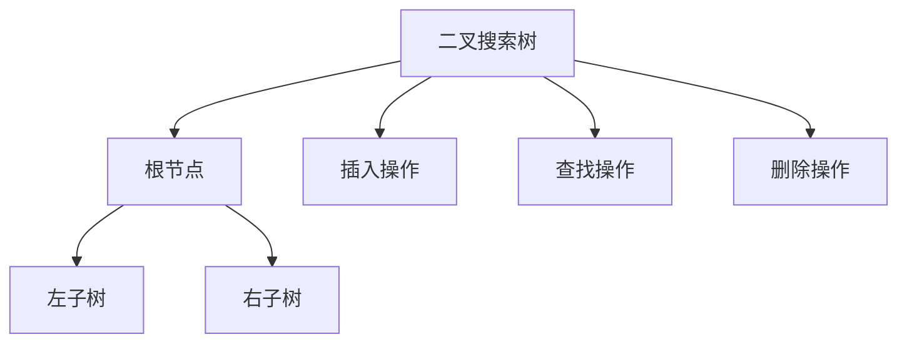
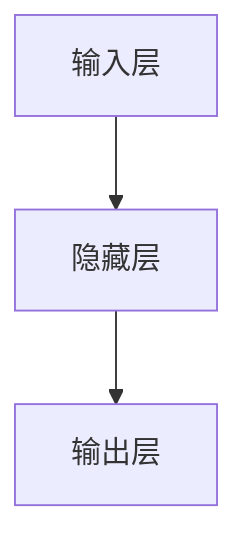
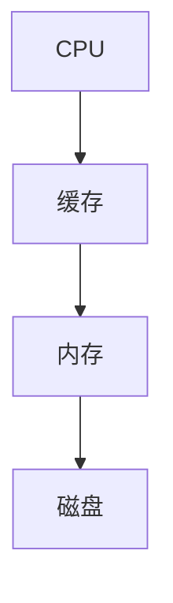

                 

### 《构建技术硬实力：P9工程师的必经之路》

#### 关键词：
- 技术硬实力
- P9工程师
- 成长路径
- 算法原理
- 数学模型
- 项目实战

#### 摘要：
本文深入探讨P9级别工程师所需的技术硬实力，通过详细分析技术发展、核心概念、算法原理、数学模型、项目实战等方面，为读者提供一条清晰的成长路径。文章结构紧凑、逻辑清晰，旨在帮助读者理解并掌握P9工程师所需的关键技能，助力其在技术领域取得卓越成就。

## 引言与概述

在当今快速发展的科技时代，技术人才的需求与日俱增。P9工程师，即高级资深技术专家，作为公司技术核心力量，承担着推动技术创新、解决复杂技术问题的重要职责。然而，要成为P9级别工程师，不仅需要深厚的专业知识和技能，更要有系统化的成长路径和方法论。

本书旨在为P9工程师及其潜力培养者提供一套完整的技术硬实力构建指南。我们将从技术发展趋势出发，分析P9工程师所需的核心技能和知识体系，详细介绍算法原理、数学模型，并通过实际项目实战，帮助读者理解并掌握这些技术在实际应用中的具体实现。此外，本书还将介绍开发环境的搭建和代码实现，确保读者能够将理论知识转化为实践能力。

本书的结构安排合理，内容循序渐进，首先介绍技术发展趋势与P9工程师的职业路径，接着讲解核心概念和技术栈，随后深入探讨算法原理和数学模型，最后通过项目实战和代码实现，帮助读者巩固所学知识，提升技术实力。

## 核心概念

要成为P9工程师，首先需要了解技术栈和技能树的构成。技术栈是指一个工程师在项目中可能用到的所有技术工具和框架的集合，而技能树则是指工程师在不同阶段需要掌握的核心技能。

### 技术栈

技术栈可以分为以下几个层次：

1. **基础层次**：包括编程语言（如Python、Java）、数据库（如MySQL、MongoDB）、前端框架（如React、Vue）等。
2. **应用层次**：涉及具体应用领域的专业技术和工具，如大数据处理（Hadoop、Spark）、人工智能（TensorFlow、PyTorch）等。
3. **框架层次**：如Docker、Kubernetes等容器化技术和微服务架构。
4. **平台层次**：如云计算平台（AWS、Azure）、大数据平台（Hadoop、Spark）等。

### 技能树

技能树则包括以下几个方面：

1. **算法与数据结构**：掌握基本的数据结构与算法，如排序、搜索、动态规划等。
2. **软件开发**：熟悉软件开发流程，包括需求分析、设计、编码、测试、部署等。
3. **系统设计**：能够进行系统架构设计，理解分布式系统、微服务架构等概念。
4. **团队协作**：具备良好的团队沟通和协作能力，能够带领团队完成复杂项目。

### 技术硬实力的构成

技术硬实力主要包括以下几个方面：

1. **专业知识**：对相关技术领域的深入理解，包括原理、应用场景和最佳实践。
2. **实践经验**：通过实际项目积累的实战经验，能够解决复杂技术问题。
3. **创新能力**：能够不断学习新技术，提出创新性解决方案。
4. **解决问题的能力**：具备独立分析和解决问题的能力，能够快速定位问题并提出解决方案。

## 算法原理

算法原理是P9工程师的核心竞争力之一。在本书中，我们将详细介绍常见数据结构与算法、机器学习与深度学习基础，以及算法优化与性能调优。

### 常见数据结构与算法

数据结构与算法是计算机科学的基础，以下是几个常见的数据结构和对应的算法：

1. **数组**：支持随机访问，适用于查询频繁的场景。
2. **链表**：支持插入和删除操作，适用于动态变化的场景。
3. **栈和队列**：分别适用于后进先出和先进先出的操作。
4. **树**：包括二叉树、平衡树（如AVL树、红黑树）等，适用于组织层次结构。
5. **图**：适用于网络、社交图等复杂关系场景。

以下是一个简单的二叉搜索树的Mermaid流程图：



### 机器学习与深度学习基础

机器学习和深度学习是当前科技领域的热门话题。以下是几个基础概念：

1. **监督学习**：有标记数据，通过学习数据来预测新数据。
2. **无监督学习**：没有标记数据，通过学习数据结构来发现数据中的模式。
3. **深度学习**：基于多层神经网络，能够自动学习数据中的特征。

以下是一个简单的神经网络结构的Mermaid流程图：



### 算法优化与性能调优

算法优化和性能调优是提升系统效率的重要手段。以下是一些常见的优化方法：

1. **算法复杂度优化**：降低时间复杂度和空间复杂度。
2. **数据结构优化**：选择合适的数据结构来提高效率。
3. **并行计算**：利用多核处理器来并行执行任务。
4. **缓存优化**：合理利用缓存来减少磁盘I/O操作。

以下是一个简单的缓存机制的Mermaid流程图：



## 数学模型

数学模型是算法设计和分析的基础。在本书中，我们将介绍线性代数基础、概率论与数理统计，以及最优化理论。

### 线性代数基础

线性代数是计算机科学中广泛应用的一个数学分支，包括矩阵运算、向量运算等。以下是一个矩阵乘法的LaTeX公式：

$$
C = A \cdot B
$$

### 概率论与数理统计

概率论与数理统计用于分析随机现象，包括概率分布、统计推断等。以下是一个二项分布的LaTeX公式：

$$
P(X = k) = C(n, k) \cdot p^k \cdot (1 - p)^{n - k}
$$

### 最优化理论

最优化理论用于求解优化问题，包括线性规划、非线性规划等。以下是一个线性规划的LaTeX公式：

$$
\min_{x} c^T x \\
s.t. \\
Ax \leq b
$$

## 项目实战

项目实战是检验工程师技术实力的关键环节。在本章中，我们将通过一个实际案例，详细讲解如何从需求分析、系统设计到代码实现，完整地完成一个项目。

### 项目选择与规划

选择一个合适的案例对于项目实战至关重要。我们可以选择一个大数据处理项目，例如数据清洗和数据分析。这个项目涉及到多种技术，包括Python、Hadoop、Spark等。

### 实际案例分析

假设我们需要对大量用户行为数据进行分析，提取出用户兴趣和偏好。以下是项目的具体实施步骤：

1. **数据采集**：从不同渠道获取用户行为数据，包括浏览记录、购买记录等。
2. **数据预处理**：清洗和整合数据，去除重复和错误数据。
3. **数据存储**：使用Hadoop分布式文件系统（HDFS）存储预处理后的数据。
4. **数据分析**：使用Spark进行大规模数据分析，提取用户兴趣和偏好。
5. **可视化展示**：使用Python的Matplotlib库生成可视化图表，展示分析结果。

### 技术实现与代码解读

以下是一个简单的数据清洗和数据分析的Python代码示例：

```python
import pandas as pd
from pyspark.sql import SparkSession

# 创建Spark会话
spark = SparkSession.builder.appName("DataAnalysis").getOrCreate()

# 读取数据
data = pd.read_csv("user_behavior.csv")

# 数据清洗
data.drop_duplicates(inplace=True)
data.fillna(0, inplace=True)

# 存储清洗后的数据
data.to_csv("cleaned_user_behavior.csv", index=False)

# 使用Spark进行数据分析
data_spark = spark.createDataFrame(data)

# 计算用户兴趣和偏好
interest = data_spark.groupBy("user_id").agg(
    (data_spark["page_view_count"] / data_spark["purchase_count"]).alias("interest_score")
)

# 存储分析结果
interest.write.csv("user_interest.csv", header=True)

# 关闭Spark会话
spark.stop()
```

### 项目小结

通过这个项目，我们不仅学习了数据清洗和数据分析的方法，还掌握了Hadoop、Spark等大数据处理工具的使用。项目实战不仅提升了我们的技术实力，也锻炼了我们的项目管理和团队协作能力。

## 环境搭建与代码实现

在项目实战中，环境搭建和代码实现是关键步骤。以下是具体的操作步骤：

### 环境搭建

1. **安装Python**：下载并安装Python，配置环境变量。
2. **安装Spark**：下载并解压Spark安装包，配置环境变量。
3. **配置Hadoop**：下载并配置Hadoop，确保Hadoop服务正常运行。

### 代码实现

1. **编写Python代码**：使用Pandas库进行数据清洗，使用Spark进行数据分析。
2. **调试与优化**：调试代码，优化性能。

### 代码解读与分析

代码实现部分的详细解读和分析将帮助读者理解数据清洗、数据分析和分布式计算的核心原理，以及如何在实际项目中应用这些技术。

## 最佳实践 Tips

在技术成长过程中，以下是一些最佳实践Tips：

1. **持续学习**：定期学习新技术，保持技术前沿。
2. **实战演练**：多参与项目实战，积累经验。
3. **团队协作**：提升团队协作能力，学会有效沟通。
4. **代码规范**：编写规范、高质量的代码。

## 小结

通过本文的探讨，我们详细介绍了P9工程师所需的技术硬实力，从核心概念、算法原理、数学模型到项目实战，提供了完整的构建路径。希望本文能够为P9工程师的成长提供有价值的参考，助力读者在技术领域取得卓越成就。

## 附录

### 8.1 参考文献

1. 《深度学习》，Ian Goodfellow、Yoshua Bengio和Aaron Courville著。
2. 《大数据技术导论》，刘铁岩著。
3. 《Hadoop技术内幕》，Scott R. Lystig著。

### 8.2 资源链接

1. [Python官方文档](https://docs.python.org/3/)
2. [Spark官方文档](https://spark.apache.org/docs/latest/)
3. [Hadoop官方文档](https://hadoop.apache.org/docs/r3.3.0/hadoop-project-dist/hadoop-common/)

### 8.3 附录代码与数据

- 数据清洗和数据分析的Python代码
- 实际项目中使用的Spark SQL查询语句
- Hadoop和Spark的配置文件

### 作者

- 作者：AI天才研究院/AI Genius Institute & 禅与计算机程序设计艺术 /Zen And The Art of Computer Programming

