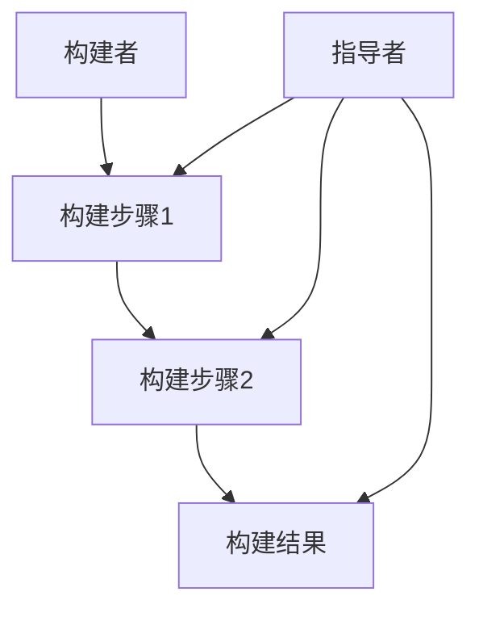

                 

### 让我们一步步思考：构建者模式的核心

构建者模式（Builder Pattern）是一种设计模式，主要用于创建复杂对象。它将一个复杂对象的构建与其表示分离，使得同样的构建过程可以创建不同的表示。构建者模式的核心在于提供一个构建步骤的框架，使得我们可以按照特定的顺序构建对象，同时允许我们扩展和修改构建过程。

首先，让我们来理解构建者模式的基本组成：

1. **构建者类（Builder Class）**：这是一个抽象类或接口，定义了构建一个产品对象所需的构建步骤。
2. **产品类（Product Class）**：这是一个代表构建结果的对象类。
3. **指导者类（Director Class）**：这是一个负责调用构建者类中的构建方法的类，指导构建过程，确保构建出符合要求的产品对象。

**核心概念与联系**

构建者模式中的各个类和对象之间的关系可以用以下Mermaid流程图来表示：

- **构建者类**负责定义构建步骤，这些步骤通常是构建产品对象所需的一系列操作。
- **产品类**是一个简单的类，它代表了构建者最终需要构建出的对象。这个类通常包含一些用于存储构建步骤结果的属性。
- **指导者类**负责调用构建者的构建步骤，并负责将构建步骤的结果组合成一个完整的对象。

**构建步骤**

构建者模式的核心在于构建步骤的抽象和封装。构建步骤可以是任何顺序的，也可以是可重复的。以下是一个简单的构建步骤示例：

1. **初始化产品对象**：在构建开始时，创建一个产品对象的实例。
2. **构建第一个部分**：通过构建者的方法为产品对象设置第一个部分。
3. **构建第二个部分**：通过构建者的另一个方法为产品对象设置第二个部分。
4. **返回产品对象**：在所有构建步骤完成后，构建者返回构建完成的产品对象。

**构建者模式与传统对象创建方式比较**

传统的对象创建方式通常是通过直接使用构造函数来创建对象。这种方式简单直观，但是当对象的构建过程变得复杂时，构造函数很快就变得难以管理。相反，构建者模式通过将构建过程分解为一系列步骤来简化对象的构建。这种分解使得我们可以更容易地理解和修改构建过程。

### 总结

构建者模式的核心在于提供了一种类型化的对象创建过程，使得我们可以更灵活地创建复杂对象，同时保持代码的清晰性和可维护性。通过理解构建者模式的基本组成部分和构建步骤，我们可以更好地掌握这一模式，并将其应用于实际的软件开发中。接下来，我们将深入探讨构建者模式的实现细节和最佳实践。请继续阅读，以了解更多关于构建者模式的精彩内容。

