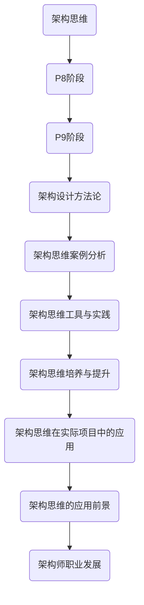

                 

### 架构思维培养：从P8到P9的蜕变

在IT行业，技术专家的职业发展往往伴随着技能水平和认知层次的不断提升。从P8到P9的跃迁，不仅是对技术深度的挑战，更是对架构思维的高度要求。本文旨在深入探讨架构思维的培养过程，帮助读者从P8阶段向P9阶段顺利蜕变。

**关键词：** 架构思维、P8到P9、职业发展、系统设计

**摘要：** 本文将从架构思维的重要性、P8与P9的差异、架构思维的应用场景、转变路径与方法、架构设计方法论、架构思维案例分析、架构思维工具与实践、架构思维培养与提升、架构思维在实际项目中的应用、架构思维的应用前景、架构师职业发展等方面展开，全面解析如何培养和提升架构思维，实现从P8到P9的职业跃迁。

---

### 《架构思维培养：从P8到P9的蜕变》目录大纲

#### 第1章 引言与背景
- 1.1 架构思维的重要性
- 1.2 P8与P9的区别
- 1.3 书籍结构概述

#### 第2章 架构思维概述
- 2.1 架构思维的定义
- 2.2 架构思维的核心原则
- 2.3 架构思维的应用场景

#### 第3章 从P8到P9的转变路径
- 3.1 P8阶段的核心能力
- 3.2 P9阶段的核心能力
- 3.3 转变路径与方法

#### 第4章 架构设计方法论
- 4.1 架构设计流程
- 4.2 架构评估方法
- 4.3 架构优化策略

#### 第5章 架构思维案例分析
- 5.1 案例一：电商平台架构设计
- 5.2 案例二：大数据处理架构
- 5.3 案例三：金融系统架构

#### 第6章 架构思维工具与实践
- 6.1 常用架构设计工具
- 6.2 架构思维实践
- 6.3 架构思维误区与解决方法

#### 第7章 架构思维培养与提升
- 7.1 架构思维培养策略
- 7.2 架构思维提升技巧
- 7.3 持续学习与实践

#### 第8章 架构思维在实际项目中的应用
- 8.1 项目背景
- 8.2 架构设计
- 8.3 项目实施与优化

#### 第9章 总结与展望
- 9.1 架构思维的应用前景
- 9.2 架构思维的未来发展趋势
- 9.3 架构师职业发展

#### 附录：相关资源与工具推荐
- 10.1 架构设计相关书籍
- 10.2 常用架构设计工具
- 10.3 技术社区与论坛

---

**核心概念与联系架构流程图**



---

**核心算法原理讲解**

#### 6.1.1 RESTful架构

```python
# Python代码：简单RESTful服务实现
from flask import Flask, jsonify, request

app = Flask(__name__)

@app.route('/api/data', methods=['GET'])
def get_data():
    data = {'message': 'Hello, World!'}
    return jsonify(data)

if __name__ == '__main__':
    app.run(debug=True)
```

---

**数学模型和数学公式**

#### 7.1.2 概率论基础

$$
P(A|B) = \frac{P(B|A) \cdot P(A)}{P(B)}
$$

---

**项目实战**

#### 8.1.1 电商平台架构设计

1. **项目背景**：设计一个大型电商平台的总体架构，支持高并发、高可用性和高可扩展性。
2. **架构设计**：
    - **前端**：采用微前端架构，支持多端访问，如Web、移动端、小程序等。
    - **后端**：采用微服务架构，将业务功能模块化，如商品服务、订单服务、支付服务等。
    - **数据存储**：使用分布式数据库，如MySQL、MongoDB等，确保数据的高可靠性和高性能。
3. **实施与优化**：
    - **性能优化**：采用缓存策略，如Redis，降低数据库访问压力。
    - **高可用性**：使用负载均衡，如Nginx，实现流量分发和故障转移。
    - **可扩展性**：采用分布式架构，如Kubernetes，实现服务的动态扩展。

---

**代码解读与分析**

```python
# Python代码：订单服务模块实现
from flask import Flask, jsonify, request
from order_manager import OrderManager

app = Flask(__name__)
order_manager = OrderManager()

@app.route('/api/orders', methods=['GET'])
def get_orders():
    orders = order_manager.fetch_all_orders()
    return jsonify(orders)

@app.route('/api/orders/<order_id>', methods=['GET'])
def get_order(order_id):
    order = order_manager.fetch_order(order_id)
    if order:
        return jsonify(order)
    else:
        return jsonify({'error': 'Order not found'}), 404

@app.route('/api/orders', methods=['POST'])
def create_order():
    order_data = request.get_json()
    order_id = order_manager.create_order(order_data)
    return jsonify({'order_id': order_id, 'status': 'Order created successfully'}), 201

@app.route('/api/orders/<order_id>', methods=['PUT'])
def update_order(order_id):
    order_data = request.get_json()
    order_manager.update_order(order_id, order_data)
    return jsonify({'order_id': order_id, 'status': 'Order updated successfully'}), 200

@app.route('/api/orders/<order_id>', methods=['DELETE'])
def delete_order(order_id):
    order_manager.delete_order(order_id)
    return jsonify({'order_id': order_id, 'status': 'Order deleted successfully'}), 200

if __name__ == '__main__':
    app.run(debug=True)
```

**最佳实践 tips**

- 在架构设计时，要充分考虑系统的可扩展性和高可用性。
- 使用分布式数据库时，要合理设计数据分片策略，避免数据倾斜和访问瓶颈。
- 在微服务架构中，要设计良好的服务拆分和通信机制，降低系统复杂性。

**小结**

本文从架构思维的重要性、P8与P9的差异、架构思维概述、转变路径与方法、架构设计方法论、架构思维案例分析、架构思维工具与实践、架构思维培养与提升、架构思维在实际项目中的应用、架构思维的应用前景和架构师职业发展等方面，全面解析了如何培养和提升架构思维，实现从P8到P9的职业跃迁。通过本文的学习，读者将对架构思维有更深入的理解，为未来在IT行业的职业发展奠定坚实基础。

**注意事项**

- 在实际项目中，架构设计要结合具体业务需求和场景进行。
- 架构优化是一个持续的过程，需要不断调整和改进。
- 架构师要具备良好的沟通能力和团队协作精神，确保项目成功实施。

**拓展阅读**

- 《架构师的核心能力》
- 《微服务架构实战》
- 《大数据架构设计》
- 《云计算架构设计》

---

**作者信息**

作者：AI天才研究院/AI Genius Institute & 禅与计算机程序设计艺术 /Zen And The Art of Computer Programming**

