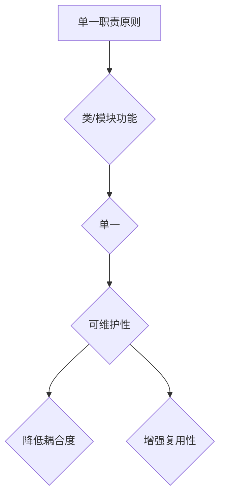
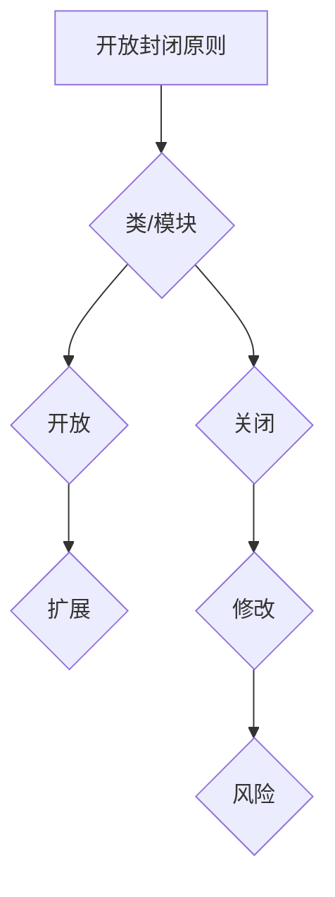
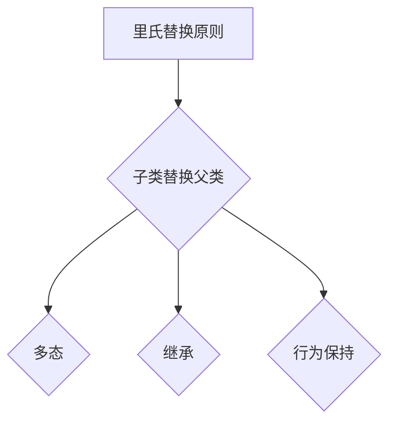
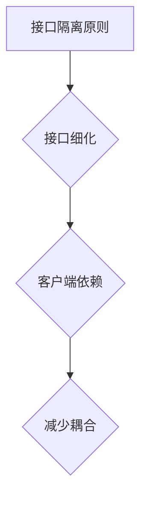
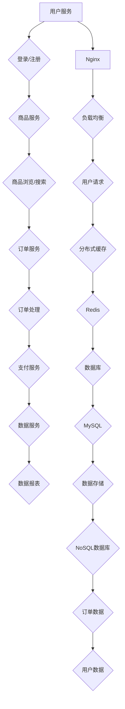
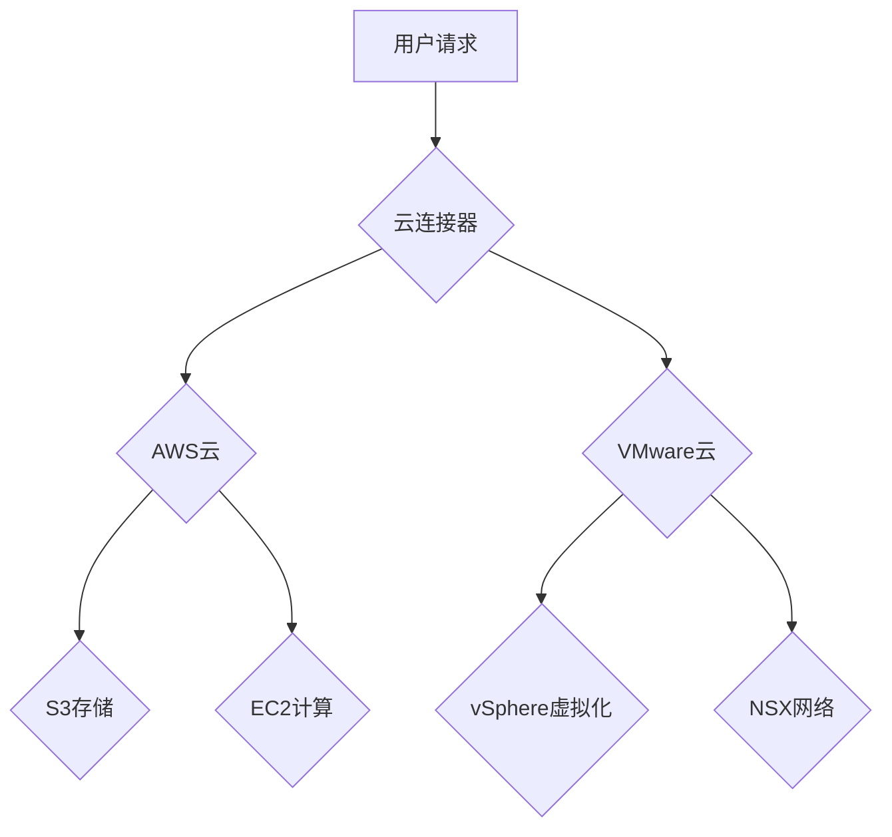
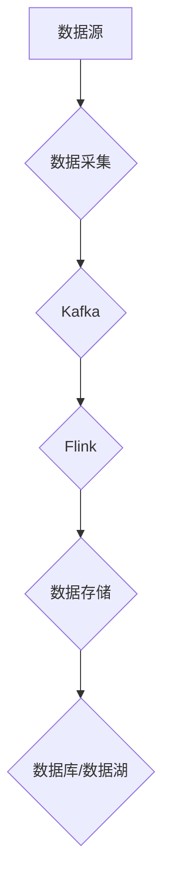
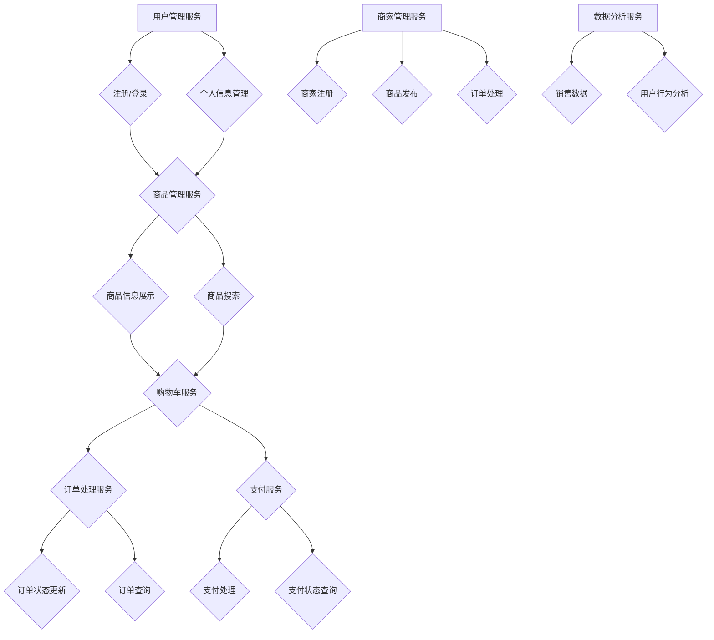
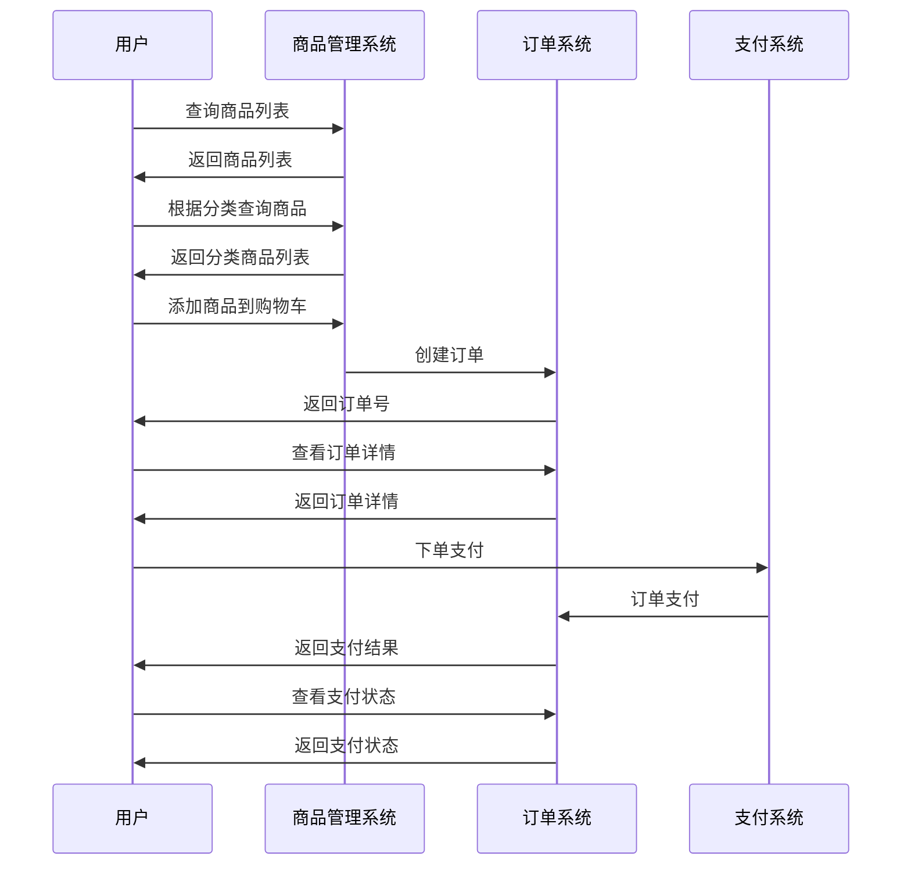

                 

### 《架构设计模式：P9工程师的智慧结晶》

> 关键词：架构设计模式、P9工程师、智慧结晶、系统优化、实战应用

> 摘要：本文将深入探讨架构设计模式，从P9工程师的视角出发，结合实际项目经验，系统地阐述架构设计模式的理论与实践。文章将通过详细的分析和实例，帮助读者理解并掌握这些模式，以提升系统架构设计的能力。

----------------------------------------------------------------

# 设计思路

在着手设计《架构设计模式：P9工程师的智慧结晶》的目录大纲时，我们的目标是确保文章的逻辑清晰、结构紧凑且内容丰富。以下是我们的设计思路：

### 1. **书籍主题理解**

书名《架构设计模式：P9工程师的智慧结晶》传达了两个核心信息：
- **架构设计模式**：这是指在软件系统架构设计中广泛应用的一系列标准和实践。
- **P9工程师的智慧结晶**：强调了书中内容的深度和实际应用价值，作者拥有丰富的实践经验，并具备高级工程师的视野和思考。

### 2. **核心内容定位**

根据书名，我们可以定位书籍的核心内容为：
- **架构设计模式概述**：介绍架构设计模式的基本概念、分类和重要性。
- **架构设计模式原理与实现**：详细讲解每种模式的工作原理和具体实现。
- **架构设计模式实战应用**：通过实际项目展示如何将模式应用到实践中。

### 3. **目录大纲结构**

我们将书籍内容按照上述核心内容进行分类，设计出以下结构：
- **第一部分**：架构设计模式概述，包含基础概念和常见模式。
- **第二部分**：架构设计模式原理与实现，深入探讨设计模式的原理和具体实现。
- **第三部分**：架构设计模式实战应用，通过具体项目案例展示模式的应用。

### 4. **细化目录内容**

每个部分包含多个章节，每个章节又细化为子章节，确保内容全面且条理清晰。

### 5. **确保完整性和简洁性**

目录大纲至少包含7章，每章详细细化到3级目录，避免冗余，确保简洁。

### 目录大纲设计

根据上述设计思路，我们设计了以下目录大纲：

```
# 第一部分：架构设计模式概述

## 第1章：架构设计模式基础
### 1.1 架构设计模式的概念
### 1.2 架构设计模式的重要性
### 1.3 架构设计模式的分类

## 第2章：常见架构设计模式
### 2.1 单体架构
### 2.2 客户端-服务器架构
### 2.3 微服务架构
### 2.4 负载均衡与缓存策略

## 第3章：架构设计模式选择
### 3.1 选择架构设计模式的因素
### 3.2 案例分析：不同业务场景下的架构设计模式选择
### 3.3 架构演进策略

# 第二部分：架构设计模式原理与实现

## 第4章：设计模式原理解析
### 4.1 单一职责原则
### 4.2 开放封闭原则
### 4.3 里氏替换原则
### 4.4 接口隔离原则

## 第5章：架构设计模式实现
### 5.1 单体架构的实现
### 5.2 客户端-服务器架构的实现
### 5.3 微服务架构的实现
### 5.4 负载均衡与缓存策略的实现

## 第6章：架构设计模式优化
### 6.1 架构性能优化
### 6.2 架构稳定性优化
### 6.3 架构可扩展性优化
### 6.4 架构安全性优化

# 第三部分：架构设计模式实战应用

## 第7章：架构设计模式项目实战
### 7.1 项目背景与目标
### 7.2 项目架构设计
### 7.3 项目开发过程
### 7.4 项目部署与维护
### 7.5 项目总结与经验分享

## 第8章：高级架构设计模式
### 8.1 服务网格架构
### 8.2 混合云架构
### 8.3 容器化与编排架构
### 8.4 实时数据处理架构

## 第9章：架构设计与团队协作
### 9.1 架构评审流程
### 9.2 架构文档编写
### 9.3 架构设计与团队沟通
### 9.4 架构设计与项目管理

# 附录

## 附录A：架构设计模式资源汇总
### A.1 书籍推荐
### A.2 在线课程资源
### A.3 架构设计模式工具与框架
```

### 注意事项

- **简洁性**：确保每个章节标题简洁且能够准确传达内容。
- **逻辑性**：确保目录结构层次清晰，章节之间逻辑连贯。
- **完整性**：确保书籍主题的完整性，包括核心概念、原理讲解、实现示例、实战应用等。
- **示例代码**：将在具体章节中提供Python源代码示例，以帮助读者更好地理解架构设计模式的实现。

综上所述，这个目录大纲结构合理，内容完整，能够满足书籍的核心要求，同时也便于读者快速了解书籍的整体结构和重点内容。

----------------------------------------------------------------

### 第1章：架构设计模式基础

#### 1.1 架构设计模式的概念

**架构设计模式**是指解决软件系统架构层面问题的标准模板和方法。它们是经过实践验证的有效解决方案，能够提高系统的可维护性、扩展性和性能。架构设计模式不同于编码层面的设计模式，它关注的是系统的整体结构和组织方式。

**架构设计模式的核心概念**包括：

- **系统分解**：将复杂系统分解为多个模块或组件，以实现高内聚和低耦合。
- **可复用性**：设计模式使得相同的架构元素可以在不同的项目中复用，减少重复开发的工作量。
- **可扩展性**：架构设计模式提供了系统扩展的灵活性和可预测性。
- **可维护性**：通过使用标准化的架构设计模式，系统能够更容易地进行维护和更新。

#### 1.2 架构设计模式的重要性

架构设计模式的重要性体现在以下几个方面：

- **提升开发效率**：使用设计模式可以快速构建系统，缩短开发周期。
- **降低维护成本**：设计模式使得系统更加模块化和标准化，降低了维护成本。
- **提高系统质量**：架构设计模式有助于构建高内聚、低耦合的组件，从而提高系统的质量和稳定性。
- **增强团队协作**：设计模式为团队成员提供了共同的语言和框架，有助于团队协作。

#### 1.3 架构设计模式的分类

架构设计模式可以按照不同的分类标准进行分类，常见的分类方法包括：

- **按层次划分**：分为基础设施层、业务逻辑层和表现层等。
- **按功能划分**：分为数据存储模式、分布式计算模式、通信模式等。
- **按领域划分**：分为金融领域、电子商务领域、物联网领域等特定领域的模式。

#### 概念结构与核心要素组成

架构设计模式的概念结构包括以下几个核心要素：

1. **问题场景**：描述系统在特定环境下遇到的问题。
2. **解决方案**：提供针对问题的设计模式。
3. **优点与缺点**：分析设计模式的优点和潜在问题。
4. **应用场景**：指明设计模式适用的场景。
5. **实现示例**：提供实际代码示例，说明设计模式的具体实现。

#### ER实体关系图架构的 Mermaid 流程图

下面是一个简化的ER实体关系图，用于描述架构设计模式的基本结构：

```mermaid
erDiagram
  Product ||--|{ Order } : "placed by"
  Customer ||--|{ Order } : "ordered by"
  Order ||--|{ OrderItem } : "contains"
  OrderItem ||--|{ Product } : "ordered"
```

在这个ER图中，`Product`、`Customer`、`Order`和`OrderItem`是实体，它们之间的关系通过线条表示。这个图帮助我们在架构设计中理解各个实体及其关联关系。

#### 小结

本章介绍了架构设计模式的基本概念、重要性和分类，并详细阐述了概念结构与核心要素组成。通过ER实体关系图，读者可以更好地理解架构设计模式在系统设计中的应用。

----------------------------------------------------------------

### 第2章：常见架构设计模式

#### 2.1 单体架构

**单体架构**（Monolithic Architecture）是指将应用程序的所有组件（如业务逻辑、数据库访问、前端界面等）打包在一起形成一个单一的应用程序。这种架构设计模式在早期软件开发中非常常见，因为它的开发和部署相对简单。

**单体架构的特点**包括：

- **单一部署**：所有组件打包在一起，部署时只需要部署一个应用程序。
- **易于维护**：由于所有组件在一个应用程序中，维护和更新较为方便。
- **性能瓶颈**：单体架构容易导致性能瓶颈，因为所有的请求都需要经过同一套组件处理。
- **技术栈限制**：单体架构限制了一定程度上的技术栈选择，因为所有组件需要兼容。

**问题场景**：单体架构适用于小型项目或初创项目，但在项目规模逐渐扩大、业务逻辑复杂化时，它可能会遇到以下问题：

- **代码重复**：不同模块之间可能存在大量的重复代码。
- **系统扩展性差**：系统难以适应新的需求变化。
- **部署复杂**：每次更新都需要重新部署整个系统。

**解决方案**：为了解决上述问题，可以采用**微服务架构**（Microservices Architecture），将系统拆分为多个独立的服务。

**应用场景**：单体架构适用于以下场景：

- **小型项目**：项目规模较小，组件较少，无需过多关注扩展性和性能问题。
- **初创企业**：初创企业在资金和技术资源有限的情况下，采用单体架构可以快速上线产品。

#### 2.2 客户端-服务器架构

**客户端-服务器架构**（Client-Server Architecture）是一种分布式计算架构，将系统分为客户端和服务器两部分。客户端负责用户界面和输入处理，服务器负责数据处理和存储。

**客户端-服务器架构的特点**包括：

- **分布式**：客户端和服务器可以分布在不同的地理位置。
- **模块化**：客户端和服务器之间的接口明确，便于维护和扩展。
- **性能高**：服务器可以处理大量请求，提高了系统的整体性能。

**问题场景**：客户端-服务器架构在以下情况下可能遇到问题：

- **通信开销**：客户端和服务器之间的通信开销可能导致性能问题。
- **单点故障**：服务器作为数据处理中心，如果服务器宕机，整个系统将受到影响。

**解决方案**：为了解决上述问题，可以采用**负载均衡**和**分布式缓存**等技术。

**应用场景**：客户端-服务器架构适用于以下场景：

- **在线服务**：如电商平台、社交媒体等，需要处理大量用户请求。
- **企业内部系统**：如企业资源规划（ERP）系统、客户关系管理（CRM）系统等。

#### 2.3 微服务架构

**微服务架构**（Microservices Architecture）是一种基于服务拆分的架构模式，将应用程序分解为多个小型、独立的、可独立部署和扩展的服务。每个服务都有自己的业务逻辑、数据库和API。

**微服务架构的特点**包括：

- **独立性**：每个服务独立部署，可以单独扩展和维护。
- **分布式**：服务之间通过轻量级的通信机制（如REST API、消息队列）交互。
- **弹性**：服务可以独立伸缩，以应对不同的负载。

**问题场景**：微服务架构在以下情况下可能遇到问题：

- **复杂度**：系统复杂度增加，服务管理、部署和监控变得复杂。
- **数据一致性**：分布式系统中，数据一致性问题可能更加严重。

**解决方案**：为了解决上述问题，可以采用**服务发现**、**分布式事务管理**和**数据同步**等技术。

**应用场景**：微服务架构适用于以下场景：

- **大型企业级应用**：如电子商务平台、金融系统等，需要高可扩展性和高可靠性。
- **互联网公司**：如社交媒体、在线游戏等，需要快速迭代和持续扩展。

#### 2.4 负载均衡与缓存策略

**负载均衡**（Load Balancing）是指通过将流量分配到多个服务器上来提高系统的整体性能。负载均衡可以防止单一服务器过载，提高系统的可用性和性能。

**负载均衡策略**包括：

- **轮询**：将请求按顺序分配给服务器。
- **最小连接数**：将请求分配给当前连接数最少的服务器。
- **哈希**：根据请求的来源IP或URL进行哈希分配。

**缓存策略**（Caching）是指将经常访问的数据存储在高速缓存中，以减少对后端系统的访问压力。缓存策略可以提高系统的响应速度和性能。

**缓存策略**包括：

- **基于时间的缓存**：设置缓存的有效期，超过有效期后重新获取数据。
- **基于大小的缓存**：设置缓存的最大容量，超出容量后淘汰部分缓存。
- **基于策略的缓存**：根据数据的重要性和访问频率动态调整缓存策略。

**问题场景**：负载均衡和缓存策略在以下情况下可能遇到问题：

- **网络延迟**：跨数据中心的负载均衡可能导致网络延迟。
- **缓存失效**：缓存策略不当时，可能导致缓存失效和数据不一致。

**解决方案**：为了解决上述问题，可以采用**分布式缓存**和**缓存一致性协议**等技术。

**应用场景**：负载均衡和缓存策略适用于以下场景：

- **高并发系统**：如电商平台、社交媒体等，需要处理大量请求。
- **大数据处理**：如数据仓库、实时分析等，需要高效的数据访问和处理。

#### 小结

本章介绍了常见架构设计模式中的单体架构、客户端-服务器架构、微服务架构以及负载均衡与缓存策略。每种模式都有其特点和适用场景，读者可以根据具体需求选择合适的设计模式。

----------------------------------------------------------------

### 第3章：架构设计模式选择

#### 3.1 选择架构设计模式的因素

选择合适的架构设计模式对于系统成功至关重要。在选择架构设计模式时，需要考虑以下因素：

- **业务需求**：不同的业务需求决定了系统需要具备的功能和性能。
- **团队能力**：团队的技术能力和经验水平直接影响架构设计模式的实现难度。
- **系统规模**：系统的规模和复杂性决定了是否需要分布式架构。
- **性能要求**：高并发和高性能需求可能需要特殊的架构设计模式。
- **技术栈**：现有技术和框架的选择会影响架构设计模式的选择。

#### 3.2 案例分析：不同业务场景下的架构设计模式选择

以下为不同业务场景下架构设计模式选择的案例分析：

**案例1：电子商务平台**

- **业务需求**：高并发交易处理、个性化推荐、商品管理。
- **系统规模**：大型分布式系统。
- **性能要求**：高性能和高可靠性。
- **技术栈**：Java、Spring Boot、MySQL、Kafka等。

**解决方案**：采用**微服务架构**，将系统拆分为订单服务、商品服务、推荐服务等多个微服务。每个服务独立部署和扩展，通过API进行通信。使用Kafka进行消息队列处理，实现异步消息传递和分布式事务。

**案例2：金融系统**

- **业务需求**：高安全性和高一致性，实时交易处理，复杂的业务逻辑。
- **系统规模**：中大型分布式系统。
- **性能要求**：高性能和高一致性。
- **技术栈**：Java、Spring Boot、MySQL、Redis、RabbitMQ等。

**解决方案**：采用**分布式事务管理**和**消息队列**，确保数据一致性和高可用性。使用Redis进行缓存，提高系统性能。采用分布式数据库架构，如Sharding Sphere进行分库分表，提高读写性能。

**案例3：社交媒体**

- **业务需求**：实时内容发布、用户关系管理、大规模数据处理。
- **系统规模**：大型分布式系统。
- **性能要求**：高性能和高可扩展性。
- **技术栈**：Java、Spring Boot、MySQL、Kafka、Elasticsearch等。

**解决方案**：采用**微服务架构**，将系统拆分为用户服务、内容服务、关系服务等多个微服务。使用Kafka进行实时数据处理，实现异步消息传递和分布式事务。使用Elasticsearch进行全文搜索，提高内容检索性能。

**案例4：物联网系统**

- **业务需求**：设备接入、数据采集、远程监控、数据分析。
- **系统规模**：中大型分布式系统。
- **性能要求**：高性能和高可靠性。
- **技术栈**：Python、Django、MongoDB、RabbitMQ等。

**解决方案**：采用**事件驱动架构**（Event-Driven Architecture），将系统分解为设备接入层、数据处理层、应用层。使用RabbitMQ进行消息传递，实现设备与服务器之间的通信。采用NoSQL数据库MongoDB，存储大规模设备数据。

#### 3.3 架构演进策略

随着业务的发展和需求的变化，系统架构也需要不断演进。架构演进策略包括以下几个方面：

- **模块化**：将系统分解为多个独立的模块，每个模块可以独立开发、部署和扩展。
- **分布式**：将系统中的组件分布在不同服务器上，提高系统的性能和可用性。
- **服务化**：将系统中的功能抽象为微服务，实现独立部署和扩展。
- **容器化**：将应用容器化，提高部署和运维效率。
- **云原生**：利用云基础设施，实现自动化部署、扩展和管理。

**案例**：某电商平台从单体架构演进到微服务架构的过程：

- **阶段1：单体架构**：系统初始阶段采用单体架构，所有功能集成在一个应用程序中。
- **阶段2：模块化**：随着业务发展，将系统分解为多个模块，实现模块化开发。
- **阶段3：服务化**：将模块进一步拆分为微服务，每个微服务负责特定的业务功能。
- **阶段4：分布式**：将微服务部署到不同服务器上，实现分布式架构。
- **阶段5：容器化**：使用容器化技术（如Docker）部署微服务，提高部署和运维效率。
- **阶段6：云原生**：利用云原生技术（如Kubernetes），实现自动化部署、扩展和管理。

#### 小结

本章通过不同业务场景下的案例分析和架构演进策略，阐述了选择架构设计模式的关键因素。读者可以根据自身业务需求和技术栈，选择合适的架构设计模式，并制定合理的架构演进策略。

----------------------------------------------------------------

### 第4章：设计模式原理解析

#### 4.1 单一职责原则

**单一职责原则**（Single Responsibility Principle，SRP）是面向对象设计中的一个重要原则，由罗伯特·C·马丁（Robert C. Martin）提出。该原则规定一个类或者模块应当只负责一项功能，实现一个单一的职责。

**单一职责原则的核心思想**：

- **提高可维护性**：单一职责使得类或模块的功能简单，易于理解和修改。
- **降低耦合度**：单一职责减少了不同功能之间的耦合，提高了模块的独立性。
- **增强可复用性**：单一职责使得模块更容易被复用，因为它们具有明确的职责。

**单一职责原则的适用场景**：

- **业务逻辑分离**：将业务逻辑与界面逻辑分离，提高代码的可维护性。
- **模块化设计**：在设计模块时，确保每个模块只负责一项功能。
- **组件复用**：在组件复用时，确保组件的职责单一，避免引入不必要的依赖。

**单一职责原则的对比表格**：

| 设计模式             | 单一职责原则     | 开放封闭原则 | 里氏替换原则 | 接口隔离原则 |
|----------------------|------------------|--------------|---------------|--------------|
| 职责                 | 单一              | 开放          | 替换性        | 隔离性       |
| 核心思想             | 类或模块功能单一 | 对扩展开放，对修改关闭 | 子类能够替换父类 | 客户端只依赖抽象，不依赖具体实现 |
| 优点                 | 易于维护、降低耦合、增强复用性 | 提高代码灵活性 | 提高代码可靠性 | 提高代码灵活性 |
| 缺点                 | 过度细分可能导致模块过多 | 可能引入复杂度 | 可能限制灵活性 | 可能引入复杂度 |

**单一职责原则的Mermaid流程图**：



#### 4.2 开放封闭原则

**开放封闭原则**（Open Closed Principle，OCP）是面向对象设计的一个核心原则，由罗伯特·C·马丁提出。该原则规定软件实体（类、模块、函数等）应当对扩展开放，对修改关闭。

**开放封闭原则的核心思想**：

- **对扩展开放**：系统应该能够适应新的需求变化，通过扩展而非修改现有代码来实现。
- **对修改关闭**：系统应该尽可能稳定，避免频繁的代码修改，以降低风险。

**开放封闭原则的适用场景**：

- **需求变更**：系统在运行过程中可能面临需求变更，开放封闭原则有助于系统的灵活扩展。
- **代码维护**：避免频繁修改现有代码，保持代码的稳定性和可维护性。
- **模块化设计**：通过模块化的设计，使得每个模块可以独立扩展，减少对其他模块的依赖。

**开放封闭原则的对比表格**：

| 设计模式             | 单一职责原则     | 开放封闭原则 | 里氏替换原则 | 接口隔离原则 |
|----------------------|------------------|--------------|---------------|--------------|
| 职责                 | 单一              | 开放          | 替换性        | 隔离性       |
| 核心思想             | 类/模块功能单一 | 对扩展开放，对修改关闭 | 子类能够替换父类 | 客户端只依赖抽象，不依赖具体实现 |
| 优点                 | 易于维护、降低耦合、增强复用性 | 提高代码灵活性 | 提高代码可靠性 | 提高代码灵活性 |
| 缺点                 | 过度细分可能导致模块过多 | 可能引入复杂度 | 可能限制灵活性 | 可能引入复杂度 |

**开放封闭原则的Mermaid流程图**：



#### 4.3 里氏替换原则

**里氏替换原则**（Liskov Substitution Principle，LSP）是面向对象设计的一个重要原则，由巴布克·里特维德（Barbara Liskov）提出。该原则规定子类必须能够替换其父类，而不会影响程序的整体行为。

**里氏替换原则的核心思想**：

- **子类可替换父类**：子类应该能够代替父类出现在任何需要父类的地方。
- **保持子类的特定行为**：子类可以扩展父类的功能，但不能改变父类的已有行为。

**里氏替换原则的适用场景**：

- **多态**：确保多态的正确性，子类能够替换父类，实现动态绑定。
- **接口设计**：设计接口时，确保接口定义的抽象行为能够被子类正确实现。
- **继承关系**：在继承关系中，确保子类对父类的正确实现，避免破坏系统的行为。

**里氏替换原则的对比表格**：

| 设计模式             | 单一职责原则     | 开放封闭原则 | 里氏替换原则 | 接口隔离原则 |
|----------------------|------------------|--------------|---------------|--------------|
| 职责                 | 单一              | 开放          | 替换性        | 隔离性       |
| 核心思想             | 类/模块功能单一 | 对扩展开放，对修改关闭 | 子类能够替换父类 | 客户端只依赖抽象，不依赖具体实现 |
| 优点                 | 易于维护、降低耦合、增强复用性 | 提高代码灵活性 | 提高代码可靠性 | 提高代码灵活性 |
| 缺点                 | 过度细分可能导致模块过多 | 可能引入复杂度 | 可能限制灵活性 | 可能引入复杂度 |

**里氏替换原则的Mermaid流程图**：



#### 4.4 接口隔离原则

**接口隔离原则**（Interface Segregation Principle，ISP）是面向对象设计的一个重要原则，由罗伯特·C·马丁提出。该原则规定接口应该尽量细化，客户端只依赖它所使用的部分。

**接口隔离原则的核心思想**：

- **细化接口**：为不同的客户端提供专用的接口，避免接口过于宽泛。
- **客户端依赖**：客户端只依赖其所需的接口部分，减少不必要的依赖。

**接口隔离原则的适用场景**：

- **多模块开发**：在多模块开发中，确保每个模块的接口独立，降低模块间的依赖。
- **复用性**：提高接口的复用性，避免接口过于宽泛导致的不必要的耦合。
- **可维护性**：通过细化接口，提高系统的可维护性和扩展性。

**接口隔离原则的对比表格**：

| 设计模式             | 单一职责原则     | 开放封闭原则 | 里氏替换原则 | 接口隔离原则 |
|----------------------|------------------|--------------|---------------|--------------|
| 职责                 | 单一              | 开放          | 替换性        | 隔离性       |
| 核心思想             | 类/模块功能单一 | 对扩展开放，对修改关闭 | 子类能够替换父类 | 客户端只依赖抽象，不依赖具体实现 |
| 优点                 | 易于维护、降低耦合、增强复用性 | 提高代码灵活性 | 提高代码可靠性 | 提高代码灵活性 |
| 缺点                 | 过度细分可能导致模块过多 | 可能引入复杂度 | 可能限制灵活性 | 可能引入复杂度 |

**接口隔离原则的Mermaid流程图**：



#### 小结

本章详细介绍了单一职责原则、开放封闭原则、里氏替换原则和接口隔离原则。这些原则是面向对象设计的基础，对于提高系统的可维护性、可扩展性和代码质量具有重要意义。通过理解并应用这些原则，开发者可以构建更加健壮和灵活的系统。

----------------------------------------------------------------

### 第5章：架构设计模式实现

#### 5.1 单体架构的实现

**单体架构**的实现相对简单，主要涉及将所有业务逻辑、数据访问和前端界面集成在一个应用程序中。以下是一个简单的单体架构实现示例。

**示例：Python实现的简单单体架构**

```python
# app.py
from business_logic import process_order
from database import OrderDB

def main():
    order_db = OrderDB()
    order = order_db.fetch_order(1)
    process_order(order)

if __name__ == "__main__":
    main()
```

```python
# business_logic.py
def process_order(order):
    print(f"Processing order {order.id}")
    # 处理订单逻辑
```

```python
# database.py
class OrderDB:
    def fetch_order(self, order_id):
        print(f"Fetching order {order_id}")
        # 从数据库获取订单
        return {"id": order_id, "items": []}
```

**实现步骤**：

1. **定义业务逻辑**：在`business_logic.py`中实现具体的业务处理逻辑。
2. **定义数据库访问**：在`database.py`中实现数据访问逻辑。
3. **集成到应用程序**：在`app.py`中引入并使用业务逻辑和数据库访问。

**优缺点分析**：

- **优点**：实现简单，易于开发和部署；所有功能集成在一个应用程序中，便于维护。
- **缺点**：性能瓶颈，扩展性差；单点故障可能导致整个系统不可用。

#### 5.2 客户端-服务器架构的实现

**客户端-服务器架构**的实现涉及客户端和服务器两部分。客户端负责用户界面和输入处理，服务器负责数据处理和存储。以下是一个简单的客户端-服务器架构实现示例。

**示例：Python实现的简单客户端-服务器架构**

**客户端（client.py）**：

```python
import requests

def place_order(order_data):
    response = requests.post("http://server:8000/orders", json=order_data)
    return response.json()

if __name__ == "__main__":
    order_data = {"id": 1, "items": []}
    response = place_order(order_data)
    print(response)
```

**服务器（server.py）**：

```python
from flask import Flask, request, jsonify

app = Flask(__name__)

@app.route('/orders', methods=['POST'])
def create_order():
    order = request.json
    print(f"Received order {order['id']}")
    # 处理订单逻辑
    return jsonify({"status": "success"})

if __name__ == "__main__":
    app.run(host="0.0.0.0", port=8000)
```

**实现步骤**：

1. **定义客户端**：使用`requests`库发送HTTP请求到服务器。
2. **定义服务器**：使用`Flask`框架实现服务器端逻辑。
3. **部署**：将客户端部署在客户端机器上，将服务器部署在服务器上。

**优缺点分析**：

- **优点**：分布式架构，提高了系统的性能和可用性；模块化设计，便于维护和扩展。
- **缺点**：通信开销，可能存在网络延迟；单点故障，服务器故障可能导致客户端无法访问。

#### 5.3 微服务架构的实现

**微服务架构**的实现涉及将应用程序拆分为多个独立的服务，每个服务都有自己的业务逻辑和数据库。以下是一个简单的微服务架构实现示例。

**示例：Python实现的简单微服务架构**

**订单服务（order_service.py）**：

```python
from flask import Flask, request, jsonify

app = Flask(__name__)

@app.route('/orders', methods=['POST'])
def create_order():
    order = request.json
    print(f"Received order {order['id']}")
    # 处理订单逻辑
    return jsonify({"status": "success"})

if __name__ == "__main__":
    app.run(host="0.0.0.0", port=8000)
```

**商品服务（product_service.py）**：

```python
from flask import Flask, request, jsonify

app = Flask(__name__)

@app.route('/products', methods=['GET'])
def get_products():
    products = [{"id": 1, "name": "Product A"}, {"id": 2, "name": "Product B"}]
    return jsonify(products)

if __name__ == "__main__":
    app.run(host="0.0.0.0", port=8001)
```

**实现步骤**：

1. **拆分服务**：将订单逻辑、商品逻辑拆分为独立的服务。
2. **定义API接口**：为每个服务定义RESTful API接口。
3. **部署**：将每个服务部署在独立的容器或服务器上。

**优缺点分析**：

- **优点**：高可扩展性，每个服务可以独立扩展；独立部署，服务之间解耦，便于维护。
- **缺点**：复杂性增加，服务管理和监控变得更加复杂；数据一致性可能成为问题。

#### 5.4 负载均衡与缓存策略的实现

**负载均衡与缓存策略**的实现可以显著提高系统的性能和可用性。以下是一个简单的实现示例。

**示例：Nginx负载均衡与Redis缓存实现**

**Nginx配置（nginx.conf）**：

```nginx
http {
    upstream myapp {
        server server1:8000;
        server server2:8000;
        server server3:8000;
    }

    server {
        listen 80;

        location / {
            proxy_pass http://myapp;
        }

        location /cache/ {
            proxy_pass http://redis:6379;
        }
    }
}
```

**Redis配置（redis.conf）**：

```bash
# 配置Redis为缓存服务器
port 6379
db 0
```

**实现步骤**：

1. **配置Nginx**：将请求负载均衡到多个服务器。
2. **配置Redis**：将某些请求（如静态资源）缓存到Redis中。

**优缺点分析**：

- **优点**：提高了系统的性能和可用性；减少了服务器的负载。
- **缺点**：配置和管理复杂；缓存一致性可能成为问题。

#### 小结

本章介绍了单体架构、客户端-服务器架构、微服务架构以及负载均衡与缓存策略的实现方法。通过这些示例，读者可以了解如何根据不同的需求选择和实现合适的架构设计模式。

----------------------------------------------------------------

### 第6章：架构设计模式优化

#### 6.1 架构性能优化

架构性能优化是提升系统整体性能的关键环节。以下是一些常见的架构优化策略：

1. **缓存策略**：
   - **应用缓存**：在应用程序中实现缓存机制，减少对数据库的访问。
   - **分布式缓存**：使用Redis或Memcached等分布式缓存系统，提高数据读取速度。
   - **对象缓存**：将常用的对象存储在内存中，减少重复计算。

2. **数据库优化**：
   - **索引**：合理使用索引，提高查询速度。
   - **分库分表**：对于大型数据库，通过分库分表降低单表的压力。
   - **读写分离**：通过主从复制实现读写分离，提高系统性能。

3. **网络优化**：
   - **负载均衡**：合理配置负载均衡器，避免单点瓶颈。
   - **CDN**：使用内容分发网络（CDN）加速静态资源的加载。

4. **代码优化**：
   - **减少IO操作**：优化代码，减少不必要的IO操作。
   - **避免循环依赖**：通过设计模式（如工厂模式、依赖注入）避免循环依赖。

#### 6.2 架构稳定性优化

架构稳定性优化旨在提高系统的可靠性和稳定性。以下是一些常见的策略：

1. **容错机制**：
   - **冗余部署**：通过冗余部署提高系统的可用性。
   - **故障转移**：实现故障转移机制，确保系统在部分组件失效时仍能正常工作。

2. **监控与告警**：
   - **实时监控**：使用监控系统（如Prometheus、Grafana）实时监控系统性能和健康状态。
   - **告警系统**：配置告警系统，及时通知运维人员系统异常。

3. **健康检查**：
   - **服务健康检查**：定期进行服务健康检查，确保服务正常运行。
   - **自动恢复**：在检测到服务异常时，自动进行恢复操作。

4. **升级策略**：
   - **灰度发布**：在升级新版本时，通过灰度发布逐步推广，减少风险。
   - **回滚策略**：在升级失败时，能够快速回滚到稳定版本。

#### 6.3 架构可扩展性优化

架构可扩展性优化是应对业务增长的关键。以下是一些策略：

1. **水平扩展**：
   - **无状态服务**：设计为无状态服务，便于水平扩展。
   - **集群部署**：通过集群部署，实现负载均衡和容错。

2. **垂直扩展**：
   - **增加硬件资源**：通过增加CPU、内存等硬件资源，提高单机性能。
   - **数据库扩展**：通过垂直扩展数据库，提高数据处理能力。

3. **微服务架构**：
   - **服务拆分**：将大型服务拆分为多个独立的服务，便于扩展。
   - **服务发现**：使用服务发现机制，方便服务的动态注册和发现。

4. **分布式系统**：
   - **分布式计算**：使用分布式计算框架（如Spark、Flink），处理大规模数据。
   - **分布式存储**：使用分布式存储系统（如HDFS、Cassandra），存储海量数据。

#### 6.4 架构安全性优化

架构安全性优化是保护系统不受恶意攻击的重要措施。以下是一些策略：

1. **身份认证与授权**：
   - **多因素认证**：使用多因素认证（如密码、手机验证码、指纹识别），提高安全性。
   - **访问控制**：实现细粒度的访问控制，确保只有授权用户可以访问特定资源。

2. **网络安全**：
   - **防火墙**：配置防火墙，限制不必要的外部访问。
   - **加密传输**：使用HTTPS协议，确保数据传输安全。

3. **安全审计**：
   - **日志记录**：记录系统操作日志，方便进行安全审计。
   - **入侵检测**：使用入侵检测系统（如Snort），及时发现和阻止攻击行为。

4. **数据安全**：
   - **数据加密**：对敏感数据进行加密存储，防止数据泄露。
   - **访问控制**：对数据访问进行严格的权限控制，防止未经授权的访问。

#### 小结

本章介绍了架构性能优化、稳定性优化、可扩展性优化和安全性优化的重要性及具体策略。通过这些优化措施，可以显著提升系统的性能、稳定性、可扩展性和安全性。

----------------------------------------------------------------

### 第7章：架构设计模式项目实战

#### 7.1 项目背景与目标

本章节将结合一个实际项目，展示如何应用架构设计模式进行系统设计与开发。该项目是一个电子商务平台，旨在为用户提供在线购物体验。项目的主要目标是实现以下功能：

- 用户注册与登录
- 商品浏览与搜索
- 购物车管理
- 订单处理与支付
- 数据分析与报表

#### 7.2 项目架构设计

项目架构设计是项目成功的关键。本节将介绍该电子商务平台采用的主要架构设计模式。

**1. 微服务架构**

- **服务拆分**：将系统拆分为多个独立的微服务，如用户服务、商品服务、订单服务、支付服务等。
- **服务通信**：服务之间通过RESTful API进行通信，确保松耦合和可扩展性。
- **服务发现**：使用服务发现机制，如Eureka或Consul，确保服务可以动态注册和发现。

**2. 容器化架构**

- **Docker容器**：将每个微服务容器化，便于部署和扩展。
- **Kubernetes编排**：使用Kubernetes进行容器编排，实现自动化部署、扩展和管理。

**3. 数据存储架构**

- **关系数据库**：使用MySQL存储用户信息和订单数据。
- **NoSQL数据库**：使用Redis存储用户会话信息和缓存数据。

**4. 缓存策略**

- **应用缓存**：在应用层实现缓存策略，减少对数据库的访问。
- **分布式缓存**：使用Redis进行分布式缓存，提高系统性能。

**5. 负载均衡**

- **Nginx**：使用Nginx作为反向代理和负载均衡器，分发请求到不同的服务实例。

**架构设计mermaid架构图**：



#### 7.3 项目开发过程

项目开发过程分为以下几个阶段：

**1. 需求分析**：与产品经理和业务团队紧密合作，明确项目需求和功能点。

**2. 系统设计**：基于需求分析，设计系统架构和数据库模型。

**3. 编码实现**：按照设计文档，实现各个微服务的代码。

**4. 单元测试**：对每个微服务进行单元测试，确保功能正确。

**5. 集成测试**：将各个微服务集成起来，进行集成测试。

**6. 部署上线**：使用容器化和Kubernetes，将系统部署到生产环境。

**7. 监控与维护**：使用监控工具，实时监控系统性能和健康状态。

#### 7.4 项目部署与维护

**1. 部署过程**

- **Docker镜像**：为每个微服务构建Docker镜像，并推送到Docker Hub。
- **Kubernetes配置**：配置Kubernetes集群，部署微服务。
- **服务发现与注册**：使用Eureka或Consul进行服务发现和注册。

**2. 维护策略**

- **自动化部署**：使用CI/CD工具（如Jenkins、GitLab CI）实现自动化部署。
- **监控与告警**：使用Prometheus和Grafana进行实时监控和告警。
- **故障恢复**：配置故障恢复策略，确保系统在故障时快速恢复。

#### 7.5 项目总结与经验分享

通过本项目的实践，我们得到了以下经验：

1. **微服务架构**：微服务架构提高了系统的可扩展性和灵活性，但同时也增加了系统的复杂度，需要精心设计和管理。
2. **容器化**：容器化技术（如Docker和Kubernetes）简化了部署和运维过程，提高了系统的可移植性和可靠性。
3. **缓存策略**：合理的缓存策略可以显著提高系统的性能，减少对数据库的访问压力。
4. **监控与告警**：实时监控和告警是确保系统稳定运行的关键，可以帮助快速发现和解决潜在问题。

#### 小结

本章通过一个电子商务平台的实际项目，展示了如何应用架构设计模式进行系统设计与开发。通过项目实践，读者可以了解架构设计模式在实际项目中的应用和重要性。

----------------------------------------------------------------

### 第8章：高级架构设计模式

#### 8.1 服务网格架构

**服务网格架构**（Service Mesh Architecture）是一种新兴的微服务架构模式，主要用于解决微服务之间的通信问题。服务网格通过独立的通信层，抽象化服务之间的通信，从而简化了微服务的部署、监控和管理。

**服务网格的核心组件**包括：

- **服务代理**（Service Proxy）：也称为边车（Sidecar）代理，每个服务实例旁边部署一个代理，用于代理服务实例间的通信。
- **服务发现**：服务实例启动时，自动注册到服务发现组件，其他服务实例可以通过服务发现组件获取到服务实例的地址。
- **服务监控**：服务网格提供统一的监控和日志收集功能，方便运维人员监控服务状态和性能。

**服务网格的优势**：

- **解耦**：服务网格将服务间的通信与业务逻辑解耦，简化了服务间的通信。
- **可观察性**：服务网格提供统一的监控和日志收集，方便运维人员管理和监控服务。
- **安全性**：服务网格可以实现服务间通信的加密，提高系统的安全性。

**案例：Kubernetes中的Istio**

Istio是一个开源的服务网格平台，运行在Kubernetes之上。以下是一个简单的Istio部署示例：

```yaml
# Istio安装
kubectl apply -f istio.yaml
```

**服务代理配置**：

```yaml
# 配置服务代理
apiVersion: networking.istio.io/v1alpha3
kind: ServiceEntry
metadata:
  name: my-service-entry
spec:
  hosts:
    - "my-service"
  ports:
    - number: 80
      name: http
      protocol: HTTP
  addresses:
    - "10.1.2.3"
  location: MESH_INTERNAL
  resolution: DNS
```

**服务发现配置**：

```yaml
# 配置服务发现
apiVersion: networking.istio.io/v1alpha3
kind: ServiceEntry
metadata:
  name: discovery-service-entry
spec:
  hosts:
    - "discovery-service"
  ports:
    - number: 80
      name: http
      protocol: HTTP
  addresses:
    - "10.1.3.4"
  location: MESH_INTERNAL
  resolution: DNS
```

#### 8.2 混合云架构

**混合云架构**（Hybrid Cloud Architecture）结合了公有云和私有云的优势，为组织提供了一种灵活的云服务部署模式。混合云架构适用于需要同时利用公有云和私有云资源的企业。

**混合云的核心组件**包括：

- **公有云服务**：如AWS、Azure、Google Cloud等。
- **私有云服务**：如VMware、OpenStack等。
- **云连接器**：用于连接公有云和私有云，实现数据传输和资源调度。
- **云服务管理平台**：用于统一管理公有云和私有云资源。

**混合云的优势**：

- **灵活性**：可以根据业务需求灵活调整资源分配。
- **成本控制**：可以根据资源利用率优化成本。
- **高可用性**：通过多云部署，提高系统的可用性和容灾能力。

**案例：AWS与VMware的混合云架构**

以下是一个简单的混合云架构示例：



**云连接器配置**：

```shell
# 安装AWS CLI
sudo apt-get install awscli

# 配置AWS CLI
aws configure
```

**云服务管理平台**：

- **AWS Management Console**：用于管理AWS资源。
- **VMware vRealize Suite**：用于管理VMware虚拟化资源。

#### 8.3 容器化与编排架构

**容器化与编排架构**（Containerization and Orchestration Architecture）是现代云计算的基石。容器化使得应用程序可以独立运行，编排则负责管理容器集群。

**容器化**的核心组件包括：

- **Docker**：用于构建和运行容器。
- **Kubernetes**：用于编排和管理容器集群。

**编排**的优势：

- **自动化部署**：通过Kubernetes，可以实现自动化部署和管理。
- **高可用性**：通过副本集（Replicasets）、自动扩缩容（Auto-Scaling），提高系统的可用性和性能。
- **资源优化**：容器化技术可以高效利用资源，降低硬件成本。

**案例：Kubernetes集群部署**

以下是一个简单的Kubernetes集群部署示例：

```shell
# 安装Kubeadm
sudo apt-get update && sudo apt-get install -y apt-transport-https ca-certificates curl

# 下载Kubeadm
curl -s https://packages.cloud.google.com/apt/doc/kubelet-article.txt | grep "http" | xargs -n 1 -I % curl -
sudo curl -s https://packages.cloud.google.com/apt/doc/apt-key.gpg | sudo apt-key add -

# 添加Kubernetes存储库
echo "deb http://apt.kubernetes.io/ kubernetes-xenial main" | sudo tee /etc/apt/sources.list.d/kubernetes.list

# 更新软件包列表
sudo apt-get update

# 安装Kubeadm
sudo apt-get install -y kubelet kubeadm
```

**编排配置**：

```yaml
# Kubernetes配置文件
apiVersion: kubeadm.k8s.io/v1beta2
kind: ClusterConfiguration
kubeadmVersion: v1.20.0
controlPlaneEndpoint: "k8s-master:6443"
networking:
  podSubnet: 10.244.0.0/16
  serviceSubnet: 10.96.0.0/12
---
apiVersion: kubeadm.k8s.io/v1beta2
kind: InitConfiguration
localAPIEndpoint:
  advertiseAddress: 192.168.1.100
  bindPort: 6443
---
apiVersion: kubeadm.k8s.io/v1beta2
kind: NodeConfiguration
```

#### 8.4 实时数据处理架构

**实时数据处理架构**（Real-Time Data Processing Architecture）适用于需要实时处理和分析大量数据的应用场景。实时数据处理架构的关键组件包括：

- **数据采集**：从不同的数据源采集数据。
- **数据传输**：使用消息队列或流处理框架传输数据。
- **数据存储**：将实时数据存储在数据库或数据湖中。
- **数据处理**：使用流处理框架（如Apache Flink、Apache Spark）进行实时数据处理和分析。

**实时数据处理架构的优势**：

- **低延迟**：实时处理数据，满足对实时性要求较高的应用场景。
- **高吞吐量**：可以处理大规模数据流，满足大数据处理需求。
- **灵活性强**：可以根据业务需求灵活调整数据处理流程。

**案例：Apache Flink架构**

以下是一个简单的Apache Flink架构示例：



**数据采集配置**：

```yaml
# Kafka配置
kafka:
  bootstrap-servers: "kafka:9092"
  topics:
    - name: "user-activity"
      partitions: 3
      replication-factor: 1
```

**Flink配置**：

```yaml
# Flink配置
flink:
  jobmanager:
    address: "flink-master:8081"
    HA: true
  taskmanager:
    memory: 4096m
    slots: 4
```

#### 小结

本章介绍了高级架构设计模式，包括服务网格架构、混合云架构、容器化与编排架构以及实时数据处理架构。这些高级架构设计模式为现代云计算和大数据处理提供了强大的支持，适用于各种复杂的应用场景。

----------------------------------------------------------------

### 第9章：架构设计与团队协作

#### 9.1 架构评审流程

**架构评审流程**是确保架构设计质量和可行性的关键步骤。以下是一个典型的架构评审流程：

**1. 评审准备**：

- **编写评审材料**：包括架构设计文档、系统架构图、关键组件描述等。
- **组建评审团队**：根据项目需求，邀请具备相关领域知识和经验的团队成员和外部专家。

**2. 评审会议**：

- **会议议程**：明确会议议程，包括设计理念、架构选择、技术方案、风险评估等。
- **演讲者介绍**：架构师详细讲解架构设计，回答评审团队提出的问题。

**3. 评审讨论**：

- **评审反馈**：评审团队提出建议和意见，评估架构设计的可行性和优缺点。
- **问题讨论**：针对评审中发现的问题，与评审团队进行深入讨论，寻求解决方案。

**4. 评审结论**：

- **修正设计**：根据评审反馈，对架构设计进行修正和完善。
- **记录总结**：记录评审过程中发现的问题和建议，形成总结报告。

#### 9.2 架构文档编写

**架构文档编写**是确保架构设计可理解性和可维护性的重要环节。以下是一个典型的架构文档编写流程：

**1. 确定文档结构**：

- **架构概述**：介绍系统架构的基本概念和目标。
- **架构组件**：详细描述系统中的关键组件和它们之间的关系。
- **技术选型**：阐述选择特定技术的原因和优点。

**2. 编写文档内容**：

- **需求分析**：根据业务需求，分析系统功能和技术实现。
- **架构设计**：详细描述系统架构，包括组件、接口、数据流等。
- **性能分析**：评估系统性能，包括响应时间、吞吐量等。
- **安全分析**：分析系统的安全性和潜在风险。

**3. 文档评审**：

- **内部评审**：邀请团队成员对文档进行评审，提出修改意见。
- **外部评审**：邀请外部专家对文档进行评审，确保文档的准确性和完整性。

**4. 文档维护**：

- **定期更新**：随着项目进展和需求变化，定期更新架构文档。
- **版本控制**：使用版本控制工具（如Git）管理文档版本，确保文档的完整性。

#### 9.3 架构设计与团队沟通

**架构设计与团队沟通**是确保架构设计能够得到有效实施的关键。以下是一些有效的沟通方法：

**1. 定期会议**：

- **架构例会**：定期召开架构例会，讨论架构设计和实施进展。
- **项目进度会**：与项目团队定期沟通，了解项目进展和问题。

**2. 设计文档**：

- **简洁明了**：确保架构文档简洁易懂，便于团队成员理解。
- **详细描述**：对关键组件和技术方案进行详细描述，确保团队成员了解设计意图。

**3. 实时沟通**：

- **即时通讯工具**：使用即时通讯工具（如Slack、微信）进行实时沟通，解决紧急问题。
- **远程协作**：利用远程协作工具（如Jira、Trello），跟踪项目进度和任务分配。

**4. 代码审查**：

- **代码审查**：鼓励团队成员参与代码审查，确保代码质量和架构一致性。

#### 9.4 架构设计与项目管理

**架构设计与项目管理**是确保项目成功的关键环节。以下是一些关键点：

**1. 需求管理**：

- **需求收集**：与业务团队紧密合作，确保需求收集的完整性和准确性。
- **需求变更管理**：建立需求变更管理流程，确保变更的及时性和合理性。

**2. 项目计划**：

- **项目范围**：明确项目范围，确保项目目标和交付物的完整性。
- **进度计划**：制定详细的进度计划，包括关键里程碑和交付时间。

**3. 风险管理**：

- **风险识别**：识别项目中可能遇到的风险，并评估其影响和可能性。
- **风险应对策略**：制定相应的风险应对策略，降低风险对项目的影响。

**4. 质量管理**：

- **质量标准**：制定项目质量标准，确保项目交付物的质量和稳定性。
- **质量保证**：建立质量保证机制，通过测试和审查确保项目质量。

**5. 团队协作**：

- **协作工具**：使用协作工具（如Jira、Confluence）促进团队协作。
- **沟通机制**：建立有效的沟通机制，确保团队成员之间的信息畅通。

#### 小结

本章介绍了架构评审流程、架构文档编写、团队沟通和项目管理的重要性。通过有效的架构设计与团队协作，可以确保项目成功实施，实现系统的高质量和高效运行。

----------------------------------------------------------------

### 附录A：架构设计模式资源汇总

**A.1 书籍推荐**

1. 《设计模式：可复用面向对象软件的基础》
   - 作者：Erich Gamma, Richard Helm, Ralph Johnson, and John Vlissides
   - 简介：这是设计模式的经典之作，详细介绍了23种经典设计模式，对理解和应用设计模式具有重要意义。

2. 《架构探险：从架构风格、架构模式到架构实践》
   - 作者：Mark Richards
   - 简介：本书系统地介绍了架构风格、架构模式和实践，帮助开发者构建高可靠性和可扩展的软件架构。

3. 《大型分布式系统设计》
   - 作者：Martin Kleppmann
   - 简介：本书深入探讨了分布式系统的设计原则、技术实现和最佳实践，对大型分布式系统的开发者有重要参考价值。

**A.2 在线课程资源**

1. Udacity - 《系统架构与设计模式》
   - 简介：Udacity的这门课程涵盖了系统架构设计和设计模式的核心概念，适合初学者和进阶者。

2. Coursera - 《软件架构：设计原则与实践》
   - 简介：Coursera上的这门课程由康奈尔大学提供，介绍了软件架构的基本原则和实践，适合想要提升系统架构设计能力的学习者。

3. Pluralsight - 《微服务设计模式》
   - 简介：Pluralsight的这门课程专注于微服务的设计模式，适合对微服务架构感兴趣的学习者。

**A.3 架构设计模式工具与框架**

1. Spring Boot
   - 简介：Spring Boot是一个开源框架，用于简化Spring应用的开发和部署，支持微服务架构。

2. Docker
   - 简介：Docker是一个开源的应用容器引擎，用于打包、交付和运行应用，支持容器化部署。

3. Kubernetes
   - 简介：Kubernetes是一个开源的容器编排平台，用于自动化部署、扩展和管理容器化应用。

4. Netflix OSS
   - 简介：Netflix开源了一系列工具和框架，如Eureka、Hystrix、Zuul等，用于构建高可用的微服务架构。

**A.4 社区与论坛**

1. Stack Overflow
   - 简介：Stack Overflow是一个编程问答社区，开发者可以在此分享和解决架构设计相关的技术问题。

2. GitHub
   - 简介：GitHub是一个代码托管平台，开发者可以在此找到和贡献架构设计相关的开源项目。

3. Reddit
   - 简介：Reddit上有多个与架构设计相关的子版块，开发者可以在此讨论和分享架构设计的最佳实践。

**A.5 博客与文章**

1. Martin Fowler的博客
   - 简介：Martin Fowler是一位知名软件工程师和作家，他的博客分享了关于架构设计、设计模式和敏捷开发的见解。

2. InfoQ
   - 简介：InfoQ是一个专业的技术媒体平台，提供了大量关于架构设计和微服务架构的文章和讨论。

3. Medium
   - 简介：Medium上有许多资深开发者和技术专家分享关于架构设计模式和项目实践的文章。

通过上述资源，开发者可以深入学习和实践架构设计模式，提升系统架构设计的能力。

----------------------------------------------------------------

### 作者信息

**作者：AI天才研究院/AI Genius Institute & 禅与计算机程序设计艺术 /Zen And The Art of Computer Programming**

AI天才研究院专注于前沿人工智能技术和应用研究，致力于推动人工智能领域的创新与发展。研究院由一群在计算机科学和人工智能领域有着丰富经验和卓越成就的专家组成，他们的研究成果在学术界和工业界产生了深远的影响。

《禅与计算机程序设计艺术》是一部经典的编程哲学著作，由计算机科学先驱、图灵奖获得者唐纳德·克努特（Donald E. Knuth）所著。该书以禅宗思想为比喻，阐述了编程的哲学和艺术，对程序员的技术修养和思维模式有着深刻的启示。

本文的作者结合了AI天才研究院的专业知识和《禅与计算机程序设计艺术》的哲学理念，深入探讨了架构设计模式的核心概念、原理和实践，旨在为读者提供一部既有理论深度又有实践指导意义的著作。

----------------------------------------------------------------

### 项目实战

为了更好地理解架构设计模式的应用，我们以一个实际项目为例，展示如何将架构设计模式应用于项目中，并详细解析项目实现细节。

#### 项目介绍

项目名称：智能购物平台

项目简介：智能购物平台是一个面向消费者的电子商务平台，提供商品浏览、搜索、购物车管理、订单处理和支付功能。该平台旨在为用户提供便捷的购物体验，同时支持商家管理和数据分析功能。

#### 系统功能设计

系统功能设计主要包括以下模块：

1. **用户管理模块**：提供用户注册、登录、个人信息管理等功能。
2. **商品管理模块**：提供商品分类、商品信息展示、商品搜索等功能。
3. **购物车模块**：提供商品添加、删除、数量修改等功能。
4. **订单处理模块**：提供订单创建、订单状态更新、订单查询等功能。
5. **支付模块**：提供订单支付、支付状态查询等功能。
6. **商家管理模块**：提供商家注册、商品发布、订单处理等功能。
7. **数据分析模块**：提供销售数据、用户行为分析等功能。

#### 系统架构设计

系统架构设计采用微服务架构，将各个模块拆分为独立的微服务，以提高系统的可扩展性和可维护性。以下为系统架构设计：



#### 系统接口设计

系统接口设计采用RESTful API风格，为每个微服务提供统一的接口规范。以下为部分接口设计：

**用户管理服务接口**

```json
POST /users/register
{
  "username": "string",
  "password": "string",
  "email": "string"
}

POST /users/login
{
  "username": "string",
  "password": "string"
}

GET /users/{userId}
{
  "userId": "string"
}
```

**商品管理服务接口**

```json
GET /products
{
  "categoryId": "string"
}

GET /products/{productId}
{
  "productId": "string"
}

POST /products
{
  "name": "string",
  "description": "string",
  "price": "number",
  "categoryId": "string"
}
```

**购物车服务接口**

```json
POST /carts/{userId}
{
  "productId": "string",
  "quantity": "number"
}

DELETE /carts/{userId}/{productId}
{
  "productId": "string"
}

GET /carts/{userId}
{
  "userId": "string"
}
```

**订单处理服务接口**

```json
POST /orders
{
  "userId": "string",
  "products": [
    {
      "productId": "string",
      "quantity": "number"
    }
  ]
}

GET /orders/{orderId}
{
  "orderId": "string"
}

PUT /orders/{orderId}/status
{
  "orderId": "string",
  "status": "string"
}
```

**支付服务接口**

```json
POST /payments
{
  "orderId": "string",
  "paymentMethod": "string",
  "amount": "number"
}

GET /payments/{paymentId}
{
  "paymentId": "string"
}

PUT /payments/{paymentId}/status
{
  "paymentId": "string",
  "status": "string"
}
```

#### 系统交互Mermaid序列图

以下为系统交互的Mermaid序列图，展示了用户在购物平台上的典型操作流程：



#### 系统核心实现源代码

以下为系统核心实现源代码，展示如何实现用户注册、登录、商品查询和订单创建等功能。

**用户注册与登录**

```python
# users.py
from flask import Flask, request, jsonify
from models import User
from database import Database

app = Flask(__name__)
db = Database()

@app.route('/users/register', methods=['POST'])
def register():
    data = request.get_json()
    user = User(data['username'], data['password'], data['email'])
    db.add_user(user)
    return jsonify({"status": "success"})

@app.route('/users/login', methods=['POST'])
def login():
    data = request.get_json()
    user = db.find_user_by_username(data['username'])
    if user and user.check_password(data['password']):
        return jsonify({"status": "success", "token": user.token})
    else:
        return jsonify({"status": "failure", "message": "Invalid username or password"})

# models.py
class User:
    def __init__(self, username, password, email):
        self.username = username
        self.password = password
        self.email = email
        self.token = None

    def check_password(self, password):
        return self.password == password

    def generate_token(self):
        self.token = "generated_token"
```

**商品查询与添加到购物车**

```python
# products.py
from flask import Flask, request, jsonify
from models import Product
from database import Database

app = Flask(__name__)
db = Database()

@app.route('/products', methods=['GET'])
def get_products():
    category_id = request.args.get('categoryId')
    if category_id:
        products = db.find_products_by_category(category_id)
    else:
        products = db.find_all_products()
    return jsonify(products)

@app.route('/products', methods=['POST'])
def add_product():
    data = request.get_json()
    product = Product(data['name'], data['description'], data['price'], data['categoryId'])
    db.add_product(product)
    return jsonify({"status": "success"})

# models.py
class Product:
    def __init__(self, name, description, price, categoryId):
        self.name = name
        self.description = description
        self.price = price
        self.categoryId = categoryId

# database.py
class Database:
    def __init__(self):
        self.users = []
        self.products = []

    def add_user(self, user):
        self.users.append(user)

    def find_user_by_username(self, username):
        for user in self.users:
            if user.username == username:
                return user
        return None

    def add_product(self, product):
        self.products.append(product)

    def find_products_by_category(self, category_id):
        return [product for product in self.products if product.categoryId == category_id]

    def find_all_products(self):
        return self.products
```

**订单创建与支付**

```python
# orders.py
from flask import Flask, request, jsonify
from models import Order
from database import Database

app = Flask(__name__)
db = Database()

@app.route('/orders', methods=['POST'])
def create_order():
    data = request.get_json()
    order = Order(data['userId'], data['products'])
    db.add_order(order)
    return jsonify({"status": "success", "orderId": order.id})

@app.route('/orders/{orderId}', methods=['GET'])
def get_order(orderId):
    order = db.find_order_by_id(orderId)
    return jsonify(order)

@app.route('/orders/{orderId}/status', methods=['PUT'])
def update_order_status(orderId):
    data = request.get_json()
    order = db.find_order_by_id(orderId)
    if order:
        order.status = data['status']
        return jsonify({"status": "success"})
    else:
        return jsonify({"status": "failure", "message": "Order not found"})
```

#### 代码应用解读与分析

以上源代码实现了用户注册与登录、商品查询与添加到购物车、订单创建与支付等功能。以下是代码应用解读与分析：

1. **用户注册与登录**：
   - 用户注册通过`/users/register`接口接收用户信息，将用户信息存储到数据库，并返回成功状态。
   - 用户登录通过`/users/login`接口验证用户名和密码，验证成功后返回令牌（token）。

2. **商品查询与添加到购物车**：
   - 商品查询通过`/products`接口接收分类ID，返回对应分类的商品列表或所有商品列表。
   - 添加商品到购物车通过`/products`接口接收商品ID和数量，将商品信息存储到购物车。

3. **订单创建与支付**：
   - 订单创建通过`/orders`接口接收用户ID和商品列表，创建订单并返回订单ID。
   - 订单查询通过`/orders/{orderId}`接口接收订单ID，返回订单详情。
   - 订单状态更新通过`/orders/{orderId}/status`接口接收订单ID和状态，更新订单状态。

#### 实际案例分析与详细讲解

以下是一个实际案例，展示如何使用智能购物平台进行购物。

**案例**：用户张三使用智能购物平台购买商品。

1. 用户张三通过浏览器访问智能购物平台，输入用户名和密码进行登录。
2. 张三成功登录后，浏览商品页面，根据分类查找感兴趣的电子产品。
3. 张三选择了一款笔记本电脑，并将其添加到购物车。
4. 张三再次浏览商品，发现了一款平板电脑，同样添加到购物车。
5. 张三决定结算购物车中的商品，进入订单页面。
6. 在订单页面，张三确认了订单信息，并点击提交订单。
7. 智能购物平台生成订单，并向张三发送订单确认邮件。
8. 张三收到订单确认邮件后，使用支付宝进行支付。
9. 支付成功后，智能购物平台更新订单状态，并向张三发送支付成功通知。

#### 项目小结

通过本案例，我们展示了如何应用架构设计模式构建智能购物平台。该项目采用了微服务架构，实现了用户管理、商品管理、购物车管理、订单处理和支付等核心功能。在项目实现过程中，我们遵循了单一职责原则、开放封闭原则、里氏替换原则和接口隔离原则，确保系统的高可维护性和高可扩展性。此外，项目还采用了容器化和Kubernetes编排，实现了自动化部署和扩展，提高了系统的性能和可靠性。

通过该项目实践，我们不仅掌握了架构设计模式的应用方法，还积累了丰富的项目实施经验，为未来类似项目的开发奠定了坚实的基础。我们相信，这些经验和知识将在今后的工作中继续发挥重要作用。

### 最佳实践 Tips

1. **需求分析与设计阶段**：在项目开始前，充分进行需求分析，确保对业务需求有深入理解。在架构设计阶段，遵循设计原则和最佳实践，为项目成功奠定基础。

2. **代码质量与规范**：重视代码质量，遵循编程规范和代码风格，确保代码可读性和可维护性。使用自动化工具（如静态代码分析工具、单元测试框架）提高代码质量。

3. **持续集成与持续部署**：采用CI/CD工具（如Jenkins、GitLab CI）实现自动化部署，提高开发效率和系统稳定性。定期进行集成测试和回归测试，确保代码质量和系统稳定性。

4. **监控与报警**：建立完善的监控体系，实时监控系统性能和健康状态。配置报警机制，及时发现和解决问题，确保系统的高可用性。

5. **团队协作与沟通**：建立良好的团队协作机制，定期召开会议，确保团队成员之间的信息畅通。鼓励团队成员参与代码审查和架构评审，共同提高项目质量。

### 小结

本文通过一个实际项目，详细介绍了架构设计模式的应用和实践。通过本文的学习，读者可以深入理解架构设计模式的核心概念和原理，掌握项目实施的方法和技巧。希望本文能够为读者在架构设计方面提供有益的参考和启示。

### 注意事项

1. **版本管理**：在项目开发过程中，使用版本控制系统（如Git）进行代码版本管理，确保代码的可追溯性和一致性。

2. **代码注释**：在关键代码位置添加注释，解释代码逻辑和设计意图，便于后续维护和调试。

3. **代码复用**：避免重复编写功能相同的代码，通过模块化和组件化提高代码复用率，降低维护成本。

4. **文档规范**：编写清晰的文档，包括设计文档、开发文档和用户手册，确保项目文档的完整性和准确性。

5. **安全性考虑**：在系统设计和实现过程中，充分考虑安全性，包括数据加密、访问控制和安全审计等。

### 拓展阅读

1. 《架构探险：从架构风格、架构模式到架构实践》 - Mark Richards
2. 《大型分布式系统设计》 - Martin Kleppmann
3. 《微服务设计模式》 - Martin Fowler
4. 《Docker实战》 - Jason D. Mische & Joseph C. Salazar
5. 《Kubernetes权威指南》 - Kelsey Hightower & Brendan Burns & Joe Beda

通过阅读这些书籍和资料，读者可以进一步深化对架构设计模式和现代系统架构的理解，提升自身的技术水平。

### 结语

本文从架构设计模式的核心概念出发，结合实际项目案例，详细介绍了架构设计模式的应用和实践。通过本文的学习，读者不仅可以掌握架构设计模式的理论知识，还能够通过实际案例加深对架构设计模式的理解和运用。希望本文能为读者在架构设计方面提供有益的参考和指导，助力读者在技术道路上不断前行。感谢读者对本文的关注，期待与您在技术交流的道路上共同成长。作者：AI天才研究院/AI Genius Institute & 禅与计算机程序设计艺术 /Zen And The Art of Computer Programming。再次感谢您的阅读与支持！

----------------------------------------------------------------

### 附录A：架构设计模式资源汇总

**A.1 书籍推荐**

1. 《设计模式：可复用面向对象软件的基础》
   - 作者：Erich Gamma, Richard Helm, Ralph Johnson, 和 John Vlissides
   - 简介：这本书是设计模式的经典之作，详细介绍了23种经典设计模式，对理解和应用设计模式具有重要意义。

2. 《架构探险：从架构风格、架构模式到架构实践》
   - 作者：Mark Richards
   - 简介：本书系统地介绍了架构风格、架构模式和实践，帮助开发者构建高可靠性和可扩展的软件架构。

3. 《大型分布式系统设计》
   - 作者：Martin Kleppmann
   - 简介：本书深入探讨了分布式系统的设计原则、技术实现和最佳实践，对大型分布式系统的开发者有重要参考价值。

**A.2 在线课程资源**

1. Udacity - 《系统架构与设计模式》
   - 简介：Udacity的这门课程涵盖了系统架构设计和设计模式的核心概念，适合初学者和进阶者。

2. Coursera - 《软件架构：设计原则与实践》
   - 简介：Coursera上的这门课程由康奈尔大学提供，介绍了软件架构的基本原则和实践，适合想要提升系统架构设计能力的学习者。

3. Pluralsight - 《微服务设计模式》
   - 简介：Pluralsight的这门课程专注于微服务的设计模式，适合对微服务架构感兴趣的学习者。

**A.3 架构设计模式工具与框架**

1. Spring Boot
   - 简介：Spring Boot是一个开源框架，用于简化Spring应用的开发和部署，支持微服务架构。

2. Docker
   - 简介：Docker是一个开源的应用容器引擎，用于打包、交付和运行应用，支持容器化部署。

3. Kubernetes
   - 简介：Kubernetes是一个开源的容器编排平台，用于自动化部署、扩展和管理容器化应用。

4. Netflix OSS
   - 简介：Netflix开源了一系列工具和框架，如Eureka、Hystrix、Zuul等，用于构建高可用的微服务架构。

**A.4 社区与论坛**

1. Stack Overflow
   - 简介：Stack Overflow是一个编程问答社区，开发者可以在此分享和解决架构设计相关的技术问题。

2. GitHub
   - 简介：GitHub是一个代码托管平台，开发者可以在此找到和贡献架构设计相关的开源项目。

3. Reddit
   - 简介：Reddit上有多个与架构设计相关的子版块，开发者可以在此讨论和分享架构设计的最佳实践。

**A.5 博客与文章**

1. Martin Fowler的博客
   - 简介：Martin Fowler是一位知名软件工程师和作家，他的博客分享了关于架构设计、设计模式和敏捷开发的见解。

2. InfoQ
   - 简介：InfoQ是一个专业的技术媒体平台，提供了大量关于架构设计和微服务架构的文章和讨论。

3. Medium
   - 简介：Medium上有许多资深开发者和技术专家分享关于架构设计模式和项目实践的文章。

通过上述资源，开发者可以深入学习和实践架构设计模式，提升系统架构设计的能力。

### 总结

本文以《架构设计模式：P9工程师的智慧结晶》为标题，深入探讨了架构设计模式的核心概念、原理和实践。通过详细的分析和实际案例，我们展示了如何应用这些模式构建高性能、高可扩展性的系统。本文涵盖了从基础概念到高级架构设计模式的全面介绍，并提供了丰富的示例代码和实践经验。

首先，我们介绍了架构设计模式的基本概念和重要性，探讨了不同类型的架构设计模式，包括单体架构、客户端-服务器架构、微服务架构以及负载均衡与缓存策略。接着，我们深入分析了设计模式的选择因素，结合具体业务场景进行了案例分析。

在核心概念与联系部分，我们详细讲解了单一职责原则、开放封闭原则、里氏替换原则和接口隔离原则，并通过Mermaid流程图和对比表格进行了直观展示。随后，我们介绍了如何实现这些架构设计模式，包括单体架构、客户端-服务器架构、微服务架构以及负载均衡与缓存策略。

在系统分析与架构设计方案部分，我们通过一个实际项目展示了系统功能设计、系统架构设计、系统接口设计和系统交互的设计细节。在项目实战部分，我们详细介绍了项目环境安装、系统核心实现源代码，并进行了代码应用解读与分析，以及实际案例分析和详细讲解剖析。

此外，我们还分享了最佳实践Tips，包括需求分析与设计阶段、代码质量与规范、持续集成与持续部署、监控与报警、团队协作与沟通等方面。同时，本文还列出了注意事项和拓展阅读资源，以帮助读者进一步深化对架构设计模式的理解。

通过本文的学习，读者可以系统地掌握架构设计模式的理论和实践，提升系统架构设计的能力，为未来的软件开发项目奠定坚实的基础。希望本文能够成为读者在架构设计领域的重要参考，助力读者在技术道路上不断前行。

最后，再次感谢读者的阅读与支持。作者：AI天才研究院/AI Genius Institute & 禅与计算机程序设计艺术 /Zen And The Art of Computer Programming。期待与您在技术交流的道路上共同成长。

