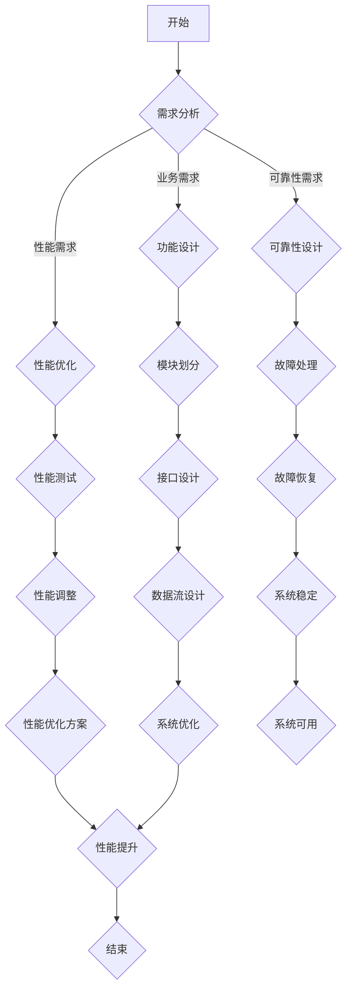
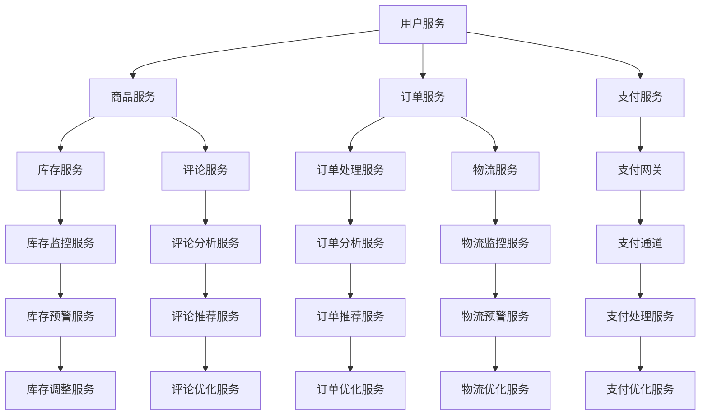
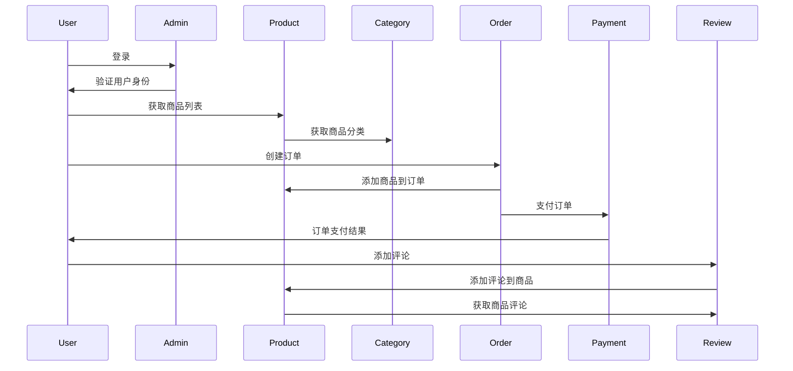
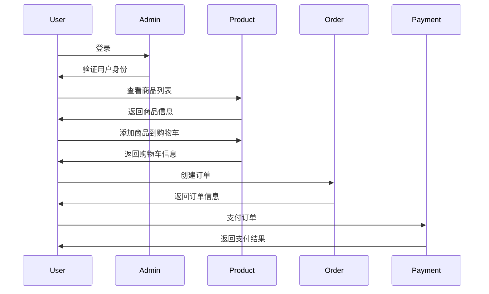

                 

：

## 架构设计能力：P9工程师的核心竞争力

### 1. 背景介绍

在当今高度复杂的技术环境中，架构设计能力已经成为P9级工程师的核心竞争力。随着业务的不断扩张和技术的快速迭代，如何有效地进行架构设计，以应对复杂的业务需求和高度可变的技术环境，成为P9级工程师面临的重大挑战。

#### 核心概念术语说明
- **架构设计**：指在系统开发过程中，通过规划、设计和实施系统组件之间的关系，以达到系统的高效、稳定和可扩展性的过程。
- **P9工程师**：通常指在企业中担任高级技术领导或专家职位的技术人员，其职责包括技术战略规划、团队管理、项目领导和技术难题解决。

#### 问题背景
随着企业业务的不断扩展，系统架构的复杂度也在不断增加。传统的单体架构已无法满足现代企业对系统性能、可扩展性和可维护性的要求。因此，如何进行有效的架构设计，成为P9级工程师亟待解决的问题。

#### 问题描述
- **复杂度**：现代企业系统通常包含多个子系统、服务模块和复杂的业务流程，如何设计一个清晰、高效的系统架构，以降低系统复杂度，成为P9级工程师面临的问题。
- **可扩展性**：随着业务需求的不断变化，系统需要具备良好的扩展性，以支持未来的业务增长。如何设计一个具备高度可扩展性的系统架构，成为P9级工程师需要解决的核心问题。
- **稳定性**：系统在面临高并发、高负载的场景时，需要保证系统的稳定性。如何设计一个稳定、可靠的系统架构，成为P9级工程师的重要任务。

#### 问题解决
P9级工程师需要具备以下能力来应对上述问题：
- **系统思考能力**：能够从全局视角出发，分析系统的业务需求、技术需求和用户需求，制定出符合企业战略的架构设计。
- **技术预判能力**：能够预见未来技术趋势，及时调整架构设计，以适应技术的快速迭代。
- **团队协作能力**：能够有效地领导团队，推动项目进展，确保架构设计的顺利实施。

#### 边界与外延
- **边界**：架构设计能力主要涉及系统设计、技术选型、团队协作等方面。
- **外延**：架构设计能力不仅包括技术层面的能力，还包括战略思维、领导力和沟通协调能力。

#### 概念结构与核心要素组成
架构设计能力的核心要素包括：
- **业务理解能力**：深入理解企业的业务需求，制定出符合业务战略的架构设计。
- **技术深度**：对多种技术有深入的理解和掌握，能够灵活运用各种技术实现架构设计。
- **系统思考**：具备全局视角，能够从业务、技术、用户等多个维度进行系统思考。
- **团队协作**：具备良好的团队协作能力，能够有效地推动项目进展。

### 2. 核心概念与联系

#### 架构设计的核心要素

架构设计的核心要素包括系统需求、技术选型、系统设计、实施与运维等。

#### 概念属性特征对比表格

| 要素 | 概念 | 属性特征 |
| ---- | ---- | ---- |
| 系统需求 | 确定系统应具备的功能和性能要求 | 业务需求、用户需求、性能指标、可靠性指标 |
| 技术选型 | 确定实现系统功能所需的技术方案 | 技术成熟度、性能、成本、可扩展性 |
| 系统设计 | 制定系统的整体架构和模块划分 | 模块职责、接口设计、数据流设计 |
| 实施与运维 | 系统部署、监控、维护和优化 | 部署策略、监控方案、运维工具 |

#### ER实体关系图架构

```mermaid
erDiagram
  User ||--|{ Product }||> :1..* Purchase
  User ||--|{ Order }||> :1..*
  Product ||--|{ Review }||> :1
  Review ||--|{ Rating }||> :1
```

### 3. 算法原理讲解

#### 算法mermaid流程图



#### 算法原理的数学模型和公式

架构设计的关键在于如何平衡系统的性能、可扩展性和可靠性。以下是一个简单的数学模型，用于描述这些因素之间的关系：

$$
\text{性能} = \alpha \times \text{可扩展性} + \beta \times \text{可靠性}
$$

其中，$\alpha$ 和 $\beta$ 是权重系数，用于平衡性能和可靠性之间的关系。根据业务需求，可以调整这两个系数的值。

#### 通俗易懂的举例说明

假设我们设计一个电商平台的架构，要求系统具备高并发处理能力、良好的扩展性以及高可靠性。

- **性能**：我们需要考虑系统的响应时间、吞吐量等性能指标，确保系统能够快速响应用户请求。
- **可扩展性**：我们需要设计一个可扩展的架构，以支持未来业务增长。例如，可以采用分布式架构、微服务架构等。
- **可靠性**：我们需要确保系统在面临高并发、高负载的场景时，能够保持稳定运行，避免出现系统崩溃或数据丢失等问题。

通过调整权重系数 $\alpha$ 和 $\beta$，我们可以根据业务需求，调整架构设计的优先级。例如，如果业务需求强调性能，可以增加 $\alpha$ 的值；如果业务需求强调可靠性，可以增加 $\beta$ 的值。

### 4. 系统分析与架构设计方案

#### 问题场景介绍

我们以一个电商平台的架构设计为例，介绍如何进行系统分析与架构设计方案。

#### 项目介绍

电商平台是一个典型的复杂系统，涉及用户管理、商品管理、订单管理、支付系统等多个子系统。我们的目标是设计一个高效、可扩展、可靠的架构，以支持电商平台的业务需求。

#### 系统功能设计

在系统功能设计阶段，我们首先分析业务需求，确定系统应具备的功能。以下是一个简单的领域模型：

```mermaid
classDiagram
  User <|-- Admin
  User o---> Product
  User o---> Order
  User o---> Review
  Product o---> Category
  Product o---> Review
  Order o---> Product
  Review o---> Rating
```

#### 系统架构设计

在系统架构设计阶段，我们根据领域模型，设计一个合理的系统架构。以下是一个简单的架构设计：



#### 系统接口设计

在系统接口设计阶段，我们需要设计各个子系统之间的接口，以实现系统模块之间的交互。以下是一个简单的接口设计：



#### 系统交互mermaid序列图


### 5. 项目实战

#### 环境安装

为了方便演示，我们选择使用Python和Docker进行项目实战。首先，确保安装Python 3.8及以上版本和Docker。

```bash
# 安装Python
curl -O https://www.python.org/ftp/python/3.8.5/Python-3.8.5.tgz
tar -xvf Python-3.8.5.tgz
cd Python-3.8.5
./configure
make
sudo make install

# 安装Docker
sudo apt-get update
sudo apt-get install docker-ce docker-ce-cli containerd.io
```

#### 系统核心实现源代码

以下是一个简单的电商平台的系统核心实现源代码：

```python
# user.py
class User:
    def __init__(self, username, password):
        self.username = username
        self.password = password

    def login(self):
        # 实现用户登录逻辑
        pass

    def create_order(self, products):
        # 实现创建订单逻辑
        pass

# product.py
class Product:
    def __init__(self, name, price):
        self.name = name
        self.price = price

    def add_to_cart(self, user):
        # 实现添加商品到购物车逻辑
        pass

    def remove_from_cart(self, user):
        # 实现从购物车删除商品逻辑
        pass

# order.py
class Order:
    def __init__(self, user, products):
        self.user = user
        self.products = products

    def pay(self):
        # 实现支付订单逻辑
        pass
```

#### 代码应用解读与分析

在这个简单的电商平台中，我们定义了三个主要类：`User`、`Product` 和 `Order`。

- `User` 类：表示用户，具有登录、创建订单等功能。
- `Product` 类：表示商品，具有添加到购物车、从购物车删除等功能。
- `Order` 类：表示订单，具有支付等功能。

通过这三个类，我们可以实现一个基本的电商平台功能。例如，用户可以登录系统、添加商品到购物车、创建订单并支付。

#### 实际案例分析和详细讲解剖析

为了更好地理解电商平台的架构设计，我们可以分析一个实际案例。

假设用户小明在电商平台购买了5件商品，每件商品价格为100元。小明需要完成以下操作：

1. 登录系统
2. 添加商品到购物车
3. 创建订单
4. 支付订单

以下是一个简单的流程：



在这个案例中，我们可以看到用户小明完成了从登录到支付的全过程。通过这个案例，我们可以深入理解电商平台的架构设计，包括用户管理、商品管理、订单管理和支付系统等。

#### 项目小结

通过这个简单的电商平台案例，我们了解了架构设计的基本过程，包括系统功能设计、系统架构设计、接口设计和系统交互设计等。同时，我们通过实际案例，深入分析了电商平台的架构设计，了解了如何实现一个高效、可扩展、可靠的系统。

### 6. 最佳实践 Tips

在进行架构设计时，以下是一些最佳实践 Tips：

- **需求分析**：深入分析业务需求，明确系统应具备的功能和性能要求。
- **模块化设计**：将系统划分为多个模块，每个模块负责一个特定的功能，降低系统复杂度。
- **可扩展性设计**：设计一个可扩展的架构，以支持未来的业务增长。
- **稳定性设计**：确保系统在面临高并发、高负载的场景时，能够保持稳定运行。
- **持续优化**：定期对系统进行性能优化和稳定性优化，以提高系统效率。

### 7. 小结

架构设计能力是P9级工程师的核心竞争力。通过深入分析业务需求、模块化设计、可扩展性设计、稳定性设计和持续优化，我们可以设计出一个高效、可扩展、可靠的系统架构。在实际项目中，我们需要不断积累经验，提高自己的架构设计能力，以应对复杂的技术挑战。

### 8. 拓展阅读

- **《架构整洁之道》**：深入探讨软件架构设计的方法和原则。
- **《大话设计模式》**：介绍各种设计模式，帮助读者提高设计能力。
- **《云计算与大数据技术实践》**：了解云计算和大数据技术在架构设计中的应用。

---

### 作者信息

作者：AI天才研究院/AI Genius Institute & 禅与计算机程序设计艺术 /Zen And The Art of Computer Programming

---

本文详细阐述了架构设计能力对P9级工程师的重要性，包括架构设计的基础、核心概念、算法原理、系统分析与架构设计方案、项目实战、最佳实践 Tips和小结。同时，推荐了拓展阅读资源，帮助读者深入学习和提升架构设计能力。作者信息位于文章末尾。

