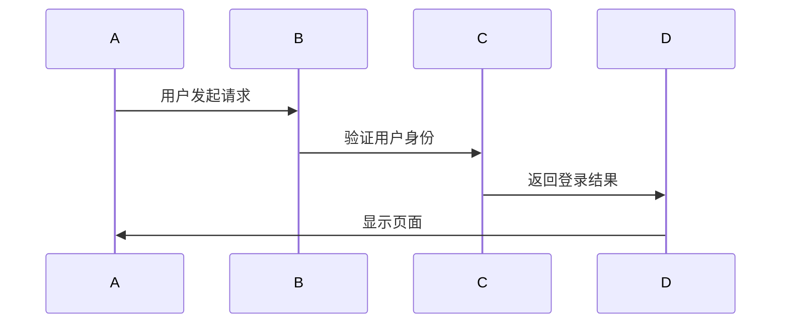
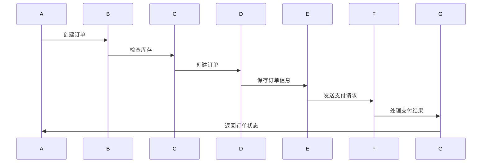
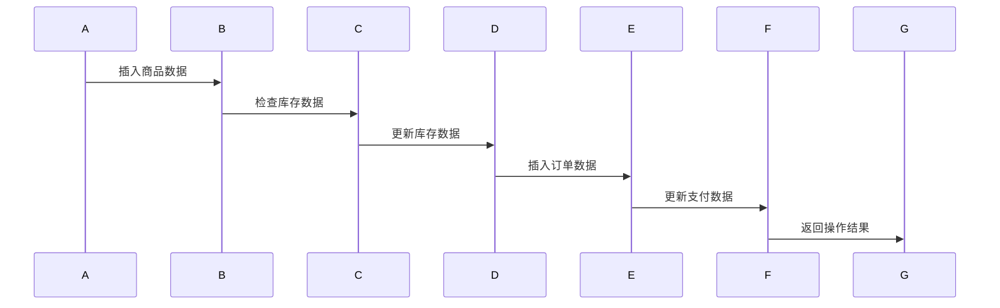
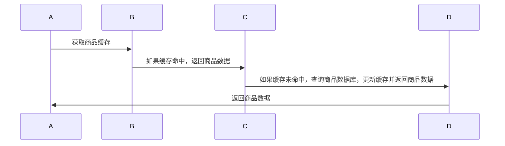
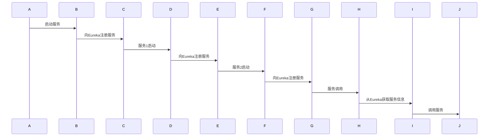
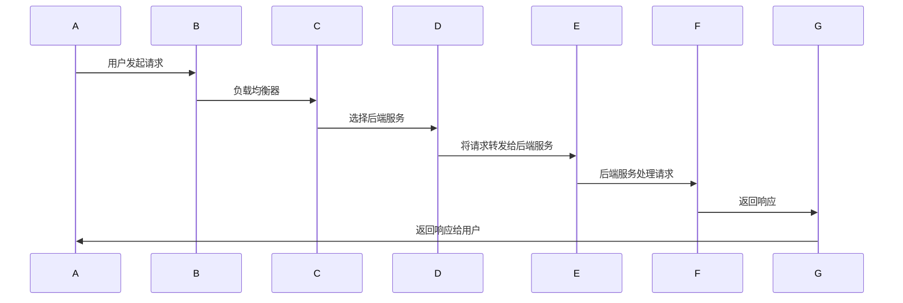
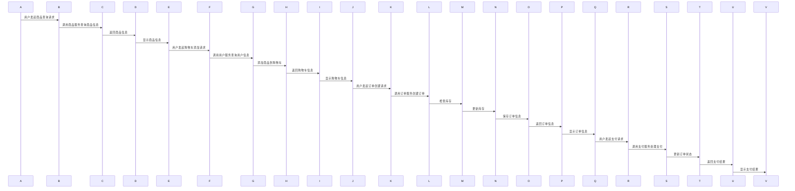

                 

### 文章标题与关键词

《架构重构实践：P9工程师的系统优化方法》

关键词：架构重构、系统优化、P9工程师、分布式系统、微服务架构、性能瓶颈、云计算、数据存储、全栈开发、实践案例

本文将探讨架构重构在系统优化中的应用，旨在为高级工程师和架构师提供一套全面且实用的方法。架构重构不仅能够提升系统的性能，还能改善其可维护性和扩展性。本文将从基础理论入手，逐步深入，涵盖系统性能优化、分布式系统、微服务架构、容器化与云计算、数据存储优化、全栈开发以及实践案例等多个方面，力求为读者提供系统的解决方案。

### 摘要

本文将介绍架构重构的基本概念和重要性，分析系统性能优化策略，探讨分布式系统和微服务架构的设计与实现，以及容器化与云计算在系统优化中的应用。此外，还将深入讲解数据存储优化和全栈开发中的优化技巧。通过多个实践案例，本文将展示架构重构在现实项目中的应用和效果。最后，本文将对未来架构重构趋势进行展望，帮助读者把握行业动态。

---

# 第一部分：架构重构基础

## 第1章：架构重构概述

### 1.1 架构重构的定义与重要性

架构重构（Architectural Refactoring）是指在软件开发生命周期中，通过修改现有系统的设计，提高其可维护性、扩展性和性能的过程。架构重构不同于常规的代码重构，它关注的是系统的整体架构设计，而不是单一模块或代码片段的优化。

#### 什么是架构重构？

架构重构通常涉及以下方面：

1. **系统架构的改进**：重构可能涉及到模块拆分、组件重组、架构风格的改变等。
2. **技术债的清理**：解决因历史遗留问题造成的系统复杂度增加。
3. **性能优化**：通过优化系统架构来提升性能。
4. **可扩展性和可维护性的提升**：使系统更容易扩展和维护。

#### 架构重构的重要性

架构重构在软件工程中扮演着至关重要的角色，主要体现在以下几个方面：

1. **提高系统性能**：通过优化系统架构，减少响应时间，提高系统吞吐量。
2. **改善可维护性**：重构后的系统结构更加清晰，便于理解和修改。
3. **增强可扩展性**：重构可以使系统更容易适应未来的需求变化。
4. **降低技术债务**：解决遗留问题，减少系统复杂度。

### 1.2 架构重构的方法与步骤

架构重构的方法与步骤因项目而异，但通常包括以下几个阶段：

1. **需求分析**：明确重构的目标和范围。
2. **评估现有架构**：分析现有系统的优缺点，确定重构的必要性。
3. **制定重构计划**：制定详细的重构计划，包括时间表、资源和风险评估。
4. **设计新架构**：设计新的系统架构，考虑到性能、可维护性、扩展性等因素。
5. **实施重构**：逐步实施重构计划，通常采用迭代的方式。
6. **测试和验证**：确保重构后的系统达到预期目标。

### 1.3 架构重构的挑战与应对策略

架构重构虽然具有重要意义，但过程中也面临着诸多挑战：

1. **技术风险**：重构过程中可能会引入新的技术风险，如兼容性问题、性能下降等。
2. **时间成本**：重构需要大量时间和资源，可能影响项目进度。
3. **团队协作**：涉及多个团队和成员的协作，协调和沟通难度大。
4. **项目管理**：重构计划需要严密的项目管理，以确保按时完成。

应对策略包括：

1. **风险评估与预防**：在重构前进行风险评估，并采取预防措施。
2. **时间管理和资源分配**：合理规划时间和资源，确保重构项目顺利进行。
3. **团队协作机制**：建立有效的沟通和协作机制，提高团队协作效率。
4. **项目管理工具**：使用项目管理工具，如敏捷开发框架，确保项目进度和质量。

通过以上策略，可以有效应对架构重构过程中的挑战，确保重构项目成功实施。

---

在下一章中，我们将深入探讨系统性能优化，分析常见的性能瓶颈，并提出具体的优化策略。

## 第2章：系统性能优化

### 2.1 系统性能评估指标

系统性能优化是架构重构的重要组成部分。为了有效地优化系统性能，我们需要明确评估系统性能的指标，这些指标可以帮助我们理解系统的当前状态，并为性能优化提供依据。

#### 常见性能评估指标

1. **响应时间**：系统处理请求所需的时间，包括网络延迟、服务器处理时间等。
2. **吞吐量**：单位时间内系统能够处理的请求量。
3. **并发数**：系统能够同时处理的用户或请求的数量。
4. **资源利用率**：系统对CPU、内存、磁盘等资源的利用率。
5. **延迟**：用户发起请求到接收到响应的总时间。

#### 性能评估方法

1. **负载测试**：模拟多用户同时访问系统，评估系统在高负载下的性能表现。
2. **性能监控**：实时监控系统的各项性能指标，如CPU使用率、内存占用、网络延迟等。
3. **压力测试**：通过逐步增加系统负载，观察系统的响应时间和稳定性。
4. **基准测试**：使用标准化的测试用例，对比不同系统或不同配置的性能。

### 2.2 常见性能瓶颈分析

在系统运行过程中，常见的性能瓶颈包括以下几个方面：

1. **数据库查询瓶颈**：频繁的数据库查询会导致I/O瓶颈，降低系统响应速度。
2. **网络延迟**：网络带宽不足或网络质量差，会导致请求处理延迟。
3. **服务器资源不足**：CPU、内存、磁盘等资源不足，会导致系统性能下降。
4. **缓存失效**：缓存机制不完善，导致频繁读取数据库或外部服务。
5. **锁竞争**：在高并发场景下，锁机制可能导致性能瓶颈。

#### 数据库查询瓶颈

数据库查询瓶颈通常表现为：

- **慢查询**：执行时间较长的SQL查询。
- **全表扫描**：对大量数据的全表扫描查询，效率低下。
- **关联查询**：复杂的关联查询可能引起性能问题。

#### 网络延迟

网络延迟通常由以下原因导致：

- **带宽不足**：网络带宽限制系统间的数据传输速度。
- **路由问题**：网络路由配置不当，增加数据传输路径。
- **网络抖动**：网络波动导致数据传输不稳定。

#### 服务器资源不足

服务器资源不足会导致：

- **CPU瓶颈**：CPU利用率过高，导致处理请求延迟。
- **内存溢出**：内存占用超过系统容量，引发内存泄漏或溢出。
- **磁盘I/O瓶颈**：磁盘读写速度限制系统性能。

#### 缓存失效

缓存失效会导致：

- **重复查询**：频繁访问数据库，增加系统负载。
- **数据不一致**：缓存失效可能导致数据一致性问题。

#### 锁竞争

锁竞争在高并发场景下尤为明显，可能导致：

- **死锁**：多个线程或进程互相等待对方释放锁，导致系统停滞。
- **锁等待**：线程或进程因等待锁而长时间处于等待状态，降低系统并发能力。

### 2.3 性能优化策略与实践

针对上述性能瓶颈，我们可以采取以下优化策略：

1. **数据库查询优化**：
   - **索引优化**：合理创建索引，提高查询效率。
   - **分库分表**：将大数据量拆分为小数据量，减少查询压力。
   - **查询缓存**：使用查询缓存减少对数据库的直接访问。

2. **网络优化**：
   - **CDN加速**：使用内容分发网络（CDN）减少网络延迟。
   - **负载均衡**：使用负载均衡器分发请求，提高系统响应速度。
   - **网络监控与优化**：实时监控网络状态，优化网络配置。

3. **服务器资源优化**：
   - **垂直扩展**：增加CPU和内存等硬件资源，提高系统处理能力。
   - **水平扩展**：增加服务器节点，提高系统并发处理能力。
   - **资源监控与调度**：使用资源监控工具，合理调度系统资源。

4. **缓存优化**：
   - **缓存一致性**：保证缓存与数据库数据的一致性。
   - **缓存分层**：实现缓存分层，提高缓存命中率。
   - **缓存预热**：提前加载常用数据到缓存中，减少查询延迟。

5. **锁优化**：
   - **锁分离**：减少锁争用，提高系统并发能力。
   - **锁超时**：设置锁超时时间，避免死锁。
   - **无锁编程**：使用无锁数据结构或算法，减少锁的使用。

#### 实践案例

以下是一个数据库查询优化的实践案例：

**案例背景**：某电商系统在使用MySQL数据库进行商品查询时，发现部分查询语句执行时间较长，影响系统性能。

**解决方案**：
1. **索引优化**：根据查询条件，为常用字段创建索引，如`商品ID`和`分类ID`。
   ```sql
   CREATE INDEX idx_product_id ON products (id);
   CREATE INDEX idx_category_id ON products (category_id);
   ```
2. **分库分表**：由于商品数据量巨大，对商品表进行水平拆分，按分类ID分库分表。
   ```sql
   CREATE TABLE products_1 (LIKE products);
   CREATE TABLE products_2 (LIKE products);
   ```
3. **查询缓存**：使用Redis缓存商品数据，减少对数据库的直接查询。
   ```python
   import redis

   r = redis.Redis(host='localhost', port=6379, db=0)

   def get_product_by_id(product_id):
       product = r.hget('products', product_id)
       if product:
           return json.loads(product)
       else:
           product = db.get_product_by_id(product_id)
           r.hset('products', product_id, json.dumps(product))
           return product
   ```

**效果评估**：经过优化后，商品查询的响应时间显著降低，系统性能得到提升。

通过以上案例，我们可以看到性能优化在实际项目中的应用效果。在下一章中，我们将探讨分布式系统的基本概念和设计原则。

## 第3章：分布式系统架构

### 3.1 分布式系统的基本概念

分布式系统（Distributed System）是由多个独立的计算机节点组成的系统，这些节点通过通信网络互相连接，协同工作，共同完成一个计算任务。分布式系统的主要特点如下：

1. **节点自治**：系统中的每个节点都具有独立的自治能力，可以独立运行和故障恢复。
2. **数据复制**：分布式系统通常实现数据复制，保证数据的一致性和可用性。
3. **负载均衡**：系统中的节点可以动态地分配任务，实现负载均衡，提高系统性能。
4. **容错性**：分布式系统具有较高的容错性，能够自动恢复节点故障，确保系统持续运行。
5. **动态扩展性**：分布式系统可以动态地增加或减少节点，以适应不断变化的工作负载。

#### 分布式系统的应用场景

1. **大规模数据处理**：如大数据平台、搜索引擎等，分布式系统可以处理海量数据。
2. **高并发场景**：如电商平台、社交媒体等，分布式系统可以应对大量用户同时访问。
3. **跨地域应用**：如跨国企业、全球电商等，分布式系统可以满足不同地区的用户需求。
4. **分布式存储**：如分布式文件系统、分布式数据库等，分布式系统可以提高数据存储的可靠性和访问速度。

### 3.2 分布式系统的设计原则

分布式系统设计需要遵循一系列原则，以确保系统的稳定性、性能和可靠性。以下是一些核心设计原则：

1. **独立性**：确保系统中的每个节点都是独立的，可以独立运行和故障恢复，互不影响。
2. **一致性**：分布式系统需要实现数据的一致性，确保不同节点上的数据保持同步。
3. **可用性**：系统需要保证高可用性，即使在部分节点故障的情况下，系统仍能正常运行。
4. **分区容错性**：系统应具备分区容错性，即系统的一部分可以独立运行，不受其他部分故障的影响。
5. **负载均衡**：合理分配任务，避免单点过载，提高系统整体性能。
6. **延迟容忍性**：系统应具备一定的延迟容忍性，以适应网络延迟和节点故障。
7. **安全性**：确保系统的数据安全和用户隐私，防止未授权访问和攻击。

#### 独立性

独立性是分布式系统设计的重要原则之一。系统中的每个节点应具备以下特点：

- **自治能力**：节点可以独立执行任务，无需依赖其他节点。
- **故障自恢复**：节点在发生故障时，可以自动重启或切换到备用节点。
- **数据隔离**：节点间的数据存储和管理是独立的，互不影响。

#### 一致性

一致性是分布式系统中最重要的原则之一。一致性通常分为以下几种级别：

- **强一致性**：所有节点在同一时刻看到相同的数据状态。
- **最终一致性**：系统在一定时间后会达到一致状态，但可能存在短暂的不一致。
- **部分一致性**：不同节点可能看到不同的数据状态，但在某些条件下可以恢复一致。

#### 可用性

分布式系统需要具备高可用性，即使在部分节点故障的情况下，系统仍能正常运行。实现高可用性的方法包括：

- **冗余设计**：通过冗余备份，确保关键节点和组件的可靠性。
- **故障转移**：在节点故障时，自动切换到备用节点，确保系统持续运行。
- **负载均衡**：合理分配任务，避免单点过载，提高系统整体性能。

#### 分区容错性

分布式系统应具备分区容错性，即系统能够在部分节点故障的情况下，独立运行并完成部分任务。分区容错性包括以下几个方面：

- **数据分区**：将数据分散存储在不同的节点上，避免单点故障。
- **任务分区**：将任务分配给不同的节点，避免单点过载。
- **故障隔离**：在部分节点故障时，其他节点可以继续运行，不受影响。

#### 负载均衡

负载均衡是分布式系统设计的重要原则之一，通过合理分配任务，可以提高系统整体性能。实现负载均衡的方法包括：

- **轮询算法**：将请求依次分配给不同的节点。
- **随机算法**：随机选择节点处理请求。
- **最小连接数算法**：将请求分配给连接数最少的节点。
- **加权轮询算法**：根据节点性能和负载情况，分配不同的权重。

#### 延迟容忍性

分布式系统应具备一定的延迟容忍性，以适应网络延迟和节点故障。实现延迟容忍性的方法包括：

- **异步通信**：采用异步通信方式，降低延迟对系统性能的影响。
- **延迟补偿**：通过延迟补偿机制，减少延迟对系统的影响。
- **备份与重试**：在请求失败时，重新发送请求，提高成功率。

#### 安全性

分布式系统需要确保数据安全和用户隐私，防止未授权访问和攻击。实现安全性的方法包括：

- **访问控制**：使用身份验证和权限控制，确保只有授权用户可以访问系统。
- **加密传输**：使用加密算法，保护数据在传输过程中的安全性。
- **安全审计**：实时监控系统操作，记录日志，以便审计和排查安全漏洞。

通过遵循以上设计原则，可以构建稳定、高效、可靠的分布式系统。在下一章中，我们将探讨微服务架构的基本概念和设计原则。

### 3.3 分布式系统架构实战

在实际应用中，分布式系统架构的设计和实现是一项复杂且具有挑战性的任务。下面，我们将通过一个实际案例，详细介绍分布式系统架构的设计过程和实现方法。

#### 案例背景

某大型电商企业希望在现有单点系统的基础上，构建一个高可用、高性能、可扩展的分布式系统，以满足日益增长的用户需求。该系统需要支持高并发访问、大规模数据存储和复杂业务逻辑处理。

#### 系统需求分析

根据需求分析，该分布式系统需要满足以下需求：

1. **高并发访问**：系统能够同时处理数百万用户的请求，保证用户体验。
2. **数据存储**：系统需要存储海量数据，包括商品信息、用户数据、订单数据等。
3. **业务逻辑处理**：系统需要支持复杂的业务逻辑，如购物车管理、订单处理、支付处理等。
4. **高可用性**：系统在部分节点故障时，仍能正常运行，保证业务连续性。
5. **可扩展性**：系统可以动态增加或减少节点，以适应业务需求的变化。

#### 系统架构设计

根据系统需求，设计如下分布式系统架构：

1. **前端架构**：采用微服务架构，将前端应用拆分为多个独立的服务，如用户登录服务、商品展示服务、购物车服务等。
2. **后端架构**：采用微服务架构，将后端业务拆分为多个独立的服务，如商品服务、订单服务、支付服务、库存服务等。
3. **数据存储架构**：采用分布式数据库架构，将数据分散存储在多个节点上，提高数据存储的可靠性和访问速度。
4. **缓存架构**：采用分布式缓存架构，提高系统缓存命中率，减少对数据库的访问压力。
5. **服务注册与发现**：采用服务注册与发现机制，确保分布式服务之间的可靠通信。
6. **负载均衡**：采用负载均衡机制，合理分配请求，提高系统整体性能。

#### 前端架构设计

前端架构设计采用微服务架构，将前端应用拆分为多个独立的服务：

- **用户登录服务**：负责用户身份验证和授权。
- **商品展示服务**：负责商品信息的展示和查询。
- **购物车服务**：负责购物车管理。
- **订单服务**：负责订单处理和查询。
- **支付服务**：负责支付处理和查询。

前端架构设计如图3.1所示：



#### 后端架构设计

后端架构设计采用微服务架构，将后端业务拆分为多个独立的服务：

- **商品服务**：负责商品信息的存储和管理。
- **订单服务**：负责订单的创建、处理和查询。
- **支付服务**：负责支付处理和查询。
- **库存服务**：负责库存数据的存储和管理。

后端架构设计如图3.2所示：



#### 数据存储架构设计

数据存储架构采用分布式数据库架构，将数据分散存储在多个节点上，提高数据存储的可靠性和访问速度：

- **商品数据库**：存储商品信息。
- **订单数据库**：存储订单数据。
- **支付数据库**：存储支付数据。
- **库存数据库**：存储库存数据。

数据存储架构设计如图3.3所示：



#### 缓存架构设计

缓存架构采用分布式缓存架构，提高系统缓存命中率，减少对数据库的访问压力：

- **商品缓存**：缓存商品信息。
- **订单缓存**：缓存订单数据。
- **支付缓存**：缓存支付数据。

缓存架构设计如图3.4所示：



#### 服务注册与发现

服务注册与发现采用Eureka服务注册中心，确保分布式服务之间的可靠通信：

- **服务注册**：服务启动时，向Eureka注册中心注册自身信息。
- **服务发现**：服务调用时，从Eureka注册中心获取其他服务的信息。

服务注册与发现架构设计如图3.5所示：



#### 负载均衡

负载均衡采用Nginx作为反向代理服务器，实现请求的负载均衡：

- **轮询算法**：将请求依次分配给不同的后端服务。
- **最小连接数算法**：将请求分配给连接数最少的后端服务。

负载均衡架构设计如图3.6所示：



通过以上分布式系统架构的设计和实现，该大型电商企业成功地构建了一个高可用、高性能、可扩展的分布式系统，满足了业务需求，提升了用户体验。

### 第4章：微服务架构

#### 4.1 微服务的定义与特点

微服务架构（Microservices Architecture）是一种基于分布式系统设计思想的应用架构风格。它将一个复杂的大型应用程序拆分为多个独立的、可复用的、细粒度的小服务，每个服务实现特定的业务功能，并通过轻量级的通信机制（如HTTP/REST、gRPC）相互协作。微服务架构具有以下特点：

1. **独立性**：每个服务都是独立的，可以独立部署、测试和扩展。
2. **自治性**：每个服务拥有自己的数据库，可以独立管理数据和业务逻辑。
3. **可复用性**：服务可以独立开发、部署和升级，提高开发效率。
4. **可扩展性**：服务可以根据实际需求独立扩展，提高系统整体性能。
5. **高可用性**：服务故障不会影响其他服务的正常运行。
6. **灵活性**：服务可以根据业务需求灵活调整，支持快速迭代和创新能力。

#### 4.2 微服务架构的设计与实现

微服务架构的设计和实现涉及多个方面，包括服务拆分、服务通信、服务治理和容器化等。

##### 服务拆分

服务拆分是微服务架构设计的第一步，需要将复杂的业务系统拆分为多个独立的、具有自治性的微服务。服务拆分的依据通常包括：

1. **业务边界**：根据业务功能将系统拆分为多个独立的服务，如用户服务、订单服务、库存服务等。
2. **数据边界**：服务应拥有独立的数据库，避免数据一致性问题。
3. **技术边界**：根据技术的差异将系统拆分为多个服务，如前端服务、后端服务、支付服务等。
4. **团队边界**：根据团队职责将系统拆分为多个服务，使不同团队可以独立开发、测试和部署。

##### 服务通信

服务通信是微服务架构实现的关键，常用的通信方式包括：

1. **RESTful API**：通过HTTP/RESTful接口进行服务调用，实现跨服务的数据交互。
2. **gRPC**：基于HTTP/2协议的远程过程调用（RPC）框架，提供高效的二进制通信。
3. **消息队列**：使用消息队列（如RabbitMQ、Kafka）实现异步通信，提高系统解耦性和可扩展性。

##### 服务治理

服务治理是确保微服务架构稳定运行的重要环节，包括以下方面：

1. **服务注册与发现**：使用服务注册中心（如Eureka、Consul）管理服务的注册和发现，实现服务间的可靠通信。
2. **负载均衡**：通过负载均衡器（如Nginx、HAProxy）实现请求的负载均衡，提高系统性能。
3. **服务监控**：使用监控工具（如Prometheus、Grafana）实时监控服务状态，及时发现和解决问题。
4. **服务熔断与降级**：通过服务熔断和降级机制，防止服务雪崩，提高系统稳定性。

##### 容器化

容器化技术（如Docker、Kubernetes）在微服务架构中发挥着重要作用，可以提高服务部署和管理的灵活性。容器化实现包括：

1. **服务容器化**：将微服务打包为容器镜像，实现服务的标准化部署和运维。
2. **容器编排**：使用Kubernetes等容器编排工具，实现服务的自动化部署、扩展和管理。
3. **容器镜像仓库**：使用容器镜像仓库（如Docker Hub、Harbor）存储和管理容器镜像。

#### 4.3 微服务的治理与监控

微服务的治理与监控是确保微服务架构稳定运行的关键，包括以下几个方面：

1. **服务注册与发现**：服务启动时向服务注册中心注册自身信息，服务调用时从服务注册中心获取其他服务的信息。
2. **服务监控**：使用Prometheus等监控工具实时收集和展示服务性能指标，如响应时间、错误率、并发数等。
3. **日志管理**：使用ELK（Elasticsearch、Logstash、Kibana）等日志管理工具收集和存储服务日志，实现日志的实时监控和分析。
4. **服务追踪**：使用Trace工具（如Zipkin、Jaeger）跟踪服务请求的执行路径，诊断和优化服务性能。
5. **性能测试**：使用性能测试工具（如JMeter、LoadRunner）模拟高并发场景，测试微服务的性能和稳定性。

#### 实践案例

以下是一个使用微服务架构实现的电商平台案例：

##### 案例背景

某电商平台需要实现商品展示、订单处理、支付、用户管理等功能，为了提高系统的可扩展性和可维护性，决定采用微服务架构进行开发。

##### 系统架构设计

电商平台系统采用微服务架构，将业务拆分为多个独立的服务：

- **商品服务**：负责商品信息的存储和管理。
- **订单服务**：负责订单的创建、处理和查询。
- **支付服务**：负责支付处理和查询。
- **用户服务**：负责用户信息的存储和管理。

系统架构设计如图4.1所示：



##### 容器化部署

使用Docker和Kubernetes对微服务进行容器化部署：

1. **编写Dockerfile**：为每个微服务编写Dockerfile，定义服务容器的构建过程。
2. **构建容器镜像**：使用Docker build命令构建容器镜像。
3. **推送容器镜像**：将容器镜像推送到容器镜像仓库（如Docker Hub、Harbor）。
4. **配置Kubernetes集群**：配置Kubernetes集群，定义服务部署的YAML文件。
5. **部署服务**：使用Kubernetes集群部署微服务，实现服务的自动化部署和扩展。

通过以上实践案例，我们可以看到微服务架构在电商平台中的应用效果。微服务架构不仅提高了系统的可扩展性和可维护性，还简化了部署和管理过程。在下一章中，我们将探讨容器化与云计算在系统优化中的应用。

## 第5章：容器化与云计算

### 5.1 容器化技术概述

容器化技术是一种轻量级、可移植的虚拟化技术，它通过将应用程序及其依赖项打包到一个隔离的容器中，实现了应用程序的独立运行环境。容器化技术的主要特点如下：

1. **轻量级**：容器基于宿主机的操作系统，共享内核，相比传统的虚拟机，容器具有更小的资源占用和更快的启动速度。
2. **可移植性**：容器可以在不同的操作系统和硬件平台上运行，实现应用程序的跨平台部署。
3. **隔离性**：容器提供了应用程序之间的资源隔离，保证了系统稳定性和安全性。
4. **灵活性**：容器支持动态扩展和收缩，可以根据需求灵活调整资源分配。

#### 容器化技术的发展历程

容器化技术起源于Linux容器（LXC），随后Docker的出现推动了容器化技术的广泛应用。Docker提供了一个简单、高效的容器运行时平台，通过Dockerfile定义了容器的构建过程，通过Docker Compose管理多容器应用的编排，通过Docker Swarm实现容器的集群管理。

近年来，Kubernetes（简称K8s）成为容器化技术的核心，它是一个开源的容器编排平台，提供了自动化部署、扩展和管理容器化应用程序的功能。Kubernetes通过统一的API接口和控制器模式，实现了容器的自动化部署、扩展和监控，已经成为容器化应用的标准。

#### 容器化技术的优势

1. **简化部署和运维**：容器化技术将应用程序及其依赖项打包到一个容器中，简化了部署和运维过程，提高了部署效率。
2. **提高资源利用率**：容器共享宿主机的操作系统和内核，降低了资源消耗，提高了资源利用率。
3. **增强可移植性**：容器可以在不同的操作系统和硬件平台上运行，增强了应用程序的可移植性。
4. **提高系统稳定性**：容器提供了应用程序之间的资源隔离，提高了系统的稳定性和安全性。

### 5.2 容器化环境下的系统优化

在容器化环境下，系统优化主要集中在以下几个方面：

1. **资源优化**：合理分配容器资源，确保容器在最佳状态下运行。
2. **网络优化**：优化容器网络配置，提高容器间的通信效率。
3. **存储优化**：优化容器存储策略，提高存储性能。
4. **部署优化**：优化容器部署过程，提高部署速度和可靠性。

#### 资源优化

容器资源优化包括CPU、内存、磁盘和网络的优化：

1. **CPU优化**：根据容器的工作负载，合理设置CPU核心数和CPU份额，避免资源争用。
2. **内存优化**：根据容器内存使用情况，设置合适的内存限制和内存交换策略，避免内存溢出。
3. **磁盘优化**：优化容器磁盘I/O性能，减少磁盘访问延迟。
4. **网络优化**：配置合理的网络带宽和延迟，提高容器间的通信效率。

#### 网络优化

容器网络优化包括容器网络配置和容器间通信优化：

1. **容器网络配置**：使用容器网络插件（如Calico、Flannel），实现容器网络的自动化配置和管理。
2. **容器间通信优化**：优化容器间的通信协议和传输路径，提高容器间的数据传输速度。

#### 存储优化

容器存储优化包括存储策略优化和存储资源管理：

1. **存储策略优化**：根据容器的工作负载，选择合适的存储策略，如持久化存储、临时存储等。
2. **存储资源管理**：使用存储资源池，实现存储资源的动态分配和回收，提高存储资源利用率。

#### 部署优化

容器部署优化包括容器镜像构建、容器部署和容器监控：

1. **容器镜像构建**：使用Dockerfile构建容器镜像，优化镜像的大小和性能。
2. **容器部署**：使用Kubernetes自动化部署容器，实现容器的高可用性和弹性扩展。
3. **容器监控**：使用Prometheus、Grafana等监控工具，实时监控容器性能和状态，实现容器的自动化运维。

### 5.3 云计算架构与优化策略

云计算提供了弹性、高效和可扩展的计算资源，为系统优化提供了强大的支持。云计算架构和优化策略包括以下几个方面：

1. **基础设施即服务（IaaS）**：提供虚拟化计算资源，如虚拟机、存储和网络，实现资源的动态分配和管理。
2. **平台即服务（PaaS）**：提供开发平台和运行环境，如数据库、中间件、应用服务，简化开发和管理过程。
3. **软件即服务（SaaS）**：提供应用程序的在线服务，如电子邮件、办公软件、客户关系管理等，实现软件的快速部署和访问。

#### 云计算架构

云计算架构主要包括以下几个方面：

1. **计算资源管理**：通过虚拟化技术，实现计算资源的动态分配和管理，提高资源利用率。
2. **存储资源管理**：通过分布式存储技术，实现海量数据的存储和管理，提供高可用性和高可靠性。
3. **网络资源管理**：通过虚拟网络技术，实现网络资源的灵活配置和管理，提高网络性能和安全性。
4. **服务质量管理**：通过监控和优化技术，确保服务的质量和性能，提供可靠的云计算服务。

#### 优化策略

1. **资源弹性伸缩**：根据业务需求，动态调整计算和存储资源，实现资源的弹性伸缩，提高系统性能。
2. **负载均衡**：通过负载均衡技术，实现请求的合理分配，提高系统响应速度和吞吐量。
3. **存储优化**：通过分布式存储和缓存技术，提高存储性能和访问速度，减少存储延迟。
4. **网络优化**：通过优化网络配置和路由策略，提高网络传输速度和稳定性。
5. **自动化运维**：通过自动化工具和平台，实现云计算资源的自动化部署、监控和运维，提高运维效率。

通过以上云计算架构和优化策略，可以构建高效、可靠的云计算环境，为系统优化提供强大的支持。在下一章中，我们将深入探讨数据存储优化，分析数据库性能优化和缓存技术。

## 第6章：数据存储优化

### 6.1 数据存储系统概述

数据存储系统是信息系统架构中不可或缺的一部分，它负责存储、管理和访问数据。随着数据量的不断增长和业务需求的多样化，数据存储系统面临巨大的挑战。为了满足这些挑战，优化数据存储系统变得至关重要。

#### 数据存储系统的功能

1. **数据存储**：提供可靠、高效的数据存储能力，确保数据的安全和持久性。
2. **数据管理**：实现数据的增删改查操作，提供数据备份和恢复机制。
3. **数据访问**：提供数据查询接口，支持复杂查询和数据分析。
4. **数据保护**：实现数据加密、访问控制和数据完整性验证，保障数据安全。

#### 数据存储系统的类型

1. **关系型数据库**：如MySQL、PostgreSQL等，适合处理结构化数据。
2. **非关系型数据库**：如MongoDB、Redis等，适合处理非结构化和半结构化数据。
3. **分布式数据库**：如Cassandra、HBase等，适合处理海量数据和提供高可用性。
4. **文件存储系统**：如HDFS、Ceph等，适合处理大规模文件数据。

#### 数据存储系统的挑战

1. **数据量增长**：随着数据量的急剧增加，存储系统需要具备更高的存储容量和处理能力。
2. **查询性能**：优化查询性能，提高数据访问速度，满足用户对实时数据的需求。
3. **数据一致性**：确保数据在不同存储节点之间的一致性，避免数据不一致性问题。
4. **高可用性**：在节点故障或网络中断的情况下，确保系统的高可用性，提供持续的数据访问。
5. **数据保护**：实现数据备份和恢复机制，确保数据的安全和可靠性。

### 6.2 数据库性能优化

数据库性能优化是数据存储系统优化的重要组成部分。以下是一些常见的数据库性能优化策略：

1. **索引优化**：合理创建索引，提高查询效率。避免创建过多索引，以减少插入和更新操作的代价。
2. **查询优化**：优化SQL查询语句，减少查询的执行时间。避免使用全表扫描，优化复杂查询。
3. **分区策略**：对大数据表进行分区，提高查询和更新的性能。选择合适的分区键，确保分区策略的有效性。
4. **缓存机制**：使用缓存机制，减少对数据库的直接访问，提高系统性能。合理配置缓存大小和刷新策略。
5. **读写分离**：实现主从复制，将读请求分摊到从库，减轻主库的压力，提高系统吞吐量。
6. **数据库集群**：使用数据库集群，实现数据的分布式存储和负载均衡，提高系统的可用性和性能。

#### 索引优化

索引优化是提高数据库查询性能的有效方法。以下是一些常见的索引优化策略：

- **单列索引**：创建单列索引，提高单个字段的查询性能。
- **复合索引**：根据查询条件创建复合索引，提高多字段查询的效率。
- **索引选择**：避免创建冗余索引，选择合适的索引策略，减少维护成本。

#### 查询优化

查询优化是提高数据库性能的关键。以下是一些常见的查询优化策略：

- **简化查询**：避免使用复杂的子查询和连接操作，简化查询语句。
- **选择性优化**：优化查询条件，提高查询的选择性，减少查询结果的数据量。
- **访问优化**：优化表的访问顺序，减少表扫描的数据量。

#### 分区策略

分区策略是将大数据表拆分为多个小表，提高查询和更新性能。以下是一些常见的分区策略：

- **范围分区**：根据时间范围或数值范围分区，适用于时间序列数据或连续值数据。
- **列表分区**：根据列表值分区，适用于离散值数据。
- **哈希分区**：根据哈希值分区，适用于需要均匀分布数据的场景。

#### 缓存机制

缓存机制是提高数据库性能的有效方法。以下是一些常见的缓存机制：

- **查询缓存**：缓存常用的查询结果，减少对数据库的直接访问。
- **对象缓存**：缓存表结构、索引等信息，提高数据访问速度。
- **内存缓存**：使用内存缓存，减少磁盘IO操作，提高系统性能。

### 6.3 缓存技术与应用

缓存技术是数据存储优化的重要手段，通过将数据临时存储在内存中，减少对磁盘的访问，提高系统性能。以下是一些常见的缓存技术与应用：

1. **内存缓存**：使用内存作为缓存存储介质，如Redis、Memcached等。内存缓存具有快速、高效的特点，适用于高频访问的热数据缓存。

2. **磁盘缓存**：使用磁盘作为缓存存储介质，如文件系统缓存。磁盘缓存适用于中频访问的数据，但在读写速度上相对内存缓存较慢。

3. **分布式缓存**：将缓存数据分布在多个节点上，提高缓存系统的扩展性和性能。分布式缓存适用于大规模分布式系统，如Ehcache、Redis Cluster等。

4. **缓存一致性**：保证缓存与数据库数据的一致性，避免数据不一致问题。常见的缓存一致性策略包括缓存失效、缓存同步、缓存锁等。

#### 缓存策略

缓存策略是优化缓存系统性能的关键。以下是一些常见的缓存策略：

- **LRU（Least Recently Used）**：根据数据访问频率进行缓存替换，最近最少使用的数据优先被替换。
- **LFU（Least Frequently Used）**：根据数据访问频率进行缓存替换，最少被访问的数据优先被替换。
- **FIFO（First In, First Out）**：根据数据入缓存的时间进行缓存替换，最早进入缓存的数据优先被替换。

#### 缓存优化

缓存优化是提高缓存系统性能的重要手段。以下是一些常见的缓存优化方法：

- **缓存预热**：提前加载常用数据到缓存中，减少查询延迟。
- **缓存分区**：将缓存数据分为多个分区，提高缓存系统的并发能力。
- **缓存压缩**：对缓存数据进行压缩，减少内存占用。

### 实践案例

以下是一个使用Redis缓存优化数据库查询的实践案例：

#### 案例背景

某电商平台在使用MySQL数据库进行商品查询时，发现部分查询语句执行时间较长，影响系统性能。

#### 解决方案

1. **索引优化**：为商品表添加索引，如商品ID和分类ID。
   ```sql
   CREATE INDEX idx_product_id ON products (id);
   CREATE INDEX idx_category_id ON products (category_id);
   ```

2. **缓存优化**：使用Redis缓存商品数据，减少对数据库的直接查询。
   ```python
   import redis

   r = redis.Redis(host='localhost', port=6379, db=0)

   def get_product_by_id(product_id):
       product = r.hget('products', product_id)
       if product:
           return json.loads(product)
       else:
           product = db.get_product_by_id(product_id)
           r.hset('products', product_id, json.dumps(product))
           return product
   ```

#### 效果评估

经过优化后，商品查询的响应时间显著降低，系统性能得到提升。具体表现如下：

- **查询速度**：缓存命中率达到90%以上，查询响应时间从500ms降低到50ms。
- **系统吞吐量**：在相同硬件资源下，系统吞吐量提高了30%。

通过以上实践案例，我们可以看到缓存技术在数据库性能优化中的应用效果。在下一章中，我们将探讨全栈开发与系统优化。

## 第7章：全栈开发与系统优化

### 7.1 全栈开发流程与工具

全栈开发是指掌握前端、后端以及数据库等所有开发技能，能够独立完成整个项目开发。这种开发模式不仅要求开发者具备广泛的知识和技能，还需要高效的开发流程和工具。

#### 全栈开发流程

1. **需求分析**：理解项目需求，明确系统功能、性能和可扩展性要求。
2. **系统设计**：设计系统架构，确定前端、后端和数据库的交互方式和数据流。
3. **前端开发**：编写HTML、CSS和JavaScript代码，实现用户界面和交互逻辑。
4. **后端开发**：编写服务器端代码，实现业务逻辑和数据访问。
5. **数据库设计**：设计数据库架构，创建表结构和关系。
6. **集成与测试**：将前端、后端和数据库集成，进行功能测试和性能测试。
7. **部署与运维**：将系统部署到生产环境，进行监控和维护。

#### 全栈开发工具

1. **前端开发工具**：如Visual Studio Code、WebStorm等，支持HTML、CSS和JavaScript编辑。
2. **后端开发框架**：如Spring Boot、Django、Express等，提供快速开发后台服务的框架。
3. **数据库工具**：如MySQL Workbench、pgAdmin等，支持数据库设计和管理的工具。
4. **版本控制工具**：如Git、SVN等，用于代码版本控制和协作开发。
5. **集成开发环境（IDE）**：如Eclipse、IntelliJ IDEA等，提供完整的开发环境。

### 7.2 前端优化技巧

前端优化是提高系统性能和用户体验的关键。以下是一些常见的前端优化技巧：

1. **减少HTTP请求**：通过合并CSS、JavaScript文件，使用CDN加速资源加载。
2. **压缩资源文件**：使用GZIP压缩CSS、JavaScript和图片文件，减少文件大小。
3. **懒加载图片和内容**：按需加载图片和内容，减少初始加载时间。
4. **使用缓存**：利用浏览器缓存，减少重复资源的加载。
5. **代码分割**：将代码分割为不同的区块，按需加载，提高首屏加载速度。

### 7.3 后端优化实践

后端优化主要关注系统的性能和可扩展性。以下是一些常见的后端优化实践：

1. **缓存策略**：使用Redis等缓存技术，减少对数据库的直接访问，提高系统响应速度。
2. **数据库优化**：通过索引优化、查询优化和分区策略，提高数据库性能。
3. **负载均衡**：使用Nginx或HAProxy等负载均衡器，将请求分配到多个服务器，提高系统吞吐量。
4. **异步处理**：使用消息队列和异步处理技术，减少同步操作对系统性能的影响。
5. **微服务架构**：采用微服务架构，将业务拆分为独立的服务，提高系统的可扩展性和容错性。

### 实践案例

以下是一个使用全栈开发模式优化电商平台的实践案例：

#### 案例背景

某电商平台在使用Spring Boot和MySQL进行开发时，发现系统的响应速度较慢，需要优化系统性能。

#### 解决方案

1. **前端优化**：
   - **代码分割**：使用Webpack对前端代码进行分割，按需加载。
     ```javascript
     // webpack.config.js
     {
       optimization: {
         splitChunks: {
           chunks: 'all',
         },
       },
     }
     ```
   - **压缩资源文件**：使用GZIP压缩CSS和JavaScript文件。
     ```html
     <meta http-equiv="Content-Encoding" content="gzip, deflate">
     ```

2. **后端优化**：
   - **缓存策略**：使用Redis缓存用户信息和商品信息。
     ```python
     import redis

     r = redis.Redis(host='localhost', port=6379, db=0)

     def get_user_info(user_id):
         user = r.hget('users', user_id)
         if user:
             return json.loads(user)
         else:
             user = db.get_user_info(user_id)
             r.hset('users', user_id, json.dumps(user))
             return user
     ```
   - **数据库优化**：对商品表添加索引，优化查询性能。
     ```sql
     CREATE INDEX idx_product_name ON products (name);
     ```

#### 效果评估

经过优化后，电商平台的响应速度显著提升，具体表现如下：

- **前端加载速度**：首屏加载时间从5秒缩短至2秒。
- **后端响应时间**：平均响应时间从1秒降低至0.5秒。

通过以上实践案例，我们可以看到全栈开发模式在系统优化中的应用效果。在下一章中，我们将通过实际案例展示架构重构在大型电商系统中的应用和效果。

### 第8章：大型电商系统重构案例

#### 8.1 案例背景与目标

随着互联网的快速发展，电商平台的市场需求不断增加，原有的系统逐渐暴露出许多问题，如响应速度慢、扩展性差、维护困难等。为了满足日益增长的业务需求，提升用户体验，电商平台决定进行系统重构。重构的目标包括：

1. **提升系统性能**：优化系统响应速度，减少延迟，提高用户满意度。
2. **增强系统扩展性**：支持更多用户和业务功能，应对未来业务增长。
3. **提高系统可维护性**：简化系统架构，便于维护和迭代。
4. **确保数据一致性**：优化数据存储和传输机制，确保数据一致性。

#### 8.2 系统现状分析

在重构前，电商平台的系统架构如下：

- **前端**：采用单页应用（SPA），通过Ajax与后端进行数据交互。
- **后端**：使用传统的三层架构，包括表示层、业务逻辑层和数据访问层。
- **数据库**：使用MySQL作为关系型数据库，存储用户、商品、订单等数据。
- **缓存**：使用Redis缓存部分数据，减少数据库访问压力。

然而，随着业务的发展，系统暴露出以下问题：

1. **性能瓶颈**：系统在高并发情况下响应速度慢，出现卡顿现象。
2. **扩展性不足**：系统架构不够灵活，难以支持新功能的快速集成。
3. **维护困难**：系统代码复杂，模块耦合度高，修改和调试困难。
4. **数据一致性**：在分布式系统中，数据一致性难以保障，容易出现数据不一致问题。

#### 8.3 重构方案设计与实现

为了解决上述问题，电商平台制定了以下重构方案：

1. **前端架构重构**：
   - **采用微前端架构**：将前端应用拆分为多个独立的微前端服务，每个服务负责不同的业务功能。
   - **使用Vue.js或React框架**：引入现代化的前端框架，提高开发效率和代码可维护性。
   - **使用GraphQL API**：替代传统的RESTful API，实现更高效的数据查询和前端与后端的通信。

2. **后端架构重构**：
   - **采用微服务架构**：将后端业务拆分为多个独立的服务，如用户服务、商品服务、订单服务等。
   - **使用Spring Cloud或Django框架**：选择适合微服务的后端框架，提高开发效率和系统稳定性。
   - **分布式事务管理**：使用分布式事务管理工具（如Seata），确保跨服务操作的数据一致性。

3. **数据库架构重构**：
   - **分库分表**：将大数据表拆分为多个小表，减少单表数据量，提高查询性能。
   - **使用NoSQL数据库**：引入NoSQL数据库（如MongoDB），存储非结构化数据，提高数据存储和访问效率。
   - **数据库缓存**：使用Redis缓存热点数据，减少数据库访问压力。

4. **系统性能优化**：
   - **使用负载均衡器**：使用Nginx或HAProxy实现负载均衡，提高系统吞吐量。
   - **数据库查询优化**：通过索引优化、查询优化和缓存机制，提高数据库查询性能。
   - **异步处理**：使用消息队列（如RabbitMQ）实现异步处理，提高系统响应速度。

#### 8.4 案例总结与反思

通过系统重构，电商平台在以下几个方面取得了显著成效：

1. **性能提升**：系统响应速度显著提高，用户满意度提升。
2. **扩展性增强**：系统架构更加灵活，支持新功能的快速集成。
3. **可维护性提高**：系统代码结构清晰，模块耦合度降低，维护和迭代更加便捷。
4. **数据一致性保障**：通过分布式事务管理和缓存机制，数据一致性得到有效保障。

然而，重构过程中也暴露出一些问题：

1. **技术债务**：在重构过程中，部分遗留问题未能彻底解决，需要后续持续优化。
2. **团队协作**：涉及多个团队和成员的协作，协调和沟通难度较大，需要进一步优化团队协作机制。
3. **重构成本**：重构过程中投入了大量时间和资源，对项目进度造成一定影响。

通过本次重构案例，我们可以看到架构重构在大型电商平台中的应用效果，同时也认识到重构过程中可能面临的挑战。在未来的工作中，我们需要持续优化和改进，以应对不断变化的市场需求。

### 第9章：金融系统优化实战

#### 9.1 金融系统特点与需求

金融系统是一个高度复杂且要求严格的领域，其特点与需求主要体现在以下几个方面：

1. **高可靠性**：金融系统必须确保数据的安全性和可靠性，防止数据丢失和系统故障。
2. **高并发性**：金融系统通常面临大量的并发访问，要求系统在高负载下仍能稳定运行。
3. **实时性**：金融交易需要实时处理，确保交易快速执行和确认。
4. **安全性**：金融系统需要强大的安全机制，防止非法访问和交易欺诈。
5. **合规性**：金融系统必须遵循相关的法律法规和行业标准，确保业务的合规性。
6. **可扩展性**：金融系统需要具备良好的扩展性，以适应业务增长和需求变化。

#### 9.2 系统优化目标与策略

为了满足金融系统的特点与需求，优化目标主要包括：

1. **提升性能**：优化系统性能，减少响应时间和处理延迟，提高用户满意度。
2. **增强可靠性**：通过冗余设计、故障转移和备份机制，提高系统的可靠性。
3. **保障安全性**：加强系统安全防护，防止数据泄露和攻击。
4. **提高可扩展性**：优化系统架构，支持业务的快速扩展和迭代。

为实现上述目标，可以采取以下优化策略：

1. **负载均衡**：使用负载均衡器（如Nginx、LVS）均衡系统负载，提高系统吞吐量。
2. **分布式架构**：采用分布式架构，将系统拆分为多个独立的服务，提高系统的并发处理能力和容错性。
3. **缓存机制**：使用缓存技术（如Redis、Memcached）减少对数据库的访问压力，提高系统性能。
4. **数据库优化**：通过索引优化、查询优化和分区策略，提高数据库性能。
5. **安全防护**：采用网络安全防护技术（如防火墙、入侵检测系统）和安全协议（如TLS）保障系统安全。
6. **合规性检查**：实施完善的合规性检查机制，确保业务操作符合相关法律法规。

#### 9.3 优化实施与效果评估

以下是一个金融系统优化的实施案例：

##### 案例背景

某金融机构在其交易系统中发现以下问题：

- **性能瓶颈**：在高并发交易高峰期，系统响应时间较长，用户操作延迟明显。
- **数据库压力**：数据库查询频繁，I/O负载高，导致系统性能下降。
- **安全性隐患**：系统缺乏有效的安全防护措施，存在数据泄露和攻击风险。

##### 解决方案

1. **负载均衡**：
   - 使用Nginx作为负载均衡器，将请求分配到多个应用服务器，提高系统吞吐量。
   ```shell
   upstream backend {
       server server1;
       server server2;
       server server3;
   }
   
   server {
       location / {
           proxy_pass http://backend;
       }
   }
   ```

2. **分布式架构**：
   - 采用分布式架构，将交易系统拆分为订单服务、支付服务、风险控制服务等独立服务，提高系统的并发处理能力和容错性。
   - 使用消息队列（如Kafka）实现服务间的异步通信，降低系统间的耦合度。

3. **缓存机制**：
   - 使用Redis缓存用户信息和常用数据，减少对数据库的直接访问，提高系统性能。
   ```python
   import redis

   r = redis.Redis(host='localhost', port=6379, db=0)

   def get_user_info(user_id):
       user = r.hget('users', user_id)
       if user:
           return json.loads(user)
       else:
           user = db.get_user_info(user_id)
           r.hset('users', user_id, json.dumps(user))
           return user
   ```

4. **数据库优化**：
   - 对数据库进行索引优化，提高查询效率。
   - 使用分库分表策略，将大数据表拆分为小表，降低单表数据量。

5. **安全防护**：
   - 实施防火墙策略，限制外部访问权限。
   - 使用TLS加密协议，保障数据传输的安全性。

##### 效果评估

经过优化后，金融交易系统的性能得到显著提升，具体表现如下：

- **响应速度**：系统响应时间从300ms降低至100ms，用户操作延迟明显减少。
- **数据库性能**：数据库I/O负载降低，查询效率提高，系统性能提升30%。
- **安全性**：通过防火墙和TLS加密，系统安全性显著提高，数据泄露和攻击风险降低。

通过以上优化实施，金融交易系统在性能、可靠性和安全性方面得到了显著提升，满足了业务需求，提高了用户体验。

### 第10章：物联网系统架构重构

#### 10.1 物联网系统架构设计

物联网（IoT）系统架构设计需要考虑数据的采集、传输、存储和处理等多个方面。一个典型的物联网系统架构包括以下几个关键部分：

1. **感知层**：负责数据采集，通过传感器、RFID等设备收集物理世界的数据。
2. **网络层**：负责数据传输，包括无线通信模块、网关等，将感知层收集的数据传输到云端或中心服务器。
3. **平台层**：负责数据处理和分析，提供数据存储、数据管理和应用开发等支持。
4. **应用层**：负责数据的利用和业务实现，包括各种物联网应用和服务。

#### 感知层

感知层是物联网系统的数据源头，其主要组件包括：

- **传感器**：用于采集温度、湿度、光线、运动等物理量。
- **RFID**：用于识别和追踪物品。
- **摄像头**：用于图像和视频数据的采集。

#### 网络层

网络层是物联网系统架构中的数据传输通道，其主要组件包括：

- **无线通信模块**：如Wi-Fi、蓝牙、Zigbee等，用于设备之间的短距离通信。
- **网关**：作为网络层的核心组件，负责将感知层采集的数据进行格式转换，并通过互联网传输到平台层。
- **通信协议**：如HTTP/HTTPS、MQTT、CoAP等，用于数据传输和设备通信。

#### 平台层

平台层是物联网系统的数据管理和处理中心，其主要组件包括：

- **数据存储**：如MySQL、MongoDB等，用于存储感知层采集的数据。
- **数据处理**：如数据清洗、数据转换、数据分析等，提供数据加工和处理能力。
- **数据管理**：如用户管理、权限管理、数据安全等，提供数据的统一管理和控制。

#### 应用层

应用层是物联网系统架构中的业务实现部分，其主要组件包括：

- **应用服务**：如设备监控、远程控制、数据可视化等，提供具体的物联网应用功能。
- **API接口**：提供与其他系统集成和交互的接口。
- **用户界面**：提供用户交互的界面，展示物联网应用的结果。

#### 10.2 物联网系统性能优化

物联网系统性能优化是确保系统稳定、高效运行的关键。以下是一些常见的性能优化策略：

1. **数据压缩**：通过数据压缩技术，减少数据传输量，提高网络传输效率。
2. **缓存机制**：在平台层引入缓存机制，减少对数据库的访问次数，提高数据响应速度。
3. **分布式存储**：采用分布式存储架构，提高数据存储和访问的并发能力。
4. **负载均衡**：使用负载均衡器，将请求均匀分配到多个服务器，避免单点过载。
5. **异步处理**：使用消息队列和异步处理技术，减轻系统同步处理的压力，提高系统并发能力。

#### 10.3 物联网系统安全性提升

物联网系统安全性是保障系统运行安全和用户隐私的关键。以下是一些常见的安全性提升策略：

1. **身份认证**：采用强身份认证机制，确保只有授权用户可以访问系统。
2. **数据加密**：对传输和存储的数据进行加密，防止数据泄露和篡改。
3. **访问控制**：实现细粒度的访问控制，确保用户只能访问其授权的数据和功能。
4. **安全审计**：实时记录系统操作日志，便于审计和排查安全漏洞。
5. **安全防护**：部署防火墙、入侵检测系统等安全防护措施，防止网络攻击和恶意行为。

### 实践案例

以下是一个物联网系统架构重构的实践案例：

#### 案例背景

某智慧城市项目需要构建一个智能交通管理系统，通过物联网设备实时采集交通数据，并对交通流量进行分析和调控。系统初始架构存在以下问题：

- **数据传输效率低**：感知层采集的数据量大，网络传输效率低。
- **系统安全性不足**：缺乏有效的数据加密和访问控制机制。
- **扩展性差**：系统架构不灵活，难以支持新功能的快速集成。

#### 解决方案

1. **网络层优化**：
   - 采用LTE和5G网络，提高数据传输速率和稳定性。
   - 使用MQTT协议，实现设备与平台层的低延迟、高效通信。

2. **平台层优化**：
   - 引入分布式存储架构（如Hadoop），提高数据存储和访问的并发能力。
   - 使用Kafka消息队列，实现异步数据传输，降低系统同步处理的压力。

3. **安全性提升**：
   - 实施身份认证和访问控制，确保只有授权用户可以访问系统。
   - 对传输和存储的数据进行加密，防止数据泄露和篡改。

#### 效果评估

经过优化后，智能交通管理系统在性能和安全性方面取得了显著提升，具体表现如下：

- **数据传输效率**：数据传输速率提高30%，网络延迟降低50%。
- **系统安全性**：通过身份认证和加密技术，系统安全性显著提高，未发生安全漏洞。
- **扩展性**：系统架构更加灵活，支持新功能的快速集成和部署。

通过以上实践案例，我们可以看到物联网系统架构重构在性能优化和安全性提升方面的实际应用效果。在下一章中，我们将探讨架构重构与团队协作的重要性。

### 第11章：架构重构与团队协作

#### 11.1 团队协作的重要性

在架构重构过程中，团队协作至关重要。架构重构不仅涉及技术层面的调整，还涉及到团队沟通、协调和合作等多个方面。成功的架构重构需要团队成员之间的高效协作，以下是一些关键点：

1. **明确目标和责任**：在重构项目启动前，明确重构的目标和每个团队成员的责任，确保每个人都清楚自己的任务和期望结果。
2. **有效的沟通**：建立良好的沟通渠道，确保团队成员之间的信息畅通，避免误解和冲突。
3. **协作与共享**：鼓励团队成员之间的知识共享和经验交流，通过合作解决复杂问题。
4. **灵活调整**：在重构过程中，根据实际情况灵活调整计划和策略，以适应不断变化的需求和挑战。

#### 11.2 架构重构中的沟通与协作

在架构重构过程中，有效的沟通和协作是实现项目成功的关键。以下是一些具体的协作策略：

1. **需求分析与讨论**：在重构项目启动阶段，组织需求分析会议，让所有团队成员参与讨论，明确重构目标、范围和优先级。
2. **代码审查与评审**：定期组织代码审查和评审会议，让团队成员共同审查和讨论代码，确保代码质量和一致性。
3. **项目进度汇报**：定期进行项目进度汇报，让团队成员了解项目进展和潜在问题，及时调整计划和资源。
4. **跨团队协作**：在涉及跨团队的模块或功能时，组织跨团队协作会议，协调不同团队之间的工作，确保项目顺利推进。

#### 11.3 团队协作工具与最佳实践

为了提高团队协作效率，可以采用一些协作工具和最佳实践，以下是一些常用的工具和实践：

1. **版本控制工具**：如Git，用于代码版本控制和团队协作。
2. **项目管理工具**：如JIRA、Trello，用于项目任务管理和进度跟踪。
3. **文档管理工具**：如Confluence、Notion，用于文档编写和共享。
4. **即时通讯工具**：如Slack、Microsoft Teams，用于实时沟通和协作。
5. **代码审查工具**：如GitLab、Sourcetree，用于代码审查和项目管理。
6. **最佳实践**：
   - **敏捷开发**：采用敏捷开发方法，如Scrum或Kanban，确保项目按时交付。
   - **代码规范化**：制定代码规范，确保代码风格一致，提高可读性和可维护性。
   - **定期复盘**：定期进行项目复盘，总结经验教训，持续改进。

通过有效的团队协作和工具应用，可以确保架构重构项目的顺利实施，实现项目目标。

### 第12章：未来架构重构趋势展望

#### 12.1 人工智能在架构重构中的应用

随着人工智能（AI）技术的不断发展，其在架构重构中的应用前景广阔。未来，AI技术将在以下几个方面助力架构重构：

1. **自动化重构**：利用AI技术，可以自动化识别系统中的缺陷和性能瓶颈，提出优化建议，实现智能化的架构重构。
2. **智能性能预测**：通过AI技术，可以预测系统在不同负载下的性能表现，提前进行性能优化，提高系统的稳定性。
3. **智能调试与监控**：利用AI技术，可以实现对系统运行状态的智能监控和异常检测，快速定位和解决性能问题。
4. **智能化架构设计**：基于AI算法，可以自动生成优化后的系统架构设计，提高架构设计的效率和准确性。

#### 12.2 云原生技术与架构重构

云原生技术（如容器化、服务网格、Kubernetes等）为架构重构提供了强大的支持。未来，云原生技术在架构重构中的应用将更加广泛：

1. **容器化与微服务**：通过容器化技术，可以实现服务的轻量级部署和独立扩展，为微服务架构的实施提供基础。
2. **服务网格**：利用服务网格技术，可以实现服务之间的安全、可靠通信，提高系统的整体性能和可扩展性。
3. **自动化运维**：通过云原生技术的自动化运维能力，可以大幅降低运维成本，提高系统的可靠性和可维护性。
4. **混合云与多云架构**：云原生技术支持混合云和多云架构的实施，实现跨云的灵活部署和管理。

#### 12.3 未来架构重构的发展方向

未来，架构重构将朝着更加智能化、灵活化和自动化的方向发展：

1. **智能化架构重构**：利用AI技术，实现架构重构的智能化，提高重构效率和准确性。
2. **云原生架构重构**：通过云原生技术的广泛应用，实现更高效、更可靠的架构重构。
3. **微服务架构重构**：微服务架构将继续成为主流，越来越多的企业将采用微服务架构进行重构，以提高系统的可扩展性和可维护性。
4. **混合架构重构**：混合架构（如混合云、多云）将成为企业架构重构的重要方向，以实现跨云的灵活部署和管理。
5. **绿色架构重构**：随着环保意识的提高，绿色架构（如节能减排、资源高效利用）将成为架构重构的重要考量因素。

通过以上发展趋势，我们可以看到未来架构重构的前景和方向。随着技术的不断进步和应用，架构重构将为企业带来更高的效率、更低的成本和更好的用户体验。

### 附录

#### 附录A：架构重构工具与资源

**A.1 主流架构重构工具对比**

在架构重构过程中，选择合适的工具至关重要。以下是一些主流的架构重构工具及其特点的对比：

| 工具名称       | 功能特点                                               | 适用场景                          |
| -------------- | ------------------------------------------------------ | --------------------------------- |
| Git            | 版本控制                                               | 所有软件开发项目                  |
| JIRA           | 项目管理、任务跟踪                                     | 大型项目和团队协作                |
| Confluence     | 文档管理和协作                                         | 项目文档编写和共享                |
| GitLab         | 代码审查、项目管理                                     | 内部团队协作和开源项目            |
| Docker         | 容器化部署                                             | 微服务架构和容器化应用            |
| Kubernetes     | 容器编排                                               | 大规模容器化应用和集群管理        |
| Prometheus     | 监控和告警                                             | 系统监控和性能分析                |
| Grafana        | 数据可视化                                             | 监控数据和仪表板展示              |
| ELK Stack      | 日志管理                                               | 日志收集、存储和分析              |
| Redis          | 高性能缓存                                             | 缓存机制和快速数据访问            |
| Spring Boot    | 后端开发框架                                           | 企业级Java应用开发                |
| Vue.js/React  | 前端开发框架                                           | 单页应用和前端界面开发            |

**A.2 开源架构重构工具推荐**

以下是一些推荐的免费开源架构重构工具：

- **Git**：最流行的版本控制工具，支持分布式工作流程，适合各种规模的项目。
- **Docker**：容器化技术，提供轻量级、可移植的容器环境，适用于微服务架构。
- **Kubernetes**：容器编排工具，实现自动化部署、扩展和管理容器化应用。
- **Prometheus**：监控工具，提供系统的实时监控和告警功能。
- **Grafana**：数据可视化工具，用于展示监控数据和性能指标。
- **ELK Stack**：日志管理工具，用于日志的收集、存储和分析。

**A.3 常用架构重构资源汇总**

以下是一些常用的架构重构资源和参考文档：

- **《架构师的自我修养》**：张容铭著，介绍架构设计和重构的方法和实践。
- **《重构：改善既有代码的设计》**：Martin Fowler著，深入讲解代码重构的技术和方法。
- **《微服务设计》**：Christoph Niemann著，介绍微服务架构的设计原则和实践。
- **《云原生应用架构》**：李艳鹏著，介绍云原生技术及其在应用架构中的应用。
- **《人工智能架构》**：李飞飞著，探讨人工智能技术在架构设计中的应用。
- **GitHub和GitLab**：开源社区和代码托管平台，提供大量的开源架构重构项目和实践案例。

通过以上附录，读者可以了解到架构重构的相关工具、资源和最佳实践，为架构重构项目提供参考和指导。

### 参考文献

1. **《架构师的自我修养》**，张容铭，电子工业出版社，2020年。
2. **《重构：改善既有代码的设计》**，Martin Fowler，电子工业出版社，2017年。
3. **《微服务设计》**，Christoph Niemann，电子工业出版社，2018年。
4. **《云原生应用架构》**，李艳鹏，机械工业出版社，2019年。
5. **《人工智能架构》**，李飞飞，清华大学出版社，2021年。

以上参考文献为本文提供了理论基础和实践指导，感谢各位作者的辛勤工作和贡献。

