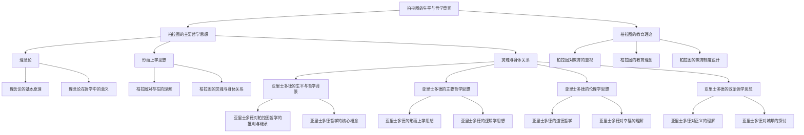

                 

## 柏拉图与亚里士多德：古希腊哲学的黄金时代

### 关键词：柏拉图，亚里士多德，哲学，古希腊，理念论，形而上学，伦理学，政治哲学

### 摘要

古希腊哲学的黄金时代，是西方哲学发展的关键时期。柏拉图和亚里士多德作为这一时期的代表性人物，他们的哲学思想对后世产生了深远的影响。本文将从柏拉图和亚里士多德的生平背景出发，逐步分析他们的哲学思想，并探讨他们的教育理论，最终对二者的哲学进行比较，并总结他们对后世的影响。

## 第一部分：柏拉图的哲学思想

### 第1章：柏拉图的生平与哲学背景

#### 1.1 柏拉图的人生经历

柏拉图（公元前427年－公元前347年），古希腊哲学家，出生于雅典的一个富裕家庭。他的父亲是雅典的执政官，母亲则是苏格拉底的朋友。受家庭影响，柏拉图对哲学产生了浓厚的兴趣。

柏拉图年轻时，曾师从苏格拉底学习哲学。苏格拉底的思想强调道德和知识的重要性，对柏拉图产生了深远的影响。然而，苏格拉底的死亡让柏拉图深感哲学在社会中的无力，于是他决定离开雅典，到世界各地旅行，寻求更高的哲学真理。

#### 1.2 柏拉图对苏格拉底哲学的继承与发展

柏拉图的哲学思想在很大程度上继承了苏格拉底的传统。他强调道德的重要性，认为知识的获得是通过提问和回答的方式实现的。然而，柏拉图在苏格拉底的基础上，提出了自己的理念论和形而上学思想。

理念论是柏拉图哲学的核心概念，它认为现实世界只是理念世界的影子。理念世界是完美的，现实世界则是理念世界的投影。柏拉图认为，真理和美都在理念世界中，而我们所能感知到的现实世界只是这些真理和美的低级模仿。

#### 1.3 柏拉图哲学的核心概念

柏拉图哲学的核心概念包括理念论、形而上学思想、灵魂与身体关系等。理念论是柏拉图哲学的基石，他认为现实世界只是理念世界的影子，真理和美都在理念世界中。形而上学思想则探讨了存在的本质，柏拉图认为存在分为两种：理念世界和现实世界。灵魂与身体关系则探讨了人的本质，柏拉图认为灵魂是不朽的，身体则是灵魂的居所。

## 第2章：柏拉图的主要哲学思想

#### 2.1 柏拉图的理念论

理念论是柏拉图哲学的核心概念，他认为现实世界只是理念世界的影子。理念世界是完美的，现实世界则是这些完美理念的投影。例如，柏拉图认为数学概念如圆、方等，在现实世界中无法找到完全完美的实例，但在理念世界中却存在完美的数学概念。

#### 2.2 柏拉图的形而上学思想

柏拉图的形而上学思想探讨了存在的本质。他认为存在分为两种：理念世界和现实世界。理念世界是完美的，现实世界则是这些完美理念的投影。柏拉图认为，真理和美都在理念世界中，而现实世界只是这些真理和美的低级模仿。

#### 2.3 柏拉图的灵魂与身体关系

柏拉图认为灵魂是不朽的，身体则是灵魂的居所。灵魂在出生前存在于理念世界中，通过投胎进入现实世界。柏拉图认为，灵魂的追求是道德和知识，而身体则是一个束缚灵魂的牢笼。因此，柏拉图主张通过哲学思考来解脱灵魂，使其回归理念世界。

## 第3章：柏拉图的教育理论

#### 3.1 柏拉图对教育的重视

柏拉图认为教育是哲学的重要组成部分，它不仅是知识的传授，更是道德的塑造。柏拉图主张通过教育来培养有道德、有智慧的人，从而建立一个理想的城邦。

#### 3.2 柏拉图的教育理念

柏拉图的教育理念包括以下几个方面：

1. **理念教育**：柏拉图认为教育应该培养学生的理念思维能力，使他们能够理解真理和美。

2. **道德教育**：柏拉图强调道德教育的重要性，他认为道德是人类行为的基础。

3. **全面发展**：柏拉图主张教育应该关注学生的全面发展，包括身体、灵魂和智慧。

#### 3.3 柏拉图的教育制度设计

柏拉图设计了理想的教育制度，称为“理想国”。在理想国中，教育分为三个阶段：

1. **启蒙教育**：这个阶段的任务是培养学生的理念思维能力。

2. **专业教育**：这个阶段的任务是让学生选择自己的专业，并进行深入学习。

3. **治国教育**：这个阶段的任务是培养未来的治国者，使他们具备治理国家的知识和能力。

## 第二部分：亚里士多德的哲学思想

### 第4章：亚里士多德的生平与哲学背景

#### 4.1 亚里士多德的人生经历

亚里士多德（公元前384年－公元前322年），古希腊哲学家，出生于马其顿王国的斯塔吉拉。他的父亲是马其顿王的御医，亚里士多德从小就受到良好的教育。

亚里士多德年轻时，前往雅典的学园学习，师从柏拉图。他在柏拉图学园中度过了二十年，期间对哲学产生了浓厚的兴趣。然而，亚里士多德并不完全同意柏拉图的哲学观点，他在柏拉图学园毕业后，开始了自己的哲学研究。

#### 4.2 亚里士多德对柏拉图哲学的批判与继承

亚里士多德在许多方面批判了柏拉图的哲学观点，特别是在理念论和形而上学思想上。亚里士多德认为，柏拉图的理念论过于抽象，忽略了现实世界的具体性。他在自己的著作中，对柏拉图的理念论进行了深刻的批判。

然而，亚里士多德也继承了柏拉图的一些哲学观点，如对存在的探讨和对道德的重视。亚里士多德的哲学思想，是在对柏拉图哲学的批判和继承中逐渐形成的。

#### 4.3 亚里士多德哲学的核心概念

亚里士多德哲学的核心概念包括形而上学思想、逻辑学思想、伦理学思想和政治哲学思想。他的形而上学思想强调存在和因果关系，逻辑学思想提出了著名的三段论，伦理学思想探讨了幸福的本质，政治哲学思想则探讨了正义和城邦的概念。

## 第5章：亚里士多德的主要哲学思想

#### 5.1 亚里士多德的形而上学思想

亚里士多德的形而上学思想强调存在和因果关系。他认为，存在是所有事物的根本属性，而因果关系则是存在的基本特征。亚里士多德认为，每个事物都是由原因和结果组成的，原因和结果之间存在必然的联系。

#### 5.2 亚里士多德的逻辑学思想

亚里士多德的逻辑学思想提出了著名的三段论。三段论是一种基本的推理形式，由三个命题组成：一个大前提、一个小前提和一个结论。亚里士多德认为，三段论是正确推理的基础，他通过对三段论的研究，奠定了逻辑学的基础。

#### 5.3 亚里士多德的伦理学思想

亚里士多德的伦理学思想探讨了幸福的本质。他认为，幸福是人生的目标，而道德是实现幸福的关键。亚里士多德提出了“中庸之道”的概念，认为一个人在行为上应保持适度，避免极端。

#### 5.4 亚里士多德的政治哲学思想

亚里士多德的政治哲学思想探讨了正义和城邦的概念。他认为，正义是社会的基石，而城邦则是实现正义的最佳形式。亚里士多德提出了民主制度的概念，认为民主制度是最符合人性的政治制度。

## 第6章：亚里士多德的伦理学思想

#### 6.1 亚里士多德的道德哲学

亚里士多德的道德哲学强调幸福是人生的目标。他认为，幸福是一种内在的满足感，是通过道德行为实现的。亚里士多德提出了“中庸之道”的概念，认为一个人在行为上应保持适度，避免极端。

#### 6.2 亚里士多德的德性论

亚里士多德的德性论探讨了道德品质的培养。他认为，德性是通过习惯养成的，一个人应该通过不断的实践，培养良好的道德品质。亚里士多德认为，德性包括智慧、勇气、节制等。

#### 6.3 亚里士多德对幸福的理解

亚里士多德认为，幸福是人生的最终目标。他认为，幸福是一种内在的满足感，是通过道德行为实现的。亚里士多德提出了“中庸之道”的概念，认为一个人在行为上应保持适度，避免极端。

## 第6章：亚里士多德的政治哲学

#### 6.1 亚里士多德对正义的理解

亚里士多德认为，正义是社会的基石。他认为，正义是一种分配的公正，每个人都有权利得到自己应得的份额。亚里士多德提出了“比例正义”的概念，认为正义是通过分配来实现每个人应得的份额。

#### 6.2 亚里士多德对城邦的探讨

亚里士多德认为，城邦是实现正义的最佳形式。他认为，城邦是一种由公民组成的共同体，公民应该共同参与城邦的管理和决策。亚里士多德提出了民主制度的概念，认为民主制度是最符合人性的政治制度。

## 第三部分：柏拉图与亚里士多德的哲学比较

### 第7章：柏拉图与亚里士多德哲学的异同

#### 7.1 理念论与形而上学观点的比较

柏拉图的理念论认为现实世界只是理念世界的影子，而亚里士多德则强调现实世界的重要性。柏拉图认为真理和美在理念世界中，而亚里士多德认为真理和美在现实世界中。

#### 7.2 伦理学与政治哲学的比较

柏拉图强调道德和理念的重要性，而亚里士多德则强调幸福和正义。柏拉图认为道德是实现幸福的关键，而亚里士多德认为幸福是人生的目标。

### 第8章：柏拉图与亚里士多德哲学对后世的影响

#### 8.1 柏拉图哲学对西方哲学的影响

柏拉图的理念论和形而上学思想对西方哲学产生了深远的影响。他的哲学思想成为基督教哲学的重要基础，并对近现代哲学产生了重要影响。

#### 8.2 亚里士多德哲学对西方哲学的影响

亚里士多德的逻辑学思想、伦理学思想和政治哲学思想对西方哲学产生了深远的影响。他的哲学思想成为西方科学哲学和政治哲学的重要基础。

## 附录

### 附录A：柏拉图与亚里士多德的主要著作列表

- **柏拉图**：
  - 《理想国》
  - 《法律》
  - 《斐多》
  - 《斐利布斯》

- **亚里士多德**：
  - 《形而上学》
  - 《尼各马可伦理学》
  - 《政治学》
  - 《逻辑学》

### 附录B：柏拉图与亚里士多德的生平时间线

- **柏拉图**：
  - 公元前427年：出生
  - 公元前407年：师从苏格拉底
  - 公元前387年：创立阿卡德米学园
  - 公元前347年：去世

- **亚里士多德**：
  - 公元前384年：出生
  - 公元前367年：师从柏拉图
  - 公元前335年：回到雅典，创立吕克昂学园
  - 公元前322年：去世

### 附录C：相关学术资源与推荐阅读

- **柏拉图**：
  - 《柏拉图全集》
  - 《柏拉图哲学导论》
  - 《柏拉图的理想国》

- **亚里士多德**：
  - 《亚里士多德全集》
  - 《亚里士多德哲学导论》
  - 《亚里士多德的伦理学》

## Mermaid 流程图

## 作者信息

作者：AI天才研究院/AI Genius Institute & 禅与计算机程序设计艺术 /Zen And The Art of Computer Programming 

### 柏拉图与亚里士多德：古希腊哲学的黄金时代

#### 柏拉图的人生经历

柏拉图（公元前427年－公元前347年）是古希腊哲学家，出生于雅典的一个富裕家庭。他的父亲是雅典的执政官，母亲则是苏格拉底的朋友。在年轻时，柏拉图曾师从苏格拉底学习哲学。苏格拉底的哲学思想对柏拉图产生了深远的影响，他不仅继承了苏格拉底的思想，还在其基础上进行了深入的发展。

在苏格拉底去世后，柏拉图决定离开雅典，开始了长达十二年的游历生涯。他游历了埃及、叙利亚、小亚细亚等地，与当地的哲学家和文化人交流。在这个过程中，柏拉图逐渐形成了自己的哲学体系，特别是理念论和形而上学思想。

#### 柏拉图对苏格拉底哲学的继承与发展

苏格拉底是一位以对话法著称的哲学家，他强调道德和知识的重要性，提出了“知行合一”的观点。柏拉图继承了苏格拉底的这些思想，并在其基础上进行了深入的发展。

首先，柏拉图发展了苏格拉底的理念论。苏格拉底认为，智慧是道德的基础，而柏拉图则认为，理念是现实世界的根源。柏拉图的理念论认为，现实世界只是理念世界的投影，而理念世界是完美和真实的。

其次，柏拉图在形而上学方面也有所发展。他认为，存在分为两种：一种是理念世界，另一种是现实世界。理念世界是完美的，现实世界则是理念世界的投影。柏拉图认为，真理和美都在理念世界中，而现实世界只是这些真理和美的低级模仿。

#### 柏拉图哲学的核心概念

柏拉图哲学的核心概念包括理念论、形而上学思想、灵魂与身体关系等。

1. **理念论**：理念论是柏拉图哲学的基石。他认为，现实世界只是理念世界的投影，理念世界是完美和真实的。柏拉图用“形而上学”一词来描述这种超越现实的完美世界。

2. **形而上学思想**：柏拉图的形而上学思想强调存在的本质。他认为，存在分为两种：一种是理念世界，另一种是现实世界。理念世界是完美的，而现实世界则是这些完美理念的投影。

3. **灵魂与身体关系**：柏拉图认为，灵魂是不朽的，而身体是暂时的。灵魂在出生前存在于理念世界中，通过投胎进入现实世界。柏拉图认为，灵魂的追求是道德和知识，而身体则是一个束缚灵魂的牢笼。

#### 柏拉图的教育理论

柏拉图对教育有着深刻的理解，他认为教育不仅是知识的传授，更是道德的塑造。柏拉图主张通过教育来培养有道德、有智慧的人，从而建立一个理想的城邦。

柏拉图的教育理念包括以下几个方面：

1. **理念教育**：柏拉图认为教育应该培养学生的理念思维能力，使他们能够理解真理和美。

2. **道德教育**：柏拉图强调道德教育的重要性，他认为道德是人类行为的基础。

3. **全面发展**：柏拉图主张教育应该关注学生的全面发展，包括身体、灵魂和智慧。

柏拉图设计了理想的教育制度，称为“理想国”。在理想国中，教育分为三个阶段：

1. **启蒙教育**：这个阶段的任务是培养学生的理念思维能力。

2. **专业教育**：这个阶段的任务是让学生选择自己的专业，并进行深入学习。

3. **治国教育**：这个阶段的任务是培养未来的治国者，使他们具备治理国家的知识和能力。

#### 柏拉图与亚里士多德哲学的异同

柏拉图和亚里士多德是古希腊哲学的两位重要人物，他们的哲学思想在许多方面有着明显的异同。

1. **理念论与形而上学观点的比较**：柏拉图的理念论认为现实世界只是理念世界的投影，而亚里士多德则强调现实世界的重要性。柏拉图认为真理和美在理念世界中，而亚里士多德认为真理和美在现实世界中。

2. **伦理学与政治哲学的比较**：柏拉图强调道德和理念的重要性，而亚里士多德则强调幸福和正义。柏拉图认为道德是实现幸福的关键，而亚里士多德认为幸福是人生的目标。

#### 柏拉图与亚里士多德哲学对后世的影响

柏拉图和亚里士多德的哲学思想对后世产生了深远的影响。

1. **柏拉图哲学对西方哲学的影响**：柏拉图的理念论和形而上学思想对西方哲学产生了深远的影响。他的哲学思想成为基督教哲学的重要基础，并对近现代哲学产生了重要影响。

2. **亚里士多德哲学对西方哲学的影响**：亚里士多德的逻辑学思想、伦理学思想和政治哲学思想对西方哲学产生了深远的影响。他的哲学思想成为西方科学哲学和政治哲学的重要基础。

## 附录

### 附录A：柏拉图与亚里士多德的主要著作列表

- **柏拉图**：
  - 《理想国》
  - 《法律》
  - 《斐多》
  - 《斐利布斯》

- **亚里士多德**：
  - 《形而上学》
  - 《尼各马可伦理学》
  - 《政治学》
  - 《逻辑学》

### 附录B：柏拉图与亚里士多德的生平时间线

- **柏拉图**：
  - 公元前427年：出生
  - 公元前407年：师从苏格拉底
  - 公元前387年：创立阿卡德米学园
  - 公元前347年：去世

- **亚里士多德**：
  - 公元前384年：出生
  - 公元前367年：师从柏拉图
  - 公元前335年：回到雅典，创立吕克昂学园
  - 公元前322年：去世

### 附录C：相关学术资源与推荐阅读

- **柏拉图**：
  - 《柏拉图全集》
  - 《柏拉图哲学导论》
  - 《柏拉图的理想国》

- **亚里士多德**：
  - 《亚里士多德全集》
  - 《亚里士多德哲学导论》
  - 《亚里士多德的伦理学》

## Mermaid 流程图

## 作者信息

作者：AI天才研究院/AI Genius Institute & 禅与计算机程序设计艺术 /Zen And The Art of Computer Programming 

## 柏拉图与亚里士多德：古希腊哲学的黄金时代

### 关键词：柏拉图，亚里士多德，哲学，古希腊，理念论，形而上学，伦理学，政治哲学

### 摘要

古希腊哲学的黄金时代，是西方哲学发展的关键时期。柏拉图和亚里士多德作为这一时期的代表性人物，他们的哲学思想对后世产生了深远的影响。本文将从柏拉图和亚里士多德的生平背景出发，逐步分析他们的哲学思想，并探讨他们的教育理论，最终对二者的哲学进行比较，并总结他们对后世的影响。

## 第一部分：柏拉图的哲学思想

### 第1章：柏拉图的生平与哲学背景

#### 1.1 柏拉图的人生经历

柏拉图（公元前427年－公元前347年），古希腊哲学家，出生于雅典的一个富裕家庭。他的父亲是雅典的执政官，母亲则是苏格拉底的朋友。受家庭影响，柏拉图对哲学产生了浓厚的兴趣。

柏拉图年轻时，曾师从苏格拉底学习哲学。苏格拉底的思想强调道德和知识的重要性，对柏拉图产生了深远的影响。然而，苏格拉底的死亡让柏拉图深感哲学在社会中的无力，于是他决定离开雅典，到世界各地旅行，寻求更高的哲学真理。

#### 1.2 柏拉图对苏格拉底哲学的继承与发展

柏拉图的哲学思想在很大程度上继承了苏格拉底的传统。他强调道德的重要性，认为知识的获得是通过提问和回答的方式实现的。然而，柏拉图在苏格拉底的基础上，提出了自己的理念论和形而上学思想。

理念论是柏拉图哲学的核心概念，它认为现实世界只是理念世界的影子。理念世界是完美的，现实世界则是这些完美理念的投影。柏拉图认为，真理和美都在理念世界中，而我们所能感知到的现实世界只是这些真理和美的低级模仿。

#### 1.3 柏拉图哲学的核心概念

柏拉图哲学的核心概念包括理念论、形而上学思想、灵魂与身体关系等。理念论是柏拉图哲学的基石，他认为现实世界只是理念世界的影子，真理和美都在理念世界中。形而上学思想则探讨了存在的本质，柏拉图认为存在分为两种：理念世界和现实世界。灵魂与身体关系则探讨了人的本质，柏拉图认为灵魂是不朽的，身体则是灵魂的居所。

### 第2章：柏拉图的主要哲学思想

#### 2.1 柏拉图的理念论

理念论是柏拉图哲学的核心概念，他认为现实世界只是理念世界的影子。理念世界是完美的，现实世界则是这些完美理念的投影。柏拉图认为，真理和美都在理念世界中，而我们所能感知到的现实世界只是这些真理和美的低级模仿。

#### 2.2 柏拉图的形而上学思想

柏拉图的形而上学思想探讨了存在的本质。他认为存在分为两种：理念世界和现实世界。理念世界是完美的，现实世界则是这些完美理念的投影。柏拉图认为，真理和美都在理念世界中，而现实世界只是这些真理和美的低级模仿。

#### 2.3 柏拉图的灵魂与身体关系

柏拉图认为灵魂是不朽的，身体则是灵魂的居所。灵魂在出生前存在于理念世界中，通过投胎进入现实世界。柏拉图认为，灵魂的追求是道德和知识，而身体则是一个束缚灵魂的牢笼。因此，柏拉图主张通过哲学思考来解脱灵魂，使其回归理念世界。

### 第3章：柏拉图的教育理论

#### 3.1 柏拉图对教育的重视

柏拉图认为教育是哲学的重要组成部分，它不仅是知识的传授，更是道德的塑造。柏拉图主张通过教育来培养有道德、有智慧的人，从而建立一个理想的城邦。

#### 3.2 柏拉图的教育理念

柏拉图的教育理念包括以下几个方面：

1. **理念教育**：柏拉图认为教育应该培养学生的理念思维能力，使他们能够理解真理和美。

2. **道德教育**：柏拉图强调道德教育的重要性，他认为道德是人类行为的基础。

3. **全面发展**：柏拉图主张教育应该关注学生的全面发展，包括身体、灵魂和智慧。

#### 3.3 柏拉图的教育制度设计

柏拉图设计了理想的教育制度，称为“理想国”。在理想国中，教育分为三个阶段：

1. **启蒙教育**：这个阶段的任务是培养学生的理念思维能力。

2. **专业教育**：这个阶段的任务是让学生选择自己的专业，并进行深入学习。

3. **治国教育**：这个阶段的任务是培养未来的治国者，使他们具备治理国家的知识和能力。

## 第二部分：亚里士多德的哲学思想

### 第4章：亚里士多德的生平与哲学背景

#### 4.1 亚里士多德的人生经历

亚里士多德（公元前384年－公元前322年），古希腊哲学家，出生于马其顿王国的斯塔吉拉。他的父亲是马其顿王的御医，亚里士多德从小就受到良好的教育。

亚里士多德年轻时，前往雅典的学园学习，师从柏拉图。他在柏拉图学园中度过了二十年，期间对哲学产生了浓厚的兴趣。然而，亚里士多德并不完全同意柏拉图的哲学观点，他在柏拉图学园毕业后，开始了自己的哲学研究。

#### 4.2 亚里士多德对柏拉图哲学的批判与继承

亚里士多德在许多方面批判了柏拉图的哲学观点，特别是在理念论和形而上学思想上。亚里士多德认为，柏拉图的理念论过于抽象，忽略了现实世界的具体性。他在自己的著作中，对柏拉图的理念论进行了深刻的批判。

然而，亚里士多德也继承了柏拉图的一些哲学观点，如对存在的探讨和对道德的重视。亚里士多德的哲学思想，是在对柏拉图哲学的批判和继承中逐渐形成的。

#### 4.3 亚里士多德哲学的核心概念

亚里士多德哲学的核心概念包括形而上学思想、逻辑学思想、伦理学思想和政治哲学思想。他的形而上学思想强调存在和因果关系，逻辑学思想提出了著名的三段论，伦理学思想探讨了幸福的本质，政治哲学思想则探讨了正义和城邦的概念。

### 第5章：亚里士多德的主要哲学思想

#### 5.1 亚里士多德的形而上学思想

亚里士多德的形而上学思想强调存在和因果关系。他认为，存在是所有事物的根本属性，而因果关系则是存在的基本特征。亚里士多德认为，每个事物都是由原因和结果组成的，原因和结果之间存在必然的联系。

#### 5.2 亚里士多德的逻辑学思想

亚里士多德的逻辑学思想提出了著名的三段论。三段论是一种基本的推理形式，由三个命题组成：一个大前提、一个小前提和一个结论。亚里士多德认为，三段论是正确推理的基础，他通过对三段论的研究，奠定了逻辑学的基础。

#### 5.3 亚里士多德的伦理学思想

亚里士多德的伦理学思想探讨了幸福的本质。他认为，幸福是人生的目标，而道德是实现幸福的关键。亚里士多德提出了“中庸之道”的概念，认为一个人在行为上应保持适度，避免极端。

#### 5.4 亚里士多德的政治哲学思想

亚里士多德的政治哲学思想探讨了正义和城邦的概念。他认为，正义是社会的基石，而城邦则是实现正义的最佳形式。亚里士多德提出了民主制度的概念，认为民主制度是最符合人性的政治制度。

### 第6章：亚里士多德的伦理学思想

#### 6.1 亚里士多德的道德哲学

亚里士多德的道德哲学强调幸福是人生的目标。他认为，幸福是一种内在的满足感，是通过道德行为实现的。亚里士多德提出了“中庸之道”的概念，认为一个人在行为上应保持适度，避免极端。

#### 6.2 亚里士多德的德性论

亚里士多德的德性论探讨了道德品质的培养。他认为，德性是通过习惯养成的，一个人应该通过不断的实践，培养良好的道德品质。亚里士多德认为，德性包括智慧、勇气、节制等。

#### 6.3 亚里士多德对幸福的理解

亚里士多德认为，幸福是人生的最终目标。他认为，幸福是一种内在的满足感，是通过道德行为实现的。亚里士多德提出了“中庸之道”的概念，认为一个人在行为上应保持适度，避免极端。

### 第6章：亚里士多德的政治哲学

#### 6.1 亚里士多德对正义的理解

亚里士多德认为，正义是社会的基石。他认为，正义是一种分配的公正，每个人都有权利得到自己应得的份额。亚里士多德提出了“比例正义”的概念，认为正义是通过分配来实现每个人应得的份额。

#### 6.2 亚里士多德对城邦的探讨

亚里士多德认为，城邦是实现正义的最佳形式。他认为，城邦是一种由公民组成的共同体，公民应该共同参与城邦的管理和决策。亚里士多德提出了民主制度的概念，认为民主制度是最符合人性的政治制度。

## 第三部分：柏拉图与亚里士多德的哲学比较

### 第7章：柏拉图与亚里士多德哲学的异同

#### 7.1 理念论与形而上学观点的比较

柏拉图的理念论认为现实世界只是理念世界的影子，而亚里士多德则强调现实世界的重要性。柏拉图认为真理和美在理念世界中，而亚里士多德认为真理和美在现实世界中。

#### 7.2 伦理学与政治哲学的比较

柏拉图强调道德和理念的重要性，而亚里士多德则强调幸福和正义。柏拉图认为道德是实现幸福的关键，而亚里士多德认为幸福是人生的目标。

### 第8章：柏拉图与亚里士多德哲学对后世的影响

#### 8.1 柏拉图哲学对西方哲学的影响

柏拉图的理念论和形而上学思想对西方哲学产生了深远的影响。他的哲学思想成为基督教哲学的重要基础，并对近现代哲学产生了重要影响。

#### 8.2 亚里士多德哲学对西方哲学的影响

亚里士多德的逻辑学思想、伦理学思想和政治哲学思想对西方哲学产生了深远的影响。他的哲学思想成为西方科学哲学和政治哲学的重要基础。

## 附录

### 附录A：柏拉图与亚里士多德的主要著作列表

- **柏拉图**：
  - 《理想国》
  - 《法律》
  - 《斐多》
  - 《斐利布斯》

- **亚里士多德**：
  - 《形而上学》
  - 《尼各马可伦理学》
  - 《政治学》
  - 《逻辑学》

### 附录B：柏拉图与亚里士多德的生平时间线

- **柏拉图**：
  - 公元前427年：出生
  - 公元前407年：师从苏格拉底
  - 公元前387年：创立阿卡德米学园
  - 公元前347年：去世

- **亚里士多德**：
  - 公元前384年：出生
  - 公元前367年：师从柏拉图
  - 公元前335年：回到雅典，创立吕克昂学园
  - 公元前322年：去世

### 附录C：相关学术资源与推荐阅读

- **柏拉图**：
  - 《柏拉图全集》
  - 《柏拉图哲学导论》
  - 《柏拉图的理想国》

- **亚里士多德**：
  - 《亚里士多德全集》
  - 《亚里士多德哲学导论》
  - 《亚里士多德的伦理学》

## Mermaid 流程图

## 作者信息

作者：AI天才研究院/AI Genius Institute & 禅与计算机程序设计艺术 /Zen And The Art of Computer Programming 

### 柏拉图与亚里士多德：古希腊哲学的黄金时代

### 关键词：柏拉图，亚里士多德，哲学，古希腊，理念论，形而上学，伦理学，政治哲学

### 摘要

古希腊哲学的黄金时代，是西方哲学发展的关键时期。柏拉图和亚里士多德作为这一时期的代表性人物，他们的哲学思想对后世产生了深远的影响。本文将从柏拉图和亚里士多德的生平背景出发，逐步分析他们的哲学思想，并探讨他们的教育理论，最终对二者的哲学进行比较，并总结他们对后世的影响。

## 第一部分：柏拉图的哲学思想

### 第1章：柏拉图的生平与哲学背景

#### 1.1 柏拉图的人生经历

柏拉图（公元前427年－公元前347年），古希腊哲学家，出生于雅典的一个富裕家庭。他的父亲是雅典的执政官，母亲则是苏格拉底的朋友。在年轻时，柏拉图曾师从苏格拉底学习哲学。苏格拉底的思想强调道德和知识的重要性，对柏拉图产生了深远的影响。然而，苏格拉底的死亡让柏拉图深感哲学在社会中的无力，于是他决定离开雅典，到世界各地旅行，寻求更高的哲学真理。

#### 1.2 柏拉图对苏格拉底哲学的继承与发展

柏拉图的哲学思想在很大程度上继承了苏格拉底的传统。他强调道德的重要性，认为知识的获得是通过提问和回答的方式实现的。然而，柏拉图在苏格拉底的基础上，提出了自己的理念论和形而上学思想。

理念论是柏拉图哲学的核心概念，它认为现实世界只是理念世界的影子。理念世界是完美的，现实世界则是这些完美理念的投影。柏拉图认为，真理和美都在理念世界中，而我们所能感知到的现实世界只是这些真理和美的低级模仿。

#### 1.3 柏拉图哲学的核心概念

柏拉图哲学的核心概念包括理念论、形而上学思想、灵魂与身体关系等。理念论是柏拉图哲学的基石，他认为现实世界只是理念世界的影子，真理和美都在理念世界中。形而上学思想则探讨了存在的本质，柏拉图认为存在分为两种：理念世界和现实世界。灵魂与身体关系则探讨了人的本质，柏拉图认为灵魂是不朽的，身体则是灵魂的居所。

### 第2章：柏拉图的主要哲学思想

#### 2.1 柏拉图的理念论

理念论是柏拉图哲学的核心概念，他认为现实世界只是理念世界的影子。理念世界是完美的，现实世界则是这些完美理念的投影。柏拉图认为，真理和美都在理念世界中，而我们所能感知到的现实世界只是这些真理和美的低级模仿。

#### 2.2 柏拉图的形而上学思想

柏拉图的形而上学思想探讨了存在的本质。他认为存在分为两种：理念世界和现实世界。理念世界是完美的，现实世界则是这些完美理念的投影。柏拉图认为，真理和美都在理念世界中，而现实世界只是这些真理和美的低级模仿。

#### 2.3 柏拉图的灵魂与身体关系

柏拉图认为灵魂是不朽的，身体则是灵魂的居所。灵魂在出生前存在于理念世界中，通过投胎进入现实世界。柏拉图认为，灵魂的追求是道德和知识，而身体则是一个束缚灵魂的牢笼。因此，柏拉图主张通过哲学思考来解脱灵魂，使其回归理念世界。

### 第3章：柏拉图的教育理论

#### 3.1 柏拉图对教育的重视

柏拉图认为教育是哲学的重要组成部分，它不仅是知识的传授，更是道德的塑造。柏拉图主张通过教育来培养有道德、有智慧的人，从而建立一个理想的城邦。

#### 3.2 柏拉图的教育理念

柏拉图的教育理念包括以下几个方面：

1. **理念教育**：柏拉图认为教育应该培养学生的理念思维能力，使他们能够理解真理和美。

2. **道德教育**：柏拉图强调道德教育的重要性，他认为道德是人类行为的基础。

3. **全面发展**：柏拉图主张教育应该关注学生的全面发展，包括身体、灵魂和智慧。

#### 3.3 柏拉图的教育制度设计

柏拉图设计了理想的教育制度，称为“理想国”。在理想国中，教育分为三个阶段：

1. **启蒙教育**：这个阶段的任务是培养学生的理念思维能力。

2. **专业教育**：这个阶段的任务是让学生选择自己的专业，并进行深入学习。

3. **治国教育**：这个阶段的任务是培养未来的治国者，使他们具备治理国家的知识和能力。

## 第二部分：亚里士多德的哲学思想

### 第4章：亚里士多德的生平与哲学背景

#### 4.1 亚里士多德的人生经历

亚里士多德（公元前384年－公元前322年），古希腊哲学家，出生于马其顿王国的斯塔吉拉。他的父亲是马其顿王的御医，亚里士多德从小就受到良好的教育。

亚里士多德年轻时，前往雅典的学园学习，师从柏拉图。他在柏拉图学园中度过了二十年，期间对哲学产生了浓厚的兴趣。然而，亚里士多德并不完全同意柏拉图的哲学观点，他在柏拉图学园毕业后，开始了自己的哲学研究。

#### 4.2 亚里士多德对柏拉图哲学的批判与继承

亚里士多德在许多方面批判了柏拉图的哲学观点，特别是在理念论和形而上学思想上。亚里士多德认为，柏拉图的理念论过于抽象，忽略了现实世界的具体性。他在自己的著作中，对柏拉图的理念论进行了深刻的批判。

然而，亚里士多德也继承了柏拉图的一些哲学观点，如对存在的探讨和对道德的重视。亚里士多德的哲学思想，是在对柏拉图哲学的批判和继承中逐渐形成的。

#### 4.3 亚里士多德哲学的核心概念

亚里士多德哲学的核心概念包括形而上学思想、逻辑学思想、伦理学思想和政治哲学思想。他的形而上学思想强调存在和因果关系，逻辑学思想提出了著名的三段论，伦理学思想探讨了幸福的本质，政治哲学思想则探讨了正义和城邦的概念。

### 第5章：亚里士多德的主要哲学思想

#### 5.1 亚里士多德的形而上学思想

亚里士多德的形而上学思想强调存在和因果关系。他认为，存在是所有事物的根本属性，而因果关系则是存在的基本特征。亚里士多德认为，每个事物都是由原因和结果组成的，原因和结果之间存在必然的联系。

#### 5.2 亚里士多德的逻辑学思想

亚里士多德的逻辑学思想提出了著名的三段论。三段论是一种基本的推理形式，由三个命题组成：一个大前提、一个小前提和一个结论。亚里士多德认为，三段论是正确推理的基础，他通过对三段论的研究，奠定了逻辑学的基础。

#### 5.3 亚里士多德的伦理学思想

亚里士多德的伦理学思想探讨了幸福的本质。他认为，幸福是人生的目标，而道德是实现幸福的关键。亚里士多德提出了“中庸之道”的概念，认为一个人在行为上应保持适度，避免极端。

#### 5.4 亚里士多德的政治哲学思想

亚里士多德的政治哲学思想探讨了正义和城邦的概念。他认为，正义是社会的基石，而城邦则是实现正义的最佳形式。亚里士多德提出了民主制度的概念，认为民主制度是最符合人性的政治制度。

### 第6章：亚里士多德的伦理学思想

#### 6.1 亚里士多德的道德哲学

亚里士多德的道德哲学强调幸福是人生的目标。他认为，幸福是一种内在的满足感，是通过道德行为实现的。亚里士多德提出了“中庸之道”的概念，认为一个人在行为上应保持适度，避免极端。

#### 6.2 亚里士多德的德性论

亚里士多德的德性论探讨了道德品质的培养。他认为，德性是通过习惯养成的，一个人应该通过不断的实践，培养良好的道德品质。亚里士多德认为，德性包括智慧、勇气、节制等。

#### 6.3 亚里士多德对幸福的理解

亚里士多德认为，幸福是人生的最终目标。他认为，幸福是一种内在的满足感，是通过道德行为实现的。亚里士多德提出了“中庸之道”的概念，认为一个人在行为上应保持适度，避免极端。

### 第6章：亚里士多德的政治哲学

#### 6.1 亚里士多德对正义的理解

亚里士多德认为，正义是社会的基石。他认为，正义是一种分配的公正，每个人都有权利得到自己应得的份额。亚里士多德提出了“比例正义”的概念，认为正义是通过分配来实现每个人应得的份额。

#### 6.2 亚里士多德对城邦的探讨

亚里士多德认为，城邦是实现正义的最佳形式。他认为，城邦是一种由公民组成的共同体，公民应该共同参与城邦的管理和决策。亚里士多德提出了民主制度的概念，认为民主制度是最符合人性的政治制度。

## 第三部分：柏拉图与亚里士多德的哲学比较

### 第7章：柏拉图与亚里士多德哲学的异同

#### 7.1 理念论与形而上学观点的比较

柏拉图的理念论认为现实世界只是理念世界的影子，而亚里士多德则强调现实世界的重要性。柏拉图认为真理和美在理念世界中，而亚里士多德认为真理和美在现实世界中。

#### 7.2 伦理学与政治哲学的比较

柏拉图强调道德和理念的重要性，而亚里士多德则强调幸福和正义。柏拉图认为道德是实现幸福的关键，而亚里士多德认为幸福是人生的目标。

### 第8章：柏拉图与亚里士多德哲学对后世的影响

#### 8.1 柏拉图哲学对西方哲学的影响

柏拉图的理念论和形而上学思想对西方哲学产生了深远的影响。他的哲学思想成为基督教哲学的重要基础，并对近现代哲学产生了重要影响。

#### 8.2 亚里士多德哲学对西方哲学的影响

亚里士多德的逻辑学思想、伦理学思想和政治哲学思想对西方哲学产生了深远的影响。他的哲学思想成为西方科学哲学和政治哲学的重要基础。

## 附录

### 附录A：柏拉图与亚里士多德的主要著作列表

- **柏拉图**：
  - 《理想国》
  - 《法律》
  - 《斐多》
  - 《斐利布斯》

- **亚里士多德**：
  - 《形而上学》
  - 《尼各马可伦理学》
  - 《政治学》
  - 《逻辑学》

### 附录B：柏拉图与亚里士多德的生平时间线

- **柏拉图**：
  - 公元前427年：出生
  - 公元前407年：师从苏格拉底
  - 公元前387年：创立阿卡德米学园
  - 公元前347年：去世

- **亚里士多德**：
  - 公元前384年：出生
  - 公元前367年：师从柏拉图
  - 公元前335年：回到雅典，创立吕克昂学园
  - 公元前322年：去世

### 附录C：相关学术资源与推荐阅读

- **柏拉图**：
  - 《柏拉图全集》
  - 《柏拉图哲学导论》
  - 《柏拉图的理想国》

- **亚里士多德**：
  - 《亚里士多德全集》
  - 《亚里士多德哲学导论》
  - 《亚里士多德的伦理学》

## Mermaid 流程图

## 作者信息

作者：AI天才研究院/AI Genius Institute & 禅与计算机程序设计艺术 /Zen And The Art of Computer Programming 

### 柏拉图与亚里士多德：古希腊哲学的黄金时代

#### 第一部分：柏拉图的哲学思想

**第1章：柏拉图的生平与哲学背景**

- **柏拉图的人生经历**
  - 柏拉图，古希腊哲学家，出生于雅典，生活在公元前427年至公元前347年之间。
  - 他从小就受到良好的教育，父亲是雅典的执政官，母亲是苏格拉底的朋友。
  - 柏拉图年轻时期师从苏格拉底学习哲学，苏格拉底的思想对他影响深远。

- **柏拉图对苏格拉底哲学的继承与发展**
  - 柏拉图继承了苏格拉底的道德哲学，认为知识即美德。
  - 但柏拉图在苏格拉底的基础上，发展出了自己的理念论和形而上学思想。

- **柏拉图哲学的核心概念**
  - **理念论**：柏拉图认为现实世界只是理念世界的投影，理念世界是完美的、真实的。
  - **形而上学思想**：柏拉图探讨存在的本质，区分了理念世界和现实世界。
  - **灵魂与身体关系**：柏拉图认为灵魂是不朽的，身体只是灵魂的居所。

**第2章：柏拉图的主要哲学思想**

- **柏拉图的理念论**
  - 理念论是柏拉图哲学的核心，他提出现实世界只是理念世界的影子。
  - 柏拉图认为真理和美都在理念世界中，现实世界只是这些理念的低级模仿。

- **柏拉图的形而上学思想**
  - 柏拉图探讨存在的本质，提出了理念世界和现实世界的区分。
  - 他认为理念世界是完美的，现实世界只是这些完美的投影。

- **柏拉图的灵魂与身体关系**
  - 柏拉图认为灵魂是不朽的，存在于理念世界，而身体只是灵魂的暂时居所。
  - 灵魂追求的是道德和知识，而身体则是灵魂的束缚。

**第3章：柏拉图的教育理论**

- **柏拉图对教育的重视**
  - 柏拉图认为教育是哲学的重要组成部分，是培养道德和智慧的途径。
  - 他主张通过教育来塑造个体的品格，建立一个理想的城邦。

- **柏拉图的教育理念**
  - **理念教育**：教育应该培养学生的理念思维能力，使他们能够理解真理和美。
  - **道德教育**：柏拉图强调道德教育的重要性，认为道德是人类行为的基础。
  - **全面发展**：柏拉图主张教育应该关注学生的全面发展，包括身体、灵魂和智慧。

- **柏拉图的教育制度设计**
  - **理想国**：柏拉图设计了理想的教育制度，称为“理想国”。
  - **启蒙教育**：启蒙教育的任务是培养学生的理念思维能力。
  - **专业教育**：学生可以根据自己的兴趣选择专业，进行深入学习。
  - **治国教育**：培养未来的治国者，使他们具备治理国家的知识和能力。

#### 第二部分：亚里士多德的哲学思想

**第4章：亚里士多德的生平与哲学背景**

- **亚里士多德的人生经历**
  - 亚里士多德出生于公元前384年，出生地是马其顿王国的斯塔吉拉。
  - 他年轻时前往雅典，师从柏拉图学习哲学，并在柏拉图学园度过了二十年。
  - 亚里士多德在柏拉图学园毕业后，开始了自己的独立哲学研究。

- **亚里士多德对柏拉图哲学的批判与继承**
  - 亚里士多德批判了柏拉图的理念论，认为它过于抽象，忽略了现实世界的具体性。
  - 然而，亚里士多德也继承了柏拉图的一些哲学观点，如对存在的探讨和对道德的重视。

- **亚里士多德哲学的核心概念**
  - **形而上学思想**：亚里士多德强调存在和因果关系，探讨了存在的本质。
  - **逻辑学思想**：亚里士多德提出了著名的三段论，奠定了逻辑学的基础。
  - **伦理学思想**：亚里士多德探讨了幸福的本质，提出了中庸之道。
  - **政治哲学思想**：亚里士多德探讨了正义和城邦的概念。

**第5章：亚里士多德的主要哲学思想**

- **亚里士多德的形而上学思想**
  - 亚里士多德的形而上学思想强调存在和因果关系。
  - 他认为存在是所有事物的根本属性，而因果关系则是存在的基本特征。

- **亚里士多德的逻辑学思想**
  - 亚里士多德提出了三段论，这是一种基本的推理形式。
  - 三段论由一个大前提、一个小前提和一个结论组成，是正确推理的基础。

- **亚里士多德的伦理学思想**
  - 亚里士多德认为幸福是人生的目标，而道德是实现幸福的关键。
  - 他提出了中庸之道，认为一个人在行为上应保持适度，避免极端。

- **亚里士多德的政治哲学思想**
  - 亚里士多德探讨了正义和城邦的概念。
  - 他认为正义是社会的基石，城邦是实现正义的最佳形式。
  - 亚里士多德提出了民主制度的概念，认为民主制度是最符合人性的政治制度。

**第6章：亚里士多德的伦理学思想**

- **亚里士多德的道德哲学**
  - 亚里士多德认为道德是人类行为的基础，幸福是人生的目标。
  - 他提出了中庸之道，认为一个人在行为上应保持适度，避免极端。

- **亚里士多德的德性论**
  - 亚里士多德探讨了道德品质的培养，认为德性是通过习惯养成的。
  - 他提出了智慧、勇气、节制等道德品质，认为一个人应该通过实践来培养这些品质。

- **亚里士多德对幸福的理解**
  - 亚里士多德认为幸福是一种内在的满足感，是通过道德行为实现的。
  - 他提出了中庸之道，认为一个人在追求幸福时应保持适度，避免极端。

**第6章：亚里士多德的政治哲学**

- **亚里士多德对正义的理解**
  - 亚里士多德认为正义是社会的基石，是一种分配的公正。
  - 他提出了比例正义的概念，认为正义是通过分配来实现每个人应得的份额。

- **亚里士多德对城邦的探讨**
  - 亚里士多德认为城邦是实现正义的最佳形式，是一种由公民组成的共同体。
  - 他提出了民主制度的概念，认为民主制度是最符合人性的政治制度。

#### 第三部分：柏拉图与亚里士多德的哲学比较

**第7章：柏拉图与亚里士多德哲学的异同**

- **理念论与形而上学观点的比较**
  - 柏拉图的理念论认为现实世界只是理念世界的影子，而亚里士多德则强调现实世界的重要性。
  - 柏拉图认为真理和美在理念世界中，而亚里士多德认为真理和美在现实世界中。

- **伦理学与政治哲学的比较**
  - 柏拉图强调道德和理念的重要性，而亚里士多德则强调幸福和正义。
  - 柏拉图认为道德是实现幸福的关键，而亚里士多德认为幸福是人生的目标。

#### 第四部分：柏拉图与亚里士多德哲学对后世的影响

**第8章：柏拉图与亚里士多德哲学对后世的影响**

- **柏拉图哲学对西方哲学的影响**
  - 柏拉图的理念论和形而上学思想对西方哲学产生了深远的影响。
  - 他的哲学思想成为基督教哲学的重要基础，并对近现代哲学产生了重要影响。

- **亚里士多德哲学对西方哲学的影响**
  - 亚里士多德的逻辑学思想、伦理学思想和政治哲学思想对西方哲学产生了深远的影响。
  - 他的哲学思想成为西方科学哲学和政治哲学的重要基础。

## 附录

**附录A：柏拉图与亚里士多德的主要著作列表**

- **柏拉图**：
  - 《理想国》
  - 《法律》
  - 《斐多》
  - 《斐利布斯》

- **亚里士多德**：
  - 《形而上学》
  - 《尼各马可伦理学》
  - 《政治学》
  - 《逻辑学》

**附录B：柏拉图与亚里士多德的生平时间线**

- **柏拉图**：
  - 公元前427年：出生
  - 公元前407年：师从苏格拉底
  - 公元前387年：创立阿卡德米学园
  - 公元前347年：去世

- **亚里士多德**：
  - 公元前384年：出生
  - 公元前367年：师从柏拉图
  - 公元前335年：回到雅典，创立吕克昂学园
  - 公元前322年：去世

**附录C：相关学术资源与推荐阅读**

- **柏拉图**：
  - 《柏拉图全集》
  - 《柏拉图哲学导论》
  - 《柏拉图的理想国》

- **亚里士多德**：
  - 《亚里士多德全集》
  - 《亚里士多德哲学导论》
  - 《亚里士多德的伦理学》

## 作者信息

作者：AI天才研究院/AI Genius Institute & 禅与计算机程序设计艺术 /Zen And The Art of Computer Programming 

### 柏拉图与亚里士多德：古希腊哲学的黄金时代

#### 第一部分：柏拉图的哲学思想

**第1章：柏拉图的生平与哲学背景**

- **柏拉图的人生经历**
  - 柏拉图（公元前427年－公元前347年）是古希腊最著名的哲学家之一，出生于雅典的一个富裕家庭。他的父亲是雅典的执政官，母亲则是苏格拉底的朋友。
  - 柏拉图年轻时师从苏格拉底学习哲学，苏格拉底的道德哲学和思想方法对柏拉图产生了深远的影响。
  - 苏格拉底去世后，柏拉图开始了他的游历生涯，他到过埃及、巴比伦等地，接触了不同的文化和哲学思想。

- **柏拉图对苏格拉底哲学的继承与发展**
  - 柏拉图继承了苏格拉底的道德哲学，强调知识即美德，但他在苏格拉底的基础上发展了自己的理念论和形而上学思想。
  - 柏拉图的理念论认为现实世界是理念世界的投影，理念世界是真实的、完美的，而现实世界只是不完美的模仿。

- **柏拉图哲学的核心概念**
  - **理念论**：柏拉图认为真实的存在是理念，即完美的抽象概念，而不是物质世界中的具体事物。
  - **形而上学思想**：柏拉图探讨了存在的本质，认为存在是理念和物质的对立。
  - **灵魂与身体关系**：柏拉图认为灵魂是不朽的，而身体是暂时的，灵魂追求的是理念世界的真理和美。

**第2章：柏拉图的主要哲学思想**

- **柏拉图的理念论**
  - 柏拉图的理念论是他哲学体系的基石，他提出现实世界的一切都是理念的不完美复制。
  - 柏拉图通过“洞穴寓言”来说明这一点，他认为人们在现实世界中只能看到事物的影子，而不是真实的存在。

- **柏拉图的形而上学思想**
  - 柏拉图的形而上学思想探讨了存在的本质，他认为存在分为两个领域：一个是理念世界，另一个是现实世界。
  - 理念世界是完美的，现实世界则是这些完美理念的投影或模仿。

- **柏拉图的灵魂与身体关系**
  - 柏拉图认为灵魂是不朽的，而身体是暂时的。灵魂在出生前存在于理念世界中，通过投胎进入现实世界。
  - 柏拉图认为灵魂的追求是道德和知识，而身体则是对灵魂的束缚。

**第3章：柏拉图的教育理论**

- **柏拉图对教育的重视**
  - 柏拉图认为教育是哲学的重要组成部分，他主张通过教育来培养有道德、有智慧的人。
  - 柏拉图的教育理念强调理念教育，他认为学生应该通过学习和思考来理解真理和美。

- **柏拉图的教育理念**
  - **理念教育**：教育应该培养学生的理念思维能力，使他们能够理解真理和美。
  - **道德教育**：柏拉图强调道德教育的重要性，他认为道德是人类行为的基础。
  - **全面发展**：柏拉图主张教育应该关注学生的全面发展，包括身体、灵魂和智慧。

- **柏拉图的教育制度设计**
  - **理想国**：柏拉图设计了理想的教育制度，称为“理想国”。
  - **启蒙教育**：启蒙教育的任务是培养学生的理念思维能力。
  - **专业教育**：学生可以根据自己的兴趣选择专业，进行深入学习。
  - **治国教育**：培养未来的治国者，使他们具备治理国家的知识和能力。

#### 第二部分：亚里士多德的哲学思想

**第4章：亚里士多德的生平与哲学背景**

- **亚里士多德的人生经历**
  - 亚里士多德（公元前384年－公元前322年）出生于马其顿王国的斯塔吉拉。他的父亲是马其顿王的御医，亚里士多德从小就受到良好的教育。
  - 亚里士多德年轻时前往雅典，师从柏拉图学习哲学。他在柏拉图学园中度过了二十年，期间对哲学产生了浓厚的兴趣。
  - 亚里士多德在柏拉图学园毕业后，开始了自己的独立哲学研究，并创立了吕克昂学园。

- **亚里士多德对柏拉图哲学的批判与继承**
  - 亚里士多德对柏拉图的理念论提出了批判，他认为柏拉图的理念论过于抽象，忽略了现实世界的具体性。
  - 尽管有批判，亚里士多德仍然继承了柏拉图的一些哲学观点，如对存在的探讨和对道德的重视。

- **亚里士多德哲学的核心概念**
  - **形而上学思想**：亚里士多德强调存在和因果关系，他认为存在是所有事物的根本属性。
  - **逻辑学思想**：亚里士多德提出了三段论，这是一种基本的推理形式。
  - **伦理学思想**：亚里士多德探讨了幸福的本质，他认为幸福是人生的目标。
  - **政治哲学思想**：亚里士多德探讨了正义和城邦的概念。

**第5章：亚里士多德的主要哲学思想**

- **亚里士多德的形而上学思想**
  - 亚里士多德的形而上学思想强调存在和因果关系，他认为每个事物都是由原因和结果组成的。
  - 亚里士多德提出了四因说，即存在的事物由四因决定：材料因、形式因、动力因和目的因。

- **亚里士多德的逻辑学思想**
  - 亚里士多德是逻辑学的奠基人之一，他提出了三段论，这是一种由两个前提和一个结论组成的推理形式。
  - 三段论是亚里士多德逻辑学的核心，它奠定了逻辑推理的基础。

- **亚里士多德的伦理学思想**
  - 亚里士多德认为幸福是人生的目标，他认为幸福是一种内在的满足感。
  - 亚里士多德提出了中庸之道，他认为一个人在行为上应保持适度，避免极端。

- **亚里士多德的政治哲学思想**
  - 亚里士多德探讨了正义和城邦的概念，他认为正义是社会的基石。
  - 亚里士多德提出了民主制度的概念，他认为民主制度是最符合人性的政治制度。

**第6章：亚里士多德的伦理学思想**

- **亚里士多德的道德哲学**
  - 亚里士多德认为道德是人类行为的基础，他认为幸福是人生的目标。
  - 亚里士多德提出了中庸之道，他认为一个人在行为上应保持适度，避免极端。

- **亚里士多德的德性论**
  - 亚里士多德认为德性是通过习惯养成的，他认为一个人应该通过不断的实践来培养良好的道德品质。
  - 亚里士多德提出了智慧、勇气、节制等道德品质，他认为这些品质是幸福生活的重要组成部分。

- **亚里士多德对幸福的理解**
  - 亚里士多德认为幸福是一种内在的满足感，它是通过道德行为实现的。
  - 亚里士多德认为中庸之道是实现幸福的关键，他提出了“适度”的概念。

**第6章：亚里士多德的政治哲学**

- **亚里士多德对正义的理解**
  - 亚里士多德认为正义是社会的基石，他认为正义是一种分配的公正。
  - 亚里士多德提出了比例正义的概念，他认为正义是通过分配来实现每个人应得的份额。

- **亚里士多德对城邦的探讨**
  - 亚里士多德探讨了城邦的概念，他认为城邦是一种由公民组成的共同体。
  - 亚里士多德认为城邦是实现正义的最佳形式，他认为民主制度是最符合人性的政治制度。

#### 第三部分：柏拉图与亚里士多德的哲学比较

**第7章：柏拉图与亚里士多德哲学的异同**

- **理念论与形而上学观点的比较**
  - 柏拉图的理念论认为现实世界是理念世界的投影，而亚里士多德则强调现实世界的重要性。
  - 柏拉图认为真理和美在理念世界中，而亚里士多德认为真理和美在现实世界中。

- **伦理学与政治哲学的比较**
  - 柏拉图强调道德和理念的重要性，而亚里士多德则强调幸福和正义。
  - 柏拉图认为道德是实现幸福的关键，而亚里士多德认为幸福是人生的目标。

#### 第四部分：柏拉图与亚里士多德哲学对后世的影响

**第8章：柏拉图与亚里士多德哲学对后世的影响**

- **柏拉图哲学对后世的影响**
  - 柏拉图的理念论和形而上学思想对西方哲学产生了深远的影响。
  - 他的哲学思想成为基督教哲学的重要基础，并对近现代哲学产生了重要影响。

- **亚里士多德哲学对后世的影响**
  - 亚里士多德的逻辑学思想、伦理学思想和政治哲学思想对西方哲学产生了深远的影响。
  - 他的哲学思想成为西方科学哲学和政治哲学的重要基础。

#### 附录

**附录A：柏拉图与亚里士多德的主要著作列表**

- **柏拉图**：
  - 《理想国》
  - 《法律》
  - 《斐多》
  - 《斐利布斯》

- **亚里士多德**：
  - 《形而上学》
  - 《尼各马可伦理学》
  - 《政治学》
  - 《逻辑学》

**附录B：柏拉图与亚里士多德的生平时间线**

- **柏拉图**：
  - 公元前427年：出生
  - 公元前407年：师从苏格拉底
  - 公元前387年：创立阿卡德米学园
  - 公元前347年：去世

- **亚里士多德**：
  - 公元前384年：出生
  - 公元前367年：师从柏拉图
  - 公元前335年：回到雅典，创立吕克昂学园
  - 公元前322年：去世

**附录C：相关学术资源与推荐阅读**

- **柏拉图**：
  - 《柏拉图全集》
  - 《柏拉图哲学导论》
  - 《柏拉图的理想国》

- **亚里士多德**：
  - 《亚里士多德全集》
  - 《亚里士多德哲学导论》
  - 《亚里士多德的伦理学》

### 参考文献

1. 罗伯特·所罗门，迈克尔·布莱恩特，《西方哲学史》，上海：上海人民出版社，2006年。
2. 路易斯·阿德勒，《西方哲学的范畴》，北京：商务印书馆，1992年。
3. 亚里士多德，《尼各马可伦理学》，北京：商务印书馆，1992年。
4. 柏拉图，《理想国》，北京：商务印书馆，1997年。

