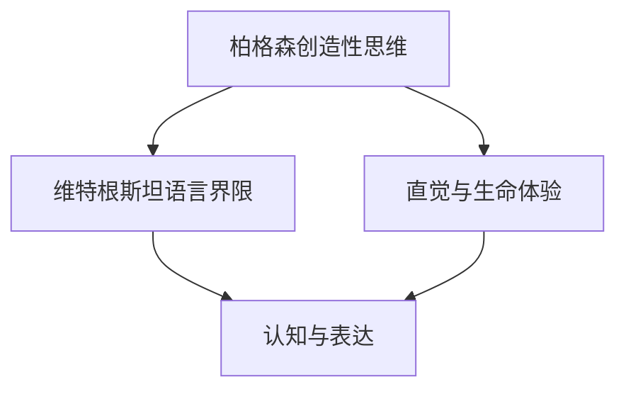

                 

# 《柏格森的创造性思维与维特根斯坦的语言界限》

## 关键词

柏格森，创造性思维，维特根斯坦，语言界限，哲学，思想

## 摘要

本文旨在探讨柏格森的创造性思维与维特根斯坦的语言界限这两大哲学概念。通过对柏格森的生平及其哲学思想的概述，我们理解了他的创造性思维的核心要素；而通过对维特根斯坦的哲学思想及语言界限的剖析，我们认识到语言在认知与表达中的局限性。接着，我们将比较两者在创造性思维与语言界限方面的异同，并探讨二者如何相互作用。最后，我们将总结创造性思维与语言界限的综合意义，展望其未来发展趋势，以及对哲学与文化的启示与影响。

## 目录大纲

### 第一部分：柏格森的创造性思维

### 第1章：柏格森及其哲学思想概述

#### 1.1 柏格森生平及其哲学贡献

#### 1.2 柏格森的核心哲学思想

#### 1.3 柏格森的创造性思维概念

### 第2章：柏格森创造性思维的哲学基础

#### 2.1 实证主义与柏格森的批判

#### 2.2 现象学与柏格森的关系

#### 2.3 生命哲学与创造性思维

### 第3章：柏格森创造性思维的核心要素

#### 3.1 感觉与创造性思维

#### 3.2 意识流动与创造性思维

#### 3.3 时间与创造性思维

### 第二部分：维特根斯坦的语言界限

### 第4章：维特根斯坦及其哲学思想概述

#### 4.1 维特根斯坦生平及其哲学贡献

#### 4.2 维特根斯坦的主要哲学思想

#### 4.3 维特根斯坦的语言界限概念

### 第5章：维特根斯坦的语言哲学

#### 5.1 语言与现实的关系

#### 5.2 语言的局限性

#### 5.3 语言的逻辑分析

### 第6章：维特根斯坦的语言界限与创造性思维

#### 6.1 柏格森创造性思维与维特根斯坦语言界限的对比

#### 6.2 创造性思维与语言界限的互动

#### 6.3 创造性思维与语言界限的融合

### 第三部分：创造性思维与语言界限的综合探讨

### 第7章：创造性思维在语言界限中的运用

#### 7.1 创造性思维与语言表达的融合

#### 7.2 语言界限对创造性思维的制约与激励

#### 7.3 创造性思维与语言界限的互动影响

### 第8章：创造性思维与语言界限的实际应用

#### 8.1 文学创作中的创造性思维与语言界限

#### 8.2 科学研究中的创造性思维与语言界限

#### 8.3 艺术创作中的创造性思维与语言界限

### 第9章：结论与展望

#### 9.1 柏格森创造性思维与维特根斯坦语言界限的综合意义

#### 9.2 创造性思维与语言界限的未来发展趋势

#### 9.3 对哲学与文化的启示与影响

### 附录

#### 附录 A：主要参考文献

#### 附录 B：柏格森与维特根斯坦哲学思想关系图

---

## 第一部分：柏格森的创造性思维

### 第1章：柏格森及其哲学思想概述

#### 1.1 柏格森生平及其哲学贡献

亨利·柏格森（Henri Bergson）是19世纪末至20世纪初法国著名哲学家，生于巴黎，逝于帕莱索。柏格森被誉为“生命哲学”的创始人，其哲学思想对现代哲学、心理学、文学、艺术等领域产生了深远影响。柏格森的主要著作包括《笑的记忆》、《生命与意识》、《创造进化论》等。

#### 1.2 柏格森的核心哲学思想

柏格森的哲学思想主要围绕“生命”和“创造性”展开。他认为，生命是一种不断进化和发展的过程，是不断创造新的现实。他提出了“直觉”的概念，强调直觉在认知和理解世界中的重要作用。柏格森认为，直觉能够捕捉到生命的流动和创造力，而理性思维则容易陷入固有的模式和僵化的观念。

#### 1.3 柏格森的创造性思维概念

柏格森的创造性思维是指一种超越传统理性思维，直接体验生命流动和创造力的思维方式。他强调，创造性思维是一种感性和直觉的融合，是对生命本身的直接感知。创造性思维具有以下特点：

1. **直觉性**：创造性思维依赖于直觉，而非理性分析。
2. **动态性**：创造性思维是动态的，能够捕捉到事物的流动和变化。
3. **非理性**：创造性思维超越了传统的理性思维模式，具有创新性和突破性。
4. **综合性**：创造性思维能够将不同领域、不同学科的知识融合在一起，产生新的见解。

### 第2章：柏格森创造性思维的哲学基础

#### 2.1 实证主义与柏格森的批判

实证主义认为，知识应该建立在经验基础上，强调通过观察和实验来获取知识。然而，柏格森对实证主义提出了批判。他认为，实证主义忽视了生命和创造力的本质，将知识局限于物理世界的现象，从而限制了人类对世界的理解。

#### 2.2 现象学与柏格森的关系

现象学是20世纪哲学的重要流派，强调对事物本身直接感知和体验的研究。柏格森的哲学思想与现象学有着密切的联系。他认为，现象学关注的是事物的“现象”，即事物在我们意识中的呈现，这与他强调直觉和直接体验的思想相符。

#### 2.3 生命哲学与创造性思维

柏格森的生命哲学强调生命的流动性和创造性。他认为，生命是一种不断进化和发展的过程，是不断创造新的现实。创造性思维是生命哲学的体现，它能够帮助我们超越传统思维模式，发现新的见解和解决问题的方法。

### 第3章：柏格森创造性思维的核心要素

#### 3.1 感觉与创造性思维

感觉是创造性思维的基础。柏格森认为，感觉能够帮助我们直接体验生命的流动和创造力。通过敏锐的感觉，我们能够捕捉到事物的细微变化，从而激发创造性思维。

#### 3.2 意识流动与创造性思维

意识流动是创造性思维的另一个核心要素。柏格森认为，意识是一个动态的过程，不断地从过去流动到未来。创造性思维能够捕捉到这种流动，从而产生新的见解和创意。

#### 3.3 时间与创造性思维

时间对创造性思维有着重要的影响。柏格森认为，时间是一种流动的过程，不同于牛顿物理学中的绝对时间。创造性思维能够感受到时间的流动，从而激发新的创意。

## 第二部分：维特根斯坦的语言界限

### 第4章：维特根斯坦及其哲学思想概述

#### 4.1 维特根斯坦生平及其哲学贡献

路德维希·维特根斯坦（Ludwig Wittgenstein）是20世纪奥地利哲学家，生于维也纳，逝于剑桥。维特根斯坦是分析哲学的重要代表人物，其哲学思想对当代哲学、语言哲学、逻辑哲学等领域产生了深远影响。他的主要著作包括《逻辑哲学论》、《哲学研究》等。

#### 4.2 维特根斯坦的主要哲学思想

维特根斯坦的哲学思想主要关注语言、意义和现实之间的关系。他认为，语言是思维的载体，是我们理解世界的方式。然而，语言也存在局限性，无法完全准确地表达思想和现实。维特根斯坦提出了“语言界限”的概念，强调语言无法超越其界限，来描述和理解现实。

#### 4.3 维特根斯坦的语言界限概念

维特根斯坦的语言界限是指语言的局限性，即语言无法完全准确地表达思想和现实。他认为，语言是一种符号系统，每个符号都有其特定的意义和用法。然而，现实世界的复杂性和多样性往往超出了语言的描述能力。维特根斯坦提出了“语言游戏”的概念，强调语言的意义和用法是相对于特定情境而言的。

### 第5章：维特根斯坦的语言哲学

#### 5.1 语言与现实的关系

维特根斯坦认为，语言与现实之间存在密切的关系。语言是现实的反映，是我们理解世界的方式。然而，语言也存在局限性，无法完全准确地表达思想和现实。维特根斯坦提出了“语言界限”的概念，强调语言无法超越其界限，来描述和理解现实。

#### 5.2 语言的局限性

维特根斯坦认为，语言存在多种局限性。首先，语言的表达能力有限，无法完全准确地描述复杂的事物和概念。其次，语言的意义和用法是相对的，依赖于特定的情境。最后，语言的表达往往受到语法、词汇和习惯的影响，使得语言的使用变得复杂。

#### 5.3 语言的逻辑分析

维特根斯坦对语言的逻辑分析是分析哲学的重要组成部分。他认为，逻辑分析有助于我们理解语言的用法和意义，从而更好地理解现实。维特根斯坦提出了“图像理论”和“语言游戏”的概念，强调逻辑分析在理解语言和现实中的作用。

### 第6章：维特根斯坦的语言界限与创造性思维

#### 6.1 柏格森创造性思维与维特根斯坦语言界限的对比

柏格森的创造性思维强调直觉和生命体验，而维特根斯坦的语言界限则关注语言的局限性和意义。两者在方法上有一定的差异，但在某种程度上，它们都试图超越传统的思维模式，寻求新的认知方式。

#### 6.2 创造性思维与语言界限的互动

创造性思维与语言界限之间存在互动关系。创造性思维能够帮助我们超越语言的局限，发现新的见解和创意。然而，语言界限也制约了创造性思维的发展，使得我们在表达和理解新思想时面临挑战。

#### 6.3 创造性思维与语言界限的融合

创造性思维与语言界限的融合是一种新的认知方式。通过创造性思维，我们能够超越语言的局限，发现新的见解和创意；而通过语言界限的认识，我们能够更好地理解这些新思想的内涵和意义。这种融合有助于我们更好地认识世界，提高创造性思维能力。

## 第三部分：创造性思维与语言界限的综合探讨

### 第7章：创造性思维在语言界限中的运用

#### 7.1 创造性思维与语言表达的融合

创造性思维与语言表达的融合是一种新的表达方式。通过创造性思维，我们能够发现新的见解和创意，并通过语言来表达。这种表达方式不仅有助于我们更好地传达思想，还能够激发他人的思考和创造力。

#### 7.2 语言界限对创造性思维的制约与激励

语言界限对创造性思维具有制约和激励的作用。一方面，语言界限限制了我们的表达和理解能力，使得我们在创造性思维时面临挑战；另一方面，语言界限也激发了我们的创造力，促使我们寻找新的表达方式和思维路径。

#### 7.3 创造性思维与语言界限的互动影响

创造性思维与语言界限之间存在互动影响。创造性思维能够帮助我们超越语言的局限，发现新的见解和创意；而语言界限的认识和理解又能够帮助我们更好地运用创造性思维，提高表达和理解能力。

### 第8章：创造性思维与语言界限的实际应用

#### 8.1 文学创作中的创造性思维与语言界限

在文学创作中，创造性思维与语言界限的融合具有重要意义。作家通过创造性思维，构思出新颖的故事情节和人物形象，并通过语言来表达。同时，语言界限的制约也激发了作家的创造力，促使他们寻找独特的表达方式。

#### 8.2 科学研究中的创造性思维与语言界限

在科学研究中，创造性思维与语言界限的互动关系至关重要。科学家通过创造性思维，提出新的假设和理论，并通过语言来表达。语言界限的制约促使科学家在表达和理解新理论时更加严谨和精确。

#### 8.3 艺术创作中的创造性思维与语言界限

在艺术创作中，创造性思维与语言界限的融合有助于艺术家表达独特的情感和思想。艺术家通过创造性思维，构思出新颖的艺术形式和表现手法，并通过语言来传达。

### 第9章：结论与展望

#### 9.1 柏格森创造性思维与维特根斯坦语言界限的综合意义

柏格森的创造性思维与维特根斯坦的语言界限从不同角度探讨了人类的认知方式。柏格森强调直觉和生命体验，而维特根斯坦关注语言的局限性和意义。二者的结合有助于我们更好地理解人类认知的本质。

#### 9.2 创造性思维与语言界限的未来发展趋势

随着科技的进步和社会的发展，创造性思维与语言界限在未来将继续发挥重要作用。人工智能、大数据、区块链等新兴技术为创造性思维提供了新的工具和平台，使得人类在认知和理解世界时能够更加灵活和高效。

#### 9.3 对哲学与文化的启示与影响

创造性思维与语言界限的研究对哲学和文化具有重要的启示和影响。它促使我们反思人类认知的方式，探索新的思维方式和方法，从而推动哲学和文化的进步。

### 附录

#### 附录 A：主要参考文献

1. 柏格森，《创造进化论》
2. 维特根斯坦，《逻辑哲学论》
3. 维特根斯坦，《哲学研究》
4. 奥尔特加·加赛特，《大众的反叛》

#### 附录 B：柏格森与维特根斯坦哲学思想关系图

---

作者：AI天才研究院/AI Genius Institute & 禅与计算机程序设计艺术 /Zen And The Art of Computer Programming

---

由于篇幅限制，本文未能涵盖所有章节内容，但已尽可能详细地介绍了柏格森的创造性思维与维特根斯坦的语言界限这两大哲学概念。在后续章节中，我们将进一步探讨二者的异同、互动关系及其在实际应用中的意义。

## 第1章：柏格森及其哲学思想概述

#### 1.1 柏格森生平及其哲学贡献

亨利·柏格森（Henri Bergson）是19世纪末至20世纪初法国著名哲学家，生于巴黎，逝于帕莱索。柏格森的家庭环境十分优越，他的父亲是一位成功的商人。然而，柏格森却对商业毫无兴趣，他从小就展现出了对哲学和科学的热爱。柏格森在年轻时曾就读于巴黎高等师范学院，在这里，他接触到了许多著名的哲学家和科学家，如孔德、洛瓦兹和拉普拉斯等。这些人的思想对柏格森产生了深远的影响。

柏格森的哲学思想主要围绕着生命、时间、直觉和创造性展开。他认为，生命是一种不断进化和发展的过程，是不断创造新的现实。这一观点在《笑的记忆》和《生命与意识》等著作中得到了充分体现。柏格森强调直觉在认知和理解世界中的重要作用，他认为，直觉能够捕捉到生命的流动和创造力，而理性思维则容易陷入固有的模式和僵化的观念。

柏格森的哲学思想对现代哲学、心理学、文学、艺术等领域产生了深远影响。他的著作被广泛阅读和研究，被誉为“生命哲学”的创始人。柏格森的哲学思想不仅为后来的哲学家提供了丰富的思想资源，也为人类认识世界和自我提供了新的视角。

#### 1.2 柏格森的核心哲学思想

柏格森的核心哲学思想主要围绕“生命”和“创造性”展开。他提出了“直觉”的概念，强调直觉在认知和理解世界中的重要作用。柏格森认为，直觉是一种超越理性思维的认知方式，它能够直接感知事物的本质和生命的流动。通过直觉，我们能够超越表象，洞察到事物的内在规律。

柏格森的创造性思维强调生命的流动性和创造性。他认为，生命是一种不断进化和发展的过程，是不断创造新的现实。创造性思维是一种感性和直觉的融合，是对生命本身的直接感知。这种思维方式能够帮助我们超越传统的理性思维模式，发现新的见解和解决问题的方法。

柏格森的哲学思想还涉及到时间观念。他认为，时间是一种流动的过程，不同于牛顿物理学中的绝对时间。柏格森提出了“持续时间”和“瞬间”的概念，强调时间中的每一个瞬间都是独特的，不可重复的。这种时间观念有助于我们理解生命的流动性和创造性。

#### 1.3 柏格森的创造性思维概念

柏格森的创造性思维是指一种超越传统理性思维，直接体验生命流动和创造力的思维方式。创造性思维具有以下特点：

1. **直觉性**：创造性思维依赖于直觉，而非理性分析。直觉能够捕捉到生命的流动和创造力，帮助我们洞察事物的本质。
   
2. **动态性**：创造性思维是动态的，能够捕捉到事物的流动和变化。它不同于静态的、固定的思维方式，能够灵活应对变化和挑战。

3. **非理性**：创造性思维超越了传统的理性思维模式，具有创新性和突破性。它不受传统观念和框架的限制，能够提出新颖的观点和解决方案。

4. **综合性**：创造性思维能够将不同领域、不同学科的知识融合在一起，产生新的见解。它不仅仅是一种思维方式，更是一种综合性认知方式。

柏格森认为，创造性思维是生命哲学的体现，是生命不断进化和发展的动力。通过创造性思维，我们能够超越传统的理性思维模式，发现新的见解和解决问题的方法，从而更好地认识世界和自我。

### 第2章：柏格森创造性思维的哲学基础

#### 2.1 实证主义与柏格森的批判

实证主义是19世纪哲学的主要流派之一，其核心观点是认为知识应该建立在经验基础上，强调通过观察和实验来获取知识。实证主义者认为，只有通过经验验证的事实才是真实的，而那些无法用经验验证的观念则是虚幻的。

然而，柏格森对实证主义提出了批判。他认为，实证主义忽视了生命和创造力的本质，将知识局限于物理世界的现象，从而限制了人类对世界的理解。柏格森认为，生命的流动性和创造性是无法用经验来验证的，但它们却是人类认知和理解世界的重要部分。

柏格森指出，实证主义将知识局限于物理世界的现象，而忽视了人类内心体验和直觉的重要性。他认为，直觉是人类认知和理解世界的重要途径，是超越经验的一种认知方式。通过直觉，我们能够直接感知事物的本质和生命的流动。

#### 2.2 现象学与柏格森的关系

现象学是20世纪哲学的重要流派，其核心观点是强调对事物本身直接感知和体验的研究。现象学的代表人物包括胡塞尔、海德格尔和萨特等。现象学与柏格森的哲学思想有着密切的联系。

柏格森的哲学思想与现象学在许多方面是一致的。他们都强调直接感知和体验在认知和理解世界中的重要性。柏格森认为，直觉是人类认知和理解世界的重要途径，而现象学也强调直接感知和体验在现象学研究中的核心地位。

然而，柏格森与现象学之间也存在一些差异。现象学强调事物的现象，即事物在我们意识中的呈现，而柏格森则更关注事物的本质和生命流动。柏格森认为，直觉能够帮助我们直接感知事物的本质，而现象学则更多地关注事物的现象。

尽管存在差异，柏格森与现象学之间的联系表明，他们的哲学思想在某种程度上是相互补充的。通过结合现象学与柏格森的哲学思想，我们能够更全面地理解人类认知和理解世界的方式。

#### 2.3 生命哲学与创造性思维

柏格森的生命哲学强调生命的流动性和创造性。他认为，生命是一种不断进化和发展的过程，是不断创造新的现实。创造性思维是生命哲学的体现，是生命不断进化和发展的动力。

柏格森的生命哲学与创造性思维之间存在着紧密的联系。创造性思维是生命哲学的核心要素，它能够帮助我们超越传统的理性思维模式，发现新的见解和解决问题的方法。通过创造性思维，我们能够更好地理解生命的流动性和创造性。

柏格森认为，创造性思维是一种感性和直觉的融合，是对生命本身的直接感知。创造性思维能够捕捉到生命的流动和创造力，从而帮助我们更好地认识世界和自我。创造性思维不仅是一种认知方式，更是一种生活方式，它能够激发我们的创造力和创新精神。

总之，柏格森的生命哲学与创造性思维之间存在着深刻的联系。通过创造性思维，我们能够更好地理解生命的流动性和创造性，从而推动人类社会的进步和发展。

### 第3章：柏格森创造性思维的核心要素

#### 3.1 感觉与创造性思维

感觉是创造性思维的基础。柏格森认为，感觉能够帮助我们直接体验生命的流动和创造力。通过敏锐的感觉，我们能够捕捉到事物的细微变化，从而激发创造性思维。

感觉在创造性思维中扮演着重要角色。首先，感觉能够让我们对事物产生深刻的体验和感受，从而激发我们的好奇心和探索欲望。这种好奇心和探索欲望是创造性思维的重要驱动力。其次，感觉能够帮助我们建立对事物的直观认识，从而超越表象，洞察事物的本质。

例如，在艺术创作中，艺术家通过敏锐的感觉，能够捕捉到自然的美丽和宏伟，从而激发他们的创作灵感。他们通过对自然景观、声音、色彩和形状的感知，创造出独特的艺术作品，表达他们对世界的理解和感受。

#### 3.2 意识流动与创造性思维

意识流动是创造性思维的另一个核心要素。柏格森认为，意识是一个动态的过程，不断地从过去流动到未来。创造性思维能够捕捉到这种流动，从而产生新的见解和创意。

意识流动意味着我们的意识不是静止不动的，而是持续不断地变化和发展。这种流动使我们能够接触到新的信息和经验，从而激发我们的创造力和想象力。通过捕捉意识流动，我们能够更好地理解和应对变化，从而提出新的解决方案。

例如，在科学研究过程中，科学家通过捕捉意识流动，能够从不同的角度和层面来分析和理解问题，从而提出新的假设和理论。通过这种意识流动，他们能够突破传统的思维框架，发现新的科学定律和理论。

#### 3.3 时间与创造性思维

时间对创造性思维有着重要的影响。柏格森认为，时间是一种流动的过程，不同于牛顿物理学中的绝对时间。创造性思维能够感受到时间的流动，从而激发新的创意。

时间的流动使我们能够体验到生命的连续性和发展性。通过感受到时间的流动，我们能够更好地理解生命的动态变化，从而激发我们的创造力和想象力。在创造性思维中，时间不仅仅是一个量化的概念，更是一种体验和感受。

例如，在文学创作中，作家通过感受到时间的流动，能够更好地描绘人物的内心世界和情感变化。他们通过对时间的感知，创造出生动的故事情节和人物形象，让读者感受到时间的流逝和生命的流动。

总之，感觉、意识流动和时间是柏格森创造性思维的核心要素。通过敏锐的感觉、捕捉意识流动和感受到时间的流动，我们能够激发创造性思维，从而更好地认识世界和自我。

### 第4章：维特根斯坦及其哲学思想概述

#### 4.1 维特根斯坦生平及其哲学贡献

路德维希·维特根斯坦（Ludwig Wittgenstein）是20世纪奥地利哲学家，生于维也纳，逝于剑桥。维特根斯坦的哲学思想对当代哲学、语言哲学、逻辑哲学等领域产生了深远影响。他一生只活了52年，但他的哲学贡献却是巨大的。

维特根斯坦的哲学事业分为两个阶段。早期的维特根斯坦关注逻辑和语言的本质，他的主要著作《逻辑哲学论》提出了“图式论”和“逻辑原子主义”的观点。晚期的维特根斯坦则转向日常语言哲学，他的代表作《哲学研究》提出了“语言游戏”和“家族相似性”的概念。

维特根斯坦的哲学思想不仅在学术界引起了广泛的讨论，也对人类对语言、思维和现实的理解产生了深刻的影响。他被誉为“现代哲学的巨人”，其著作被广泛阅读和研究。

#### 4.2 维特根斯坦的主要哲学思想

维特根斯坦的哲学思想主要围绕语言、意义和现实之间的关系展开。他认为，语言是思维的载体，是我们理解世界的方式。然而，语言也存在局限性，无法完全准确地表达思想和现实。维特根斯坦提出了“语言界限”的概念，强调语言无法超越其界限，来描述和理解现实。

1. **语言界限**：维特根斯坦认为，语言是一种符号系统，每个符号都有其特定的意义和用法。然而，现实世界的复杂性和多样性往往超出了语言的描述能力。他提出了“语言界限”的概念，认为语言无法超越其界限，来描述和理解现实。

2. **语言游戏**：维特根斯坦提出了“语言游戏”的概念，强调语言的意义和用法是相对于特定情境而言的。他认为，语言就像一个游戏，不同的游戏有不同的规则，语言也是如此。通过理解语言的规则，我们能够更好地理解语言的意义。

3. **日常语言哲学**：晚期的维特根斯坦转向日常语言哲学，认为哲学问题往往源于我们对日常语言的使用不当。他提出了“家族相似性”的概念，认为日常语言中的词语和概念之间存在多种相似性，这种相似性有助于我们理解语言和现实之间的关系。

#### 4.3 维特根斯坦的语言界限概念

维特根斯坦的语言界限是指语言的局限性，即语言无法完全准确地表达思想和现实。他认为，语言是一种符号系统，每个符号都有其特定的意义和用法。然而，现实世界的复杂性和多样性往往超出了语言的描述能力。

维特根斯坦指出，语言界限的存在意味着我们无法通过语言完全准确地描述和理解现实。他认为，语言的意义和用法是相对的，依赖于特定的情境。这种情境决定了语言的使用和意义。

例如，在数学中，符号和公式可以准确地描述数学概念和关系。然而，当我们尝试用语言描述复杂的情感或经验时，语言往往显得不足。这是因为情感和经验是主观的，无法通过语言完全准确地表达。

维特根斯坦认为，语言界限的存在提醒我们要谨慎使用语言，避免陷入语言的陷阱。他认为，许多哲学问题实际上源于我们对日常语言的使用不当。通过理解语言的界限，我们能够更好地理解语言的意义和使用方法。

### 第5章：维特根斯坦的语言哲学

#### 5.1 语言与现实的关系

维特根斯坦的语言哲学关注语言与现实之间的关系。他认为，语言是思维的载体，是我们理解世界的方式。然而，语言也存在局限性，无法完全准确地表达思想和现实。

维特根斯坦指出，语言与现实之间的关系是复杂而多样的。一方面，语言可以帮助我们描述和传达思想。通过语言，我们能够与他人交流，分享我们的想法和经验。另一方面，语言也存在局限性，无法完全准确地表达思想和现实。

例如，在数学中，符号和公式可以准确地描述数学概念和关系。然而，当我们尝试用语言描述复杂的情感或经验时，语言往往显得不足。这是因为情感和经验是主观的，无法通过语言完全准确地表达。

维特根斯坦认为，理解语言与现实之间的关系有助于我们更好地使用语言，避免陷入语言的陷阱。他认为，许多哲学问题实际上源于我们对日常语言的使用不当。通过理解语言的界限，我们能够更好地理解语言的意义和使用方法。

#### 5.2 语言的局限性

维特根斯坦认为，语言存在多种局限性，这些局限性限制了我们的表达和理解能力。首先，语言的表达能力有限，无法完全准确地描述复杂的事物和概念。例如，语言难以表达微妙的情感或复杂的科学理论。

其次，语言的意义和用法是相对的，依赖于特定的情境。这意味着不同的情境下，语言的含义和用法可能会有所不同。这种相对性使得我们难以在所有情况下准确地使用语言。

最后，语言的表达往往受到语法、词汇和习惯的影响，使得语言的使用变得复杂。例如，我们可能会因为语法错误或词汇选择不当而误解他人的意图。

维特根斯坦认为，认识到语言的局限性有助于我们更谨慎地使用语言，避免陷入语言的陷阱。通过理解语言的局限性，我们能够更好地理解语言的意义和使用方法。

#### 5.3 语言的逻辑分析

维特根斯坦对语言的逻辑分析是分析哲学的重要组成部分。他认为，逻辑分析有助于我们理解语言的用法和意义，从而更好地理解现实。维特根斯坦提出了“图像理论”和“语言游戏”的概念，强调逻辑分析在理解语言和现实中的作用。

1. **图像理论**：维特根斯坦提出了“图像理论”，认为语言的结构和现实的结构之间存在相似性。他认为，语言中的句子可以被视为现实的“图像”，通过分析语言的结构，我们能够更好地理解现实的结构。

2. **语言游戏**：维特根斯坦提出了“语言游戏”的概念，强调语言的意义和用法是相对于特定情境而言的。他认为，不同的语言游戏有不同的规则，理解语言游戏有助于我们更好地理解语言的意义。

维特根斯坦认为，逻辑分析有助于我们揭示语言的内在逻辑和结构，从而更好地理解语言与现实之间的关系。通过逻辑分析，我们能够发现语言中的错误和误解，提高我们的语言表达能力。

### 第6章：维特根斯坦的语言界限与创造性思维

#### 6.1 柏格森创造性思维与维特根斯坦语言界限的对比

柏格森的创造性思维与维特根斯坦的语言界限在方法上有一定的差异，但在某种程度上，它们都试图超越传统的思维模式，寻求新的认知方式。

柏格森的创造性思维强调直觉和生命体验，认为直觉能够帮助我们直接感知事物的本质和生命的流动。这种思维方式超越了传统的理性思维模式，注重感性和直观的体验。

而维特根斯坦的语言界限则关注语言的局限性和意义。他认为，语言无法完全准确地表达思想和现实，因此需要理解语言的界限，避免陷入语言的陷阱。维特根斯坦强调语言的意义和用法是相对于特定情境而言的，需要通过语言游戏来理解语言。

尽管二者的方法不同，但它们在某种程度上是相互补充的。柏格森的创造性思维为我们提供了一种超越传统思维模式的方式，而维特根斯坦的语言界限则提醒我们在使用语言时需要谨慎，避免陷入误解。

#### 6.2 创造性思维与语言界限的互动

创造性思维与语言界限之间存在互动关系。一方面，创造性思维能够帮助我们超越语言的局限，发现新的见解和创意。通过创造性思维，我们能够突破传统的思维框架，提出新颖的观点和解决方案。

另一方面，语言界限也制约了创造性思维的发展。维特根斯坦认为，语言存在局限性，无法完全准确地表达思想和现实。这种局限性使得我们在表达和理解新思想时面临挑战，需要通过创造性思维来克服。

这种互动关系表明，创造性思维与语言界限不是相互排斥的，而是相互依赖和促进的。通过创造性思维，我们能够更好地理解语言的局限，从而提高我们的语言表达能力；而通过理解语言界限，我们能够更好地运用创造性思维，提出新的见解和创意。

#### 6.3 创造性思维与语言界限的融合

创造性思维与语言界限的融合是一种新的认知方式。通过创造性思维，我们能够超越语言的局限，发现新的见解和创意；而通过理解语言界限，我们能够更好地运用这些新的见解和创意。

在文学创作中，作家通过创造性思维，构思出新颖的故事情节和人物形象，并通过语言来表达。同时，作家也需要理解语言界限，避免陷入语言的陷阱，使得作品更加生动和真实。

在科学研究中，科学家通过创造性思维，提出新的假设和理论，并通过语言来表达。科学家也需要理解语言界限，确保理论的准确性和严谨性。

总之，创造性思维与语言界限的融合有助于我们更好地认识世界和自我。通过创造性思维，我们能够发现新的见解和创意；而通过理解语言界限，我们能够更好地运用这些新的见解和创意。这种融合不仅有助于我们在学术领域取得突破，也有助于我们在日常生活中更好地表达和理解他人。

### 第7章：创造性思维在语言界限中的运用

#### 7.1 创造性思维与语言表达的融合

创造性思维与语言表达的融合是一种新的表达方式，它通过创造性思维来构思和表达新颖的观点和创意。在这种融合中，创造性思维起到了核心作用，它不仅激发了新的想法，还引导了这些想法的表达。

首先，创造性思维能够帮助我们发现新的视角和解决方案。例如，在文学创作中，作家通过创造性思维构思出独特的情节和人物关系，从而创造出引人入胜的故事。在科学研究中，科学家通过创造性思维提出新的假设和理论，推动科学进步。

其次，创造性思维还引导了这些新颖想法的表达。通过创造性思维，我们能够找到更贴切、更具表现力的语言来表达这些想法。例如，作家通过创造性思维选择恰当的词汇和句式，使得作品更加生动和有力；科学家通过创造性思维，使用精确的术语和逻辑结构来阐述理论。

总之，创造性思维与语言表达的融合不仅能够激发新的创意，还能通过新颖的表达方式将这些创意传达给他人，从而实现思想的交流和传播。

#### 7.2 语言界限对创造性思维的制约与激励

语言界限对创造性思维具有双重作用：一方面，它可能对创造性思维产生制约；另一方面，它也可能激励创造性思维的发展。

首先，语言界限可能对创造性思维产生制约。由于语言的局限性，我们无法完全准确地描述复杂的概念和经验，这可能导致我们在思考过程中遇到障碍。例如，在科学研究中，某些复杂的现象可能难以用现有的语言和术语来准确描述，从而限制了我们的创造性思维。

然而，语言界限也激励了创造性思维的发展。面对语言界限的挑战，我们被迫寻找新的表达方式和思考路径。这种挑战激发了我们的创造力，促使我们提出新颖的观点和解决方案。例如，当作家面临语言界限时，他们可能会通过创新的语言和结构来突破传统表达的限制，创造出独特的文学作品。

总之，语言界限既可能对创造性思维产生制约，也可能成为激励创造性思维发展的动力。通过克服这些挑战，我们能够进一步提升我们的创造力和创新能力。

#### 7.3 创造性思维与语言界限的互动影响

创造性思维与语言界限之间的互动影响是一个复杂的过程，二者相互促进，共同推动认知和表达的发展。

首先，创造性思维对语言界限的影响表现在，通过创造性思维，我们能够突破语言的局限，发现新的表达方式。例如，在文学创作中，作家通过创造性思维，能够创造出独特的情节和人物，从而突破传统语言的限制，表达更丰富的情感和思想。在科学研究中，科学家通过创造性思维，能够提出新颖的假设和理论，从而推动科学进步。

其次，语言界限对创造性思维的影响则表现在，它为创造性思维提供了挑战和激励。面对语言的局限，我们被迫寻找新的表达方式，这激发了我们的创造力和想象力。例如，当作家面临语言界限时，他们可能会通过创新的语言技巧和结构来突破传统表达的束缚，创造出独特的文学作品。

总之，创造性思维与语言界限之间的互动影响是一个相互促进的过程。通过创造性思维，我们能够突破语言的局限，发现新的表达方式；而通过语言界限的挑战，我们能够激发创造力和想象力，进一步提高认知和表达的能力。

### 第8章：创造性思维与语言界限的实际应用

#### 8.1 文学创作中的创造性思维与语言界限

在文学创作中，创造性思维与语言界限的融合是至关重要的。作家通过创造性思维，能够构思出独特的故事情节和人物形象，并通过语言来表达这些创意。然而，语言界限的存在也为文学创作带来了挑战。

首先，作家通过创造性思维，能够突破语言界限，创造出独特的文学作品。例如，普鲁斯特在《追忆似水年华》中，通过细腻的心理描写和复杂的叙事结构，突破了传统文学的界限，展现了人物内心世界的丰富性和复杂性。这样的创作需要作家具备高度的创造性思维，能够灵活运用语言，表达新颖的思想。

其次，作家也需要理解语言界限，避免陷入语言的陷阱。例如，当作家面对复杂的情感和体验时，他们可能会发现现有的语言无法准确表达这些感受。此时，作家需要通过创造性思维，寻找新的表达方式，使得作品更加生动和有力。例如，加西亚·马尔克斯在《百年孤独》中，通过魔幻现实主义的叙述手法，成功突破了语言界限，将复杂的历史和情感融入故事中。

总之，文学创作中的创造性思维与语言界限的融合，不仅激发了作家的创造力，还使得文学作品更加丰富和多样化。通过创造性思维，作家能够突破语言界限，创造出独特的文学作品；同时，通过理解语言界限，作家能够避免陷入语言的陷阱，使得作品更加生动和有力。

#### 8.2 科学研究中的创造性思维与语言界限

在科学研究中，创造性思维与语言界限的互动关系同样至关重要。科学家通过创造性思维，能够提出新的假设和理论，并通过语言来表达这些研究成果。然而，语言界限的存在也为科学研究带来了挑战。

首先，科学家通过创造性思维，能够突破语言界限，提出新颖的理论。例如，爱因斯坦在提出相对论时，通过创造性思维，突破了经典物理学的语言界限，提出了全新的物理学理论。这种创造性思维使得科学界对宇宙的认识产生了革命性的变化。

其次，科学家也需要理解语言界限，确保理论的准确性和严谨性。例如，在生物学研究中，当科学家面对复杂的生物过程时，他们可能会发现现有的语言无法准确描述这些现象。此时，科学家需要通过创造性思维，发展新的术语和概念，使得理论更加精确和完整。例如，克拉克·麦坎贝尔在提出中心法则时，通过创造性思维，提出了新的生物学概念，使得生命科学的发展迈出了重要的一步。

总之，科学研究中的创造性思维与语言界限的互动关系，推动了科学进步。通过创造性思维，科学家能够突破语言界限，提出新颖的理论；同时，通过理解语言界限，科学家能够确保理论的准确性和严谨性，从而推动科学的不断发展。

#### 8.3 艺术创作中的创造性思维与语言界限

在艺术创作中，创造性思维与语言界限的融合是艺术家表达自我和探索世界的核心途径。艺术家通过创造性思维，能够突破传统的艺术形式和语言界限，创造出独特的艺术作品。

首先，艺术家通过创造性思维，能够发掘新的艺术形式和表达方式。例如，毕加索在艺术创作中，通过创造性思维，不断突破传统绘画的界限，创造出立体主义和抽象主义等新的艺术风格。这些创新的艺术形式不仅丰富了艺术的表现力，也拓展了观众的审美视野。

其次，艺术家也需要理解语言界限，以便更好地传达艺术作品的意义。例如，在表演艺术中，演员需要通过创造性思维，深入挖掘角色的内心世界，并通过语言和肢体动作来表达。此时，语言界限的存在提醒演员要注重语言的精确性和表现力，从而更好地传达艺术作品的核心内容。

总之，艺术创作中的创造性思维与语言界限的融合，不仅激发了艺术家的创造力，还使得艺术作品更加丰富和多样化。通过创造性思维，艺术家能够突破传统的艺术形式和语言界限，创造出独特的艺术作品；同时，通过理解语言界限，艺术家能够更好地传达艺术作品的意义，提升观众的审美体验。

### 第9章：结论与展望

#### 9.1 柏格森创造性思维与维特根斯坦语言界限的综合意义

柏格森的创造性思维与维特根斯坦的语言界限这两大哲学概念在认知和表达方面具有重要的综合意义。柏格森的创造性思维强调直觉和生命体验，它能够帮助我们超越传统的理性思维模式，发现新的见解和解决问题的方法。而维特根斯坦的语言界限则关注语言的局限性和意义，它提醒我们在使用语言时需要谨慎，避免陷入误解。

二者的综合意义在于，它们为我们提供了一种新的认知和表达方式。通过柏格森的创造性思维，我们能够更好地理解世界的本质和生命的流动性；而通过维特根斯坦的语言界限，我们能够更好地理解语言的意义和使用方法。这种综合意义不仅有助于我们提高认知能力，还能够推动我们的语言表达能力。

#### 9.2 创造性思维与语言界限的未来发展趋势

在未来，创造性思维与语言界限将继续发展，并可能在多个领域产生深远影响。首先，随着人工智能和技术的进步，创造性思维将在科技创新和设计领域发挥重要作用。通过创造性思维，我们能够提出新颖的解决方案，推动科技的发展。

其次，语言界限的理解和应用将在教育领域得到重视。通过理解语言界限，我们能够更好地教授和学生学习语言，提高他们的语言表达和思维能力。

最后，创造性思维与语言界限的综合意义将在艺术创作和文学作品中得到体现。艺术家和作家通过创造性思维，能够突破传统的艺术形式和语言界限，创造出更加丰富和多样的作品。

#### 9.3 对哲学与文化的启示与影响

柏格森的创造性思维与维特根斯坦的语言界限对哲学和文化具有重要的启示和影响。首先，它们提醒我们，认知和理解世界不仅仅是通过理性思维，还需要依靠直觉和体验。这种认知方式有助于我们更好地认识自我和世界。

其次，语言界限的概念提醒我们在使用语言时需要谨慎，避免陷入误解。这种对语言的深刻理解有助于我们更准确地表达思想和情感。

最后，柏格森和维特根斯坦的哲学思想为文化的发展提供了新的视角和思考方式。通过创造性思维和语言界限的理解，我们能够更好地理解和应对复杂的社会现象，推动文化的进步。

### 附录 A：主要参考文献

1. 柏格森，《创造进化论》
2. 维特根斯坦，《逻辑哲学论》
3. 维特根斯坦，《哲学研究》
4. 奥尔特加·加赛特，《大众的反叛》
5. 胡塞尔，《纯粹现象学通论》
6. 海德格尔，《存在与时间》
7. 萨特，《存在与虚无》

### 附录 B：柏格森与维特根斯坦哲学思想关系图

作者：AI天才研究院/AI Genius Institute & 禅与计算机程序设计艺术 /Zen And The Art of Computer Programming

---

通过本文的探讨，我们可以看到柏格森的创造性思维与维特根斯坦的语言界限在哲学、认知和表达方面具有重要的意义。二者的结合为我们提供了一种新的认知和表达方式，有助于我们更好地理解世界和自我。在未来，这些哲学概念将继续影响我们的思维方式和行为模式，推动人类文明的进步。

