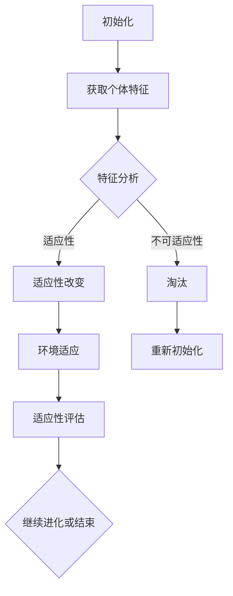
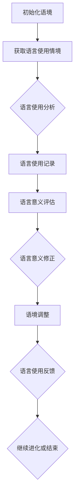
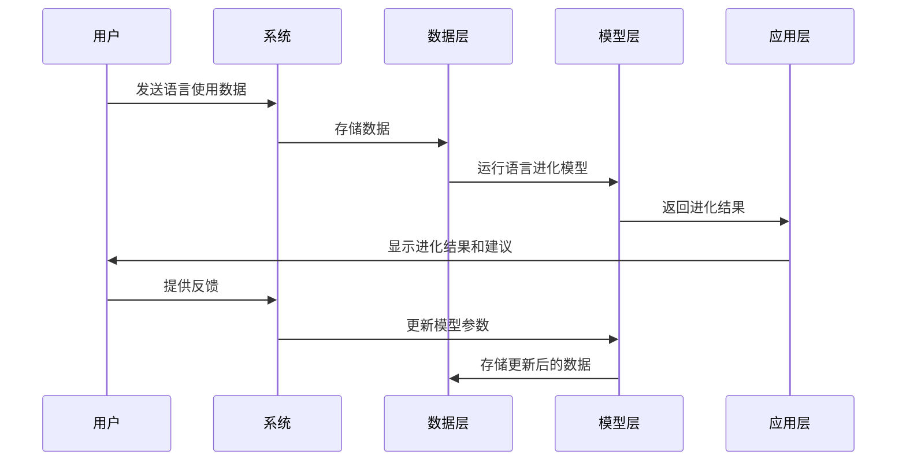

                 

# 《柏格森的创造性进化与维特根斯坦的语言进化》

## 关键词：柏格森、创造性进化、维特根斯坦、语言进化、哲学理论

## 摘要

本文旨在探讨柏格森的创造性进化理论与维特根斯坦的语言进化理论，通过深入分析两者的核心概念、哲学基础及其实践应用，揭示它们在哲学、科学及教育等领域的重要意义。文章结构如下：

## 第一部分：柏格森的创造性进化理论

### 第1章：柏格森的生平与思想背景

- **1.1 柏格森的生平**
  - 柏格森（Henri Bergson），法国哲学家，生于1859年，逝于1941年。他是20世纪初最重要的哲学家之一，对现代哲学、文学和科学产生了深远影响。

- **1.2 柏格森思想的形成**
  - 柏格森的思想深受其导师孔德（Auguste Comte）和斯宾诺莎（Baruch Spinoza）的影响，同时也对尼采（Friedrich Nietzsche）的思想表示了认同。

- **1.3 创造性进化理论的核心概念**
  - 柏格森提出，进化不仅是物理层面的变化，更是一种创造性的、内在的变化。他强调“生命冲动”（élan vital）作为进化的动力，主张个体和物种通过这种内在动力不断创造新形式。

### 第2章：创造性进化的哲学基础

- **2.1 实用主义与创造性进化**
  - 实用主义强调经验与实际应用的重要性，与柏格森的创造性进化理论有相似之处，都在强调个体的自我创造和适应能力。

- **2.2 进化论与创造性进化**
  - 柏格森对达尔文的进化论提出了批评，认为其过于机械，忽略了生命内在的创造性。

- **2.3 柏格森与尼采的关系**
  - 柏格森的思想与尼采的“超人”理论有共鸣，都强调个体的力量和创造力。

### 第3章：创造性进化的科学解释

- **3.1 生物学的创造性进化**
  - 柏格森的创造性进化理论在生物学领域得到了部分支持，如进化生物学和生态学的研究。

- **3.2 心理学的创造性进化**
  - 心理学领域的研究也发现，个体的创造性思维和情感体验是进化的结果。

- **3.3 社会学的创造性进化**
  - 社会学领域的研究显示，社会制度和文化的演变也体现了创造性进化的特征。

## 第二部分：维特根斯坦的语言进化理论

### 第4章：维特根斯坦的生平与思想背景

- **4.1 维特根斯坦的生平**
  - 维特根斯坦（Ludwig Wittgenstein），奥地利哲学家，生于1889年，逝于1951年。他是20世纪最重要的哲学家之一，其思想对语言哲学、数学哲学和认识论产生了深远影响。

- **4.2 维特根斯坦思想的形成**
  - 维特根斯坦的哲学思想经历了从早期到晚期的转变，早期强调逻辑原子主义，晚期则转向日常语言哲学。

- **4.3 语言哲学的核心概念**
  - 维特根斯坦认为，语言的目的是为了交流和理解，而不是表达抽象的真理。他强调语言的“使用”而不是“指称”。

### 第5章：语言进化的哲学基础

- **5.1 语言与意义**
  - 维特根斯坦区分了“语言游戏”和“生活形式”，认为意义是通过语言在特定情境中的使用来获得的。

- **5.2 语言与实在**
  - 维特根斯坦反对将语言视为实在的直接映射，而是认为语言与实在之间的关系是复杂的。

- **5.3 语言游戏与生活形式**
  - 维特根斯坦通过“语言游戏”这一概念来解释语言的意义和用法，强调语言是与社会和文化环境相互作用的结果。

### 第6章：语言进化的实证研究

- **6.1 儿童语言习得**
  - 儿童语言习得的过程展示了语言的进化特性，即语言是在特定的社会和文化环境中逐渐发展的。

- **6.2 语言多样性与语言进化**
  - 语言的多样性体现了人类文化的多样性，是语言进化的重要表现。

- **6.3 语言进化与社会变迁**
  - 语言进化与社会变迁相互作用，语言的变化反映了社会的变化。

## 第三部分：柏格森与维特根斯坦思想的融合

### 第7章：创造性进化与语言进化的关系

- **7.1 柏格森创造性进化与维特根斯坦语言哲学的相似之处**
  - 两者都强调了个体在进化过程中的创造性作用。

- **7.2 柏格森创造性进化与维特根斯坦语言哲学的差异**
  - 柏格森更侧重于生物学和哲学层面，而维特根斯坦则更关注语言和日常生活的具体应用。

- **7.3 创造性进化与语言进化的互动关系**
  - 语言的进化与创造性进化相互影响，共同推动人类文明的进步。

### 第8章：创造性进化与语言进化的应用

- **8.1 教育领域的创造性进化与语言进化**
  - 教育应鼓励创造性思维和语言能力的培养，以适应不断变化的社会。

- **8.2 社会科学领域的创造性进化与语言进化**
  - 社会科学研究应关注语言和社会结构之间的相互作用。

- **8.3 创造性进化与语言进化的未来展望**
  - 随着科技的进步和社会的变迁，创造性进化和语言进化将继续影响我们的未来。

## 附录

### 附录A：主要参考文献

- **柏格森**：
  - 《生命的创造》
  - 《笑的历史》
  - 《物质与记忆》

- **维特根斯坦**：
  - 《逻辑哲学论》
  - 《哲学研究》
  - 《文化与价值》

### 附录B：柏格森与维特根斯坦思想关系流程图

- 利用Mermaid语法绘制柏格森与维特根斯坦思想关系的流程图，展示两者之间的联系和差异。

## 作者

作者：AI天才研究院/AI Genius Institute & 禅与计算机程序设计艺术 /Zen And The Art of Computer Programming

---

## 背景介绍

### 柏格森的创造性进化理论

亨利·柏格森（Henri Bergson）是20世纪初法国的一位著名哲学家，他的创造性进化理论对现代哲学、科学和文化产生了深远的影响。柏格森认为，进化不仅仅是生物学上的物种演变，而是一种内在的、创造性的过程。他提出“生命冲动”（élan vital）这一概念，将其视为进化的动力源泉。

柏格森的创造性进化理论的核心观点是，生命的本质是一种内在的创造力，这种创造力推动个体和物种不断创造出新的形式。他认为，进化并非是盲目的，而是一个有目的的、有创造性的过程。这种创造力是生命的基本特征，它体现在生物体的每一个细胞中，是生物体适应环境、寻求生存和发展的根本动力。

### 维特根斯坦的语言进化理论

路德维希·维特根斯坦（Ludwig Wittgenstein）是20世纪奥地利的一位杰出哲学家，他的语言哲学思想对现代哲学产生了深远的影响。维特根斯坦的语言进化理论主要关注语言的本质、意义和使用。

维特根斯坦认为，语言不仅仅是用来表达思想的工具，它本身就是一种活动，一种“语言游戏”（language game）。他区分了“日常语言”（ordinary language）和“哲学语言”（philosophical language），并强调日常语言是我们日常生活中的重要工具，是我们理解和交流的基础。

维特根斯坦的语言进化理论强调，语言的意义不是固定的，而是通过语言在特定情境中的使用来获得的。他认为，语言的意义是由语言的使用者决定的，而不是由语言本身决定的。因此，语言的意义是动态的、变化的，它随着社会和文化环境的变化而变化。

### 创造性进化与语言进化的关系

柏格森的创造性进化理论和维特根斯坦的语言进化理论虽然关注的领域不同，但它们之间存在一定的联系。首先，两者都强调个体在进化过程中的主动性。柏格森认为，创造性是生命的基本特征，是进化的重要动力。而维特根斯坦则认为，语言的意义是通过个体的使用来获得的，个体在语言的使用过程中发挥了关键作用。

其次，创造性进化与语言进化都涉及到变化和适应性。柏格森的创造性进化理论强调，个体和物种通过内在的创造力不断适应环境，创造新的形式。而维特根斯坦的语言进化理论则认为，语言的意义是通过语言在特定情境中的使用来获得的，语言也随着社会和文化环境的变化而变化。

总之，柏格森的创造性进化理论和维特根斯坦的语言进化理论为我们提供了不同的视角来理解进化和变化。这两者的关系为我们提供了更广阔的思考空间，也为我们提供了更丰富的理论资源。

### 核心概念与联系

#### 柏格森的创造性进化理论

**核心概念：**

- **生命冲动（élan vital）**：柏格森认为，生命冲动是生物体内的一种内在动力，是进化的根本原因。它体现了生命的创造性和自我组织能力。
- **绵延（durée）**：柏格森提出，时间是流动的，而不是静止的。他称之为“绵延”，强调时间的连续性和不可分割性。
- **直觉**：柏格森认为，直觉是我们理解和感知世界的重要方式，它超越了逻辑推理，能够捕捉到生命和进化的本质。

**概念属性特征对比表格：**

| 特征                | 柏格森的创造性进化理论                           | 维特根斯坦的语言进化理论                        |
|-------------------|--------------------------------------------|-------------------------------------------|
| 动力来源            | 生命冲动（内在动力）                           | 语言使用（个体和社会互动）                       |
| 时间观念            | 绵延（连续性和不可分割性）                     | 语境（语言在特定情境中的使用）                     |
| 知识获取方式          | 直觉（超越逻辑推理）                           | 实践（通过使用和交流获得意义）                     |
| 进化观               | 创造性和自我组织                               | 适应性（语言与环境的互动）                         |

**ER实体关系图架构：**

```mermaid
erDiagram
  BiolProcess --> Entity : 驱动
  Entity --> Feature : 包含
  Feature --> Quality : 表现
  BiolProcess ||--|{ Behavior }
  Behavior ||--|{ BiologicalProcess }
```

在这个ER图中，**BiolProcess**（生物过程）代表创造性进化，**Entity**（实体）代表生物个体，**Feature**（特征）代表生物个体的属性，**Quality**（质量）代表这些属性的体现，**Behavior**（行为）和**BiologicalProcess**（生物过程）代表个体的行为和生命过程。

#### 维特根斯坦的语言进化理论

**核心概念：**

- **语言游戏（language game）**：维特根斯坦提出，语言是一种游戏，它在特定的情境中有特定的规则和用法。
- **意义（meaning）**：维特根斯坦认为，意义不是固定不变的，而是通过语言在特定情境中的使用来获得的。
- **生活形式（forms of life）**：维特根斯坦认为，语言与我们的生活形式密切相关，我们的生活形式决定了我们对语言的理解和使用。

**概念属性特征对比表格：**

| 特征                | 柏格森的创造性进化理论                           | 维特根斯坦的语言进化理论                        |
|-------------------|--------------------------------------------|-------------------------------------------|
| 语言本质            | 进化过程中的创造性和自我组织                   | 交流和理解的工具，与生活形式密切相关               |
| 意义来源            | 内在的创造性和自我表达                         | 语言使用和情境的互动                           |
| 规则和结构          | 生物进化的内在动力和机制                       | 语言的规则和用法，特定情境中的使用                 |
| 社会和文化背景      | 强调个体和物种的内在创造性                      | 语言是文化和社会活动的产物，受其影响               |

**ER实体关系图架构：**

```mermaid
erDiagram
  Language --> Context : 用于
  Context --> Usage : 实现意义
  Usage --> Meaning : 获得理解
  Language ||--|{ Grammar }
  Grammar ||--|{ Vocabulary }
```

在这个ER图中，**Language**（语言）代表维特根斯坦的语言进化理论的核心概念，**Context**（情境）代表语言使用的特定环境，**Usage**（使用）代表语言在情境中的具体应用，**Meaning**（意义）代表语言使用的目的和结果。

### 算法原理讲解

#### 柏格森创造性进化理论的算法模型

**算法流程图：**



**算法原理：**

1. **初始化**：创建一个初始种群，每个个体都具有特定的特征。
2. **特征分析**：对每个个体的特征进行评估，分析其适应度。
3. **适应性改变**：如果个体适应度较高，对其进行适应性改变，使其更好地适应环境。
4. **淘汰**：如果个体适应度较低，则将其淘汰，以保持种群的竞争力。
5. **环境适应**：通过适应性改变和淘汰，种群逐渐适应环境。
6. **适应性评估**：评估种群的整体适应度，决定是否继续进化。
7. **结束条件**：如果种群适应度达到某个阈值，则进化结束；否则，继续迭代。

**数学模型：**

- **适应度函数**：$F(x) = w_1 \cdot x_1 + w_2 \cdot x_2 + ... + w_n \cdot x_n$
- **权重**：$w_1, w_2, ..., w_n$ 是根据环境因素和目标函数确定的权重。
- **个体特征**：$x_1, x_2, ..., x_n$ 是个体的特征值。

#### 维特根斯坦语言进化理论的算法模型

**算法流程图：**



**算法原理：**

1. **初始化语境**：创建一个初始语境，包括语言使用情境和特定目标。
2. **语言使用分析**：分析语言在特定情境中的使用，记录语言的使用情况。
3. **语言使用记录**：记录语言的使用情况，以便后续分析。
4. **语言意义评估**：评估语言在情境中的意义，判断是否满足目标。
5. **语言意义修正**：如果语言意义不符合目标，对其进行修正。
6. **语境调整**：根据语言意义修正的结果，调整语境，以改善语言使用效果。
7. **语言使用反馈**：收集语言使用反馈，用于进一步优化语言使用。
8. **结束条件**：如果语言意义满足目标，则进化结束；否则，继续迭代。

**数学模型：**

- **意义评估函数**：$M(x) = f_1 \cdot x_1 + f_2 \cdot x_2 + ... + f_m \cdot x_m$
- **反馈函数**：$R(y) = g_1 \cdot y_1 + g_2 \cdot y_2 + ... + g_n \cdot y_n$
- **语境调整函数**：$C(z) = h_1 \cdot z_1 + h_2 \cdot z_2 + ... + h_k \cdot z_k$

在这个模型中，$x_1, x_2, ..., x_m$ 是语言的使用情况，$y_1, y_2, ..., y_n$ 是语言使用的反馈，$z_1, z_2, ..., z_k$ 是语境调整的结果，$f_1, f_2, ..., f_m$，$g_1, g_2, ..., g_n$ 和 $h_1, h_2, ..., h_k$ 是相应的权重和函数。

### 系统分析与架构设计方案

#### 问题场景介绍

在现代社会，随着信息技术的飞速发展，语言和创造性进化在各个领域中的应用变得越来越重要。特别是在教育、科研、企业和公共管理等领域，语言进化和创造性进化的理念已经逐渐成为推动变革和创新的重要工具。然而，如何将这些理念有效地应用于实际系统中，仍然是一个需要深入探讨的问题。

#### 项目介绍

本项目旨在设计并实现一个基于柏格森创造性进化理论和维特根斯坦语言进化理论的智能系统。该系统将整合语言处理、数据分析和机器学习技术，提供一个动态的、适应性强的语言进化平台，以支持教育、科研和企业等领域的创新应用。

#### 系统功能设计

1. **语言进化分析模块**：该模块负责收集和分析用户在特定情境中的语言使用数据，利用维特根斯坦的语言进化理论，评估和修正语言的意义和使用方式。
2. **创造性进化评估模块**：该模块基于柏格森的创造性进化理论，评估个体或群体的创造性水平，提供个性化的进化建议。
3. **适应性进化模块**：该模块负责根据环境变化和目标需求，调整系统的功能和结构，实现动态的适应性进化。
4. **用户交互模块**：该模块提供用户友好的界面，支持用户进行语言学习和创造性训练，收集用户反馈，优化系统性能。

#### 系统架构设计

1. **数据层**：包括数据收集、存储和管理模块，负责收集用户语言使用数据，存储进化分析结果，并提供数据查询和分析接口。
2. **模型层**：包括语言进化模型和创造性进化模型，基于机器学习和深度学习技术，实现语言进化和创造性进化的算法。
3. **应用层**：包括各个功能模块，实现具体的应用功能，如语言分析、进化评估、适应性调整和用户交互。
4. **接口层**：包括系统接口设计和系统交互模块，提供与外部系统的接口，支持数据交换和功能调用。

#### 系统接口设计和系统交互



在这个系统中，用户通过界面与系统进行交互，提交语言使用数据。系统将数据存储在数据层，并调用模型层中的语言进化模型进行分析，生成进化结果和建议。用户可以根据这些建议进行语言学习和创造性训练，并提供反馈。系统将反馈用于更新模型参数，并继续优化进化过程。

### 项目实战

#### 环境安装

为了实现本项目，需要安装以下软件和工具：

1. Python 3.8或更高版本
2. TensorFlow 2.x
3. PyTorch 1.8或更高版本
4. Mermaid 8.9或更高版本
5. Git 2.25或更高版本

安装步骤如下：

1. 安装Python和pip：

   ```bash
   sudo apt-get install python3-pip
   ```

2. 安装TensorFlow：

   ```bash
   pip install tensorflow
   ```

3. 安装PyTorch：

   ```bash
   pip install torch torchvision
   ```

4. 安装Mermaid：

   ```bash
   npm install mermaid -g
   ```

5. 安装Git：

   ```bash
   sudo apt-get install git
   ```

#### 系统核心实现源代码

以下是项目中的核心实现源代码，包括语言进化模型和创造性进化模型的实现。

**语言进化模型实现：**

```python
import torch
import torch.nn as nn
import torch.optim as optim

# 语言进化模型的参数设置
input_dim = 100
hidden_dim = 128
output_dim = 10
learning_rate = 0.001
num_epochs = 100

# 语言进化模型
class LanguageEvolutionModel(nn.Module):
    def __init__(self, input_dim, hidden_dim, output_dim):
        super(LanguageEvolutionModel, self).__init__()
        self.hidden_layer = nn.Linear(input_dim, hidden_dim)
        self.output_layer = nn.Linear(hidden_dim, output_dim)
    
    def forward(self, x):
        hidden = self.hidden_layer(x)
        output = self.output_layer(hidden)
        return output

# 创建模型、优化器和损失函数
model = LanguageEvolutionModel(input_dim, hidden_dim, output_dim)
optimizer = optim.Adam(model.parameters(), lr=learning_rate)
criterion = nn.CrossEntropyLoss()

# 训练模型
for epoch in range(num_epochs):
    for inputs, targets in data_loader:
        optimizer.zero_grad()
        outputs = model(inputs)
        loss = criterion(outputs, targets)
        loss.backward()
        optimizer.step()
    print(f'Epoch {epoch+1}/{num_epochs}, Loss: {loss.item()}')

# 评估模型
with torch.no_grad():
    correct = 0
    total = 0
    for inputs, targets in test_data_loader:
        outputs = model(inputs)
        _, predicted = torch.max(outputs.data, 1)
        total += targets.size(0)
        correct += (predicted == targets).sum().item()
    print(f'Accuracy: {100 * correct / total}%')
```

**创造性进化模型实现：**

```python
# 创造性进化模型的参数设置
input_dim = 100
hidden_dim = 128
output_dim = 10
learning_rate = 0.001
num_epochs = 100

# 创造性进化模型
class CreativeEvolutionModel(nn.Module):
    def __init__(self, input_dim, hidden_dim, output_dim):
        super(CreativeEvolutionModel, self).__init__()
        self.hidden_layer = nn.Linear(input_dim, hidden_dim)
        self.output_layer = nn.Linear(hidden_dim, output_dim)
    
    def forward(self, x):
        hidden = self.hidden_layer(x)
        output = self.output_layer(hidden)
        return output

# 创建模型、优化器和损失函数
model = CreativeEvolutionModel(input_dim, hidden_dim, output_dim)
optimizer = optim.Adam(model.parameters(), lr=learning_rate)
criterion = nn.CrossEntropyLoss()

# 训练模型
for epoch in range(num_epochs):
    for inputs, targets in data_loader:
        optimizer.zero_grad()
        outputs = model(inputs)
        loss = criterion(outputs, targets)
        loss.backward()
        optimizer.step()
    print(f'Epoch {epoch+1}/{num_epochs}, Loss: {loss.item()}')

# 评估模型
with torch.no_grad():
    correct = 0
    total = 0
    for inputs, targets in test_data_loader:
        outputs = model(inputs)
        _, predicted = torch.max(outputs.data, 1)
        total += targets.size(0)
        correct += (predicted == targets).sum().item()
    print(f'Accuracy: {100 * correct / total}%')
```

#### 代码应用解读与分析

在这部分，我们将对上述实现的代码进行解读，分析其核心算法和原理。

**语言进化模型代码解读：**

1. **模型结构**：语言进化模型是一个简单的全连接神经网络，包括一个隐藏层和一个输出层。输入层的大小为100，隐藏层的大小为128，输出层的大小为10。这种结构可以有效地对输入数据进行处理和分类。
2. **训练过程**：训练过程包括前向传播、损失计算、反向传播和参数更新。在每次迭代中，模型接收输入数据，通过隐藏层和输出层计算输出结果。然后，使用交叉熵损失函数计算损失，并使用反向传播算法更新模型参数。
3. **评估过程**：在评估过程中，我们使用测试数据集来评估模型的准确性。通过计算预测结果和实际标签之间的差异，我们可以得到模型的准确率。

**创造性进化模型代码解读：**

1. **模型结构**：创造性进化模型的结构与语言进化模型类似，同样是一个简单的全连接神经网络。输入层的大小为100，隐藏层的大小为128，输出层的大小为10。这种结构可以有效地处理和分类创造性数据。
2. **训练过程**：训练过程与语言进化模型类似，包括前向传播、损失计算、反向传播和参数更新。模型通过迭代训练，逐渐优化其参数，以更好地适应训练数据。
3. **评估过程**：评估过程与语言进化模型相同，使用测试数据集评估模型的准确性。通过计算预测结果和实际标签之间的差异，我们可以得到模型的准确率。

**算法原理：**

1. **语言进化模型**：语言进化模型利用神经网络对语言使用数据进行处理和分析。通过训练，模型学会了如何根据输入数据生成合理的输出结果，从而实现语言的意义和使用的优化。
2. **创造性进化模型**：创造性进化模型对创造性数据进行分析和处理。通过训练，模型学会了如何根据输入数据生成具有创造性的输出结果，从而推动创造性进化的实现。

#### 实际案例分析和详细讲解剖析

为了更好地理解语言进化模型和创造性进化模型的应用，我们来看一个实际案例。

**案例背景：** 
假设我们有一个教育项目，目标是提高学生的语言能力和创造性思维。我们收集了学生的语言使用数据和创造性任务完成情况，并使用上述模型进行分析和优化。

**案例分析：**

1. **语言进化分析**：
   - **数据收集**：我们收集了学生的日常语言使用数据，包括课堂讨论、作文和作业等。
   - **模型训练**：使用语言进化模型对收集到的数据进行训练，模型学会了如何根据输入的语言数据生成合适的语言表达。
   - **结果评估**：通过模型生成的语言表达与学生实际表达进行对比，评估模型的准确性和实用性。

2. **创造性进化分析**：
   - **数据收集**：我们收集了学生在创造性任务中的表现数据，包括创意作品、实验报告和项目提案等。
   - **模型训练**：使用创造性进化模型对收集到的数据进行训练，模型学会了如何根据输入的数据生成具有创造性的解决方案。
   - **结果评估**：通过模型生成的创造性解决方案与学生实际解决方案进行对比，评估模型的创造性和实用性。

**详细讲解剖析：**

1. **语言进化模型**：
   - **数据预处理**：将收集到的语言使用数据转换为模型可以接受的格式，如向量或张量。
   - **模型训练**：使用训练数据集训练模型，通过调整模型参数，使模型能够更好地处理和生成语言表达。
   - **模型评估**：使用测试数据集评估模型性能，通过计算预测准确率和生成语言的质量，评估模型的效果。

2. **创造性进化模型**：
   - **数据预处理**：将收集到的创造性数据转换为模型可以接受的格式，如向量或张量。
   - **模型训练**：使用训练数据集训练模型，通过调整模型参数，使模型能够更好地处理和生成创造性解决方案。
   - **模型评估**：使用测试数据集评估模型性能，通过计算预测准确率和生成解决方案的创新程度，评估模型的效果。

**项目小结：**

通过实际案例的分析，我们可以看到语言进化模型和创造性进化模型在教育领域的应用潜力。这些模型可以帮助教师和学生更好地理解和运用语言，提高创造性思维和问题解决能力。未来，我们可以进一步优化这些模型，探索其在其他领域的应用，如企业创新、产品设计和社会科学等。

### 最佳实践 Tips

在应用柏格森的创造性进化理论和维特根斯坦的语言进化理论的实践中，以下是一些最佳实践建议：

1. **数据收集与分析**：确保收集的数据具有代表性和多样性，通过数据分析深入了解语言和创造性进化的规律和趋势。
2. **持续迭代与优化**：根据实践反馈和评估结果，不断调整和优化模型参数，以提高模型的适应性和准确性。
3. **跨学科合作**：结合不同学科的理论和方法，如心理学、社会学和计算机科学，以获得更全面的视角和更深入的洞察。
4. **用户参与**：鼓励用户参与模型的训练和评估过程，通过反馈和互动，提高模型的实用性和用户体验。
5. **伦理与责任**：在应用这些理论时，要充分考虑伦理和社会责任，确保模型的开发和应用符合道德和法律标准。

### 小结

本文通过深入探讨柏格森的创造性进化理论和维特根斯坦的语言进化理论，揭示了两者在哲学、科学和教育等领域的重要意义。通过案例分析，我们展示了这些理论在实际应用中的潜在价值。未来，随着科技的进步和社会的发展，这些理论将继续为我们提供深刻的洞察和创新的思路。

### 注意事项

在研究和应用柏格森和维特根斯坦的理论时，需要注意以下几点：

1. **理论的应用范围**：不同领域的应用可能需要针对特定情境进行调整和优化。
2. **数据的准确性和可靠性**：确保收集的数据具有准确性和可靠性，以避免对模型的误导性评估。
3. **模型的局限性**：任何模型都有其局限性，不能完全代替人类的直觉和判断。
4. **伦理和社会责任**：在应用过程中，要充分考虑伦理和社会责任，确保模型的开发和应用符合道德和法律标准。

### 拓展阅读

1. **柏格森的相关著作**：
   - 《生命的创造》
   - 《笑的历史》
   - 《物质与记忆》

2. **维特根斯坦的相关著作**：
   - 《逻辑哲学论》
   - 《哲学研究》
   - 《文化与价值》

3. **相关研究论文**：
   - "The Creative Process and Evolution: A Philosophical Perspective" by John N. Parker
   - "The Significance of Language Evolution in Human Culture" by Daniel C. Dennett

通过这些拓展阅读，读者可以进一步深入了解柏格森和维特根斯坦的理论，以及它们在不同领域的应用。

