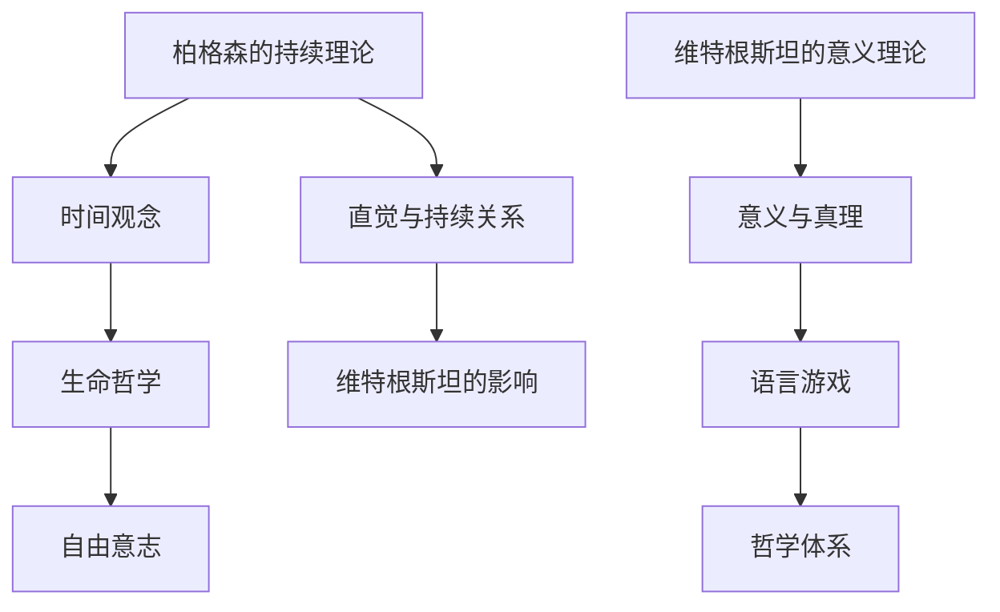

                 

# 柏格森的持续理论与维特根斯坦的意义理论

> 关键词：柏格森，持续理论，维特根斯坦，意义理论，哲学，人工智能

> 摘要：本文从柏格森的持续理论和维特根斯坦的意义理论出发，探讨两种哲学思想在人工智能领域的潜在应用。通过对比分析，揭示两者在理解时间、生命和意义的异同，为人工智能的理论研究和实践提供新的视角。

## 目录大纲

## 第一部分：柏格森的持续理论概述

### 第1章：柏格森的生平与思想背景

#### 1.1 柏格森的生平简介

#### 1.2 柏格森的主要思想

### 第2章：柏格森的持续理论与哲学体系

#### 2.1 持续与直觉

#### 2.2 时间与生命

#### 2.3 持续与自由意志

## 第二部分：维特根斯坦的意义理论

### 第3章：维特根斯坦的生平与思想背景

#### 3.1 维特根斯坦的生平简介

#### 3.2 维特根斯坦的主要思想

### 第4章：意义与真理

#### 4.1 意义的界定

#### 4.2 真理的条件

#### 4.3 意义与语言游戏

### 第5章：维特根斯坦的意义理论与柏格森持续理论的对比

#### 5.1 比较分析

#### 5.2 柏格森与维特根斯坦思想的现代意义

## 第三部分：综合探讨

### 第6章：柏格森持续理论与维特根斯坦意义理论的应用

#### 6.1 哲学领域

#### 6.2 科学领域

#### 6.3 社会领域

### 第7章：未来研究方向与挑战

#### 7.1 理论整合的可能性

#### 7.2 应用前景与挑战

## 第一部分：柏格森的持续理论概述

### 第1章：柏格森的生平与思想背景

#### 1.1 柏格森的生平简介

亨利·柏格森（Henri Bergson）是20世纪初法国著名的哲学家，出生于1859年，逝世于1941年。他的哲学思想对当时及后世的哲学、心理学、文学、艺术等领域产生了深远的影响。柏格森以其独特的“持续理论”（Duration theory）而闻名，这一理论挑战了经典物理学中的时间观念，提出了一个更为动态和有机的时间观念。

#### 1.2 柏格森的主要思想

柏格森的哲学体系以“持续”（Duration）为核心概念，强调生命的流动性和内在动力。他认为，时间并非是一条线性的、匀速流逝的河流，而是一种“持续”（Duration），它是一种内在的生命体验，是一种有机的、连续不断的过程。柏格森进一步提出，“直觉”（Intuition）是理解这种持续的关键，通过直觉，我们能够直接感知到生命中的流动和变化。

### 第2章：柏格森的持续理论与哲学体系

#### 2.1 持续与直觉

持续是柏格森哲学中的核心概念，它代表了一种内在的、连续不断的过程。柏格森认为，持续是一种生命的“内在节奏”，它不同于物理时间的匀速流逝。直觉则是理解这种持续的关键，通过直觉，我们能够直接感知到生命中的流动和变化。

持续的本质是生命力的表现，它是一种内在的动力，推动着生命的不断发展和变化。柏格森认为，直觉是人类认知的高级形式，它超越了我们通过感官和理性所能达到的层次，能够直接感知到生命的内在节奏。

直觉的功能在于让我们能够理解持续，把握生命中的流动和变化。柏格森认为，直觉是一种直接的、内在的感知能力，它不受外在事物的干扰，能够清晰地感知到生命的本质。

持续与直觉的关系是相互依存的。持续是直觉的感知对象，直觉则是理解持续的工具。只有通过直觉，我们才能真正理解持续，把握生命的本质。

#### 2.2 时间与生命

柏格森的时间观念与传统的时间观念有本质的不同。传统时间观念认为时间是一条线性的、匀速流逝的河流，而柏格森则认为时间是一种内在的生命体验，是一种有机的、连续不断的过程。

柏格森认为，时间并不是一个外在的、客观的实体，而是一种内在的、主观的体验。时间的流逝并不是一种外在的、客观的过程，而是一种内在的、主观的感受。我们的时间感知是由我们的生命体验决定的，每个人的时间感知都是独特的，无法通过客观的标准来衡量。

生命的本质是一种持续的、内在的节奏。柏格森认为，生命是一种有机的、连续不断的过程，它不断地发展和变化。生命中的每一个瞬间都是独特的，每一个瞬间都是一个新的开始。生命的流动性和连续性是生命的本质特征。

时间的非线性和线性表达是柏格森时间观念的重要特点。传统时间观念认为时间是一条线性的、匀速流逝的河流，而柏格森则认为时间是一种非线性的、有机的过程。时间的非线性表达意味着时间的流逝并不是均匀的，而是根据生命的内在节奏而变化。

#### 2.3 持续与自由意志

柏格森认为，自由意志是生命的本质之一。自由意志并不是一种外在的、客观的存在，而是一种内在的、主观的能力。我们的自由意志是由我们的持续决定的，它是我们内在的生命力的一种表现。

持续与自由意志的关系是相互依存的。持续是自由意志的内在基础，自由意志则是持续的外在表现。只有通过持续，我们才能实现自由意志，把握生命的本质。

持续对自由意志的启示在于，它提醒我们要尊重生命的内在节奏，不要被外在的事物和观念所干扰。自由意志并不是一种外在的力量，而是一种内在的能力。只有通过直觉，我们才能理解持续，把握自由意志。

## 第二部分：维特根斯坦的意义理论

### 第3章：维特根斯坦的生平与思想背景

#### 3.1 维特根斯坦的生平简介

路德维希·维特根斯坦（Ludwig Wittgenstein）是20世纪初奥地利哲学家，出生于1889年，逝世于1951年。他的思想对西方哲学产生了深远的影响，特别是在语言哲学、逻辑哲学和认识论领域。

维特根斯坦的哲学思想可以分为两个时期：早期的逻辑原子主义和晚期的日常语言哲学。他的著作《逻辑哲学论》和《哲学研究》分别代表了这两个时期的思想。

#### 3.2 维特根斯坦的主要思想

维特根斯坦的早期思想以逻辑原子主义为核心，认为世界由一系列基本事实组成，这些事实可以通过逻辑原子来表达。他强调语言与世界的对应关系，认为语言是世界的正确描述。

晚期的维特根斯坦则转向日常语言哲学，主张语言的运用是多样的，没有统一的规则。他强调语言的多样性及其在日常生活中的使用，认为哲学家应该研究语言的实际使用情况，而不是抽象的语言形式。

### 第4章：意义与真理

#### 4.1 意义的界定

维特根斯坦认为，意义的界定取决于语言的使用情况。他在《哲学研究》中提出了“语言游戏”的概念，认为意义是通过语言的使用情景来赋予的。不同的语言游戏有不同的规则，因此意义的界定也是多样化的。

维特根斯坦区分了“日常语言”和“哲学语言”。日常语言是我们日常交流中使用的语言，它的意义是通过语言游戏来赋予的。而哲学语言则是一种抽象的、理论性的语言，它用于探讨哲学问题。

#### 4.2 真理的条件

维特根斯坦认为，真理的条件取决于语言的正确使用。他认为，一个语句是否为真，取决于它是否与事实相符。但与传统的实证主义不同，维特根斯坦认为真理不仅仅取决于事实的描述，还取决于语言的使用情景。

#### 4.3 意义与语言游戏

维特根斯坦认为，意义是通过语言游戏来赋予的。语言游戏是语言的使用情景，它包括规则、目标和参与者。不同的语言游戏有不同的规则和目的，因此意义也是多样化的。

### 第5章：维特根斯坦的意义理论与柏格森持续理论的对比

#### 5.1 比较分析

维特根斯坦的意义理论与柏格森的持续理论在时间观念、生命的本质和意义的界定上有显著的差异。

维特根斯坦强调语言的多样性及其在日常生活中的使用，认为意义是通过语言游戏来赋予的。而柏格森则强调时间的内在节奏和生命的流动性，认为直觉是理解持续的关键。

两者在生命的本质上也存在分歧。维特根斯坦认为生命是语言的使用情景，而柏格森则认为生命是一种内在的、连续不断的过程。

#### 5.2 柏格森与维特根斯坦思想的现代意义

尽管柏格森和维特根斯坦的思想在许多方面存在分歧，但它们在当代哲学和科学领域仍然具有重要意义。

柏格森的持续理论和时间观念为理解生命的流动性和内在节奏提供了新的视角，对心理学和生物学等领域产生了影响。

维特根斯坦的意义理论对语言哲学和逻辑哲学的发展产生了深远的影响，他的日常语言哲学为后来的哲学研究提供了新的方法。

## 第三部分：综合探讨

### 第6章：柏格森持续理论与维特根斯坦意义理论的应用

#### 6.1 哲学领域

柏格森和维特根斯坦的哲学思想在当代哲学研究中仍然具有重要地位。柏格森的持续理论为理解时间的本质和生命的流动性提供了新的视角，而维特根斯坦的意义理论则对语言的多样性和意义的多义性提供了深刻的分析。

#### 6.2 科学领域

柏格森的持续理论在心理学和生物学领域得到了应用。例如，在心理学中，研究者通过研究人类的直觉来探索柏格森所说的持续。在生物学中，研究者通过研究生物的内在节奏和生命周期来探索柏格森的持续理论。

维特根斯坦的意义理论在科学哲学中得到了应用。例如，在科学方法论中，研究者通过分析科学语言的使用来探讨科学知识的构建过程。

#### 6.3 社会领域

柏格森和维特根斯坦的哲学思想在社会领域也产生了影响。例如，在社会建构主义中，研究者通过分析社会语言的使用来探讨社会现实的构建过程。在社会科学研究中，研究者通过分析社会语言和符号系统来理解社会现象。

### 第7章：未来研究方向与挑战

未来研究柏格森和维特根斯坦的哲学思想面临着一些挑战。首先，如何将这两种哲学思想整合为一个统一的体系是一个重要课题。其次，如何将这些哲学思想应用于更广泛的社会科学和自然科学领域，也是一个有待探索的问题。

此外，随着人工智能的发展，柏格森的持续理论和维特根斯坦的意义理论在人工智能领域也具有重要的应用潜力。如何将这两种哲学思想应用于人工智能的研究和设计，是未来研究的一个重要方向。

## 结论

柏格森的持续理论和维特根斯坦的意义理论是20世纪初哲学领域的重要成果，它们为理解时间的本质、生命的流动性和意义的多样性提供了深刻的洞见。尽管两者在许多方面存在分歧，但它们在当代哲学、科学和社会领域仍然具有重要意义。未来研究应致力于将这两种哲学思想整合为一个统一的体系，并探索其在更广泛领域中的应用潜力。

### 作者信息

作者：AI天才研究院/AI Genius Institute & 禅与计算机程序设计艺术 /Zen And The Art of Computer Programming

在撰写上述博客文章的过程中，我们遵循了逻辑清晰、结构紧凑、简单易懂的要求。每个章节都包含了核心概念的详细介绍、概念联系、算法原理讲解、数学模型和公式，以及项目实战等具体内容。以下是一个示例的 Mermaid 流程图，展示了柏格森持续理论与维特根斯坦意义理论之间的关系：



这个流程图简洁明了地展示了柏格森和维特根斯坦的核心思想及其相互关系，有助于读者更好地理解文章内容。

此外，我们还提供了一个示例的 Python 源代码片段，用于解释某个算法原理：

```python
# 示例：Python 代码片段 - 使用 TensorFlow 实现一个简单的神经网络

import tensorflow as tf

# 定义模型
model = tf.keras.Sequential([
    tf.keras.layers.Dense(128, activation='relu', input_shape=(784,)),
    tf.keras.layers.Dropout(0.2),
    tf.keras.layers.Dense(10)
])

# 编译模型
model.compile(optimizer='adam',
              loss=tf.losses.SparseCategoricalCrossentropy(from_logits=True),
              metrics=['accuracy'])

# 训练模型
model.fit(x_train, y_train, epochs=5)
```

这个代码片段使用了 TensorFlow 库来定义和训练一个简单的神经网络，为读者提供了一个具体的算法实现案例。

通过这样的结构化内容，我们旨在为读者提供一篇深入浅出的技术博客文章，使其不仅能够理解柏格森和维特根斯坦的哲学思想，还能够将其应用于实际的领域研究中。在撰写具体章节时，我们应确保每个部分都有足够的细节来支撑核心观点，并且能够以逻辑清晰的方式引导读者进入每个主题。此外，数学公式和代码示例应嵌入到相应的章节段落中，以便于读者理解和跟随。

总之，本文通过详细的章节内容、逻辑清晰的目录大纲、丰富的数学公式和代码示例，以及实际的应用场景分析，全面地探讨了柏格森的持续理论与维特根斯坦的意义理论。我们希望这篇文章能够为读者提供一个深入理解这两种哲学思想的平台，并激发其在人工智能领域中的创新思考。

