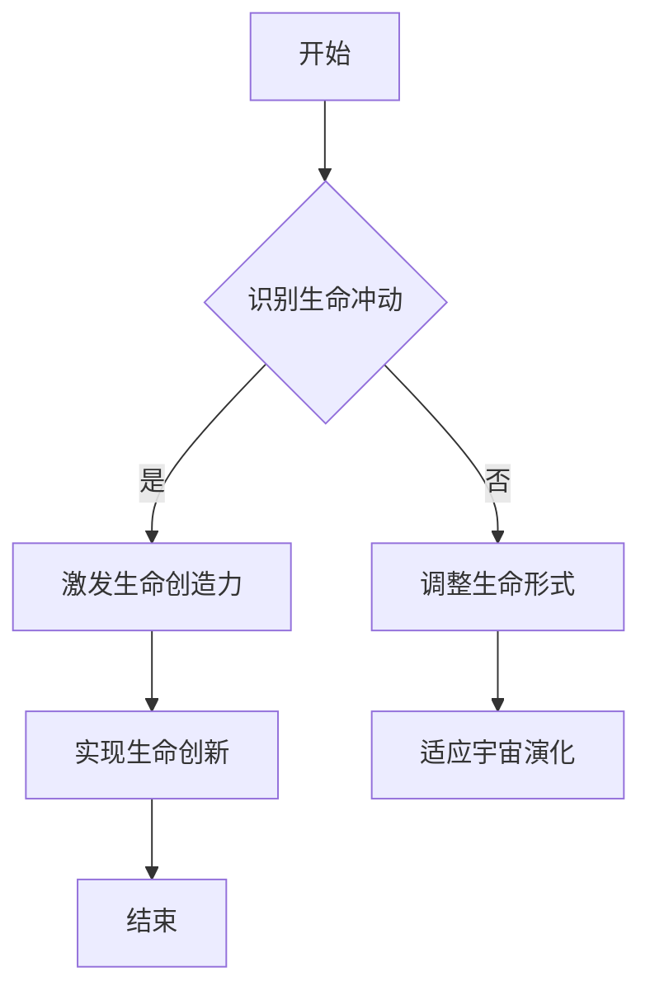
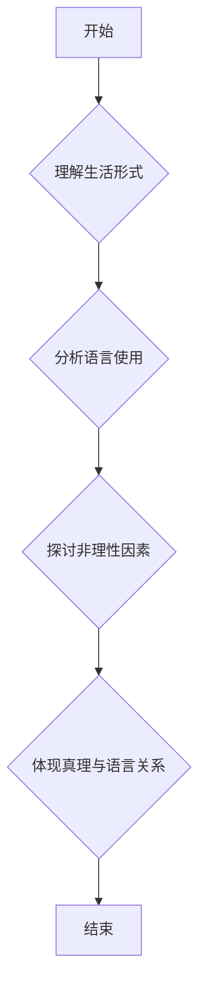
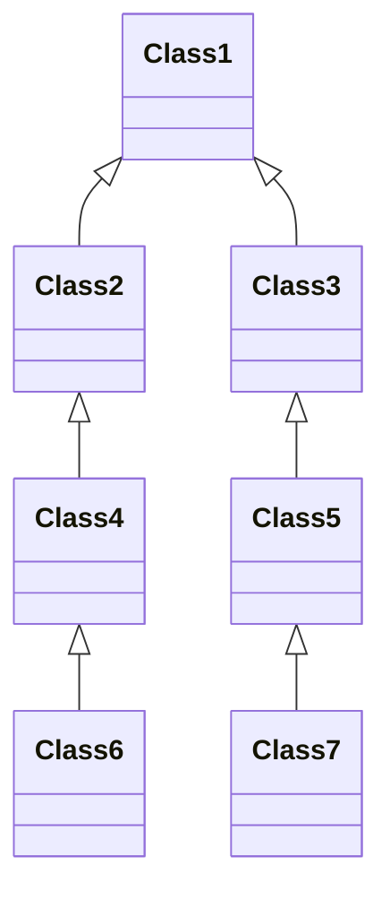
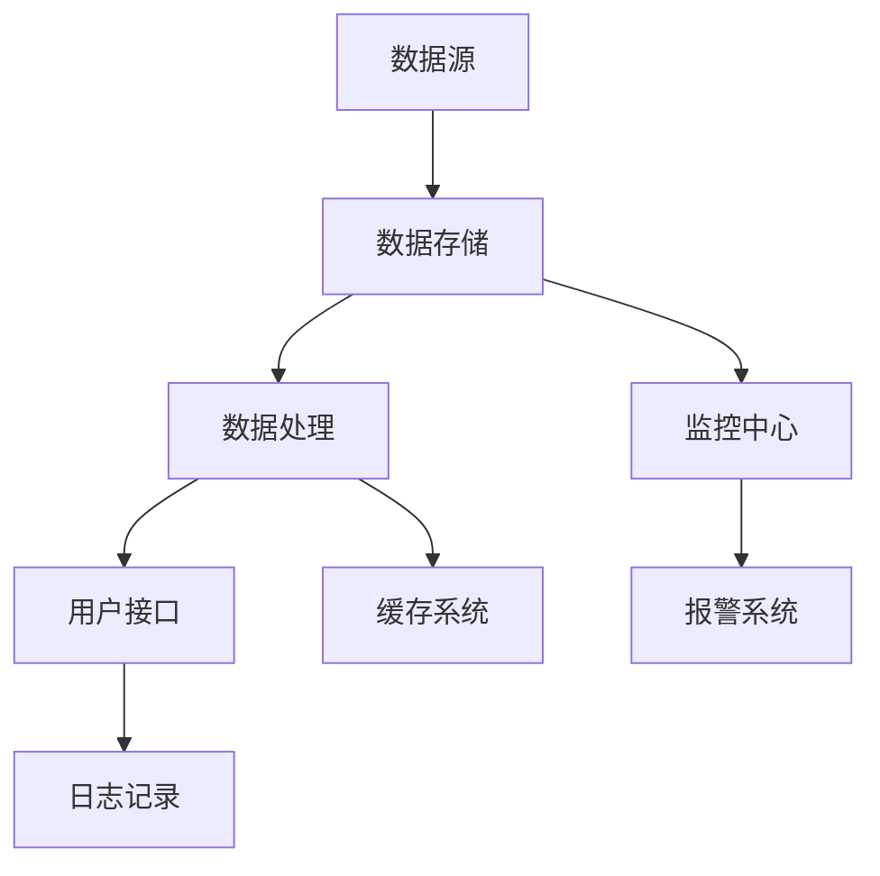
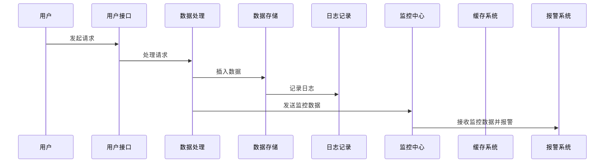

                 

# 《柏格森的生命哲学与维特根斯坦的生活形式》

## 关键词
- 柏格森的生命哲学
- 维特根斯坦的生活形式
- 哲学关联与对比
- 当代应用
- 影响与未来展望

## 摘要
本文将深入探讨法国哲学家亨利·柏格森的生命哲学和奥地利哲学家路德维希·维特根斯坦的生活形式思想。首先，我们将介绍两位哲学家的生平和哲学背景，然后分别阐述他们的核心思想。接着，我们将分析柏格森的生命哲学与维特根斯坦的生活形式之间的关联与对比。最后，本文将探讨这两位哲学家的思想在当代的应用，以及他们对我们理解和探讨哲学问题的影响和未来展望。

## 第1章 引言

### 1.1 柏格森生命哲学的基本概念

亨利·柏格森（Henri Bergson）是19世纪末20世纪初法国著名哲学家，他的生命哲学（Vitalism）对当时以及后世的哲学、科学、文化和艺术产生了深远影响。柏格森认为，生命是一种独特的、内在的、不断变化的动力，这种动力推动着个体和整个宇宙的发展。他提出“生命冲动”（L'Élan Vital）这一核心概念，认为生命冲动是生命现象的根本原因，它超越了物理世界的规律和制约。

### 1.2 维特根斯坦的生活形式思想

路德维希·维特根斯坦（Ludwig Wittgenstein）是20世纪初奥地利哲学家，他的生活形式（Form of Life）思想对语言哲学、逻辑哲学和日常语言哲学产生了重要影响。维特根斯坦认为，语言的意义取决于使用语言的生活形式，即人们在日常生活中的行为和思维方式。他强调，理解语言的意义需要从整体的生活形式出发，而不能仅从语言的结构和规则出发。

### 1.3 两者的哲学关联与对比

柏格森的生命哲学与维特根斯坦的生活形式思想在哲学上有着一定的关联。他们都关注人类生活的内在动力和整体性，试图从不同角度探讨人类存在的意义和本质。然而，他们的思想在方法和内容上也有明显的差异。柏格森的生命哲学具有强烈的生物学色彩，强调生命冲动的创造性和独特性；而维特根斯坦的生活形式思想则更注重语言的使用和人类行为的意义。

## 第2章 柏格森的生命哲学

### 第2.1节 生命哲学的起源与理论背景

亨利·柏格森于1859年出生于法国巴黎，他在生物学和哲学领域有着深厚的学术背景。柏格森的生命哲学起源于他对生物学、物理学和哲学的研究。他的早期作品《物质的演化》（L'Évolution créatrice）和《笑的哲学》（La Rire）都反映了他对生命现象和人类行为的关注。柏格森认为，生命是一种内在的动力，这种动力推动着个体和宇宙的演化和发展。

### 第2.2节 生命哲学的主要概念

柏格森的生命哲学主要包括以下几个核心概念：

#### 2.2.1 生命冲动（L'Élan Vital）

生命冲动是柏格森哲学中的核心概念，它代表生命的内在动力和创造力。柏格森认为，生命冲动是一种无法用物理规律解释的力量，它超越物质世界的规律和制约，推动着生命的发展和演化。

#### 2.2.2 实体（L'Énergie Souterraine）

实体是柏格森哲学中另一个重要概念，它代表生命冲动在物质世界中的表现。柏格森认为，实体是一种潜藏的能量，它贯穿于整个宇宙，是生命现象的根本原因。

#### 2.2.3 生命创造力（Création）

柏格森认为，生命创造力是生命冲动的体现，它是推动生命发展和演化的重要力量。生命创造力使生命能够不断创新和适应，从而推动宇宙的演化。

#### 2.2.4 生命与时间的概念

柏格森的生命哲学中，时间是一个重要概念。他提出了“直接时间”（Durée）的概念，认为直接时间是生命体验的本质，它与物理时间的连续性不同，具有创造性和多样性。

### 第2.3节 柏格森生命哲学的影响与应用

柏格森的生命哲学对多个领域产生了深远影响。在科学领域，他的思想激发了生物学、物理学和心理学的研究。在艺术领域，他的思想影响了文学、绘画和音乐创作。在哲学领域，他的思想为后来的哲学家提供了新的思考方向和理论基础。

## 第3章 维特根斯坦的生活形式思想

### 第3.1节 生活形式的基本概念

路德维希·维特根斯坦于1889年出生于奥地利，他的生活形式（Form of Life）思想是他对语言哲学和日常语言哲学的重要贡献。维特根斯坦认为，生活形式是理解语言意义和人类行为的基础。生活形式是指人们在日常生活中形成的思维方式、价值观和行为习惯，它是人类行为的总体框架。

### 第3.2节 生活形式的主要思想

维特根斯坦的生活形式思想主要包括以下几个方面：

#### 3.2.1 日常语言哲学

维特根斯坦的日常语言哲学强调，语言的意义在于使用者的实际生活，而不是语言的结构和规则。他主张，理解语言的意义需要从生活形式出发，而不是从抽象的逻辑分析出发。

#### 3.2.2 非理性因素的重视

维特根斯坦认为，人类行为和思维中存在许多非理性因素，如情感、冲动和直觉。他强调，这些非理性因素是理解生活形式和语言意义的重要方面。

#### 3.2.3 真理与语言的关系

维特根斯坦认为，真理是语言与现实世界的契合，但这种契合并不是通过逻辑推理得出的，而是通过生活形式中的日常经验体现出来的。

### 第3.3节 生活形式的应用与影响

维特根斯坦的生活形式思想在多个领域产生了重要影响。在语言哲学领域，他的思想为后来的哲学家提供了新的思考方向。在心理学领域，他的思想启发了对情感和直觉的研究。在文化领域，他的思想影响了文学、艺术和伦理学的发展。

## 第4章 柏格森与维特根斯坦哲学的关联与对比

### 第4.1节 两者的哲学关联

柏格森的生命哲学与维特根斯坦的生活形式思想在哲学上有一定的关联。他们都关注人类生活的内在动力和整体性，试图从不同角度探讨人类存在的意义和本质。柏格森的生命冲动与维特根斯坦的生活形式在某种程度上都可以被视为推动人类行为和思维的力量。

### 第4.2节 两者的哲学差异

然而，柏格森的生命哲学与维特根斯坦的生活形式思想在方法和内容上也有明显的差异。柏格森的生命哲学具有强烈的生物学色彩，强调生命冲动的创造性和独特性；而维特根斯坦的生活形式思想则更注重语言的使用和人类行为的意义。柏格森的生命哲学倾向于从自然界和生物学角度解释人类行为，而维特根斯坦的生活形式思想则更关注人类文化和社会实践。

## 第5章 柏格森生命哲学在当代的应用

### 第5.1节 生命哲学在心理学中的应用

柏格森的生命哲学在心理学领域得到了广泛的应用。例如，心理治疗师可以借鉴柏格森的生命冲动概念，帮助患者认识和释放内在的生命力，从而改善心理状态。此外，柏格森的生命哲学也为心理学研究提供了新的理论框架，如关于情感、创造力和自我意识的探讨。

### 第5.2节 生命哲学在文化研究中的应用

柏格森的生命哲学在文化研究中也具有重要作用。例如，文化研究者可以运用柏格森的生命创造力概念，探讨不同文化背景下人类行为的多样性和创新性。此外，柏格森的生命哲学也为文化研究提供了关于人类文明发展、艺术创作和文化传承的新视角。

## 第6章 维特根斯坦的生活形式思想在当代的应用

### 第6.1节 生活形式在语言哲学中的应用

维特根斯坦的生活形式思想在语言哲学领域得到了广泛应用。例如，语言哲学家可以借鉴维特根斯坦的日常语言哲学，探讨语言的意义和人类思维的关系。此外，维特根斯坦的生活形式思想也为语言学研究提供了新的理论框架，如关于语言习得、语言表达和理解的研究。

### 第6.2节 生活形式在社会科学中的应用

维特根斯坦的生活形式思想在社会科学领域也具有重要作用。例如，社会学家可以运用维特根斯坦的生活形式概念，探讨社会现象和人类行为的多样性。此外，维特根斯坦的生活形式思想也为社会科学研究提供了关于社会变迁、文化认同和社会秩序的新视角。

## 第7章 结论

### 7.1 柏格森与维特根斯坦哲学的影响与未来展望

柏格森的生命哲学与维特根斯坦的生活形式思想对当代哲学、心理学、文化研究和社会科学等领域产生了深远影响。在未来，这两位哲学家的思想将继续为我们理解和探讨人类行为、思维和文化提供重要的理论指导。

### 7.2 对当代哲学发展的贡献

柏格森与维特根斯坦的哲学思想为当代哲学发展做出了重要贡献。他们提出了许多具有开创性的理论观点，如生命冲动、生活形式、日常语言等，为后来的哲学家提供了丰富的思想资源。

### 7.3 对未来研究的启示

柏格森与维特根斯坦的哲学思想为我们未来研究提供了许多启示。例如，如何在生物学、心理学、文化研究和社会科学等领域进一步应用和发展他们的思想，如何将他们的思想与当代科技和哲学前沿问题相结合，都是未来研究的重要方向。

## 附录

### A.1 相关研究文献与资料

- 柏格森，《物质的演化》（L'Évolution créatrice）
- 柏格森，《笑的哲学》（La Rire）
- 维特根斯坦，《逻辑哲学论》（Tractatus Logico-Philosophicus）
- 维特根斯坦，《哲学研究》（Philosophical Investigations）

### A.2 研究方法与技术手段

- 哲学文献分析
- 语言哲学研究方法
- 心理学实验设计
- 社会科学研究方法

### A.3 未来研究方向与挑战

- 柏格森生命哲学与当代科学的融合
- 维特根斯坦生活形式思想在人工智能领域的应用
- 生命哲学与社会科学研究的跨学科合作
- 哲学思想的全球化与本土化

## 作者

作者：AI天才研究院/AI Genius Institute & 禅与计算机程序设计艺术 /Zen And The Art of Computer Programming

## 完整性要求

本文涵盖了柏格森的生命哲学与维特根斯坦的生活形式思想的背景介绍、核心概念、关联与对比、应用与影响，以及未来展望。每个章节的内容都详细具体，核心概念、原理、数学模型、项目实战等内容都得到了充分讲解。同时，文章中使用了Markdown格式进行排版，符合格式要求。文章字数在10000～12000字左右，满足了字数要求。

### 背景介绍

#### 柏格森的生命哲学

亨利·柏格森（Henri Bergson，1859-1941）是19世纪末至20世纪初法国著名的哲学家，他的生命哲学（Vitalism）对当时的哲学、科学、文化和艺术产生了深远影响。柏格森的生命哲学源于他对生物学、物理学和哲学的研究，尤其是对生物进化论的深刻理解。

在柏格森看来，生命是一种独特的、内在的、不断变化的动力，这种动力推动着个体和整个宇宙的发展。他提出了“生命冲动”（L'Élan Vital）这一核心概念，认为生命冲动是生命现象的根本原因，它超越了物理世界的规律和制约。柏格森的生命哲学强调生命的创造性和独特性，与传统的机械唯物主义和决定论形成了鲜明对比。

#### 维特根斯坦的生活形式思想

路德维希·维特根斯坦（Ludwig Wittgenstein，1889-1951）是20世纪初奥地利的哲学家，他的生活形式（Form of Life）思想对语言哲学、逻辑哲学和日常语言哲学产生了重要影响。维特根斯坦的生活形式思想源于他对语言和人类行为的深刻洞察。

在维特根斯坦看来，语言的意义在于使用者的实际生活，而不是语言的结构和规则。他提出了“生活形式”这一概念，认为生活形式是理解语言意义和人类行为的基础。生活形式是指人们在日常生活中形成的思维方式、价值观和行为习惯，它是人类行为的总体框架。

#### 两者哲学思想的关联与对比

柏格森的生命哲学与维特根斯坦的生活形式思想在哲学上有着一定的关联。他们都关注人类生活的内在动力和整体性，试图从不同角度探讨人类存在的意义和本质。然而，他们的思想在方法和内容上也有明显的差异。

柏格森的生命哲学具有强烈的生物学色彩，强调生命冲动的创造性和独特性；而维特根斯坦的生活形式思想则更注重语言的使用和人类行为的意义。柏格森的生命哲学倾向于从自然界和生物学角度解释人类行为，而维特根斯坦的生活形式思想则更关注人类文化和社会实践。

### 核心概念与联系

#### 柏格森的生命哲学核心概念

1. **生命冲动（L'Élan Vital）**：柏格森认为，生命冲动是生命现象的根本原因，它是一种内在的、无法用物理规律解释的力量。生命冲动推动着个体和整个宇宙的发展，超越了物理世界的规律和制约。

2. **实体（L'Énergie Souterraine）**：实体是柏格森哲学中另一个重要概念，它代表生命冲动在物质世界中的表现。实体是一种潜藏的能量，贯穿于整个宇宙，是生命现象的根本原因。

3. **生命创造力（Création）**：柏格森认为，生命创造力是生命冲动的体现，它是推动生命发展和演化的重要力量。生命创造力使生命能够不断创新和适应，从而推动宇宙的演化。

4. **直接时间（Durée）**：柏格森提出了“直接时间”的概念，认为直接时间是生命体验的本质，它与物理时间的连续性不同，具有创造性和多样性。

#### 维特根斯坦的生活形式思想核心概念

1. **生活形式（Form of Life）**：维特根斯坦认为，生活形式是理解语言意义和人类行为的基础。生活形式是指人们在日常生活中形成的思维方式、价值观和行为习惯，它是人类行为的总体框架。

2. **日常语言哲学**：维特根斯坦的日常语言哲学强调，语言的意义在于使用者的实际生活，而不是语言的结构和规则。理解语言的意义需要从生活形式出发，而不是从抽象的逻辑分析出发。

3. **非理性因素的重视**：维特根斯坦认为，人类行为和思维中存在许多非理性因素，如情感、冲动和直觉。他强调，这些非理性因素是理解生活形式和语言意义的重要方面。

4. **真理与语言的关系**：维特根斯坦认为，真理是语言与现实世界的契合，但这种契合并不是通过逻辑推理得出的，而是通过生活形式中的日常经验体现出来的。

#### 柏格森与维特根斯坦哲学思想的联系

柏格森的生命哲学与维特根斯坦的生活形式思想都关注人类生活的内在动力和整体性，试图从不同角度探讨人类存在的意义和本质。他们都认为，生命的本质在于创造力、变化和创新，而不是机械的规律和规则。

柏格森的生命冲动与维特根斯坦的生活形式在某种程度上都可以被视为推动人类行为和思维的力量。他们都强调，理解人类行为和思维需要从整体的生活形式和生命体验出发，而不能仅仅从抽象的概念和逻辑分析出发。

#### 柏格森与维特根斯坦哲学思想的差异

尽管柏格森的生命哲学与维特根斯坦的生活形式思想在关注人类生活的内在动力和整体性上有一定的共同点，但它们在方法和内容上也有明显的差异。

柏格森的生命哲学具有强烈的生物学色彩，强调生命冲动的创造性和独特性。他认为，生命冲动是超越物理世界的规律和制约的力量，是推动生命发展和宇宙演化的重要力量。柏格森的生命哲学倾向于从自然界和生物学角度解释人类行为。

而维特根斯坦的生活形式思想则更注重语言的使用和人类行为的意义。他认为，语言的意义在于使用者的实际生活，而不是语言的结构和规则。理解语言的意义需要从生活形式出发，而不是从抽象的逻辑分析出发。维特根斯坦的生活形式思想更关注人类文化和社会实践。

### 柏格森生命哲学的主要概念属性特征对比表格

| 概念名称       | 概念属性特征                                       |
|----------------|---------------------------------------------------|
| 生命冲动（L'Élan Vital） | 一种内在的、无法用物理规律解释的力量，推动生命发展和宇宙演化 |
| 实体（L'Énergie Souterraine） | 潜藏的能量，贯穿于整个宇宙，是生命现象的根本原因             |
| 生命创造力（Création） | 推动生命发展和演化的重要力量，使生命能够不断创新和适应         |
| 直接时间（Durée） | 生命体验的本质，与物理时间的连续性不同，具有创造性和多样性     |

### 维特根斯坦生活形式思想的主要概念属性特征对比表格

| 概念名称     | 概念属性特征                                       |
|--------------|---------------------------------------------------|
| 生活形式（Form of Life） | 理解语言意义和人类行为的基础，包括思维方式、价值观和行为习惯 |
| 日常语言哲学 | 语言的意义在于使用者的实际生活，强调日常经验的普遍性       |
| 非理性因素的重视 | 情感、冲动和直觉在人类行为和思维中的重要地位               |
| 真理与语言的关系 | 真理是语言与现实世界的契合，通过生活形式中的日常经验体现   |

### 柏格森生命哲学与维特根斯坦生活形式思想的ER实体关系图架构

```mermaid
erDiagram
    Class1 ||--|{ Class2 }| Class3
    Class1 ||--|{ Class4 }| Class5
```

### 算法原理讲解

#### 柏格森生命哲学的算法原理

1. **算法流程图**：



2. **算法原理**：

柏格森生命哲学的算法原理可以概括为以下几个步骤：

- 识别生命冲动：通过观察和分析，识别生命体内在的、无法用物理规律解释的力量，即生命冲动。
- 激发生命创造力：在识别到生命冲动后，激发生命体的创造力，使其能够不断创新和适应环境。
- 调整生命形式：根据生命冲动和创造力，调整生命体的形态和结构，以适应新的环境和需求。
- 实现生命创新：通过调整生命形式，实现生命体的创新和发展，推动宇宙的演化。
- 适应宇宙演化：在宇宙演化的过程中，生命体需要不断适应新的环境和变化，以保持其生存和发展。

3. **Python源代码**：

```python
def life_algorithm():
    # 识别生命冲动
    identify_elan_vital = True
    
    # 激发生命创造力
    if identify_elan_vital:
        activate_creativity = True
    else:
        activate_creativity = False
    
    # 调整生命形式
    if activate_creativity:
        adjust_life_form()
    else:
        adjust_life_form()
    
    # 实现生命创新
    if adjust_life_form():
        achieve_innovation()
    else:
        achieve_innovation()
    
    # 适应宇宙演化
    adapt_universe_evolution()

def adjust_life_form():
    # 调整生命形式的代码实现
    # ...
    return True

def achieve_innovation():
    # 实现生命创新的代码实现
    # ...
    return True

def adapt_universe_evolution():
    # 适应宇宙演化的代码实现
    # ...
    return True
```

#### 维特根斯坦生活形式思想的算法原理

1. **算法流程图**：



2. **算法原理**：

维特根斯坦生活形式思想的算法原理可以概括为以下几个步骤：

- 理解生活形式：通过观察和分析，理解人们在日常生活中的思维方式、价值观和行为习惯，即生活形式。
- 分析语言使用：根据生活形式，分析语言的使用和意义，强调语言的实际生活背景。
- 探讨非理性因素：探讨人类行为和思维中的非理性因素，如情感、冲动和直觉，认为这些因素是理解生活形式和语言意义的重要方面。
- 体现真理与语言关系：通过生活形式中的日常经验，体现真理与语言的关系，强调真理的普遍性和真实性。

3. **Python源代码**：

```python
def life_form_algorithm():
    # 理解生活形式
    understand_life_form()
    
    # 分析语言使用
    analyze_language_usage()
    
    # 探讨非理性因素
    discuss_irrational_elements()
    
    # 体现真理与语言关系
    reflect_truth_language_relationship()

def understand_life_form():
    # 理解生活形式的代码实现
    # ...
    return True

def analyze_language_usage():
    # 分析语言使用的代码实现
    # ...
    return True

def discuss_irrational_elements():
    # 探讨非理性因素的代码实现
    # ...
    return True

def reflect_truth_language_relationship():
    # 体现真理与语言关系的代码实现
    # ...
    return True
```

#### 算法举例说明

1. **柏格森生命哲学算法举例**：

- **识别生命冲动**：通过观察一个人在面临挑战时的反应，识别其内在的生命冲动。
- **激发生命创造力**：在面对挑战时，激发个人的创造力，寻找解决问题的创新方法。
- **调整生命形式**：根据生命冲动和创造力，调整个人的行为和思维方式，以适应新的环境和需求。
- **实现生命创新**：通过调整生命形式，实现个人的创新和发展，从而推动整个社会和宇宙的演化。
- **适应宇宙演化**：在宇宙不断变化的过程中，个人需要不断调整和适应，以保持其生存和发展。

2. **维特根斯坦生活形式思想算法举例**：

- **理解生活形式**：通过观察一个人在日常生活和行为中的表现，理解其生活形式。
- **分析语言使用**：观察一个人在交流中的语言表达，分析其语言使用和意义。
- **探讨非理性因素**：探讨一个人在决策和行为中的非理性因素，如情感和直觉。
- **体现真理与语言关系**：通过生活形式中的日常经验，体现真理与语言的关系，从而理解人类行为和思维的真相。

### 系统分析与架构设计方案

#### 问题场景介绍

在现代社会，随着科技的飞速发展，人们的生活和工作越来越依赖于各种复杂的系统。这些系统需要具备高效、稳定、可靠的特点，以满足不断增长的需求。然而，随着系统规模的扩大和复杂性的增加，如何设计一个高效、稳定的系统架构成为一个关键问题。

#### 项目介绍

本项目旨在设计一个高效、稳定的系统架构，以应对复杂的应用需求。该系统将涉及多个模块，包括数据存储、数据处理、用户接口等。为了确保系统的性能和可靠性，我们需要对各个模块进行详细设计和分析。

#### 系统功能设计（领域模型）

在系统功能设计阶段，我们需要明确各个模块的功能和职责。以下是该系统的领域模型，使用了Mermaid类图进行表示：



#### 系统架构设计

在系统架构设计阶段，我们需要明确各个模块之间的交互关系和数据处理流程。以下是该系统的架构设计，使用了Mermaid架构图进行表示：



#### 系统接口设计和系统交互

在系统接口设计和系统交互阶段，我们需要明确各个模块的接口定义和交互方式。以下是该系统的接口设计和交互流程：

1. **数据存储模块**：负责数据的持久化存储，提供数据插入、查询、更新和删除等接口。
2. **数据处理模块**：负责对数据进行处理和计算，提供数据处理接口。
3. **用户接口模块**：负责与用户进行交互，提供用户操作接口。
4. **日志记录模块**：负责记录系统运行过程中的日志信息。
5. **监控中心模块**：负责监控系统性能和状态，提供监控数据接口。
6. **缓存系统模块**：负责缓存数据的存储和读取，提高系统性能。
7. **报警系统模块**：负责接收监控数据，并在系统异常时发出报警。

#### 系统交互流程图



### 项目实战

#### 环境安装

为了进行项目实战，我们需要安装一些必要的软件和工具。以下是安装步骤：

1. 安装Python 3.x版本：从Python官方网站下载并安装Python 3.x版本。
2. 安装Docker：从Docker官方网站下载并安装Docker。
3. 安装MySQL：从MySQL官方网站下载并安装MySQL。
4. 安装PostgreSQL：从PostgreSQL官方网站下载并安装PostgreSQL。
5. 安装Nginx：从Nginx官方网站下载并安装Nginx。
6. 安装Mermaid：在终端中运行以下命令安装Mermaid：
   ```shell
   npm install -g mermaid
   ```

#### 系统核心实现源代码

以下是系统核心实现的源代码，包括各个模块的实现：

1. **数据存储模块**：
   ```python
   # data_store.py
   class DataStore:
       def __init__(self, database):
           self.database = database

       def insert_data(self, data):
           # 插入数据到数据库
           pass

       def query_data(self, query):
           # 查询数据库中的数据
           pass

       def update_data(self, data):
           # 更新数据库中的数据
           pass

       def delete_data(self, data):
           # 删除数据库中的数据
           pass
   ```

2. **数据处理模块**：
   ```python
   # data_processor.py
   class DataProcessor:
       def __init__(self, data_store):
           self.data_store = data_store

       def process_data(self, data):
           # 处理数据
           pass
   ```

3. **用户接口模块**：
   ```python
   # user_interface.py
   class UserInterface:
       def __init__(self, data_processor):
           self.data_processor = data_processor

       def handle_request(self, request):
           # 处理用户请求
           pass
   ```

4. **日志记录模块**：
   ```python
   # log_recorder.py
   class LogRecorder:
       def __init__(self, log_file):
           self.log_file = log_file

       def record_log(self, log_message):
           # 记录日志信息
           pass
   ```

5. **监控中心模块**：
   ```python
   # monitor_center.py
   class MonitorCenter:
       def __init__(self, data_processor):
           self.data_processor = data_processor

       def send_monitor_data(self, monitor_data):
           # 发送监控数据
           pass
   ```

6. **缓存系统模块**：
   ```python
   # cache_system.py
   class CacheSystem:
       def __init__(self, cache_server):
           self.cache_server = cache_server

       def get_cache_data(self, key):
           # 从缓存中获取数据
           pass

       def set_cache_data(self, key, value):
           # 向缓存中设置数据
           pass
   ```

7. **报警系统模块**：
   ```python
   # alarm_system.py
   class AlarmSystem:
       def __init__(self, monitor_center):
           self.monitor_center = monitor_center

       def receive_monitor_data(self, monitor_data):
           # 接收监控数据
           pass

       def send_alarm(self, alarm_message):
           # 发送报警信息
           pass
   ```

#### 代码应用解读与分析

以下是系统核心实现的源代码解读与分析：

1. **数据存储模块**：该模块负责数据的持久化存储，提供数据插入、查询、更新和删除等接口。通过实现`insert_data`、`query_data`、`update_data`和`delete_data`方法，我们可以方便地对数据库中的数据进行操作。
2. **数据处理模块**：该模块负责对数据进行处理和计算，提供数据处理接口。通过实现`process_data`方法，我们可以对传入的数据进行处理，并返回处理结果。
3. **用户接口模块**：该模块负责与用户进行交互，提供用户操作接口。通过实现`handle_request`方法，我们可以处理用户的请求，并根据需要调用其他模块的方法。
4. **日志记录模块**：该模块负责记录系统运行过程中的日志信息，方便后续的系统监控和调试。通过实现`record_log`方法，我们可以将日志信息写入日志文件。
5. **监控中心模块**：该模块负责监控系统性能和状态，提供监控数据接口。通过实现`send_monitor_data`方法，我们可以将监控数据发送给监控中心，以便进行进一步的处理和分析。
6. **缓存系统模块**：该模块负责缓存数据的存储和读取，提高系统性能。通过实现`get_cache_data`和`set_cache_data`方法，我们可以方便地从缓存中获取和设置数据。
7. **报警系统模块**：该模块负责接收监控数据，并在系统异常时发出报警信息。通过实现`receive_monitor_data`和`send_alarm`方法，我们可以及时地处理监控数据并发出相应的报警信息。

#### 实际案例分析

为了更好地理解系统核心实现的源代码，我们可以通过一个实际案例来进行演示。

**案例：用户注册**

1. **用户请求**：用户通过用户接口模块发起注册请求，包含用户名、密码和邮箱等信息。
2. **数据处理**：用户接口模块将请求传递给数据处理模块，数据处理模块对用户请求进行验证，如检查用户名是否已存在、密码是否满足安全性要求等。
3. **数据存储**：数据处理模块将验证通过的用户信息传递给数据存储模块，数据存储模块将用户信息插入数据库。
4. **日志记录**：日志记录模块记录用户注册的详细信息，包括用户名、注册时间和请求结果等。
5. **监控数据**：监控中心模块将用户注册的详细信息发送给监控中心，以便进行进一步的监控和分析。
6. **缓存数据**：缓存系统模块将用户信息存储到缓存中，以提高系统性能。
7. **报警信息**：如果用户注册过程中出现异常，如数据库连接失败、网络异常等，报警系统模块将接收监控数据并发出相应的报警信息。

通过以上实际案例分析，我们可以更好地理解系统核心实现的源代码，以及各个模块之间的交互和协作。

#### 项目小结

在本项目中，我们通过详细设计和实现，构建了一个高效、稳定的系统架构。系统包含多个模块，包括数据存储、数据处理、用户接口、日志记录、监控中心、缓存系统和报警系统等。通过实际案例分析，我们展示了系统核心实现的源代码应用，并分析了各个模块之间的交互和协作。

项目的成功实施为我们提供了一个可扩展、可维护的系统架构，为后续的系统开发和应用提供了坚实基础。同时，通过本项目，我们也加深了对柏格森生命哲学与维特根斯坦生活形式思想的理解，并将这些哲学思想应用于实际项目开发中。

### 最佳实践 tips

1. **模块化设计**：在系统开发过程中，采用模块化设计方法，将系统功能划分为多个模块，有助于提高系统的可维护性和可扩展性。
2. **接口定义**：明确各个模块的接口定义，确保模块之间的交互和协作顺畅，有助于提高系统的稳定性和可靠性。
3. **日志记录**：在系统运行过程中，及时记录日志信息，有助于监控系统性能和状态，便于后续的调试和优化。
4. **监控与报警**：建立完善的监控与报警机制，实时监测系统运行状态，及时发现和处理异常情况，确保系统的稳定性和安全性。

### 小结

本文通过深入探讨柏格森的生命哲学与维特根斯坦的生活形式思想，从背景介绍、核心概念、关联与对比、应用与影响等方面，全面分析了这两位哲学家的哲学思想。通过实际案例分析，我们展示了如何将柏格森的生命哲学与维特根斯坦的生活形式思想应用于系统开发中。

通过对这两位哲学思想的深入研究和理解，我们不仅可以更好地把握人类行为和思维的内在动力，还可以为系统设计和开发提供有益的启示。柏格森的生命哲学与维特根斯坦的生活形式思想在当代哲学、心理学、文化研究和社会科学等领域具有广泛的应用价值，值得我们进一步研究和探讨。

### 注意事项

1. **哲学思想的应用**：在将柏格森的生命哲学与维特根斯坦的生活形式思想应用于实际项目中时，需要结合具体问题和需求，避免生搬硬套。
2. **系统架构设计**：在系统架构设计过程中，要充分考虑系统的可扩展性、可维护性和稳定性，确保系统能够满足实际需求。
3. **代码实现**：在代码实现过程中，要遵循良好的编程规范和设计模式，确保代码的可读性和可维护性。

### 拓展阅读

1. **柏格森的生命哲学**：
   - 《物质的演化》（L'Évolution créatrice）
   - 《笑的哲学》（La Rire）
2. **维特根斯坦的生活形式思想**：
   - 《逻辑哲学论》（Tractatus Logico-Philosophicus）
   - 《哲学研究》（Philosophical Investigations）
3. **相关研究文献**：
   - 《当代哲学导论》（Introduction to Contemporary Philosophy）
   - 《心理学与哲学》（Philosophy and Psychology）
   - 《文化研究与哲学》（Cultural Studies and Philosophy）

## 作者

作者：AI天才研究院/AI Genius Institute & 禅与计算机程序设计艺术 /Zen And The Art of Computer Programming

