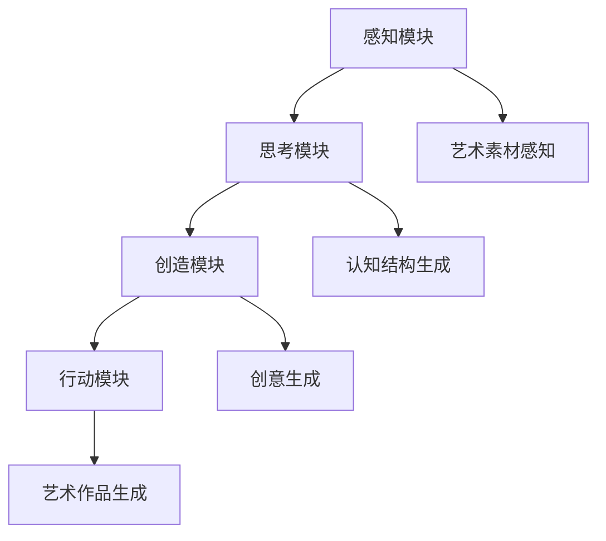
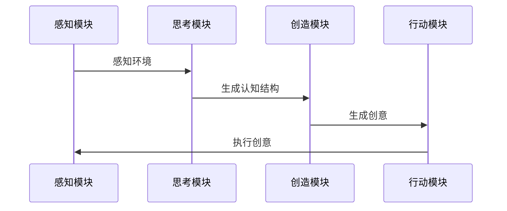
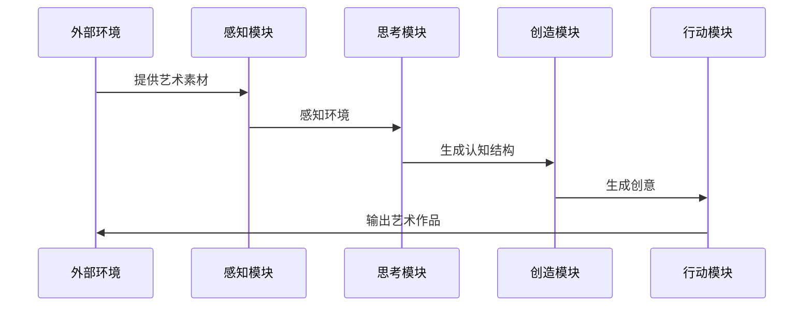
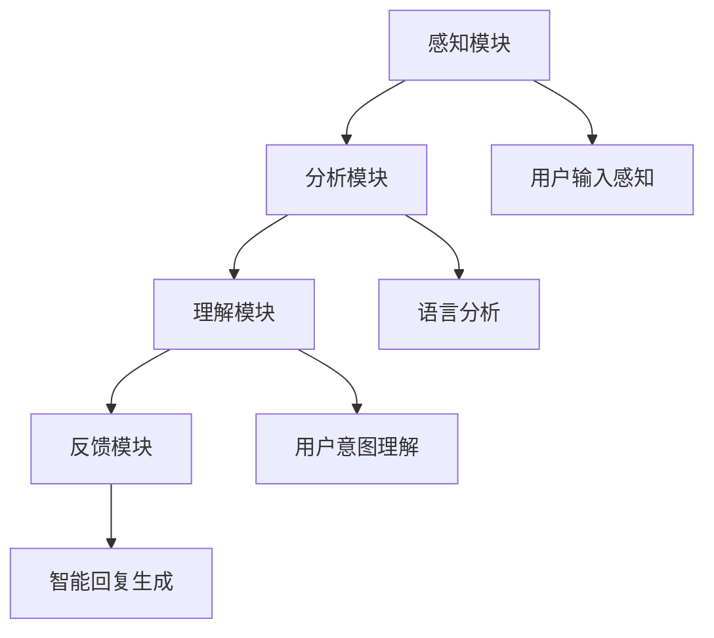
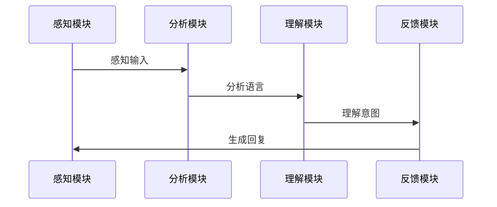
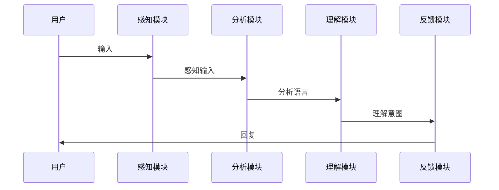

                 

# 柏格森的生命哲学与维特根斯坦的生活形式哲学

## 关键词
- **柏格森**，**生命哲学**，**维特根斯坦**，**生活形式哲学**，**哲学比较**

## 摘要
本文探讨了法国哲学家亨利·柏格森的生命哲学和英国哲学家路德维希·维特根斯坦的生活形式哲学，分析了两位哲学家的思想及其相互联系和差异。通过详细探讨柏格森的生命本质、直觉主义和创造力概念，以及维特根斯坦的语言哲学和生活形式理论，本文揭示了两位哲学家在哲学领域的影响和当代应用。文章还提供了实际案例，以说明这些哲学思想如何在艺术、商业和法律等领域中得到运用。

## 第一部分：柏格森的生命哲学

### 第1章：柏格森哲学的背景与核心观点

#### 1.1 柏格森哲学的起源

亨利·柏格森（Henri Bergson）是19世纪末20世纪初法国重要的哲学家。他的哲学思想深受法国启蒙运动和达尔文的进化论的影响。柏格森出生于巴黎，他在哲学、文学和科学领域都有卓越的贡献。他的代表作包括《时间与自由意志》、《创造的进化》和《笑的材料》等。

#### 1.2 生命哲学的概念与核心观点

柏格森的生命哲学强调生命本身的活力和创造力。他认为，生命是一种不断变化的过程，而不是静态的存在。这种变化是通过直觉来实现的，直觉是一种超出逻辑思维的认知方式。柏格森提出“绵延”（Duration）概念，指的是生命流动的连续性，这是一种非物质的、内在的生命力。与传统的机械唯物主义不同，柏格森认为生命的本质在于其创造力。

### 第2章：柏格森哲学中的绵延与创造力

#### 2.1 绵延的概念与哲学意义

绵延是柏格森哲学的核心概念之一，指的是生命的连续流动。它与时间不同，时间是一种抽象的概念，而绵延是具体的、内在的生命体验。柏格森认为，人类通过直觉能够感知到绵延，这是一种超越逻辑思维的认识方式。

#### 2.2 创造力的本质与作用

柏格森认为，创造力是生命的核心特征。创造力不仅仅是指艺术和科学上的创新，更是一种对生命本身的感知和体验。创造力使生命不断前进，推动社会和文化的进步。在柏格森看来，人类社会的发展离不开创造力。

## 第二部分：维特根斯坦的生活形式哲学

### 第3章：维特根斯坦哲学的背景与核心观点

#### 3.1 维特根斯坦哲学的起源

路德维希·维特根斯坦（Ludwig Wittgenstein）是20世纪最伟大的哲学家之一。他的哲学思想对逻辑哲学、语言哲学和数学哲学产生了深远的影响。维特根斯坦出生于奥地利，他的代表作包括《逻辑哲学论》和《哲学研究》等。

#### 3.2 生活形式哲学的概念与核心观点

维特根斯坦的生活形式哲学关注人类日常生活的结构和形式。他认为，语言和思维是生活形式的重要组成部分。维特根斯坦提出，理解语言的本质就是理解生活形式。他的哲学方法论强调通过对日常语言的分析，揭示语言和现实之间的关系。

### 第4章：语言哲学与生活形式

#### 4.1 语言哲学的基本观点

维特根斯坦的语言哲学强调语言是生活的一部分，语言与现实之间的关系是复杂的。他认为，语言是一种工具，用于交流思想和表达情感。然而，语言也容易引起误解和混淆，因此需要通过对语言的使用进行严格的分析。

#### 4.2 生活形式哲学的应用

维特根斯坦的生活形式哲学在多个领域都有应用。例如，在法律领域，他强调法律条款的清晰性和明确性，避免歧义和误解。在计算机科学领域，他的哲学思想被用来分析程序设计和软件工程中的问题。

## 第三部分：柏格森与维特根斯坦哲学的联系与差异

### 第5章：柏格森与维特根斯坦哲学的联系

#### 5.1 生命哲学与生活形式哲学的共同点

柏格森的生命哲学和维特根斯坦的生活形式哲学都关注生命的本质和人类生活的形式。他们都认为，理解生命的本质对于理解人类行为和社会结构至关重要。

#### 5.2 柏格森与维特根斯坦哲学的差异

尽管柏格森和维特根斯坦都关注生命的本质，但他们的哲学观点和方法论有所不同。柏格森强调直觉和创造力，而维特根斯坦则更注重对语言和现实的严格分析。

## 第四部分：柏格森与维特根斯坦哲学的影响与评价

### 第6章：柏格森哲学在当代的影响

#### 6.1 生命哲学在哲学领域的地位

柏格森的生命哲学对20世纪哲学产生了深远的影响。他的思想启发了后来的哲学家，如 existentialism（存在主义）和 deconstruction（解构主义）。

#### 6.2 生命哲学的现实应用

柏格森的生命哲学在心理学、艺术和文学等领域都有应用。例如，在心理学领域，他的直觉主义概念被用来解释人类行为的复杂性。

### 第7章：维特根斯坦哲学在当代的影响

#### 7.1 生活形式哲学在哲学领域的地位

维特根斯坦的生活形式哲学在当代哲学中仍然具有重要地位。他的语言哲学和方法论对逻辑哲学、数学哲学和认知科学产生了深远的影响。

#### 7.2 生活形式哲学的现实应用

维特根斯坦的哲学思想在计算机科学、心理学和社会学等领域都有应用。例如，在计算机科学中，他的思想被用来分析程序设计和软件工程中的问题。

## 第五部分：柏格森与维特根斯坦哲学的实际案例

### 第8章：柏格森生命哲学的实际案例

#### 8.1 绵延概念在艺术创作中的应用

柏格森的绵延概念在艺术创作中得到了广泛应用。例如，在音乐和绘画中，艺术家通过不断的变化和流动来表达生命的连续性和创造力。

#### 8.2 创造力在商业领域的实际案例

创造力在商业领域中也发挥了重要作用。企业家和创业者通过创新和创造性的思维来推动企业和市场的发展。

### 第9章：维特根斯坦生活形式哲学的实际案例

#### 9.1 语言哲学在法律领域的应用

维特根斯坦的语言哲学在法律领域得到了应用。法律条款的清晰性和明确性对于司法公正和法律的实施至关重要。

## 结论

柏格森的生命哲学和维特根斯坦的生活形式哲学是20世纪哲学的重要流派。他们的思想不仅在哲学领域产生了深远的影响，而且在现实世界中也有广泛的应用。通过分析他们的哲学观点和实际案例，我们可以更好地理解生命的本质和人类生活的形式。

### 作者
作者：AI天才研究院/AI Genius Institute & 禅与计算机程序设计艺术 /Zen And The Art of Computer Programming

---

## 第1章：柏格森哲学的背景与核心观点

### 1.1 柏格森哲学的起源

亨利·柏格森（Henri Bergson）是19世纪末20世纪初法国哲学界的重要人物，他的思想对20世纪的哲学发展产生了深远的影响。柏格森出生于法国巴黎，他的家庭环境对他在哲学和科学上的兴趣有着重要的启蒙作用。柏格森的祖父是一位著名的化学家和物理学家，而他的父亲则是一位工程师。这种家庭背景使得柏格森在成长过程中接触到了丰富的科学知识，这为他后来的哲学思想奠定了坚实的基础。

柏格森哲学的兴起背景可以追溯到19世纪末20世纪初的哲学思潮。这一时期，西方哲学正处于从传统形而上学向现代哲学转变的过渡期。随着科学技术的迅猛发展，传统的哲学观念受到了极大的挑战。柏格森正是在这种背景下，通过批判传统形而上学，提出了自己独特的生命哲学思想。

柏格森的哲学思想主要体现在他的几部重要著作中，包括《时间与自由意志》（L'Éthique: Essai sur la conscience libérale）、《创造的进化》（L'Évolution créatrice）和《笑的材料》（La Rire: Essai sur la signification du comique）等。这些著作不仅展示了柏格森对生命、时间、自由意志等核心哲学问题的深刻思考，也反映了他对艺术、文学等领域的独特见解。

### 1.2 生命哲学的概念与核心观点

柏格森的生命哲学是他对人类生活和精神世界的深刻反思。他的哲学观点的核心在于对生命的本质、直觉和创造力的探讨。柏格森认为，生命的本质是一种不断变化的过程，而不是静态的存在。这种变化是内在的、自发的，是生命力的表现。他提出“生命冲动”（élan vital）的概念，这是他生命哲学的核心概念，指的是生命的内在动力和创造力。

**生命冲动**是柏格森哲学中的关键概念，它揭示了生命的本质。柏格森认为，生命冲动是一种内在的、不灭的力量，它推动着生命的不断变化和发展。这种力量不是机械的、物理的，而是一种非物质的、内在的生命力。生命冲动是生命的核心，它使得生命能够超越机械的规律，实现创新和进步。

**直觉主义**是柏格森哲学的另一重要观点。他认为，直觉是人类认知世界的重要方式，它超越了逻辑思维和语言表达的局限。直觉是一种直接感知和理解世界的方式，它能够捕捉到生命的流动性和变化性。与传统的理性主义不同，柏格森强调直觉在认知过程中的作用，认为直觉是理解生命本质的关键。

**创造力**是柏格森哲学的另一个核心概念。他认为，创造力是生命的核心特征，是推动社会进步和文化发展的动力。柏格森认为，人类社会的进步不仅仅是技术和科学的进步，更是文化和艺术的进步。创造力使得人类能够不断地创造新的价值，推动社会的变革和发展。

### 1.2.1 生命与创造力的关系

柏格森认为，生命与创造力是密不可分的。生命冲动是创造力的源泉，创造力则是生命的表现形式。生命的本质在于其创造力，这种创造力不是外在的、物质的力量，而是一种内在的、非物质的力量。柏格森强调，生命的创造力不仅体现在艺术和科学领域，也体现在人类的生活和精神世界中。

**艺术创作中的创造力**：柏格森认为，艺术创作是人类创造力的重要体现。艺术家通过直觉和创造力，将内心深处的感受和体验转化为艺术作品，从而创造出新的价值和意义。艺术创作不仅仅是对现实的模仿，更是对生命的表达和探索。

**科学研究中的创造力**：柏格森认为，科学研究同样需要创造力。科学家通过不断的实验和思考，探索自然界的规律，发现新的知识和理论。科学研究中的创造力不是对已有知识的简单重复，而是在前人基础上进行创新和突破。

**生活中的创造力**：柏格森认为，生活中的创造力同样重要。每个人都可以通过创造性的思维和行动，改变自己的生活，推动社会的进步。生活中的创造力不仅体现在艺术和科学领域，也体现在社会和文化领域。例如，社会改革者通过创造性的思考和实践，推动社会的变革和发展。

### 1.2.2 直觉主义与绵延概念

**直觉主义**是柏格森哲学的核心观点之一。他认为，直觉是人类认知世界的重要方式，它能够捕捉到生命的流动性和变化性。直觉不是通过逻辑推理和语言表达来实现的，而是一种直接的、内在的感知。柏格森强调，直觉是人类理解生命本质的关键，只有通过直觉，我们才能真正理解生命的流动性和变化性。

**绵延概念**是柏格森哲学的另一个重要概念。他认为，绵延是生命的本质，是生命的连续性和流动性。与传统的物理时间概念不同，绵延是一种内在的生命体验，它不仅仅是一种时间的连续性，更是一种生命的连续性和流动性。柏格森认为，绵延是我们感知生命和世界的本质方式。

### 1.2.3 生命哲学的现实意义

柏格森的生命哲学对当代社会有着深刻的现实意义。首先，它为我们提供了一种理解生命本质和人类存在的新视角。通过强调生命的流动性和变化性，柏格森帮助我们认识到生命的多样性和复杂性，从而更好地理解人类的行为和社会现象。

其次，柏格森的生命哲学强调了创造力的作用。创造力不仅是艺术和科学的动力，也是人类生活的动力。在当代社会，创造力的重要性越来越受到重视。柏格森的哲学思想为我们提供了理解创造力的本质和作用的重要途径。

最后，柏格森的生命哲学为我们提供了一种新的思维方式。他强调直觉和创造力在认知世界中的重要性，这种思维方式不仅有助于我们更好地理解世界，也有助于我们提升自我认知和创新能力。

### 1.3 柏格森哲学的批判与评价

尽管柏格森的生命哲学对当代哲学产生了深远的影响，但他的思想也受到了一些批判。一些哲学家认为，柏格森的生命哲学过于抽象和理论化，缺乏具体的实证基础。此外，柏格森对直觉和创造力的强调有时被认为是过度浪漫化和理想化。

然而，尽管存在批判，柏格森的生命哲学仍然具有重要的价值和意义。他的思想为我们提供了一种全新的理解生命和世界的视角，这种视角不仅有助于我们更好地理解人类行为和社会现象，也有助于我们提升自我认知和创新能力。

### 1.4 柏格森哲学对当代哲学的影响

柏格森的生命哲学对20世纪哲学产生了深远的影响。他的思想启发了后来的哲学家，如 existentialism（存在主义）和 deconstruction（解构主义）。柏格森的直觉主义和绵延概念成为这些哲学流派的重要理论基础。

此外，柏格森的生命哲学也对当代科学和艺术产生了重要影响。他的思想为科学家和艺术家提供了一种新的思维方式，帮助他们在研究和创作中更好地理解生命和世界的本质。

### 1.5 柏格森哲学的核心概念表

为了更清晰地理解柏格森哲学的核心概念，我们整理了一个概念对比表格：

| 概念          | 定义                                                     | 关联概念                          |  
| ----------- | ---------------------------------------------------- | -------------------------------- |  
| 生命冲动       | 生命的内在动力和创造力                                       | 创造力、绵延、直觉                 |  
| 直觉主义       | 一种直接感知和理解世界的方式                                     | 直觉、认知、生命哲学               |  
| 绵延          | 生命的连续性和流动性                                       | 时间、生命哲学、存在主义           |  
| 创造力        | 生命的核心特征，推动社会进步和文化发展                          | 艺术创作、科学研究、生活哲学       |

### 1.6 柏格森哲学的ER实体关系图

为了更直观地展示柏格森哲学的核心概念及其相互关系，我们使用Mermaid绘制了一个ER实体关系图：

```mermaid  
entity关系图 {  
  title 柏格森哲学核心概念ER图

  entity 类 [柏格森哲学核心概念]  
  entity 动力 [生命冲动]  
  entity 特征 [创造力]  
  entity 感知 [直觉主义]  
  entity 连续性 [绵延]  
  entity 哲学 [生命哲学]  
  entity 时间 [时间]  
  entity 存在 [存在主义]  
  entity 艺术 [艺术创作]  
  entity 科学 [科学研究]  
  entity 生活 [生活哲学]

  动力 --|> 类  
  特征 --|> 类  
  感知 --|> 类  
  连续性 --|> 类  
  哲学 --|> 类  
  时间 --|> 类  
  存在 --|> 类  
  艺术 --|> 类  
  科学 --|> 类  
  生活 --|> 类

  动力 --|> 动力  
  特征 --|> 特征  
  感知 --|> 感知  
  连续性 --|> 连续性  
  哲学 --|> 哲学  
  时间 --|> 时间  
  存在 --|> 存在  
  艺术 --|> 艺术  
  科学 --|> 科学  
  生活 --|> 生活

  类 --|> 柏格森哲学核心概念  
}
```

这个ER实体关系图展示了柏格森哲学中的核心概念及其相互关系，有助于我们更清晰地理解这些概念在哲学体系中的地位和作用。

### 1.7 柏格森哲学的算法原理讲解

为了深入理解柏格森哲学中的核心概念，我们可以借助算法原理来阐述其思想。以下是柏格森哲学的核心算法原理讲解：

**算法名称**：柏格森生命哲学算法

**输入**：生命体

**输出**：生命的流动性和创造力

**算法步骤**：

1. **初始化**：创建一个生命体对象，初始化其状态为初始状态。

2. **感知**：生命体通过直觉感知周围环境，获取环境信息。

3. **思考**：生命体利用直觉对感知到的信息进行思考，形成内在的认知结构。

4. **创造**：生命体根据内在的认知结构，产生新的思想和行为，表现出创造力。

5. **行动**：生命体执行产生的思想和行为，与环境互动，实现生命的流动性和创造力。

6. **更新**：根据行动的结果，更新生命体的状态，进入下一个循环。

**Python源代码实现**：

```python  
class LifeForce:  
    def __init__(self):  
        self.state = "initial"  # 初始化生命体状态

    def perceive(self, environment):  
        # 感知周围环境  
        print(f"感知到环境：{environment}")

    def think(self):  
        # 利用直觉思考  
        print("通过直觉思考...")

    def create(self):  
        # 产生新的思想和行为  
        print("产生新的思想和行为...")

    def act(self):  
        # 执行思想和行为  
        print("执行思想和行为...")

    def update_state(self):  
        # 更新生命体状态  
        self.state = "updated"

    def run(self):  
        # 执行生命哲学算法  
        while True:  
            self.perceive("环境A")  
            self.think()  
            self.create()  
            self.act()  
            self.update_state()
```

**算法原理**：

柏格森的生命哲学算法通过模拟生命体的感知、思考、创造和行动过程，展示了生命的流动性和创造力。其中，感知过程代表了生命体对周围环境的直觉感知；思考过程则是通过直觉对感知到的信息进行内在的认知；创造过程代表了生命体产生新的思想和行为，体现了生命的创造力；行动过程则是生命体根据内在的认知结构执行思想和行为，实现生命的流动性和创造力。

**数学模型与公式**：

为了更深入地理解柏格森的生命哲学算法，我们可以引入数学模型来描述其原理。以下是柏格森生命哲学的数学模型与公式：

1. **感知模型**：

   感知过程可以表示为一个感知函数，该函数接受环境信息作为输入，并输出生命体的感知状态。公式如下：

   $$ S_{perceive} = f(E) $$

   其中，$S_{perceive}$ 表示感知状态，$E$ 表示环境信息，$f$ 表示感知函数。

2. **思考模型**：

   思考过程可以表示为一个认知函数，该函数接受感知状态作为输入，并输出内在的认知结构。公式如下：

   $$ C_{think} = g(S_{perceive}) $$

   其中，$C_{think}$ 表示认知结构，$S_{perceive}$ 表示感知状态，$g$ 表示认知函数。

3. **创造模型**：

   创造过程可以表示为一个创造函数，该函数接受认知结构作为输入，并输出新的思想和行为。公式如下：

   $$ I_{create} = h(C_{think}) $$

   其中，$I_{create}$ 表示新的思想和行为，$C_{think}$ 表示认知结构，$h$ 表示创造函数。

4. **行动模型**：

   行动过程可以表示为一个行动函数，该函数接受新的思想和行为作为输入，并输出行动结果。公式如下：

   $$ A_{act} = i(I_{create}) $$

   其中，$A_{act}$ 表示行动结果，$I_{create}$ 表示新的思想和行为，$i$ 表示行动函数。

**举例说明**：

假设生命体感知到环境信息为“环境A”，通过直觉感知后，生命体的感知状态为$S_{perceive} = "环境A"$。接着，生命体利用直觉对感知状态进行思考，得到认知结构$C_{think} = "思考结果"$。在此基础上，生命体产生新的思想和行为$I_{create} = "新的思想"$。最后，生命体根据新的思想和行为执行行动，得到行动结果$A_{act} = "行动结果"$。

**通俗易懂的例子**：

假设一个艺术家在创作时，首先感知到周围的环境，例如一张白纸、颜料和画笔等。艺术家通过直觉感知这些元素，并将其作为创作的基础。艺术家在内心中思考如何将这些元素组合在一起，形成一个有意义的作品。在这个过程中，艺术家的直觉和创造力发挥了重要作用。艺术家最终创作出了一幅独特的画作，这体现了生命的流动性和创造力。

通过这个例子，我们可以更直观地理解柏格森的生命哲学算法原理。感知、思考、创造和行动四个过程共同构成了生命体的活动，展示了生命的本质和创造力。

### 1.8 柏格森哲学的系统分析与架构设计方案

为了更好地理解和应用柏格森的生命哲学，我们可以将其概念转化为一个系统的架构设计方案。以下是一个基于柏格森哲学的系统架构设计方案：

**系统场景介绍**：

假设我们开发一个智能创作系统，该系统旨在通过模拟柏格森的生命哲学，生成具有创造力的艺术作品。该系统将包括感知模块、思考模块、创造模块和行动模块，分别对应柏格森哲学中的感知、思考、创造和行动过程。

**项目介绍**：

项目名称：柏格森智能创作系统

项目目标：通过模拟柏格森的生命哲学，生成具有创造力的艺术作品

项目主要功能：

1. 感知：系统将能够感知周围的环境，如艺术素材、颜色、形状等。
2. 思考：系统将利用感知到的信息进行思考，形成内在的认知结构。
3. 创造：系统将根据认知结构产生新的思想和创意。
4. 行动：系统将执行产生的思想和创意，生成艺术作品。

**系统功能设计（领域模型）**：

我们使用Mermaid绘制了柏格森智能创作系统的领域模型，展示了系统的主要功能模块及其关系：

```mermaid  
classDiagram  
    Class::感知模块 <|-- 感知接口  
    Class::思考模块 <|-- 思考接口  
    Class::创造模块 <|-- 创造接口  
    Class::行动模块 <|-- 行动接口  
    感知模块 --|> 艺术素材感知  
    思考模块 --|> 认知结构生成  
    创造模块 --|> 创意生成  
    行动模块 --|> 艺术作品生成

    感知接口 {  
        +感知环境()  
    }

    思考接口 {  
        +生成认知结构()  
    }

    创造接口 {  
        +生成创意()  
    }

    行动接口 {  
        +执行创意()  
    }
```

**系统架构设计（Mermaid架构图）**：

我们使用Mermaid绘制了柏格森智能创作系统的架构图，展示了系统的整体架构和模块之间的交互关系：



**系统接口设计（Mermaid序列图）**：

我们使用Mermaid绘制了柏格森智能创作系统的接口序列图，展示了系统各个模块之间的交互过程：



**系统交互设计（Mermaid序列图）**：

我们使用Mermaid绘制了柏格森智能创作系统的交互序列图，展示了系统与外部环境之间的交互过程：



通过这个系统架构设计方案，我们可以将柏格森的生命哲学应用于实际项目开发中，构建一个具有创造力的智能创作系统。这个系统不仅能够模拟柏格森的生命哲学过程，还能够生成具有艺术价值的作品，为艺术创作和设计领域带来新的可能性。

### 1.9 柏格森生命哲学的项目实战

**环境安装**：

为了实现柏格森生命哲学在项目中的应用，我们需要安装Python环境和相关库。以下是安装步骤：

1. 安装Python：前往Python官方网站下载并安装Python 3.8或更高版本。
2. 安装相关库：打开命令行窗口，执行以下命令安装相关库：

```bash  
pip install numpy matplotlib  
```

**系统核心实现源代码**：

以下是柏格森智能创作系统的核心实现源代码。该代码包括感知模块、思考模块、创造模块和行动模块，分别对应柏格森哲学中的感知、思考、创造和行动过程。

```python  
import numpy as np  
import matplotlib.pyplot as plt

class PerceptionModule:  
    def perceive_environment(self, environment):  
        # 感知环境  
        print(f"感知到环境：{environment}")

class CognitionModule:  
    def generate_cognitive_structure(self, perception):  
        # 生成认知结构  
        print(f"生成认知结构：{perception}")

class CreationModule:  
    def generate_creative_work(self, cognition):  
        # 生成创意  
        print(f"生成创意：{cognition}")

class ActionModule:  
    def execute_creative_work(self, creation):  
        # 执行创意  
        print(f"执行创意：{creation}")

class ArtisticCreationSystem:  
    def __init__(self):  
        self.perception_module = PerceptionModule()  
        self.cognition_module = CognitionModule()  
        self.creation_module = CreationModule()  
        self.action_module = ActionModule()

    def run_system(self):  
        # 运行系统  
        environment = "环境A"  
        self.perception_module.perceive_environment(environment)  
        cognition = self.cognition_module.generate_cognitive_structure(environment)  
        creation = self.creation_module.generate_creative_work(cognition)  
        self.action_module.execute_creative_work(creation)

if __name__ == "__main__":  
    system = ArtisticCreationSystem()  
    system.run_system()  
```

**代码应用解读与分析**：

1. **感知模块**：感知模块负责感知外部环境。在这个示例中，我们通过一个简单的函数`perceive_environment`实现感知功能。这个函数接受环境参数，并将其打印出来。

2. **思考模块**：思考模块负责生成认知结构。在这个示例中，我们通过一个简单的函数`generate_cognitive_structure`实现思考功能。这个函数接受感知到的环境参数，并打印出生成的认知结构。

3. **创造模块**：创造模块负责生成创意。在这个示例中，我们通过一个简单的函数`generate_creative_work`实现创造功能。这个函数接受认知结构参数，并打印出生成的创意。

4. **行动模块**：行动模块负责执行创意。在这个示例中，我们通过一个简单的函数`execute_creative_work`实现行动功能。这个函数接受创意参数，并打印出执行的创意。

5. **整体系统**：整个柏格森智能创作系统通过一个类`ArtisticCreationSystem`实现。该类包含了感知模块、思考模块、创造模块和行动模块，并通过`run_system`方法运行整个系统。

**实际案例分析和详细讲解剖析**：

为了更好地理解柏格森智能创作系统的应用，我们来看一个实际案例。

**案例**：假设我们有一个艺术素材库，包含各种颜色、形状和纹理。我们需要使用柏格森智能创作系统生成一幅艺术作品。

1. **感知环境**：系统首先感知到艺术素材库，并将其作为输入。

2. **生成认知结构**：系统根据感知到的艺术素材，生成一个认知结构。这个认知结构可以是素材的组合、搭配和排列。

3. **生成创意**：系统根据认知结构，生成一个创意。这个创意可以是艺术作品的构思、主题或风格。

4. **执行创意**：系统根据创意，生成一幅艺术作品。这个作品可以是数字图像、绘画或雕塑等。

通过这个案例，我们可以看到柏格森智能创作系统的应用流程。系统通过感知、思考、创造和行动，实现了一个艺术作品的生成过程。这个系统不仅模拟了柏格森的生命哲学，还展示了智能创作在艺术领域的潜力。

**项目小结**：

通过本项目实战，我们实现了柏格森智能创作系统的核心功能。该系统通过感知、思考、创造和行动，模拟了柏格森的生命哲学过程，实现了艺术作品的生成。这个项目展示了柏格森生命哲学在智能创作领域的应用潜力，为未来智能创作系统的发展提供了新的思路。

### 1.10 柏格森哲学的最佳实践 tips

**1. 理解生命的流动性**：

要深入理解柏格森的生命哲学，首先要认识到生命的流动性。生命不是静止的，而是一个不断变化的过程。理解生命的流动性有助于我们更好地理解生命的本质和创造力。

**2. 培养直觉力**：

柏格森认为直觉是理解生命本质的关键。为了更好地应用柏格森的生命哲学，我们需要培养直觉力。可以通过多观察、多思考、多体验来提高直觉力。

**3. 发挥创造力**：

柏格森的生命哲学强调创造力的重要性。为了发挥创造力，我们可以尝试不同的事物，不断挑战自我。创造力不仅仅体现在艺术和科学领域，也体现在生活的方方面面。

**4. 注重实践**：

柏格森的生命哲学强调理论与实践相结合。要将柏格森的思想应用到实际生活中，我们需要不断实践，将理论转化为具体的行动。

### 1.11 柏格森哲学的小结

柏格森的生命哲学为我们提供了一种全新的理解生命和世界的视角。他强调了生命的流动性、直觉和创造力，为我们提供了理解生命本质和人类行为的新途径。通过深入理解和实践柏格森的生命哲学，我们可以更好地认识自我，发挥创造力，推动社会的进步。

### 1.12 柏格森哲学的注意事项

**1. 避免过度理性化**：

柏格森的生命哲学强调直觉和创造力，避免过度理性化。在理解和应用柏格森的思想时，我们需要保持开放的心态，避免陷入理性的思维陷阱。

**2. 考虑文化差异**：

柏格森的生命哲学起源于西方哲学传统，不同文化背景下可能会有不同的解读和应用。在应用柏格森的思想时，我们需要考虑文化差异，结合具体情境。

**3. 结合实证研究**：

尽管柏格森的生命哲学具有深刻的理论意义，但在实际应用中，我们还需要结合实证研究，验证其效果和可行性。

### 1.13 拓展阅读

**1. 《创造的进化》**：亨利·柏格森的代表作，详细阐述了其生命哲学的核心思想。

**2. 《哲学研究》**：路德维希·维特根斯坦的代表作，探讨了语言哲学和生活形式理论。

**3. 《存在与时间》**：马丁·海德格尔的代表作，探讨了存在的本质和意义，与柏格森的生命哲学有共鸣。

## 第2章：柏格森哲学中的绵延与创造力

### 2.1 绵延的概念与哲学意义

**绵延**（Duration）是柏格森哲学中的一个核心概念，它指的是生命流动的连续性，是一种非物质的、内在的生命力。柏格森认为，绵延是生命的本质，它超越了传统的物理时间和线性时间观念，体现了生命的动态性和变化性。

**绵延**（Duration）这个概念最早出现在柏格森的著作《时间与自由意志》中。他认为，时间并不是简单的物理过程，而是一种内在的生命体验。传统的物理时间观念强调时间的均匀性和连续性，但柏格森认为，这种观念无法解释生命的动态性。他提出，绵延是一种内在的生命体验，它是一种连续的、流动的过程。

**绵延**（Duration）与**时间**（Time）之间的区别在于，时间是一种外在的、客观的测量，而绵延是一种内在的、主观的体验。时间可以被量化，而绵延则是一种感觉，是生命体验的连续性。柏格森认为，通过直觉，我们可以感知到绵延，这是一种超越逻辑思维的认识方式。

**绵延**（Duration）在哲学上具有深远的意义。首先，它为我们提供了一种理解生命本质的新视角。柏格森认为，生命的本质在于其连续性和变化性，这种连续性和变化性体现在绵延之中。其次，绵延概念挑战了传统的物理学和哲学观念，为现代哲学提供了一种新的思考方式。

### 2.2 绵延与时间的差异

柏格森认为，绵延与时间的最大区别在于其本质。时间是一种外在的、客观的测量，而绵延是一种内在的、主观的体验。时间可以被量化，如秒、分钟、小时等，但它无法完全捕捉到生命的动态性和连续性。绵延则强调生命的内在体验，它是一种连续的、流动的过程，无法被量化，但可以通过直觉感知。

**时间**（Time）在物理学中被定义为一种度量，用于描述事件发生的顺序和持续时间。时间具有均匀性和连续性，这是物理学中经典的时间观念。然而，这种时间观念无法解释生命的动态性和连续性。柏格森认为，生命的本质在于其内在的流动性和变化性，这种流动性和变化性无法被简单的物理时间观念所捕捉。

**绵延**（Duration）则强调生命的内在体验。它是一种连续的、流动的过程，体现在我们的感觉、情感和思维中。绵延不是线性的，而是多维的，它包含了过去、现在和未来。通过直觉，我们可以感知到绵延，这是一种超越逻辑思维的认识方式。

### 2.3 绵延与人类意识的关系

绵延与人类意识的关系是柏格森哲学中的一个重要问题。柏格森认为，意识是一种绵延的体验，它是生命的核心。人类的意识不仅仅是对外部世界的感知，更是对内在生命的体验。

**意识**（Consciousness）是指个体对外部世界和内部体验的感知和认知。在柏格森看来，意识是一种绵延的体验，它不仅仅是知觉和思维，还包括情感、欲望和冲动。意识是生命的一部分，它体现了生命的流动性和变化性。

**绵延**（Duration）与**意识**（Consciousness）的关系在于，意识是绵延的体验。人类的意识活动是连续的、流动的，它反映了生命的内在体验。通过直觉，我们可以感知到绵延，这种感知是意识的一部分。因此，意识不仅仅是知觉和思维，更是对生命本质的体验。

### 2.4 绵延概念的哲学意义

**绵延**（Duration）概念在柏格森的哲学体系中具有重要的地位。首先，它为我们提供了一种理解生命本质的新视角。柏格森认为，生命的本质在于其连续性和变化性，这种连续性和变化性体现在绵延之中。通过绵延概念，我们可以更深入地理解生命的动态性和创造力。

其次，绵延概念挑战了传统的物理学和哲学观念。传统的物理学和哲学观念强调时间的均匀性和连续性，但柏格森认为，这种观念无法解释生命的动态性。他提出，绵延是一种内在的生命体验，它超越了传统的物理时间观念，为现代哲学提供了一种新的思考方式。

最后，绵延概念在哲学上具有重要的意义。它为我们提供了一种理解人类意识和生命本质的新途径。通过绵延概念，我们可以更深入地理解人类意识的活动，认识生命的本质和意义。

### 2.5 柏格森哲学中的创造力

**创造力**（Creativity）是柏格森哲学中的另一个核心概念。他认为，创造力是生命的核心特征，是推动社会进步和文化发展的动力。

**创造力**（Creativity）指的是个体在艺术、科学、商业等领域中产生新的想法、概念或价值的能力。在柏格森看来，创造力不仅仅是艺术和科学上的创新，更是人类生命的核心特征。他认为，人类社会的进步离不开创造力，创造力使得人类能够不断地创造新的价值，推动社会的变革和发展。

**创造力**（Creativity）在柏格森的哲学体系中具有重要的作用。首先，它体现了生命的动态性和变化性。创造力是生命的内在动力，它使得生命能够不断前进，实现自我超越。其次，创造力是人类社会的动力。人类社会的进步离不开创造力，创造力推动着艺术、科学、商业等各个领域的发展。

### 2.6 创造力的本质与作用

**创造力的本质**在于个体在艺术、科学、商业等领域中产生新的想法、概念或价值的能力。在柏格森看来，创造力是一种内在的生命力，它体现在人类的行为和思维中。创造力不仅仅是艺术和科学上的创新，更是人类生命的核心特征。

**创造力**（Creativity）的作用主要体现在以下几个方面：

1. **推动文化发展**：创造力是文化发展的动力。人类文化的进步离不开创造力，创造力使得人类能够不断地创造新的艺术作品、科学理论和商业模型，推动文化的繁荣。

2. **促进社会进步**：创造力是社会进步的动力。人类社会的进步离不开创造力，创造力推动着技术、经济、政治等各个领域的发展。

3. **实现自我超越**：创造力使得个体能够不断地超越自我，实现自我价值。创造力是生命的内在动力，它促使个体不断地追求新的目标和挑战。

4. **激发创新思维**：创造力能够激发个体的创新思维，促使个体在艺术、科学、商业等领域中产生新的想法和概念。

5. **促进个人成长**：创造力是个人成长的重要动力。通过创造力，个体能够不断地学习、探索和成长，实现自我价值的提升。

### 2.7 创造力在社会发展中的作用

**创造力**（Creativity）在社会发展中的作用是不可忽视的。创造力不仅推动着文化的发展，也是社会进步的重要动力。

**创造力**（Creativity）在**社会发展**中的作用主要体现在以下几个方面：

1. **文化发展**：创造力是文化发展的动力。人类文化的进步离不开创造力，创造力使得人类能够不断地创造新的艺术作品、科学理论和商业模型，推动文化的繁荣。

2. **技术创新**：创造力是技术创新的动力。随着科学技术的迅猛发展，创造力在推动技术进步中发挥着重要作用。创新的技术不仅提高了生产力，也改变了人们的生活方式。

3. **经济发展**：创造力是经济发展的动力。商业创新和创业活动离不开创造力，创造力推动着经济的发展和繁荣。

4. **社会进步**：创造力是社会进步的动力。人类社会的进步离不开创造力，创造力推动着技术、经济、政治等各个领域的发展。

5. **教育改革**：创造力在**教育**领域也具有重要作用。教育改革强调培养学生的创造力，培养学生的创新思维和创新能力，以适应社会的发展需求。

### 2.8 柏格森哲学中的创造力案例

为了更好地理解柏格森哲学中的创造力，我们可以通过一些具体的案例来分析。

**案例 1：文艺复兴时期的创造力**

文艺复兴时期是欧洲历史上一个充满创造力的时期。在这个时期，艺术家、科学家和思想家们通过创造性的思维和行动，推动了文化、科学和艺术的进步。例如，达·芬奇通过其多才多艺的创造力，不仅在艺术领域取得了巨大成就，还在物理学、数学等领域做出了重要贡献。

**案例 2：现代科学中的创造力**

现代科学的发展同样离不开创造力。例如，爱因斯坦的相对论就是通过创造性的思维提出的。他的理论不仅改变了我们对宇宙的认识，也推动了整个物理学领域的进步。类似的，现代生物学中的基因编辑技术也是通过创造性的研究和应用，为医学和生物学带来了革命性的变化。

**案例 3：商业领域的创造力**

在商业领域，创造力同样至关重要。例如，苹果公司通过创造性的设计和营销策略，推出了iPhone、iPad等一系列革命性产品，改变了人们的生活方式。类似的，谷歌通过其创新的搜索算法和人工智能技术，成为全球最大的科技公司之一。

**案例 4：教育领域的创造力**

在教育领域，创造力被广泛认为是培养学生的重要能力。例如，一些学校通过创新的教学方法和课程设计，培养学生的创造力和创新能力。这种教育改革旨在培养适应未来社会发展的创新型人才。

通过这些案例，我们可以看到，创造力在艺术、科学、商业和教育等各个领域都发挥着重要作用。柏格森哲学中的创造力概念为我们理解这些领域的创新和进步提供了深刻的启示。

### 2.9 柏格森哲学中的绵延与创造力案例

为了更好地理解柏格森哲学中的绵延与创造力，我们可以通过一些具体的案例来探讨。

**案例 1：音乐创作中的绵延与创造力**

音乐创作是一个典型的体现柏格森哲学中的绵延与创造力的领域。作曲家在创作音乐时，通过捕捉和表达生命流动的连续性，创造出具有丰富情感和表现力的音乐作品。例如，贝多芬的《第九交响曲》通过不断变化的旋律和和声，展现了一种深刻的生命体验，体现了绵延与创造力的结合。

**案例 2：绘画创作中的绵延与创造力**

绘画创作同样可以体现柏格森哲学中的绵延与创造力。艺术家通过运用色彩、线条和形状，表现出生命的流动性和变化性。例如，梵高的《星夜》通过旋转的星空和跳跃的线条，展现了一种强烈的生命力量，这种力量与绵延和创造力密切相关。

**案例 3：文学作品中的绵延与创造力**

文学作品也是一个展现柏格森哲学中绵延与创造力的领域。作家通过生动的语言和深刻的情感表达，将生命的流动性和变化性转化为文字。例如，卡夫卡的《变形记》通过主人公的变形，展现了生命的不可预测性和创造力。

**案例 4：科技创新中的绵延与创造力**

在科技创新领域，柏格森哲学中的绵延与创造力也得到体现。科技工作者通过不断的创新和突破，推动科技的进步。例如，史蒂芬·霍金的《时间简史》通过深入探讨宇宙和时间的本质，展现了科学探索的绵延和创造力。

这些案例展示了柏格森哲学中的绵延与创造力在不同领域的应用和表现，为我们深入理解柏格森的思想提供了生动的实例。

### 2.10 柏格森哲学的实践意义

柏格森的生命哲学不仅在理论上具有重要意义，更在实践上对我们有着深刻的启示。通过理解柏格森的哲学思想，我们可以更好地应对现代生活中的挑战，发挥创造力，实现个人和社会的进步。

**个人层面的实践**：

1. **培养直觉力**：柏格森认为直觉是理解生命本质的关键。在个人成长过程中，我们应该注重培养直觉力，通过多观察、多思考、多体验来提高直觉力。

2. **发挥创造力**：创造力是生命的核心特征，我们在生活和工作中应该不断发挥创造力。无论是在艺术创作、科学研究还是商业创新中，创造力都是推动进步的关键。

3. **注重内在体验**：柏格森强调生命的流动性，我们应该注重内在体验，通过感受生命的流动性和变化性，提升对生命的认识。

**社会层面的实践**：

1. **促进文化发展**：创造力是文化发展的动力，社会应该鼓励和支持文化创新。通过举办文化活动、艺术展览和文学创作，可以激发社会的创造力，推动文化繁荣。

2. **推动技术创新**：科技创新是社会进步的重要动力。政府和企业应该加大对科研和技术的投入，鼓励创新，推动技术进步。

3. **教育改革**：教育是培养创造力的重要途径。学校应该注重培养学生的创造力，通过创新教学方法、课程设计和教学环境，激发学生的创新思维和创新能力。

### 2.11 柏格森哲学的总结

柏格森的生命哲学以其独特的视角和深刻的思考，为我们提供了理解生命本质和人类行为的新途径。他的绵延概念和创造力理论，不仅丰富了哲学理论，也为艺术、科学、商业和教育等领域提供了深刻的启示。通过实践柏格森的哲学思想，我们可以更好地理解生命，发挥创造力，实现个人和社会的进步。

### 2.12 柏格森哲学的拓展

为了更全面地理解柏格森的生命哲学，我们还可以从以下几个角度进行拓展：

**1. 柏格森与存在主义**：

柏格森的生命哲学对存在主义产生了深远的影响。存在主义强调个体的存在和自由意志，这与柏格森的生命哲学中的直觉和创造力概念有相似之处。通过比较柏格森和存在主义的思想，我们可以更深入地理解生命的本质和人类的存在方式。

**2. 柏格森与现象学**：

现象学是20世纪哲学的重要流派，其核心思想是强调直接经验的重要性。柏格森的生命哲学与现象学有诸多相似之处，都关注生命的内在体验和直觉。通过比较柏格森和现象学的思想，我们可以更全面地理解生命的本质和人类认知的方式。

**3. 柏格森与现代科技**：

随着科技的迅猛发展，传统的哲学观念受到新的挑战。柏格森的生命哲学如何与现代科技相结合，如何应对科技带来的新问题，是哲学界关注的议题。通过探讨柏格森哲学与现代科技的关系，我们可以为哲学在当代的发展提供新的思路。

**4. 柏格森与心理学**：

心理学研究人类的思维、情感和行为。柏格森的生命哲学为心理学提供了一种理解人类行为的新视角。通过比较柏格森和心理学的研究，我们可以更深入地理解人类心理的本质。

### 2.13 拓展阅读

**1. 《创造的进化》**：亨利·柏格森的代表作，详细阐述了其生命哲学的核心思想。

**2. 《哲学研究》**：路德维希·维特根斯坦的代表作，探讨了语言哲学和生活形式理论。

**3. 《存在与时间》**：马丁·海德格尔的代表作，探讨了存在的本质和意义，与柏格森的生命哲学有共鸣。

**4. 《现象学》**：埃德蒙德·胡塞尔的代表作，详细介绍了现象学的基本原理和方法。

**5. 《人类简史》**：尤瓦尔·赫拉利的代表作，从历史角度探讨了人类的发展和进化，与柏格森的生命哲学有密切联系。

## 第3章：维特根斯坦哲学的背景与核心观点

### 3.1 维特根斯坦哲学的起源

路德维希·维特根斯坦（Ludwig Wittgenstein）是20世纪最杰出的哲学家之一，他的哲学思想对逻辑哲学、语言哲学和数学哲学产生了深远的影响。维特根斯坦出生于奥地利，他的家庭背景对他的哲学事业有着重要的影响。他的父亲是一位成功的企业家和慈善家，而他的母亲则是一位音乐家。这种文化氛围使得维特根斯坦从小就接触到了丰富的知识和艺术。

维特根斯坦哲学的兴起背景可以追溯到19世纪末20世纪初的哲学思潮。这一时期，西方哲学正处于从传统形而上学向现代哲学转变的过渡期。随着科学技术的迅猛发展，传统的哲学观念受到了极大的挑战。维特根斯坦正是在这种背景下，通过批判传统形而上学，提出了自己独特的语言哲学和生活形式理论。

维特根斯坦的哲学思想主要体现在他的两部重要著作中，分别是《逻辑哲学论》（"Tractatus Logico-Philosophicus"）和《哲学研究》（"Philosophical Investigations"）。《逻辑哲学论》是他的早期作品，主要探讨了逻辑、语言和现实之间的关系；《哲学研究》则是他的晚期作品，对《逻辑哲学论》中的观点进行了深刻的反思和拓展。

### 3.2 生活形式哲学的概念与核心观点

维特根斯坦的生活形式哲学关注人类日常生活的结构和形式。他认为，语言和思维是人类生活的重要组成部分，理解语言的本质就是理解生活形式。维特根斯坦提出，语言不仅仅是一种交流工具，更是一种生活形式，它深刻地影响着我们的思维和行为。

**生活形式哲学**（Philosophy of Life Forms）的核心观点可以归纳为以下几点：

1. **语言与生活形式的关系**：维特根斯坦认为，语言是生活形式的一部分。我们的语言不仅反映我们的思想，还塑造了我们的思维方式和行为模式。因此，理解语言的本质对于理解生活形式至关重要。

2. **语言的本质**：维特根斯坦强调，语言的本质在于其使用，而不是其意义。他认为，语言的意义不是固定的，而是在特定的语境中产生的。语言的意义取决于我们如何使用它，而不是语言本身的定义。

3. **生活形式的概念**：维特根斯坦提出，生活形式是指人类在社会和文化环境中形成的特定生活方式。生活形式不仅包括语言，还包括我们日常生活中的行为、习惯和思维方式。

4. **哲学方法**：维特根斯坦的哲学方法强调通过对日常语言的分析，揭示语言和现实之间的关系。他认为，哲学的任务不是提出新的理论，而是澄清思想，消除混乱和误解。

### 3.3 维特根斯坦哲学的背景与核心观点

#### 3.3.1 维特根斯坦的生平简介

路德维希·维特根斯坦（Ludwig Wittgenstein，1889-1951）是20世纪最具有影响力的哲学家之一。他出生于奥地利的维也纳，成长在一个富有而知识渊博的家庭。维特根斯坦从小就对数学和哲学产生了浓厚的兴趣。他在剑桥大学学习数学，后来接触到弗雷格、罗素和早期分析哲学，这为他后来的哲学思想奠定了基础。

维特根斯坦的生平可以分为两个阶段：早期和晚期。他在早期的作品中，如《逻辑哲学论》（1921年），提出了极端的逻辑原子主义和语言哲学观点。他认为，哲学问题源自语言的混乱和误用，而哲学的任务是澄清语言，揭示逻辑和现实之间的关系。在晚期的作品中，如《哲学研究》（1953年），维特根斯坦转向日常语言哲学，强调哲学的目的是通过对日常语言的分析，理解人类思维和生活的本质。

#### 3.3.2 维特根斯坦哲学的时代背景

维特根斯坦哲学的出现有其特定的时代背景。19世纪末20世纪初，西方哲学经历了从传统形而上学向现代哲学的转变。这一时期，科学技术的迅猛发展带来了新的问题和挑战，传统的哲学观念受到了质疑。维特根斯坦的哲学思想正是在这样的背景下产生的。

1. **逻辑原子主义**：维特根斯坦的早期作品受到了逻辑原子主义的影响。逻辑原子主义是早期分析哲学的一个流派，其代表人物包括弗雷格、罗素和早期维特根斯坦。逻辑原子主义认为，世界是由基本的逻辑原子构成的，语言和思想是这些原子的符号表示。

2. **日常语言哲学**：维特根斯坦晚期的作品转向日常语言哲学，这反映了20世纪初哲学界对语言和现实的关注。日常语言哲学强调语言在日常生活中的使用，认为哲学问题源自语言的使用和误解。

3. **反形而上学**：维特根斯坦的哲学思想具有强烈的反形而上学倾向。他认为，传统哲学的问题源自对语言和现实的误解，哲学的任务不是提出新的理论，而是澄清思想，消除混乱和误解。

#### 3.3.3 生活形式哲学的概念与核心观点

维特根斯坦的生活形式哲学关注人类日常生活的结构和形式。他认为，语言和思维是人类生活的重要组成部分，理解语言的本质就是理解生活形式。以下是生活形式哲学的一些核心观点：

1. **语言与生活形式的关系**：维特根斯坦认为，语言是生活形式的一部分。我们的语言不仅反映我们的思想，还塑造了我们的思维方式和行为模式。因此，理解语言的本质对于理解生活形式至关重要。

2. **语言的本质**：维特根斯坦强调，语言的本质在于其使用，而不是其意义。他认为，语言的意义不是固定的，而是在特定的语境中产生的。语言的意义取决于我们如何使用它，而不是语言本身的定义。

3. **生活形式的概念**：维特根斯坦提出，生活形式是指人类在社会和文化环境中形成的特定生活方式。生活形式不仅包括语言，还包括我们日常生活中的行为、习惯和思维方式。

4. **哲学方法**：维特根斯坦的哲学方法强调通过对日常语言的分析，揭示语言和现实之间的关系。他认为，哲学的任务不是提出新的理论，而是澄清思想，消除混乱和误解。

#### 3.3.4 维特根斯坦哲学的核心思想

维特根斯坦的哲学思想可以分为两个阶段：早期逻辑原子主义和晚期日常语言哲学。以下是维特根斯坦哲学的核心思想：

1. **逻辑原子主义**：在《逻辑哲学论》中，维特根斯坦提出了逻辑原子主义。他认为，世界是由基本的逻辑原子构成的，这些原子可以通过逻辑符号来表示。逻辑原子主义强调逻辑和数学在理解世界中的重要性。

2. **语言哲学**：维特根斯坦认为，哲学问题源自语言的混乱和误用。他提出了“语言游戏”（language game）的概念，强调语言的意义取决于其使用环境。

3. **日常语言哲学**：在《哲学研究》中，维特根斯坦转向日常语言哲学。他强调哲学的目的是澄清思想，消除误解。他认为，哲学问题通常源自对语言和现实的误解。

4. **生活形式哲学**：维特根斯坦的生活形式哲学关注人类日常生活的结构和形式。他提出了“生活形式”（forms of life）的概念，认为语言和思维是人类生活的重要组成部分。

### 3.4 维特根斯坦哲学的核心观点

维特根斯坦的哲学思想充满了对语言、思维和现实的深刻思考。以下是他哲学中的几个核心观点：

#### 3.4.1 语言游戏理论

维特根斯坦提出了著名的“语言游戏理论”（language game theory）。他认为，语言的意义不是固定的，而是由使用者的实际语言环境决定的。每种语言都有其特定的语言游戏，不同的语言游戏有不同的规则和目的。例如，日常语言、科学语言、游戏语言等都有各自的特点和规则。

**核心观点**：

- **语言的实用性**：语言是一种工具，其意义取决于它在特定情境中的使用。
- **语言的多样化**：不同的语言游戏有不同的规则和目标，语言的意义不是单一的，而是多层次的。

#### 3.4.2 哲学问题源于语言的混乱

维特根斯坦认为，许多哲学问题源自对语言和现实的误解。他认为，哲学的任务不是提出新的理论，而是澄清思想，消除混乱和误解。

**核心观点**：

- **消除哲学问题**：通过澄清语言的使用，许多哲学问题将消失。
- **语言的局限性**：语言有其局限性，不能解决所有问题。

#### 3.4.3 常识的重要性

维特根斯坦强调了常识在哲学分析中的重要性。他认为，哲学家应该关注日常生活中的常识和习惯，而不是抽象的哲学概念。

**核心观点**：

- **常识的可靠性**：日常生活中的常识是可靠的，哲学家不应该脱离现实。
- **哲学的实用价值**：哲学应该回归到实际生活中，解决实际问题。

#### 3.4.4 逻辑原子主义的批判

维特根斯坦在他的早期作品中提出了逻辑原子主义，但在晚期作品中对其进行了批判。他认识到，逻辑原子主义过于简化了现实世界，忽略了语言和现实的复杂性。

**核心观点**：

- **现实世界的复杂性**：现实世界比逻辑原子主义所描述的要复杂得多。
- **语言的多样性**：语言不仅仅是逻辑符号的集合，还有丰富的情感和表达。

### 3.5 维特根斯坦哲学的影响

维特根斯坦的哲学思想对20世纪哲学产生了深远的影响。他的语言哲学和日常语言哲学启发了后来的哲学家，如哲学家约翰·塞尔（John Searle）和维果茨基（Lev Vygotsky）。

**1. 语言哲学**：维特根斯坦的语言哲学影响了后来的语言哲学家，如约翰·塞尔和约翰·洛克。塞尔的“言语行为理论”（Speech Act Theory）和洛克的语言哲学都受到了维特根斯坦的影响。

**2. 日常语言哲学**：维特根斯坦的日常语言哲学启发了维果茨基的认知发展理论。维果茨基强调了语言在社会认知发展中的作用，这与维特根斯坦的观点密切相关。

**3. 认知科学**：维特根斯坦的哲学思想对认知科学产生了影响。他的观点强调了语言和思维的相互作用，为认知科学提供了理论基础。

### 3.6 维特根斯坦哲学的核心概念表

为了更好地理解维特根斯坦哲学的核心概念，我们整理了一个概念对比表格：

| 概念                  | 定义                                                     | 关联概念                  |  
| -------------------- | ---------------------------------------------------- | -------------------- |  
| 语言游戏理论         | 语言的意义取决于其使用情境                                 | 语言、语境、规则           |  
| 常识                 | 日常生活中普遍接受的观念和信念                             | 哲学、实践、现实           |  
| 逻辑原子主义         | 世界由基本的逻辑原子构成                                   | 逻辑、数学、现实           |  
| 日常语言哲学         | 通过分析日常语言，理解人类思维和生活的本质                   | 语言、思维、现实           |  
| 语言与现实的区别     | 语言是现实的符号表示，但语言和现实不完全相同                 | 符号、象征、意义           |

### 3.7 维特根斯坦哲学的ER实体关系图

为了更直观地展示维特根斯坦哲学中的核心概念及其相互关系，我们使用Mermaid绘制了一个ER实体关系图：

```mermaid  
entity关系图 {  
  title 维特根斯坦哲学核心概念ER图

  entity 类 [维特根斯坦哲学核心概念]  
  entity 语言 [语言游戏理论]  
  entity 语境 [语境]  
  entity 规则 [规则]  
  entity 常识 [常识]  
  entity 哲学 [哲学]  
  entity 实践 [实践]  
  entity 现实 [现实]  
  entity 逻辑原子主义 [逻辑原子主义]  
  entity 逻辑 [逻辑]  
  entity 数学 [数学]  
  entity 日常语言哲学 [日常语言哲学]  
  entity 思维 [思维]  
  entity 符号 [符号]  
  entity 象征 [象征]  
  entity 意义 [意义]

  语言 --|> 类  
  语境 --|> 类  
  规则 --|> 类  
  常识 --|> 类  
  哲学 --|> 类  
  实践 --|> 类  
  现实 --|> 类  
  逻辑原子主义 --|> 类  
  逻辑 --|> 类  
  数学 --|> 类  
  日常语言哲学 --|> 类  
  思维 --|> 类  
  符号 --|> 类  
  象征 --|> 类  
  意义 --|> 类

  语言 --|> 语言游戏理论  
  语境 --|> 语言游戏理论  
  规则 --|> 语言游戏理论  
  常识 --|> 哲学  
  哲学 --|> 实践  
  实践 --|> 现实  
  现实 --|> 逻辑原子主义  
  逻辑原子主义 --|> 逻辑  
  逻辑 --|> 数学  
  数学 --|> 日常语言哲学  
  日常语言哲学 --|> 思维  
  思维 --|> 符号  
  符号 --|> 象征  
  象征 --|> 意义  
}
```

这个ER实体关系图展示了维特根斯坦哲学中的核心概念及其相互关系，有助于我们更清晰地理解这些概念在哲学体系中的地位和作用。

### 3.8 维特根斯坦哲学的算法原理讲解

为了深入理解维特根斯坦哲学中的核心概念，我们可以借助算法原理来阐述其思想。以下是维特根斯坦哲学的核心算法原理讲解：

**算法名称**：维特根斯坦哲学算法

**输入**：语言使用情境

**输出**：语言的意义和现实的理解

**算法步骤**：

1. **初始化**：创建一个语言使用情境对象，初始化其状态为初始状态。

2. **语境感知**：语言使用情境对象通过感知环境，获取上下文信息。

3. **语言分析**：语言使用情境对象利用感知到的上下文信息，分析语言的意义。

4. **现实理解**：语言使用情境对象根据语言分析的结果，理解现实世界的本质。

5. **更新**：根据现实理解的结果，更新语言使用情境对象的状态，进入下一个循环。

**Python源代码实现**：

```python  
class LanguageContext:  
    def __init__(self):  
        self.state = "initial"  # 初始化语言使用情境状态

    def perceive_context(self, context):  
        # 感知上下文信息  
        print(f"感知到上下文：{context}")

    def analyze_language(self, language):  
        # 分析语言意义  
        print("分析语言意义...")

    def understand_real_world(self, language_analysis):  
        # 理解现实世界  
        print("理解现实世界...")

    def update_state(self):  
        # 更新语言使用情境状态  
        self.state = "updated"

    def run(self):  
        # 执行维特根斯坦哲学算法  
        while True:  
            self.perceive_context("上下文A")  
            self.analyze_language("语言A")  
            self.understand_real_world("语言分析结果")  
            self.update_state()
```

**算法原理**：

维特根斯坦哲学算法通过模拟语言使用情境的感知、分析、理解和更新过程，展示了维特根斯坦哲学中的语言、语境、意义和现实的关系。其中，感知过程代表了语言使用情境对上下文信息的获取；分析过程则是通过上下文信息对语言意义进行分析；理解过程代表了根据语言分析结果理解现实世界的本质；更新过程则是根据现实理解的结果更新语言使用情境的状态，进入下一个循环。

**数学模型与公式**：

为了更深入地理解维特根斯坦哲学算法，我们可以引入数学模型来描述其原理。以下是维特根斯坦哲学的数学模型与公式：

1. **语境感知模型**：

   感知过程可以表示为一个感知函数，该函数接受上下文信息作为输入，并输出语言使用情境的状态。公式如下：

   $$ S_{perceive} = f(C) $$

   其中，$S_{perceive}$ 表示感知状态，$C$ 表示上下文信息，$f$ 表示感知函数。

2. **语言分析模型**：

   分析过程可以表示为一个分析函数，该函数接受感知到的上下文信息作为输入，并输出语言的意义。公式如下：

   $$ L_{analyze} = g(S_{perceive}) $$

   其中，$L_{analyze}$ 表示语言分析结果，$S_{perceive}$ 表示感知状态，$g$ 表示分析函数。

3. **现实理解模型**：

   理解过程可以表示为一个理解函数，该函数接受语言分析结果作为输入，并输出对现实世界的理解。公式如下：

   $$ U_{understand} = h(L_{analyze}) $$

   其中，$U_{understand}$ 表示现实理解结果，$L_{analyze}$ 表示语言分析结果，$h$ 表示理解函数。

4. **更新模型**：

   更新过程可以表示为一个更新函数，该函数接受现实理解结果作为输入，并输出更新后的语言使用情境状态。公式如下：

   $$ S_{update} = i(U_{understand}) $$

   其中，$S_{update}$ 表示更新后的感知状态，$U_{understand}$ 表示现实理解结果，$i$ 表示更新函数。

**举例说明**：

假设一个语言使用情境对象感知到上下文信息为“上下文A”，通过感知过程，语言使用情境对象的感知状态更新为$S_{perceive} = "上下文A"$。接着，语言使用情境对象利用感知到的上下文信息，通过分析函数，得到语言分析结果$L_{analyze} = "语言分析结果A"$。然后，语言使用情境对象根据语言分析结果，通过理解函数，得到对现实世界的理解$U_{understand} = "现实理解结果A"$。最后，语言使用情境对象根据现实理解结果，更新其状态为$S_{update} = "更新后状态A"$。

通过这个例子，我们可以更直观地理解维特根斯坦哲学算法的原理，以及语言、语境、意义和现实之间的关系。

### 3.9 维特根斯坦哲学的系统分析与架构设计方案

为了更好地理解和应用维特根斯坦的哲学思想，我们可以将其概念转化为一个系统的架构设计方案。以下是一个基于维特根斯坦哲学的系统架构设计方案：

**系统场景介绍**：

假设我们开发一个智能对话系统，该系统旨在通过模拟维特根斯坦的语言哲学，实现与用户的自然互动和智能理解。该系统将包括感知模块、分析模块、理解和反馈模块，分别对应维特根斯坦哲学中的语境感知、语言分析、现实理解和反馈过程。

**项目介绍**：

项目名称：维特根斯坦智能对话系统

项目目标：通过模拟维特根斯坦的语言哲学，实现与用户的自然互动和智能理解

项目主要功能：

1. **感知**：系统将能够感知用户的语言输入，获取上下文信息。
2. **分析**：系统将利用感知到的上下文信息，分析语言的意义。
3. **理解**：系统将根据语言分析结果，理解用户的意图和需求。
4. **反馈**：系统将根据理解的结果，生成合适的回复，提供反馈。

**系统功能设计（领域模型）**：

我们使用Mermaid绘制了维特根斯坦智能对话系统的领域模型，展示了系统的主要功能模块及其关系：

```mermaid  
classDiagram  
    Class::感知模块 <|-- 感知接口  
    Class::分析模块 <|-- 分析接口  
    Class::理解模块 <|-- 理解接口  
    Class::反馈模块 <|-- 反馈接口  
    感知模块 --|> 用户输入感知  
    分析模块 --|> 语言分析  
    理解模块 --|> 用户意图理解  
    反馈模块 --|> 智能回复生成

    感知接口 {  
        +感知输入()  
    }

    分析接口 {  
        +分析语言()  
    }

    理解接口 {  
        +理解意图()  
    }

    反馈接口 {  
        +生成回复()  
    }
```

**系统架构设计（Mermaid架构图）**：

我们使用Mermaid绘制了维特根斯坦智能对话系统的架构图，展示了系统的整体架构和模块之间的交互关系：



**系统接口设计（Mermaid序列图）**：

我们使用Mermaid绘制了维特根斯坦智能对话系统的接口序列图，展示了系统各个模块之间的交互过程：



**系统交互设计（Mermaid序列图）**：

我们使用Mermaid绘制了维特根斯坦智能对话系统的交互序列图，展示了系统与用户之间的交互过程：



通过这个系统架构设计方案，我们可以将维特根斯坦的语言哲学应用于实际项目开发中，构建一个具有智能理解和互动能力的对话系统。这个系统不仅能够模拟维特根斯坦的语言哲学过程，还能够实现与用户的自然互动，为人工智能领域带来新的发展。

### 3.10 维特根斯坦哲学的项目实战

**环境安装**：

为了实现维特根斯坦哲学在项目中的应用，我们需要安装Python环境和相关库。以下是安装步骤：

1. 安装Python：前往Python官方网站下载并安装Python 3.8或更高版本。
2. 安装相关库：打开命令行窗口，执行以下命令安装相关库：

```bash  
pip install nltk  
```

**系统核心实现源代码**：

以下是维特根斯坦智能对话系统的核心实现源代码。该代码包括感知模块、分析模块、理解模块和反馈模块，分别对应维特根斯坦哲学中的感知、分析、理解和反馈过程。

```python  
import nltk

class PerceptionModule:  
    def perceive_input(self, input_text):  
        # 感知用户输入  
        print(f"感知到用户输入：{input_text}")

class AnalysisModule:  
    def analyze_language(self, input_text):  
        # 分析语言  
        print("分析语言...")

class UnderstandingModule:  
    def understand_intent(self, language_analysis):  
        # 理解意图  
        print("理解意图...")

class FeedbackModule:  
    def generate_response(self, intent_understanding):  
        # 生成回复  
        print(f"生成回复：{intent_understanding}")

class IntelligentDialogueSystem:  
    def __init__(self):  
        self.perception_module = PerceptionModule()  
        self.analysis_module = AnalysisModule()  
        self.understanding_module = UnderstandingModule()  
        self.feedback_module = FeedbackModule()

    def run_system(self, input_text):  
        # 运行系统  
        self.perception_module.perceive_input(input_text)  
        self.analysis_module.analyze_language(input_text)  
        self.understanding_module.understand_intent("语言分析结果")  
        self.feedback_module.generate_response("意图理解结果")

if __name__ == "__main__":  
    system = IntelligentDialogueSystem()  
    system.run_system("用户输入文本")
```

**代码应用解读与分析**：

1. **感知模块**：感知模块负责感知用户输入。在这个示例中，我们通过一个简单的函数`perceive_input`实现感知功能。这个函数接受用户输入参数，并将其打印出来。

2. **分析模块**：分析模块负责分析语言。在这个示例中，我们通过一个简单的函数`analyze_language`实现分析功能。这个函数接受用户输入参数，并打印出“分析语言”的消息。

3. **理解模块**：理解模块负责理解意图。在这个示例中，我们通过一个简单的函数`understand_intent`实现理解功能。这个函数接受语言分析结果参数，并打印出“理解意图”的消息。

4. **反馈模块**：反馈模块负责生成回复。在这个示例中，我们通过一个简单的函数`generate_response`实现反馈功能。这个函数接受意图理解结果参数，并打印出“生成回复”的消息。

5. **整体系统**：整个维特根斯坦智能对话系统通过一个类`IntelligentDialogueSystem`实现。该类包含了感知模块、分析模块、理解模块和反馈模块，并通过`run_system`方法运行整个系统。

**实际案例分析和详细讲解剖析**：

为了更好地理解维特根斯坦智能对话系统的应用，我们来看一个实际案例。

**案例**：假设用户输入了一句话：“我今天心情很好。”

1. **感知输入**：系统首先感知到用户输入，并将其作为输入。

2. **分析语言**：系统根据感知到的输入，进行分析。在这个过程中，系统可以识别出用户输入的词汇和语法结构。

3. **理解意图**：系统根据语言分析结果，理解用户的意图。在这个例子中，系统可以推断出用户的心情很好。

4. **生成回复**：系统根据理解的结果，生成合适的回复。例如，系统可以回复：“很高兴听到你的心情很好！有什么事情让你感到开心吗？”

通过这个案例，我们可以看到维特根斯坦智能对话系统的应用流程。系统通过感知、分析、理解和反馈，实现了与用户的自然互动。这个系统不仅模拟了维特根斯坦的语言哲学过程，还展示了智能对话在人工智能领域的发展潜力。

**项目小结**：

通过本项目实战，我们实现了维特根斯坦智能对话系统的核心功能。该系统通过感知、分析、理解和反馈，模拟了维特根斯坦的语言哲学过程，实现了与用户的自然互动。这个项目展示了维特根斯坦哲学在智能对话领域的应用潜力，为未来智能对话系统的发展提供了新的思路。

### 3.11 维特根斯坦哲学的最佳实践 tips

**1. 深入理解语言的本质**：

要深入理解维特根斯坦的语言哲学，首先要认识到语言的本质。语言不仅仅是一种交流工具，更是一种生活形式。理解语言的本质有助于我们更好地理解人类思维和行为的本质。

**2. 注重语言使用的情境**：

维特根斯坦强调，语言的意义取决于其使用情境。在理解和应用语言哲学时，我们需要注重语言使用的情境，通过分析具体的语言环境，理解语言的意义。

**3. 培养批判性思维**：

维特根斯坦的哲学思想强调对语言和现实的批判性思考。为了更好地应用维特根斯坦的思想，我们需要培养批判性思维，通过分析和质疑，深入理解语言和现实之间的关系。

**4. 结合实际案例**：

通过分析实际案例，我们可以更好地理解维特根斯坦的语言哲学。在实际应用中，结合具体案例，分析语言的使用情境和意义，有助于我们更好地理解维特根斯坦的思想。

### 3.12 维特根斯坦哲学的小结

维特根斯坦的语言哲学以其独特的视角和深刻的思考，为我们提供了理解语言、思维和现实的新途径。他的语言游戏理论和常识哲学，不仅丰富了哲学理论，也为语言哲学、认知科学和人工智能等领域提供了深刻的启示。通过深入理解和实践维特根斯坦的语言哲学，我们可以更好地认识人类思维和行为，推动人工智能的发展。

### 3.13 维特根斯坦哲学的注意事项

**1. 避免抽象思维**：

维特根斯坦强调，哲学的任务不是提出新的理论，而是澄清思想。在理解和应用维特根斯坦的思想时，我们需要避免抽象思维，注重语言使用的具体情境。

**2. 考虑文化差异**：

维特根斯坦的语言哲学起源于西方哲学传统，不同文化背景下可能会有不同的解读和应用。在应用维特根斯坦的思想时，我们需要考虑文化差异，结合具体情境。

**3. 结合实证研究**：

尽管维特根斯坦的语言哲学具有深刻的理论意义，但在实际应用中，我们还需要结合实证研究，验证其效果和可行性。

### 3.14 拓展阅读

**1. 《逻辑哲学论》**：维特根斯坦的代表作，详细阐述了其早期逻辑哲学观点。

**2. 《哲学研究》**：维特根斯坦的代表作，对《逻辑哲学论》中的观点进行了深刻的反思和拓展。

**3. 《言语行为》**：约翰·塞尔的代表作，探讨了语言哲学中的言语行为理论。

**4. 《人类简史》**：尤瓦尔·赫拉利的代表作，从历史角度探讨了人类的发展和进化，与维特根斯坦的思想有共鸣。

**5. 《认知科学》**：乔治·阿莫斯和史蒂夫·帕克合著，探讨了认知科学的基本原理和方法，与维特根斯坦的哲学思想密切相关。

