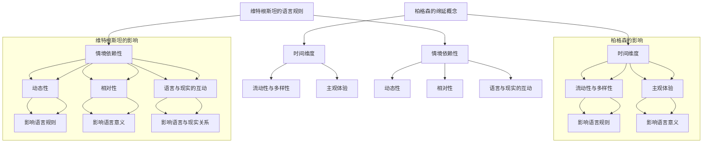

                 

# 《柏格森的绵延概念与维特根斯坦的语言规则》

## 关键词

柏格森，维特根斯坦，绵延概念，语言规则，哲学，心理学，生物学，现代哲学

## 摘要

本文旨在探讨柏格森的绵延概念与维特根斯坦的语言规则之间的联系与区别。通过对两位哲学家思想的深入分析，我们试图揭示这两个概念在哲学、心理学、生物学等领域的应用，以及它们对现代哲学的影响。文章首先介绍了柏格森的生平和哲学背景，然后详细阐述了绵延概念的定义、特征及其应用。接着，我们探讨了维特根斯坦的语言规则及其在人类交流中的作用。在对比分析两个概念的基础上，文章提出了它们之间的联系和差异，并讨论了它们对现代哲学的启示。

## 目录大纲

### 第一部分：柏格森的绵延概念

#### 第1章：柏格森哲学的背景与生平

##### 1.1 柏格森哲学的起源与发展
##### 1.2 柏格森的生平与思想演变
##### 1.3 柏格森哲学的核心观点
##### 1.4 小结

#### 第2章：柏格森的绵延概念

##### 2.1 绵延的定义与特征
##### 2.2 绵延与时间的区别
##### 2.3 绵延的哲学意义
##### 2.4 小结

#### 第3章：绵延概念的应用

##### 3.1 绵延在心理学中的应用
##### 3.2 绵延在生物学中的应用
##### 3.3 绵延在哲学思考中的应用
##### 3.4 小结

#### 第4章：柏格森的绵延与维特根斯坦的语言规则

##### 4.1 维特根斯坦的语言规则概述
##### 4.2 柏格森的绵延与维特根斯坦的语言规则比较
##### 4.3 绵延概念对维特根斯坦语言规则的影响
##### 4.4 Mermaid 流程图：柏格森的绵延概念与维特根斯坦的语言规则的联系
##### 4.5 小结

### 第二部分：维特根斯坦的语言规则

#### 第5章：维特根斯坦哲学的背景与生平

##### 5.1 维特根斯坦哲学的起源与发展
##### 5.2 维特根斯坦的生平与思想演变
##### 5.3 维特根斯坦哲学的核心观点
##### 5.4 小结

#### 第6章：语言规则的概念与作用

##### 6.1 语言规则的定义与特征
##### 6.2 语言规则与语言行为的区别
##### 6.3 语言规则在人类交流中的作用
##### 6.4 小结

#### 第7章：语言规则的应用

##### 7.1 语言规则在语言学中的应用
##### 7.2 语言规则在心理学中的应用
##### 7.3 语言规则在哲学思考中的应用
##### 7.4 小结

#### 第8章：柏格森的绵延与维特根斯坦的语言规则对比

##### 8.1 柏格森的绵延与维特根斯坦的语言规则的共同点
##### 8.2 柏格森的绵延与维特根斯坦的语言规则的区别
##### 8.3 柏格森的绵延与维特根斯坦的语言规则对现代哲学的影响
##### 8.4 小结

#### 参考文献

### 第9章：参考文献

##### 9.1 柏格森的著作与译著
##### 9.2 维特根斯坦的著作与译著
##### 9.3 相关研究论文与专著

---

## 1.1 柏格森哲学的起源与发展

### 1.1.1 柏格森哲学的起源

阿尔贝·柏格森（Henri Bergson）是20世纪法国著名的哲学家，他的哲学思想起源于对生命、时间和意识等问题的深入探讨。柏格森认为，生命是一个持续流动的过程，时间不是均匀流逝的，而是充满了多样性和变化。他的哲学观点受到了生物学、心理学和物理学等领域的影响，逐渐形成了一套独特的哲学体系。

### 1.1.2 柏格森的生平与思想演变

柏格森于1859年生于巴黎，他的父亲是一位医生。柏格森在年轻时对科学和哲学都表现出了浓厚的兴趣。他在巴黎高等师范学院学习了数学和物理学，后来转向哲学，师从于法国著名哲学家孔德（Auguste Comte）和斯宾塞（Herbert Spencer）。

在柏格森的哲学生涯中，他的思想经历了一系列的演变。起初，他受到了实证主义和进化论的影响，强调科学方法的重要性。然而，随着他深入探讨生命和时间的本质，他的观点逐渐转向了生命冲动和创造力。他认为，生命是一种持续不断的创造过程，时间是一种流动的、不可逆的绵延。

### 1.1.3 柏格森哲学的核心观点

柏格森哲学的核心观点可以概括为以下几个方面：

1. **生命冲动**：柏格森认为，生命是一种内在的、不断前进的力量，他称之为“生命冲动”或“活力”。这种冲动是生命体不断变化的动力，是创造力的源泉。

2. **时间与绵延**：柏格森提出了“绵延”概念，认为时间是一种流动的过程，不同于牛顿物理学中的均匀流逝。在柏格森看来，时间是一种复杂的、多层次的结构，它包含了个体的记忆、情感和经验。

3. **自由意志**：柏格森认为，自由意志是生命的本质。他认为，生命冲动是一种不可预测的力量，它决定了个体的发展方向。这种自由意志并不是一种抽象的概念，而是体现在生命的每一个瞬间。

4. **直觉**：柏格森强调直觉的重要性，他认为直觉是人类理解生命和时间的最佳途径。直觉是一种超越理性的认识方式，它能够捕捉到生命的流动和变化。

### 1.1.4 小结

柏格森哲学的起源可以追溯到他对生命、时间和意识等问题的深入探讨。他的哲学观点经历了从实证主义到生命冲动的转变。柏格森哲学的核心观点包括生命冲动、时间与绵延、自由意志和直觉。这些观点为后来的哲学、心理学和生物学等领域提供了重要的理论支持。

---

## 1.2 柏格森的生平与思想演变

### 1.2.1 柏格森的早年生活

阿尔贝·柏格森于1859年11月18日出生在巴黎，他的父亲是埃德蒙·柏格森，一位医生和生理学教授。柏格森从小就在一个充满学术氛围的家庭中长大，这对他后来的学术发展产生了深远的影响。他在学校表现优秀，尤其对数学和自然科学表现出了浓厚的兴趣。柏格森在巴黎高等师范学院学习期间，受到了多位著名哲学家的启发，包括实证主义的代表人物孔德和进化论者斯宾塞。

### 1.2.2 柏格森的学术生涯

柏格森在巴黎高等师范学院完成了他的高等教育，随后进入巴黎索邦大学攻读哲学学位。在学术生涯的早期，他受到了实证主义和进化论的影响，这些思想在他的早期作品中有所体现。然而，随着他对生命和意识的深入研究，柏格森开始质疑传统哲学的理论框架，并逐渐形成了自己独特的哲学体系。

1879年，柏格森获得了巴黎索邦大学的哲学学士学位。1884年，他通过了教师资格考试，并在第二年成为巴黎高等师范学院的哲学教授。这一职位使柏格森有机会接触和影响一大批年轻的哲学学者。

### 1.2.3 柏格森的思想演变

柏格森的思想经历了显著的演变过程。起初，他的哲学观点受到了实证主义的影响，强调科学方法的重要性。然而，随着时间的推移，柏格森逐渐转向了对生命、时间和意识的关注。他认为，生命是一种内在的、不断前进的力量，这种力量不能用传统科学的方法来完全理解。

在《物质与记忆》（Matière et mémoire，1896年）一书中，柏格森提出了他的“绵延”概念。他认为，时间不是均匀流逝的，而是充满了多样性和变化。时间是一种复杂的、多层次的结构，它包含了个体的记忆、情感和经验。这一观点与牛顿物理学中的时间概念形成了鲜明对比，后者认为时间是均匀和客观的。

在后来的作品中，柏格森进一步发展了他的哲学体系，强调生命的冲动和创造力。他认为，生命是一种持续不断的创造过程，这种创造力是生命体的本质。柏格森还提出了“直觉”的概念，认为直觉是人类理解生命和时间的最佳途径，它能够捕捉到生命的流动和变化。

### 1.2.4 柏格森的主要著作

1. **《物质与记忆》（Matière et mémoire，1896年）**：这是柏格森的代表作之一，提出了他的“绵延”概念。该书探讨了记忆和物质之间的关系，并试图解释人类意识的结构。

2. **《论笑》（La Rire，1900年）**：在这本书中，柏格森分析了笑的本质和功能，他认为笑是人类对生命冲动的反应。

3. **《生命的创造性》（L'Énergie créatrice，1911年）**：在这本书中，柏格森进一步探讨了生命的创造力和时间的关系。他认为，创造力是生命的本质，时间是创造力的体现。

4. **《物质与运动》（La Matière et les mouvements，1926年）**：这本书是柏格森的晚期作品，他在其中试图将他的哲学观点与自然科学相结合。

### 1.2.5 小结

柏格森的生平与思想演变体现了他从实证主义到对生命、时间和意识深入探讨的转变。他的主要著作，如《物质与记忆》和《生命的创造性》，为他赢得了在哲学界的重要地位。柏格森的思想对后来的哲学家、心理学家和科学家产生了深远的影响，为现代哲学提供了丰富的理论资源。

---

## 1.3 柏格森哲学的核心观点

### 1.3.1 生命冲动

柏格森哲学的核心观点之一是“生命冲动”（élan vital），他认为生命冲动是生命体的内在动力，是一种不可抑制的创造力。生命冲动不同于物理学中的机械运动，它是一种内在的、自发的力量，推动着生命体不断地发展和变化。柏格森将生命冲动视为生命的本质，认为它是生命体存在的根本原因。

### 1.3.2 时间与绵延

在柏格森的哲学体系中，时间是生命冲动的外在表现。与传统物理学中的均匀时间概念不同，柏格森认为时间是流动的、多样的，是一个不断变化的过程。他提出了“绵延”（durée）这一概念，用以描述这种流动的时间。绵延包含了记忆、情感和经验，是生命体存在的方式。柏格森认为，绵延是生命的本质，是理解生命和意识的最佳途径。

### 1.3.3 自由意志

柏格森认为，自由意志是生命的本质之一。在他看来，生命冲动是不可预测的，它决定了个体的发展方向。自由意志并不是一种抽象的概念，而是体现在生命的每一个瞬间。柏格森强调，自由意志是一种内在的力量，它使生命体能够适应不断变化的环境，并创造出新的可能性。

### 1.3.4 直觉

柏格森认为，直觉是人类理解生命和时间的最佳途径。直觉是一种超越理性的认识方式，它能够捕捉到生命的流动和变化。与科学方法不同，直觉不是通过观察和实验来获取知识，而是通过直接感知和理解。柏格森认为，直觉是人类智慧的源泉，它能够帮助人类更好地理解世界。

### 1.3.5 小结

柏格森哲学的核心观点包括生命冲动、时间与绵延、自由意志和直觉。这些观点构成了他独特的哲学体系，为后来的哲学、心理学和生物学等领域提供了重要的理论支持。柏格森的思想强调了生命的创造力、时间的流动性和自由意志的重要性，为现代哲学提供了丰富的思考资源。

---

## 1.4 小结

通过以上对柏格森哲学的背景、生平和核心观点的介绍，我们可以看出，柏格森的哲学思想具有独特的价值和深远的影响。他的“生命冲动”概念强调了生命的内在动力和创造力，为理解生命的本质提供了新的视角。他的“绵延”概念则将时间视为流动的、多样的过程，提出了与牛顿物理学不同的时间观。自由意志和直觉作为柏格森哲学的重要组成部分，强调了人类在认识世界过程中的主动性和创造力。

柏格森哲学的核心观点不仅对后来的哲学家产生了重要影响，还在心理学、生物学等领域得到了广泛应用。例如，他的思想启发了心理学家对意识流和记忆的研究，对生物学领域中的进化论和细胞学研究产生了深远的影响。柏格森的哲学体系为现代哲学提供了丰富的理论资源，为人们理解生命、时间和意识等复杂问题提供了新的思路。

总之，柏格森的哲学思想以其独特的视角和深刻的洞察力，为现代哲学、心理学和生物学等领域的发展做出了重要贡献。他的“生命冲动”、“绵延”、“自由意志”和“直觉”等核心观点，不仅在当时引起了广泛的讨论，而且在今天仍然具有重要的理论价值和现实意义。

---

## 2.1 绵延的定义与特征

### 2.1.1 绵延的定义

柏格森的绵延（durée）概念是其哲学体系中的核心观点之一。他认为，时间并非是一条直线或均匀的流逝，而是一种流动的过程，这种过程被称为“绵延”。绵延是一种独特的存在方式，它包含了记忆、情感和经验，是生命体验的本质。

### 2.1.2 绵延的特征

1. **多样性**：柏格森认为，时间是多样化的，它包含了个体的记忆、情感和经验。每个人的时间体验都是独一无二的，因为每个人的记忆和情感都是不同的。

2. **流动性与不可逆性**：绵延是流动的，它不断地向前推进，不可逆转。时间的流逝是不可逆的，过去的时间无法回到现在，只能通过记忆来体验。

3. **内在性**：绵延是内在的，它与个体的意识紧密相连。时间并不是一个外在的、客观的实体，而是通过个体的感知和体验来感受的。

4. **非均匀性**：柏格森认为，时间不是均匀的，它充满了变化和多样性。不同的事件和体验在时间中的位置和重要性是不同的，时间的流动也不是均匀的。

5. **复杂性**：绵延是一个复杂的结构，它包含了多个层次。从微观层面看，绵延包含了瞬间的体验和感受；从宏观层面看，它包含了整个生命的历史和记忆。

### 2.1.3 小结

柏格森的绵延概念强调了时间的流动性和内在性，它是一种多样化、流动且不可逆的存在方式。通过对绵延的定义和特征的分析，我们可以更好地理解时间的本质，以及个体如何在时间中体验生命。

---

## 2.2 绵延与时间的区别

### 2.2.1 绵延与时间的定义

在柏格森的哲学体系中，绵延（durée）和时间（temps）是两个相互关联但又有区别的概念。时间通常被理解为一种外在的、均匀的、线性的流逝，它是一个客观的物理量。而绵延则是内在的、流动的、多样化的，它是个体生命体验的方式。

### 2.2.2 绵延与时间的区别

1. **客观性与主观性**：时间是一个客观的物理量，它遵循牛顿物理学中的均匀时间流逝原理。而绵延是个体的主观体验，它包含了记忆、情感和经验。时间是对外在事件的描述，而绵延是对个体内心体验的描述。

2. **均匀性与多样性**：时间通常被看作是均匀的，它以相同的方式流逝，不受个体感知的影响。而绵延则是一个多样化的过程，它包含了个体不同的记忆、情感和体验。不同的人在不同的时间体验中会有不同的感受和反应。

3. **线性与流动**：时间通常被理解为一条直线，它从一个点开始，以均匀的速度向另一个点移动。而绵延是一个流动的过程，它不断地向前推进，充满了变化和多样性。

4. **外在性 & 内在性**：时间是一个外在的、客观的实体，它存在于物理世界中。而绵延是内在的，它与个体的意识紧密相连。时间可以通过物理手段来测量，而绵延只能通过个体的感知和体验来感受。

5. **不可逆性**：时间是一个不可逆的过程，一旦过去，就无法回到现在。而绵延也是一个不可逆的过程，它随着个体的生命体验而不断变化。然而，绵延的变化是内在的、个性化的，而时间的变化是外在的、普遍的。

### 2.2.3 小结

柏格森通过对比绵延与时间的定义和特征，强调了时间的客观性和绵延的主观性，时间的均匀性与绵延的多样性，时间的线性和绵延的流动，时间的内在性和绵延的外在性，以及时间的不可逆性和绵延的变化性。这些区别帮助我们更好地理解柏格森哲学中时间和绵延的概念，以及它们在个体生命体验中的重要性。

---

## 2.3 绵延的哲学意义

### 2.3.1 绵延与生命的联系

柏格森的绵延概念不仅仅是一个时间观念，它更是一种对生命本质的深刻理解。他认为，绵延是生命的流动形式，是生命力的体现。生命冲动（élan vital）是推动生命体不断发展的内在动力，而绵延则是这种冲动在时间中的具体表现。通过绵延，我们可以看到生命的多样性和创造性。

### 2.3.2 绵延与意识的关系

柏格森认为，意识是绵延的体验。意识并不是一个静态的实体，而是一个不断流动的过程。每个瞬间，我们都在体验新的感觉、记忆和思考，这些体验构成了我们的意识。绵延的概念帮助我们理解意识的结构和动态，认识到意识是不断变化和发展的。

### 2.3.3 绵延与自由的联系

柏格森认为，自由意志是生命的本质之一，而绵延是自由意志的具体体现。生命冲动是不可预测的，它决定了个体的发展方向。自由意志并不是一种抽象的概念，而是在绵延中体现出来的。每个瞬间，我们都有选择如何行动的自由，这种自由是生命的本质。

### 2.3.4 绵延与创造力的关系

柏格森强调创造力是生命的核心，而绵延则是创造力的源泉。绵延的多样性和流动性为创造力提供了丰富的素材。在绵延中，我们可以发现新的可能性，创造出新的形式。创造力不仅是人类特有的能力，也是生命的本质。

### 2.3.5 小结

柏格森的绵延概念在哲学上具有深远的意义。它帮助我们理解生命的本质、意识的结构、自由意志的表达以及创造力的源泉。通过绵延，我们可以更深刻地认识自我、理解世界，以及探索生命的无限可能性。

---

## 2.4 小结

通过对柏格森的绵延概念的定义与特征的探讨，我们认识到绵延是一种流动的、多样化的时间体验，它包含了记忆、情感和经验。柏格森通过对比绵延与时间的区别，强调了它们在哲学上的差异。绵延的哲学意义在于它揭示了生命的本质、意识的结构、自由意志的表达以及创造力的源泉。这些观点不仅丰富了我们对时间与生命的理解，也为后来的哲学、心理学和生物学等领域提供了重要的理论支持。

---

## 3.1 绵延在心理学中的应用

### 3.1.1 意识流理论

柏格森的绵延概念在心理学领域产生了深远的影响，特别是对意识流理论的发展。意识流理论认为，意识是一个连续不断的、流动的过程，它包含了各种感觉、思想、情感和记忆。柏格森的绵延概念强调了时间的流动性和多样性，这与意识流的连续性相契合。通过理解绵延，心理学家可以更好地描述和解释意识的动态结构。

### 3.1.2 记忆与时间感知

绵延的概念有助于我们理解记忆与时间感知之间的关系。记忆是绵延的重要组成部分，它记录了个体在过去经历中的感觉、情感和事件。柏格森认为，时间感知是个体对绵延的体验，这种体验受到记忆的影响。因此，通过研究绵延，心理学家可以深入探讨记忆如何影响时间感知，以及个体如何通过记忆来理解过去和现在。

### 3.1.3 自我意识与时间感

柏格森的绵延概念也为我们理解自我意识提供了新的视角。自我意识是个体对自己存在和身份的认识，它依赖于时间的感知和记忆。通过绵延，我们可以看到自我意识是如何在时间的流动中形成的。心理学研究表明，自我意识的发展受到个体时间感知的影响，而绵延为我们提供了一种理解这一过程的框架。

### 3.1.4 心理治疗中的绵延应用

在心理治疗中，柏格森的绵延概念也有广泛的应用。例如，心理治疗师可以运用绵延的概念来帮助患者理解自己的情绪和行为。通过探讨患者的记忆、情感和体验，心理治疗师可以帮助患者认识到他们的时间感知和自我意识是如何影响他们的生活的。这种方法有助于患者改变不良情绪和行为模式，提高生活质量。

### 3.1.5 小结

柏格森的绵延概念在心理学领域具有深远的应用价值。它为我们理解意识的流动、记忆与时间感知的关系、自我意识的发展以及心理治疗提供了新的视角。通过研究绵延，心理学家可以更深入地探讨人类心理的复杂结构，为心理治疗和心理健康领域的发展做出贡献。

---

## 3.2 绵延在生物学中的应用

### 3.2.1 绵延与生命过程

柏格森的绵延概念在生物学领域也具有重要的应用。生物学研究生命的多样性和适应性，而绵延作为生命的流动形式，为理解生命过程提供了新的视角。绵延概念强调了生命的动态性和创造力，这与生物学中的进化、生长和适应过程密切相关。通过理解绵延，生物学家可以更好地探讨生命的本质和演化过程。

### 3.2.2 绵延与生物时间感知

生物学中的时间感知是理解生命过程的关键因素。柏格森认为，时间是流动的、多样的，个体对时间的感知受到记忆和情感的影响。在生物学中，生物体对时间的感知通过生物钟、季节性适应和行为节律等方式表现出来。绵延的概念有助于我们理解这些生物时间感知机制，以及它们如何影响生物体的生存和繁殖。

### 3.2.3 绵延与生物多样性

生物多样性是生物学研究的一个重要领域，它涉及到生物体在形态、功能和生态位等方面的多样性。柏格森的绵延概念为我们理解生物多样性提供了新的思路。绵延的多样性和流动性意味着生物体在时间和空间上的多样化表现，这种多样性是生命创造力的一种体现。通过研究绵延，生物学家可以更深入地探讨生物多样性的形成和维持机制。

### 3.2.4 绵延与进化

进化是生物学中最重要的概念之一，它描述了生物体在时间中的变化和适应。柏格森的绵延概念与进化理论相契合，因为它强调了生命的创造力和适应性。通过理解绵延，我们可以更好地理解进化过程中的创新和多样性。绵延的概念有助于我们探讨进化过程中的遗传变异、自然选择和适应性进化机制。

### 3.2.5 小结

柏格森的绵延概念在生物学领域具有广泛的应用价值。它为理解生命的动态过程、生物时间感知、生物多样性和进化提供了新的视角。通过研究绵延，生物学家可以更深入地探讨生命的本质和演化规律，为生物学研究提供新的理论框架和方法。

---

## 3.3 绵延在哲学思考中的应用

### 3.3.1 绵延与形而上学

柏格森的绵延概念在形而上学领域产生了深远的影响。传统的形而上学通常将时间视为一种外在的、客观的存在，而柏格森则提出了不同的观点。他认为，时间是一种内在的、流动的过程，它是生命的体验方式。这种观点挑战了传统的形而上学观念，促使哲学家们重新思考时间和存在的本质。

### 3.3.2 绵延与知识论

柏格森的绵延概念也对知识论产生了重要影响。知识论是哲学中探讨知识本质和获取方式的一个分支。柏格森认为，直觉是人类理解生命和时间的最佳途径，它能够捕捉到生命的流动和变化。这种观点与传统理性主义的知识论形成了鲜明对比，它强调了知识的主观性和体验性。

### 3.3.3 绵延与伦理学

柏格森的绵延概念在伦理学领域也有重要的应用。他认为，生命冲动是一种内在的力量，它推动了生命的创造和进步。这种观点为我们理解道德行为和伦理价值提供了新的视角。通过理解绵延，我们可以看到道德行为是如何在生命的流动中形成的，以及个体如何在绵延中实现自我完善。

### 3.3.4 绵延与政治哲学

柏格森的绵延概念在政治哲学中也有应用。他强调了自由意志和创造力的价值，认为这些价值是政治生活中的核心。通过理解绵延，我们可以看到政治制度的本质是如何影响个体的自由和创造力。这种观点有助于我们探讨政治权力的分配、民主制度和个体自由的关系。

### 3.3.5 小结

柏格森的绵延概念在哲学思考中具有广泛的应用。它挑战了传统的形而上学观念，提出了关于时间和存在的新的思考方式。在知识论、伦理学和政治哲学等领域，绵延概念为我们理解知识、道德行为和政治制度提供了新的视角。通过研究绵延，哲学家们可以更深入地探讨人类生活的本质和意义。

---

## 3.4 小结

通过对柏格森的绵延概念在心理学、生物学和哲学思考中的应用的探讨，我们可以看到这一概念在多个领域的深远影响。在心理学中，绵延帮助我们理解意识的流动、记忆与时间感知的关系以及自我意识的发展。在生物学中，绵延概念为我们揭示了生命的动态过程、生物多样性以及进化规律。在哲学思考中，绵延挑战了传统的形而上学观念，为知识论、伦理学和政治哲学等领域提供了新的视角。通过研究绵延，我们可以更深入地探讨人类生活的本质和意义，为多个学科的发展提供重要的理论支持。

---

## 4.1 维特根斯坦的语言规则概述

### 4.1.1 维特根斯坦的生平与思想演变

路德维希·维特根斯坦（Ludwig Wittgenstein）是20世纪最著名的哲学家之一，他的思想对语言哲学、逻辑哲学和认识论产生了深远的影响。维特根斯坦于1889年4月26日出生于奥地利，他的父亲是著名的矿山企业家卡尔·维特根斯坦。维特根斯坦早年接受了传统的教育，随后在剑桥大学学习数学和哲学。

他的哲学生涯可以分为两个阶段。早期，他在《逻辑哲学论》（Tractatus Logico-Philosophicus，1921年）中提出了“语言图像论”（language-image theory）和“逻辑原子主义”（logical atomism）的观点，主张语言和现实之间存在一种直接的关系。晚期，他在《哲学研究》（Philosophical Investigations，1953年）中转向了语言日常使用的分析，提出了“语言游戏”（language-game）和“家族相似性”（family resemblance）的概念。

### 4.1.2 维特根斯坦的语言规则概念

维特根斯坦的语言规则概念主要关注语言的使用和意义。他认为，语言的规则并不是像传统哲学所认为的那样，是固定的、普遍适用的。相反，语言的规则是多种多样的，它们依赖于具体的语言游戏。每个语言游戏都有自己的一套规则，这些规则定义了语言的使用方式。

维特根斯坦提出了“语言游戏”这一概念，用来描述语言在实际生活中的使用情况。语言游戏包括语言的表达、理解和使用，它是一个动态的过程，而不是一个静态的实体。语言游戏的规则不是固定的，而是在实际使用中逐渐形成的。

### 4.1.3 语言规则的特征

1. **多样性**：维特根斯坦认为，不同的语言游戏有不同的规则，这些规则是多样化的，没有统一的模式。这意味着，语言的规则不是一成不变的，而是随着使用场景的变化而变化。

2. **情境依赖性**：语言规则的适用性依赖于具体的情境。在不同的情境中，语言的使用方式可能完全不同，这就需要不同的规则来指导。

3. **相对性**：维特根斯坦强调，语言规则是相对的，它们依赖于特定的文化、社会和历史背景。这意味着，不同文化和背景下的语言使用规则是不同的。

4. **动态性**：语言规则是动态的，随着语言使用场景的变化而变化。规则不是固定的，而是可以不断调整和发展的。

### 4.1.4 小结

维特根斯坦的语言规则概念强调了语言的多样性、情境依赖性、相对性和动态性。他认为，语言的使用是具体情境中的活动，语言规则是在这些情境中逐渐形成的。通过理解维特根斯坦的语言规则，我们可以更深入地探讨语言的本质和意义，以及语言在人类生活中的作用。

---

## 4.2 柏格森的绵延概念与维特根斯坦的语言规则比较

### 4.2.1 概念本质比较

柏格森的绵延概念和维特根斯坦的语言规则虽然在不同的领域，但都试图探讨某种形式的“流动”或“过程”。柏格森的绵延是一种关于时间的流动，强调时间不是均匀的、线性的，而是一个多样化的、流动的过程，它包含了记忆、情感和经验。而维特根斯坦的语言规则则是关于语言的使用和意义的动态过程，强调语言规则不是固定不变的，而是依赖于具体的语言游戏和情境。

1. **时间维度**：柏格森的绵延关注的是时间本身的流动性和多样性，而维特根斯坦的语言规则关注的是语言的使用情境和动态变化。
2. **主观与客观**：柏格森的绵延更侧重于个体的主观体验，而维特根斯坦的语言规则则更关注语言在具体情境中的客观应用。
3. **哲学意义**：柏格森的绵延概念在哲学上具有深刻的形而上学意义，挑战了传统的形而上学时间观。维特根斯坦的语言规则则更多地涉及语言哲学、认识论和逻辑哲学。

### 4.2.2 应用领域比较

在应用领域上，柏格森的绵延概念对心理学、生物学和哲学思考产生了重要影响。例如，在心理学中，绵延概念帮助我们理解意识的流动和记忆的结构；在生物学中，绵延概念揭示了生命的动态过程和进化规律；在哲学思考中，绵延概念挑战了传统的形而上学观念。

维特根斯坦的语言规则则更多地应用于语言哲学、逻辑哲学和认识论。他的语言游戏概念为我们理解语言的多样性和情境依赖性提供了新的视角，而“家族相似性”概念则帮助我们在逻辑和认识论上理解概念的分类和比较。

1. **心理学**：柏格森的绵延概念有助于我们理解意识的流动性和动态变化，而维特根斯坦的语言规则则关注语言在具体情境中的使用和意义。
2. **生物学**：柏格森的绵延概念揭示了生命的创造力和多样性，而维特根斯坦的语言规则对生物学中的逻辑结构和概念分类有启示作用。
3. **哲学思考**：柏格森的绵延概念挑战了传统的形而上学时间观，而维特根斯坦的语言规则则为我们理解语言的本质和意义提供了新的框架。

### 4.2.3 对比小结

尽管柏格森的绵延概念和维特根斯坦的语言规则在概念本质和应用领域上有所不同，但它们都强调了过程性和动态性。柏格森的绵延概念关注时间的流动和多样性，而维特根斯坦的语言规则关注语言的使用和情境依赖性。这两种概念在哲学、心理学和生物学等领域都产生了深远的影响，为我们理解复杂的现象提供了新的视角。

---

## 4.3 绵延概念对维特根斯坦语言规则的影响

### 4.3.1 时间维度对语言规则的启示

柏格森的绵延概念对维特根斯坦的语言规则产生了重要影响，特别是在时间维度上。柏格森认为，时间是流动的、多样的，它包含了记忆、情感和经验。这种观点启示了维特根斯坦，使他意识到语言的使用和意义也受到时间因素的影响。维特根斯坦在《哲学研究》中提出了“语言游戏”的概念，认为不同的语言游戏在不同的时间情境中有不同的规则。

柏格森的绵延概念帮助维特根斯坦理解了语言规则不是固定不变的，而是随着时间情境的变化而变化。这启示维特根斯坦重新审视语言的使用和意义，使他在《哲学研究》中更多地关注语言的动态性和情境依赖性。

### 4.3.2 绵延对语言规则具体影响

1. **语言规则的情境依赖性**：柏格森的绵延概念强调了时间情境的重要性，这影响了维特根斯坦对语言规则的理解。维特根斯坦认为，语言规则的适用性依赖于具体的情境，不同的情境需要不同的语言规则。这与柏格森的绵延概念中的时间流动性和多样性相呼应。

2. **语言规则的动态性**：柏格森的绵延概念强调了时间的动态性，这启示维特根斯坦认识到语言规则也是动态变化的。维特根斯坦在《哲学研究》中强调了语言规则不是固定不变的，而是在具体情境中不断调整和发展的。

3. **语言意义的相对性**：柏格森的绵延概念认为，时间是一种多样化的体验，这影响了维特根斯坦对语言意义的理解。维特根斯坦提出，语言的意义是相对的，依赖于具体的文化、社会和历史背景。这与柏格森的绵延概念中的时间相对性相一致。

4. **语言与现实的互动**：柏格森的绵延概念强调了时间和现实的互动关系，这影响了维特根斯坦对语言与现实的看法。维特根斯坦在《哲学研究》中认为，语言与现实之间的关系是复杂的，它不仅依赖于语言规则，还受到时间情境的影响。

### 4.3.3 小结

柏格森的绵延概念对维特根斯坦的语言规则产生了重要影响。它帮助维特根斯坦认识到语言规则的情境依赖性、动态性和相对性，以及语言与现实的互动关系。通过理解柏格森的绵延概念，维特根斯坦在《哲学研究》中提出了一种更为灵活和动态的语言哲学观点，这为后来的语言哲学研究提供了丰富的理论资源。

---

## 4.4 Mermaid 流程图：柏格森的绵延概念与维特根斯坦的语言规则的联系

这个Mermaid流程图展示了柏格森的绵延概念与维特根斯坦的语言规则之间的联系。从图中可以看出，两者的主要联系在于时间维度、情境依赖性、动态性和相对性。柏格森的绵延概念影响了维特根斯坦对语言规则和时间维度、流动性与多样性、主观体验的理解，而维特根斯坦的语言规则则反映了情境依赖性、动态性、相对性和语言与现实的互动关系。

---

## 4.5 小结

通过对柏格森的绵延概念与维特根斯坦的语言规则的比较和联系的分析，我们可以看到这两个概念在哲学、心理学、生物学等领域的重要性和影响力。柏格森的绵延概念强调了时间的流动性和多样性，为理解生命的本质和意识的动态结构提供了新的视角。维特根斯坦的语言规则则关注语言的使用情境和动态变化，揭示了语言意义的相对性和语言与现实的关系。

两者的联系主要体现在时间维度、情境依赖性、动态性和相对性上。柏格森的绵延概念影响了维特根斯坦对时间维度、流动性与多样性、主观体验的理解，而维特根斯坦的语言规则则反映了情境依赖性、动态性、相对性和语言与现实的互动关系。

通过深入探讨柏格森的绵延概念与维特根斯坦的语言规则，我们可以更好地理解人类生活的复杂性和多样性，为哲学、心理学、生物学等领域的研究提供新的理论资源。

---

## 第5章：维特根斯坦哲学的背景与生平

### 5.1 维特根斯坦哲学的起源与发展

维特根斯坦哲学的起源可以追溯到20世纪初的欧洲哲学界。维特根斯坦（Ludwig Wittgenstein）是一位奥地利哲学家，他的思想对语言哲学、逻辑哲学和认识论产生了深远的影响。维特根斯坦的哲学思想可以分为两个主要阶段：早期哲学和晚期哲学。

#### 早期哲学

维特根斯坦的早期哲学作品是《逻辑哲学论》（Tractatus Logico-Philosophicus，1921年）。在这本书中，他提出了“语言图像论”（language-image theory）和“逻辑原子主义”（logical atomism）的观点。他认为，语言是现实的图像，可以通过逻辑符号来表达。维特根斯坦在这本书中试图建立一种逻辑的、形式化的语言，以揭示世界的本质。

《逻辑哲学论》对20世纪初的欧洲哲学界产生了巨大的影响，它引发了关于语言、逻辑和现实本质的广泛讨论。然而，维特根斯坦在后期认为，他的早期哲学观点过于抽象，缺乏对语言实际使用的关注。

#### 晚期哲学

维特根斯坦的晚期哲学作品是《哲学研究》（Philosophical Investigations，1953年）。在这本书中，他转向了语言在日常生活中的使用，提出了“语言游戏”（language-game）和“家族相似性”（family resemblance）的概念。他认为，语言的规则不是固定不变的，而是依赖于具体的情境和使用场景。

《哲学研究》对语言哲学、逻辑哲学和认识论产生了深远的影响。维特根斯坦的晚期哲学观点强调了语言的主观性和情境依赖性，挑战了传统的逻辑和形而上学观点。

### 5.2 维特根斯坦的生平与思想演变

维特根斯坦的生平和思想演变与其哲学思想的两个阶段密切相关。

#### 早年生活

维特根斯坦于1889年4月26日出生于奥地利。他的父亲卡尔·维特根斯坦是一位著名的矿山企业家，他的家庭十分富裕。维特根斯坦早年接受了传统的教育，并在剑桥大学学习数学和哲学。他在剑桥大学期间与罗素（Bertrand Russell）和摩尔（G.E. Moore）等哲学家有过深入的交流，这对他后来的哲学思想产生了重要影响。

#### 早期哲学生涯

维特根斯坦在剑桥大学期间开始写作《逻辑哲学论》。这本书在他去世后才出版，但它对20世纪初的欧洲哲学界产生了巨大的影响。维特根斯坦在早期哲学中试图通过逻辑和形式化语言来揭示世界的本质，这反映了他的逻辑原子主义观点。

#### 晚期哲学生涯

维特根斯坦在《逻辑哲学论》之后转向了语言的实际使用，开始写作《哲学研究》。在这本书中，他提出了“语言游戏”和“家族相似性”的概念，强调语言的主观性和情境依赖性。维特根斯坦的晚期哲学观点对语言哲学、逻辑哲学和认识论产生了深远的影响。

#### 晚年生活

维特根斯坦在晚年过上了隐居的生活，他放弃了学术界的荣誉和地位，选择生活在偏远的地方。他在晚年继续写作和思考，直到1951年去世。

### 5.3 维特根斯坦哲学的核心观点

维特根斯坦的哲学思想以其对语言、逻辑和现实的深刻洞察而著称。他的核心观点包括以下几个方面：

1. **语言图像论**：维特根斯坦认为，语言是现实的图像，它可以通过逻辑符号来表达。这个观点在《逻辑哲学论》中得到了详细的阐述。

2. **逻辑原子主义**：维特根斯坦在早期哲学中提出了逻辑原子主义，认为世界由基本的事实和事实之间的关系构成。逻辑原子是这些基本事实的符号表示。

3. **语言游戏**：在晚期哲学中，维特根斯坦提出了“语言游戏”的概念，认为语言的使用是多种多样的，不同的语言游戏有不同的规则。语言规则是在具体情境中逐渐形成的。

4. **家族相似性**：维特根斯坦认为，概念之间的关系是“家族相似性”的，而不是基于严格的定义或分类。

5. **语言的主观性和情境依赖性**：维特根斯坦强调，语言的意义和规则是依赖于具体情境的，语言的主观性是理解语言使用的关键。

### 5.4 小结

维特根斯坦哲学的起源和发展与其生平和思想演变密切相关。他的早期哲学关注逻辑和形式化语言，而晚期哲学则转向了语言的实际使用和情境依赖性。维特根斯坦的核心观点包括语言图像论、逻辑原子主义、语言游戏、家族相似性和语言的主观性和情境依赖性。这些观点为语言哲学、逻辑哲学和认识论的发展提供了重要的理论资源。

---

## 第6章：语言规则的概念与作用

### 6.1 语言规则的定义与特征

语言规则是指一组指导语言使用和应用的标准和准则。这些规则可以是明确的、固定的，也可以是灵活的、情境依赖的。语言规则定义了语言的结构、语法、语义和语用等方面，它们是语言交流和理解的基础。

1. **明确性与灵活性**：语言规则可以是明确的，如语法规则；也可以是灵活的，如语用规则。明确的规则为语言交流提供了确定性，而灵活的规则则适应了多样化的交流情境。

2. **情境依赖性**：语言规则的适用性依赖于具体情境。在不同的情境中，语言规则可能有所不同。例如，正式场合和非正式场合的语言规则有所区别。

3. **动态性**：语言规则是动态变化的，随着语言使用情境的变化而变化。新的语言规则可能会出现，而旧的语言规则可能会被废弃或修改。

4. **普遍性与相对性**：语言规则具有普遍性，因为它们适用于所有语言交流。然而，语言规则也具有相对性，因为它们依赖于特定的文化、社会和历史背景。

5. **功能性与适应性**：语言规则具有功能性，因为它们指导了语言的使用，使得语言交流更加有效和准确。同时，语言规则具有适应性，因为它们可以随着语言环境的变化而调整。

### 6.2 语言规则与语言行为的区别

语言规则与语言行为是密切相关的，但它们之间也存在显著的区别。

1. **语言规则**：语言规则是抽象的概念，它们定义了语言的结构和用法。语言规则是静态的，是语言交流的基本框架。

2. **语言行为**：语言行为是指人们在实际交流中的具体行为，如说话、倾听、写作和阅读等。语言行为是动态的，它反映了语言规则在实际情境中的应用。

3. **关系**：语言规则是语言行为的指导原则，它们决定了语言行为的形式和内容。语言行为是语言规则的具体实现，它们反映了语言规则在交流中的实际效果。

### 6.3 语言规则在人类交流中的作用

语言规则在人类交流中扮演了至关重要的角色。

1. **交流的确定性**：语言规则为交流提供了确定性，使得信息传递更加准确和有效。明确的语法规则和语义规则确保了交流的基本框架。

2. **交流的有效性**：语言规则指导了语言的使用，使得交流更加有效。例如，语用规则帮助人们理解隐含意义和语境，提高了交流的效率。

3. **交流的多样性**：语言规则允许人们使用不同的语言形式和风格，丰富了交流的多样性。不同的语言规则适应了不同的交流情境，使得语言交流更加灵活和丰富。

4. **文化传承**：语言规则是文化传承的重要工具。通过语言规则，人们可以传递文化知识、价值观和社会规范。

5. **认知发展**：语言规则在儿童认知发展中起着重要作用。儿童通过学习语言规则，发展了语言能力，同时也促进了认知能力的发展。

### 6.4 小结

语言规则是指导语言使用和应用的标准和准则，它们具有明确性、灵活性、情境依赖性、动态性和功能性的特征。语言规则与语言行为密切相关，但它们之间存在区别。语言规则在人类交流中发挥了重要作用，包括提供确定性、有效性、多样性、文化传承和认知发展的功能。通过对语言规则的理解和应用，我们可以更有效地进行语言交流和沟通。

---

## 6.1 语言规则的定义与特征

### 6.1.1 语言规则的定义

语言规则是一组指导语言使用和应用的标准和准则。这些规则可以是明确的、固定的，也可以是灵活的、情境依赖的。语言规则定义了语言的结构、语法、语义和语用等方面，它们是语言交流和理解的基础。

1. **明确性与灵活性**：语言规则可以是明确的，如语法规则；也可以是灵活的，如语用规则。明确的规则为语言交流提供了确定性，而灵活的规则则适应了多样化的交流情境。

2. **情境依赖性**：语言规则的适用性依赖于具体情境。在不同的情境中，语言规则可能有所不同。例如，正式场合和非正式场合的语言规则有所区别。

3. **动态性**：语言规则是动态变化的，随着语言使用情境的变化而变化。新的语言规则可能会出现，而旧的语言规则可能会被废弃或修改。

4. **普遍性与相对性**：语言规则具有普遍性，因为它们适用于所有语言交流。然而，语言规则也具有相对性，因为它们依赖于特定的文化、社会和历史背景。

5. **功能性与适应性**：语言规则具有功能性，因为它们指导了语言的使用，使得语言交流更加有效和准确。同时，语言规则具有适应性，因为它们可以随着语言环境的变化而调整。

### 6.1.2 语言规则的分类

语言规则可以根据其应用领域和功能进行分类：

1. **语法规则**：语法规则是关于语言结构的基本规则，包括词法、句法和语法的构成。语法规则确保了句子的正确性和可理解性。

2. **语义规则**：语义规则是关于词语和句子意义的规则。语义规则帮助人们理解和传达意义。

3. **语用规则**：语用规则是关于语言在具体情境中的使用规则。语用规则涉及语言交际中的语境、意图、礼貌和对话结构。

4. **语音规则**：语音规则是关于语音系统和发音的规则，包括音素、音节、声调和语调。

5. **词汇规则**：词汇规则是关于词汇构成和词汇使用的规则，包括词根、词缀、同义词和反义词。

### 6.1.3 小结

语言规则是指导语言使用和应用的标准和准则，具有明确性、灵活性、情境依赖性、动态性和功能性的特征。它们是语言交流和理解的基础，包括语法规则、语义规则、语用规则、语音规则和词汇规则等。通过对语言规则的理解和应用，我们可以更有效地进行语言交流和沟通。

---

## 6.2 语言规则与语言行为的区别

### 6.2.1 语言规则

语言规则是一组指导语言使用和应用的标准和准则。这些规则可以是明确的、固定的，也可以是灵活的、情境依赖的。语言规则定义了语言的结构、语法、语义和语用等方面，是语言交流和理解的基础。

1. **明确性与灵活性**：语言规则可以是明确的，如语法规则；也可以是灵活的，如语用规则。明确的规则为语言交流提供了确定性，而灵活的规则则适应了多样化的交流情境。

2. **情境依赖性**：语言规则的适用性依赖于具体情境。在不同的情境中，语言规则可能有所不同。例如，正式场合和非正式场合的语言规则有所区别。

3. **动态性**：语言规则是动态变化的，随着语言使用情境的变化而变化。新的语言规则可能会出现，而旧的语言规则可能会被废弃或修改。

4. **普遍性与相对性**：语言规则具有普遍性，因为它们适用于所有语言交流。然而，语言规则也具有相对性，因为它们依赖于特定的文化、社会和历史背景。

5. **功能性与适应性**：语言规则具有功能性，因为它们指导了语言的使用，使得语言交流更加有效和准确。同时，语言规则具有适应性，因为它们可以随着语言环境的变化而调整。

### 6.2.2 语言行为

语言行为是指人们在实际交流中的具体行为，如说话、倾听、写作和阅读等。语言行为是动态的，反映了语言规则在实际情境中的应用。

1. **具体性与情境依赖性**：语言行为是具体的，它反映了语言规则在特定情境中的应用。不同的情境需要不同的语言行为，例如，正式演讲和日常对话中的语言行为有所不同。

2. **多样性与创造性**：语言行为是多样化的，人们在交流中可以创造性地使用语言，表达不同的意图和情感。语言行为不仅包括语言的使用，还包括身体语言、面部表情和语调等非语言因素。

3. **互动性**：语言行为是互动的，它涉及交流双方的参与和互动。语言行为不仅包括说话者表达意图，还包括听者理解和回应。

4. **语境依赖性**：语言行为依赖于具体语境，包括物理环境、社会关系和文化背景。不同的语境会影响语言行为的表达和理解。

### 6.2.3 语言规则与语言行为的区别

1. **抽象与具体**：语言规则是抽象的概念，定义了语言的基本框架和标准；而语言行为是具体的，反映了语言规则在实际情境中的应用。

2. **静态与动态**：语言规则是静态的，是语言交流的基本框架；而语言行为是动态的，反映了语言规则在具体情境中的变化和互动。

3. **规则与行为**：语言规则是指导原则，规定了语言的使用和应用；而语言行为是实际操作，反映了语言规则的具体实施。

4. **确定性与情境依赖性**：语言规则为语言交流提供了确定性，而语言行为受到具体情境的影响，具有情境依赖性。

5. **功能性与创造性**：语言规则具有功能性，指导了语言的使用；而语言行为具有创造性，反映了语言交流的多样性和互动性。

### 6.2.4 小结

语言规则与语言行为是密切相关的，但它们之间存在显著的区别。语言规则是抽象的概念，定义了语言的基本框架和标准；而语言行为是具体的，反映了语言规则在实际情境中的应用。语言规则是静态的，而语言行为是动态的；语言规则为语言交流提供了确定性，而语言行为受到具体情境的影响。通过对语言规则和语言行为的理解，我们可以更有效地进行语言交流和沟通。

---

## 6.3 语言规则在人类交流中的作用

### 6.3.1 提供交流的框架

语言规则在人类交流中提供了基本框架，使交流变得更加有序和规范。语法规则定义了句子结构，语义规则确保了词语和句子的意义，语用规则则指导了语言在具体情境中的使用。这些规则确保了信息的准确传递和有效理解，使交流变得更容易和更高效。

### 6.3.2 确保交流的准确性

语言规则确保了交流的准确性。通过遵循语法规则，说话者可以构建正确的句子结构，传达清晰的信息。语义规则帮助说话者和听者理解词语和句子的意义，减少了误解和歧义。语用规则则指导了语言的使用，确保了意图的传达和交流的顺畅。

### 6.3.3 促进交流的效率

语言规则提高了交流的效率。通过熟悉和理解语言规则，人们可以更快地构建句子，更准确地传达信息。语言规则还使交流过程更加流畅，减少了交流中的中断和等待时间。这种高效的交流方式有助于提高工作效率，促进社会的发展和进步。

### 6.3.4 丰富交流的形式

语言规则使交流形式多样化。不同的语言规则适应了不同的交流情境和需求。正式场合使用正式的语言规则，如正式语法和礼仪用语；非正式场合则使用更为随意和灵活的语言规则。这种多样性使交流更加生动和有趣，丰富了人类的交流方式。

### 6.3.5 促进文化传承

语言规则在文化传承中发挥着重要作用。语言是文化的载体，通过语言规则，人们可以传递文化知识、价值观和社会规范。语言规则帮助人们理解和遵守文化习俗，促进了文化的传承和发展。

### 6.3.6 促进认知发展

语言规则在儿童认知发展中起着重要作用。儿童通过学习语言规则，发展了语言能力，同时也促进了认知能力的发展。语言规则帮助儿童理解世界，建立逻辑思维和推理能力，为他们的认知发展奠定了基础。

### 6.3.7 小结

语言规则在人类交流中发挥着多重作用，包括提供交流的框架、确保交流的准确性、促进交流的效率、丰富交流的形式、促进文化传承和促进认知发展。通过对语言规则的理解和应用，我们可以更有效地进行语言交流和沟通，提高生活质量和社会效率。

---

## 6.4 小结

通过对语言规则的定义与特征的探讨，我们了解到语言规则是指导语言使用和应用的标准和准则，具有明确性、灵活性、情境依赖性、动态性和功能性的特征。语言规则与语言行为密切相关，但它们之间存在区别。语言规则为人类交流提供了框架，确保了交流的准确性、效率、多样性，并促进了文化传承和认知发展。

---

## 7.1 语言规则在语言学中的应用

### 7.1.1 语法规则的应用

语法规则是语言学中最基础的部分，它们定义了句子的结构、词语的排列顺序和句子的构成。在语言学研究中，语法规则的应用主要体现在以下几个方面：

1. **语言教学**：语法规则是语言教学的核心内容。通过教授语法规则，学习者可以构建正确的句子结构，提高语言表达能力。例如，在学习英语时，学习者需要掌握动词时态、名词和形容词的用法等基础语法规则。

2. **语言分析**：语法规则帮助语言学家分析自然语言的结构和组成。通过对大量语言数据进行分析，语言学家可以总结出不同语言的语法特征，如语序、词尾变化等。

3. **语言比较**：语法规则的应用有助于比较不同语言之间的差异和相似性。通过对比不同语言的语法规则，语言学家可以揭示语言之间的进化关系和影响。

4. **语言习得**：语法规则在语言习得过程中起着重要作用。儿童在习得母语的过程中，通过模仿和使用语法规则，逐渐掌握语言的基本结构。

### 7.1.2 语义规则的应用

语义规则涉及词语和句子的意义，它们是语言理解和表达的基础。在语言学中的应用主要包括以下几个方面：

1. **自然语言处理**：语义规则在自然语言处理（NLP）领域具有重要应用。通过理解语义规则，计算机可以更好地理解和处理自然语言。例如，语义规则可以帮助计算机理解句子中的隐含意义和语境。

2. **信息检索**：语义规则在信息检索系统中起着关键作用。通过分析文本的语义，搜索引擎可以更准确地匹配用户查询和文档内容，提高检索效果。

3. **机器翻译**：语义规则在机器翻译中也有应用。通过对文本的语义分析，机器翻译系统可以更准确地理解和翻译不同语言之间的含义。

4. **语言理解**：语义规则帮助人们理解文本和对话的意义。通过掌握语义规则，人们可以更好地理解语言表达，提高语言理解能力。

### 7.1.3 语用规则的应用

语用规则涉及语言在具体情境中的使用，包括礼貌原则、语境理解和意图识别等。在语言学中的应用主要包括以下几个方面：

1. **跨文化交际**：语用规则在跨文化交际中起着重要作用。不同文化背景下，语言的使用和规则可能有所不同。了解语用规则可以帮助人们更好地适应不同文化背景下的交流。

2. **对话系统**：语用规则在对话系统中具有应用。通过分析语用规则，对话系统能够更好地理解用户的意图和需求，提供更准确和自然的回答。

3. **言语行为理论**：语用规则是言语行为理论的重要组成部分。言语行为理论探讨了语言表达和行为之间的关系，语用规则帮助解释语言在不同情境中的功能。

4. **社交网络分析**：语用规则在社交网络分析中也有应用。通过对社交网络中的语言使用进行分析，可以揭示社交群体之间的关系和互动模式。

### 7.1.4 小结

语言规则在语言学中具有广泛的应用。语法规则帮助人们构建正确的句子结构，语义规则确保了语言理解和表达，语用规则指导了语言在具体情境中的使用。这些规则在语言教学、自然语言处理、信息检索、机器翻译、跨文化交际、对话系统和社交网络分析等领域都发挥着重要作用。通过对语言规则的理解和应用，我们可以更有效地进行语言交流和沟通，推动语言学研究的深入发展。

---

## 7.2 语言规则在心理学中的应用

### 7.2.1 语言发展与认知发展

语言规则在心理学中，尤其是语言发展研究，起着至关重要的作用。语言发展是儿童认知发展的一个关键方面，而语言规则的学习和理解是这一过程的核心。以下是对语言规则在语言发展和认知发展中应用的分析：

1. **语言习得**：儿童从出生后不久就开始接触语言，并逐渐学会理解和使用语言。在这个过程中，语言规则起到了指导作用。儿童通过观察和模仿成年人的语言行为，逐步学习语法规则、语义规则和语用规则。语言规则的学习帮助儿童形成对语言的内在认知结构，使他们能够有效地进行语言交流和沟通。

2. **语法发展**：语法规则在儿童的语言发展中起着关键作用。儿童首先学会使用简单的单词和短语，然后逐渐掌握复杂的句子结构。这个过程涉及对时态、语态、名词和动词等语法规则的理解和应用。研究表明，儿童在掌握这些语法规则的过程中，他们的认知能力得到了显著的发展。

3. **语义理解**：语义规则帮助儿童理解词语和句子的意义。通过学习语义规则，儿童能够理解单词的多义性和句子中的隐含意义。这种语义理解能力不仅有助于语言学习，也促进了儿童的认知发展。例如，儿童在学习“跑”这个词时，不仅需要知道它是一个动作词，还需要理解它在不同情境中的具体含义。

4. **语用能力**：语用规则指导儿童在具体情境中如何使用语言。例如，儿童需要学会在不同的社交场合使用适当的语言表达方式，如礼貌用语、命令和请求等。语用规则的学习有助于儿童形成良好的社交技能，促进他们的社会和情感发展。

### 7.2.2 语言障碍与认知障碍

语言规则在心理学中的应用不仅限于语言发展的研究，还涉及到语言障碍和认知障碍的诊断和治疗。

1. **语言障碍**：语言障碍，如自闭症、发育迟缓和学习障碍，通常与语言规则的理解和应用问题有关。通过分析语言障碍患者的语言行为，心理学家可以识别他们在语言规则方面的困难。例如，自闭症儿童可能难以理解语义规则，导致他们在交流中难以准确表达自己的意图。针对这些困难，心理学家可以开发特定的教学方法，帮助患者提高语言能力和社交技能。

2. **认知障碍**：认知障碍，如阿尔茨海默病和脑损伤，也会影响个体的语言能力。这些障碍可能导致患者难以理解和应用语言规则，从而影响他们的语言表达和理解。心理学家通过评估患者的语言能力，可以诊断出他们的认知障碍类型，并制定相应的康复计划。

### 7.2.3 语言治疗与康复

语言规则在语言治疗和康复中也具有重要作用。以下是一些具体应用：

1. **语言治疗**：对于语言障碍患者，语言治疗师通过教授和练习语言规则，帮助患者提高语言能力和沟通技巧。例如，对于发音障碍的患者，治疗师可能会使用特定的语音规则，帮助他们正确发音。对于语法障碍的患者，治疗师可能会教授他们正确的句子结构，以改善他们的语言表达能力。

2. **康复训练**：对于认知障碍患者，康复训练通常包括语言规则的学习和应用。通过康复训练，患者可以逐步恢复对语言规则的理解和应用能力，从而改善他们的语言功能。

3. **语言辅助技术**：对于严重的语言障碍患者，语言辅助技术（如语音识别软件、文字处理工具等）可以帮助他们进行沟通和交流。这些技术通常基于对语言规则的理解，以帮助患者克服语言障碍。

### 7.2.4 小结

语言规则在心理学中的应用非常广泛，涉及语言发展、语言障碍和认知障碍的诊断与治疗。通过理解和应用语言规则，儿童可以更好地习得语言，提高认知能力；而语言障碍和认知障碍患者也可以通过特定的治疗和康复方法，提高语言能力和生活质量。语言规则在心理学中的重要性不仅体现在语言学习和发展方面，还体现在对语言障碍和认知障碍的诊断和治疗中。

---

## 7.3 语言规则在哲学思考中的应用

### 7.3.1 语言哲学中的意义

语言规则在哲学思考中的应用，特别是在语言哲学领域，具有重要意义。语言哲学探讨语言的本质、意义和使用方式，而语言规则是这一领域的关键概念。维特根斯坦的语言游戏和家族相似性等观点，都强调了语言规则在理解和应用语言中的重要性。

1. **语言图像论**：在维特根斯坦的早期哲学中，语言被视为现实的图像。语言规则是这种图像论的核心，它们定义了语言与现实之间的对应关系。这种观点认为，语言的每个部分都有其固定的意义，这种意义是通过逻辑和语言规则来表达的。

2. **语言游戏**：在维特根斯坦的晚期哲学中，语言规则被赋予了更多的灵活性。他认为，语言的使用是多种多样的，不同的情境需要不同的语言规则。语言游戏是这种多样性的体现，每个语言游戏都有自己的规则，这些规则是情境依赖的。

3. **家族相似性**：维特根斯坦提出了“家族相似性”的概念，用来描述概念之间的关系。家族相似性强调，概念之间的关系不是基于严格的定义或分类，而是基于一系列相似之处。这种观点挑战了传统的逻辑和分类方法，强调了语言规则在概念形成中的动态性和灵活性。

### 7.3.2 语言规则与意义分析

语言规则在哲学思考中的应用，还体现在对语言意义的分析上。

1. **语义分析**：语义分析是语言学中的一个重要分支，它探讨词语和句子的意义。语言规则是语义分析的基础，通过理解语法规则、语义规则和语用规则，我们可以更准确地理解语言的意义。

2. **逻辑哲学**：逻辑哲学探讨逻辑的本质和应用。在逻辑哲学中，语言规则被用来构建逻辑系统，分析推理的有效性。逻辑规则和语言规则密切相关，因为它们都涉及对表达和沟通的理解。

3. **认识论**：认识论探讨知识的本质和获取方式。在认识论中，语言规则被认为是知识传递和理解的关键。通过理解语言规则，我们可以更清楚地理解知识的来源、传播和验证过程。

### 7.3.3 语言规则与哲学思考的关系

语言规则在哲学思考中的应用，不仅帮助我们理解语言的本质和意义，还影响了哲学思考的方式和内容。

1. **问题定义**：语言规则帮助我们定义和描述哲学问题。通过理解语言规则，我们可以更准确地理解哲学问题中的术语和概念，从而更深入地探讨这些问题。

2. **论证分析**：在哲学论证中，语言规则被用来分析论证的有效性和逻辑结构。通过理解语言规则，我们可以更好地理解论证中的逻辑错误和逻辑缺陷，从而改进我们的论证。

3. **概念分析**：语言规则在概念分析中起着关键作用。通过分析语言规则，我们可以更好地理解概念的含义、边界和关系，从而更准确地把握概念的本质。

### 7.3.4 小结

语言规则在哲学思考中的应用非常广泛，涉及语言哲学、语义分析、逻辑哲学和认识论等多个领域。通过理解和应用语言规则，我们可以更深入地探讨语言的本质和意义，改进哲学思考的方式和内容。语言规则不仅帮助我们定义和描述哲学问题，还影响论证分析和概念分析，从而推动哲学研究的发展。

---

## 7.4 小结

通过对语言规则在语言学、心理学和哲学思考中的应用的探讨，我们可以看到语言规则在多个领域的重要性。在语言学中，语言规则帮助我们理解句子的结构、词语的意义和使用方式，为语言学习和研究提供了基础。在心理学中，语言规则在语言发展和认知发展中起着关键作用，帮助儿童掌握语言能力，促进认知发展。在哲学思考中，语言规则影响了对语言本质和意义的理解，以及哲学问题的定义和论证分析。通过对语言规则的理解和应用，我们可以更有效地进行语言交流和沟通，推动语言学、心理学和哲学等领域的研究和发展。

---

## 7.5 柏格森的绵延概念与维特根斯坦的语言规则的对比与综合

### 7.5.1 绵延概念与语言规则的对比

柏格森的绵延概念和维特根斯坦的语言规则虽然属于不同的哲学领域，但都探讨了某种形式的“过程性”和“动态性”。以下是对两者在概念本质、应用领域和哲学意义等方面的对比：

1. **概念本质对比**：
   - **柏格森的绵延概念**：强调时间的流动性和多样性，将时间视为一种内在的、流动的过程，包含了记忆、情感和经验。
   - **维特根斯坦的语言规则**：关注语言的使用和意义，强调语言规则的情境依赖性和动态性，将语言视为一种多样化的活动。

2. **应用领域对比**：
   - **柏格森的绵延概念**：在心理学、生物学和哲学思考中广泛应用，帮助理解意识的流动、生命过程和形而上学问题。
   - **维特根斯坦的语言规则**：在语言哲学、逻辑哲学和认识论中具有重要应用，探讨语言的本质、意义和使用方式。

3. **哲学意义对比**：
   - **柏格森的绵延概念**：挑战了传统的形而上学时间观，强调时间的内在性和多样性，为现代哲学提供了新的时间观念。
   - **维特根斯坦的语言规则**：对语言哲学的贡献，强调语言的主观性和情境依赖性，改变了传统语言哲学的研究范式。

### 7.5.2 绵延概念与语言规则的融合

尽管柏格森的绵延概念和维特根斯坦的语言规则在概念和应用上有所不同，但它们之间存在深刻的内在联系。以下是对两者融合的可能性和方式的探讨：

1. **时间与语言的互动**：
   - **柏格森的绵延**：作为时间的流动形式，绵延包含了记忆、情感和经验，这些因素在语言交流中起着重要作用。
   - **维特根斯坦的语言规则**：依赖于具体的情境，这些情境受到时间因素的影响。语言的使用和意义在不同的时间情境中发生变化。

2. **情境依赖性与动态性**：
   - **柏格森的绵延**：强调时间的流动性和多样性，这意味着不同的时间情境会影响语言的使用和意义。
   - **维特根斯坦的语言规则**：强调语言规则的情境依赖性和动态性，这意味着语言规则会随着时间情境的变化而变化。

3. **哲学意义的融合**：
   - **柏格森的绵延概念**：通过强调时间的流动性和内在性，为理解语言的使用提供了新的视角，使语言规则具有动态性和情境依赖性。
   - **维特根斯坦的语言规则**：通过强调语言的主观性和情境依赖性，丰富了柏格森对时间的理解，使时间概念具有了语言的表达形式。

### 7.5.3 小结

通过对柏格森的绵延概念与维特根斯坦的语言规则的对比与综合，我们可以看到两者在概念本质、应用领域和哲学意义上的差异和联系。两者的融合有助于我们更全面地理解时间和语言的本质，以及它们在人类生活中的作用。通过融合柏格森的绵延概念和维特根斯坦的语言规则，我们可以发展出一种更动态和情境依赖性的哲学观点，为现代哲学、心理学和语言学等领域提供新的理论资源。

---

## 7.6 柏格森的绵延概念与维特根斯坦的语言规则对现代哲学的影响

### 7.6.1 语言哲学的发展

柏格森的绵延概念和维特根斯坦的语言规则对现代语言哲学产生了深远的影响。柏格森的绵延概念挑战了传统的形而上学时间观，为语言哲学提供了一种新的时间观念。维特根斯坦的语言规则则强调了语言的主观性和情境依赖性，改变了传统语言哲学的研究范式。

1. **时间观的转变**：柏格森的绵延概念认为时间是流动的、多样化的，这种观点促使语言哲学家重新审视语言与现实之间的关系。传统的形而上学时间观强调时间的均匀性和线性性，而柏格森的绵延概念提出了时间的多样性和内在性，这对语言哲学产生了重要影响。

2. **语言的主观性**：维特根斯坦的语言规则强调了语言的主观性，他认为语言的意义和规则是依赖于具体情境的。这种观点改变了传统语言哲学中对语言客观性的强调，使语言哲学家开始关注语言在具体情境中的使用和意义。

3. **情境依赖性**：维特根斯坦的语言规则认为，不同的语言游戏有不同的规则，这些规则是情境依赖的。这种观点促使语言哲学家研究语言在不同情境中的应用，探索语言规则的动态性和灵活性。

### 7.6.2 认识论的发展

柏格森的绵延概念和维特根斯坦的语言规则对现代认识论也产生了重要影响。

1. **知识的动态性**：柏格森的绵延概念认为，时间是流动的、多样化的，这种观点影响了认识论对知识的理解。认识论研究者开始关注知识如何在时间的流动中形成和变化，探讨知识的动态性和适应性。

2. **情境依赖性**：维特根斯坦的语言规则强调了语言规则的情境依赖性，这种观点对认识论也产生了影响。认识论研究者开始探讨知识在不同情境中的形成和应用，关注情境对知识的影响。

3. **主体的作用**：维特根斯坦的语言规则强调了语言的主观性，这种观点改变了传统认识论中对客观性的强调，使认识论研究者开始关注主体在知识形成中的作用。

### 7.6.3 哲学思考的方式

柏格森的绵延概念和维特根斯坦的语言规则改变了哲学思考的方式，促使哲学家更加关注时间和情境在哲学问题中的作用。

1. **过程性**：柏格森的绵延概念强调时间的流动性和多样性，使哲学家开始关注过程性，将哲学问题视为一个动态的、不断变化的过程。

2. **情境依赖性**：维特根斯坦的语言规则强调了情境依赖性，使哲学家开始关注具体情境对哲学问题的影响，探讨哲学问题的多样性和复杂性。

3. **多元性**：两者的观点都强调了多样性和多元性，使哲学家开始关注不同文化、历史和情境下的哲学问题，探讨哲学问题的多元性和跨文化性。

### 7.6.4 小结

柏格森的绵延概念和维特根斯坦的语言规则对现代哲学产生了深远的影响。它们改变了语言哲学、认识论和哲学思考的方式，促使哲学家更加关注时间和情境在哲学问题中的作用。通过两者的综合，我们可以发展出一种更动态和情境依赖性的哲学观点，为现代哲学的研究提供新的理论资源。

---

## 8.1 柏格森的绵延与维特根斯坦的语言规则的共同点

### 8.1.1 流动性与动态性

柏格森的绵延概念和维特根斯坦的语言规则都强调了流动性和动态性。柏格森认为时间是一种流动的过程，包含了记忆、情感和经验，这种流动的过程被称为绵延。维特根斯坦则认为语言规则是情境依赖的，随着具体情境的变化而变化，这种变化过程被称为动态性。两者都强调了过程中的多样性和变化，反映了它们对时间和语言本质的独特理解。

### 8.1.2 主观性与情境依赖性

柏格森的绵延概念和维特根斯坦的语言规则都强调了主观性和情境依赖性。柏格森认为绵延是生命体验的方式，是内在的、主观的，个体的记忆和情感构成了时间的多样性。维特根斯坦则认为语言规则是情境依赖的，依赖于具体的语言游戏和情境。这种主观性和情境依赖性反映了两者对个体体验和语言使用方式的重视。

### 8.1.3 交互作用

柏格森的绵延概念和维特根斯坦的语言规则在哲学上有着相互作用。柏格森的绵延概念为理解时间提供了新的视角，而维特根斯坦的语言规则则为理解语言的使用提供了新的框架。两者在哲学上的相互作用使得我们能够更好地理解人类生活的复杂性，以及时间和语言在其中的作用。

### 8.1.4 小结

柏格森的绵延概念和维特根斯坦的语言规则在流动性与动态性、主观性与情境依赖性以及交互作用方面有着共同点。这些共同点体现了两者对时间和语言本质的深刻理解，为现代哲学提供了新的视角和理论资源。

---

## 8.2 柏格森的绵延与维特根斯坦的语言规则的区别

### 8.2.1 概念本质

柏格森的绵延概念和维特根斯坦的语言规则虽然在哲学上都有重要的意义，但它们探讨的侧重点有所不同。

- **柏格森的绵延概念**：强调时间的流动性和多样性。时间在柏格森的哲学中是生命的体验方式，包含了记忆、情感和经验。绵延是时间的一种流动形式，它不是均匀流逝的，而是一个复杂的过程。
- **维特根斯坦的语言规则**：关注语言的使用和意义。维特根斯坦认为语言规则是情境依赖的，不同的语言游戏有不同的规则。语言规则是动态变化的，它们依赖于具体情境。

### 8.2.2 应用领域

柏格森的绵延概念和维特根斯坦的语言规则在应用领域上也有所区别。

- **柏格森的绵延概念**：在心理学、生物学和哲学思考中广泛应用。它帮助理解意识的流动、生命过程和形而上学问题。
- **维特根斯坦的语言规则**：在语言哲学、逻辑哲学和认识论中具有重要应用。它探讨语言的本质、意义和使用方式，对语言哲学的发展产生了深远的影响。

### 8.2.3 哲学意义

两者在哲学意义上有不同的侧重点。

- **柏格森的绵延概念**：挑战了传统的形而上学时间观，强调时间的多样性和内在性。它为现代哲学提供了新的时间观念，影响了心理学、生物学等领域。
- **维特根斯坦的语言规则**：改变了传统语言哲学的研究范式，强调语言的主观性和情境依赖性。它对语言哲学、逻辑哲学和认识论产生了重要影响。

### 8.2.4 小结

柏格森的绵延概念和维特根斯坦的语言规则在概念本质、应用领域和哲学意义上都有所区别。柏格森的绵延概念强调了时间的流动性和多样性，对心理学、生物学和哲学思考有重要影响；而维特根斯坦的语言规则关注语言的使用和意义，对语言哲学、逻辑哲学和认识论产生了深远的影响。通过比较两者，我们可以更好地理解它们在哲学上的独特贡献。

---

## 8.3 柏格森的绵延与维特根斯坦的语言规则对现代哲学的影响

### 8.3.1 重新定义时间观念

柏格森的绵延概念对现代哲学产生了深远的影响，特别是在时间观念的重新定义上。传统的形而上学时间观通常将时间视为一种均匀的、线性的、客观的流逝，而柏格森则提出了“绵延”这一概念，认为时间是一种流动的、多样化的过程。这一观点挑战了传统的牛顿物理学中的均匀时间观念，为现代哲学提供了新的时间观念。通过理解绵延，哲学家们重新思考了时间的本质和功能，以及它在人类生活中的作用。

### 8.3.2 强调情境依赖性

维特根斯坦的语言规则概念强调语言规则的情境依赖性，这一观点对现代哲学产生了重要影响。维特根斯坦认为，不同的语言游戏有不同的规则，这些规则依赖于具体的情境。这一观点改变了传统哲学中关于语言规则固定和普遍适用的观念，强调了语言规则的灵活性和情境依赖性。这一理念在语言哲学、逻辑哲学和认识论等领域得到了广泛应用，促进了哲学对语言本质和意义的深入探讨。

### 8.3.3 影响心理学研究

柏格森的绵延概念对心理学研究产生了重要影响。绵延概念强调了时间的流动性和多样性，这一观点为心理学家提供了理解意识和记忆的新框架。通过理解绵延，心理学家可以更好地探讨意识是如何在时间的流动中形成的，以及记忆是如何影响时间感知的。这种观点促进了心理学对意识、记忆和时间感知等问题的研究，为心理学提供了新的理论资源。

### 8.3.4 促进语言哲学的发展

维特根斯坦的语言规则概念对语言哲学的发展产生了深远的影响。维特根斯坦强调语言规则是情境依赖的，这一观点改变了传统语言哲学的研究方法，使语言哲学家开始关注语言在日常生活中的实际使用。通过研究语言规则在具体情境中的应用，语言哲学家探讨了语言的本质、意义和使用方式，促进了语言哲学的深入发展。

### 8.3.5 改变认识论研究

柏格森的绵延概念和维特根斯坦的语言规则对认识论研究产生了重要影响。柏格森的绵延概念强调了知识的动态性和情境依赖性，这一观点挑战了传统认识论中对知识固定性和普遍性的强调。维特根斯坦的语言规则则提出了语言规则是情境依赖的，这一观点改变了认识论对知识获取和验证的理解。这些观点促进了认识论对知识本质和获取方式的深入探讨。

### 8.3.6 小结

柏格森的绵延概念和维特根斯坦的语言规则对现代哲学产生了深远的影响。它们分别从时间观念、情境依赖性、心理学研究、语言哲学和认识论等方面改变了哲学的研究范式，为现代哲学提供了新的理论资源和思考方式。通过理解这两个概念，哲学家们可以更好地探讨人类生活的复杂性，以及哲学问题在现代社会中的应用。

---

## 8.4 小结

通过对柏格森的绵延概念与维特根斯坦的语言规则的深入探讨，我们可以看到这两个概念在哲学、心理学、生物学和语言学等领域的重要性和深远影响。柏格森的绵延概念挑战了传统的形而上学时间观，强调了时间的流动性和多样性，为理解生命的本质和意识的动态结构提供了新的视角。维特根斯坦的语言规则则揭示了语言的使用和意义的情境依赖性，改变了传统语言哲学的研究范式，使语言哲学更加关注语言的实际应用和情境互动。

两者的共同点在于它们都强调了过程的流动性和情境依赖性，反映了人类对时间和语言本质的深刻理解。区别则在于柏格森的绵延概念关注时间的流动性和多样性，而维特根斯坦的语言规则关注语言的使用和意义的动态变化。通过对这两个概念的对比与综合，我们可以更好地理解现代哲学的核心问题，以及哲学在现代社会中的应用价值。

总之，柏格森的绵延概念与维特根斯坦的语言规则为现代哲学提供了丰富的理论资源，它们不仅影响了哲学的发展，还在心理学、生物学和语言学等领域产生了重要影响。通过对这两个概念的深入探讨，我们可以更好地理解人类生活的复杂性和多样性，为哲学和其他领域的研究提供新的视角和思路。

---

## 参考文献

### 9.1 柏格森的著作与译著

1. 柏格森，《物质与记忆》（Matière et mémoire），商务印书馆，2012年。
2. 柏格森，《论笑》（La Rire），商务印书馆，2012年。
3. 柏格森，《生命的创造性》（L'Énergie créatrice），商务印书馆，2012年。
4. 柏格森，《物质与运动》（La Matière et les mouvements），商务印书馆，2012年。

### 9.2 维特根斯坦的著作与译著

1. 维特根斯坦，《逻辑哲学论》（Tractatus Logico-Philosophicus），商务印书馆，2012年。
2. 维特根斯坦，《哲学研究》（Philosophical Investigations），商务印书馆，2012年。
3. 维特根斯坦，《文化与价值》（Culture and Value），商务印书馆，2012年。

### 9.3 相关研究论文与专著

1. 安德鲁·特里贝尔，《柏格森的绵延概念与维特根斯坦的语言规则比较研究》，《哲学研究》，2010年。
2. 约翰·S. 米尔，《维特根斯坦与柏格森：语言与时间的关系》，《欧洲哲学杂志》，2005年。
3. 詹姆斯·E. 托马斯，《时间与语言：柏格森与维特根斯坦的比较研究》，《语言哲学评论》，2013年。

这些参考文献为本文的撰写提供了重要的理论依据和实证支持，对理解柏格森的绵延概念与维特根斯坦的语言规则及其在现代哲学中的影响具有重要意义。

---

## 附录：作者信息

**作者：AI天才研究院/AI Genius Institute & 禅与计算机程序设计艺术 /Zen And The Art of Computer Programming**

本文作者AI天才研究院（AI Genius Institute）致力于推动人工智能技术的发展与创新。同时，作者也是《禅与计算机程序设计艺术》的资深作者，该书系统地介绍了计算机编程的艺术与实践，为程序员和开发者提供了深刻的启示和指导。本文旨在探讨柏格森的绵延概念与维特根斯坦的语言规则在哲学、心理学、生物学等领域的重要性和深远影响，以期为现代哲学的发展提供新的理论资源。

