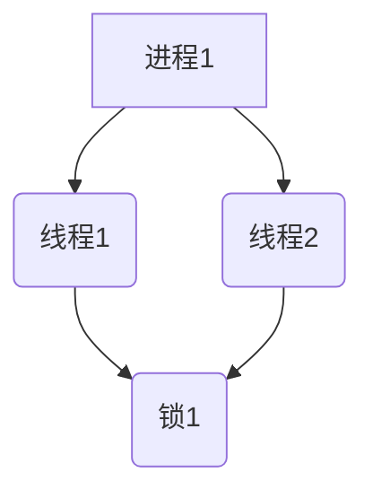

                 

## 模型检验技术在并发系统验证中的应用

> 关键词：并发系统，模型检验，验证技术，性能优化，安全性

> 摘要：本文从并发系统的基本概念出发，介绍了模型检验技术在并发系统验证中的应用。通过分析并发系统的特点，阐述模型检验的基本原理和方法，并结合实际案例，深入探讨了模型检验在并发系统性能优化和安全性验证中的具体应用。文章旨在为开发者和研究者提供一种有效的技术手段，以提升并发系统的可靠性。

## 第一部分：并发系统的基本概念与模型检验概述

### 第1章：并发系统的基本概念

#### 1.1 并发的定义与重要性

并发（Concurrency）是指计算机系统中多个任务同时执行或并行执行的能力。在多核处理器和分布式计算环境中，并发尤为重要。它不仅能提升系统性能，还能提高资源利用率，优化用户体验。

#### 1.2 并发系统的特点

并发系统具有以下特点：

- **并行性**：多个任务在同一时间段内执行。
- **资源共享**：任务间共享资源，如内存、文件等。
- **同步与通信**：任务间需要进行同步和通信。
- **不确定性**：任务的执行顺序和资源访问可能发生变化。

#### 1.3 并发系统的基本模型

并发系统的基本模型包括：

- **进程模型**：以进程为基本单位，每个进程拥有独立的内存空间。
- **线程模型**：以线程为基本单位，多个线程共享进程的内存空间。
- **Actor模型**：以Actor为基本单位，通过消息传递进行通信。

### 第2章：模型检验技术简介

#### 2.1 模型检验的基本原理

模型检验（Model Checking）是一种形式化验证方法，通过对比模型与规范，检测系统是否满足预定的属性。其基本原理是状态空间探索，包括**完全探索**和**部分探索**。

#### 2.2 模型检验的主要方法

常见的模型检验方法有：

- **状态空间探索**：包括深度优先搜索、广度优先搜索等。
- **抽象状态空间探索**：通过状态压缩等手段，减少状态空间规模。
- **定理证明**：基于逻辑推理，证明系统性质。

#### 2.3 模型检验的优势与挑战

模型检验的优势包括：

- **自动化**：能够自动检测系统缺陷。
- **精确性**：能够精确地验证系统性质。

挑战包括：

- **状态空间爆炸问题**：随着系统规模增大，状态空间指数级增长。
- **效率问题**：对大规模系统进行模型检验可能需要很长时间。

### 第3章：并发系统的模型检验方法

#### 3.1 模型构建

模型构建是模型检验的第一步，包括：

- **状态表示**：使用数据结构和算法描述系统状态。
- **转换规则**：描述系统状态的转换规则。

#### 3.2 验证策略设计

验证策略设计包括：

- **验证目标**：确定需要验证的系统性质。
- **验证方法**：选择合适的模型检验方法。

#### 3.3 模型检验工具介绍

常见的模型检验工具有：

- **Spin**：基于状态空间探索的模型检验工具。
- **NuSMV**：支持多种模型检验算法的模型检验工具。
- **Blaze**：支持抽象状态空间探索的模型检验工具。

## 第二部分：核心概念与联系

### 第8章：并发系统的概念实体关系

#### 8.1 实体定义

在并发系统中，常见的实体包括：

- **进程**：执行中的程序实例。
- **线程**：进程内的执行单元。
- **锁**：用于同步的机制。
- **信号量**：用于同步和通信的机制。

#### 8.2 实体间关系

实体间的关系包括：

- **进程间关系**：包括父子关系、兄弟关系等。
- **线程间关系**：包括同步、异步等。
- **锁与信号量关系**：锁用于线程同步，信号量用于进程同步。

#### 8.3 Mermaid流程图展示

使用Mermaid绘制并发系统的实体关系图：



## 第三部分：核心算法原理讲解

### 第9章：模型检验算法原理

#### 9.1 状态机模型检验算法

状态机模型检验算法包括：

- **BFS（广度优先搜索）**：从初始状态开始，逐层探索状态空间。
- **DFS（深度优先搜索）**：从一个状态开始，尽可能深入地探索状态空间。

#### 9.2 BDD模型检验算法

BDD（布尔差分图）模型检验算法包括：

- **BDD生成**：使用布尔表达式生成BDD。
- **BDD检验**：通过BDD检验系统性质。

#### 9.3 LTS模型检验算法

LTS（有限状态转移图）模型检验算法包括：

- **LTS生成**：使用状态转换规则生成LTS。
- **LTS检验**：通过LTS检验系统性质。

### 第10章：Python源代码实现

#### 10.1 并发系统模型构建

使用Python构建并发系统模型，包括状态表示和转换规则。

```python
# 示例代码：并发系统模型构建
class Process:
    def __init__(self, state):
        self.state = state

# 示例：状态表示
states = ["idle", "running", "blocked"]

# 示例：转换规则
transitions = [
    ("idle", "running"),
    ("running", "idle"),
    ("idle", "blocked"),
    ("blocked", "idle"),
]

# 示例：构建状态机模型
def build_state_machine(states, transitions):
    state_machine = {}
    for state in states:
        state_machine[state] = []
    for transition in transitions:
        from_state, to_state = transition
        state_machine[from_state].append(to_state)
    return state_machine

# 示例：构建并发系统模型
state_machine = build_state_machine(states, transitions)
```

#### 10.2 模型检验算法实现

使用Python实现状态机模型检验算法。

```python
# 示例代码：BFS模型检验算法实现
from collections import deque

def bfs(state_machine, initial_state, target_state):
    queue = deque([initial_state])
    visited = set()

    while queue:
        current_state = queue.popleft()
        if current_state == target_state:
            return True
        visited.add(current_state)

        for next_state in state_machine[current_state]:
            if next_state not in visited:
                queue.append(next_state)

    return False

# 示例：模型检验
result = bfs(state_machine, "idle", "blocked")
print(result)  # 输出：True 或 False
```

#### 10.3 代码解读与分析

代码展示了如何使用Python构建并发系统模型，并实现BFS模型检验算法。通过状态表示和转换规则，模型能够描述并发系统的行为，通过模型检验算法，可以验证系统性质。

### 第11章：数学模型与公式

#### 11.1 并发系统性能指标

并发系统性能指标包括：

- **响应时间**：系统处理请求所需的时间。
- **吞吐量**：单位时间内系统处理的请求数量。

#### 11.2 模型检验的数学基础

模型检验的数学基础包括：

- **状态空间**：系统所有可能状态组成的集合。
- **状态转移**：状态之间的转换规则。

#### 11.3 案例分析中的数学模型

在案例分析中，可以使用数学模型描述系统性能指标和模型检验结果。

### 第四部分：项目实战

#### 第12章：并发系统模型检验实战

##### 12.1 开发环境搭建

搭建并发系统模型检验的开发环境，包括Python环境和模型检验工具。

##### 12.2 源代码实现与解读

实现并发系统模型和模型检验算法，并解读代码。

##### 12.3 案例分析与总结

通过实际案例，分析并发系统模型检验的过程和结果，总结经验。

#### 第13章：性能优化与安全性验证

##### 13.1 性能优化策略

介绍并发系统的性能优化策略，包括线程池、锁优化等。

##### 13.2 安全性验证方法

介绍并发系统的安全性验证方法，包括模型检验、静态代码分析等。

##### 13.3 实际案例分析

通过实际案例，分析性能优化和安全验证的过程和结果。

### 第14章：总结与展望

##### 14.1 实战经验总结

总结并发系统模型检验的实战经验，包括开发环境、源代码实现、案例分析等。

##### 14.2 存在的问题与挑战

分析并发系统模型检验中存在的问题和挑战，包括状态空间爆炸、效率问题等。

##### 14.3 未来发展方向

展望并发系统模型检验的未来发展方向，包括新的算法、工具和应用场景等。

## 附录：相关资源与工具

##### 15.1 相关代码示例

提供并发系统模型检验的代码示例。

##### 15.2 实用工具推荐

推荐并发系统模型检验的实用工具。

##### 15.3 进一步学习资源

提供并发系统模型检验的进一步学习资源。

---

### 总结

模型检验技术在并发系统验证中具有重要作用。本文从并发系统的基本概念出发，介绍了模型检验技术的基本原理和方法，并结合Python源代码实现，展示了如何构建并发系统模型并进行模型检验。通过实际案例分析和性能优化与安全性验证，本文旨在为开发者和研究者提供一种有效的技术手段，以提升并发系统的可靠性。未来，随着算法和工具的不断发展，模型检验技术在并发系统中的应用将更加广泛和深入。

