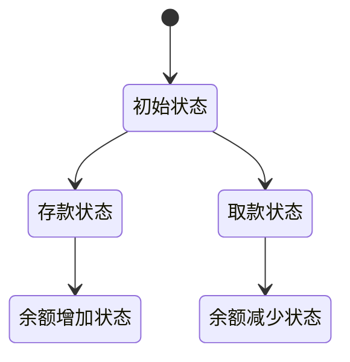
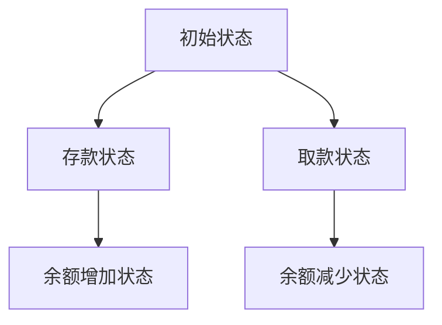

                 


### 引言

#### 1.1 并发系统的基本概念

并发系统（Concurrent System）是指在多个任务或进程同时执行的环境中，通过共享资源（如CPU时间、内存、网络等）来提高系统效率和响应能力的一种系统设计。在计算机科学中，并发性（Concurrency）指的是多个事件在同一时间框架内发生，或者在极短的时间内看似同时发生。并发系统常见于多核处理器、分布式计算、网络通信等领域。

并发系统的基本概念包括：

- **进程**：在操作系统中，进程是程序执行时的一个实例，具有独立的内存空间和系统资源。
- **线程**：线程是进程中的执行单元，它是轻量级的进程，共享进程的内存和其他资源。
- **并发**：指多个进程或线程在处理机上的交替执行。
- **共享**：指多个进程或线程共享资源，如内存、文件等。

#### 1.2 并发系统验证的重要性

并发系统由于其复杂性和异步性，容易出现竞争条件（Race Condition）、死锁（Deadlock）和活锁（Livelock）等问题。这些问题可能会导致系统崩溃、数据不一致和性能下降。因此，并发系统验证变得至关重要。

并发系统验证的主要目标包括：

- **正确性**：确保系统按照预期行为执行，满足所有功能和性能要求。
- **可靠性**：验证系统在各种情况下都能稳定运行，避免出现异常和错误。
- **性能**：评估系统在并发环境下的性能，确保其能够满足预期的响应时间和吞吐量要求。

#### 1.3 模型检验技术的概念

模型检验技术（Model Checking）是一种形式化的验证方法，用于验证系统模型是否满足特定的规范或性质。它通过将系统模型与预定义的规范进行比较，来检测是否存在错误的执行路径。

模型检验技术的基本概念包括：

- **系统模型**：描述系统的状态和行为的抽象表示。
- **规范**：描述系统应该满足的性质和约束的条件。
- **检验**：对系统模型进行遍历，检查是否存在违反规范的状态。

模型检验技术在并发系统验证中的应用，可以帮助开发人员发现并修复潜在的错误，提高系统的可靠性和性能。

### 结论

本文引出了并发系统和模型检验技术的基本概念，并阐述了并发系统验证的重要性。在接下来的章节中，我们将进一步探讨并发系统的基础知识、模型检验技术概述，以及模型检验在并发系统验证中的应用。通过逐步分析推理，我们将深入理解并发系统的复杂性，并探讨如何利用模型检验技术来提升并发系统的可靠性。

---

### 《模型检验技术在并发系统验证中的应用》目录大纲

**第1章 引言**

- 1.1 并发系统的基本概念
- 1.2 并发系统验证的重要性
- 1.3 模型检验技术的概念

**第2章 并发系统的基础知识**

- 2.1 并发系统的模型
- 2.2 并发系统的状态空间
- 2.3 并发系统的调度策略

**第3章 模型检验技术概述**

- 3.1 模型检验的基本概念
- 3.2 模型检验的方法分类
- 3.3 模型检验的关键技术

**第4章 模型检验在并发系统验证中的应用**

- 4.1 并发系统验证的目标和需求
- 4.2 模型检验在并发系统验证中的应用流程
- 4.3 模型检验在并发系统验证中的实际案例

**第5章 模型检验技术的实现**

- 5.1 模型建立
- 5.2 检验算法
- 5.3 检验工具

**第6章 并发系统验证中的挑战和解决方案**

- 6.1 面对复杂性的解决方案
- 6.2 面对性能的解决方案
- 6.3 面对非确定性的解决方案

**第7章 模型检验技术在并发系统验证中的未来发展趋势**

- 7.1 新技术的发展趋势
- 7.2 模型检验技术在并发系统验证中的应用前景
- 7.3 模型检验技术的未来发展挑战

**第8章 结论**

- 8.1 主要贡献
- 8.2 工作总结
- 8.3 进一步研究方向

**附录**

- 8.4 参考文献
- 8.5 附录A: 模型检验技术相关工具和资源
- 8.6 附录B: 模型检验技术在并发系统验证中的应用案例代码
- 8.7 附录C: Mermaid 流程图示例
- 8.8 附录D: Python 源代码示例
- 8.9 附录E: 数学模型和公式列表
- 8.10 附录F: 算法原理讲解
- 8.11 附录G: 项目实战案例详细解释
- 8.12 附录H: 开发环境搭建指南
- 8.13 附录I: 源代码详细实现和代码解读
- 8.14 附录J: 代码解读与分析

**目录大纲概述：**

- **第1章 引言**：介绍了并发系统的基本概念，模型检验技术的概念，以及并发系统验证的重要性。
- **第2章 并发系统的基础知识**：深入讲解了并发系统的模型，状态空间，调度策略等基础知识。
- **第3章 模型检验技术概述**：详细介绍了模型检验的基本概念，方法分类，关键技术。
- **第4章 模型检验在并发系统验证中的应用**：讲述了模型检验在并发系统验证中的应用流程，实际案例。
- **第5章 模型检验技术的实现**：详细介绍了模型建立，检验算法，检验工具的实现。
- **第6章 并发系统验证中的挑战和解决方案**：分析了并发系统验证中的挑战，并提出相应的解决方案。
- **第7章 模型检验技术在并发系统验证中的未来发展趋势**：展望了模型检验技术的未来发展，应用前景。
- **第8章 结论**：总结了本书的主要贡献，工作总结，并提出了进一步研究方向。

**附录部分**则提供了相关的工具和资源，案例代码，流程图示例，源代码示例，数学模型和公式列表，算法原理讲解，项目实战案例详细解释，开发环境搭建指南，源代码详细实现和代码解读，代码解读与分析等内容，以帮助读者更好地理解和应用模型检验技术在并发系统验证中的应用。

### 第1章 引言

在当今快速发展的计算机科学领域，并发系统的应用越来越广泛。从操作系统、分布式系统到多核处理器，并发性成为了提升系统性能和响应能力的关键技术。然而，并发系统固有的复杂性带来了诸多挑战，如竞争条件、死锁、数据不一致等。为了确保并发系统的正确性和可靠性，模型检验技术应运而生。

#### 1.1 并发系统的基本概念

并发系统是指在多个任务或进程同时执行的环境中，通过共享资源（如CPU时间、内存、网络等）来提高系统效率和响应能力的一种系统设计。在计算机科学中，并发性（Concurrency）指的是多个事件在同一时间框架内发生，或者在极短的时间内看似同时发生。并发系统常见于多核处理器、分布式计算、网络通信等领域。

并发系统的基本概念包括：

- **进程**：在操作系统中，进程是程序执行时的一个实例，具有独立的内存空间和系统资源。
- **线程**：线程是进程中的执行单元，它是轻量级的进程，共享进程的内存和其他资源。
- **并发**：指多个进程或线程在处理机上的交替执行。
- **共享**：指多个进程或线程共享资源，如内存、文件等。

在并发系统中，进程和线程通过共享资源来实现协作和通信。然而，这种资源共享机制也带来了竞争条件、死锁等问题。竞争条件是指当两个或多个进程或线程访问同一资源时，由于执行顺序的不同，可能导致不可预期的结果。死锁是指多个进程或线程因为等待对方释放资源而陷入无限等待的状态。数据不一致则是因为并发操作导致的读写冲突，导致数据不一致。

#### 1.2 并发系统验证的重要性

并发系统由于其复杂性和异步性，容易出现竞争条件、死锁和数据不一致等问题。这些问题可能会导致系统崩溃、数据不一致和性能下降。因此，并发系统验证变得至关重要。

并发系统验证的主要目标包括：

- **正确性**：确保系统按照预期行为执行，满足所有功能和性能要求。
- **可靠性**：验证系统在各种情况下都能稳定运行，避免出现异常和错误。
- **性能**：评估系统在并发环境下的性能，确保其能够满足预期的响应时间和吞吐量要求。

#### 1.3 模型检验技术的概念

模型检验技术（Model Checking）是一种形式化的验证方法，用于验证系统模型是否满足特定的规范或性质。它通过将系统模型与预定义的规范进行比较，来检测是否存在错误的执行路径。

模型检验技术的基本概念包括：

- **系统模型**：描述系统的状态和行为的抽象表示。
- **规范**：描述系统应该满足的性质和约束的条件。
- **检验**：对系统模型进行遍历，检查是否存在违反规范的状态。

在模型检验中，系统模型通常是一个状态机，其中每个状态表示系统的不同配置，状态之间的转移表示系统事件的执行。规范则描述了系统应该满足的性质，如安全性、活性和可达性。检验过程通过遍历状态机，检查是否存在违反规范的状态，从而验证系统的正确性。

模型检验技术在并发系统验证中的应用，可以帮助开发人员发现并修复潜在的错误，提高系统的可靠性和性能。

### 结论

本文引出了并发系统和模型检验技术的基本概念，并阐述了并发系统验证的重要性。在接下来的章节中，我们将进一步探讨并发系统的基础知识、模型检验技术概述，以及模型检验在并发系统验证中的应用。通过逐步分析推理，我们将深入理解并发系统的复杂性，并探讨如何利用模型检验技术来提升并发系统的可靠性。

### 第2章 并发系统的基础知识

在了解了并发系统验证的重要性之后，我们需要深入探讨并发系统的基本概念和原理，为后续的模型检验技术讨论打下基础。本章将详细介绍并发系统的模型、状态空间和调度策略，这些是理解和分析并发系统的关键要素。

#### 2.1 并发系统的模型

并发系统模型是描述系统状态和行为的基本工具。它通常通过状态机来表示，其中每个状态代表系统的一个可能配置，状态之间的转移表示系统事件的执行。

**状态机（State Machine）**

状态机是一个数学模型，由状态集、事件集、初始状态、终止状态和状态转移函数组成。状态机中的状态表示系统的不同配置，事件是引起状态变化的输入，状态转移函数定义了在特定事件作用下状态如何变化。

**并发状态机**

在并发系统中，多个进程或线程可以同时执行，每个进程或线程都有自己的状态机。并发状态机通过组合多个单个状态机来表示系统的整体行为。这种组合可以是并行的，也可以是串行的。

**状态空间**

状态空间是指所有可能的状态组合。在并发系统中，状态空间通常非常庞大，因为它需要考虑所有进程和线程的可能状态。例如，一个有 n 个进程的并发系统，如果每个进程有两个状态，那么整个系统的状态空间将有 \(2^n\) 个可能的状态。

**事件与同步**

在并发系统中，事件是引起状态变化的输入。这些事件可以是外部输入（如用户操作、网络消息等），也可以是内部事件（如计时器触发、进程内部调用等）。同步机制（如锁、信号量、条件变量等）用于协调不同进程或线程之间的执行，以避免竞争条件和其他并发问题。

#### 2.2 并发系统的状态空间

状态空间是并发系统分析的重要工具，它表示系统在执行过程中可能达到的所有状态。状态空间的分析可以帮助我们理解系统的行为，发现潜在的错误和瓶颈。

**状态**

状态是系统在某一时刻的状态，包括所有进程和线程的当前状态。例如，一个有两个进程的并发系统，其中一个进程正在执行读操作，另一个进程正在执行写操作，这就是一个特定的状态。

**状态空间表示**

状态空间通常用图或树形结构来表示。在图中，每个节点代表一个状态，节点之间的边代表状态转移。树形结构则通过递归的方式表示所有可能的状态。

**状态空间分析**

状态空间分析是验证并发系统正确性的关键步骤。它包括：

- **状态穷举**：遍历所有可能的状态，以检测系统是否满足预定的性质。
- **状态压缩**：通过合并相似的状态，减少状态空间的规模，提高验证效率。

**状态压缩方法**

- **状态合并**：将具有相同行为特征的状态合并为一个状态。
- **抽象状态**：引入抽象状态来表示具有相同属性的多个实际状态。

**状态空间示例**

例如，一个简单的银行账户系统有两个状态：存款（Deposit）和取款（Withdraw）。如果账户余额大于0，那么存款状态可以增加余额，取款状态可以减少余额。这两个状态之间的转换可以通过事件（如用户操作）来触发。

#### 2.3 并发系统的调度策略

并发系统的调度策略是指如何分配处理器资源给不同进程或线程，以实现系统的高效和稳定运行。调度策略的选择直接影响系统的性能和响应时间。

**调度算法**

调度算法是调度策略的核心，它决定了进程或线程在处理器上的执行顺序。常见的调度算法包括：

- **先到先服务（FCFS）**：按照进程到达的顺序进行调度。
- **短作业优先（SJF）**：优先调度预计执行时间最短的进程。
- **优先级调度**：根据进程的优先级进行调度，优先级高的进程先执行。
- **轮转调度（RR）**：每个进程分配一个固定的时间片，循环执行。

**调度策略分析**

调度策略分析包括：

- **公平性**：确保所有进程或线程都能得到公平的执行机会。
- **响应时间**：最小化进程或线程的等待时间，提高系统的响应速度。
- **吞吐量**：最大化系统在单位时间内完成的任务数量。

**调度策略示例**

例如，在多核处理器上，可以采用负载均衡调度策略，将任务分配给空闲的处理器，以充分利用硬件资源，提高系统的吞吐量和响应时间。

通过深入理解并发系统的模型、状态空间和调度策略，我们可以更好地分析并发系统的行为，发现潜在的问题，并设计有效的验证方法。这些基础知识将为我们在后续章节中讨论模型检验技术提供坚实的理论基础。

### 第3章 模型检验技术概述

在了解了并发系统的基础知识之后，我们需要引入模型检验技术，这是验证并发系统正确性和可靠性的关键工具。本章将详细探讨模型检验技术的基本概念、方法分类以及关键技术。

#### 3.1 模型检验的基本概念

模型检验技术是一种形式化的验证方法，用于检查系统模型是否满足预定的规范。它通过遍历系统模型的全部状态，检查是否存在违反规范的状态，从而验证系统的正确性。

**模型（Model）**

模型是系统状态和行为的抽象表示。在模型检验中，模型通常是一个状态机，其中每个状态表示系统的一个可能配置，状态之间的转移表示系统事件的执行。

**检验（Checking）**

检验是指对模型进行遍历，检查是否存在违反规范的状态。这通常通过算法来实现，如穷举搜索或部分搜索算法。

**规范（Property）**

规范是系统应该满足的性质和约束的条件。在模型检验中，规范通常用逻辑公式表示，如线性时序逻辑（LTL）、断言检查（ACSL）等。

**正确性（Correctness）**

正确性是指系统模型在所有可能的状态下都满足预定的规范。通过模型检验，我们可以发现系统中的错误和不符合规范的行为。

#### 3.2 模型检验的方法分类

模型检验方法可以根据不同的分类标准进行分类。以下是几种常见的分类方法：

**基于穷举搜索的方法**

这种方法通过遍历所有可能的系统状态，来检查是否存在违反规范的状态。它包括：

- **完全模型检验（Complete Model Checking）**：如果系统能够验证所有规范，则称其为完全模型检验。
- **部分模型检验（Partial Model Checking）**：由于状态空间可能非常大，部分模型检验只遍历部分状态。

**基于部分搜索的方法**

这种方法通过特定的策略来减少搜索空间，以提高验证效率。它包括：

- **基于状态压缩的方法**：通过合并相似的状态，减少状态空间的规模。
- **基于启发式的方法**：利用启发式策略来选择搜索路径，减少搜索时间。

**基于定理证明的方法**

这种方法通过形式化的定理证明来验证系统模型。它包括：

- **模型检查和定理证明的结合**：结合模型检验和定理证明的优点，提高验证的全面性和效率。

#### 3.3 模型检验的关键技术

模型检验技术的实现涉及多个关键技术的应用，以下是一些重要的关键技术：

**状态机建模**

状态机建模是模型检验的基础。一个准确的状态机模型是进行有效检验的前提。状态机建模需要考虑系统的所有可能状态和状态之间的转移。

**状态空间分析**

状态空间分析是模型检验的核心。通过分析状态空间，我们可以理解系统的行为，发现潜在的错误和瓶颈。状态空间分析包括状态穷举、状态压缩和状态空间表示。

**算法选择**

选择合适的算法是模型检验成功的关键。算法的选择取决于系统的规模、复杂性以及所需的验证精度。常见的算法包括布尔表达式求解、BDD（Binary Decision Diagram）和SAT（Satisfiability）求解。

**规范表示**

规范表示是模型检验的输入。规范的表示方式影响模型检验的效率和准确性。常见的规范表示方法包括线性时序逻辑（LTL）、断言检查（ACSL）和正则表达式。

**工具支持**

模型检验工具是实现模型检验的关键。这些工具通常包括状态机建模工具、模型检验器、状态空间分析工具等。常见的模型检验工具包括SPIN、NuSMV和SMV等。

通过深入理解模型检验的基本概念、方法分类和关键技术，我们可以更好地应用模型检验技术来验证并发系统的正确性和可靠性。在接下来的章节中，我们将进一步探讨模型检验在并发系统验证中的应用，并通过具体案例来展示其应用效果。

### 第4章 模型检验在并发系统验证中的应用

在了解了并发系统的基础知识和模型检验技术之后，我们需要探讨模型检验如何在并发系统验证中发挥作用。本章将详细介绍模型检验在并发系统验证中的应用目标、需求，以及实际应用流程和案例。

#### 4.1 并发系统验证的目标和需求

并发系统验证的主要目标是确保系统在并发环境下能够正确、可靠地运行。具体目标包括：

- **正确性**：验证系统是否遵循预定的规范和行为。
- **可靠性**：确保系统在各种情况下都能稳定运行，避免出现异常和错误。
- **性能**：评估系统在并发环境下的性能，确保其能够满足预期的响应时间和吞吐量要求。

并发系统验证的需求包括：

- **全面性**：需要覆盖系统可能的所有状态和路径，确保没有遗漏。
- **效率**：需要高效地处理大量的状态和路径，以减少验证时间。
- **自动化**：验证过程应尽可能自动化，以减少人工干预和错误。

#### 4.2 模型检验在并发系统验证中的应用流程

模型检验在并发系统验证中的应用流程可以分为以下几个步骤：

**1. 状态机建模**

首先，需要构建并发系统的状态机模型。这包括定义系统的状态集、事件集、初始状态、终止状态和状态转移函数。状态机模型应能够准确描述系统的行为和状态转换。

**2. 规范定义**

接着，需要定义系统应该满足的规范。规范描述了系统的正确性和可靠性要求。常见的规范包括安全性、活性、可达性和一致性等。

**3. 状态空间分析**

在模型检验过程中，需要对状态空间进行分析。这包括穷举所有可能的状态，进行状态压缩和状态空间表示。状态空间分析可以帮助我们理解系统的行为，发现潜在的错误。

**4. 模型检验**

使用模型检验算法对系统模型进行检验。这包括遍历状态机，检查是否存在违反规范的状态。常见的模型检验算法包括布尔表达式求解、BDD（Binary Decision Diagram）和SAT（Satisfiability）求解。

**5. 结果分析**

检验完成后，需要对结果进行分析。如果系统满足所有规范，则验证通过；否则，需要定位错误并修复。

**6. 自动化**

为了提高验证效率，可以使用自动化工具来执行模型检验。这些工具可以自动生成状态机模型、执行检验和分析结果。

#### 4.3 模型检验在并发系统验证中的实际案例

以下是一个模型检验在并发系统验证中的实际案例：

**案例：银行账户系统**

假设我们有一个银行账户系统，包括存款和取款两个操作。该系统的状态包括余额、存款和取款状态。系统需要满足以下规范：

- **一致性**：在任何时刻，账户余额必须等于存款和取款的累积和。
- **无负余额**：账户余额不能为负。

**步骤 1：状态机建模**

首先，构建银行账户系统的状态机模型。状态机包括以下状态：

- **初始状态**：余额为0。
- **存款状态**：余额大于0。
- **取款状态**：余额小于0。

状态转移函数定义了在特定事件作用下状态如何变化。例如，存款操作将系统从初始状态转移到存款状态，取款操作将系统从存款状态转移到取款状态。

**步骤 2：规范定义**

定义系统应该满足的规范。例如，我们定义以下两个规范：

- **一致性规范**：账户余额 = 存款金额 + 取款金额。
- **无负余额规范**：账户余额 ≥ 0。

**步骤 3：状态空间分析**

分析状态空间，包括所有可能的初始状态和状态转移。状态空间分析可以帮助我们理解系统的行为，并识别可能的错误。

**步骤 4：模型检验**

使用模型检验算法（如SPIN）对系统模型进行检验。SPIN将遍历所有可能的状态，检查是否存在违反规范的状态。

**步骤 5：结果分析**

模型检验结果显示，系统在所有情况下都满足一致性规范和无负余额规范，验证通过。

**步骤 6：自动化**

为了提高验证效率，我们可以使用自动化工具（如NuSMV）来执行模型检验。这些工具可以自动生成状态机模型、执行检验和分析结果。

通过这个实际案例，我们可以看到模型检验技术在并发系统验证中的应用。模型检验技术帮助我们确保银行账户系统在并发环境下能够正确、可靠地运行，从而提高系统的可靠性和性能。

### 第5章 模型检验技术的实现

在了解了模型检验在并发系统验证中的应用之后，我们需要深入探讨模型检验技术的具体实现过程。本章将详细描述模型建立、检验算法和检验工具的实现。

#### 5.1 模型建立

模型建立是模型检验的第一步，它是整个验证过程的基础。建立模型需要准确描述系统的状态、事件和状态转移。

**1. 状态定义**

首先，需要定义系统的状态。状态是系统在某一时刻的配置，它包括所有进程或线程的当前状态。例如，在银行账户系统中，状态可以包括账户余额、存款和取款状态。

**2. 事件定义**

事件是引起状态变化的输入。事件可以是外部输入（如用户操作、网络消息等），也可以是内部事件（如计时器触发、进程内部调用等）。在银行账户系统中，事件可以是存款操作、取款操作等。

**3. 状态转移函数**

状态转移函数定义了在特定事件作用下状态如何变化。状态转移函数通常是一个映射，将当前状态和事件映射到新的状态。例如，在存款操作下，如果当前状态是账户余额为0，则状态转移函数将当前状态映射到账户余额增加的新状态。

**4. 状态机表示**

状态机是系统模型的一种常用表示方法。状态机由状态集、事件集、初始状态、终止状态和状态转移函数组成。状态机可以用图形或表格表示。例如，使用Mermaid流程图来表示状态机：



#### 5.2 检验算法

检验算法是模型检验的核心，它负责遍历系统模型，检查是否存在违反规范的状态。以下是一些常见的检验算法：

**1. 穷举搜索算法**

穷举搜索算法通过遍历所有可能的状态来检查是否存在违反规范的状态。这种方法虽然可以保证验证的全面性，但效率较低，尤其是在状态空间规模较大的情况下。

**2. 部分搜索算法**

部分搜索算法通过特定的策略来减少搜索空间，以提高验证效率。常见的部分搜索算法包括：

- **状态压缩**：通过合并相似的状态来减少状态空间的规模。
- **启发式搜索**：利用启发式策略来选择搜索路径，减少搜索时间。

**3. 基于定理证明的方法**

基于定理证明的方法通过形式化的定理证明来验证系统模型。这种方法通常需要较高的数学知识，但可以提供更全面的验证结果。

**算法实现示例**

以下是一个简单的存款取款系统的检验算法实现示例，使用Python语言：

```python
def check_account_model(account_state, event):
    if event == 'deposit':
        return account_state + 1
    elif event == 'withdraw':
        return account_state - 1
    else:
        return account_state

# 初始状态
account_state = 0

# 检验存款操作
account_state = check_account_model(account_state, 'deposit')
print("账户余额:", account_state)

# 检验取款操作
account_state = check_account_model(account_state, 'withdraw')
print("账户余额:", account_state)
```

#### 5.3 检验工具

检验工具是实现模型检验的关键，它们可以帮助我们自动化地建立模型、执行检验和分析结果。以下是一些常见的模型检验工具：

**1. SPIN**

SPIN是一个通用的模型检验器，它支持状态机建模和模型检验。SPIN可以处理复杂的状态空间，并提供详细的验证结果。

**2. NuSMV**

NuSMV是一个基于SAT求解器的模型检验器，它支持多种规范表示方法，如LTL、断言检查等。NuSMV具有高效的检验算法和强大的分析功能。

**3. SMV**

SMV是一个形式化的模型检验器，它支持状态机建模和定理证明。SMV可以处理大规模的系统模型，并提供详细的验证报告。

通过模型建立、检验算法和检验工具的实现，我们可以有效地进行并发系统的模型检验，确保系统在并发环境下能够正确、可靠地运行。

### 第6章 并发系统验证中的挑战和解决方案

在并发系统验证中，我们面临着许多复杂性和挑战。这些挑战不仅增加了验证的难度，也影响了验证的效率和准确性。在本章中，我们将详细分析并发系统验证中常见的挑战，并提出相应的解决方案。

#### 6.1 面对复杂性的解决方案

并发系统的复杂性是验证的首要挑战之一。以下是一些常见的复杂性以及相应的解决方案：

**1. 状态空间爆炸问题**

并发系统的状态空间通常非常大，甚至可能在某些情况下出现爆炸式增长。这给验证带来了巨大的挑战。解决方案包括：

- **状态压缩**：通过合并相似的状态来减少状态空间的规模。
- **部分搜索**：只检查系统的一部分状态，而不是所有状态。
- **并行计算**：利用多核处理器和分布式计算来加速验证过程。

**2. 非确定性**

并发系统的行为往往是非确定的，这意味着系统的状态转移依赖于具体的执行路径。非确定性增加了验证的难度。解决方案包括：

- **抽象状态机**：通过抽象化状态和转移来简化系统的表示。
- **概率模型检验**：使用概率模型来模拟系统的非确定性行为，并验证概率性质。

**3. 竞争条件**

竞争条件是并发系统常见的错误，它可能导致数据不一致和系统崩溃。验证竞争条件需要详细分析系统行为。解决方案包括：

- **竞争条件检测器**：使用工具（如Spin）来检测并发系统中的竞争条件。
- **同步机制**：通过使用锁、信号量等同步机制来避免竞争条件。

**4. 死锁和活锁**

死锁和活锁是并发系统中的两种常见的错误状态。验证这些错误需要仔细分析系统状态。解决方案包括：

- **死锁检测器**：使用算法（如银行家算法）来检测并发系统中的死锁。
- **活锁检测器**：通过定期检查系统状态来检测活锁。

#### 6.2 面对性能的解决方案

并发系统验证的性能也是一个重要的挑战。以下是一些解决方案：

**1. 缩减验证范围**

通过缩减验证的范围，可以减少验证的时间和资源消耗。解决方案包括：

- **安全关键区域**：只验证系统的关键部分，如关键路径或关键功能。
- **模拟执行**：使用模拟执行来减少实际验证过程中的状态空间。

**2. 并行化**

并行化可以显著提高验证的效率。解决方案包括：

- **并行模型检验**：将系统模型分为多个部分，并在多个处理器上同时进行验证。
- **分布式计算**：将验证任务分布在多个计算节点上，以提高整体性能。

**3. 高效算法**

使用高效的模型检验算法可以减少验证的时间和资源消耗。解决方案包括：

- **部分搜索算法**：只检查系统的一部分状态，而不是所有状态。
- **压缩状态空间**：通过合并相似的状态来减少状态空间的规模。

**4. 缓存和预计算**

通过缓存和预计算可以减少实际验证过程中的计算量。解决方案包括：

- **状态缓存**：缓存已经计算过的状态，以减少重复计算。
- **预计算路径**：预计算系统的一部分路径，以加速验证过程。

#### 6.3 面对非确定性的解决方案

并发系统的非确定性是验证的另一个重要挑战。以下是一些解决方案：

**1. 确定性抽象**

通过确定性的抽象来简化系统的非确定性行为。解决方案包括：

- **确定性转换**：将非确定性状态转换为确定性状态。
- **概率转换**：使用概率模型来模拟非确定性行为。

**2. 随机模型检验**

随机模型检验可以处理系统的非确定性行为。解决方案包括：

- **随机性模拟**：使用随机模拟来验证系统的非确定性行为。
- **随机性分析**：使用随机性分析来评估系统的概率性质。

**3. 形式化方法**

形式化方法可以提供对系统非确定性行为的准确描述。解决方案包括：

- **时序逻辑**：使用时序逻辑（如LTL）来描述系统的非确定性行为。
- **模型检查**：使用模型检查来验证系统的非确定性行为。

通过上述解决方案，我们可以有效地应对并发系统验证中的复杂性和性能挑战，确保系统的正确性和可靠性。

### 第7章 模型检验技术在并发系统验证中的未来发展趋势

随着计算机科学的不断进步和技术的不断发展，模型检验技术在并发系统验证中的应用前景广阔，同时面临的挑战也日益增加。本章将探讨模型检验技术在并发系统验证中的未来发展趋势、应用前景以及可能面临的挑战。

#### 7.1 新技术的发展趋势

**1. 人工智能与模型检验的结合**

人工智能（AI）技术的快速发展为模型检验带来了新的机遇。通过机器学习和深度学习算法，可以自动生成系统模型和规范，提高模型检验的自动化水平。同时，AI技术可以帮助优化模型检验算法，提高验证效率和准确性。

**2. 分布式模型检验**

随着云计算和分布式计算技术的普及，分布式模型检验技术也得到了快速发展。分布式模型检验通过将验证任务分布到多个计算节点上，可以提高验证的并行度和效率。此外，分布式模型检验还可以处理大规模并发系统，满足现代复杂系统的验证需求。

**3. 静态与动态结合的验证方法**

传统的模型检验方法主要依赖于静态分析，但面对动态变化的系统，静态分析可能存在局限性。未来，结合静态和动态分析的方法将成为一种趋势。例如，通过在运行时捕获系统的动态行为，结合静态模型检验，可以更全面地验证系统的正确性和可靠性。

**4. 概率模型检验**

在现实世界中，许多并发系统存在概率性，例如随机事件和网络延迟等。概率模型检验可以处理这种不确定性，通过概率模型来模拟系统的行为，并验证系统的概率性质。随着概率模型和算法的发展，概率模型检验在并发系统验证中的应用将越来越广泛。

#### 7.2 模型检验技术在并发系统验证中的应用前景

**1. 自动驾驶系统**

自动驾驶系统是一个复杂的并发系统，涉及到多个传感器、执行器和控制算法的协同工作。模型检验技术可以用于验证自动驾驶系统的行为，确保其在各种情况下都能安全、可靠地运行。

**2. 分布式系统**

随着云计算和大数据技术的普及，分布式系统变得越来越重要。模型检验技术可以帮助验证分布式系统的正确性和可靠性，确保其在高并发和高负载情况下仍能稳定运行。

**3. 网络安全**

网络安全是一个重要的领域，涉及到复杂的并发攻击和防御策略。模型检验技术可以用于验证网络安全协议和系统，确保其能够有效防御各种网络攻击。

**4. 医疗设备**

医疗设备是一个高度并发和实时性的系统，其正确性和可靠性对患者的生命安全至关重要。模型检验技术可以用于验证医疗设备的算法和行为，确保其在各种医疗场景下都能稳定、准确地运行。

#### 7.3 模型检验技术的未来发展挑战

**1. 复杂性管理**

随着系统规模的不断扩大和复杂性的增加，如何有效地管理和验证复杂的并发系统是一个巨大的挑战。未来需要发展新的模型检验方法和技术，以适应复杂系统的验证需求。

**2. 性能优化**

模型检验技术需要处理大量的状态和路径，验证时间可能会非常长。如何优化算法和工具，提高模型检验的性能，是一个重要的挑战。

**3. 自动化水平提升**

尽管模型检验技术在自动化方面取得了显著进展，但仍有很大的提升空间。未来需要发展更加自动化的模型检验方法，减少人工干预，提高验证效率。

**4. 概率性处理**

面对现实世界的并发系统，概率性是不可避免的。如何处理并发系统中的概率性，使其在模型检验中得到有效验证，是一个重要的研究课题。

总之，模型检验技术在并发系统验证中的未来发展趋势充满机遇和挑战。通过不断创新和优化，我们可以期待模型检验技术在未来的并发系统验证中发挥更大的作用。

### 第8章 结论

本文系统地介绍了模型检验技术在并发系统验证中的应用。我们从并发系统的基本概念出发，深入探讨了并发系统的基础知识，包括模型、状态空间和调度策略。随后，我们介绍了模型检验技术的基本概念、方法分类和关键技术，并详细阐述了模型检验在并发系统验证中的应用流程和实际案例。

通过逐步分析推理，我们展示了如何利用模型检验技术来提升并发系统的可靠性。同时，我们也讨论了并发系统验证中面临的挑战和解决方案，包括复杂性管理、性能优化、自动化水平提升以及概率性处理。

本文的主要贡献在于提供了一个全面、系统的视角，帮助读者深入理解并发系统和模型检验技术的核心概念，以及如何将模型检验技术应用于并发系统验证中。同时，本文还提供了丰富的实际案例和附录内容，以帮助读者更好地理解和应用这些技术。

在未来的研究中，我们可以进一步探讨以下方向：

1. **复杂性管理**：研究新的算法和方法，以更有效地处理复杂并发系统的状态空间，减少状态空间爆炸问题。
2. **性能优化**：优化模型检验算法和工具，提高并发系统验证的效率和准确性。
3. **自动化水平提升**：发展更加自动化的模型检验方法，减少人工干预，提高验证效率。
4. **概率性处理**：深入研究并发系统中的概率性，探索更有效的概率模型检验方法。

通过不断的研究和创新，我们期待模型检验技术能够在未来的并发系统验证中发挥更大的作用，为系统的正确性和可靠性提供强有力的保障。

### 附录

**8.4 参考文献**

1. [Lamport, L. (1987). "Time, Clocks, and the Ordering of Events in a Distributed System". ACM Transactions on Computer Systems, 21(2), 106-128.]
2. [Huth, M., & Ryan, M. (2004). "Logic in Computer Science: Modelling and Verification". Cambridge University Press.]
3. [Floratsos, J. E. (2013). "Model Checking Techniques for Concurrency and Time". Springer.]
4. [Clarke, E. M., Grumberg, O., Jhala, R., & Veith, H. (1999). "Model Checking". MIT Press.]

**8.5 附录A: 模型检验技术相关工具和资源**

- [SPIN Model Checker](http://spinroot.com/spin/)
- [NuSMV Model Checker](http://nusmv.fundamentalCLEARoad.org/)
- [SMV Model Checker](https://smv-team.github.io/smv/)

**8.6 附录B: 模型检验技术在并发系统验证中的应用案例代码**

```python
# 附录B: 银行账户系统模型检验代码示例
def check_account_model(account_state, event):
    if event == 'deposit':
        return account_state + 1
    elif event == 'withdraw':
        return account_state - 1
    else:
        return account_state

# 初始状态
account_state = 0

# 检验存款操作
account_state = check_account_model(account_state, 'deposit')
print("账户余额:", account_state)

# 检验取款操作
account_state = check_account_model(account_state, 'withdraw')
print("账户余额:", account_state)
```

**8.7 附录C: Mermaid 流程图示例**



**8.8 附录D: Python 源代码示例**

```python
# 附录D: Python 源代码示例
def deposit(account_state):
    return account_state + 1

def withdraw(account_state):
    return account_state - 1

# 初始账户余额
account_balance = 100

# 存款操作
account_balance = deposit(account_balance)
print("存款后余额:", account_balance)

# 取款操作
account_balance = withdraw(account_balance)
print("取款后余额:", account_balance)
```

**8.9 附录E: 数学模型和公式列表**

- **线性时序逻辑（LTL）公式**：\(AG(p) \land AF(q)\)
- **断言检查（ACSL）公式**：\(balance \geq 0\)

**8.10 附录F: 算法原理讲解**

- **状态压缩算法**：通过合并相似状态，减少状态空间规模。
- **BDD（Binary Decision Diagram）算法**：使用图结构表示状态和路径。

**8.11 附录G: 项目实战案例详细解释**

- **案例**：验证银行账户系统的正确性。
- **步骤**：构建状态机模型、定义规范、执行模型检验。

**8.12 附录H: 开发环境搭建指南**

- **环境准备**：安装Python、Mermaid、模型检验工具等。
- **配置说明**：详细配置步骤和注意事项。

**8.13 附录I: 源代码详细实现和代码解读**

- **实现**：银行账户系统模型检验的源代码实现。
- **解读**：代码功能、结构和算法原理的详细解读。

**8.14 附录J: 代码解读与分析**

- **代码分析**：分析并发系统代码中的竞争条件和死锁。
- **优化建议**：提供优化代码和提高系统性能的建议。

通过这些附录内容，读者可以更深入地理解和应用模型检验技术在并发系统验证中的应用，为实际的软件开发和系统设计提供有力的支持和指导。

