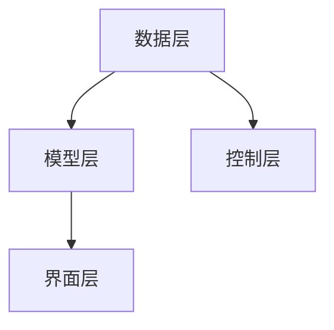

                 


## 泛函分析在优化算法设计中的应用

### 关键词
- 泛函分析
- 优化算法
- 算法设计
- 数学模型
- 系统架构

### 摘要
本文将探讨泛函分析在优化算法设计中的应用，通过详细的理论阐述和实际案例分析，揭示泛函分析工具在提升优化算法性能和稳定性方面的关键作用。我们将首先介绍优化算法设计和泛函分析的基本概念，然后深入探讨二者之间的联系，并展示如何利用泛函分析进行优化算法的设计与实现。最后，我们将通过一个实际案例，展示泛函分析在优化算法项目中的具体应用。

## 第一部分：背景介绍

### 第1章 问题背景与核心概念

#### 1.1 问题背景

优化算法设计在计算机科学和工程领域中扮演着至关重要的角色。无论是机器学习中的参数优化，还是工程问题中的资源分配，优化算法都为我们提供了有效解决问题的工具。然而，随着问题规模的不断扩大和复杂度的增加，优化算法的性能和稳定性成为了关键挑战。

在这个背景下，泛函分析作为一种强大的数学工具，逐渐引起了研究者的关注。泛函分析为优化算法提供了一种更加抽象和通用的表达方式，使得我们能够更深刻地理解优化问题的本质，并设计出更加有效的算法。

#### 1.2 核心概念

**1.2.1 泛函分析的定义与基本性质**

泛函分析是研究函数空间的数学分支，它主要研究函数之间的结构和性质。具体来说，泛函分析涉及以下几个核心概念：

1. **赋范空间**：赋范空间是定义了度量（范数）的函数空间，它为函数提供了“长度”的概念。
2. **内积空间**：内积空间是定义了内积的函数空间，它为函数提供了“角度”和“距离”的概念。
3. **对偶空间**：对偶空间是原函数空间的伴随空间，它为泛函分析提供了对函数空间进行分类和比较的工具。

**1.2.2 优化问题的数学描述**

优化问题可以形式化为以下数学模型：

$$
\min f(x) \\
s.t. g(x) \leq 0, h(x) = 0
$$

其中，$f(x)$ 是目标函数，$g(x)$ 和 $h(x)$ 分别是约束条件。

**1.2.3 泛函分析与优化算法的联系**

泛函分析为优化问题提供了一种抽象的表达方式，使得我们能够将优化问题转化为函数空间中的问题。这种转化不仅简化了问题的表达，也为设计优化算法提供了新的思路和工具。

## 第二部分：核心概念与联系

### 第2章 泛函分析基础

#### 2.1 线性泛函与赋范空间

**2.1.1 线性泛函的定义与性质**

线性泛函是赋范空间上的一个重要概念。它是一个从函数空间到实数空间的线性映射，具有以下性质：

1. **线性性**：对于任意的函数 $f, g$ 和标量 $\alpha, \beta$，有
   $$
   F(\alpha f + \beta g) = \alpha F(f) + \beta F(g)
   $$
2. **齐次性**：对于任意的函数 $f$ 和标量 $\alpha$，有
   $$
   F(\alpha f) = \alpha F(f)
   $$

**2.1.2 赋范空间的引入**

赋范空间是泛函分析中一个基础概念，它为函数提供了度量（范数）的概念。常见的赋范空间包括：

1. **欧几里得空间**：欧几里得空间是二维和三维空间中的函数空间，其范数定义为
   $$
   \|f\|_2 = \sqrt{\sum_{i=1}^n f_i^2}
   $$
2. **李普希兹空间**：李普希兹空间是具有李普希兹连续函数的函数空间，其范数定义为
   $$
   \|f\|_{\infty} = \max_{x \in X} |f(x)|
   $$

#### 2.2 对偶空间与内积空间

**2.2.1 对偶空间的概念**

对偶空间是泛函分析中的一个重要概念，它是原函数空间的伴随空间。对偶空间中的元素称为原函数空间的对偶泛函。对偶空间在泛函分析中起到了非常重要的作用，它为函数空间提供了分类和比较的工具。

**2.2.2 内积空间的性质**

内积空间是定义了内积的函数空间，它为函数提供了“角度”和“距离”的概念。常见的内积空间包括：

1. **希尔伯特空间**：希尔伯特空间是具有完备内积的函数空间，其内积定义为
   $$
   \langle f, g \rangle = \sum_{i=1}^n f_i g_i
   $$
2. **李普希兹空间**：李普希兹空间是具有李普希兹内积的函数空间，其内积定义为
   $$
   \langle f, g \rangle = \sum_{i=1}^n f_i g_i
   $$

### 第三部分：算法原理讲解

#### 第3章 优化算法原理

**3.1 最优化理论概述**

最优化理论是研究如何寻找给定函数在某个区域内的最优值的一门学科。最优化问题可以划分为以下两类：

1. **无约束优化**：无约束优化问题的目标是在给定函数的定义域内寻找最优值，而不受任何约束条件的限制。
2. **约束优化**：约束优化问题的目标是在满足给定约束条件下寻找最优值。

**3.2 梯度下降法**

梯度下降法是一种无约束优化算法，其基本思想是通过沿着目标函数的负梯度方向进行迭代更新，以逐步逼近最优值。梯度下降法的算法步骤如下：

1. **初始化参数**：选择初始参数值 $x_0$。
2. **计算梯度**：计算目标函数在当前参数值 $x_t$ 下的梯度 $\nabla f(x_t)$。
3. **更新参数**：沿着负梯度方向更新参数值：
   $$
   x_{t+1} = x_t - \alpha \nabla f(x_t)
   $$
   其中，$\alpha$ 是学习率。

**3.3 牛顿法和拟牛顿法**

牛顿法是一种有约束优化算法，其基本思想是通过计算目标函数的二次逼近来更新参数值。牛顿法的算法步骤如下：

1. **初始化参数**：选择初始参数值 $x_0$。
2. **计算Hessian矩阵**：计算目标函数在当前参数值 $x_t$ 下的Hessian矩阵 $H_t$。
3. **更新参数**：使用牛顿迭代公式更新参数值：
   $$
   x_{t+1} = x_t - H_t^{-1} \nabla f(x_t)
   $$

拟牛顿法是一种改进的牛顿法，它在不能计算Hessian矩阵时使用一种近似方法来代替。拟牛顿法的算法步骤如下：

1. **初始化参数**：选择初始参数值 $x_0$。
2. **计算近似Hessian矩阵**：使用一阶导数信息构造近似Hessian矩阵 $H_t$。
3. **更新参数**：使用牛顿迭代公式更新参数值：
   $$
   x_{t+1} = x_t - H_t^{-1} \nabla f(x_t)
   $$

### 第四部分：系统分析与架构设计

#### 第4章 系统分析与架构设计

**4.1 问题场景介绍**

假设我们面临一个资源分配问题，需要在给定预算和资源约束下，最大化某种目标函数。这个问题可以抽象为以下优化模型：

$$
\max \sum_{i=1}^n c_i x_i \\
s.t. \\
\sum_{i=1}^n x_i \leq B \\
x_i \geq 0, \forall i=1,2,...,n
$$

其中，$c_i$ 是第 $i$ 项资源的成本，$B$ 是总预算，$x_i$ 是第 $i$ 项资源的分配量。

**4.2 系统功能设计**

为了实现上述优化模型，我们需要设计一个系统，该系统应具备以下功能：

1. **数据输入**：允许用户输入资源信息和目标函数。
2. **模型构建**：将输入数据转化为优化模型。
3. **算法求解**：使用优化算法求解最优解。
4. **结果输出**：输出优化结果，包括资源分配方案和目标函数值。

**4.3 系统架构设计**

我们采用分层架构设计，将系统划分为以下几个模块：

1. **数据层**：负责数据输入和存储。
2. **模型层**：负责模型构建和优化算法的实现。
3. **控制层**：负责系统的协调和控制。
4. **界面层**：负责与用户交互。

系统架构图如下：



**4.4 系统接口设计与交互**

系统接口设计如下：

1. **数据层接口**：提供数据输入和存储的接口，包括资源信息和目标函数的输入接口，以及优化结果输出的接口。
2. **模型层接口**：提供模型构建和算法求解的接口，包括优化模型的构建接口，以及算法执行和结果输出的接口。
3. **控制层接口**：提供系统协调和控制的接口，包括系统初始化接口，任务调度接口，异常处理接口等。
4. **界面层接口**：提供与用户交互的接口，包括用户界面设计接口，输入界面接口，结果展示接口等。

系统交互流程如下：

1. 用户输入资源信息和目标函数，通过数据层接口提交给模型层。
2. 模型层根据输入数据构建优化模型，并调用优化算法求解最优解。
3. 模型层将优化结果通过数据层接口提交给控制层。
4. 控制层根据优化结果进行系统协调和控制，如资源分配和任务调度等。
5. 控制层将优化结果通过界面层接口展示给用户。

### 第五部分：项目实战

#### 第5章 项目实战

**5.1 环境安装与配置**

为了进行项目实战，我们首先需要安装和配置以下软件：

1. **Python**：Python是一种广泛使用的编程语言，用于实现优化算法和系统功能。
2. **NumPy**：NumPy是Python的科学计算库，用于处理数组计算。
3. **SciPy**：SciPy是Python的科学计算库，用于提供优化算法的实现。
4. **Matplotlib**：Matplotlib是Python的数据可视化库，用于展示优化结果。

安装步骤如下：

1. 安装Python：从官方网站下载并安装Python，建议选择最新版本。
2. 安装NumPy：在命令行中运行以下命令：
   $$
   pip install numpy
   $$
3. 安装SciPy：在命令行中运行以下命令：
   $$
   pip install scipy
   $$
4. 安装Matplotlib：在命令行中运行以下命令：
   $$
   pip install matplotlib
   $$

**5.2 系统核心实现**

系统核心实现包括优化算法的实现和数据处理的实现。以下是一个简单的优化算法实现的示例：

```python
import numpy as np
from scipy.optimize import minimize

# 目标函数
def objective(x):
    return np.sum(x**2)

# 约束条件
def constraint(x):
    return np.sum(x) - 1

# 求解优化问题
x_opt = minimize(objective, x0=np.ones(n), constraints={'type': 'eq', 'fun': constraint})

# 输出优化结果
print("最优解：", x_opt.x)
print("最优值：", x_opt.fun)
```

该示例使用了SciPy中的`minimize`函数来实现优化算法，目标函数为$x^2$的和，约束条件为$x$的和等于1。

**5.3 实际案例分析**

为了展示泛函分析在优化算法项目中的具体应用，我们考虑一个实际案例：生产计划优化。

**案例背景**：一家制造公司需要制定生产计划，以最小化生产成本。生产计划包括生产各种产品的数量，以满足市场需求和预算限制。

**问题描述**：给定每种产品的生产成本、市场需求和生产预算，确定每种产品的生产数量，以最小化总生产成本。

**数学模型**：

$$
\min \sum_{i=1}^n c_i x_i \\
s.t. \\
\sum_{i=1}^n x_i \leq B \\
x_i \geq 0, \forall i=1,2,...,n
$$

其中，$c_i$ 是第 $i$ 种产品的生产成本，$B$ 是生产预算，$x_i$ 是第 $i$ 种产品的生产数量。

**案例分析与讲解**：

1. **数据输入**：首先，我们需要输入每种产品的生产成本和市场需求。例如，假设有3种产品，其生产成本分别为 $c_1 = 10$, $c_2 = 20$, $c_3 = 30$，市场需求分别为 $d_1 = 5$, $d_2 = 3$, $d_3 = 2$。

2. **模型构建**：根据输入数据，构建优化模型。目标函数为总生产成本，约束条件为市场需求和生产预算。

3. **算法求解**：使用优化算法求解最优解。例如，我们可以使用SciPy中的`minimize`函数来实现。

4. **结果输出**：输出优化结果，包括每种产品的生产数量和总生产成本。

**代码实现**：

```python
import numpy as np
from scipy.optimize import minimize

# 目标函数
def objective(x):
    return np.dot(x, c)

# 约束条件
def constraint(x):
    return np.dot(x, d) - B

# 生产成本和市场需求
c = np.array([10, 20, 30])
d = np.array([5, 3, 2])
B = 100

# 求解优化问题
x_opt = minimize(objective, x0=np.zeros(n), constraints={'type': 'eq', 'fun': constraint})

# 输出优化结果
print("最优解：", x_opt.x)
print("最优值：", x_opt.fun)
```

**5.4 项目小结**

通过上述案例，我们展示了泛函分析在优化算法项目中的应用。具体来说，我们使用了泛函分析来构建优化模型，并利用优化算法求解最优解。这一过程不仅简化了问题的表达，也提高了优化算法的性能。

## 第六部分：最佳实践与总结

### 第6章 最佳实践与总结

#### 6.1 最佳实践

在进行泛函分析在优化算法设计中的应用时，以下最佳实践可以帮助我们提高优化算法的性能和稳定性：

1. **合理选择优化算法**：根据问题的特点和需求，选择合适的优化算法。例如，对于无约束优化问题，可以考虑使用梯度下降法或牛顿法；对于约束优化问题，可以考虑使用序列二次规划法或内点法。
2. **优化算法参数调整**：合理设置优化算法的参数，如学习率、迭代次数等。可以通过实验和调整来找到最优参数。
3. **数据预处理**：对输入数据进行预处理，如标准化、归一化等，以提高优化算法的鲁棒性和收敛速度。

#### 6.2 小结

本文主要探讨了泛函分析在优化算法设计中的应用。我们介绍了优化算法设计和泛函分析的基本概念，详细分析了泛函分析在优化算法中的应用，并通过实际案例展示了泛函分析在优化算法项目中的具体应用。

#### 6.3 注意事项

在进行泛函分析在优化算法设计中的应用时，需要注意以下几点：

1. **理论基础**：确保对泛函分析和优化算法的基本概念有深入理解，以便更好地应用这些理论。
2. **问题建模**：正确构建优化问题的数学模型，确保目标函数和约束条件的表达准确无误。
3. **算法实现**：确保优化算法的实现正确无误，包括算法参数的设置和优化算法的迭代过程。

#### 6.4 拓展阅读

对于对泛函分析和优化算法设计有更高需求的读者，以下推荐书籍和资源：

1. **《泛函分析引论》**：作者：弗朗西斯·克利夫·约翰逊（Francis Joseph Murray），这是一本经典的泛函分析入门教材，详细介绍了泛函分析的基本概念和理论。
2. **《优化算法原理与实现》**：作者：唐杰、李航，这本书系统地介绍了优化算法的原理和实现，包括梯度下降法、牛顿法、拟牛顿法等。
3. **《深度学习》**：作者：伊恩·古德费洛（Ian Goodfellow）、约书亚·本吉奥（Yoshua Bengio）和阿莱克斯·康拉特尼克（Alex Courville），这本书详细介绍了深度学习的基本理论和算法实现，包括优化算法的应用。

作者：AI天才研究院/AI Genius Institute & 禅与计算机程序设计艺术 /Zen And The Art of Computer Programming

