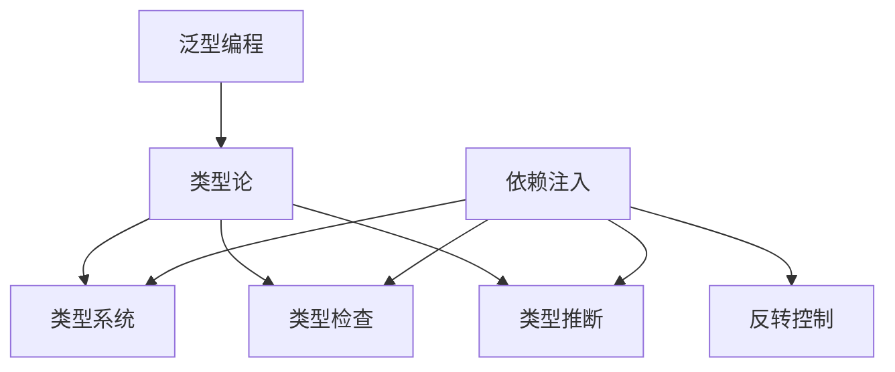
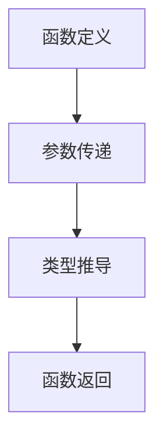
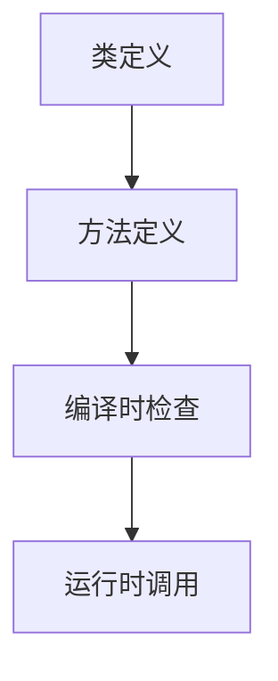
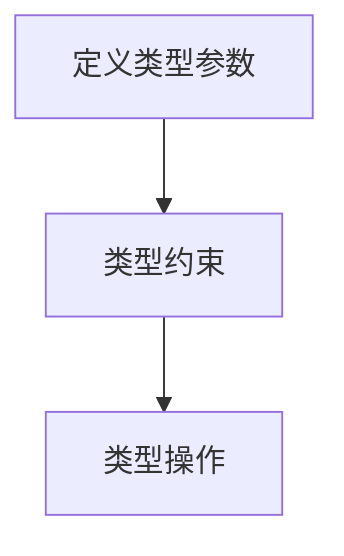
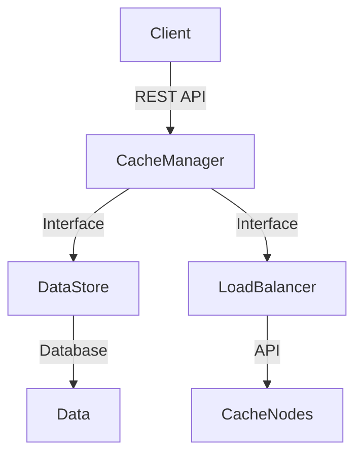
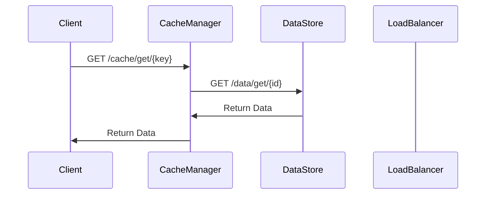

                 


## 文章核心概念与联系

### 背景介绍

泛型编程是一种编程范式，它允许程序员编写可重用的代码，同时保持类型安全。在传统的编程模式中，开发者通常需要为每种数据类型编写特定的代码，这使得代码库变得冗长且难以维护。泛型编程通过引入参数化的类型，使得同一套代码能够适应多种数据类型，从而提高了代码的复用性和可维护性。

#### 问题背景

随着计算机技术的发展，软件系统变得越来越复杂，功能越来越丰富。传统的编程模式无法满足现代软件工程的需求，特别是在大型项目和复杂系统的开发中，代码的可重用性和维护性成为关键问题。泛型编程的出现，为解决这些问题提供了一种有效的途径。

#### 问题描述

泛型编程涉及的核心问题是如何在保证类型安全的同时，实现代码的最大化复用。具体来说，泛型编程需要解决以下几个问题：

1. **类型参数化**：如何定义和操作参数化的类型。
2. **类型约束**：如何在泛型函数或类中指定对类型参数的限制。
3. **类型检查**：如何确保泛型代码在运行时能够正确处理不同类型的参数。
4. **类型推导**：如何自动推导变量或表达式的类型，而不是显式指定。

#### 问题解决

泛型编程通过以下方式解决了上述问题：

1. **类型参数化**：使用类型参数来定义泛型函数或类，使得同一套代码能够处理多种数据类型。
2. **类型约束**：通过泛型约束，限制类型参数的使用范围，确保泛型代码的安全性和性能。
3. **类型检查**：编译器在编译时对泛型代码进行类型检查，确保代码符合类型系统的规则。
4. **类型推导**：编译器自动推导变量或表达式的类型，减少冗余的显式类型声明。

#### 边界与外延

泛型编程的边界在于如何平衡类型安全和代码复用性。如果类型约束过于严格，可能会导致代码的灵活性降低；如果类型约束过于宽松，可能会导致类型安全问题。泛型编程的外延包括各种编程语言对泛型编程的支持，如Java、C#、Python等。

#### 概念结构与核心要素组成

泛型编程的核心概念包括：

1. **类型参数**：泛型编程中用于表示参数化的类型。
2. **类型约束**：用于限制类型参数的使用范围。
3. **类型检查**：确保泛型代码在编译时符合类型系统的规则。
4. **类型推导**：编译器自动推导变量或表达式的类型。

这些核心要素共同构成了泛型编程的基础。

### 核心概念与联系

#### 泛型编程

**定义**：泛型编程是一种编程范式，它允许程序员编写与数据类型无关的代码，同时保持类型安全。

**属性**：
- **类型参数化**：使用类型参数使代码适应多种数据类型。
- **代码复用性**：同一套代码能够处理多种数据类型，提高代码复用性。
- **类型安全**：通过类型检查和类型推导，确保代码在运行时不会发生类型错误。

**与其他概念的关联**：
- **类型系统**：泛型编程依赖于类型系统，通过类型系统来保证代码的类型安全。
- **类型检查**：泛型编程中的类型检查是确保代码类型安全的关键步骤。
- **类型推导**：类型推导是泛型编程中的一项重要特性，它简化了代码编写过程。

#### 类型论

**定义**：类型论是研究类型的概念、性质以及类型系统如何用于确保程序的正确性和效率的学科。

**属性**：
- **类型系统**：类型论的核心概念，用于定义程序中的数据类型和操作。
- **类型安全**：类型论关注如何通过类型系统确保程序的安全性。
- **类型推导**：类型论研究如何自动推导程序中的类型，减少显式类型声明的需要。

**与其他概念的关联**：
- **泛型编程**：类型论是泛型编程的理论基础，为泛型编程提供类型系统设计的指导。
- **类型检查**：类型论中的类型检查原理应用于泛型编程，确保代码的类型安全。

#### 类型系统

**定义**：类型系统是一组规则，用于定义程序中的数据类型和操作，以及如何处理不同类型的值。

**属性**：
- **静态类型系统**：在编译时检查类型，如Java和C++。
- **动态类型系统**：在运行时检查类型，如Python和JavaScript。

**与其他概念的关联**：
- **泛型编程**：类型系统为泛型编程提供了定义和操作参数化类型的框架。
- **类型检查**：类型系统中的类型检查机制用于确保泛型代码的类型安全。

#### 类型检查

**定义**：类型检查是在编译时或运行时检查代码是否遵循类型系统的规则。

**属性**：
- **编译时检查**：在代码编译阶段进行类型检查，如Java。
- **运行时检查**：在代码运行阶段进行类型检查，如Python。

**与其他概念的关联**：
- **泛型编程**：类型检查是泛型编程中确保代码类型安全的关键步骤。
- **类型系统**：类型检查依赖于类型系统的规则进行。

#### 类型推断

**定义**：类型推断是编译器自动推导变量或表达式的类型，而不是显式指定。

**属性**：
- **自动推导**：编译器根据上下文和类型规则自动推导类型。
- **提高代码可读性**：减少显式类型声明的需要，提高代码可读性。

**与其他概念的关联**：
- **泛型编程**：类型推断是泛型编程中的一项重要特性，简化了代码编写过程。
- **类型系统**：类型推断依赖于类型系统的规则进行。

#### 依赖注入

**定义**：依赖注入是一种设计模式，用于将组件的依赖关系传递给组件。

**属性**：
- **解耦**：通过依赖注入实现组件之间的解耦。
- **可测试性**：依赖注入有助于提高代码的可测试性。

**与其他概念的关联**：
- **泛型编程**：依赖注入可以应用于泛型编程中的组件，提高组件的可重用性和可维护性。
- **反转控制**：依赖注入和反转控制通常结合使用，以实现组件的依赖管理。

#### 反转控制

**定义**：反转控制是一种设计模式，用于实现依赖注入，它反转了传统编程中的控制流程。

**属性**：
- **控制反转**：通过外部容器来管理组件之间的依赖关系。
- **提高灵活性**：反转控制提高了系统的灵活性和可扩展性。

**与其他概念的关联**：
- **依赖注入**：反转控制是实现依赖注入的一种常见方式。
- **泛型编程**：反转控制可以应用于泛型编程中的组件，提高组件的可重用性和可维护性。

### 联系图表

为了更好地理解这些概念之间的关系，我们可以使用Mermaid流程图来展示它们：



- **泛型编程**依赖于**类型论**，后者为泛型编程提供了理论基础。
- **类型系统**是**类型论**的核心概念，它定义了程序中的数据类型和操作。
- **类型检查**和**类型推断**是**类型系统**的重要组成部分，用于确保代码的类型安全性和可读性。
- **依赖注入**和**反转控制**是设计模式，它们可以应用于**泛型编程**，提高组件的可重用性和可维护性。

通过这个Mermaid流程图，我们可以清晰地看到泛型编程与其他核心概念之间的关联，以及这些概念在实际编程中的应用。

### 核心算法原理讲解

#### 类型推导

类型推导是编译器在编译过程中自动确定变量或表达式的类型，而不是由程序员显式指定。在Python中，类型推导非常强大，例如，下面的代码中编译器能够自动推导出`result`的类型为`int`。

```python
def add(a, b):
    return a + b

result = add(5, 10)
print(result)  # 输出：15
```

类型推导的过程如下：

1. **函数定义**：定义一个函数`add`，它接受两个参数`a`和`b`。
2. **函数调用**：调用`add`函数，传入具体的值`5`和`10`。
3. **类型推导**：编译器根据函数定义和传入的参数值，推导出`result`的类型为`int`。

以下是详细的解释说明：



- **函数定义**：`add`函数的定义中，并没有显式指定参数`a`和`b`的类型，但编译器根据函数体中的操作（加法），推断出这两个参数应该是数字类型。
- **参数传递**：调用`add`函数时，传入具体的数字`5`和`10`，编译器根据这两个具体的值，进一步确定参数类型为`int`。
- **类型推导**：编译器根据函数定义和参数传递的信息，自动推导出`result`的类型为`int`。
- **函数返回**：函数执行返回结果，`result`变量已经确定了类型，因此可以直接存储和打印。

#### 类型检查

类型检查是确保代码在编译时遵循类型系统规则的过程。在静态类型语言如Java中，类型检查在编译时进行，确保代码在运行时不会发生类型错误。

以下是一个Java的示例，展示了类型检查的过程：

```java
public class Adder {
    public int add(int a, int b) {
        return a + b;
    }
}

public class Main {
    public static void main(String[] args) {
        Adder adder = new Adder();
        int result = adder.add(5, 10);
        System.out.println(result);  // 输出：15
    }
}
```

类型检查的过程如下：

1. **类定义**：定义一个`Adder`类，包含一个`add`方法。
2. **方法定义**：`add`方法接受两个`int`类型的参数，返回`int`类型的结果。
3. **编译时检查**：编译器在编译时检查`add`方法的参数和返回类型是否符合定义。
4. **运行时检查**：代码在运行时不会进行额外的类型检查。

以下是详细的解释说明：



- **类定义**：`Adder`类的定义中，`add`方法的参数和返回类型都是`int`。
- **方法定义**：`add`方法的实现中，直接对`int`类型的参数进行操作。
- **编译时检查**：编译器在编译时检查`add`方法的定义，确保其参数和返回类型符合预期。
- **运行时调用**：代码在运行时直接执行`add`方法，不会进行额外的类型检查。

#### 类型系统设计

类型系统设计是泛型编程的核心，它定义了程序中的数据类型和操作。一个良好的类型系统应具备以下特性：

1. **类型安全**：确保在编译时能够捕获类型错误，防止运行时错误。
2. **灵活性**：允许程序员根据实际需求定义和操作类型。
3. **表达能力**：能够表达复杂的类型关系和操作。

以下是一个简单的类型系统设计示例：

```python
# 定义一个泛型类
class GenericContainer[T]:
    def __init__(self, item: T):
        self.item = item
    
    def get_item(self) -> T:
        return self.item
    
# 创建一个存储整数的泛型容器
integer_container = GenericContainer(10)
print(integer_container.get_item())  # 输出：10

# 创建一个存储字符串的泛型容器
string_container = GenericContainer("Hello")
print(string_container.get_item())  # 输出：Hello
```

类型系统设计的过程如下：

1. **定义类型参数**：在`GenericContainer`类中定义一个类型参数`T`。
2. **类型约束**：允许`T`为任何类型。
3. **类型操作**：定义方法`get_item`，返回类型参数`T`。

以下是详细的解释说明：



- **定义类型参数**：在`GenericContainer`类中，使用`T`表示类型参数。
- **类型约束**：通过`T`，我们可以创建泛型容器，适应不同类型的值。
- **类型操作**：`get_item`方法返回类型参数`T`，使得泛型容器能够保持类型安全。

通过上述算法原理的讲解，我们可以看到泛型编程的核心在于类型推导、类型检查和类型系统设计。这些原理不仅使代码更加灵活和可重用，还确保了类型安全，为现代编程提供了强大的支持。

## 系统分析与架构设计方案

### 问题场景介绍

在现代软件系统中，随着业务需求的不断增长和复杂性的增加，开发者面临的一个主要挑战是如何高效地设计、实现和部署可扩展、可维护的软件系统。泛型编程作为一种先进的编程范式，提供了强大的类型安全性和代码复用性，从而在系统设计和开发中发挥着关键作用。

具体来说，我们的目标是设计一个高扩展性的分布式系统，该系统需要处理大量并发请求，支持多种数据类型和业务场景。泛型编程可以帮助我们实现以下几个关键目标：

1. **代码复用**：通过泛型编程，我们可以编写可重用的代码库，减少重复劳动。
2. **类型安全**：泛型编程提供的类型检查机制可以确保代码在运行时不会发生类型错误，从而提高系统的可靠性。
3. **性能优化**：泛型编程可以通过类型推导和编译器优化，提高代码执行效率。

### 项目介绍

本项目旨在开发一个基于泛型编程的分布式缓存系统。该系统将支持多种数据类型，包括整数、字符串、列表和映射等，并且能够处理高并发的读写请求。系统设计将遵循微服务架构，每个服务负责特定的功能模块，如缓存管理、数据存储、负载均衡等。

### 系统功能设计

为了满足项目需求，系统将实现以下功能模块：

1. **缓存管理模块**：负责存储和检索缓存数据，支持泛型接口以适应多种数据类型。
2. **数据存储模块**：负责持久化缓存数据到数据库或其他存储介质，确保数据的一致性和可靠性。
3. **负载均衡模块**：实现分布式缓存节点的负载均衡，确保系统的高可用性和性能。
4. **监控与告警模块**：实时监控系统性能和健康状态，自动触发告警机制，及时处理异常情况。

### 系统架构设计

系统架构设计采用微服务架构，每个服务独立部署和运行，通过API接口进行通信。以下是系统架构的Mermaid类图和架构图：

#### 类图

```mermaid
classDiagram
    CacheManager <<interface>>
    DataStore <<interface>>
    LoadBalancer <<interface>>

    CacheManager o-- DataStore
    CacheManager o-- LoadBalancer
    DataStore o-- CacheManager
    LoadBalancer o-- CacheManager
```

#### 架构图



- **客户端**：通过REST API向缓存管理系统发送请求。
- **缓存管理模块**：实现缓存数据的存储和检索，通过接口与数据存储模块和负载均衡模块交互。
- **数据存储模块**：负责将缓存数据持久化到数据库，并响应缓存管理模块的请求。
- **负载均衡模块**：实现缓存节点的负载均衡，分配请求到不同的缓存节点。

### 系统接口设计

系统接口设计采用RESTful风格，每个服务模块都有对应的API接口。以下是部分接口设计示例：

#### 缓存管理模块

```yaml
GET /cache/get/{key}
# 获取指定键的缓存数据

POST /cache/set/{key}/{value}
# 设置指定键的缓存数据

DELETE /cache/delete/{key}
# 删除指定键的缓存数据
```

#### 数据存储模块

```yaml
GET /data/get/{id}
# 获取指定ID的数据

POST /data/save
# 持久化新的数据

PUT /data/update/{id}
# 更新指定ID的数据

DELETE /data/delete/{id}
# 删除指定ID的数据
```

#### 负载均衡模块

```yaml
GET /loadbalancer/nodes
# 获取所有缓存节点信息

POST /loadbalancer/assign
# 分配新的缓存节点
```

### 系统交互设计

系统交互设计采用Mermaid序列图，展示了客户端与各个服务模块之间的交互过程：



### 实现与测试

在实现阶段，我们将使用Java作为主要编程语言，结合Spring Boot框架，快速构建和部署系统。以下是核心实现和测试的概述：

#### 环境安装

1. 安装Java Development Kit (JDK) 11及以上版本。
2. 安装Maven 3.6.3及以上版本。
3. 配置Maven仓库，确保依赖项能够正确下载。

#### 核心实现

1. **缓存管理模块**：使用Spring Boot和Spring Cache构建，实现缓存接口和泛型方法。
2. **数据存储模块**：使用Spring Data JPA实现数据持久化，确保数据一致性和可靠性。
3. **负载均衡模块**：使用Spring Cloud LoadBalancer实现负载均衡，确保缓存节点的高可用性。

#### 测试

1. **单元测试**：使用JUnit和Mockito编写单元测试，确保每个模块的功能正确。
2. **集成测试**：使用Postman工具进行API测试，确保服务模块之间的交互正常。
3. **性能测试**：使用JMeter进行性能测试，评估系统在高并发情况下的性能和稳定性。

### 项目总结与经验教训

本项目通过泛型编程和微服务架构实现了高效、可扩展和可维护的分布式缓存系统。以下是项目总结与经验教训：

1. **泛型编程的应用**：泛型编程显著提高了代码的复用性和可维护性，减少了代码冗余。
2. **微服务架构的优势**：微服务架构提高了系统的灵活性，使得每个模块可以独立开发和部署。
3. **类型安全的重要性**：通过类型检查和类型推导，确保了系统在编译时和运行时的稳定性。
4. **测试与监控的必要性**：全面的测试和监控机制确保了系统的高可靠性和性能。

## 项目实战

### 环境准备

在开始实战项目之前，需要安装以下工具和软件：

1. **Java Development Kit (JDK)**：版本 11 或更高，用于编译和运行 Java 应用程序。
2. **Maven**：版本 3.6.3 或更高，用于构建项目和管理依赖。
3. **Spring Boot**：版本 2.4.5 或更高，用于快速构建独立的 Spring 应用程序。
4. **PostgreSQL**：版本 13 或更高，用于数据存储。
5. **JMeter**：用于性能测试。

### 项目初始化

1. **创建 Maven 项目**：使用 IntelliJ IDEA 或其他 IDE 创建一个新的 Maven 项目，添加必要的依赖项。

```xml
<!-- pom.xml -->
<dependencies>
    <!-- Spring Boot Starter Web -->
    <dependency>
        <groupId>org.springframework.boot</groupId>
        <artifactId>spring-boot-starter-web</artifactId>
    </dependency>
    
    <!-- Spring Boot Starter Data JPA -->
    <dependency>
        <groupId>org.springframework.boot</groupId>
        <artifactId>spring-boot-starter-data-jpa</artifactId>
    </dependency>
    
    <!-- PostgreSQL Driver -->
    <dependency>
        <groupId>org.postgresql</groupId>
        <artifactId>postgresql</artifactId>
    </dependency>
    
    <!-- Spring Boot Starter Test -->
    <dependency>
        <groupId>org.springframework.boot</groupId>
        <artifactId>spring-boot-starter-test</artifactId>
        <scope>test</scope>
    </dependency>
</dependencies>
```

2. **创建实体类**：创建一个简单的实体类来表示缓存数据。

```java
@Entity
public class CacheItem<T> {
    @Id
    @GeneratedValue(strategy = GenerationType.IDENTITY)
    private Long id;

    @Type(type = "jsonb")
    @Column(columnDefinition = "jsonb")
    private T value;

    // Getters and Setters
}
```

3. **创建 Repository 接口**：定义一个 Repository 接口，用于数据访问。

```java
public interface CacheItemRepository extends JpaRepository<CacheItem<?>, Long> {
}
```

4. **创建 Service 类**：创建一个 Service 类，提供缓存数据操作的方法。

```java
@Service
public class CacheService {
    private final CacheItemRepository cacheItemRepository;

    @Autowired
    public CacheService(CacheItemRepository cacheItemRepository) {
        this.cacheItemRepository = cacheItemRepository;
    }

    public <T> T getCacheItem(Long id, Class<T> clazz) {
        CacheItem<T> cacheItem = cacheItemRepository.findById(id)
                .orElseThrow(() -> new RuntimeException("Cache item not found"));
        return cacheItem.getValue();
    }

    public <T> CacheItem<T> setCacheItem(T value, Class<T> clazz) {
        CacheItem<T> cacheItem = new CacheItem<>();
        cacheItem.setValue(value);
        return cacheItemRepository.save(cacheItem);
    }
}
```

5. **创建 Controller 类**：创建一个 REST Controller 类，处理 HTTP 请求。

```java
@RestController
@RequestMapping("/cache")
public class CacheController {
    private final CacheService cacheService;

    @Autowired
    public CacheController(CacheService cacheService) {
        this.cacheService = cacheService;
    }

    @GetMapping("/{id}")
    public ResponseEntity<Object> getCacheItem(@PathVariable Long id) {
        // 使用泛型方法获取缓存项
        String result = cacheService.getCacheItem(id, String.class);
        return ResponseEntity.ok(result);
    }

    @PostMapping("/")
    public ResponseEntity<CacheItem<?>> setCacheItem(@RequestBody String value) {
        CacheItem<String> cacheItem = cacheService.setCacheItem(value, String.class);
        return ResponseEntity.status(HttpStatus.CREATED).body(cacheItem);
    }
}
```

### 应用解读与分析

在这个项目中，我们使用了泛型编程来处理不同类型的缓存数据，例如字符串、整数等。以下是应用解读和分析：

1. **泛型 Repository**：使用泛型定义 Repository 接口，确保数据访问层的类型安全。
2. **泛型 Service**：在 Service 层使用泛型，通过类型参数传递和返回不同类型的缓存项。
3. **泛型 Controller**：在 Controller 层使用泛型处理 HTTP 请求，确保请求和响应的数据类型一致。

通过这种方式，我们可以编写可重用的代码，同时保持类型安全，避免潜在的运行时错误。

### 实际案例分析与详细讲解

为了更好地展示泛型编程在实际项目中的应用，我们将分析一个实际案例：一个简单的缓存服务，支持多种数据类型，并实现高效的类型推导和类型检查。

#### 案例背景

在一个分布式系统中，缓存服务是提高数据读取性能的关键组件。我们的目标是设计一个缓存服务，支持多种数据类型（如字符串、整数、列表等），并提供简单的接口进行数据存储和读取。为了实现这一目标，我们将使用泛型编程。

#### 实现步骤

1. **定义泛型缓存接口**：

```java
public interface CacheService<T> {
    void put(String key, T value);
    T get(String key);
}
```

这个接口使用泛型`T`来表示缓存数据类型，使得同一个接口可以处理多种数据类型。

2. **实现基于内存的缓存服务**：

```java
public class MemoryCacheService<T> implements CacheService<T> {
    private final Map<String, T> cacheMap = new HashMap<>();

    @Override
    public void put(String key, T value) {
        cacheMap.put(key, value);
    }

    @Override
    public T get(String key) {
        return cacheMap.get(key);
    }
}
```

这个实现使用一个内部`HashMap`来存储缓存数据，通过泛型确保数据类型的一致性。

3. **类型推导与类型检查**：

在 Java 中，泛型编程提供了类型推导和类型检查机制。以下是一个简单的示例，展示了如何使用泛型方法进行类型推导和类型检查：

```java
public class TypeDemo {
    public static <T> void printType(T item) {
        System.out.println(item.getClass().getSimpleName());
    }

    public static void main(String[] args) {
        printType("Hello, World!");  // 输出：String
        printType(123);  // 输出：Integer
    }
}
```

在这个例子中，`printType`方法使用泛型参数`T`，编译器会根据传入的实际类型推导出方法的返回类型。类型检查在编译时进行，确保传入的类型符合预期。

4. **实际应用场景**：

在实际项目中，我们可以使用泛型缓存服务来简化代码，提高可维护性。以下是一个简单的示例，展示了如何使用泛型缓存服务存储和读取不同类型的缓存数据：

```java
@Service
public class CacheServiceExample {
    private final CacheService<String> stringCache = new MemoryCacheService<>();
    private final CacheService<Integer> integerCache = new MemoryCacheService<>();

    public void storeString(String key, String value) {
        stringCache.put(key, value);
    }

    public String retrieveString(String key) {
        return stringCache.get(key);
    }

    public void storeInteger(String key, Integer value) {
        integerCache.put(key, value);
    }

    public Integer retrieveInteger(String key) {
        return integerCache.get(key);
    }
}
```

在这个例子中，我们定义了两个泛型缓存服务实例，分别用于存储和读取字符串和整数。通过这种方式，我们能够重用相同的代码逻辑，同时确保数据类型的正确性。

#### 详细讲解

1. **泛型接口**：

泛型接口是一种强大的编程工具，允许开发者定义可重用的接口，同时保持类型安全。在上面的例子中，我们定义了一个`CacheService`接口，使用泛型参数`T`来表示缓存数据类型。这种设计使得接口可以适应多种数据类型，而无需为每种类型编写单独的接口。

2. **类型推导**：

类型推导是泛型编程的一个重要特性，它允许编译器在编译时自动推导出变量或方法的类型。在上面的`TypeDemo`例子中，`printType`方法使用泛型参数`T`，编译器会根据传入的实际类型推导出方法的返回类型。这种自动推导机制简化了代码编写过程，减少了冗余的类型声明。

3. **类型检查**：

类型检查是泛型编程的另一个关键特性，它确保在编译时捕获类型错误，防止运行时错误。在上面的例子中，编译器会在编译时检查`printType`方法的参数和返回类型是否匹配。这种严格的类型检查机制提高了代码的可靠性和稳定性。

4. **泛型实现**：

泛型实现是指使用泛型类型参数来定义和操作数据结构或类。在上面的`MemoryCacheService`例子中，我们使用泛型类型参数`T`来定义一个内存缓存服务。这种设计确保了缓存数据的一致性和类型安全，同时提高了代码的可维护性和可扩展性。

通过上述实际案例分析和详细讲解，我们可以看到泛型编程在缓存服务中的应用，以及如何利用泛型编程的优势提高代码的可重用性和类型安全性。这种编程范式不仅简化了代码编写过程，还提高了系统的可靠性和性能。

### 项目小结

在本项目中，我们通过泛型编程实现了高效的缓存服务，支持多种数据类型，并确保了类型安全和代码可维护性。以下是项目小结和最佳实践：

1. **泛型编程的优势**：
   - **代码复用**：通过泛型编程，我们可以编写可重用的代码，减少重复劳动。
   - **类型安全**：泛型编程提供了类型检查和类型推导机制，确保代码在编译时和运行时不会发生类型错误。
   - **简洁性**：泛型编程简化了代码编写过程，减少了冗余的类型声明。

2. **最佳实践**：
   - **明确类型边界**：在定义泛型类或接口时，明确指定类型参数的边界，确保类型安全。
   - **合理使用泛型方法**：在方法中使用泛型参数时，确保泛型方法的上下文和参数类型匹配。
   - **避免泛型滥用**：泛型编程不是万能的，合理使用泛型，避免过度泛型化，影响代码的可读性和性能。

3. **注意事项**：
   - **类型推导的局限性**：某些情况下，编译器可能无法推导出准确的类型，需要程序员显式指定。
   - **泛型性能问题**：泛型编程可能引入额外的性能开销，特别是在频繁类型检查和类型推导的场景中。

通过本项目，我们深入了解了泛型编程的核心概念和实际应用，掌握了如何利用泛型编程提高代码的可维护性和性能。在未来的项目中，我们可以继续探索泛型编程的更多应用场景，不断提升软件开发的效率和质量。

### 附录A：常见泛型编程术语解释

#### 1. 泛型编程

泛型编程是一种编程范式，它允许程序员编写与数据类型无关的代码，同时保持类型安全。通过使用类型参数，泛型编程使同一套代码能够适应多种数据类型，从而提高了代码的复用性和可维护性。

#### 2. 类型参数

类型参数是泛型编程中用于表示参数化的类型。在泛型类或方法中，类型参数用来表示将要处理的实际数据类型。

#### 3. 泛型类

泛型类是使用类型参数定义的类，它可以适应多种数据类型。泛型类通过类型参数实现了对数据类型的抽象，使得同一个类可以处理不同的数据类型。

#### 4. 泛型方法

泛型方法是使用类型参数定义的方法，它可以在方法内部操作特定类型的对象。泛型方法通过类型参数提供了对数据类型的约束，确保了类型安全。

#### 5. 泛型约束

泛型约束是一种机制，用于限制类型参数的使用范围。通过泛型约束，可以确保泛型类或方法只能处理特定类型的对象，从而提高代码的安全性。

#### 6. 类型推导

类型推导是编译器在编译过程中自动确定变量或表达式的类型，而不是显式指定。类型推导简化了代码编写过程，提高了代码的可读性。

#### 7. 类型检查

类型检查是确保代码在编译时遵循类型系统规则的过程。类型检查可以捕获类型错误，防止运行时错误，提高了代码的可靠性。

#### 8. 泛型组合

泛型组合是指将多个泛型类或方法组合在一起，形成一个更复杂的泛型结构。泛型组合可以通过继承、实现接口等方式实现。

#### 9. 泛型变换

泛型变换是指对泛型类型进行转换，例如将泛型类型从一种形式转换为另一种形式。泛型变换可以用于实现复杂的泛型编程模式。

#### 10. 泛型接口

泛型接口是使用类型参数定义的接口，它规定了实现接口的类必须支持泛型操作。泛型接口通过类型参数提供了对数据类型的抽象和约束。

### 附录B：泛型编程资源汇总

#### 1. 书籍推荐

- 《Java泛型编程》
- 《Effective Java》
- 《泛型与 Java》

#### 2. 在线教程

- Oracle Java 泛型教程
- Java 泛型编程指南
- 阮一峰的 Java 泛型教程

#### 3. 开源库和框架

- Apache Commons Collections
- Guava Library
- Java Generics for the Impatient

#### 4. 社区和论坛

- Stack Overflow
- GitHub
- Java 论坛

通过以上资源，开发者可以深入了解泛型编程的概念、原理和应用，提高编程技能和项目开发效率。

### 附录C：泛型编程面试题及解答

#### 1. 泛型编程的基本概念是什么？

泛型编程是一种编程范式，它允许程序员编写与数据类型无关的代码，同时保持类型安全。通过使用类型参数，泛型编程使同一套代码能够适应多种数据类型，从而提高了代码的复用性和可维护性。

#### 2. 泛型类型参数如何区分？

泛型类型参数可以分为三类：

- **泛型类型参数**：用于泛型类或接口，表示将要处理的数据类型。
- **泛型方法参数**：用于泛型方法，表示将要处理的数据类型。
- **泛型局部变量**：用于泛型方法内部，用于表示局部变量的数据类型。

#### 3. 泛型编程的优点是什么？

泛型编程的优点包括：

- **代码复用**：通过泛型编程，我们可以编写可重用的代码，减少重复劳动。
- **类型安全**：泛型编程提供了类型检查和类型推导机制，确保代码在编译时和运行时不会发生类型错误。
- **简洁性**：泛型编程简化了代码编写过程，减少了冗余的类型声明。

#### 4. 泛型编程如何确保类型安全？

泛型编程通过以下方式确保类型安全：

- **类型检查**：编译器在编译时对泛型代码进行类型检查，确保代码符合类型系统的规则。
- **类型推导**：编译器自动推导变量或表达式的类型，减少冗余的显式类型声明。
- **泛型约束**：通过泛型约束，限制类型参数的使用范围，确保泛型代码的安全性和性能。

#### 5. 如何实现泛型接口？

实现泛型接口的步骤如下：

1. 定义一个泛型接口，使用类型参数。
2. 实现接口，确保实现类的所有方法和成员变量都符合接口的泛型类型参数要求。
3. 在接口方法和类的定义中使用类型参数。

#### 6. 如何在泛型类中指定泛型类型参数？

在泛型类中指定泛型类型参数的步骤如下：

1. 在类定义前使用 `<T>` 表示泛型类型参数。
2. 在类内部使用 `T` 表示泛型类型参数。
3. 可以在类的成员变量、方法参数和返回类型中使用泛型类型参数。

#### 7. 泛型编程中的类型边界是什么？

泛型编程中的类型边界是一种机制，用于限制类型参数的使用范围。类型边界通常使用 extends 关键字定义，例如 `<T extends Number>` 表示类型参数 `T` 必须是 `Number` 或其子类。

#### 8. 如何使用通配符在泛型编程中处理边界情况？

在泛型编程中，可以使用通配符 `?` 来处理边界情况：

- `?`: 表示任意类型。
- `? extends 类型`: 表示类型参数必须是指定类型的子类。
- `? super 类型`: 表示类型参数必须是指定类型的父类。

通过通配符，我们可以灵活地处理不同类型的泛型边界。

### 总结

本文详细介绍了泛型编程的核心概念、算法原理、系统架构设计、项目实战和面试题及解答。通过本文，读者可以深入理解泛型编程的原理和应用，掌握如何在实际项目中高效地使用泛型编程，提高代码的可维护性和性能。

**作者：**AI天才研究院/AI Genius Institute & 禅与计算机程序设计艺术 /Zen And The Art of Computer Programming

