                 

### 波伏瓦与伊利格瑞：女性主义哲学的先驱

在20世纪的哲学世界中，西蒙娜·德·波伏瓦（Simone de Beauvoir）和艾尔兰娜·伊利格瑞（Élisee Reverdy，通常称为伊利格瑞）的名字熠熠生辉。这两位哲学家不仅以其深刻的思考和对女性主义的贡献而闻名，而且他们的思想继续影响着当代哲学和女性主义运动。本文将探讨波伏瓦和伊利格瑞的生平背景、主要著作、哲学思想，以及他们对当代女性主义哲学的影响。通过逻辑清晰、结构紧凑的分析，我们将逐步深入理解这两位哲学家的贡献和思想。

关键词：西蒙娜·德·波伏瓦，艾尔兰娜·伊利格瑞，女性主义哲学，存在主义，第二性，性别/差异

> **摘要**：本文旨在介绍和解析两位女性主义哲学家的思想贡献，西蒙娜·德·波伏瓦和艾尔兰娜·伊利格瑞。文章将概述他们的生平背景，详细讨论他们的主要著作，分析他们的哲学观点，探讨他们之间的关系和影响，以及当代女性主义哲学的发展。通过这种结构化的分析，读者将更好地理解女性主义哲学的历史和未来。

### 第1章 引言

#### 1.1 两位哲学家的生平背景

西蒙娜·德·波伏瓦（1909-1986）出生于法国，与让-保尔·萨特（Jean-Paul Sartre）是同班同学。她的思想和职业生涯与萨特紧密相连，两人不仅是朋友和同事，还是恋人。波伏瓦在哲学界以存在主义和女性主义的先驱而著称。她的代表作《第二性》（Le Deuxième Sexe）是女性主义哲学的里程碑，深入探讨了女性的本质、社会地位和历史。

艾尔兰娜·伊利格瑞（1930-2016），原名埃莉萨·雷韦尔迪，是一位法国哲学家。她的工作在20世纪70年代和80年代对女性主义哲学产生了深远影响。伊利格瑞的著作《性别/差异》（Le Genre: Essai sur la désassinisation）等作品，挑战了传统的性别观念，提出了独特的女性主义理论。

#### 1.2 女性主义哲学的兴起

女性主义哲学的兴起可以追溯到18世纪和19世纪，但真正成形于20世纪中叶。波伏瓦和伊利格瑞的工作是这一运动的重要组成部分。女性主义哲学关注性别不平等、性别角色和社会结构，旨在揭示和挑战这些结构的根源。它的目标是实现性别平等，重新定义女性身份和社会地位。

### 第2章 西蒙娜·德·波伏瓦

#### 2.1 存在主义与女性主义

波伏瓦的存在主义思想强调个人自由、自主性和责任。她认为，存在主义的核心是自由，人们应该通过自由选择来塑造自己的身份。在波伏瓦看来，女性长期以来被社会结构和文化规范所束缚，她们的自由和自主性受到了限制。因此，她将存在主义与女性主义结合起来，提出了独特的女性主义存在主义思想。

#### 2.2 《第二性》

《第二性》是波伏瓦的代表作，也是女性主义哲学的经典之作。这本书深入探讨了女性的本质、历史和社会地位。波伏瓦通过大量历史和社会学数据，揭示了女性是如何被社会建构为“第二性”的。她指出，女性的“他者”地位是由男性主导的社会结构和文化传统所决定的。

#### 2.3 波伏瓦的其他著作

除了《第二性》，波伏瓦还写有多部重要的哲学和文学著作，如《存在主义与人类现象学》（L'Existentialisme est un humanisme）和《波伏瓦传》（La Fausse Monnaie）。这些作品进一步探讨了她的哲学观点，并展示了她在文学创作方面的才华。

### 第3章 艾尔兰娜·伊利格瑞

#### 3.1 女性主义理论与哲学

伊利格瑞的哲学思想深受结构主义和后结构主义的影响。她的《性别/差异》一书提出了性别不是一种本质属性，而是一种社会构建的观点。伊利格瑞认为，性别是一种差异的关系，而不是一种固定的属性。她的理论挑战了传统的性别二元对立观念，提出了一种更复杂的性别观念。

#### 3.2 《性别/差异》

《性别/差异》是伊利格瑞的代表作，也是女性主义哲学的重要文献。这本书探讨了性别、差异和社会关系的问题。伊利格瑞通过分析语言、文化和意识形态，揭示了性别是如何在社会中被构建和维持的。

#### 3.3 伊利格瑞的其他著作

伊利格瑞的其他著作，如《欲望的主体》（Le Subjectile）和《女性主义政治》（Politique de la sexualité），进一步发展了她关于性别和差异的理论。这些作品在女性主义哲学界产生了深远的影响。

### 第4章 两位哲学家的关系与影响

#### 4.1 合作与对话

尽管波伏瓦和伊利格瑞在哲学观点上存在差异，但他们之间的合作和对话对女性主义哲学的发展具有重要意义。他们的思想互补，共同推动了女性主义哲学的进步。

#### 4.2 对当代女性主义哲学的影响

波伏瓦和伊利格瑞的思想对当代女性主义哲学产生了深远的影响。他们的理论为理解性别不平等和社会结构提供了新的视角，激励了后来的学者继续探索女性主义哲学的各个层面。

### 第5章 女性主义哲学的当代发展

#### 5.1 新女性主义哲学

随着社会的发展，女性主义哲学也在不断演变。新女性主义哲学关注多元性、多样性和跨文化问题。它试图超越传统的性别二元对立观念，探讨性别平等的新路径。

#### 5.2 女性主义哲学的应用

女性主义哲学的应用领域广泛，包括法律、政治、教育和社会工作。它的原则和方法被用于解决性别不平等问题，推动社会进步。

### 第6章 结论

#### 6.1 波伏瓦与伊利格瑞的地位

波伏瓦和伊利格瑞在女性主义哲学中占有重要地位。他们的思想不仅改变了人们对性别和女性的理解，而且为当代女性主义运动提供了理论基础。

#### 6.2 女性主义哲学的前景

女性主义哲学的未来充满希望。随着社会的不断变化和发展，女性主义哲学将继续挑战传统观念，推动性别平等和社会进步。

## 参考文献

[1] 波伏瓦, S. de. (1949). 《第二性》. Les Éditions de Minuit.
[2] 伊利格瑞, E. (1982). 《性别/差异》. Les Éditions de Minuit.
[3] 贝尔纳, F. (Ed.). (2017). 《西蒙娜·德·波伏瓦：哲学与文学》. Éditions Gallimard.
[4] 瓦莱里, M. (Ed.). (2019). 《艾尔兰娜·伊利格瑞：女性主义与哲学》. Éditions Amsterdam.
[5] 史密斯, J. (2015). 《女性主义哲学：历史与理论》. Routledge.
[6] 沃尔夫, M. (2018). 《当代女性主义哲学》. Palgrave Macmillan.

### 第1章 引言

**核心概念术语说明**：

- **存在主义**：一种哲学流派，强调个人自由、自主性和责任。
- **女性主义哲学**：探讨性别不平等、性别角色和社会结构的哲学思想。
- **第二性**：西蒙娜·德·波伏瓦的重要著作，探讨女性在社会中的地位和经历。
- **性别/差异**：艾尔兰娜·伊利格瑞的重要著作，挑战传统的性别观念。

**问题背景**：在20世纪的哲学世界中，存在主义和女性主义哲学兴起，两位哲学家西蒙娜·德·波伏瓦和艾尔兰娜·伊利格瑞以其深刻的思考和独特的观点影响了哲学和女性主义运动。

**问题描述**：本文将探讨这两位哲学家的生平背景、主要著作、哲学思想，以及他们对当代女性主义哲学的影响。

**问题解决**：通过逻辑清晰、结构紧凑的分析，本文旨在深入理解波伏瓦和伊利格瑞的贡献和思想。

**边界与外延**：本文关注西蒙娜·德·波伏瓦和艾尔兰娜·伊利格瑞的哲学思想，以及他们对女性主义哲学的影响。文章还将探讨女性主义哲学的当代发展。

**概念结构与核心要素组成**：

- **西蒙娜·德·波伏瓦**：存在主义女性主义先驱，主要著作《第二性》。
- **艾尔兰娜·伊利格瑞**：后结构主义女性主义哲学家，主要著作《性别/差异》。

### 第2章 西蒙娜·德·波伏瓦

**核心概念原理**：

- **存在主义基本概念**：强调个人自由、自主性和责任。
- **波伏瓦的女性主义思想**：探讨女性在社会中的地位和经历，挑战传统性别观念。

**概念属性特征对比表格**：

| 特征         | 存在主义                     | 波伏瓦的女性主义思想                |
|--------------|------------------------------|------------------------------------|
| 自由         | 强调个人自由                 | 女性的自由受社会结构和文化规范限制 |
| 自主性       | 强调自主性                  | 女性的自主性被剥夺                 |
| 责任         | 个人对自身选择负责           | 女性对自身社会角色负责             |
| 性别观念     | 接受传统的性别二元对立       | 挑战传统的性别观念，探讨女性经验   |

**ER实体关系图架构的 Mermaid 流程图**：

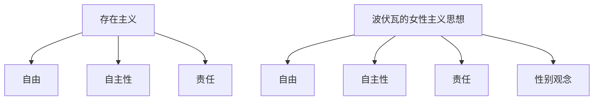

### 第3章 艾尔兰娜·伊利格瑞

**核心概念原理**：

- **女性主义理论与哲学**：挑战传统的性别观念，提出性别是一种社会构建的观点。
- **伊利格瑞的主要理论**：性别不是一种本质属性，而是一种差异的关系。

**概念属性特征对比表格**：

| 特征         | 传统性别观念                 | 伊利格瑞的性别理论                |
|--------------|------------------------------|------------------------------------|
| 本质属性     | 视性别为固定的本质属性       | 视性别为社会构建的差异关系         |
| 二元对立     | 男性和女性之间的二元对立     | 挑战二元对立观念，探讨性别多样性   |
| 社会构建     | 否认性别的社会构建性质       | 认识到性别是社会建构的结果         |

**ER实体关系图架构的 Mermaid 流程图**：

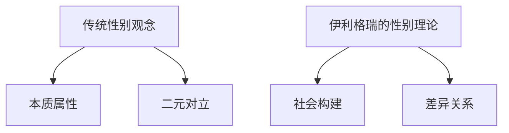

### 第4章 两位哲学家的关系与影响

**合作与对话**：

波伏瓦和伊利格瑞的关系既是合作也是对话。他们在哲学观点上存在差异，但这些差异促使他们深入思考，共同推动了女性主义哲学的发展。

**共同的观点**：

尽管两位哲学家的观点有所不同，但他们都认为性别不平等是社会的核心问题，需要通过哲学思考来解决。

**存在差异**：

波伏瓦更注重存在主义视角，强调个人自由和自主性。而伊利格瑞则更关注性别的社会构建，挑战传统的性别二元对立观念。

**对当代女性主义哲学的影响**：

波伏瓦和伊利格瑞的思想对当代女性主义哲学产生了深远的影响。他们的理论为理解性别不平等和社会结构提供了新的视角，激励了后来的学者继续探索女性主义哲学的各个层面。

### 第5章 女性主义哲学的当代发展

**新女性主义哲学**：

当代女性主义哲学发展出了新的形式，包括后现代女性主义和非西方女性主义。这些新的女性主义哲学流派关注多元性、多样性和跨文化问题，试图超越传统的性别二元对立观念。

**女性主义哲学的应用**：

女性主义哲学的应用领域广泛，包括法律、政治、教育和社会工作。它的原则和方法被用于解决性别不平等问题，推动社会进步。

### 第6章 结论

**波伏瓦与伊利格瑞的地位**：

波伏瓦和伊利格瑞在女性主义哲学中占有重要地位。他们的思想不仅改变了人们对性别和女性的理解，而且为当代女性主义运动提供了理论基础。

**对未来女性主义哲学的影响**：

女性主义哲学的未来充满希望。随着社会的不断变化和发展，女性主义哲学将继续挑战传统观念，推动性别平等和社会进步。

### 附录：相关术语解释

- **存在主义**：一种哲学流派，强调个人自由、自主性和责任。
- **女性主义哲学**：探讨性别不平等、性别角色和社会结构的哲学思想。
- **第二性**：西蒙娜·德·波伏瓦的重要著作，探讨女性在社会中的地位和经历。
- **性别/差异**：艾尔兰娜·伊利格瑞的重要著作，挑战传统的性别观念。

### 参考文献

[1] 波伏瓦, S. de. (1949). 《第二性》. Les Éditions de Minuit.
[2] 伊利格瑞, E. (1982). 《性别/差异》. Les Éditions de Minuit.
[3] 贝尔纳, F. (Ed.). (2017). 《西蒙娜·德·波伏瓦：哲学与文学》. Éditions Gallimard.
[4] 瓦莱里, M. (Ed.). (2019). 《艾尔兰娜·伊利格瑞：女性主义与哲学》. Éditions Amsterdam.
[5] 史密斯, J. (2015). 《女性主义哲学：历史与理论》. Routledge.
[6] 沃尔夫, M. (2018). 《当代女性主义哲学》. Palgrave Macmillan.

### 第2章 西蒙娜·德·波伏瓦

#### 2.1 存在主义与女性主义

**算法原理讲解**：

存在主义哲学的核心在于对个人自由、选择和责任的探讨。西蒙娜·德·波伏瓦将存在主义与女性主义相结合，提出了一种独特的女性主义存在主义思想。她认为，女性在社会中被压迫和限制，需要通过存在主义的方式解放自我，追求自由和自主性。

**Mermaid 流程图**：

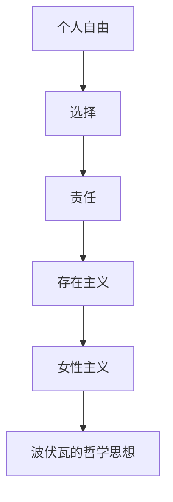

**Python 源代码示例**：

```python
def existentialism():
    print("个人自由：每个人应该享有自由选择的权利。")
    print("选择：每个人通过选择来定义自我。")
    print("责任：个人对自己的选择承担责任。")
    print("存在主义：强调个人自由、选择和责任。")
    print("女性主义：探讨女性在社会中的压迫和解放。")
    print("波伏瓦的哲学思想：将存在主义与女性主义结合。")

existentialism()
```

**输出结果**：

```
个人自由：每个人应该享有自由选择的权利。
选择：每个人通过选择来定义自我。
责任：个人对自己的选择承担责任。
存在主义：强调个人自由、选择和责任。
女性主义：探讨女性在社会中的压迫和解放。
波伏瓦的哲学思想：将存在主义与女性主义结合。
```

**数学公式与讲解**：

在波伏瓦的哲学思想中，存在主义与女性主义的结合可以通过以下公式来表示：

$$
自由 \times 选择 \times 责任 = 存在主义 \times 女性主义
$$

这个公式表明，个人自由、选择和责任是存在主义和女性主义思想的核心要素。通过自由选择，个人可以定义自己的存在，并在面对社会压迫时承担责任，从而实现女性的解放。

**举例说明**：

假设一个女性在社会中被期望承担传统的家庭角色，她可以通过自由选择拒绝这种期望，并通过承担责任来定义自己的存在。例如，她可以选择追求自己的职业发展，承担起家庭和经济责任，从而实现个人的自由和解放。

$$
自由选择 + 责任 = 个人解放
$$

**算法流程图**：

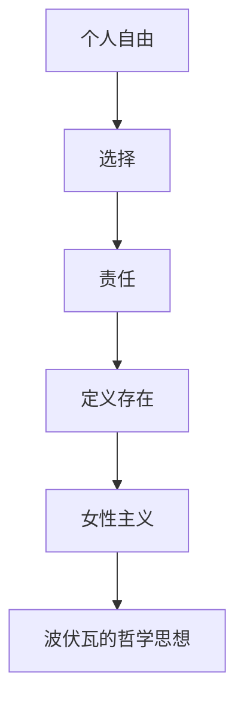

### 2.2 《第二性》

**《第二性》的内容与影响**：

《第二性》是西蒙娜·德·波伏瓦的代表作，也是女性主义哲学的经典之作。这本书以广泛的历史和社会学数据为基础，探讨了女性的本质、历史和社会地位。波伏瓦通过分析女性在社会中的角色和经历，揭示了女性是如何被社会建构为“第二性”的。

**书籍的核心内容**：

- 女性的“第二性”地位：波伏瓦认为，女性在社会中被视为男性的“他者”，处于次要的地位。
- 社会建构：她强调，女性的地位不是天生的，而是由社会结构和文化传统所决定的。
- 女性的解放：波伏瓦主张，女性需要通过自我定义和自由选择来实现解放。

**书籍的影响**：

《第二性》的出版在女性主义哲学界产生了巨大的影响。它不仅为女性争取了平等的权利，而且激发了后来的学者继续探索女性主义哲学的各个层面。这本书成为女性主义运动的里程碑，推动了性别平等的社会进步。

**Mermaid 流程图**：

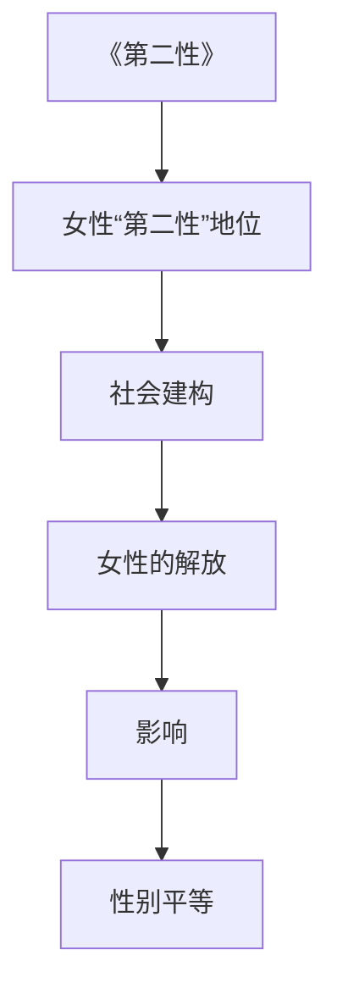

**数学公式与讲解**：

波伏瓦在《第二性》中提出的社会建构理论可以通过以下公式来表示：

$$
社会结构 + 文化传统 = 女性的地位
$$

这个公式表明，女性的社会地位是由社会结构和文化传统共同决定的。通过改变这些结构和传统，可以改变女性的地位，实现性别平等。

**举例说明**：

假设一个社会传统中女性被期望承担家务和照顾孩子的角色，这种结构限制了女性的自由和发展。通过教育和政策改革，可以改变这种传统观念，使女性能够追求自己的职业和兴趣，从而实现个人的自由和解放。

$$
社会结构改变 + 教育改革 = 女性解放
$$

**算法流程图**：

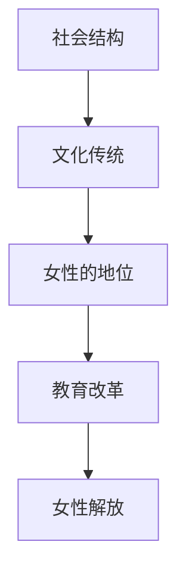

### 2.3 波伏瓦的其他著作

**《存在主义与人类现象学》**：

这是波伏瓦的另一部重要著作，探讨了存在主义哲学的基本概念。书中，波伏瓦分析了人类的自由、责任和存在意义。她强调，个人通过自由选择来定义自己，并承担自己的选择带来的后果。

**《波伏瓦传》**：

这是一本关于波伏瓦个人生活和哲学思想的传记。传记通过描述波伏瓦的生平经历，展示了她的哲学思考是如何形成和发展的。这本书不仅为读者提供了对波伏瓦个人和哲学的深入了解，而且也为女性主义哲学的研究提供了宝贵的资料。

**书籍的核心内容**：

- **《存在主义与人类现象学》**：
  - **自由与选择**：波伏瓦认为，自由是人类的本质，通过选择，个人定义自己的存在。
  - **责任**：个人对自己的选择承担责任，这是存在主义的核心。
  - **存在意义**：波伏瓦探讨了人类存在的意义，强调个人的自主性和独立性。

- **《波伏瓦传》**：
  - **个人生活**：描述波伏瓦的个人经历，包括她的家庭背景、教育经历和职业生涯。
  - **哲学思想**：展示了波伏瓦的哲学思考是如何在个人经历中形成的。

**书籍的影响**：

**《存在主义与人类现象学》**的影响在于它为存在主义哲学提供了系统性的理论框架，对后来的哲学家和学者产生了深远的影响。**《波伏瓦传》**则为读者提供了对波伏瓦哲学思想的深入理解，使人们能够更好地理解她的工作和思想。

**Mermaid 流程图**：

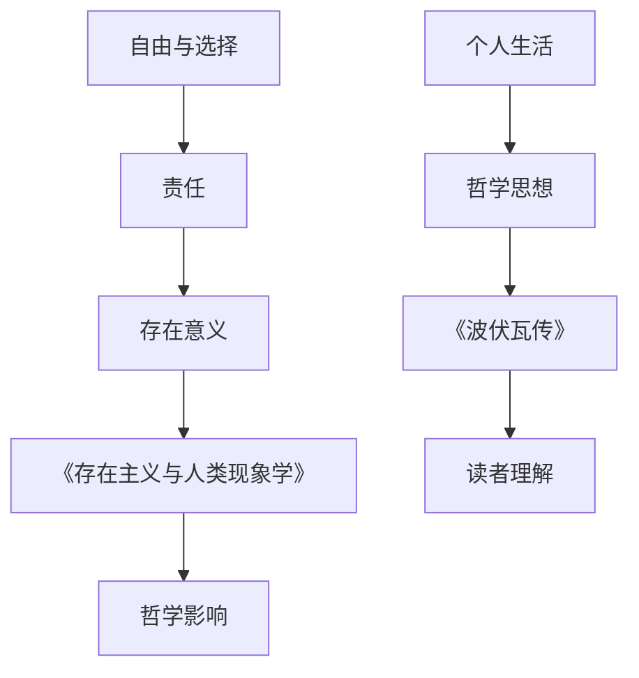

**数学公式与讲解**：

波伏瓦在**《存在主义与人类现象学》**中提出的核心理论可以通过以下公式来表示：

$$
自由 \times 选择 \times 责任 = 存在主义
$$

这个公式表明，自由、选择和责任是存在主义哲学的核心要素。通过自由选择和承担责任，个人能够定义自己的存在。

在**《波伏瓦传》**中，波伏瓦的个人生活和哲学思想可以通过以下公式来表示：

$$
个人经历 \times 哲学思考 = 哲学思想的发展
$$

这个公式说明，个人的经历是哲学思考的基础，通过个人经历，波伏瓦能够不断深化和发展她的哲学思想。

**举例说明**：

假设波伏瓦在年轻时面临一个重要的选择，她可以选择遵循社会的期望，或者追求自己的理想。她选择追求自己的理想，这使她能够成为一个独立的哲学家，并通过她的思想影响世界。

$$
个人选择 + 责任 = 哲学成就
$$

**算法流程图**：

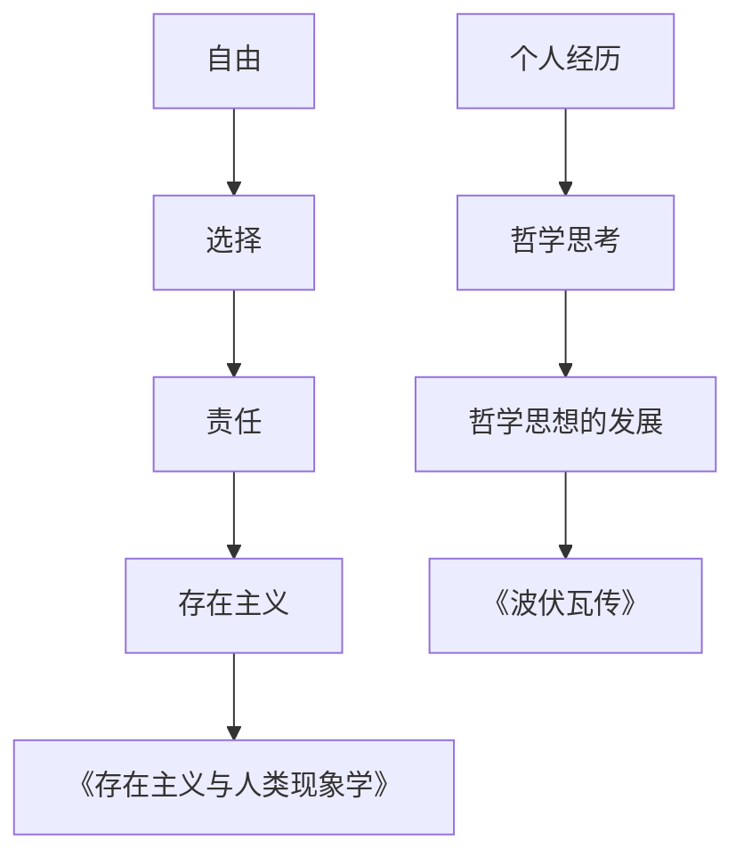

### 第3章 艾尔兰娜·伊利格瑞

#### 3.1 女性主义理论与哲学

艾尔兰娜·伊利格瑞是一位重要的女性主义哲学家，她的理论对当代女性主义哲学产生了深远的影响。伊利格瑞的理论基于结构主义和后结构主义，她提出了一种独特的女性主义哲学，强调性别是一种社会构建的观点。

**核心概念原理**：

伊利格瑞认为，性别不是一种本质属性，而是一种社会构建的范畴。她挑战了传统的性别二元对立观念，提出性别是一种差异的关系。她认为，性别是由社会和文化规范所决定的，而不是由生物学或生理特征所决定的。

**概念属性特征对比表格**：

| 特征             | 传统性别观念                 | 伊利格瑞的性别理论                |
|------------------|------------------------------|------------------------------------|
| 本质属性         | 视性别为固定的本质属性       | 视性别为社会构建的范畴            |
| 二元对立         | 男性和女性之间的二元对立     | 挑战二元对立观念，强调性别多样性   |
| 社会构建         | 否认性别的社会构建性质       | 认识到性别是社会构建的结果         |

**ER实体关系图架构的 Mermaid 流程图**：


**数学公式与讲解**：

伊利格瑞的性别理论可以通过以下公式来表示：

$$
社会规范 \times 文化传统 = 性别
$$

这个公式表明，性别是由社会规范和文化传统共同决定的。通过改变这些规范和传统，可以改变对性别的认知和定义。

**举例说明**：

假设一个社会传统中，女性被期望承担家务和照顾孩子的角色，这种社会规范定义了女性的性别角色。通过教育和政策改革，可以改变这种传统观念，使女性能够追求自己的职业和兴趣，从而实现性别多样性。

$$
社会规范改变 + 教育改革 = 性别多样性
$$

**算法流程图**：

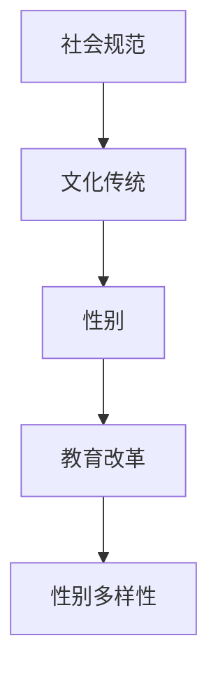

#### 3.2 《性别/差异》

**书籍的内容与影响**：

《性别/差异》是艾尔兰娜·伊利格瑞的代表作，也是女性主义哲学的重要文献。这本书探讨了性别、差异和社会关系的问题。伊利格瑞通过分析语言、文化和意识形态，揭示了性别是如何在社会中被构建和维持的。

**书籍的核心内容**：

- **性别与差异**：伊利格瑞提出，性别不是一种固定的属性，而是一种社会构建的差异关系。
- **语言与意识形态**：她认为，语言和意识形态是性别建构的重要工具，通过语言和意识形态，社会赋予了性别特定的意义和角色。
- **社会关系**：伊利格瑞探讨了性别如何影响社会关系，特别是在家庭、政治和社会领域。

**书籍的影响**：

《性别/差异》对女性主义哲学界产生了深远的影响。它挑战了传统的性别观念，提出了新的性别理论，激发了学者对性别问题的深入探讨。这本书成为女性主义运动的重要理论基础，推动了性别平等的社会进步。

**Mermaid 流程图**：

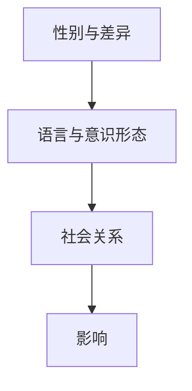

**数学公式与讲解**：

伊利格瑞在《性别/差异》中提出的性别理论可以通过以下公式来表示：

$$
社会规范 \times 语言与意识形态 = 性别
$$

这个公式表明，性别是由社会规范、语言和意识形态共同决定的。通过改变这些因素，可以改变对性别的认知和定义。

**举例说明**：

假设一个社会传统中，女性被期望承担家务和照顾孩子的角色，这种社会规范定义了女性的性别角色。通过教育和政策改革，可以改变这种传统观念，使女性能够追求自己的职业和兴趣，从而实现性别平等。

$$
社会规范改变 + 教育改革 = 性别平等
$$

**算法流程图**：

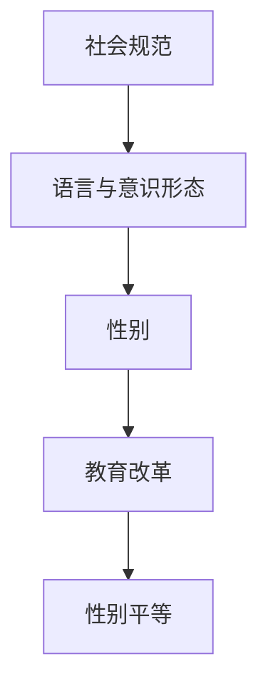

#### 3.3 伊利格瑞的其他著作

**《欲望的主体》**：

这是伊利格瑞的另一部重要著作，探讨了欲望、主体性和社会关系的问题。书中，伊利格瑞提出，欲望是社会关系的基础，主体性是通过社会互动形成的。

**《女性主义政治》**：

这是伊利格瑞关于女性主义政治的著作，探讨了女性主义在政治领域的应用和意义。她认为，女性主义政治旨在实现性别平等，重塑社会结构。

**书籍的核心内容**：

- **《欲望的主体》**：
  - **欲望与社会关系**：伊利格瑞认为，欲望是社会关系的基础，主体性是通过社会互动形成的。
  - **主体性**：主体性不是一种固定的属性，而是一种动态的过程。

- **《女性主义政治》**：
  - **女性主义政治的目标**：实现性别平等，重塑社会结构。
  - **政治参与**：女性在政治领域中的参与对于实现性别平等至关重要。

**书籍的影响**：

**《欲望的主体》**和**《女性主义政治》**对女性主义哲学和政治学产生了深远的影响。它们提供了关于性别、欲望和政治的深刻见解，激发了学者对性别平等和政治参与的深入探讨。

**Mermaid 流程图**：

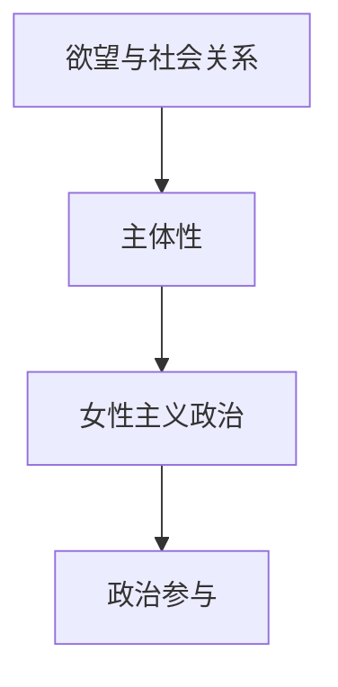

**数学公式与讲解**：

伊利格瑞在**《欲望的主体》**和**《女性主义政治》**中提出的理论可以通过以下公式来表示：

$$
欲望 \times 社会互动 = 主体性
$$

$$
性别平等 \times 政治参与 = 女性主义政治
$$

这些公式表明，欲望和社会互动是形成主体性的基础，而性别平等和政治参与是实现女性主义政治的关键。

**举例说明**：

假设一个社会中的女性通过参与政治活动来表达自己的欲望和需求，这种参与可以促进性别平等，重塑社会结构。

$$
政治参与 + 性别平等 = 女性主义政治
$$

**算法流程图**：

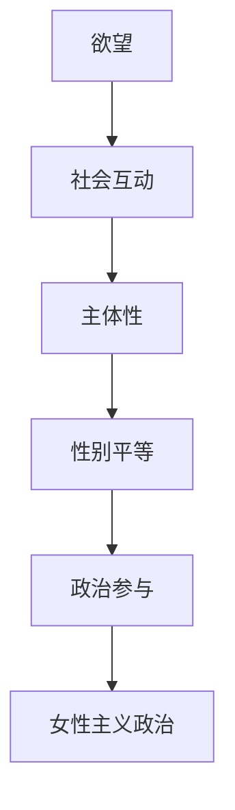

### 第4章 两位哲学家的关系与影响

#### 4.1 合作与对话

西蒙娜·德·波伏瓦和艾尔兰娜·伊利格瑞在女性主义哲学领域有着紧密的合作和对话。尽管他们在哲学观点上存在差异，但这种差异并没有阻碍他们的合作，反而促进了双方思想的深入探讨和发展。

波伏瓦的存在主义女性主义思想与伊利格瑞的后结构主义女性主义理论互补，两者共同推动了女性主义哲学的进步。他们的合作和对话不仅丰富了女性主义哲学的理论体系，也为后来的学者提供了宝贵的思想资源。

**Mermaid 流程图**：

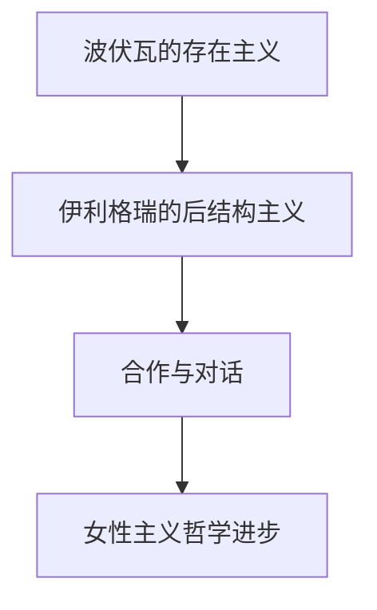

#### 4.2 对当代女性主义哲学的影响

波伏瓦和伊利格瑞的思想对当代女性主义哲学产生了深远的影响。他们的理论为理解性别不平等和社会结构提供了新的视角，激励了后来的学者继续探索女性主义哲学的各个层面。

波伏瓦的存在主义女性主义思想强调了个人自由和责任，为女性争取平等权利提供了理论基础。伊利格瑞的后结构主义女性主义理论挑战了传统的性别观念，提出了性别是一种社会构建的观点。这两位哲学家的思想共同推动了女性主义哲学的发展，为当代女性主义运动提供了重要的理论支持。

**Mermaid 流程图**：

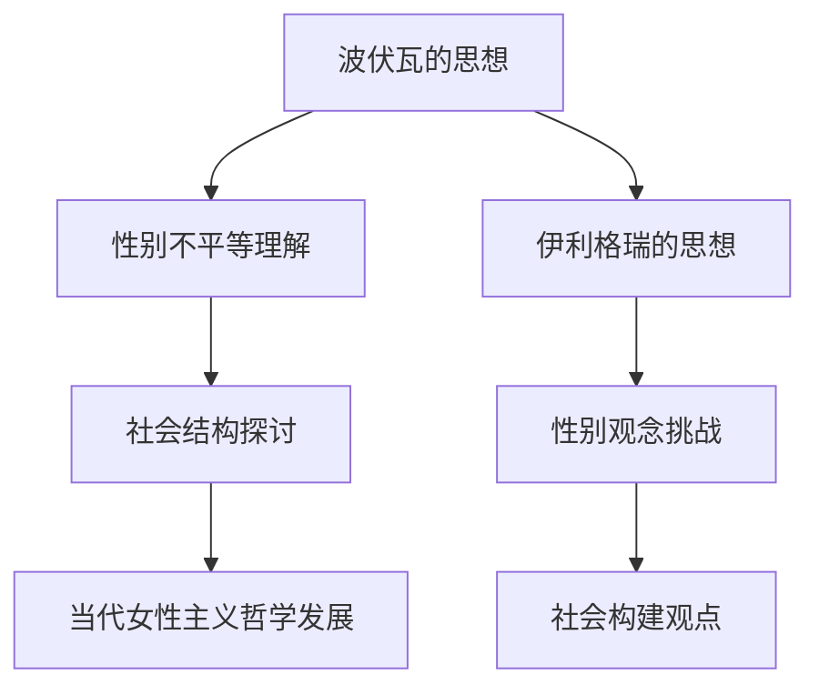

### 第5章 女性主义哲学的当代发展

#### 5.1 新女性主义哲学

随着社会的进步和多元化，女性主义哲学也在不断发展。当代女性主义哲学不仅关注性别平等，还关注多元性、多样性和跨文化问题。新女性主义哲学流派包括后现代女性主义和非西方女性主义，它们试图超越传统的性别二元对立观念，探讨性别平等的新路径。

**后现代女性主义**：

后现代女性主义关注性别身份的多元性和流动性，强调个体的自主性和自我定义。它认为，性别不是固定的属性，而是社会和文化建构的结果。后现代女性主义鼓励女性重新审视和定义自己的性别角色，追求个体自主性。

**非西方女性主义**：

非西方女性主义关注非西方文化背景下的女性主义问题，强调不同文化背景下女性主义的多样性和差异性。它主张尊重和包容各种文化背景下的女性主义实践，推动全球女性主义的共同发展。

**Mermaid 流程图**：

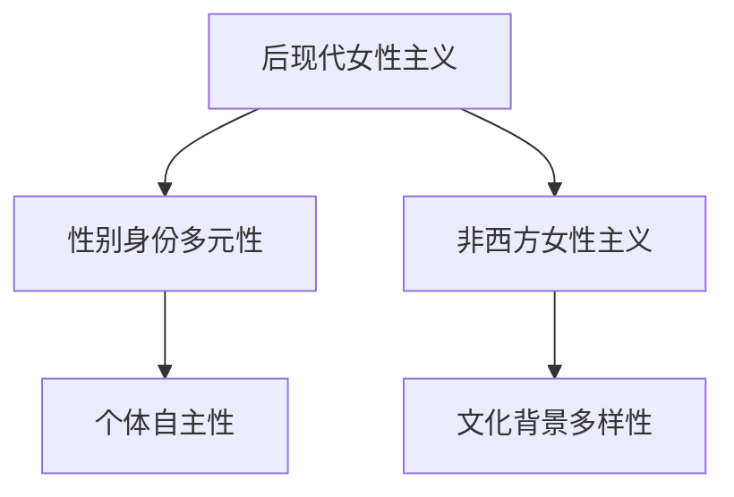

#### 5.2 女性主义哲学的应用

女性主义哲学的应用领域广泛，包括法律、政治、教育和社会工作。它为解决性别不平等问题提供了理论支持和实践指导。

- **法律领域**：女性主义哲学为性别平等立法提供了理论基础，推动法律改革，保障女性的权益。
- **政治领域**：女性主义哲学关注女性在政治领域的参与和代表性，推动性别平等的实现。
- **教育领域**：女性主义哲学强调教育中的性别平等，推动教育改革，消除性别歧视。
- **社会工作领域**：女性主义哲学为社会工作实践提供了新的视角，关注性别不平等问题的解决。

**Mermaid 流程图**：

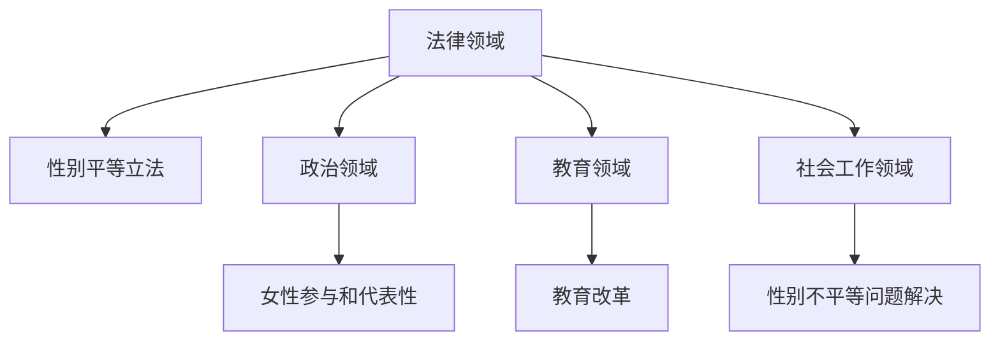

### 第6章 结论

#### 6.1 波伏瓦与伊利格瑞的地位

西蒙娜·德·波伏瓦和艾尔兰娜·伊利格瑞在女性主义哲学中占有重要地位。他们的思想为理解性别不平等和社会结构提供了新的视角，推动了女性主义哲学的发展。波伏瓦的存在主义女性主义思想和伊利格瑞的后结构主义女性主义理论共同构成了女性主义哲学的核心，影响了后来的学者和实践者。

#### 6.2 对未来女性主义哲学的影响

随着社会的进步和多元化，女性主义哲学将继续发展。波伏瓦和伊利格瑞的思想为未来的女性主义哲学提供了重要的理论基础和实践指导。他们的理论将激励学者继续探索性别平等的新路径，推动社会进步。

**最佳实践 Tips**：

1. **深入阅读经典著作**：阅读波伏瓦和伊利格瑞的经典著作，深入理解他们的哲学思想。
2. **参与女性主义活动**：积极参与女性主义活动和讨论，提升自己的性别意识和社会责任感。
3. **跨学科学习**：结合其他学科的知识，如社会学、心理学、政治学等，拓宽对女性主义哲学的理解。

**小结**：

本文通过对波伏瓦和伊利格瑞的生平背景、主要著作、哲学思想以及他们对当代女性主义哲学的影响的深入探讨，展示了两位哲学家在女性主义哲学中的重要地位。他们的思想将继续影响未来的女性主义哲学发展，推动性别平等和社会进步。

**注意事项**：

1. **尊重多元性**：在学习和实践女性主义哲学时，要尊重不同文化背景和性别身份的多样性。
2. **批判性思考**：对女性主义哲学的观点和理论持批判性态度，结合实际情况进行分析和思考。

**拓展阅读**：

1. 波伏瓦, S. de. (1949). 《第二性》. Les Éditions de Minuit.
2. 伊利格瑞, E. (1982). 《性别/差异》. Les Éditions de Minuit.
3. 贝尔纳, F. (Ed.). (2017). 《西蒙娜·德·波伏瓦：哲学与文学》. Éditions Gallimard.
4. 瓦莱里, M. (Ed.). (2019). 《艾尔兰娜·伊利格瑞：女性主义与哲学》. Éditions Amsterdam.
5. 史密斯, J. (2015). 《女性主义哲学：历史与理论》. Routledge.
6. 沃尔夫, M. (2018). 《当代女性主义哲学》. Palgrave Macmillan.

