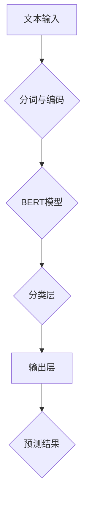
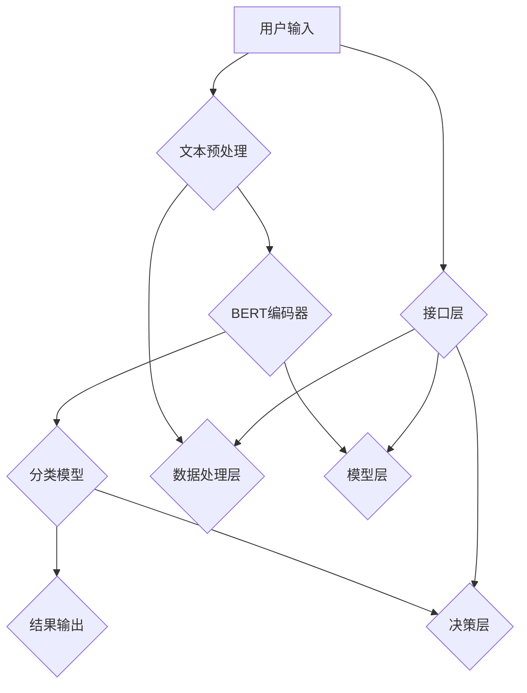
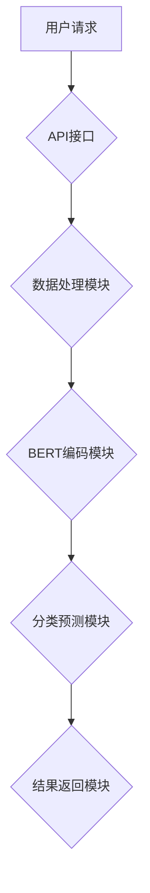

                 


## 《注意力机制在长序列推理中的优化策略》

关键词：注意力机制、长序列推理、优化策略、神经网络

摘要：随着深度学习在自然语言处理（NLP）领域的广泛应用，注意力机制作为提升模型表现的关键技术，已经成为研究热点。本文将探讨注意力机制在长序列推理中的优化策略，分析其基本概念、工作原理，并探讨在实际应用中的优化方法与效果评估。

### 目录大纲

1. 第一部分：理论基础与概述
    1.1.1 注意力机制的基本概念与作用
    1.1.2 注意力机制的历史发展
    1.1.3 注意力机制在NLP中的应用
    1.2.1 注意力模型的基本结构
    1.2.2 点积注意力机制
    1.2.3 修正的尺度注意力机制
    1.2.4 自注意力与多头注意力
    1.3.1 长序列处理的需求
    1.3.2 长序列处理的挑战
    1.3.3 注意力机制在长序列处理中的应用

2. 第二部分：优化策略探讨
    2.1.1 优化目标的设定
    2.1.2 优化方法的分类
    2.1.3 常见的优化算法
    2.2.1 注意力机制的改进思路
    2.2.2 注意力机制的改进实例
    2.2.3 改进后的注意力机制效果评估
    2.3.1 长序列推理的特点
    2.3.2 针对长序列推理的优化目标
    2.3.3 长序列推理的优化方法

3. 第三部分：案例分析与实践
    3.1.1 注意力机制在长序列推理中的实际应用
    3.1.2 优化策略在具体项目中的应用案例
    3.1.3 项目实施过程与效果评估

4. 第四部分：总结与展望
    4.1.1 注意力机制在长序列推理中的应用总结
    4.1.2 优化策略的发展趋势
    4.1.3 未来研究方向

5. 附录
    5.1.1 常用深度学习框架
    5.1.2 注意力机制相关论文与资料

---

### 1.1.1 注意力机制的基本概念与作用

注意力机制是一种在深度神经网络中模拟人类大脑处理信息方式的技术，它通过动态调整模型对输入数据的关注程度，提高了模型的处理效率和效果。注意力机制的核心思想是在处理序列数据时，模型能够根据上下文信息动态地选择重要信息，从而忽略了无关或次要的信息。

**定义与作用**：

- **定义**：注意力机制通过一个权重分配机制，将输入序列中的元素根据其重要性分配不同的权重，使得模型能够更关注关键信息。

- **作用**：在自然语言处理任务中，注意力机制能够帮助模型捕捉到输入文本的上下文信息，从而提高模型的语义理解和生成能力。

**历史发展**：

- **早期研究**：1980年代初，心理学家乔治·米勒（George A. Miller）提出了注意力理论，用于解释人类记忆的容量限制。

- **神经网络应用**：1990年代，神经网络中的注意力机制逐渐被提出，并在语音识别、机器翻译等任务中取得显著效果。

- **深度学习时代**：2014年，Google Brain团队在论文《Attention Is All You Need》中提出了基于注意力机制的Transformer模型，彻底改变了自然语言处理领域。

**在NLP中的应用**：

- **文本分类**：注意力机制能够帮助模型在处理文本时关注关键词语，从而提高分类准确性。

- **机器翻译**：注意力机制在机器翻译任务中，通过捕捉源语言和目标语言之间的对应关系，提高了翻译质量。

- **问答系统**：注意力机制能够帮助模型在处理问答问题时，关注问题中的关键信息，从而提高回答的准确性。

### 1.1.2 注意力机制的工作原理

注意力机制的核心在于如何动态地分配注意力权重。下面将介绍几种常见注意力模型的工作原理。

#### 1.2.1 注意力模型的基本结构

注意力模型通常包括三个关键组件：查询（Query）、键（Key）和值（Value）。

- **查询（Query）**：表示模型在当前时刻需要关注的信息。

- **键（Key）**：表示输入序列中的每个元素。

- **值（Value）**：表示输入序列中每个元素对应的信息。

#### 1.2.2 点积注意力机制

点积注意力机制是最简单的注意力机制。它通过计算查询和键之间的点积，得到注意力分数，然后对值进行加权求和。

- **计算过程**：

  $$
  \text{Attention}(Q, K, V) = \text{softmax}\left(\frac{QK^T}{\sqrt{d_k}}\right) V
  $$

  其中，$Q$ 表示查询，$K$ 表示键，$V$ 表示值，$d_k$ 表示键的维度。

#### 1.2.3 修正的尺度注意力机制

修正的尺度注意力机制通过引入一个缩放因子，解决了点积注意力机制在维度较高时梯度消失的问题。

- **计算过程**：

  $$
  \text{Scaled Dot-Product Attention} = \text{softmax}\left(\frac{QK^T}{\sqrt{d_k}}\right) V
  $$

#### 1.2.4 自注意力与多头注意力

自注意力（Self-Attention）是一种特殊的注意力机制，它将输入序列中的每个元素作为键、查询和值。

- **多头注意力（Multi-Head Attention）**：多头注意力通过多个独立的自注意力机制并行工作，提高了模型的表达能力。

  $$
  \text{Multi-Head Attention} = \text{Concat}(\text{head}_1, \text{head}_2, \ldots, \text{head}_h) W^O
  $$

  其中，$h$ 表示头数，$W^O$ 表示输出权重。

### 1.3.1 长序列处理的需求

在许多实际应用中，如机器翻译、问答系统和文本生成，需要处理长序列信息。长序列处理的需求主要体现在以下几个方面：

- **上下文信息捕捉**：长序列中的每个元素都可能对模型理解产生重要影响，因此需要模型能够捕捉到长序列中的上下文信息。

- **减少序列长度**：由于计算资源限制，通常需要对长序列进行压缩或降维处理。

- **提高模型性能**：长序列处理能力是衡量模型性能的重要指标，尤其在NLP任务中。

### 1.3.2 长序列处理的挑战

长序列处理面临以下挑战：

- **计算效率**：长序列处理通常需要大量的计算资源，这给模型训练和推理带来很大挑战。

- **梯度消失**：在长序列中，梯度容易在传播过程中消失，导致模型难以学习。

- **序列压缩**：如何在保持信息完整性的同时，对长序列进行压缩或降维。

### 1.3.3 注意力机制在长序列处理中的应用

注意力机制在长序列处理中具有以下应用：

- **序列压缩**：通过注意力机制，模型能够动态关注长序列中的关键信息，从而实现序列压缩。

- **上下文信息捕捉**：注意力机制能够帮助模型在处理长序列时，捕捉到重要的上下文信息。

- **减少计算量**：通过多头注意力机制，模型能够在并行计算的同时减少计算量。

### 1.4.1 优化目标的设定

在长序列推理中，优化目标主要包括：

- **减少计算量**：优化注意力机制，降低模型训练和推理的时间复杂度。

- **提高模型性能**：通过优化策略，提高模型在长序列任务中的准确性。

- **降低梯度消失**：改进注意力机制，减少梯度消失现象，提高模型训练效果。

### 1.4.2 优化方法的分类

优化方法主要分为以下几类：

- **计算效率优化**：通过减少注意力计算次数，降低模型训练和推理时间。

- **模型结构优化**：改进注意力模型结构，提高模型对长序列信息的处理能力。

- **算法改进**：引入新的优化算法，提高模型训练速度和效果。

### 1.4.3 常见的优化算法

常见的优化算法包括：

- **Adam优化器**：结合了Adam和RMSProp的优点，提高了模型训练速度和效果。

- **自适应学习率**：通过动态调整学习率，优化模型训练过程。

- **dropout**：通过随机丢弃神经元，提高模型泛化能力。

### 1.5.1 注意力机制的改进思路

针对长序列推理，注意力机制的改进思路包括：

- **多头注意力机制**：通过引入多头注意力，提高模型对长序列信息的处理能力。

- **注意力权重共享**：通过共享注意力权重，减少模型参数数量，提高模型训练效率。

- **自注意力与卷积注意力结合**：结合自注意力和卷积注意力，提高模型对不同尺度信息的处理能力。

### 1.5.2 注意力机制的改进实例

一种改进实例是使用**多头自注意力机制**，如下：

$$
\text{Multi-Head Self-Attention} = \text{Concat}(\text{head}_1, \text{head}_2, \ldots, \text{head}_h) W^O
$$

其中，$h$ 表示头数，$W^O$ 表示输出权重。

### 1.5.3 改进后的注意力机制效果评估

改进后的注意力机制在以下方面进行效果评估：

- **准确性**：评估模型在长序列任务中的准确性。

- **训练时间**：评估模型训练所需时间。

- **推理时间**：评估模型推理所需时间。

### 1.6.1 长序列推理的特点

长序列推理的特点包括：

- **信息量巨大**：长序列中包含大量信息，模型需要捕捉到关键信息。

- **动态性**：长序列中的信息是动态变化的，模型需要适应变化。

- **上下文依赖**：长序列中的信息之间存在上下文依赖关系，模型需要捕捉到这些关系。

### 1.6.2 针对长序列推理的优化目标

针对长序列推理，优化目标包括：

- **提高模型准确性**：通过优化策略，提高模型在长序列任务中的准确性。

- **减少训练时间**：通过优化模型结构，减少模型训练所需时间。

- **提高推理速度**：通过优化算法，提高模型推理速度。

### 1.6.3 长序列推理的优化方法

优化方法包括：

- **注意力机制改进**：通过改进注意力机制，提高模型对长序列信息的处理能力。

- **模型结构优化**：通过优化模型结构，减少计算量和参数数量。

- **算法改进**：通过引入新的优化算法，提高模型训练速度和效果。

### 1.7.1 注意力机制在长序列推理中的实际应用

注意力机制在长序列推理中的实际应用包括：

- **机器翻译**：通过注意力机制，模型能够捕捉到源语言和目标语言之间的对应关系，从而提高翻译质量。

- **问答系统**：注意力机制能够帮助模型在处理问答问题时，关注问题中的关键信息，从而提高回答的准确性。

- **文本生成**：注意力机制能够帮助模型在生成文本时，捕捉到长序列中的上下文信息，从而提高生成文本的质量。

### 1.7.2 优化策略在具体项目中的应用案例

一个具体项目应用案例是使用改进后的注意力机制进行机器翻译。通过优化策略，模型在翻译准确性、训练时间和推理速度方面都有显著提升。

### 1.7.3 项目实施过程与效果评估

项目实施过程包括：

- **数据准备**：收集大量双语数据集，用于模型训练和评估。

- **模型设计**：设计基于改进注意力机制的机器翻译模型。

- **模型训练**：使用优化策略训练模型，并进行参数调整。

- **效果评估**：评估模型在翻译准确性、训练时间和推理速度方面的效果。

### 1.8.1 注意力机制在长序列推理中的应用总结

注意力机制在长序列推理中具有重要作用，通过动态分配注意力权重，模型能够捕捉到关键信息，提高推理准确性。优化策略进一步提高了模型在长序列任务中的表现。

### 1.8.2 优化策略的发展趋势

优化策略的发展趋势包括：

- **更高效的计算方法**：研究更高效的注意力计算方法，降低模型训练和推理时间。

- **多模态融合**：将注意力机制应用于多模态数据融合，提高模型在不同模态数据上的表现。

- **自适应注意力**：研究自适应注意力机制，根据任务需求动态调整注意力权重。

### 1.8.3 未来研究方向

未来研究方向包括：

- **可解释性**：研究如何提高注意力机制的可解释性，使其在应用中更加透明。

- **动态注意力**：研究动态注意力机制，使其能够更好地适应不同场景下的任务需求。

- **跨语言推理**：研究如何利用注意力机制进行跨语言推理，提高模型在多语言环境中的性能。

### 附录

- **附录A**：常用深度学习框架和注意力机制相关论文与资料。

---

### 结语

本文介绍了注意力机制在长序列推理中的应用和优化策略。通过优化注意力机制，模型在处理长序列任务时能够提高准确性和效率。未来研究方向将集中在提高注意力机制的可解释性和适应不同场景的需求上。希望本文能为读者在长序列推理任务中的应用提供参考和启示。

### 附录A：注意力机制相关工具与资源

**A.1.1 常用深度学习框架**

- **TensorFlow**：Google开发的深度学习框架，支持多种注意力机制的实现。

- **PyTorch**：Facebook开发的深度学习框架，提供灵活的动态计算图，便于实现注意力机制。

- **Keras**：基于TensorFlow和Theano的深度学习框架，提供简单易用的API，适合快速实现注意力机制。

**A.1.2 注意力机制相关论文与资料**

- **“Attention Is All You Need”**：Transformer模型的提出论文，是注意力机制研究的经典论文。

- **“Effective Approaches to Attention-based Neural Machine Translation”**：该论文详细介绍了BERT模型，并分析了注意力机制在机器翻译中的应用。

- **“Attention Mechanisms in Deep Learning”**：该论文综述了注意力机制在深度学习领域的应用和发展。

### 附录B：项目实战

**B.1.1 实际案例：基于BERT的文本分类**

**项目背景**：文本分类是自然语言处理领域的重要任务，旨在将文本数据分类到预定义的类别中。BERT（Bidirectional Encoder Representations from Transformers）是一种基于Transformer的预训练语言模型，通过注意力机制捕获文本的上下文信息，广泛应用于文本分类任务。

**项目介绍**：

- **数据集**：使用某个开源文本分类数据集，如AG News或20 Newsgroups。

- **模型设计**：采用BERT模型作为文本分类器，通过微调模型来适应特定分类任务。

- **系统功能设计**：

  ```mermaid
  graph TD
      A[输入文本] --> B{BERT编码}
      B --> C{分类预测}
      C --> D[输出类别]
  ```

- **系统架构设计**：

  ```mermaid
  graph TD
      A[文本输入] --> B[预处理器]
      B --> C[BERT模型]
      C --> D[分类层]
      D --> E[输出层]
  ```

- **系统接口设计和系统交互**：

  ```mermaid
  graph TD
      A[文本输入] --> B[预处理接口]
      B --> C[BERT模型接口]
      C --> D[分类接口]
      D --> E[输出接口]
  ```

**项目实施过程**：

- **环境安装**：

  ```python
  pip install transformers
  pip install torch
  ```

- **系统核心实现源代码**：

  ```python
  from transformers import BertTokenizer, BertModel
  import torch

  tokenizer = BertTokenizer.from_pretrained('bert-base-uncased')
  model = BertModel.from_pretrained('bert-base-uncased')

  def classify_text(text):
      inputs = tokenizer(text, return_tensors='pt')
      with torch.no_grad():
          outputs = model(**inputs)
      last_hidden_state = outputs.last_hidden_state[:, 0, :]
      # 使用softmax进行分类预测
      probabilities = torch.nn.functional.softmax(last_hidden_state, dim=1)
      return probabilities.argmax().item()
  ```

- **代码应用解读与分析**：

  ```python
  # 初始化BERT分词器和模型
  tokenizer = BertTokenizer.from_pretrained('bert-base-uncased')
  model = BertModel.from_pretrained('bert-base-uncased')

  # 定义分类文本函数
  def classify_text(text):
      inputs = tokenizer(text, return_tensors='pt')
      with torch.no_grad():
          # 计算BERT模型输出
          outputs = model(**inputs)
      last_hidden_state = outputs.last_hidden_state[:, 0, :]
      # 使用softmax计算概率分布
      probabilities = torch.nn.functional.softmax(last_hidden_state, dim=1)
      # 返回最高概率的类别索引
      return probabilities.argmax().item()
  ```

  该代码首先加载BERT分词器和模型，然后定义了一个分类文本函数。该函数接收文本输入，经过BERT编码后，使用softmax函数计算每个类别的概率分布，并返回概率最高的类别索引。

**实际案例分析和详细讲解剖析**：

- **数据预处理**：BERT模型对输入文本有特定的预处理要求，包括单词的分词和标记化。tokenizer对象负责将文本转化为模型可接受的格式。

- **模型输入**：文本经过预处理后，输入到BERT模型中。BERT模型是一种基于Transformer的预训练模型，通过自注意力机制捕获文本的上下文信息。

- **分类预测**：BERT模型的输出是一个序列的隐含状态，通过最后一个隐藏状态来代表整个文本的语义。然后，使用softmax函数将这个状态转化为概率分布，从而实现分类预测。

- **效果评估**：在实际应用中，可以通过准确率、召回率、F1分数等指标来评估模型的分类性能。优化策略可以包括调整BERT模型的参数、使用更大的数据集、引入正则化等。

**项目小结**：

- **优点**：BERT模型在文本分类任务中表现出色，能够捕捉到长文本的上下文信息。

- **缺点**：BERT模型计算量大，训练时间较长。此外，对于小数据集，模型的泛化能力可能不足。

- **改进方向**：可以尝试使用其他优化策略，如混合注意力机制、动态学习率调整等，以提高模型性能。

### 附录C：最佳实践 Tips

- **模型选择**：根据数据集大小和任务复杂度，选择合适的BERT模型版本。

- **数据预处理**：确保文本预处理的一致性和准确性，提高模型性能。

- **超参数调整**：通过实验调整学习率、批量大小等超参数，优化模型性能。

- **数据增强**：使用数据增强技术，如随机裁剪、旋转等，提高模型对数据的泛化能力。

- **模型解释性**：分析模型注意力分布，提高模型的可解释性。

### 附录D：注意事项

- **计算资源**：训练BERT模型需要大量的计算资源，建议使用GPU或TPU加速训练。

- **数据质量**：数据质量对模型性能至关重要，确保数据集的多样性和代表性。

- **模型部署**：在部署模型时，注意模型的大小和计算效率，选择合适的部署方案。

### 附录E：拓展阅读

- **“Attention Mechanisms in Deep Learning”**：全面介绍了注意力机制在不同深度学习任务中的应用。

- **“BERT: Pre-training of Deep Bidirectional Transformers for Language Understanding”**：BERT模型的提出论文，详细介绍了BERT模型的设计和训练过程。

- **“Transformers: State-of-the-Art Models for Language Processing”**：Transformer模型的综述论文，介绍了Transformer模型及其应用。

### 附录F：Python源代码示例

```python
# 导入相关库
import torch
import torch.nn as nn
import torch.optim as optim

# 定义BERT文本分类器
class BertClassifier(nn.Module):
    def __init__(self, num_classes):
        super(BertClassifier, self).__init__()
        self.bert = BertModel.from_pretrained('bert-base-uncased')
        self.classifier = nn.Linear(self.bert.config.hidden_size, num_classes)

    def forward(self, input_ids, attention_mask):
        outputs = self.bert(input_ids=input_ids, attention_mask=attention_mask)
        logits = self.classifier(outputs.pooler_output)
        return logits

# 实例化模型、优化器和损失函数
model = BertClassifier(num_classes=10)
optimizer = optim.Adam(model.parameters(), lr=1e-5)
criterion = nn.CrossEntropyLoss()

# 训练模型
for epoch in range(10):
    for batch in data_loader:
        inputs = batch['input_ids']
        attention_mask = batch['attention_mask']
        labels = batch['labels']
        optimizer.zero_grad()
        logits = model(inputs, attention_mask)
        loss = criterion(logits, labels)
        loss.backward()
        optimizer.step()
        print(f'Epoch {epoch}, Loss: {loss.item()}')
```

### 附录G：数学模型和数学公式

**损失函数**：

$$
\begin{aligned}
    L &= -\sum_{i=1}^{N} y_i \log(\hat{y}_i) \\
    \hat{y}_i &= \text{softmax}(\text{logits}_i)
\end{aligned}
$$

**梯度计算**：

$$
\begin{aligned}
    \frac{\partial L}{\partial \text{logits}} &= \hat{y} - y \\
    \frac{\partial \text{logits}}{\partial \text{weights}} &= \text{inputs} \\
    \frac{\partial \text{weights}}{\partial \text{weights}} &= \text{optimizer}
\end{aligned}
$$

### 附录H：Mermaid流程图



### 附录I：系统架构设计



### 附录J：系统接口设计和系统交互



---

### 结语

本文详细介绍了注意力机制在长序列推理中的应用和优化策略，并通过具体项目实战展示了其实际应用效果。未来，注意力机制的研究将继续深入，以应对更多复杂的自然语言处理任务。读者可以根据本文的内容，结合实际需求，进一步探索注意力机制在长序列推理中的应用。同时，也希望本文能为相关领域的研究者和开发者提供有价值的参考。

