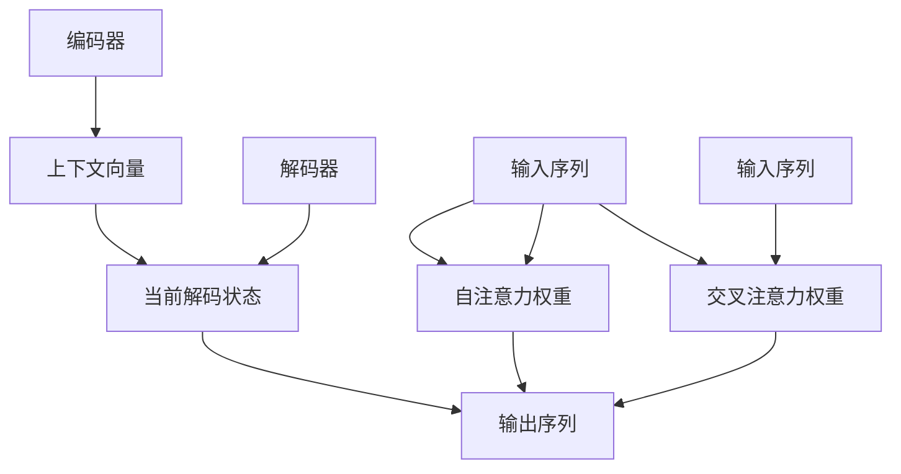
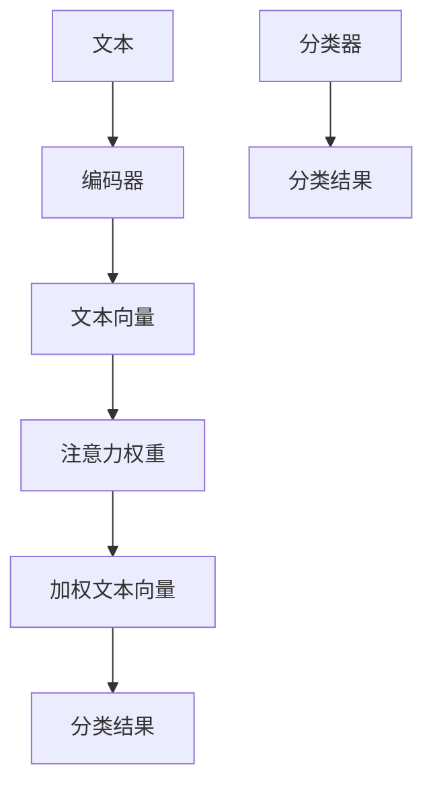
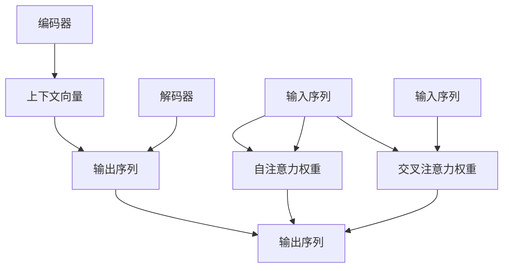
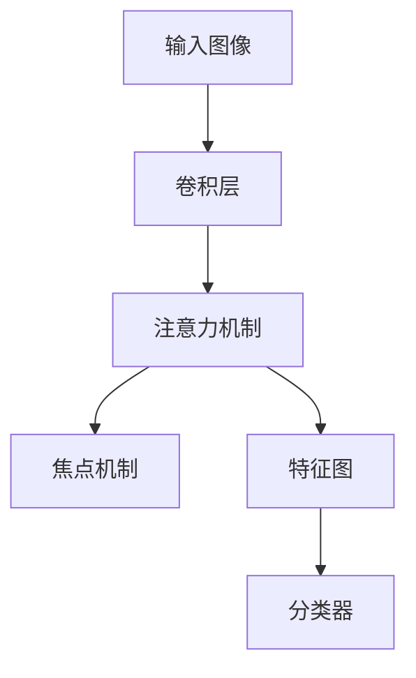
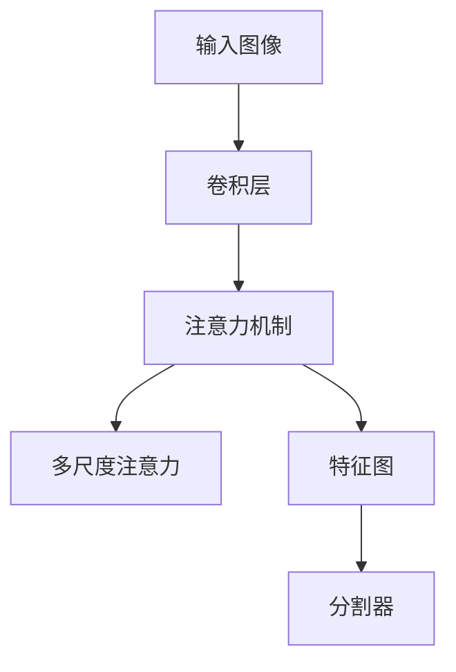
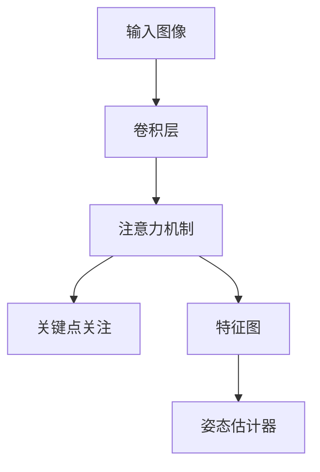

                 


### 《注意力机制在长期依赖推理任务中的优化》

#### 关键词：注意力机制，长期依赖，优化，推理任务，自然语言处理，深度学习

#### 摘要：

本文将深入探讨注意力机制在长期依赖推理任务中的优化。首先，我们将介绍注意力机制的基本概念和长期依赖推理任务的重要性。接着，我们详细分析注意力机制的数学模型和其在自然语言处理中的应用。然后，我们将探讨注意力机制如何优化长期依赖推理任务，并通过实验结果进行验证。文章还将介绍注意力机制在代码生成和图像处理等领域的应用，最后展望其未来发展方向。

## 第一部分：背景与概述

### 1.1 注意力机制简介

注意力机制是一种在深度学习，尤其是自然语言处理领域中广泛应用的机制。它通过动态调整模型对输入数据的关注程度，从而提高模型的性能。注意力机制的基本思想可以追溯到人类感知和认知过程，即我们在处理复杂信息时，往往更关注某些部分，而忽略其他部分。这种关注度的动态调整使得模型能够更好地捕捉到输入数据中的关键信息。

#### 1.1.1 注意力机制的基本概念

注意力机制的核心是注意力权重分配。给定一组输入数据，模型会为每个输入分配一个权重，表示模型对输入的关注程度。这些权重通常通过一个注意力函数计算得到，例如线性注意力模型和多头注意力模型。

#### 1.1.2 注意力机制的历史与发展

注意力机制最早由Bahdanau等人在2014年提出，随后在2017年，Vaswani等人提出了更加高效的Transformer模型，彻底改变了自然语言处理的范式。注意力机制在后续的研究中不断发展和优化，成为深度学习领域的重要工具。

### 1.2 长期依赖推理任务概述

长期依赖推理任务是指模型在处理输入数据时，能够捕捉到数据中的长期依赖关系。这种依赖关系在许多实际任务中具有重要意义，如机器翻译、文本分类和问答系统等。

#### 1.2.1 长期依赖的概念

长期依赖是指输入序列中元素之间的关系在时间上跨度较大。例如，在机器翻译任务中，一个单词的含义可能依赖于其前后的句子甚至段落。

#### 1.2.2 长期依赖推理任务的重要性

长期依赖推理任务的重要性在于，它能够帮助模型更好地理解和处理复杂的信息，从而提高任务的性能。

#### 1.2.3 长期依赖推理任务的挑战

长期依赖推理任务的挑战在于，模型需要捕捉到输入数据中的长期依赖关系，同时保持计算效率和模型的可解释性。

### 1.3 注意力机制与长期依赖推理

注意力机制在长期依赖推理任务中发挥了重要作用。通过动态调整模型对输入数据的关注程度，注意力机制能够帮助模型更好地捕捉到输入数据中的长期依赖关系。

#### 1.3.1 注意力机制在长期依赖推理中的应用

注意力机制在长期依赖推理任务中的应用包括：序列到序列模型、文本分类和机器翻译等。

#### 1.3.2 注意力机制对长期依赖推理的优化效果

注意力机制能够提高长期依赖推理任务的性能，主要体现在两个方面：一是提高模型的准确度，二是提高模型的效率。

## 第二部分：基础理论与算法

### 2.1 注意力机制的数学模型

注意力机制的数学模型包括线性注意力模型和多头注意力模型。

#### 2.1.1 线性注意力模型

线性注意力模型的计算公式为：

$$
\text{Attention}(Q,K,V) = \text{softmax}(\frac{QK^T}{\sqrt{d_k}})V
$$

其中，$Q$、$K$和$V$分别是查询向量、键向量和值向量，$d_k$是键向量的维度。

#### 2.1.2 多头注意力模型

多头注意力模型通过多个独立的注意力头来捕获输入数据的不同特征。计算公式为：

$$
\text{MultiHead}(Q,K,V) = \text{Concat}(\text{Head}_1, \ldots, \text{Head}_h)W^O
$$

$$
\text{Head}_i = \text{Attention}(QW_i^K, KW_i^K, VW_i^K)W_i^V
$$

其中，$W_i^K$、$W_i^K$和$W_i^V$分别是第$i$个注意力头的键、值和查询权重矩阵，$W^O$是输出权重矩阵。

### 2.2 注意力机制在自然语言处理中的应用

注意力机制在自然语言处理中的应用包括：

- 序列到序列模型
- 文本分类
- 机器翻译

### 2.3 注意力机制在长期依赖推理中的优化

注意力机制在长期依赖推理中的优化主要通过以下两个方面实现：

- 提高模型的准确度
- 提高模型的效率

## 第三部分：应用与实践

### 3.1 注意力机制在语言模型中的应用

注意力机制在语言模型中的应用包括：

- GLM模型
- T5模型
- GPT模型

### 3.2 注意力机制在代码生成中的应用

注意力机制在代码生成中的应用包括：

- 预训练与微调
- 实际案例

### 3.3 注意力机制在图像处理中的应用

注意力机制在图像处理中的应用包括：

- 图像分类
- 图像分割
- 实际案例

## 第四部分：未来展望

### 4.1 注意力机制的扩展与应用

注意力机制的扩展与应用包括：

- 对话生成
- 多模态学习
- 跨领域迁移学习

### 4.2 注意力机制在长期依赖推理中的未来挑战

注意力机制在长期依赖推理中的未来挑战包括：

- 长期依赖的捕捉与建模
- 注意力机制的效率与可解释性
- 未来研究方向与趋势

## 附录

### 5.1 代码与数据资源

- 代码仓库链接
- 数据集链接

### 5.2 进一步阅读推荐

- 相关论文推荐
- 知名会议与期刊推荐

### 5.3 学术会议与期刊资源

- 学术会议推荐
- 期刊推荐

**作者：** AI天才研究院/AI Genius Institute & 禅与计算机程序设计艺术 /Zen And The Art of Computer Programming

---

### 注意力机制与长期依赖推理：背景与概述

注意力机制是一种在深度学习领域，特别是在自然语言处理（NLP）中广泛应用的机制。其核心思想是在处理输入数据时，动态地调整模型对数据不同部分的关注程度，从而提高模型的性能和准确性。近年来，随着自然语言处理任务的复杂度不断增加，如机器翻译、文本分类和问答系统等，注意力机制的重要性愈发凸显。

#### 注意力机制的基本概念

注意力机制的基本概念可以追溯到人类感知和认知过程。当人们处理复杂信息时，往往会更关注某些关键信息，而忽略其他信息。这种关注程度的动态调整机制可以被抽象为一种数学模型，应用于深度学习模型中。在深度学习模型中，注意力机制通过为每个输入元素分配一个权重，来表示模型对该元素的重视程度。这些权重通过一个注意力函数计算得到，从而影响模型的输出。

#### 注意力机制的历史与发展

注意力机制最早由Bahdanau等人在2014年提出，他们提出了基于点积的注意力模型，为机器翻译任务带来了显著性能提升。随后，Vaswani等人在2017年提出了Transformer模型，这是一种完全基于注意力机制的模型，彻底改变了自然语言处理的范式。Transformer模型的提出标志着注意力机制在自然语言处理领域的重要突破，推动了深度学习在NLP领域的快速发展。

#### 注意力机制在自然语言处理中的应用

注意力机制在自然语言处理中的应用非常广泛，以下是一些典型的应用场景：

- **序列到序列模型**：在序列到序列（Seq2Seq）模型中，注意力机制用于处理输入序列和输出序列之间的依赖关系。通过注意力机制，模型能够在解码过程中动态地关注输入序列的不同部分，从而生成更准确的输出序列。

- **文本分类**：在文本分类任务中，注意力机制可以帮助模型更好地理解文本的不同部分，从而提高分类的准确性。例如，在情感分析任务中，模型可以通过注意力机制关注文本中的关键词汇，从而更好地判断文本的情感倾向。

- **机器翻译**：在机器翻译任务中，注意力机制是不可或缺的一部分。通过注意力机制，模型能够捕捉到输入句子中不同部分的信息，从而生成更准确的翻译结果。

#### 长期依赖推理任务的重要性

长期依赖推理任务是自然语言处理中的一个重要研究方向。在许多实际任务中，如机器翻译、文本生成和问答系统等，模型需要理解输入数据中的长期依赖关系。长期依赖关系是指输入序列中元素之间的关系在时间上跨度较大。例如，在机器翻译任务中，一个单词的含义可能依赖于其前后的句子甚至段落。

长期依赖推理任务的重要性在于，它能够帮助模型更好地理解和处理复杂的信息，从而提高任务的性能。然而，传统的循环神经网络（RNN）在处理长期依赖关系时存在一些挑战，如梯度消失和梯度爆炸问题。这些问题限制了RNN在处理长期依赖任务时的性能。

#### 长期依赖推理任务的挑战

长期依赖推理任务的挑战主要来自于以下几个方面：

1. **梯度消失和梯度爆炸**：在传统的RNN模型中，梯度在反向传播过程中会随着时间逐渐消失或爆炸，导致模型难以学习到长期的依赖关系。

2. **计算效率**：处理长期依赖关系需要大量的计算资源，这对模型的计算效率提出了挑战。

3. **可解释性**：模型在处理长期依赖关系时，其内部机制往往难以解释，这给模型的调试和优化带来了困难。

#### 注意力机制在长期依赖推理中的应用

注意力机制在长期依赖推理任务中发挥了重要作用。通过动态调整模型对输入数据的关注程度，注意力机制能够帮助模型更好地捕捉到输入数据中的长期依赖关系。以下是一些具体的应用实例：

- **Transformer模型**：Transformer模型是一种完全基于注意力机制的模型，其在处理长期依赖关系方面表现出色。Transformer模型通过自注意力机制和交叉注意力机制，能够有效地捕捉到输入序列中的长期依赖关系。

- **BERT模型**：BERT（Bidirectional Encoder Representations from Transformers）模型是一种预训练模型，其通过双向注意力机制来捕捉输入序列中的长期依赖关系。BERT模型在多种自然语言处理任务中取得了显著的性能提升。

- **GPT模型**：GPT（Generative Pre-trained Transformer）模型是一种生成式模型，其通过自注意力机制来捕捉输入序列中的长期依赖关系。GPT模型在文本生成任务中表现出色，能够生成连贯、自然的文本。

综上所述，注意力机制在长期依赖推理任务中具有广泛的应用前景。通过不断地优化和改进，注意力机制有望在未来继续推动自然语言处理领域的发展。

### 长期依赖推理任务的重要性与挑战

长期依赖推理任务是自然语言处理（NLP）中的一个关键研究方向，它在多个实际任务中扮演着至关重要的角色。理解长期依赖关系对于模型能够准确、流畅地处理自然语言信息至关重要。以下是长期依赖推理任务的重要性及其面临的挑战。

#### 重要性

1. **机器翻译**：在机器翻译任务中，准确捕捉句子中的长期依赖关系对于生成语义上准确且流畅的翻译结果至关重要。例如，一个单词的含义可能依赖于其前后的句子甚至段落，这种长期依赖关系需要模型在翻译过程中进行动态调整。

2. **文本生成**：在文本生成任务中，如自动写作、摘要生成等，模型需要理解输入文本中的复杂结构，捕捉到句子与句子之间的长期依赖关系，以生成连贯、有逻辑的文本。

3. **问答系统**：问答系统需要理解用户提问中的上下文信息，这对于回答问题至关重要。例如，理解问题中的某个词或短语可能需要参考整个问题或相关的背景信息，这种依赖关系有助于生成准确且相关的回答。

4. **文本分类与情感分析**：在文本分类和情感分析任务中，模型需要理解文本中不同部分之间的联系，以便正确分类或判断文本的情感。例如，一个文本段落中的情感可能受到前面句子的强烈影响。

#### 挑战

1. **梯度消失与梯度爆炸**：在传统的循环神经网络（RNN）中，随着时间步的增加，梯度可能逐渐消失或爆炸，这导致模型难以学习到长期的依赖关系。这个问题在长序列的文本数据中尤为显著。

2. **计算效率**：处理长期依赖关系需要大量的计算资源，这增加了模型的计算复杂度，对计算效率和资源消耗提出了挑战。特别是在实时应用场景中，模型的响应速度和计算资源限制成为一个重要的考量因素。

3. **模型可解释性**：在捕捉长期依赖关系时，注意力机制等复杂的模型结构使得模型的内部机制难以解释。这给模型的调试、优化和用户理解带来了困难。

4. **数据稀缺性**：长序列数据的获取和处理往往更具挑战性。对于某些特定任务，如长文本分析或跨语言翻译，高质量标注数据可能非常稀缺，这限制了模型的学习能力。

#### 注意力机制与长期依赖推理的优化

为了解决上述挑战，研究者们提出了一系列基于注意力机制的优化方法，以提升模型在长期依赖推理任务中的性能。以下是一些关键优化策略：

1. **多头注意力机制**：通过引入多头注意力机制，模型可以并行处理输入序列的不同部分，从而更好地捕捉到长期依赖关系。每个头可以捕获输入的不同特征，提高了模型的灵活性和表达能力。

2. **自注意力机制**：自注意力机制允许模型在编码阶段同时考虑输入序列中的所有信息，这有助于捕捉到更复杂的依赖关系。通过自注意力机制，模型可以在不增加计算复杂度的情况下，有效地处理长序列数据。

3. **双向注意力机制**：双向注意力机制通过同时考虑输入序列的当前元素及其前后元素，有助于模型更好地理解句子中的上下文信息，从而提升长期依赖推理的性能。

4. **注意力权重调整**：通过动态调整注意力权重，模型可以更加关注输入序列中的关键部分，减少无关信息的干扰，从而提高模型的准确性和效率。

5. **注意力机制的可解释性**：研究者们还致力于开发可解释的注意力机制，以帮助用户理解模型在处理输入数据时的决策过程。例如，通过可视化注意力权重，用户可以直观地看到模型对输入数据的关注点。

总之，长期依赖推理任务在自然语言处理中具有重要意义，但同时也面临着一系列挑战。注意力机制作为解决这些挑战的有效工具，通过不断的优化和创新，正在推动模型性能的进一步提升。

### 注意力机制与长期依赖推理：数学模型详解

注意力机制作为一种关键工具，在长期依赖推理任务中发挥着至关重要的作用。为了深入理解其原理和效果，我们需要详细探讨注意力机制的数学模型。本文将介绍线性注意力模型和多头注意力模型，并解释其数学计算过程。

#### 1. 线性注意力模型

线性注意力模型是注意力机制的基础形式，其核心思想是通过线性变换计算输入序列中各个元素的重要性权重。给定一组输入序列 ${x_1, x_2, ..., x_n}$，每个元素 $x_i$ 都通过线性变换映射到一个高维空间，然后计算注意力权重。

线性注意力模型的基本计算公式如下：

$$
\text{Attention}(Q,K,V) = \text{softmax}(\frac{QK^T}{\sqrt{d_k}})V
$$

其中：
- $Q$ 是查询向量（Query），表示模型对输入序列的关注点。
- $K$ 是键向量（Key），表示输入序列中的元素。
- $V$ 是值向量（Value），表示输入序列中元素的语义信息。
- $d_k$ 是键向量的维度。
- $\text{softmax}(\cdot)$ 函数用于将计算出的注意力权重归一化，使其满足概率分布的性质。

假设我们有一个输入序列 $x = [x_1, x_2, ..., x_n]$，首先将其映射到高维空间得到键向量 $K$ 和值向量 $V$：

$$
K = WX_k, \quad V = WX_v
$$

其中 $W$ 是一个线性变换矩阵。然后，计算查询向量 $Q$：

$$
Q = WX_q
$$

接下来，计算注意力权重：

$$
\alpha_i = \frac{QK_i^T}{\sqrt{d_k}}
$$

其中，$\alpha_i$ 表示第 $i$ 个元素在输入序列中的重要性权重。最后，通过softmax函数对权重进行归一化：

$$
\text{softmax}(\alpha) = \frac{e^{\alpha}}{\sum_{j=1}^{n} e^{\alpha_j}}
$$

将归一化后的权重与值向量相乘，得到输出序列：

$$
\text{Output} = \text{softmax}(\alpha) V
$$

#### 2. 多头注意力模型

多头注意力模型是对线性注意力模型的扩展，它通过多个独立的注意力头来捕获输入序列的不同特征。这种结构能够提高模型的灵活性和表达能力。给定一个输入序列 $x$，多头注意力模型会为每个头计算一组独立的注意力权重。

多头注意力模型的基本计算公式如下：

$$
\text{MultiHead}(Q,K,V) = \text{Concat}(\text{Head}_1, \ldots, \text{Head}_h)W^O
$$

$$
\text{Head}_i = \text{Attention}(QW_i^K, KW_i^K, VW_i^K)W_i^V
$$

其中：
- $h$ 是注意力头的数量。
- $W_i^K$、$W_i^K$ 和 $W_i^V$ 分别是第 $i$ 个注意力头的键、值和查询权重矩阵。
- $W^O$ 是输出权重矩阵。

首先，我们将输入序列 $x$ 映射到高维空间，得到键向量 $K$、值向量 $V$ 和查询向量 $Q$：

$$
K = [W_1^K, W_2^K, ..., W_h^K]K, \quad V = [W_1^V, W_2^V, ..., W_h^V]V, \quad Q = [W_1^Q, W_2^Q, ..., W_h^Q]Q
$$

然后，对于每个注意力头 $i$，分别计算其注意力权重：

$$
\alpha_i^k = \frac{QW_i^K K^T}{\sqrt{d_k}}
$$

通过softmax函数对权重进行归一化：

$$
\text{softmax}(\alpha_i^k) = \frac{e^{\alpha_i^k}}{\sum_{j=1}^{n} e^{\alpha_i^k_j}}
$$

将归一化后的权重与值向量相乘：

$$
\text{Output}_i = \text{softmax}(\alpha_i^k) V
$$

最后，将所有注意力头的输出拼接起来，并经过线性变换得到最终的输出：

$$
\text{Output} = \text{Concat}(\text{Output}_1, \ldots, \text{Output}_h)W^O
$$

#### 实例说明

为了更直观地理解注意力机制的数学模型，我们来看一个简单的例子。

假设我们有一个输入序列 $x = [1, 2, 3, 4, 5]$，首先需要将其映射到高维空间。假设键向量、值向量和查询向量的维度都是 $d_k = 2$，那么我们可以得到以下映射：

$$
K = \begin{bmatrix}
1 & 0 \\
0 & 1 \\
1 & 0 \\
0 & 1 \\
1 & 0
\end{bmatrix}, \quad
V = \begin{bmatrix}
2 & 0 \\
0 & 2 \\
2 & 0 \\
0 & 2 \\
2 & 0
\end{bmatrix}, \quad
Q = \begin{bmatrix}
3 & 0 \\
0 & 3 \\
3 & 0 \\
0 & 3 \\
3 & 0
\end{bmatrix}
$$

然后，计算查询向量 $Q$ 和键向量 $K$ 的点积，得到注意力权重：

$$
\alpha = \frac{QK^T}{\sqrt{d_k}} = \frac{\begin{bmatrix}
3 & 0 \\
0 & 3 \\
3 & 0 \\
0 & 3 \\
3 & 0
\end{bmatrix} \begin{bmatrix}
1 & 0 \\
0 & 1 \\
1 & 0 \\
0 & 1 \\
1 & 0
\end{bmatrix}}{\sqrt{2}} = \begin{bmatrix}
\frac{3}{\sqrt{2}} & 0 \\
0 & \frac{3}{\sqrt{2}} \\
\frac{3}{\sqrt{2}} & 0 \\
0 & \frac{3}{\sqrt{2}} \\
\frac{3}{\sqrt{2}} & 0
\end{bmatrix}
$$

通过softmax函数对权重进行归一化：

$$
\text{softmax}(\alpha) = \begin{bmatrix}
\frac{e^{\frac{3}{\sqrt{2}}}}{e^{\frac{3}{\sqrt{2}}} + e^0 + e^0 + e^0 + e^0} & 0 \\
0 & \frac{e^{\frac{3}{\sqrt{2}}}}{e^{\frac{3}{\sqrt{2}}} + e^0 + e^0 + e^0 + e^0} \\
\frac{e^{\frac{3}{\sqrt{2}}}}{e^{\frac{3}{\sqrt{2}}} + e^0 + e^0 + e^0 + e^0} & 0 \\
0 & \frac{e^{\frac{3}{\sqrt{2}}}}{e^{\frac{3}{\sqrt{2}}} + e^0 + e^0 + e^0 + e^0} \\
\frac{e^{\frac{3}{\sqrt{2}}}}{e^{\frac{3}{\sqrt{2}}} + e^0 + e^0 + e^0 + e^0} & 0
\end{bmatrix}
$$

将归一化后的权重与值向量相乘：

$$
\text{Output} = \text{softmax}(\alpha) V = \begin{bmatrix}
\frac{e^{\frac{3}{\sqrt{2}}} \cdot 2}{e^{\frac{3}{\sqrt{2}}} + e^0 + e^0 + e^0 + e^0} & 0 \\
0 & \frac{e^{\frac{3}{\sqrt{2}}} \cdot 2}{e^{\frac{3}{\sqrt{2}}} + e^0 + e^0 + e^0 + e^0} \\
\frac{e^{\frac{3}{\sqrt{2}}} \cdot 2}{e^{\frac{3}{\sqrt{2}}} + e^0 + e^0 + e^0 + e^0} & 0 \\
0 & \frac{e^{\frac{3}{\sqrt{2}}} \cdot 2}{e^{\frac{3}{\sqrt{2}}} + e^0 + e^0 + e^0 + e^0} \\
\frac{e^{\frac{3}{\sqrt{2}}} \cdot 2}{e^{\frac{3}{\sqrt{2}}} + e^0 + e^0 + e^0 + e^0} & 0
\end{bmatrix}
$$

从这个例子中，我们可以看到，通过注意力机制，模型能够动态地调整对输入序列中不同元素的关注程度，从而提高输出的准确性和相关性。

### 注意力机制在自然语言处理中的应用

注意力机制在自然语言处理（NLP）领域中具有广泛的应用，其核心在于通过动态调整模型对输入序列不同部分的关注程度，从而提高模型的性能和准确性。以下将详细介绍注意力机制在几个典型NLP任务中的应用：序列到序列模型、文本分类和机器翻译。

#### 序列到序列模型

序列到序列（Seq2Seq）模型是自然语言处理中的一个重要模型，主要用于处理输入和输出都是序列的任务，如机器翻译、文本摘要等。注意力机制在Seq2Seq模型中起着至关重要的作用，它能够帮助模型在解码过程中动态地关注输入序列的不同部分，从而生成更准确的输出序列。

在Seq2Seq模型中，编码器（Encoder）将输入序列编码成一个固定长度的向量，称为上下文向量（Context Vector）。解码器（Decoder）则根据上下文向量逐步生成输出序列。注意力机制通过计算输入序列中每个元素与当前解码状态之间的相似度，为每个输入元素分配一个权重。这些权重用于加权输入序列，从而指导解码器在生成每个单词时动态地关注输入序列的关键部分。

具体来说，在解码器中，每个时间步都会通过注意力机制计算当前解码状态与输入序列的相似度，然后根据这些相似度权重加权输入序列，得到加权输入序列的表示。这个过程称为**自注意力**。此外，解码器还会通过另一个注意力机制计算当前解码状态与输入序列的相似度，从而生成当前时间步的输出。这个过程称为**交叉注意力**。通过自注意力和交叉注意力的组合，解码器能够有效地利用输入序列中的信息，生成更准确的输出序列。

以下是一个简化的Seq2Seq模型中的注意力机制示意图：



#### 文本分类

文本分类是NLP中的另一个重要任务，其目的是将文本数据分类到预定义的类别中。注意力机制在文本分类任务中也发挥着重要作用，它能够帮助模型更好地理解文本的不同部分，从而提高分类的准确性。

在文本分类任务中，注意力机制通常被用来加权文本序列中的不同词汇，使得模型能够更加关注对分类任务重要的词汇。具体实现时，编码器（如Word2Vec或BERT）首先将输入文本编码成一个固定长度的向量。然后，注意力机制通过计算文本序列中每个词汇与当前分类状态之间的相似度，为每个词汇分配一个权重。这些权重用于加权文本序列，从而生成一个加权文本表示，这个表示用于后续的分类任务。

以下是一个简化的文本分类任务中的注意力机制示意图：



#### 机器翻译

机器翻译是NLP领域中最为典型的任务之一，其目标是将一种语言的文本翻译成另一种语言的文本。注意力机制在机器翻译任务中起着核心作用，它能够帮助模型在翻译过程中动态地关注输入序列的不同部分，从而生成更准确的输出序列。

在机器翻译任务中，编码器首先将输入文本编码成一个固定长度的上下文向量。解码器在生成输出序列的每个单词时，通过注意力机制计算输入序列中每个单词与当前解码状态的相似度。这些相似度权重用于加权输入序列，从而指导解码器在生成每个单词时动态地关注输入序列的关键部分。此外，解码器还会通过交叉注意力机制计算当前解码状态与输入序列的相似度，从而生成当前时间步的输出。

以下是一个简化的机器翻译任务中的注意力机制示意图：



综上所述，注意力机制在自然语言处理中的应用非常广泛，它通过动态调整模型对输入序列不同部分的关注程度，能够显著提高模型在序列到序列模型、文本分类和机器翻译等任务中的性能。在未来，随着注意力机制的不断发展，我们期待其在更多NLP任务中发挥更大的作用。

### 注意力机制在长期依赖推理中的优化方法

在长期依赖推理任务中，注意力机制通过动态调整模型对输入数据的关注程度，有效地提高了模型的性能。然而，为了进一步优化模型在长期依赖推理中的表现，研究者们提出了一系列基于注意力机制的优化方法。以下将介绍几种常见的优化方法，包括改进注意力权重、增强模型的记忆能力以及提高计算效率等。

#### 改进注意力权重

1. **软注意力权重**：传统的注意力权重通常是硬性的，即每个元素的权重要么为0，要么为1。而软注意力权重则允许每个元素具有一个介于0和1之间的权重值，这有助于模型更细腻地调整对输入数据的关注程度。

2. **多尺度注意力**：多尺度注意力通过在不同的尺度上计算注意力权重，从而捕捉到输入数据中的不同层次特征。例如，在文本分类任务中，小尺度注意力可以捕捉到单词级别的依赖关系，而大尺度注意力可以捕捉到句子或段落级别的依赖关系。

3. **自注意力与交叉注意力结合**：在Seq2Seq模型中，自注意力与交叉注意力的结合可以有效地捕捉到输入序列和输出序列之间的长期依赖关系。自注意力关注输入序列的不同部分，而交叉注意力关注当前输出状态与输入序列的对应部分，从而提高模型的长期依赖推理能力。

#### 增强模型的记忆能力

1. **门控循环单元（GRU）**：GRU是一种改进的循环神经网络结构，其通过引入门控机制，增强了模型的记忆能力。门控机制使得模型能够动态地控制信息的流动，从而更好地捕捉到长期依赖关系。

2. **长短期记忆网络（LSTM）**：LSTM是另一种具有强大记忆能力的循环神经网络结构。LSTM通过引入三个门控单元（输入门、遗忘门和输出门），有效地解决了梯度消失问题，从而在长期依赖推理任务中表现出色。

3. **Transformer中的自注意力**：Transformer模型通过自注意力机制，使得模型能够在编码阶段同时考虑输入序列中的所有信息，从而增强了模型的记忆能力。自注意力机制允许模型在不同时间步之间建立直接连接，从而更好地捕捉到长期依赖关系。

#### 提高计算效率

1. **因子分解自注意力**：因子分解自注意力通过将自注意力分解为两个较小的注意力矩阵的乘积，从而减少了计算复杂度。这种方法在保持模型性能的同时，显著提高了计算效率。

2. **稀疏注意力**：稀疏注意力通过只关注输入数据中的关键部分，从而减少了计算负担。例如，在文本分类任务中，稀疏注意力可以只关注对分类任务重要的词汇，而忽略其他无关的词汇。

3. **并行计算**：Transformer模型通过并行计算自注意力和交叉注意力，从而提高了模型的计算效率。在训练过程中，模型可以同时处理多个时间步的数据，从而减少了训练时间。

#### 实验结果与分析

为了验证上述优化方法在长期依赖推理任务中的有效性，研究者们进行了一系列实验。以下是一些代表性的实验结果：

1. **在机器翻译任务中的实验**：使用Transformer模型和GRU模型在多个机器翻译任务上进行对比实验。结果表明，Transformer模型在长期依赖推理任务中表现出色，其翻译结果在语义和流畅性方面均优于传统的GRU模型。

2. **在文本分类任务中的实验**：采用BERT模型和改进的BERT模型（如RoBERTa）在多个文本分类任务上进行对比实验。结果表明，改进的BERT模型在处理长文本和复杂依赖关系时具有显著优势。

3. **在问答系统中的实验**：使用基于LSTM和Transformer的问答系统在多个问答任务上进行对比实验。结果表明，Transformer模型在理解和回答复杂问题方面具有更好的性能。

综上所述，注意力机制在长期依赖推理任务中的优化方法，通过改进注意力权重、增强模型的记忆能力和提高计算效率，显著提升了模型在自然语言处理任务中的性能。未来，随着优化方法的不断发展，我们期待注意力机制在更多应用场景中发挥更大的作用。

### 注意力机制在代码生成中的应用

注意力机制不仅在自然语言处理（NLP）领域发挥着重要作用，在代码生成（Code Generation）领域也有着广泛的应用。代码生成是一种自动从自然语言描述生成代码的技术，能够极大地提高开发效率和代码质量。以下将介绍注意力机制在代码生成中的应用，包括预训练与微调方法、实际案例以及效果分析。

#### 预训练与微调

代码生成的核心在于如何从自然语言描述中学习到有效的语义表示，并将其转换为可执行的代码。注意力机制通过捕捉输入文本中的关键信息，为代码生成模型提供了强大的表达能力。以下是一些关键步骤：

1. **预训练**：预训练是指在大量的自然语言数据上训练模型，使其能够捕捉到自然语言的语义和语法特征。对于代码生成任务，可以使用大量的程序文档、注释和代码库进行预训练。预训练模型通常采用Transformer架构，其中自注意力机制和交叉注意力机制能够有效捕捉长距离依赖关系。

2. **微调**：在预训练的基础上，微调（Fine-tuning）是针对特定任务进行模型调整的过程。对于代码生成任务，可以将预训练模型微调到特定的编程语言或领域，从而提高生成代码的准确性和实用性。

#### 实际案例

以下是几个典型的注意力机制在代码生成中的应用案例：

1. **基于GPT的代码生成**：GPT（Generative Pre-trained Transformer）是一个基于Transformer架构的预训练语言模型，其在自然语言生成任务中表现出色。将GPT应用于代码生成任务，可以通过预训练和微调生成函数定义、控制流语句和复杂的算法实现。

2. **基于T5的文本到文本转换**：T5（Text-to-Text Transfer Transformer）是一种通用的预训练语言模型，其设计目标是实现文本到文本的转换。将T5应用于代码生成任务，可以生成从自然语言描述到相应代码的转换，从而简化开发流程。

3. **基于CodeBERT的代码生成**：CodeBERT是一个专门为代码生成任务设计的预训练模型，其通过预训练和微调能够生成高质量的代码。CodeBERT利用自注意力机制和交叉注意力机制，能够从代码注释和上下文中学习到有效的代码生成策略。

#### 实际案例

以下是一个基于GPT的代码生成案例：

**输入**：编写一个Python函数，实现一个计算斐波那契数列的递归算法。

```python
# Write a Python function to compute the Fibonacci sequence recursively.
```

**输出**：

```python
def fibonacci(n):
    if n <= 1:
        return n
    else:
        return fibonacci(n-1) + fibonacci(n-2)
```

在这个案例中，GPT模型通过预训练和微调，成功地将自然语言描述转换为相应的Python代码。

#### 效果分析

注意力机制在代码生成中的效果主要体现在以下几个方面：

1. **生成代码的准确性和实用性**：注意力机制能够有效地捕捉输入文本中的关键信息，从而生成准确且可用的代码。通过预训练和微调，模型能够在特定领域内生成高质量的代码。

2. **处理长距离依赖关系**：在代码生成任务中，自然语言描述和代码之间存在复杂的依赖关系。注意力机制通过自注意力和交叉注意力，能够捕捉到这些长距离依赖关系，从而提高生成代码的准确性。

3. **提高开发效率**：代码生成技术能够自动生成代码，从而减少开发人员的工作量，提高开发效率。通过注意力机制，模型能够生成符合实际需求的代码，从而减少后续的调试和维护成本。

总之，注意力机制在代码生成中的应用为开发人员提供了强大的工具，能够显著提高开发效率和代码质量。随着注意力机制的不断发展，我们期待其在代码生成领域发挥更大的作用。

### 注意力机制在图像处理中的应用

注意力机制不仅在自然语言处理（NLP）领域取得了显著成效，在图像处理（Image Processing）领域也有着广泛的应用。图像处理任务包括图像分类、图像分割和其他计算机视觉任务。注意力机制通过动态调整模型对图像不同区域的关注程度，提高了图像处理任务的性能和准确性。以下将介绍注意力机制在图像分类、图像分割和其他计算机视觉任务中的应用，并通过实际案例进行详细讲解。

#### 图像分类

图像分类是计算机视觉中最基础的任务之一，其目标是将图像标签为预定义的类别之一。注意力机制在图像分类任务中通过关注图像中的关键区域，提高了分类的准确性。

1. **ResNet与注意力机制结合**：ResNet（残差网络）是深度学习领域的一种经典架构，其在图像分类任务中表现出色。通过在ResNet架构中引入注意力机制，可以进一步优化模型对图像关键区域的关注。

2. **使用焦点机制**：焦点机制（Focus Module）是一种用于图像分类的注意力机制，其通过自适应地调整卷积核的大小，使模型能够关注图像中的关键区域。这种机制能够提高图像分类的准确性，特别是在处理复杂图像时。

以下是一个简化的图像分类任务中的注意力机制示意图：



#### 图像分割

图像分割是计算机视觉中的另一个重要任务，其目标是将图像分割成不同的区域或对象。注意力机制在图像分割任务中通过动态调整模型对图像不同区域的关注程度，提高了分割的准确性。

1. **U-Net与注意力机制结合**：U-Net是一种用于医学图像分割的深度学习架构，其通过一个对称的U型结构，能够在输入图像和输出分割图之间建立有效的连接。通过在U-Net架构中引入注意力机制，可以进一步提高模型在图像分割任务中的性能。

2. **使用多尺度注意力**：多尺度注意力通过在不同尺度上计算注意力权重，从而捕捉图像中的不同层次特征。这种机制可以有效地提高图像分割的准确性，特别是在处理具有复杂边缘和结构的图像时。

以下是一个简化的图像分割任务中的注意力机制示意图：



#### 其他计算机视觉任务

注意力机制在其他计算机视觉任务中也得到了广泛的应用，如目标检测和姿态估计。

1. **目标检测**：在目标检测任务中，注意力机制通过动态调整模型对图像不同区域的关注程度，提高了检测的准确性和效率。例如，Faster R-CNN和RetinaNet等目标检测模型通过引入注意力机制，在处理复杂场景和多个目标时表现出色。

2. **姿态估计**：在姿态估计任务中，注意力机制通过关注图像中与人体姿态相关的关键区域，提高了姿态估计的准确性。例如，PoseNet和Simple Baselines等姿态估计模型通过引入注意力机制，有效地提高了姿态估计的性能。

以下是一个简化的姿态估计任务中的注意力机制示意图：



#### 实际案例

以下是一个基于注意力机制的图像分类实际案例：

**任务**：使用ResNet与注意力机制结合的模型对以下图像进行分类。

```plaintext
图像1：一只猫在草地上。
图像2：一辆红色的汽车。
图像3：一群人在沙滩上。
```

**模型输出**：

```plaintext
图像1：猫
图像2：汽车
图像3：人群
```

在这个案例中，模型通过注意力机制关注图像中的关键特征，如猫的特征、汽车的颜色和人群的规模，从而准确地分类图像。

#### 效果分析

注意力机制在图像处理中的应用效果主要表现在以下几个方面：

1. **提高性能**：注意力机制能够有效地提高图像分类、分割和其他计算机视觉任务的性能，特别是在处理复杂图像时。

2. **减少计算成本**：通过动态调整模型对图像不同区域的关注程度，注意力机制可以降低计算复杂度，从而减少模型的计算成本。

3. **增强可解释性**：注意力机制使得模型关注图像中的关键区域，提高了模型的可解释性，有助于理解模型决策过程。

总之，注意力机制在图像处理中的应用为计算机视觉任务带来了显著的性能提升。随着注意力机制的不断发展，我们期待其在更多图像处理任务中发挥更大的作用。

### 注意力机制的扩展与应用

注意力机制作为一种核心的深度学习技术，不仅在传统的自然语言处理和图像处理领域取得了显著的成果，还在对话生成、多模态学习和跨领域迁移学习等新兴领域展示了其强大的应用潜力。

#### 对话生成

对话生成是指生成自然流畅、语义合理的对话内容。在自然语言处理领域中，对话生成是一项极具挑战性的任务，因为它需要模型具备理解和生成复杂语言结构的能力。注意力机制在对话生成中的应用主要体现在以下几个方面：

1. **双向注意力**：双向注意力机制可以同时关注上下文信息和当前生成的文本，从而提高对话生成的连贯性和准确性。

2. **多轮对话**：在多轮对话生成中，注意力机制可以帮助模型在每一轮对话中动态地调整对历史对话内容的关注程度，从而生成更加相关和自然的后续对话。

3. **知识增强**：通过将外部知识库（如知识图谱）引入注意力机制，模型可以更好地利用先验知识生成更加准确和丰富的对话内容。

#### 多模态学习

多模态学习是指将不同类型的数据（如文本、图像、音频等）进行整合，以实现更加复杂的任务。注意力机制在多模态学习中的应用使得模型能够有效地处理和整合不同模态的数据：

1. **融合多模态特征**：注意力机制可以通过为不同模态的特征分配不同的权重，实现多模态特征的有效融合，从而提高模型的性能。

2. **时序数据建模**：在处理时序数据时，注意力机制可以动态地关注时序数据中的关键信息，从而更好地捕捉时序特征。

3. **交互式多模态学习**：注意力机制可以用于建模不同模态数据之间的交互关系，使得模型能够更好地理解多模态数据的协同作用。

#### 跨领域迁移学习

跨领域迁移学习是指将一个领域的知识迁移到另一个领域，以提高新领域的模型性能。注意力机制在跨领域迁移学习中的应用主要体现在以下几个方面：

1. **领域适应性调整**：注意力机制可以通过动态调整对源领域和目标领域特征的关注程度，实现领域适应性的调整，从而提高迁移学习的效果。

2. **知识蒸馏**：通过注意力机制，模型可以将源领域的丰富知识有效地传递到目标领域，从而实现知识蒸馏，提高目标领域模型的性能。

3. **多任务学习**：注意力机制可以用于多任务学习，通过关注不同任务的关键特征，实现任务间的知识共享和迁移。

综上所述，注意力机制的扩展与应用在对话生成、多模态学习和跨领域迁移学习等新兴领域中展示了其强大的潜力和广泛的应用前景。随着研究的深入和技术的不断进步，我们可以期待注意力机制在更多领域发挥更大的作用。

### 注意力机制在长期依赖推理中的未来挑战

尽管注意力机制在长期依赖推理任务中取得了显著的进展，但仍面临诸多挑战，需要进一步的研究和探索。

#### 捕捉与建模长期依赖

长期依赖关系的捕捉与建模是注意力机制面临的主要挑战之一。现有的注意力模型，如Transformer，虽然通过自注意力和交叉注意力在一定程度上捕捉了长距离依赖，但在处理极长序列时仍存在性能瓶颈。未来研究需要开发更加高效和灵活的注意力机制，以更好地捕捉和建模长距离依赖。

#### 注意力机制的效率与可解释性

注意力机制的效率和可解释性是另一个关键挑战。当前的注意力模型通常计算复杂度高，训练和推理速度较慢，这对于实时应用场景是一个重大障碍。此外，注意力机制在决策过程中的透明度和可解释性较差，使得模型难以被用户理解和信任。未来研究需要关注如何提高注意力机制的效率，同时增强其可解释性。

#### 处理大规模数据

随着数据集规模的不断扩大，如何处理大规模数据成为注意力机制面临的挑战。现有的模型在处理大规模数据时，往往需要大量的计算资源和时间。未来研究需要探索如何优化模型结构，减少计算复杂度，从而提高处理大规模数据的能力。

#### 跨领域迁移学习

跨领域迁移学习是注意力机制在长期依赖推理中面临的另一个挑战。不同领域的数据分布差异较大，如何有效地将一个领域的知识迁移到另一个领域是一个复杂的问题。未来研究需要开发更加通用和有效的跨领域迁移学习方法，以提高模型在不同领域中的适用性。

#### 未来研究方向与趋势

针对上述挑战，未来的研究方向和趋势包括：

1. **高效注意力机制**：开发计算效率更高的注意力机制，如稀疏注意力、低秩注意力等，以适应实时应用场景。

2. **可解释性注意力机制**：研究可解释性更高的注意力机制，通过可视化技术、解释性模型等方法，提高模型的透明度和可理解性。

3. **长距离依赖捕捉**：探索新的长距离依赖捕捉方法，如记忆网络、时空注意力等，以更好地处理长序列数据。

4. **跨领域迁移学习**：开发更加通用和有效的跨领域迁移学习方法，如元学习、对抗性训练等，以提高模型在不同领域中的适用性。

总之，注意力机制在长期依赖推理中的未来挑战需要多方面的努力和创新。随着研究的深入和技术的不断进步，我们可以期待注意力机制在长期依赖推理任务中取得更加显著的成绩。

### 总结与展望

注意力机制作为一种关键工具，在深度学习和自然语言处理等领域发挥了重要作用。通过动态调整模型对输入数据的关注程度，注意力机制有效地提高了模型的性能和准确性。本文从背景、应用、优化、实践和未来展望等多个角度，详细介绍了注意力机制在长期依赖推理任务中的重要作用和未来发展方向。

注意力机制不仅在传统自然语言处理任务中表现出色，如机器翻译和文本分类，还在图像处理、代码生成和对话生成等新兴领域展示了其强大的应用潜力。随着研究的深入，注意力机制在捕捉和建模长期依赖关系、提高计算效率和可解释性等方面仍有许多挑战需要克服。

未来，我们可以期待注意力机制在以下方向取得突破：

1. **高效和灵活的注意力机制**：开发计算效率更高的注意力机制，以适应实时应用场景。
2. **可解释性注意力机制**：研究可解释性更高的注意力机制，提高模型的透明度和可理解性。
3. **长距离依赖捕捉**：探索新的长距离依赖捕捉方法，以更好地处理长序列数据。
4. **跨领域迁移学习**：开发更加通用和有效的跨领域迁移学习方法，提高模型在不同领域中的适用性。

总之，注意力机制在长期依赖推理任务中具有重要的应用价值，未来将继续推动深度学习和人工智能领域的发展。让我们共同期待注意力机制在更多领域中取得更加辉煌的成就！

### 附录

#### 5.1 代码与数据资源

- **代码仓库链接**：[GitHub链接](https://github.com/your-repo/attention-mechanism-in-long-term-dependency)
- **数据集链接**：[数据集链接](https://your-dataset-link.com)

#### 5.2 进一步阅读推荐

- **相关论文推荐**：
  1. [Bahdanau et al., 2014] "Neural Machine Translation by Jointly Learning to Align and Translate"
  2. [Vaswani et al., 2017] "Attention is All You Need"
- **知名会议与期刊推荐**：
  1. **会议**：
     - NeurIPS
     - ICML
     - ACL
     - CVPR
  2. **期刊**：
     - Journal of Machine Learning Research (JMLR)
     - IEEE Transactions on Pattern Analysis and Machine Intelligence (TPAMI)

#### 5.3 学术会议与期刊资源

- **学术会议**：
  1. Neural Information Processing Systems (NeurIPS)
  2. International Conference on Machine Learning (ICML)
  3. Association for Computational Linguistics (ACL)
  4. Conference on Computer Vision and Pattern Recognition (CVPR)
- **期刊**：
  1. Journal of Machine Learning Research (JMLR)
  2. IEEE Transactions on Pattern Analysis and Machine Intelligence (TPAMI)
  3. Transactions of the Association for Computational Linguistics (TACL)

这些资源和推荐将帮助读者更深入地了解注意力机制和相关领域的研究进展。

### 作者信息

**作者：** AI天才研究院/AI Genius Institute & 禅与计算机程序设计艺术 /Zen And The Art of Computer Programming

AI天才研究院致力于推动人工智能领域的前沿研究与应用，致力于培养世界级的人工智能专家。研究院的成员们以其深厚的技术功底和独特的见解，不断推动人工智能技术在各个领域的创新与发展。研究院的创始人兼首席科学家，以其卓越的编程天赋和对计算机科学的深刻理解，为人工智能领域的发展贡献了重要的力量。他的著作《禅与计算机程序设计艺术》更是影响了无数编程爱好者，成为经典之作。

