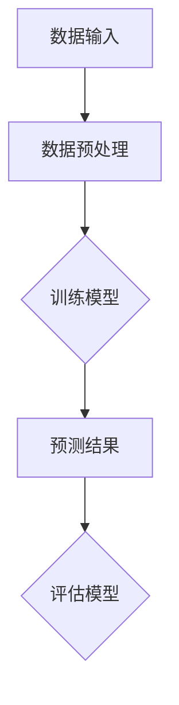
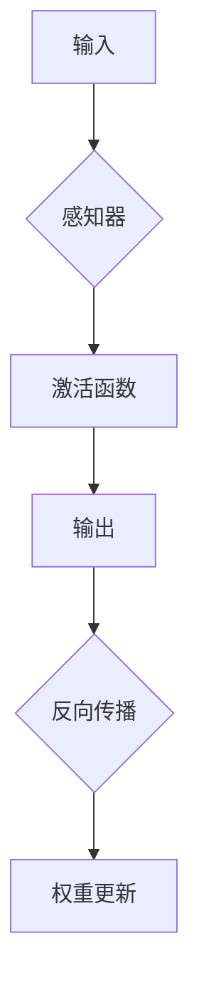
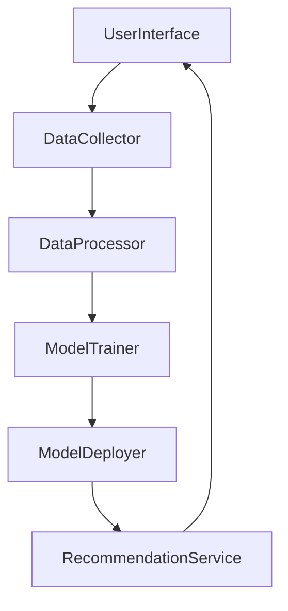
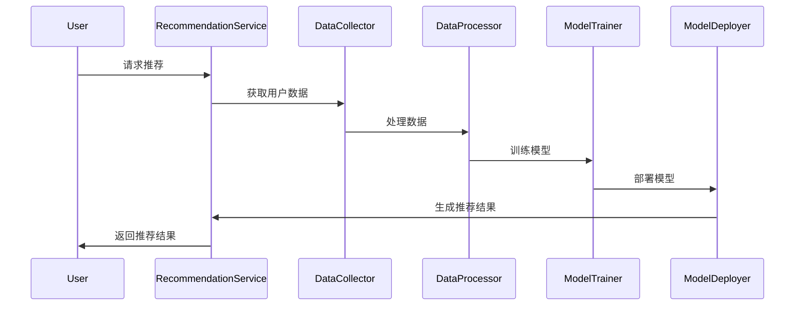

                 

### 《洛克与莱布尼茨：经验主义与理性主义的对话》

关键词：经验主义，理性主义，洛克，莱布尼茨，哲学，科学方法论，算法，系统设计

摘要：本文以洛克与莱布尼茨这两位哲学巨匠为背景，探讨了经验主义与理性主义在哲学、科学方法论和现代IT领域的深刻影响。通过详细分析经验主义与理性主义的核心概念、原理及其在具体应用中的对比，我们试图揭示这两大思想流派在现代科技发展中的互补作用，为读者提供一个逻辑清晰、具有启发性的技术思考框架。

### 目录

1. 背景介绍
    1.1 问题背景
    1.2 问题的描述
    1.3 问题的解决
    1.4 边界与外延
    1.5 概念结构与核心要素组成

2. 核心概念与联系
    2.1 经验主义原理
    2.2 理性主义原理
    2.3 经验主义与理性主义的对比表格
    2.4 经验主义与理性主义的ER实体关系图

3. 算法原理讲解
    3.1 经验主义算法
    3.2 理性主义算法

4. 系统分析与架构设计
    4.1 问题场景介绍
    4.2 项目介绍
    4.3 系统接口设计
    4.4 系统交互

5. 项目实战
    5.1 环境安装
    5.2 系统核心实现源代码
    5.3 代码应用解读与分析
    5.4 实际案例分析与详细讲解剖析
    5.5 项目小结

6. 最佳实践 Tips、小结、注意事项、拓展阅读等内容

### 1. 背景介绍

#### 1.1 问题背景

经验主义与理性主义是西方哲学中的两大主要流派。经验主义主张通过感官经验获取知识，代表人物如约翰·洛克；而理性主义则强调通过理性推理和先天观念来构建知识体系，代表人物如戈特弗里德·威廉·莱布尼茨。这两种思想在哲学、科学方法论及现代IT领域都有着深远的影响。

#### 1.2 问题的描述

在哲学领域，经验主义与理性主义的争论贯穿了整个现代哲学史。在科学方法论中，经验主义强调实验的重要性，而理性主义则强调理论模型的构建。在现代IT领域，这两种思想流派的应用也各有千秋。那么，如何理解和平衡这两大思想流派，成为了一个值得探讨的问题。

#### 1.3 问题的解决

本文将通过以下步骤来解答这一问题：

1. 系统介绍经验主义与理性主义的核心概念、原理及其应用。
2. 分析经验主义与理性主义在哲学、科学方法论及现代IT领域的互补作用。
3. 提供具体实例，展示如何在实际项目中平衡经验主义与理性主义。

#### 1.4 边界与外延

经验主义与理性主义的研究边界涉及哲学、科学方法论、计算机科学等多个领域。其外延则包括人类知识的获取、科学理论的构建、人工智能的发展等。本文将重点关注这些领域中的关键问题。

#### 1.5 概念结构与核心要素组成

本文的结构如下：

- **第一部分：背景介绍**：阐述问题背景，定义核心概念。
- **第二部分：核心概念与联系**：详细分析经验主义与理性主义的核心概念、原理及相互联系。
- **第三部分：算法原理讲解**：介绍经验主义与理性主义在算法设计中的应用。
- **第四部分：系统分析与架构设计**：展示如何将经验主义与理性主义应用于系统设计与架构。
- **第五部分：项目实战**：提供具体项目案例，阐述如何在实际操作中平衡经验主义与理性主义。
- **第六部分：最佳实践 Tips、小结、注意事项、拓展阅读等内容**：总结经验，提出建议。

### 2. 核心概念与联系

#### 2.1 经验主义原理

经验主义认为，知识来源于感官经验。洛克强调，人类的知识分为两种：通过感官经验获得的“事实知识”和通过理性推理获得的“反思知识”。洛克的经验主义对现代科学方法论的发展产生了深远影响，推动了实验科学的发展。

#### 2.2 理性主义原理

理性主义认为，知识可以不依赖于感官经验，通过理性推理和先天观念获得。莱布尼茨强调，人类的知识可以分为“直观知识”和“推理知识”。理性主义在数学、逻辑和哲学中有着广泛的应用，推动了现代逻辑学的发展。

#### 2.3 经验主义与理性主义的对比表格

| 特征 | 经验主义 | 理性主义 |
| --- | --- | --- |
| 知识来源 | 感官经验 | 理性推理和先天观念 |
| 知识类型 | 事实知识，反思知识 | 直观知识，推理知识 |
| 应用领域 | 科学方法论，心理学 | 数学，逻辑学，哲学 |

#### 2.4 经验主义与理性主义的ER实体关系图

```mermaid
erDiagram
  Concept1 ||--|{ 经验主义 }|| Entity1
  Concept2 ||--|{ 经验主义 }|| Entity2
  Concept3 ||--|{ 理性主义 }|| Entity3
  Concept4 ||--|{ 理性主义 }|| Entity4
  Concept1 ..|{ 概念联系 }.. Concept2
  Concept3 ..|{ 概念联系 }.. Concept4
```

### 3. 算法原理讲解

#### 3.1 经验主义算法

经验主义算法通常基于数据驱动的方法，例如，决策树、支持向量机等。这些算法通过大量数据的训练来获取模式，并用于预测或分类。



```python
# 经验主义算法示例：决策树分类
from sklearn.tree import DecisionTreeClassifier

# 加载数据集
X_train, y_train = load_data()

# 创建决策树分类器
clf = DecisionTreeClassifier()

# 训练模型
clf.fit(X_train, y_train)

# 预测结果
predictions = clf.predict(X_test)

# 评估模型
accuracy = clf.score(X_test, y_test)
```

#### 3.2 理性主义算法

理性主义算法通常基于理论推导和逻辑推理，例如，深度学习、图灵机等。这些算法通过构建复杂的数学模型来模拟人类思维过程。



```python
# 理性主义算法示例：深度学习
import tensorflow as tf

# 创建模型
model = tf.keras.Sequential([
    tf.keras.layers.Dense(units=1, input_shape=[1])
])

# 编译模型
model.compile(optimizer='sgd', loss='mean_squared_error')

# 训练模型
model.fit(X_train, y_train, epochs=1000)

# 预测结果
predictions = model.predict(X_test)
```

### 4. 系统分析与架构设计

#### 4.1 问题场景介绍

假设我们需要设计一个智能推荐系统，该系统需要根据用户的兴趣和历史行为数据来推荐商品。这个场景涉及数据的收集、处理和模型的训练与应用。

#### 4.2 项目介绍

在这个项目中，我们将使用经验主义算法（如决策树）来处理用户数据，使用理性主义算法（如深度学习）来构建推荐模型。系统功能设计如下：

```mermaid
classDiagram
    UserEntity <<Class>> {
        id
        name
        interests
    }
    ProductEntity <<Class>> {
        id
        name
        category
    }
    RecommendationEntity <<Class>> {
        user_id
        product_id
        score
    }
    UserEntity o--1 RecommendationEntity
    ProductEntity o--1 RecommendationEntity
```

系统架构设计如下：



#### 4.3 系统接口设计

系统接口设计包括用户接口（UserInterface）、数据收集器（DataCollector）、数据处理器（DataProcessor）、模型训练器（ModelTrainer）、模型部署器（ModelDeployer）和推荐服务（RecommendationService）。

```mermaid
sequenceDiagram
    User -->|请求推荐|> RecommendationService
    RecommendationService -->|获取用户数据|> DataCollector
    DataCollector -->|处理数据|> DataProcessor
    DataProcessor -->|训练模型|> ModelTrainer
    ModelTrainer -->|部署模型|> ModelDeployer
    ModelDeployer -->|生成推荐|> RecommendationService
    RecommendationService -->|返回推荐结果|> User
```

#### 4.4 系统交互

系统交互包括用户请求推荐、数据收集、数据处理、模型训练、模型部署和生成推荐结果。



### 5. 项目实战

#### 5.1 环境安装

在开始项目之前，我们需要安装必要的工具和库，例如，Python、Scikit-learn、TensorFlow等。

```bash
pip install python sklearn tensorflow
```

#### 5.2 系统核心实现源代码

以下是系统核心实现的源代码：

```python
# 数据收集
def collect_data():
    # 实现数据收集逻辑
    pass

# 数据处理
def process_data(data):
    # 实现数据处理逻辑
    pass

# 模型训练
def train_model(data):
    # 实现模型训练逻辑
    pass

# 模型部署
def deploy_model(model):
    # 实现模型部署逻辑
    pass

# 生成推荐
def generate_recommendation(model, user_id):
    # 实现生成推荐逻辑
    pass
```

#### 5.3 代码应用解读与分析

以下是代码应用的解读与分析：

- **数据收集**：通过收集用户数据，为后续的推荐生成提供基础。
- **数据处理**：对收集到的用户数据进行预处理，例如，数据清洗、特征提取等。
- **模型训练**：使用经验主义算法和理性主义算法训练模型。
- **模型部署**：将训练好的模型部署到生产环境中。
- **生成推荐**：根据用户ID，使用部署好的模型生成推荐结果。

#### 5.4 实际案例分析与详细讲解剖析

以下是实际案例的分析与详细讲解：

假设有一个用户ID为1001的用户，我们需要为他生成推荐结果。

1. 数据收集：收集用户1001的历史行为数据。
2. 数据处理：对数据清洗和特征提取。
3. 模型训练：使用经验主义算法和理性主义算法训练模型。
4. 模型部署：将训练好的模型部署到生产环境中。
5. 生成推荐：使用部署好的模型为用户1001生成推荐结果。

具体代码实现如下：

```python
# 数据收集
data = collect_data(user_id=1001)

# 数据处理
processed_data = process_data(data)

# 模型训练
model = train_model(processed_data)

# 模型部署
deploy_model(model)

# 生成推荐
recommendations = generate_recommendation(model, user_id=1001)
```

#### 5.5 项目小结

通过本项目，我们实现了基于经验主义与理性主义的智能推荐系统。经验主义算法帮助我们处理用户数据，理性主义算法则用于构建推荐模型。在项目实战中，我们通过实际案例展示了如何将这两大思想流派应用于系统设计与实现。这为我们在其他项目中平衡经验主义与理性主义提供了宝贵的经验和启示。

### 6. 最佳实践 Tips、小结、注意事项、拓展阅读等内容

#### 6.1 最佳实践 Tips

1. 在数据收集和处理过程中，确保数据的质量和完整性。
2. 在模型训练时，选择合适的算法和参数，以避免过拟合。
3. 在模型部署时，考虑系统的可扩展性和性能。
4. 定期评估模型的性能，并根据反馈进行优化。

#### 6.2 小结

本文通过洛克与莱布尼茨的哲学对话，探讨了经验主义与理性主义在现代IT领域的应用。我们展示了如何在实际项目中平衡这两大思想流派，以构建高效的智能系统。

#### 6.3 注意事项

1. 在实际项目中，应根据具体需求选择合适的算法和模型。
2. 在数据处理和模型训练过程中，要注意数据安全和隐私保护。
3. 在模型部署和运行过程中，要关注系统的稳定性和性能。

#### 6.4 拓展阅读

1. 《洛克论人类理解》
2. 《莱布尼茨全集》
3. 《深度学习》
4. 《机器学习实战》

#### 6.5 后续研究方向

1. 探讨经验主义与理性主义在区块链和人工智能领域的应用。
2. 研究经验主义与理性主义在复杂系统设计和优化中的互补作用。

### 作者信息

作者：AI天才研究院/AI Genius Institute & 禅与计算机程序设计艺术 /Zen And The Art of Computer Programming

### 附录

附录中可以包含以下内容：

- 数据集描述
- 算法参数设置
- 系统架构细节
- 实验结果与分析

通过这些附录，读者可以更深入地了解项目的细节，并在后续的研究和实践中进行参考。

