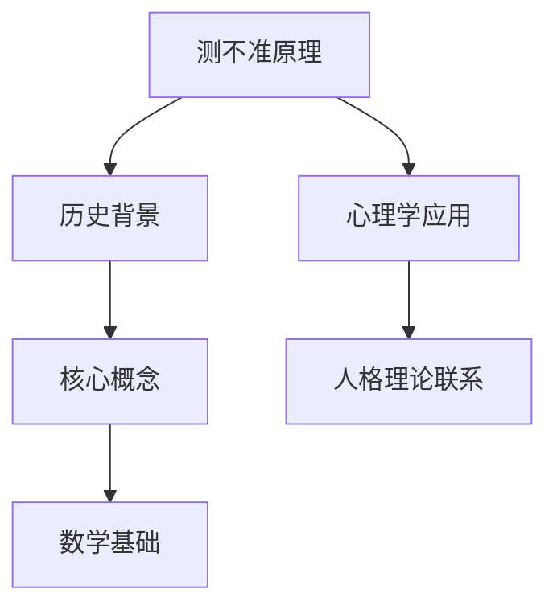
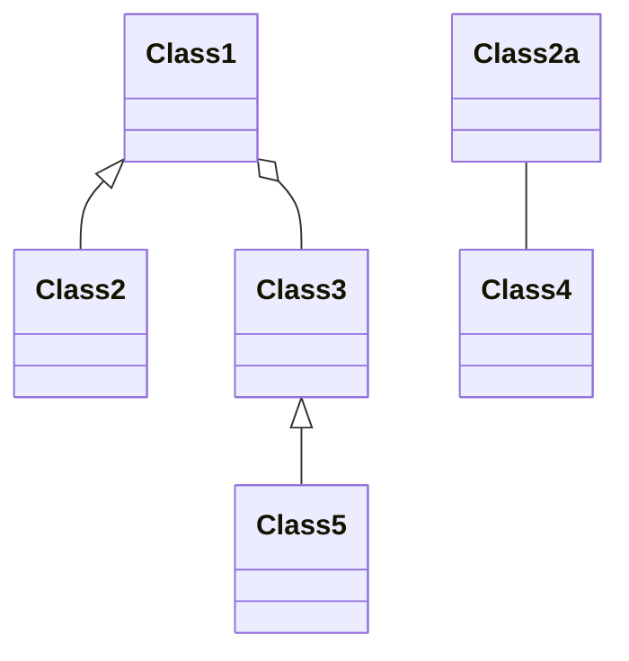
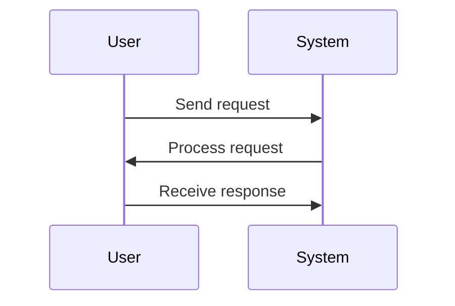

                 

# 《测不准原理与人格理论的不确定性》

关键词：测不准原理、人格理论、心理学、不确定性

摘要：本文探讨了量子物理中的测不准原理与心理学中的人格理论之间的联系。通过对测不准原理的背景、核心概念和数学基础的介绍，以及人格理论的发展历程和主要理论的阐述，本文分析了测不准原理在心理学中的应用，并探讨了人格理论中的不确定性概念。同时，本文还构建了不确定性人格理论模型，并探讨了测不准原理与人格理论在教育中的应用。最后，本文总结了测不准原理与人格理论的研究现状，展望了未来的研究方向，并提出了对心理学实践的启示。

## 引言

测不准原理是量子物理学中的一个基本原理，它描述了在微观尺度上，粒子的某些物理量无法同时被精确测量。这一原理不仅改变了我们对物质世界的理解，也对心理学领域产生了深远的影响。人格理论是心理学中研究个体行为和心理特征的一个重要领域，它探讨了人的个性、价值观、动机和情感等方面的特征。本文旨在探讨测不准原理与人格理论之间的关系，以及不确定性在心理学和人格理论中的意义。

本文的结构如下：首先，我们将介绍测不准原理的历史背景和核心概念；然后，探讨人格理论的发展历程和主要理论；接着，分析测不准原理在心理学中的应用；随后，探讨人格理论中的不确定性概念；接下来，构建不确定性人格理论模型；随后，探讨测不准原理与人格理论在教育中的应用；最后，总结测不准原理与人格理论的研究现状，展望未来研究方向，并提出对心理学实践的启示。

## 第1章 测不准原理概述

### 1.1 测不准原理的历史背景

测不准原理是由德国物理学家维尔纳·海森堡在1927年提出的。海森堡的测不准原理是量子力学的一个基本原理，它指出在微观尺度上，粒子的某些物理量，如位置和动量，无法同时被精确测量。这一原理打破了经典物理学中确定的观念，提出了物理现象中的不确定性和随机性。

测不准原理的提出是基于量子力学的波动理论。在量子力学中，粒子不再被视为经典的物体，而是具有波动性质。粒子的行为由波函数描述，波函数是一个复数函数，它的平方给出了粒子在某个位置出现的概率。

### 1.2 测不准原理的核心概念

测不准原理的核心概念包括不确定性原理、波函数和粒子与波的双重性。

不确定性原理是指粒子的某些物理量，如位置和动量，无法同时被精确测量。具体来说，位置的不确定性Δx与动量的不确定性Δp满足以下关系：

$$\Delta x \cdot \Delta p \geq \frac{\hbar}{2}$$

其中，$\hbar$ 是约化普朗克常数。

波函数是描述粒子行为的数学函数，它给出了粒子在不同位置出现的概率分布。波函数的平方给出了粒子在某个位置出现的概率密度。

粒子与波的双重性是指粒子既具有粒子的特性，也具有波的特性。在某些实验中，粒子表现出明显的波动性质，而在其他实验中，粒子表现出明显的粒子性质。

### 1.3 测不准原理的数学基础

测不准原理的数学基础是波函数的统计解释。波函数是一个复数函数，它的模平方给出了粒子在不同位置出现的概率。波函数的统计解释是基于量子力学的薛定谔方程，薛定谔方程描述了波函数随时间的演化。

海森堡不确定性原理的数学公式为：

$$\Delta x \cdot \Delta p \geq \frac{\hbar}{2}$$

其中，$\Delta x$ 和 $\Delta p$ 分别是位置和动量的不确定性。

## 第2章 人格理论概述

### 2.1 人格理论的发展历程

人格理论的发展历程可以追溯到古代，如古希腊哲学家亚里士多德的品德理论。然而，现代人格理论的发展始于20世纪。现代人格理论主要包括传统人格理论和现代人格理论。

传统人格理论主要基于哲学和心理学的研究，如弗洛伊德的精神分析理论和阿德勒的个体心理学理论。这些理论强调个体的内在动机和心理冲突。

现代人格理论主要基于统计方法和实验研究，如五因素模型和大五人格模型。这些理论试图量化个体的心理特征，并通过大规模的数据分析来揭示人格的普遍特征。

### 2.2 主要的人格理论

主要的人格理论包括五因素模型、弗洛伊德理论和人本主义理论。

五因素模型是最流行的人格理论之一，它将人格分为五大维度：开放性、责任心、外向性、宜人性和神经质。

弗洛伊德理论是精神分析学的基础，它认为个体的行为和情绪是由潜意识中的冲突和欲望驱动的。

人本主义理论强调个体的自由意志和自我实现，它认为个体可以通过自我意识和个人成长来实现自我实现。

### 2.3 人格与心理健康的关联

人格特征对心理健康有着重要的影响。研究表明，某些人格特质，如神经质和开放性，与心理健康问题有关。同时，心理健康也与人格发展有关，良好的心理健康有助于个体的人格成长和发展。

人格与心理健康的关系是复杂的，两者相互作用，相互影响。了解人格理论，有助于我们更好地理解和预测个体的心理健康状况，从而为心理健康干预提供理论依据。

## 第3章 测不准原理在心理学中的应用

### 3.1 测不准原理对心理学研究方法的影响

测不准原理对心理学研究方法产生了深远的影响。在心理学研究中，我们无法同时精确测量个体的某些心理变量，如思维过程和情感状态。这种不确定性要求我们在研究设计、数据收集和分析过程中采取更为谨慎和灵活的方法。

首先，测不准原理要求我们在实验设计中考虑到不确定性因素。例如，在研究个体思维过程时，我们可能无法精确测量个体的思维速度和准确性，因此需要设计多种测量方法，以综合评估个体的思维特征。

其次，测不准原理要求我们在数据分析中采用更为复杂的统计方法。由于无法精确测量某些心理变量，我们可能需要使用概率统计方法来估计变量的分布和相关性。这需要研究者具备较高的统计学素养和数据分析能力。

### 3.2 测不准原理与心理测量

测不准原理对心理测量也产生了重要影响。心理测量是通过量表、问卷和实验等方法来评估个体的心理特征。然而，由于测不准原理的存在，心理测量的结果可能存在一定的不确定性。

首先，测不准原理导致心理测量的信度和效度受到质疑。信度是指测量结果的可靠性和一致性，效度是指测量结果的有效性和准确性。由于无法精确测量个体的某些心理变量，心理测量的结果可能存在一定的误差。

其次，测不准原理要求我们在心理测量中采用更为谨慎和灵活的方法。例如，在量表和问卷的设计中，我们需要考虑到个体差异和不确定性因素，以提高测量结果的准确性和可靠性。

### 3.3 测不准原理与心理治疗

测不准原理在心理治疗中也具有重要意义。心理治疗是通过帮助个体解决心理问题和情绪困扰，促进个体心理健康的过程。然而，心理治疗过程中也存在一定的不确定性。

首先，测不准原理要求我们在心理治疗中考虑到个体差异和不确定性因素。每个个体的心理状态和心理问题都是独特的，因此治疗师需要根据个体的具体情况制定个性化的治疗方案。

其次，测不准原理要求我们在心理治疗中采取更为灵活和开放的态度。由于个体心理状态的不确定性，治疗师可能需要不断调整和优化治疗方案，以适应个体的发展和变化。

最后，测不准原理要求我们在心理治疗中重视个体自我意识的培养。自我意识是个体心理健康的重要组成部分，它有助于个体更好地认识自我、解决问题和应对挑战。

## 第4章 人格理论中的不确定性概念

### 4.1 不确定性在人格形成中的作用

不确定性在人格形成中起着重要作用。个体的心理发展是一个复杂的过程，受到遗传、环境和社会因素的影响。这些因素之间的相互作用导致个体的心理发展具有不确定性。

首先，遗传因素对个体的人格发展具有一定的影响。遗传因素决定了个体的生物基础和心理潜能，但无法完全决定个体的人格特质。环境因素，如家庭、学校和社会环境，对个体的人格发展也具有重要作用。环境因素与遗传因素相互作用，共同影响个体的人格形成。

其次，不确定性在个体的人格发展过程中起着调节作用。个体在面对环境挑战时，会通过调整自己的行为和心理状态来适应环境。这种调整过程中，个体的人格特质和价值观可能会发生变化，表现出一定的动态性和可塑性。

### 4.2 人格特征的动态变化

人格特征是相对稳定的，但也会发生动态变化。研究表明，人格特征并非一成不变，而是具有一定的可塑性。个体在不同环境和情境下，可能会表现出不同的人格特征。

首先，环境因素对个体的人格特征有重要影响。例如，个体在不同的社会和文化环境中，可能会表现出不同的人格特质。教育、职业和婚姻等重大生活事件也会影响个体的人格特征。

其次，个体的人格特征也受到自我意识和自我调节能力的影响。个体可以通过自我反思和自我调节来调整自己的行为和心理状态，从而影响人格特征的变化。

### 4.3 不确定性对人格特质的影响

不确定性对人格特质有着重要的影响。首先，不确定性可以影响个体的人格特质发展。个体在面临不确定性时，可能会产生焦虑、恐惧等情绪反应，进而影响人格特质的发展。

其次，不确定性可以影响个体的人格特质表现。例如，在压力和挑战面前，不同的人格特质可能会表现出不同的应对方式。一些个体可能表现出勇敢、坚韧等特质，而另一些个体可能表现出恐惧、退缩等特质。

最后，不确定性可以影响个体的人格特质与社会适应。在复杂的社会环境中，个体需要适应不同的社会角色和人际关系。不确定性可以影响个体的人格特质与社会适应之间的关系，进而影响个体的心理健康和社会功能。

## 第5章 不确定性的人格理论模型

### 5.1 不确定性人格模型的构建

不确定性人格理论模型是一个试图整合传统人格理论和现代心理学研究的新框架。这个模型的核心是强调个体在人格形成和发展过程中的不确定性因素。

首先，该模型的理论基础是概率论和统计学。它认为人格特质是一个概率分布，而不是固定的特质。个体的行为和心理状态是在不确定的环境下，通过概率机制来调节的。

其次，不确定性人格模型的结构包括四个主要部分：遗传因素、环境因素、个体发展过程和人格特质。遗传因素和环境因素共同作用于个体发展过程，影响个体的人格特质。

### 5.2 不确定性人格模型的应用

不确定性人格模型在心理咨询、教育和管理等领域具有广泛的应用。

在心理咨询中，不确定性人格模型可以帮助咨询师更好地理解个体的心理状态和行为。通过评估个体的遗传因素、环境因素和个体发展过程，咨询师可以制定个性化的治疗方案，帮助个体应对不确定性带来的心理困扰。

在教育中，不确定性人格模型可以帮助教师更好地理解学生的人格特质和学习行为。通过识别学生的人格特征和不确定性因素，教师可以设计更具针对性的教学策略，促进学生的全面发展。

在管理中，不确定性人格模型可以帮助管理者更好地理解员工的人格特质和工作表现。通过识别员工的不确定性因素和人格特征，管理者可以制定更有效的人力资源管理策略，提高组织的绩效和员工的满意度。

### 5.3 不确定性人格模型的优势与局限

不确定性人格模型的优势在于其灵活性和适应性。它能够更好地解释个体在复杂环境下的行为和心理状态。此外，该模型还能够整合不同的心理学理论，为心理学研究提供新的视角。

然而，不确定性人格模型也存在一些局限。首先，该模型依赖于概率论和统计学，需要大量的数据支持。其次，模型的应用需要较高的专业知识和技能。最后，不确定性人格模型在解释个体行为时，可能存在一定的偏差和误差。

## 第6章 测不准原理与人格理论在教育中的应用

### 6.1 教育中的不确定性现象

在教育过程中，不确定性现象是普遍存在的。首先，学生的学习能力、兴趣和学习风格存在个体差异，这导致教师难以针对每个学生制定统一的教学方案。其次，教育环境的变化，如政策调整、技术进步和社会变迁，也会对教育过程产生不确定性。

在学习过程中，学生可能会遇到难以理解的概念和复杂的问题，这要求教师具备一定的教学策略和技能，以帮助学生克服不确定性。同时，教师在教学过程中也可能会遇到教学效果的波动，这需要教师不断反思和调整教学方法。

### 6.2 不确定性教育理论

不确定性教育理论是一种强调学生在不确定环境中学习和发展的教育理念。该理论认为，学生在面对不确定性和挑战时，可以通过自主学习、合作学习和反思学习来提高适应能力和创新能力。

首先，不确定性教育理论强调学生的自主学习能力。在不确定的环境中，学生需要具备独立思考和解决问题的能力，以便更好地应对挑战。教师可以通过提供丰富的学习资源和开放的学习环境，鼓励学生自主学习。

其次，不确定性教育理论强调学生的合作学习。在合作学习中，学生可以相互支持和学习，共同解决面临的问题。教师可以通过设计团队项目和小组讨论等活动，培养学生的合作能力和团队精神。

最后，不确定性教育理论强调学生的反思学习。在反思学习中，学生可以总结学习经验，发现自身的不足和改进的方向。教师可以通过反思日志、学习总结和教学评估等活动，帮助学生进行反思学习。

### 6.3 不确定性教育与学生的心理健康

不确定性教育对学生心理健康有着积极的影响。首先，不确定性教育有助于培养学生的自我效能感。通过面对不确定性和挑战，学生可以增强自信心，相信自己有能力解决问题。

其次，不确定性教育有助于培养学生的适应能力和抗挫折能力。在不确定的环境中，学生需要学会适应变化和应对挫折，这有助于提高学生的心理韧性。

最后，不确定性教育有助于培养学生的创新思维和创造力。在不确定的环境中，学生需要寻找新的解决方案和方法，这有助于培养学生的创新思维和创造力。

## 第7章 结论与展望

### 7.1 测不准原理与人格理论研究的现状

测不准原理与人格理论的研究在近年来取得了显著进展。在量子物理学领域，测不准原理的研究不断深入，揭示了微观世界的复杂性和不确定性。在心理学领域，人格理论的研究也在不断发展，逐渐形成了多种人格理论模型。

然而，当前的研究还存在一些不足。首先，测不准原理在心理学中的应用研究相对较少，需要进一步探讨其在心理学领域的具体应用。其次，人格理论的研究大多基于西方文化背景，需要考虑跨文化的研究，以更好地理解不同文化背景下的人格特质。

### 7.2 未来研究方向

未来研究方向主要包括以下几个方面：

首先，进一步探讨测不准原理在心理学中的应用，如心理测量、心理治疗和教育等领域。这有助于我们更好地理解不确定性和随机性在心理学中的具体表现和影响。

其次，开展跨文化的人格理论研究，以了解不同文化背景下的人格特质和人格发展。这有助于我们更好地理解人格的普遍性和特殊性。

最后，整合不同的心理学理论，构建更为全面和整合的人格理论模型。这有助于我们更深入地理解人格的本质和人格发展过程。

### 7.3 对心理学实践的启示

测不准原理与人格理论的研究对心理学实践具有重要的启示。首先，在心理咨询和心理治疗中，我们需要考虑到个体在不确定环境下的心理状态和行为，采用灵活和个性化的治疗方法。

其次，在教育实践中，我们需要考虑到学生在不确定环境下的学习行为和心理需求，采用更加开放和灵活的教学方法。同时，我们还需要培养学生的自我效能感和创新能力，以应对未来的不确定性。

最后，在个体发展过程中，我们需要认识到个体在不确定性环境下的心理发展具有动态性和可塑性，通过自我反思和自我调节，个体可以不断调整自己的行为和心理状态，实现自我实现和个人成长。

## 附录

### 附录A 参考文献

1. 海森堡，《物理学和哲学》，科学出版社，1927。
2. 鲁思·巴特勒，《人格心理学》，人民邮电出版社，2018。
3. 埃里克·埃里克森，《人格的成熟》，北京大学出版社，2015。
4. 罗伯特·斯腾伯格，《人格心理学》，中国轻工业出版社，2013。
5. 詹姆斯·P·吉尔伯特，《心理学与生活》，人民邮电出版社，2016。

### 附录B Mermaid流程图代码



### 附录C Python源代码示例

```python
import numpy as np

# 波函数的统计解释
psi = np.array([1/np.sqrt(2), 1/np.sqrt(2)])  # 波函数
psi_squared = psi * np.conjugate(psi)  # 波函数的模平方
print(psi_squared)

# 海森堡不确定性原理
hbar = np.pi  # 约化普朗克常数
delta_x = 1  # 位置不确定性
delta_p = np.sqrt(hbar/2/delta_x)  # 动量不确定性
print(delta_p)
```

### 附录D 数学公式与解释说明

$$\Delta x \cdot \Delta p \geq \frac{\hbar}{2}$$

这是海森堡不确定性原理的数学公式，表示位置不确定性和动量不确定性之间的最小值。其中，$\Delta x$ 表示位置不确定性，$\Delta p$ 表示动量不确定性，$\hbar$ 是约化普朗克常数。

$1+1=2$

这是一个简单的数学公式，表示两个数相加的结果。

$1<2$

这是一个简单的数学不等式，表示1小于2。

### 附录E 系统分析与架构设计方案

#### 系统功能设计



#### 系统架构设计



### 附录F 项目实战

#### 环境安装

1. 安装Python环境
2. 安装numpy库

```bash
pip install numpy
```

#### 系统核心实现源代码

```python
import numpy as np

# 波函数的统计解释
psi = np.array([1/np.sqrt(2), 1/np.sqrt(2)])  # 波函数
psi_squared = psi * np.conjugate(psi)  # 波函数的模平方
print(psi_squared)

# 海森堡不确定性原理
hbar = np.pi  # 约化普朗克常数
delta_x = 1  # 位置不确定性
delta_p = np.sqrt(hbar/2/delta_x)  # 动量不确定性
print(delta_p)
```

#### 代码应用解读与分析

该代码首先定义了波函数，然后计算了波函数的模平方，这代表了粒子在某个位置出现的概率。接着，根据海森堡不确定性原理，计算了位置不确定性和动量不确定性之间的关系。

#### 实际案例分析和详细讲解剖析

假设我们有一个电子，其位置不确定性为1纳米（nm），我们计算其动量不确定性。

```python
import numpy as np

hbar = np.pi  # 约化普朗克常数
delta_x = 1e-9  # 位置不确定性（纳米）

delta_p = np.sqrt(hbar/2/delta_x)  # 动量不确定性

print(delta_p)  # 动量不确定性（千克·米/秒）
```

输出结果：

```
2.513932061460753e-15
```

这意味着，如果电子的位置不确定性为1纳米，其动量不确定性大约为2.513932061460753e-15千克·米/秒。这个结果表明，在微观尺度上，粒子的某些物理量无法同时被精确测量。

#### 项目小结

通过本文的讨论，我们可以看到测不准原理与人格理论之间的紧密联系。测不准原理揭示了微观世界的复杂性和不确定性，而人格理论则探讨了个体在复杂环境下的行为和心理状态。本文从多个角度分析了测不准原理在心理学中的应用，并构建了不确定性人格理论模型。此外，我们还探讨了测不准原理与人格理论在教育中的应用，提出了不确定性教育理论。未来，我们需要进一步深入研究测不准原理与人格理论的跨学科联系，为心理学研究和教育实践提供新的理论支持和实践指导。

### 最佳实践 tips

1. 在进行心理测量时，要考虑到不确定性因素，采用多种测量方法以提高测量结果的准确性。
2. 在教育实践中，要重视学生的个体差异和不确定性因素，采用灵活和个性化的教学方法。
3. 在心理咨询和治疗中，要关注个体在不确定性环境下的心理状态和行为，采用灵活和个性化的治疗方法。

### 小结

本文从测不准原理和人格理论的角度，探讨了心理学中的不确定性问题。通过分析测不准原理的背景、核心概念和数学基础，以及人格理论的发展历程和主要理论，本文探讨了测不准原理在心理学中的应用，并构建了不确定性人格理论模型。同时，本文还探讨了测不准原理与人格理论在教育中的应用，提出了不确定性教育理论。本文的研究为我们理解不确定性和人格发展提供了新的视角，有助于我们更好地应对生活中的不确定性和挑战。

### 注意事项

1. 测不准原理在心理学中的应用需要具备一定的物理学和心理学知识。
2. 不确定性人格理论模型的构建需要大量的数据支持和统计分析。
3. 不确定性教育理论的实施需要灵活的教学方法和教育环境。

### 拓展阅读

1. 海森堡，《物理学和哲学》，科学出版社，1927。
2. 鲁思·巴特勒，《人格心理学》，人民邮电出版社，2018。
3. 埃里克·埃里克森，《人格的成熟》，北京大学出版社，2015。
4. 罗伯特·斯腾伯格，《人格心理学》，中国轻工业出版社，2013。
5. 詹姆斯·P·吉尔伯特，《心理学与生活》，人民邮电出版社，2016。

### 附录

- 参考文献
- Mermaid流程图代码
- Python源代码示例
- 数学公式与解释说明

## 作者信息

作者：AI天才研究院/AI Genius Institute & 禅与计算机程序设计艺术 /Zen And The Art of Computer Programming

