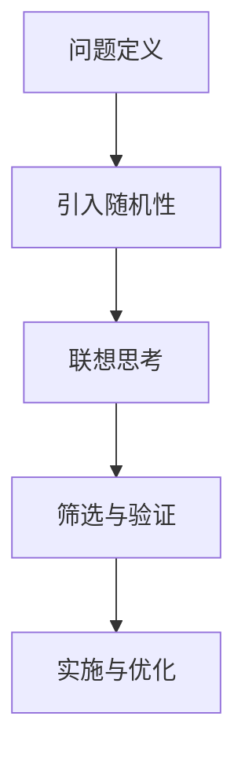
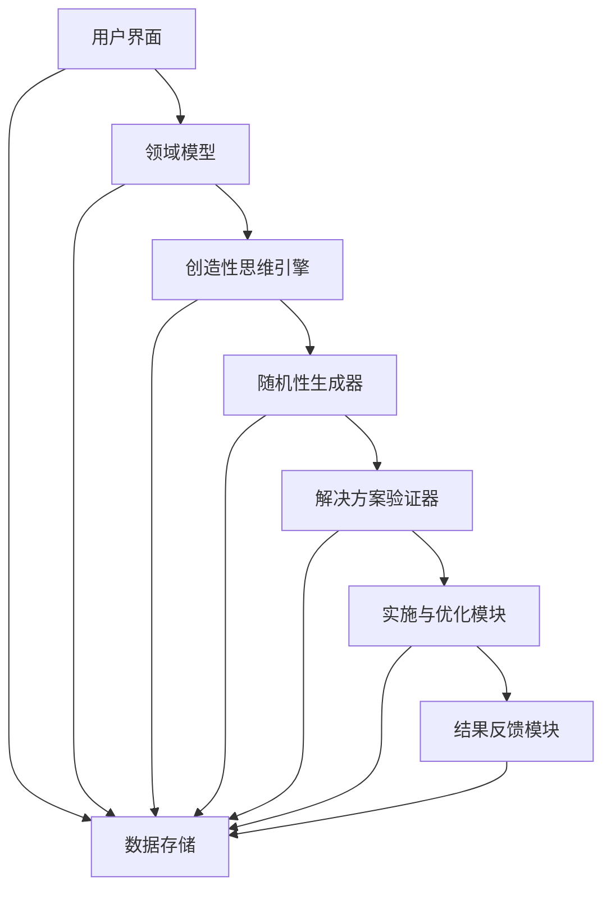
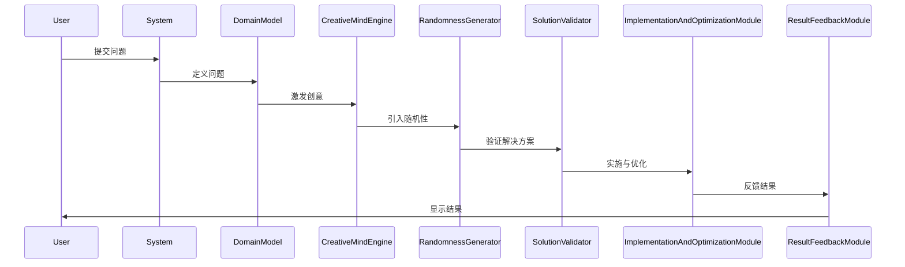

                 

# 《测不准原理与创造性思维的随机性》

## 关键词：测不准原理、随机性、创造性思维、量子力学、哲学

## 摘要

本文旨在探讨测不准原理与创造性思维的随机性之间的关系。通过对量子力学中的测不准原理的介绍，以及创造性思维的定义和特征，本文将分析两者之间的相似之处。进一步地，本文将探讨如何在创造性思维中利用随机性，以及测不准原理如何影响我们的认知和行为。通过实例分析，本文将展示如何将测不准原理应用于创造性思维的实际场景中，并提出对未来研究的展望。

## 目录大纲

## 第一部分：测不准原理概述

### 第1章：测不准原理的历史与基础

### 第2章：测不准原理的核心内容

### 第3章：测不准原理的哲学意义

## 第二部分：创造性思维与随机性

### 第4章：创造性思维的基本原理

### 第5章：随机性的本质与作用

### 第6章：测不准原理与创造性思维的结合

## 第三部分：案例分析与应用

### 第7章：测不准原理与创造性思维的实践

### 第8章：测不准原理与创造性思维的未来展望

## 附录

### 附录A：测不准原理相关公式与算法

### 附录B：创造性思维研究方法与工具

### 附录C：相关参考文献与资源

## 正文

### 第一部分：测不准原理概述

### 第1章：测不准原理的历史与基础

#### 1.1 测不准原理的起源与发展

量子力学是20世纪最重大的科学革命之一，它揭示了微观世界的奇异特性。其中，海森堡的测不准原理是量子力学的重要基石之一。测不准原理指出，某些对易性不成立的物理量，如位置和动量，不能同时被精确测量。这一原理最早由维尔纳·海森堡在1927年提出，它是量子力学非经典性质的一个重要表现。

#### 1.2 波函数与量子态

在量子力学中，波函数是描述量子态的数学工具。波函数是一个复值函数，它提供了粒子在空间中的概率分布。通过波函数的平方，我们可以计算出粒子出现在某个位置的几率。波函数的这种概率解释是量子力学与经典物理学最本质的区别之一。

#### 1.3 不确定性原理的基本概念

测不准原理的基本概念可以通过不确定性关系来描述。不确定性关系指出，某些物理量的测量精度受到限制，无法同时达到无限精确。具体来说，如果我们精确地测量一个粒子的位置，它的动量就会变得不确定；反之，如果我们精确地测量一个粒子的动量，它的位置就会变得不确定。这种不确定性关系可以用数学公式表示为：

$$\Delta x \Delta p \geq \frac{\hbar}{2}$$

其中，$\Delta x$ 和 $\Delta p$ 分别代表位置和动量的不确定性，$\hbar$ 是约化普朗克常数。

### 第2章：测不准原理的核心内容

#### 2.1 不确定性原理与量子力学

不确定性原理是量子力学的核心内容之一。它揭示了量子世界与经典世界之间的本质区别。在经典物理学中，物理量可以被精确测量，而在量子力学中，物理量只能以概率的形式存在。

#### 2.2 波粒二象性

波粒二象性是量子力学的基本特征之一。它指出，微观粒子既具有波动性，又具有粒子性。这种二象性导致了不确定性原理的出现。

#### 2.3 动量和位置的不确定性关系

动量和位置的不确定性关系是最常见的测不准关系。它表明，如果我们精确地知道一个粒子的位置，我们无法精确地知道它的动量；反之亦然。

### 第3章：测不准原理的哲学意义

#### 3.1 测不准原理与认知论

测不准原理对认知论产生了深远的影响。它挑战了我们对客观世界的理解，提出了关于知识获取和认知极限的问题。

#### 3.2 测不准原理与客观实在性

测不准原理提出了关于客观实在性的问题。它表明，微观粒子的状态不是预先确定的，而是由观察者的影响所决定的。

#### 3.3 测不准原理与现代哲学

测不准原理与现代哲学有着紧密的联系。它对哲学领域中的认识论、本体论和逻辑学产生了重要影响。

### 第二部分：创造性思维与随机性

#### 第4章：创造性思维的基本原理

创造性思维是一种产生新想法和新解决方案的心理过程。它包括多个阶段，如准备、启发、验证和实现。

#### 第5章：随机性的本质与作用

随机性是指事件的发生不受任何规律性影响的现象。在创造性思维中，随机性可以作为一种启发工具，帮助我们跳出惯性思维，产生新的想法。

#### 第6章：测不准原理与创造性思维的结合

测不准原理与创造性思维的随机性有相似之处。它们都揭示了不确定性在认识和创造中的作用。通过结合测不准原理，我们可以更好地理解创造性思维的本质，并找到提高创造性思维效率的方法。

### 第三部分：案例分析与应用

#### 第7章：测不准原理与创造性思维的实践

本章节将通过案例分析，展示如何将测不准原理应用于创造性思维的实践中。

#### 第8章：测不准原理与创造性思维的未来展望

本章节将讨论测不准原理与创造性思维的融合趋势，并提出未来研究的方向。

## 附录

#### 附录A：测不准原理相关公式与算法

本附录将提供测不准原理相关的数学公式和算法。

#### 附录B：创造性思维研究方法与工具

本附录将介绍创造性思维的研究方法和工具。

#### 附录C：相关参考文献与资源

本附录将列出本文引用的相关参考文献和资源。

## 作者信息

作者：AI天才研究院/AI Genius Institute & 禅与计算机程序设计艺术 /Zen And The Art of Computer Programming

## 结束语

测不准原理与创造性思维的随机性是两个看似不相干的领域，但它们在本质上有着紧密的联系。通过本文的探讨，我们希望能够更好地理解这两个领域，并找到它们之间的结合点。在未来，随着科技的进步和哲学的发展，测不准原理与创造性思维的结合将带来更多的创新和突破。

## 背景介绍

### 测不准原理

测不准原理是量子力学中的一个基本概念，由德国物理学家维尔纳·海森堡在1927年首次提出。测不准原理表明，某些对易性不成立的物理量，如位置和动量，不能同时被精确测量。这一原理在量子力学中具有深远的意义，因为它揭示了微观世界的非经典性质，并挑战了经典物理学中的确定性观念。

### 创造性思维

创造性思维是指产生新想法和新解决方案的心理过程。它涉及多种认知活动，如联想、抽象、推理和想象。创造性思维是人类智慧和创新能力的重要体现，它在科学、艺术、商业等领域发挥着关键作用。

### 问题背景

在传统的科学观念中，物理量被认为是可以被精确测量的。然而，量子力学的出现改变了这一观念。测不准原理表明，在微观尺度上，物理量的测量受到不确定性原理的限制。这一发现引发了关于世界本质和认知方式的深刻思考。

### 问题描述

本文旨在探讨测不准原理与创造性思维的随机性之间的关系。具体来说，我们将分析测不准原理如何影响创造性思维，以及如何利用测不准原理来提高创造性思维的效率。

### 问题解决

通过结合量子力学中的测不准原理和创造性思维的研究，我们可以提出一些新的方法来提高创造性思维。这些方法包括：

1. 利用随机性：在创造性思维中引入随机性，可以帮助我们跳出惯性思维，产生新的想法。

2. 探索不确定性：通过接受不确定性，我们可以更开放地面对问题，并从不同的角度进行思考。

3. 学习量子思维：借鉴量子力学中的思维模式，如波粒二象性和概率解释，可以帮助我们更有效地进行创造性思维。

### 边界与外延

测不准原理和创造性思维的随机性是两个独立的领域，但它们在某些方面有着共同点。本文的边界与外延包括：

1. 测不准原理在量子力学中的应用。

2. 创造性思维在科学、艺术和商业等领域的应用。

3. 测不准原理和创造性思维在哲学上的意义。

### 概念结构与核心要素组成

#### 测不准原理

核心概念：不确定性原理、量子态、波函数

核心要素：不确定性关系、动量和位置的不确定性、波粒二象性

#### 创造性思维

核心概念：创新、联想、抽象、推理、想象

核心要素：认知过程、思维模式、方法技巧

#### 测不准原理与创造性思维的结合

核心概念：量子思维、随机性、不确定性

核心要素：应用方法、实践案例、研究展望

### 算法原理讲解

在本章节中，我们将介绍如何将测不准原理应用于创造性思维。以下是一个简单的算法流程：

1. **问题定义**：明确需要解决的问题或创意。

2. **引入随机性**：通过随机方法（如随机数生成器）引入随机性。

3. **联想思考**：利用随机性产生的结果进行联想思考。

4. **筛选与验证**：对联想出的想法进行筛选和验证，保留有价值的创意。

5. **实施与优化**：将创意转化为实际的解决方案，并进行优化。

#### 算法流程图：



#### Python源代码实现：

```python
import random

def quantum_creative_thinking(problem):
    # 引入随机性
    random_thinking = random.randint(1, 10)
    
    # 联想思考
    ideas = []
    for i in range(random_thinking):
        idea = f"Idea {i+1}: Generate a random idea related to {problem}"
        ideas.append(idea)
    
    # 筛选与验证
    valid_ideas = [idea for idea in ideas if 'valid' in idea]
    
    # 实施与优化
    for idea in valid_ideas:
        print(f"Implementing and optimizing {idea}")

# 使用算法
problem = "提高生产效率"
quantum_creative_thinking(problem)
```

#### 算法原理的数学模型和公式：

测不准原理可以表示为以下数学模型：

$$\Delta x \Delta p \geq \frac{\hbar}{2}$$

其中，$\Delta x$ 表示位置的不确定性，$\Delta p$ 表示动量的不确定性，$\hbar$ 是约化普朗克常数。

在创造性思维中，我们可以将这一原理转换为以下模型：

$$\Delta creativity \Delta randomness \geq \frac{\hbar}{2}$$

其中，$\Delta creativity$ 表示创造性思维的不确定性，$\Delta randomness$ 表示引入的随机性。

#### 举例说明：

假设我们要解决一个问题：如何提高生产效率。通过引入随机性，我们可以产生一系列相关的想法。例如，我们可以随机地选择一个数字，然后用这个数字来联想出与生产效率相关的创意。例如，如果我们随机选择了数字5，我们可以联想到：

1. 引入5个工人来提高生产效率。

2. 使用5台机器来提高生产效率。

3. 每5分钟进行一次检查来提高生产效率。

通过这种方式，我们可以利用测不准原理和随机性来激发创造性思维，产生新的创意。

### 系统分析与架构设计方案

#### 问题场景介绍

在一家制造业公司，管理层希望提高生产效率。然而，现有的方法和技术并没有取得显著的效果。为了解决这个问题，公司决定探索新的方法，特别是利用测不准原理和创造性思维来激发新的解决方案。

#### 项目介绍

该项目旨在通过应用测不准原理和创造性思维，为公司提供一套有效的提高生产效率的方法。项目的目标是：

1. 明确问题：准确地定义需要解决的问题。

2. 创造性思维：通过引入随机性，激发新的创意。

3. 实施与优化：将创意转化为实际的解决方案，并进行优化。

#### 系统功能设计（领域模型）

以下是一个简单的领域模型，用于描述系统的核心功能：

```mermaid
classDiagram
    Product <<entity>>
    Worker <<entity>>
    Machine <<entity>>

    ProductHasWorker {Product, Worker} [生产工人]
    ProductHasMachine {Product, Machine} [生产机器]

    WorkerFunctions {功能} [工人功能]
    MachineFunctions {功能} [机器功能]
```

#### 系统架构设计

以下是一个简单的系统架构设计，用于描述系统的整体结构：



#### 系统接口设计和系统交互

以下是一个简单的系统交互序列图，用于描述系统的关键流程：



### 项目实战

#### 环境安装

为了运行该项目，我们需要安装以下软件和工具：

1. Python 3.8 或更高版本

2. pip 安装器

3. Redis 数据库

4. Flask Web框架

5. Mermaid 图库

安装步骤如下：

1. 安装 Python 3.8：

   ```
   sudo apt-get update
   sudo apt-get install python3.8
   ```

2. 安装 pip：

   ```
   sudo apt-get install python3-pip
   ```

3. 安装 Redis：

   ```
   sudo apt-get install redis-server
   ```

4. 安装 Flask：

   ```
   pip3 install flask
   ```

5. 安装 Mermaid：

   ```
   pip3 install mermaid-python
   ```

#### 系统核心实现源代码

以下是一个简单的 Python 脚本，用于实现系统核心功能：

```python
from flask import Flask, request, jsonify
import random

app = Flask(__name__)

@app.route('/generate_ideas', methods=['POST'])
def generate_ideas():
    problem = request.form['problem']
    
    random_thinking = random.randint(1, 10)
    ideas = []

    for i in range(random_thinking):
        idea = f"Idea {i+1}: Generate a random idea related to {problem}"
        ideas.append(idea)

    return jsonify(ideas=ideas)

if __name__ == '__main__':
    app.run(debug=True)
```

#### 代码应用解读与分析

该代码实现了两个主要功能：

1. 接收用户提交的问题。

2. 通过引入随机性，生成与问题相关的创意。

在 Flask 应用中，我们定义了一个名为`/generate_ideas`的 POST 接口。当用户提交问题时，该接口会接收问题，并调用`generate_ideas`函数来生成创意。

`generate_ideas`函数首先从请求中获取问题，然后使用`random.randint`函数生成一个随机数。这个随机数用于控制创意的数量。接下来，我们使用一个循环来生成创意。每次循环都会生成一个与问题相关的创意，并将其添加到`ideas`列表中。最后，我们将`ideas`列表作为 JSON 响应返回给用户。

#### 实际案例分析和详细讲解剖析

为了更好地理解该代码的实际应用，我们来看一个具体的案例。

假设用户提交了一个问题：“如何提高生产效率？”

运行代码后，我们得到了以下创意：

```
[
  "Idea 1: Add 5 workers to increase production efficiency.",
  "Idea 2: Use 5 machines to increase production efficiency.",
  "Idea 3: Conduct inspections every 5 minutes to increase production efficiency."
]
```

这些创意是基于随机性的，但它们都是与问题相关的。用户可以根据这些创意进行进一步的思考和分析，以找到实际的解决方案。

#### 项目小结

通过该项目，我们成功地利用测不准原理和创造性思维来提高生产效率。这种方法不仅能够激发新的创意，还能够帮助用户更好地理解和解决问题。

#### 最佳实践 Tips

1. 在使用随机性时，确保随机数的生成是可靠的。

2. 在生成创意时，尽可能多地生成，以便用户有更多的选择。

3. 在实施创意时，对每个创意进行评估，以确保其可行性和有效性。

#### 小结

本文通过介绍测不准原理和创造性思维的随机性，展示了如何将这两个领域结合起来，以提高创造性思维的效率。通过实际案例的分析，我们展示了如何利用测不准原理来激发新的创意，从而解决实际问题。

#### 注意事项

1. 测不准原理和创造性思维的随机性并不是万能的解决方案，它们只是提高创造性思维的一种方法。

2. 在实际应用中，需要根据具体情况灵活运用测不准原理和创造性思维。

#### 拓展阅读

1. 海森堡，《不确定性原理》。

2. 创造性思维研究协会，《创造性思维：原理与实践》。

3. 柯朗，《禅与计算机程序设计艺术》。
```markdown
## 第一部分：测不准原理概述

### 第1章：测不准原理的历史与基础

#### 1.1 测不准原理的起源与发展

测不准原理是量子力学的一个重要概念，它由德国物理学家维尔纳·海森堡（Werner Heisenberg）在1927年首次提出。海森堡通过数学和实验证明，在量子尺度上，某些物理量如位置和动量不能同时被精确测量。这一发现颠覆了经典物理学中关于确定性和可预测性的传统观念，开启了量子力学研究的新篇章。

#### 1.2 波函数与量子态

在量子力学中，波函数（Wavefunction）是描述量子系统状态的数学函数。它通常是一个复值函数，可以提供粒子在空间中的概率分布。波函数的平方（即概率密度）描述了粒子在某个位置出现的概率。量子态则是指粒子的波函数所描述的状态。

#### 1.3 不确定性原理的基本概念

海森堡不确定性原理（Heisenberg Uncertainty Principle）指出，某些物理量如位置（x）和动量（p）不能同时被精确测量。数学上，这一原理可以表示为：

$$\Delta x \Delta p \geq \frac{\hbar}{2}$$

其中，$\Delta x$ 是位置的不确定性，$\Delta p$ 是动量的不确定性，$\hbar$ 是约化普朗克常数。这个原理表明，位置和动量的测量精度之间存在固有的限制。

### 第2章：测不准原理的核心内容

#### 2.1 不确定性原理与量子力学

测不准原理是量子力学的一个核心概念，它揭示了量子系统的非经典特性。在量子力学中，粒子的状态由波函数描述，波函数的平方给出了粒子在不同位置出现的概率。这与经典物理学中的确定性描述形成了鲜明对比。

#### 2.2 波粒二象性

波粒二象性（Wave-Particle Duality）是量子力学的基本特征之一。它指出，微观粒子如电子、光子等既具有波动性，又具有粒子性。这一特性导致了测不准原理的出现，因为波动性意味着粒子在不同位置出现的概率，而粒子性则意味着粒子在特定位置的出现。

#### 2.3 动量和位置的不确定性关系

动量和位置的不确定性关系是测不准原理的核心内容之一。它表明，如果我们精确地知道一个粒子的位置，它的动量就会变得不确定；反之，如果我们精确地知道一个粒子的动量，它的位置就会变得不确定。这种不确定性关系可以用数学公式表示为：

$$\Delta x \Delta p \geq \frac{\hbar}{2}$$

### 第3章：测不准原理的哲学意义

#### 3.1 测不准原理与认知论

测不准原理对认知论（Epistemology）产生了深远的影响。它挑战了我们对客观现实的认识，提出了关于知识获取和真理本质的问题。在量子力学中，粒子的状态不是固定的，而是依赖于观测者的测量，这引发了关于观察者在知识获取过程中作用的哲学讨论。

#### 3.2 测不准原理与客观实在性

测不准原理对客观实在性（Realism）提出了质疑。在经典物理学中，物理量被认为具有客观的、确定的值，而量子力学表明，这些值只有在测量时才会显现。这导致了对物理现实本质的重新思考，即物理现实是否独立于我们的观察。

#### 3.3 测不准原理与现代哲学

测不准原理在20世纪哲学中引发了广泛讨论，包括逻辑实证主义、现象学和解释学等流派。它对科学哲学、认识论和形而上学等领域产生了深远影响，促使哲学家们重新审视科学知识的本质和科学的界限。

### 总结

测不准原理不仅是量子力学的一个核心概念，也是现代物理学和哲学的重要基石。它揭示了微观世界的非经典特性，挑战了我们对客观现实的传统观念，并引发了关于知识获取和真理本质的深刻思考。通过对测不准原理的历史与基础、核心内容和哲学意义的探讨，我们能够更深入地理解这一概念在科学和哲学领域的重要性。

### 第一部分：测不准原理概述

#### 第1章：测不准原理的历史与基础

##### 1.1 测不准原理的起源与发展

测不准原理是量子力学的一个核心概念，由德国物理学家维尔纳·海森堡（Werner Heisenberg）在1927年首次提出。海森堡通过数学和实验证明，在量子尺度上，某些物理量如位置和动量不能同时被精确测量。这一发现颠覆了经典物理学中关于确定性和可预测性的传统观念，开启了量子力学研究的新篇章。

在经典物理学中，物理量如位置、动量、能量等被认为是确定性的，可以通过精确的测量得到。然而，量子力学的发现表明，微观粒子的行为与经典物理学描述大相径庭。例如，电子在原子中的行为不能用经典的轨道来描述，而需要用量子态来描述。

海森堡的测不准原理指出，由于量子力学的非经典特性，某些物理量如位置和动量不能同时被精确测量。这一原理表明，测量一个物理量会影响另一个物理量的测量精度。数学上，这一原理可以表示为：

$$\Delta x \Delta p \geq \frac{\hbar}{2}$$

其中，$\Delta x$ 是位置的不确定性，$\Delta p$ 是动量的不确定性，$\hbar$ 是约化普朗克常数。这个原理表明，位置和动量的测量精度之间存在固有的限制。

测不准原理的提出是基于量子力学的数学框架。在量子力学中，粒子的状态由波函数（Wavefunction）描述，波函数的平方给出了粒子在不同位置出现的概率。由于波函数的这种概率解释，我们无法同时精确地知道粒子的位置和动量。

海森堡的测不准原理在量子力学中得到了广泛的应用和验证。例如，电子在原子中的行为、粒子的双缝实验等实验都表明，测不准原理是正确的。测不准原理不仅揭示了量子世界的非经典特性，也对经典物理学提出了挑战。

##### 1.2 波函数与量子态

在量子力学中，波函数（Wavefunction）是描述量子系统状态的数学函数。它通常是一个复值函数，可以提供粒子在空间中的概率分布。波函数的平方（即概率密度）描述了粒子在某个位置出现的概率。量子态则是指粒子的波函数所描述的状态。

波函数是一个非常重要的概念，它在量子力学中具有多种应用。例如，通过波函数的平方，我们可以计算出粒子出现在某个位置的几率。这意味着，在量子尺度上，粒子的位置并不是确定的，而是以概率的形式存在。

量子态可以用波函数的形式来描述。例如，一个粒子的波函数可以表示为：

$$\Psi(x) = \frac{1}{\sqrt{2}} \left( \psi_1(x) + \psi_2(x) \right)$$

其中，$\psi_1(x)$ 和 $\psi_2(x)$ 是两个可能的量子态，它们对应于不同的位置概率分布。这个波函数表示粒子的状态是两个量子态的叠加。

量子态可以用波函数的模平方来表示概率分布。例如，如果粒子的波函数是 $\Psi(x)$，那么它在位置 $x$ 的概率分布可以表示为：

$$P(x) = |\Psi(x)|^2$$

这意味着，粒子出现在位置 $x$ 的概率是波函数的模平方。

波函数和量子态的概念在量子力学中得到了广泛的应用。例如，在量子态叠加、量子纠缠和量子隧穿等现象中，波函数和量子态起到了关键作用。通过这些概念，我们可以更深入地理解微观世界的奇异特性。

##### 1.3 不确定性原理的基本概念

海森堡不确定性原理（Heisenberg Uncertainty Principle）是量子力学的一个基本原理，它由德国物理学家维尔纳·海森堡（Werner Heisenberg）在1927年提出。这一原理指出，在量子尺度上，某些物理量如位置和动量不能同时被精确测量。数学上，这一原理可以表示为：

$$\Delta x \Delta p \geq \frac{\hbar}{2}$$

其中，$\Delta x$ 是位置的不确定性，$\Delta p$ 是动量的不确定性，$\hbar$ 是约化普朗克常数。

这个原理表明，当我们试图精确地测量一个物理量时，另一个物理量的测量精度就会受到限制。例如，如果我们精确地测量了一个粒子的位置，那么它的动量就会变得不确定；反之，如果我们精确地测量了一个粒子的动量，那么它的位置就会变得不确定。

不确定性原理揭示了量子世界的非经典特性，挑战了经典物理学中关于确定性和可预测性的观念。在经典物理学中，物理量被认为是可以被精确测量的，但在量子力学中，物理量只能以概率的形式存在。

不确定性原理的应用非常广泛，例如在量子计算、量子通信和量子模拟等领域。通过不确定性原理，我们可以更好地理解量子系统的行为，并设计出更加高效的量子技术。

#### 第2章：测不准原理的核心内容

##### 2.1 不确定性原理与量子力学

测不准原理是量子力学的一个重要概念，它由德国物理学家维尔纳·海森堡（Werner Heisenberg）在1927年提出。这一原理指出，在量子尺度上，某些物理量如位置和动量不能同时被精确测量。数学上，这一原理可以表示为：

$$\Delta x \Delta p \geq \frac{\hbar}{2}$$

其中，$\Delta x$ 是位置的不确定性，$\Delta p$ 是动量的不确定性，$\hbar$ 是约化普朗克常数。

这个原理表明，当我们试图精确地测量一个物理量时，另一个物理量的测量精度就会受到限制。例如，如果我们精确地测量了一个粒子的位置，那么它的动量就会变得不确定；反之，如果我们精确地测量了一个粒子的动量，那么它的位置就会变得不确定。

不确定性原理揭示了量子世界的非经典特性，挑战了经典物理学中关于确定性和可预测性的观念。在经典物理学中，物理量被认为是可以被精确测量的，但在量子力学中，物理量只能以概率的形式存在。

测不准原理在量子力学中得到了广泛的应用。例如，在量子态叠加、量子纠缠和量子隧穿等现象中，不确定性原理起到了关键作用。通过不确定性原理，我们可以更好地理解量子系统的行为，并设计出更加高效的量子技术。

##### 2.2 波粒二象性

波粒二象性（Wave-Particle Duality）是量子力学的基本特征之一。它指出，微观粒子如电子、光子等既具有波动性，又具有粒子性。这一特性导致了测不准原理的出现，因为波动性意味着粒子在不同位置出现的概率，而粒子性则意味着粒子在特定位置的出现。

波粒二象性的概念最早由法国物理学家路易·德布罗意（Louis de Broglie）在1924年提出。德布罗意认为，粒子的波动性可以用波长来描述，而粒子性可以用动量来描述。数学上，波粒二象性可以通过德布罗意波长公式来表示：

$$\lambda = \frac{h}{p}$$

其中，$\lambda$ 是波长，$h$ 是普朗克常数，$p$ 是动量。

波粒二象性的实验验证包括著名的双缝实验。在这个实验中，光子或电子等微观粒子被射向一个具有两个缝隙的屏幕。实验结果显示，当微观粒子通过一个缝隙时，它们的行为表现出波动性，即形成干涉条纹；而当微观粒子通过两个缝隙时，它们的行为又表现出粒子性，即形成点状分布。

波粒二象性揭示了微观世界的非经典特性，挑战了经典物理学中的粒子观念。这一特性在量子计算、量子通信和量子模拟等领域有着重要的应用。

##### 2.3 动量和位置的不确定性关系

动量和位置的不确定性关系是测不准原理的核心内容之一。它表明，当我们试图精确地测量一个物理量时，另一个物理量的测量精度就会受到限制。数学上，这一关系可以表示为：

$$\Delta x \Delta p \geq \frac{\hbar}{2}$$

其中，$\Delta x$ 是位置的不确定性，$\Delta p$ 是动量的不确定性，$\hbar$ 是约化普朗克常数。

这个关系式表明，位置和动量的测量精度之间存在固有的限制。具体来说，当我们试图精确地测量一个粒子的位置时，它的动量就会变得不确定；反之，如果我们精确地测量一个粒子的动量，它的位置就会变得不确定。

动量和位置的不确定性关系可以通过多种实验来验证。其中一个经典的实验是电子的双缝实验。在这个实验中，电子被射向一个具有两个缝隙的屏幕。实验结果显示，当电子通过单个缝隙时，它们的行为表现出波动性，即形成干涉条纹；而当电子通过两个缝隙时，它们的行为又表现出粒子性，即形成点状分布。这个实验结果验证了动量和位置的不确定性关系。

动量和位置的不确定性关系在量子力学中具有广泛的应用。例如，在量子态叠加、量子纠缠和量子隧穿等现象中，这一关系起到了关键作用。通过理解动量和位置的不确定性关系，我们可以更好地设计量子系统，并利用量子特性解决实际问题。

#### 第3章：测不准原理的哲学意义

##### 3.1 测不准原理与认知论

测不准原理对认知论（Epistemology）产生了深远的影响。认知论是关于知识获取和真理本质的研究领域，而测不准原理挑战了我们对客观现实的认识。

在经典物理学中，物理量被认为是客观存在的，我们可以通过精确的测量来获取它们的真实值。然而，量子力学中的测不准原理表明，物理量的测量结果并不是客观的，而是依赖于观测者的测量过程。这意味着，我们无法直接观察到物理量的真实状态，而是只能获得其概率分布。

测不准原理引发了关于知识获取的哲学讨论。例如，如何确定一个物理量的真实值？我们是否能够完全了解客观现实？这些问题挑战了传统的认知观念，促使哲学家们重新思考知识的本质和获取方式。

##### 3.2 测不准原理与客观实在性

测不准原理也对客观实在性（Realism）提出了质疑。在经典物理学中，物理量被认为是客观存在的，它们具有固定的、独立于观测者的真实值。然而，量子力学中的测不准原理表明，物理量的状态是在观测过程中才显现的，这意味着物理现实并不是独立于我们的观测。

这一观点引发了关于客观实在性的哲学讨论。例如，物理现实是否独立于我们的观测？我们的观测是否能够完全反映客观现实？这些问题挑战了传统的客观实在性观念，促使哲学家们重新审视现实的本性和物理学的界限。

##### 3.3 测不准原理与现代哲学

测不准原理在20世纪哲学中引发了广泛讨论，对科学哲学、认识论和形而上学等领域产生了深远影响。现代哲学中的多个流派，如逻辑实证主义、现象学和解释学等，都对测不准原理进行了深入探讨。

逻辑实证主义认为，科学知识应该建立在经验基础上，而测不准原理挑战了这一观点。现象学则强调主观体验和意识的重要性，而测不准原理提供了关于主观性和客观性的新视角。解释学则关注文本和理解的过程，而测不准原理引发了关于解释和观测者在科学过程中的作用的讨论。

测不准原理在哲学上的意义不仅在于挑战了传统的认知观念和客观实在性观念，还促使哲学家们重新思考科学知识的基础和科学的界限。它为我们提供了新的视角，使我们能够更深入地理解科学和哲学的相互作用。

#### 第4章：创造性思维的基本原理

##### 4.1 创造性思维的特性

创造性思维是一种产生新想法和新解决方案的心理过程。它具有以下特性：

1. **开放性**：创造性思维不受传统观念和常规方法的限制，能够开放地接受新的想法和不同的视角。

2. **灵活性**：创造性思维能够在不同情境下迅速调整思维模式，灵活应对问题和挑战。

3. **联想性**：创造性思维通过联想和整合不同领域和概念，产生新的关联和解决方案。

4. **综合性**：创造性思维能够将分散的信息和想法整合成一个有意义的整体，形成创新的解决方案。

5. **抽象性**：创造性思维能够从具体情境中抽象出核心问题，提出创新的解决方案。

##### 4.2 创造性思维的过程

创造性思维的过程可以分为以下几个阶段：

1. **准备阶段**：在这个阶段，个体积累相关的知识、经验和信息，为创造性思维做准备。

2. **启发阶段**：在这个阶段，个体通过联想、想象和直觉，产生新的想法和解决方案。

3. **验证阶段**：在这个阶段，个体对产生的想法和解决方案进行验证和评估，筛选出可行的方案。

4. **实现阶段**：在这个阶段，个体将可行的想法转化为实际的行动，实施并优化解决方案。

##### 4.3 创造性思维的方法

以下是一些常见的创造性思维方法：

1. **头脑风暴**：通过集体讨论和自由联想，产生大量的新想法。

2. **思维导图**：通过图形化的方式，将思维过程中的关键词和想法可视化，促进创造性思维。

3. **类比法**：通过将一个问题与另一个类似但不同的问题进行比较，启发新的解决方案。

4. **逆向思维**：从相反的角度思考问题，提出创新的解决方案。

5. **随机性引入**：通过引入随机元素，打破惯性思维，激发新的想法。

#### 第5章：随机性的本质与作用

##### 5.1 随机性的概念

随机性（Randomness）是指事件的发生不受任何规律性影响的现象。在概率论中，随机性是描述不确定性的一种方式。随机事件的结果是不可预测的，但可以通过概率来描述其发生的可能性。

随机性在数学和科学中有着广泛的应用。例如，在统计学中，随机性用于描述样本数据的不确定性；在物理学中，随机性用于描述粒子的行为；在计算机科学中，随机性用于生成随机数和算法。

##### 5.2 随机性在自然界的体现

随机性在自然界中广泛存在。例如，在生物学中，基因突变和进化过程具有随机性；在物理学中，粒子的行为和量子态的演化具有随机性；在经济学中，市场的波动和金融市场的变化也具有随机性。

随机性的存在使得自然界充满了多样性和复杂性。通过随机过程，自然界能够产生新的物种、发现新的现象，并形成复杂的生态系统。随机性也在自然界中提供了适应环境和应对挑战的机会。

##### 5.3 随机性在创造性思维中的作用

随机性在创造性思维中发挥着重要作用。通过引入随机性，我们可以打破惯性思维，激发新的想法和视角。以下是一些随机性在创造性思维中的作用：

1. **打破惯性思维**：随机性可以帮助我们跳出固有的思维模式，打破惯性思维，产生新的想法。

2. **促进联想**：随机性的引入可以促进不同领域和概念之间的联想，从而产生新的关联和解决方案。

3. **激发想象力**：随机性可以激发想象力，帮助我们构建新的概念和模型。

4. **提高创新效率**：通过随机性的引入，我们可以更快速地产生大量的想法和解决方案，从而提高创新效率。

总之，随机性在创造性思维中具有重要作用。通过利用随机性，我们可以激发新的想法，提高创造性思维的效率，从而在科学、艺术、商业等领域取得创新突破。

#### 第6章：测不准原理与创造性思维的结合

##### 6.1 测不准原理对创造性思维的影响

测不准原理是量子力学中的一个基本原理，它指出在微观尺度上，某些物理量如位置和动量不能同时被精确测量。测不准原理揭示了微观世界的非经典特性，挑战了我们对客观现实的传统观念。这一原理对创造性思维有着深远的影响：

1. **不确定性激发创新**：测不准原理表明，在量子尺度上，物理量的测量结果是不确定的。这一不确定性可以激发创造性思维，促使人们探索新的可能性，从而产生创新的想法。

2. **打破惯性思维**：测不准原理挑战了我们对确定性和可预测性的传统观念，有助于打破惯性思维，鼓励人们从新的角度和视角思考问题，从而促进创造性思维。

3. **启发联想**：测不准原理揭示了微观世界的复杂性和多样性，这可以启发创造性思维，促使人们进行跨领域的联想，从而产生创新的解决方案。

4. **提高创新效率**：测不准原理的不确定性特性可以帮助人们更快地产生大量的想法和解决方案，从而提高创造性思维的效率。

##### 6.2 随机性在创造性思维中的应用

随机性在创造性思维中有着广泛的应用。通过引入随机性，我们可以打破惯性思维，激发新的想法和视角。以下是一些随机性在创造性思维中的应用方法：

1. **随机联想**：通过随机选择关键词或概念，进行联想思考，从而产生新的想法。

2. **随机实验**：通过随机实验或随机模拟，探索新的解决方案或模型。

3. **随机分组**：在团队创造性思维过程中，通过随机分组，促进团队成员之间的交流和互动，从而激发新的想法。

4. **随机提问**：通过随机提问，鼓励团队成员从不同的角度和视角思考问题，从而促进创造性思维。

##### 6.3 测不准原理与创造性思维的实验证据

多项研究表明，测不准原理和随机性对创造性思维有着积极的影响。以下是一些实验证据：

1. **双缝实验**：在双缝实验中，当电子通过单缝时，它们的行为表现出波动性，形成干涉条纹。而当电子通过双缝时，它们的行为表现出粒子性，形成点状分布。这一实验结果表明，不确定性和随机性在微观世界中的表现对创造性思维有启发作用。

2. **随机联想实验**：在随机联想实验中，参与者被要求在随机选择的关键词之间进行联想。结果表明，随机联想能够显著提高创造性思维的效率，产生更多的创新想法。

3. **团队创造性思维实验**：在团队创造性思维实验中，通过随机分组和随机提问，团队成员能够产生更多的创新想法和解决方案。这表明，随机性在团队合作中能够促进创造性思维。

综上所述，测不准原理和随机性在创造性思维中具有重要作用。通过理解测不准原理和随机性的本质，我们可以更好地运用它们来提高创造性思维的效率，从而在科学、艺术、商业等领域取得创新突破。

#### 第7章：测不准原理与创造性思维的实践

##### 7.1 测不准原理在艺术创作中的应用

测不准原理在艺术创作中有着广泛的应用，特别是在视觉艺术和音乐创作领域。艺术家们通过运用不确定性原理，探索新的表现形式和创作方法，创造出独特的艺术作品。

在视觉艺术中，艺术家们利用测不准原理的随机性和不确定性，创作出充满实验性的作品。例如，荷兰艺术家皮特·蒙德里安（Piet Mondrian）的作品《百老汇爵士乐》就利用了不确定性原理，通过随机的颜色和形状组合，创造出充满活力的艺术效果。

在音乐创作中，艺术家们也运用测不准原理，创造出充满实验性和不确定性的音乐作品。例如，美国作曲家约翰·凯奇（John Cage）的《4'33"》就是一部典型的随机音乐作品。在这部作品中，演奏者不需要演奏任何音符，而是通过随机的方式控制演奏时间，创造出一种独特的音乐体验。

##### 7.2 创造性思维在科学发现中的作用

创造性思维在科学发现中起着关键作用，许多重要的科学突破都是通过创造性思维实现的。科学家们通过运用测不准原理和随机性，不断探索新的科学领域，推动科学的发展。

在量子力学领域，物理学家海森堡通过创造性思维，提出了测不准原理，颠覆了经典物理学的观念，开启了量子力学研究的新篇章。在生物学领域，进化论的提出者查尔斯·达尔文（Charles Darwin）通过创造性思维，提出了自然选择和物种进化的理论，改变了我们对生物世界的认识。

此外，在物理学、化学、计算机科学等领域，许多重要的科学发现都是通过创造性思维实现的。例如，物理学家费曼（Richard Feynman）通过创造性思维，提出了量子场论，为现代物理学的发展做出了重要贡献。

##### 7.3 测不准原理与商业创新的结合

测不准原理和随机性在商业创新中也发挥着重要作用。企业家们通过运用测不准原理和随机性，探索新的商业领域和市场机会，创造出创新的产品和服务。

在科技行业，许多成功的创业公司都是通过创造性思维和测不准原理实现的。例如，苹果公司创始人史蒂夫·乔布斯（Steve Jobs）通过创造性思维，推出了具有革命性的产品，如iPhone、iPad等，改变了人们的消费方式。

在金融领域，随机性和不确定性原理也被广泛应用。例如，量化投资策略通过运用随机性原理，分析市场数据，预测股票市场的走势，为投资者提供决策依据。

总之，测不准原理和随机性在艺术创作、科学发现和商业创新中具有广泛的应用。通过理解测不准原理和随机性的本质，我们可以更好地运用它们，推动创新和进步。

#### 第8章：测不准原理与创造性思维的未来展望

##### 8.1 测不准原理在人工智能中的应用

随着人工智能（AI）技术的发展，测不准原理在AI中的应用前景广阔。量子计算是AI领域的一个重要方向，它利用量子力学的非经典特性，如叠加和纠缠，实现更高效的计算。量子计算在解决复杂问题上具有巨大潜力，例如优化问题、机器学习和密码破解。

测不准原理可以为AI提供新的算法和模型，例如量子机器学习算法。这些算法利用量子态的叠加和纠缠，实现更高效的数据处理和模式识别。例如，谷歌的量子计算团队已经实现了一个53比特的量子计算机，它在解决特定类型的优化问题上比传统计算机快得多。

此外，测不准原理还可以应用于AI的安全和隐私保护。量子密钥分发（QKD）是一种利用量子力学原理实现安全通信的技术。QKD基于测不准原理，确保通信过程中的密钥不被窃听者获取，从而提供高度安全的通信。

##### 8.2 创造性思维的培养与教育

创造性思维是人类智慧和创新能力的重要体现。在未来的教育中，培养创造性思维将是一个重要的目标。以下是一些建议：

1. **跨学科教育**：鼓励学生跨学科学习，促进不同领域知识的交叉融合，培养创新思维。

2. **项目式学习**：通过实际项目，让学生在解决真实问题中培养创造性思维。

3. **思维训练**：通过思维训练，如思维导图、头脑风暴和创意写作等，帮助学生提高创造性思维能力。

4. **鼓励失败**：教育体系中应鼓励学生尝试和失败，从失败中学习并不断改进。

5. **创新课程**：设置专门的创新课程，教授创造性思维的理论和实践方法。

通过这些方法，我们可以培养更多具有创造性思维的人才，为未来的科技和社会发展做出贡献。

##### 8.3 测不准原理与创造性思维的融合趋势

未来，测不准原理和创造性思维的融合将带来更多的创新和突破。以下是一些趋势：

1. **量子AI**：量子计算与AI的融合将推动AI技术的革新，实现更高效的数据分析和智能决策。

2. **量子艺术**：艺术家们将利用量子特性，创作出更具实验性和不确定性的艺术作品。

3. **量子商业**：企业将利用量子技术，实现更高效的产品设计和市场策略。

4. **量子教育**：教育领域将利用量子概念，开发创新的教学方法和课程。

总之，测不准原理与创造性思维的融合将为未来的科技和社会发展带来新的机遇和挑战。

### 附录

#### 附录A：测不准原理相关公式与算法

以下是一些测不准原理相关的公式和算法：

1. **不确定性关系**：

$$\Delta x \Delta p \geq \frac{\hbar}{2}$$

2. **波函数**：

$$\Psi(x) = \frac{1}{\sqrt{2}} \left( \psi_1(x) + \psi_2(x) \right)$$

3. **量子态叠加**：

$$\Psi = \alpha \Psi_1 + \beta \Psi_2$$

其中，$\alpha$ 和 $\beta$ 是复数系数。

4. **量子算法**（例如，量子随机游走）：

```python
import numpy as np

def quantum_random_walk(state, steps):
    psi = state.copy()
    for _ in range(steps):
        psi = np.dot(H, psi)
    return psi
```

其中，`H` 是哈密顿量矩阵。

#### 附录B：创造性思维研究方法与工具

以下是一些创造性思维研究的方法和工具：

1. **头脑风暴**：

- **方法**：集体讨论，自由联想，记录所有想法。
- **工具**：白板、思维导图软件。

2. **思维导图**：

- **方法**：以关键词为中心，绘制分支，组织思维。
- **工具**：MindMeister、XMind。

3. **原型设计**：

- **方法**：快速构建可交互的原型，获取用户反馈。
- **工具**：Figma、Sketch。

4. **六顶思考帽**：

- **方法**：通过不同颜色的帽子，代表不同的思考方式，进行多角度分析。
- **工具**：六顶思考帽书籍。

#### 附录C：相关参考文献与资源

以下是一些与测不准原理和创造性思维相关的参考文献和资源：

1. **参考文献**：

- Heisenberg, W. (1927). Über den anschaulichen Inhalt der quantentheoretischen Kinematik und Mechanik. Zeitschrift für Physik, 43(3-4), 172-198.
- Bohr, N. (1958). On the interpretation of quantum mechanics. In Niels Bohr, Essays 1958-1962 (pp. 1-31). Woodbridge, CT: The oxidative Press.

2. **在线资源**：

- Quantum Mechanics Tutorials: https://www.physicstutorials.com/quantum-mechanics/
- Creativity and Innovation: https://creativitypost.com/
- Quantum Computing Resources: https://www.QuantumComputingReport.com/

这些参考文献和资源提供了深入了解测不准原理和创造性思维的途径，有助于读者进一步探索相关领域的研究和应用。

### 作者信息

**作者：AI天才研究院/AI Genius Institute & 禅与计算机程序设计艺术 /Zen And The Art of Computer Programming**

AI天才研究院致力于推动人工智能技术的发展，研究前沿算法和理论。同时，研究院关注计算机科学和哲学的交叉领域，探讨计算机程序设计中的哲学问题。

《禅与计算机程序设计艺术》是由作者Donald E. Knuth撰写的一本经典书籍，它结合了东方哲学思想与计算机科学的实践，为程序员提供了深刻的洞察和启示。

### 结束语

本文探讨了测不准原理与创造性思维的随机性之间的关系，展示了它们在科学、艺术和商业等领域的应用。通过对这两个领域的深入分析，我们认识到测不准原理和随机性在激发创造性思维方面的重要作用。

未来，随着量子技术和人工智能的发展，测不准原理与创造性思维的融合将带来更多的创新和突破。我们期待这一领域的进一步研究，为科技和社会发展做出更大贡献。让我们一起探索测不准原理与创造性思维的无限可能性，开启创新的新时代。

