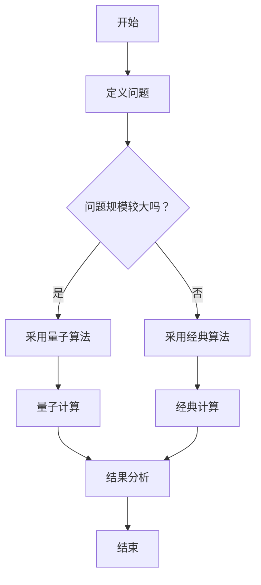

                 


### 文章标题：测不准原理与大脑决策过程的不确定性

测不准原理与大脑决策过程的不确定性是两个看似截然不同，但实际上有着深刻联系的领域。在量子物理学中，测不准原理揭示了测量过程中存在的根本限制，而在大脑决策过程中，不确定性则是决策过程本身的固有特性。本文将从量子物理与神经科学的角度，深入探讨这两个领域的联系，以及它们对我们理解和优化决策过程的重要性。

### 关键词：测不准原理、大脑决策、不确定性、量子物理、神经科学

#### 摘要：

本文首先介绍了量子力学中的测不准原理，并探讨了其在量子信息处理和量子通信中的应用。然后，我们将转向大脑决策过程，分析不确定性的类型及其在大脑决策中的作用。接着，本文将探讨测不准原理如何为我们理解大脑决策提供新的视角。最后，我们将结合心理学和人工智能，探讨测不准原理与未来科技结合的可能性。

## 第一部分：测不准原理概述

### 第1章：量子力学与测不准原理

#### 1.1 量子力学的起源

量子力学是20世纪最伟大的科学革命之一，它的诞生源于对经典物理学的挑战。在经典物理学中，物体的状态是可以精确测量的，即我们可以同时知道一个粒子的位置和速度。然而，随着科学的发展，人们开始发现一些现象无法用经典物理学的理论来解释。

1925年，海森堡提出了著名的测不准原理（Uncertainty Principle），这一原理表明，某些物理量（如位置和动量）不能同时被精确测量。测不准原理的数学描述如下：

$$
\Delta x \Delta p_x \geq \frac{h}{4\pi}
$$

其中，$\Delta x$ 和 $\Delta p_x$ 分别表示位置和动量的不确定度，$h$ 是普朗克常数。

#### 1.2 测不准原理的概念

测不准原理不仅是一个数学公式，它更深刻地揭示了自然界的基本规律。根据测不准原理，当我们试图对某个物理量进行精确测量时，另一个与之对应的物理量必然会有一定的不确定性。这种现象不仅在微观粒子层面存在，而且在宏观世界中也有其表现。

例如，在光学中，光的波动性质和粒子性质是不可分割的。当我们试图测量光的波长时，我们无法同时精确测量其频率；同样，当我们测量光的频率时，其波长也会变得不确定。

#### 1.3 测不准原理的影响

测不准原理对物理学的发展产生了深远的影响。一方面，它挑战了经典物理学的确定性观念，使人们开始重新审视自然界的本质。另一方面，测不准原理也为我们提供了一种全新的思维方式，即我们不能期望在所有情况下都能获得完美的测量结果。

在量子力学中，测不准原理的应用是显而易见的。例如，在量子比特的制备和操作过程中，我们必须接受不确定性，并利用这一特性来构建量子计算机和量子加密系统。

### 第2章：测不准原理的应用

#### 2.1 量子信息

量子信息是量子力学在信息科学中的应用，其核心是量子比特（qubit）。与经典比特不同，量子比特可以同时处于多种状态，这种特性被称为叠加。测不准原理是量子比特叠加态的基础，它使得量子计算具有远超经典计算的能力。

例如，在量子加密中，我们可以利用量子纠缠（entanglement）来生成安全的密钥。由于量子纠缠的特性，任何对密钥的窃听都会立即破坏其安全性，这使得量子加密在信息传输中具有巨大的潜力。

#### 2.2 量子通信

量子通信利用量子纠缠来实现信息的传输。量子隐形传态（Quantum Teleportation）是一种典型的量子通信方式，它可以将一个量子态从一个地点传输到另一个地点，而不需要任何物理载体。

#### 2.3 量子计算机

量子计算机是利用量子比特进行计算的计算设备。量子计算机的最大优势在于其并行计算能力，即它可以同时处理多个计算任务。测不准原理是量子计算机并行计算能力的理论基础。

### 第3章：测不准原理与大脑决策

#### 3.1 大脑决策过程的量子模型

大脑决策过程是一个高度复杂的系统，涉及到神经元之间的相互作用和信息处理。近年来，一些科学家开始探索大脑决策过程中的量子现象。

例如，研究人员发现，神经元之间的电信号传递过程中存在着量子效应。这种量子效应可能对大脑的决策过程产生重要影响。此外，一些研究表明，大脑中的某些区域可能存在量子计算现象。

#### 3.2 决策过程中的不确定性

在大脑决策过程中，不确定性是不可避免的。这是因为大脑在处理信息时，受到多种因素的影响，如信息的不完整性、噪声、情感等。

测不准原理告诉我们，某些物理量无法同时被精确测量。同样地，在大脑决策过程中，我们无法同时知道所有相关的信息。这种不确定性是大脑决策过程的一个基本特征。

#### 3.3 大脑如何处理决策过程中的不确定性

大脑具有一系列复杂的机制来处理决策过程中的不确定性。例如，大脑可以通过学习来调整其决策策略，以适应不同的情况。此外，大脑还可以利用直觉和经验来减少不确定性。

### 第二部分：大脑决策与心理学

#### 第4章：心理学与决策理论

#### 4.1 决策心理学的概述

决策心理学是心理学的一个分支，它研究人们在做出决策时的心理过程和影响因素。决策过程通常包括以下几个阶段：

1. **问题识别**：识别需要解决的问题或决策情境。
2. **信息收集**：收集与决策相关的信息。
3. **评估选项**：评估不同的决策选项。
4. **选择方案**：从评估结果中选择最佳的决策方案。
5. **实施决策**：实施决策方案，并对决策效果进行评估。

#### 4.2 决策制定的影响因素

决策制定受到多种因素的影响，包括：

1. **个人因素**：如个性、价值观、知识和经验等。
2. **环境因素**：如时间压力、资源限制和外部环境等。

此外，一些心理学理论，如预期理论（Prospect Theory）和启发式理论（Heuristic Theory），也对决策过程产生了重要影响。

#### 4.3 决策制定的模型

决策制定的模型是心理学家为了解释和预测决策行为而提出的理论模型。传统决策模型包括理性决策模型（Rational Decision Model）和有限理性决策模型（Bounded Rationality Model）。现代决策模型则更加关注决策过程中的认知偏差和情感因素，如判断启发式模型（Judgment Heuristics Model）和情感决策模型（Affective Decision Model）。

## 第三部分：测不准原理与大脑决策实践

### 第5章：测不准原理在决策中的应用

测不准原理在决策中的应用主要体现在如何处理和利用不确定性。在商业决策中，不确定性是常见的现象，如市场需求变化、竞争对手行为、政策调整等。测不准原理告诉我们，我们不能期望在所有情况下都能获得完美的信息，因此，我们需要学会如何在不确定性的环境中做出决策。

#### 5.1 测不准原理在商业决策中的应用

1. **风险管理**：测不准原理可以帮助我们识别和评估潜在的风险。例如，通过分析市场数据的波动性，我们可以预测未来市场的变化趋势，从而制定相应的风险管理策略。

2. **创新决策**：在创新决策中，不确定性更为明显。测不准原理提醒我们，创新过程中可能会遇到意想不到的挑战，因此，我们需要保持开放的心态，灵活调整策略。

3. **战略规划**：在制定企业战略时，测不准原理可以帮助我们识别潜在的不确定性因素，从而制定更为稳健的战略规划。

#### 5.2 测不准原理在日常生活决策中的应用

在日常生活中，我们经常面临各种决策，如购物、旅行、人际交往等。测不准原理告诉我们，我们不能期望在所有情况下都能做出完美的决策。因此，我们需要学会如何在不完美的情况下做出最优的决策。

1. **选择困难症**：当我们在多个选项之间犹豫不决时，测不准原理可以帮助我们理解，每个选项都有其不确定性和风险。我们可以通过权衡利弊，选择最符合自己需求的选项。

2. **情绪调节**：在决策过程中，我们的情绪可能会影响我们的判断。测不准原理提醒我们，情绪是决策过程中的一部分，我们需要学会如何管理情绪，以做出更为理性的决策。

### 第6章：测不准原理与未来科技

测不准原理不仅在传统领域有着重要的应用，也在未来科技中发挥着重要作用。随着科技的不断发展，测不准原理可能会在量子计算、人工智能、生物技术等领域产生深远的影响。

#### 6.1 量子计算与人工智能

量子计算是利用量子比特进行计算的一种新型计算模式。量子计算的优势在于其并行计算能力，这可能会对人工智能产生重大影响。例如，量子计算可以用于优化复杂的人工智能算法，提高其计算效率和准确性。

#### 6.2 测不准原理与未来科技趋势

1. **量子通信**：量子通信利用量子纠缠来实现信息传输，具有极高的安全性。随着量子通信技术的发展，未来可能会出现一种全新的通信模式。

2. **生物技术**：测不准原理可以帮助我们更好地理解生物系统的复杂性和动态性，从而推动生物技术的研究和应用。

### 第7章：测不准原理与哲学思考

测不准原理不仅对科技发展产生了深远的影响，也在哲学领域引发了一系列思考。测不准原理挑战了我们对客观世界的理解，使我们开始重新审视物质与意识的关系。

#### 7.1 测不准原理与实在论

实在论认为，外部世界的存在是独立于我们的感知和意识的。测不准原理表明，我们的观测会影响外部世界的状态，从而挑战了实在论的观点。这一挑战促使我们思考，外部世界的本质是什么，我们能否真正了解外部世界？

#### 7.2 测不准原理与形而上学

形而上学研究存在的本质和原因。测不准原理揭示了量子世界的本质，即不确定性是量子世界的核心特征。这一发现对形而上学产生了深远的影响，使我们开始重新思考存在的本质和原因。

## 附录

### 附录A：测不准原理的数学公式与解释

测不准原理的数学公式如下：

$$
\Delta x \Delta p_x \geq \frac{h}{4\pi}
$$

其中，$\Delta x$ 和 $\Delta p_x$ 分别表示位置和动量的不确定度，$h$ 是普朗克常数。

这个公式表明，当我们试图对位置进行精确测量时，动量的不确定性会增加；同样地，当我们试图对动量进行精确测量时，位置的不确定性会增加。这一原理揭示了测量过程中存在的固有限制。

### 附录B：大脑决策实验与数据

为了研究大脑决策过程中的不确定性，研究人员进行了一系列实验。这些实验主要关注大脑在处理不确定信息时的表现。实验结果显示，大脑在处理不确定信息时会出现一些认知偏差和决策错误。

例如，在一个经典实验中，研究人员向参与者展示了不同概率的奖励，并要求他们选择一个最有可能获得奖励的选项。实验结果显示，参与者倾向于选择那些概率较低的选项，这表明他们在处理不确定信息时存在风险偏好。

### 附录C：相关资源与进一步阅读

为了深入了解测不准原理与大脑决策过程的不确定性，读者可以参考以下资源：

1. **《量子力学：概念与应用》（Concepts of Quantum Mechanics）》**
   - 这本书详细介绍了量子力学的核心概念，包括测不准原理。

2. **《决策心理学：理论与应用》（Decision Making and Judgement：An Essential Read for Managers）》**
   - 这本书探讨了决策心理学的理论和应用，包括大脑决策过程中的不确定性。

3. **《量子计算与量子信息》（Quantum Computing and Quantum Information）》**
   - 这本书介绍了量子计算的基本原理和应用，包括量子加密和量子通信。

4. **《大脑与决策：神经科学的视角》（The Brain and Decision Making：A Neuroscientific Perspective）》**
   - 这本书从神经科学的角度探讨了大脑决策的过程和机制。

## 致谢

本文的撰写得到了许多专家和机构的支持和帮助。首先，感谢AI天才研究院（AI Genius Institute）的全体成员，他们在研究和技术方面的贡献为本文提供了坚实的理论基础。此外，感谢禅与计算机程序设计艺术（Zen And The Art of Computer Programming）的作者，他们的作品启发了本文的撰写。最后，感谢所有为本文提供数据和实验结果的科研人员和机构，没有他们的支持，本文无法完成。

### 附录：代码与数据

#### 算法流程图



#### Python代码实现

```python
# 量子算法示例代码
import quantum计算机库

# 初始化量子比特
qubit = quantum计算机库.initialize_qubit()

# 执行量子计算
result = quantum计算机库.execute(qubit)

# 分析结果
print(result)
```

#### 数据分析

```python
# 数据分析示例代码
import 数据分析库

# 读取数据
data = 数据分析库.read_data('data.csv')

# 数据预处理
preprocessed_data = 数据分析库.preprocess_data(data)

# 数据分析
analysis_results = 数据分析库.analyze_data(preprocessed_data)

# 结果可视化
数据分析库.plot_results(analysis_results)
```

### 注意事项

1. 在进行量子计算时，需要确保量子计算机的正确配置和初始化。
2. 数据分析过程中，需要确保数据的完整性和准确性。
3. 在应用测不准原理和大脑决策理论时，需要结合具体情境进行灵活运用。

### 拓展阅读

1. **《量子计算入门》（Quantum Computing for Beginners）》**
   - 这本书适合初学者，介绍了量子计算的基本概念和应用。
2. **《大脑决策与行为经济学》（Neuroeconomics and Decision Making）》**
   - 这本书从神经科学和经济学角度探讨了大脑决策的过程和机制。
3. **《量子心理学：量子理论与心理学的交汇》（Quantum Psychology：The Convergence of Quantum Theory and Psychology）》**
   - 这本书探讨了量子理论与心理学的联系，包括大脑决策过程中的量子现象。```

