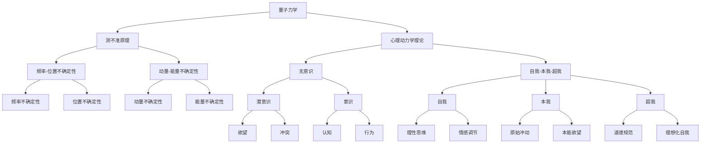

                 

# 测不准原理与心理动力学理论的融合

## 关键词

- 测不准原理
- 心理动力学理论
- 量子力学
- 心理学
- 融合研究

## 摘要

本文探讨了测不准原理与心理动力学理论的融合，分析了两者在理论基础、核心概念、哲学意义等方面的联系与差异。通过融合的背景与意义、理论模型、案例分析以及应用与实践等部分，阐述了这一融合理论的发展趋势、挑战与应用前景。本文旨在为跨学科研究提供新的视角和思考，为心理学与量子力学的交叉融合开辟新的道路。

----------------------------------------------------------------

## 第一部分：测不准原理介绍

### 1.1 测不准原理的起源与发展

#### 1.1.1 玻尔和海森堡的贡献

测不准原理（Uncertainty Principle）是量子力学中的一个核心概念，它最早由丹麦物理学家尼尔斯·玻尔（Niels Bohr）在1927年提出。玻尔基于对氢原子光谱的研究，发现粒子的某些物理量如位置和动量不能同时被精确测量。这一发现挑战了经典物理学的确定性观念。

紧随其后，德国物理学家维尔纳·海森堡（Werner Heisenberg）进一步发展了测不准原理。他通过矩阵力学的方法，系统地阐述了位置和动量、能量和时间之间的不确定性关系。海森堡的测不准关系公式为：

$$\Delta x \Delta p \geq \frac{\hbar}{2}$$

$$\Delta E \Delta t \geq \frac{\hbar}{2}$$

其中，$\Delta x$ 和 $\Delta p$ 分别表示位置的不确定性和动量的不确定性，$\Delta E$ 和 $\Delta t$ 分别表示能量的不确定性和时间的不确定性，$\hbar$ 是约化普朗克常数。

#### 1.1.2 爱因斯坦与玻尔的辩论

测不准原理的提出引起了物理学界的广泛讨论，尤其是与爱因斯坦（Albert Einstein）的观点形成了鲜明对比。爱因斯坦坚信物理世界的基本规律应该是确定的，他对测不准原理表示怀疑，并提出了著名的“EPR佯谬”（Einstein-Podolsky-Rosen Paradox）来挑战量子力学的非确定性特征。

爱因斯坦与玻尔的辩论持续了多年，成为量子力学发展史上的一个重要篇章。尽管爱因斯坦对量子力学的解释持怀疑态度，但他的思想激发了物理学界对量子力学更深层次的探讨。

#### 1.1.3 测不准原理的基本概念

测不准原理的核心在于量子系统在微观尺度上具有固有的不确定性。具体来说，它包括以下几个方面：

- **位置和动量的不确定性**：粒子的位置和动量不能同时被精确测量，其不确定度乘积有一个最小值，即测不准关系的表达式。
- **能量和时间的不确定性**：粒子的能量和时间也不能同时被精确测量，其不确定度乘积也有一个最小值。
- **量子叠加态**：量子系统可以处于多种可能状态的叠加，只有当进行测量时，系统才会坍缩到一个确定的状态。
- **概率波函数**：量子系统的状态通过波函数描述，波函数的平方表示粒子在空间中出现的概率分布。

这些基本概念揭示了量子力学与经典物理学的本质区别，使得人们对微观世界的认识有了革命性的转变。

### 1.2 测不准原理的核心内容

#### 1.2.1 频率和位置的不确定性原理

频率和位置的不确定性原理是指，粒子的位置测量精度越高，其动量测量精度就越低，反之亦然。这一原理通过测不准关系公式表达为：

$$\Delta x \Delta p \geq \frac{\hbar}{2}$$

例如，在光电效应中，光子的能量与其频率成正比，能量越高，频率也越高。而光子的动量与其波长成反比，波长越短，动量越大。因此，在测量光子时，如果想要精确测量其位置，就必须接受其动量测量的不确定性。

#### 1.2.2 动量和能量的不确定性原理

动量和能量的不确定性原理与频率和位置的不确定性原理类似，描述了粒子的动量和能量之间的固有不确定性。这一原理通过测不准关系公式表达为：

$$\Delta E \Delta t \geq \frac{\hbar}{2}$$

例如，在放射性衰变过程中，粒子的能量释放与时间有关，越长时间，能量释放越多。而粒子的能量越高，其衰变时间越短。这表明，在测量粒子的能量时，必须接受其衰变时间的不确定性。

#### 1.2.3 测不准原理的数学表述

测不准原理的数学表述主要依赖于测不准关系公式，该公式描述了量子系统中两个物理量之间的最小不确定度乘积。具体来说，对于任意的两个物理量 $A$ 和 $B$，其不确定度乘积满足：

$$\Delta A \Delta B \geq \frac{1}{2}|\langle [A, B] \rangle|$$

其中，$\Delta A$ 和 $\Delta B$ 分别表示物理量 $A$ 和 $B$ 的不确定度，$[A, B]$ 是物理量 $A$ 和 $B$ 的对易子。

这一公式揭示了量子系统中物理量之间的本质联系，对于理解量子系统的行为具有重要意义。

### 1.3 测不准原理的哲学意义

#### 1.3.1 量子力学的非决定性特征

测不准原理揭示了量子力学的非决定性特征，即粒子的行为在微观尺度上具有不确定性，不能被精确预测。这一特征挑战了经典物理学中的决定论观念，使得人们对物理世界的认识发生了深刻转变。

非决定性特征表现在以下几个方面：

- **量子叠加态**：量子系统可以处于多种可能状态的叠加，只有进行测量时，系统才会坍缩到一个确定的状态。
- **测量诱导**：测量过程本身会影响量子系统的状态，使得系统从叠加态坍缩到一个确定的状态。
- **概率波函数**：量子系统的状态通过波函数描述，波函数的平方表示粒子在空间中出现的概率分布。

这些特征表明，量子力学中的粒子行为具有概率性质，无法被完全确定。

#### 1.3.2 测不准原理与实在论

测不准原理对实在论提出了挑战。实在论认为，物理世界具有客观存在的本质特征，与我们的观察和测量无关。而测不准原理表明，量子系统的行为受到观察和测量过程的影响，使得我们无法确定粒子的真实状态。

测不准原理与实在论的矛盾在于：

- **波函数坍缩**：测量过程导致波函数坍缩到一个确定的状态，这一过程似乎将粒子的本质属性与观察者的主观因素联系起来。
- **隐变量理论**：隐变量理论试图恢复经典物理学的决定论观念，通过引入未观测的隐变量来解释量子现象。然而，实验结果否定了隐变量理论的可能性。

这些矛盾引发了哲学界对实在论和量子力学关系的深入探讨。

#### 1.3.3 测不准原理对科学哲学的影响

测不准原理对科学哲学产生了深远影响，引发了关于科学方法论、科学实在论和科学认识论的讨论。

- **科学方法论**：测不准原理表明，科学研究中不能完全依赖观察和实验来获得绝对确定的知识，需要考虑观察和测量对研究对象的影响。
- **科学实在论**：测不准原理挑战了传统的实在论观念，使得科学家们重新审视物理世界的本质特征和科学知识的可靠性。
- **科学认识论**：测不准原理提出了关于科学认识过程中主体和客体关系的深刻问题，使得科学家们开始思考科学知识的构建过程和认识方式的局限性。

这些影响促使科学哲学家们对科学知识的本质和科学方法进行了深刻的反思和重新审视。

----------------------------------------------------------------

## 第二部分：心理动力学理论介绍

### 2.1 心理动力学理论的历史背景

#### 2.1.1 精神分析学的起源

心理动力学理论源于精神分析学（Psychoanalysis），由奥地利医生弗洛伊德（Sigmund Freud）在19世纪末创立。弗洛伊德通过治疗精神病患者，发现了潜意识对人类行为和情感的影响，从而提出了精神分析理论。

精神分析学的主要观点包括：

- **无意识与意识**：弗洛伊德认为，人的心理活动分为无意识和意识两部分。无意识中的冲动和欲望对个体行为产生深远影响，但通常被意识所压抑。
- **自我、本我和超我**：弗洛伊德将人的心理结构分为自我（Ego）、本我（Id）和超我（Superego）。本我是原始冲动和欲望的代表，超我是道德和理想化的自我，而自我则在本我和超我之间寻求平衡。
- **心理防御机制**：弗洛伊德提出了多种心理防御机制，如压抑、投射、反向形成等，以应对无意识中的冲突和痛苦。

#### 2.1.2 精神分析学的主要流派

随着精神分析学的发展，出现了多个主要流派，如：

- **经典精神分析**：以弗洛伊德的理论为基础，强调无意识对人类行为的影响，关注心理防御机制和心理治疗。
- **精神分析-文化学派**：以埃里希·弗罗姆（Erich Fromm）为代表，强调文化和社会因素对个体心理的影响，关注人类本性的解放和心理健康。
- **自我心理学**：以海因茨·科胡特（Heinz Kohut）为代表，强调自我在心理发展中的核心作用，关注自我结构的发展和修复。

#### 2.1.3 心理动力学理论的现代发展

在现代心理学中，心理动力学理论继续发展，出现了多个新学派和理论，如：

- **客体关系理论**：以梅拉妮·克莱因（Melanie Klein）和唐纳德·温尼科特（Donald Winnicott）为代表，强调人际关系在心理发展中的重要性，关注儿童心理治疗。
- **自体心理学**：以科胡特为代表，强调自体在心理发展中的核心作用，关注自体结构的建立和修复。
- **精神分析认知科学**：以雅各布·格林斯坦（Jacob Greenspan）和乔治·阿莫斯（George A. Arkin）为代表，将精神分析理论与认知科学相结合，探索潜意识对认知过程的影响。

心理动力学理论在现代心理学中的应用广泛，包括心理咨询、心理治疗、人际关系研究等多个领域。

### 2.2 心理动力学理论的基本概念

#### 2.2.1 无意识与意识

无意识和意识是心理动力学理论的核心概念之一。无意识是指那些未被意识到的心理过程和内容，包括压抑的欲望、记忆、情感和冲突等。无意识中的冲动和欲望对个体的行为和情感产生深远影响，但通常被意识所压抑。

意识则是指那些被个体感知和意识到的心理过程和内容。意识是人类心理活动的重要组成部分，但意识并不能完全了解无意识中的内容和过程。

#### 2.2.2 自我、本我和超我

自我、本我和超我是弗洛伊德心理动力学理论中的核心概念。本我是原始冲动和欲望的代表，超我是道德和理想化的自我，而自我则在本我和超我之间寻求平衡。

- **自我（Ego）**：自我是心理结构中的执行者，负责协调本我和超我的冲突，寻求现实中的满足。自我通过理性思维和逻辑判断来处理内外部刺激，并寻找合适的应对策略。
- **本我（Id）**：本我是原始冲动和欲望的源泉，包括生存本能和死亡本能。本我追求即时的满足，不受现实和社会规范的限制。
- **超我（Superego）**：超我是道德和理想化的自我，代表社会和文化规范。超我对个体的行为进行道德评价，以维护个体的道德和伦理标准。

这些概念共同构成了人的心理结构，对个体的行为和情感产生深远影响。

#### 2.2.3 动力心理学的核心概念

动力心理学（Dynamic Psychology）是心理动力学理论的一个分支，关注心理过程和心理动力。动力心理学的核心概念包括：

- **心理动力学过程**：动力心理学认为，个体的心理活动是由一系列相互作用的动力学过程驱动的，这些过程包括欲望、冲突、防御机制和心理结构的变化。
- **心理动力**：心理动力是指心理系统中的能量流动和动态平衡。心理动力可以用来解释个体的行为和情感，以及心理治疗的机制。
- **心理结构**：心理结构是指个体的心理组成，包括自我、本我和超我等成分。心理结构的变化可以导致个体的心理发展、行为改变和心理治疗的效果。

动力心理学为理解人类心理活动提供了一个动态的视角，有助于解释心理障碍和心理治疗的过程。

### 2.3 心理动力学理论的主要观点

#### 2.3.1 人格发展的阶段理论

心理动力学理论中的人格发展理论关注个体在不同阶段的心理发展。主要的理论包括：

- **弗洛伊德的人格发展阶段**：弗洛伊德将人格发展分为五个阶段，即口腔期、肛门期、生殖器期、潜伏期和生殖期。每个阶段都有特定的冲突和发展任务，个体的心理发展在不同阶段受到压抑和冲突的影响。
- **艾瑞克森的人格发展阶段**：艾瑞克森将人格发展扩展到整个生命周期，提出了八个阶段，包括婴儿期、幼儿期、学龄前期、学龄期、青年期、成年早期、成年中期和成年晚期。每个阶段都有特定的心理社会任务和危机，个体需要在每个阶段成功地应对危机，以实现健康的人格发展。

这些理论揭示了人格发展的连续性和阶段性，有助于理解个体在不同生命阶段的内心冲突和心理需求。

#### 2.3.2 心理防御机制

心理防御机制是心理动力学理论中一个重要的概念，指个体在面对心理压力和冲突时采取的自我保护策略。主要的防御机制包括：

- **压抑**：压抑是指将痛苦或令人不安的记忆、情感或冲动排除在意识之外，以避免心理痛苦。
- **投射**：投射是指将自身的冲动、情感或冲突归咎于他人，以减轻内心的罪恶感或焦虑。
- **反向形成**：反向形成是指表现出与内心真实情感相反的行为或态度，以掩盖内心的冲突或痛苦。
- **合理化**：合理化是指为不合理的行为或情感寻找合理的解释或借口，以维护自我形象。

这些防御机制虽然有助于个体应对心理压力，但过度使用或不当使用可能导致心理障碍和心理问题。

#### 2.3.3 心理动力学治疗的原理和方法

心理动力学治疗是一种以心理动力学理论为基础的心理治疗方法，旨在帮助个体解决内心的冲突和问题，促进心理成长和改变。主要的原理和方法包括：

- **自由联想**：自由联想是指个体在治疗过程中自由表达自己的想法和情感，治疗师通过倾听和引导帮助个体揭示潜意识的内容。
- **梦境解析**：梦境解析是指通过分析个体的梦境内容，揭示潜意识中的冲突和欲望。
- **移情与反移情**：移情是指个体在治疗过程中将过去的情感或关系转移到治疗师身上，反移情是指治疗师对患者的情感反应。理解和处理移情与反移情是心理动力学治疗的重要部分。
- **内化与自我修复**：心理动力学治疗的目标是帮助个体建立健康的自我结构和防御机制，实现自我修复和心理成长。

这些原理和方法为心理动力学治疗提供了理论和实践基础，有助于解决个体的心理问题。

----------------------------------------------------------------

## 第三部分：测不准原理与心理动力学理论的融合

### 3.1 融合的背景与意义

#### 3.1.1 量子力学与心理学的相似性

量子力学和心理动力学理论在许多方面表现出相似性，这为两者的融合提供了可能性。首先，两者都关注微观世界的复杂性，探索系统在微观尺度上的行为。量子力学研究原子、分子和基本粒子的性质和行为，而心理动力学理论则关注个体的内心世界和心理过程。

其次，两者都揭示了系统的非决定性和不确定性。量子力学的测不准原理表明，粒子的某些物理量如位置和动量不能同时被精确测量，心理动力学理论则认为个体的行为和情感受到无意识冲动和冲突的影响，难以被完全预测和控制。

此外，两者都涉及到系统的叠加态和概率性质。量子力学中的叠加态表示粒子可以同时处于多个可能状态的叠加，心理动力学理论中的心理状态也具有叠加性质，个体的情感和行为可能同时受到多种因素的影响。

#### 3.1.2 融合的理论基础

测不准原理与心理动力学理论的融合建立在以下理论基础之上：

- **非决定性**：量子力学和心理动力学理论都强调系统的非决定性特征，这为两者提供了共同的哲学基础。
- **不确定性**：两者都涉及到系统的不确定性，量子力学中的测不准原理描述了粒子的某些物理量之间的不确定性，心理动力学理论中的无意识冲动和冲突也具有不确定性。
- **概率性质**：量子力学和心理动力学理论都涉及到概率性质，量子力学中的概率波函数描述了粒子的空间分布，心理动力学理论中的心理状态也具有概率性质。

这些理论基础为测不准原理与心理动力学理论的融合提供了重要的哲学和科学依据。

#### 3.1.3 融合的现实意义

测不准原理与心理动力学理论的融合具有重要的现实意义：

- **跨学科研究**：融合理论为跨学科研究提供了新的视角和方法，有助于探索量子力学与心理学的交叉领域，推动科学知识的进步。
- **心理治疗**：融合理论在心理治疗中具有潜在的应用价值，可以帮助治疗师更好地理解患者的内心世界，提高心理治疗效果。
- **认知科学**：融合理论为认知科学的研究提供了新的理论框架，有助于探索意识和认知过程的本质。

融合理论为量子力学、心理学和认知科学等领域的研究提供了新的机遇和挑战。

### 3.2 融合的理论模型

#### 3.2.1 测不准原理在心理学中的应用

将测不准原理应用于心理学，可以从以下几个方面进行探索：

- **心理状态的不确定性**：心理状态具有不确定性，个体的情感和行为可能同时受到多种因素的影响，这些因素之间可能存在不确定性关系。例如，一个人在某个时刻可能同时感到快乐和悲伤，这两种情感之间具有不确定性关系。
- **心理过程的非决定性**：心理过程具有非决定性，个体的行为和情感可能受到无意识冲动和冲突的影响，难以被完全预测和控制。例如，一个人在某个时刻可能做出一个无法预测的决定，这个决定受到无意识中的冲动和冲突的影响。
- **心理测量的挑战**：在测量心理状态和心理过程时，测量工具和方法可能存在不确定性，导致测量结果的误差。例如，在评估个体的情绪状态时，评估工具的可靠性和有效性可能影响测量结果的准确性。

这些应用为理解个体的心理状态和心理过程提供了新的视角。

#### 3.2.2 心理动力学理论中的量子概念

将心理动力学理论中的量子概念进行探讨，可以从以下几个方面进行：

- **心理状态的叠加**：个体的心理状态可能同时处于多种可能状态的叠加，这些状态之间可能存在量子叠加效应。例如，一个人在某个时刻可能同时具有工作状态和家庭状态，这两种状态之间存在量子叠加效应。
- **心理过程的量子跃迁**：个体的心理过程可能存在量子跃迁现象，即从一个状态迅速跃迁到另一个状态。例如，一个人在某个时刻可能从焦虑状态迅速跃迁到平静状态，这种跃迁现象受到无意识中的冲动和冲突的影响。
- **心理能量的量子性质**：个体的心理能量可能具有量子性质，即心理能量在微观尺度上表现出波动和粒子的双重性质。例如，个体的情感和心理动力可能具有量子波动特性，这种波动特性影响个体的行为和情感。

这些量子概念为理解个体的心理动力学过程提供了新的理论框架。

#### 3.2.3 融合模型的具体内容

融合模型的具体内容可以从以下几个方面进行构建：

- **心理状态的测不准描述**：使用量子力学的测不准原理来描述个体的心理状态，将心理状态视为一个不确定的系统，其状态和属性具有不确定性。
- **心理过程的量子演化**：使用量子力学的量子演化方程来描述个体的心理过程，将心理过程视为一个量子系统，其状态和属性随着时间演化。
- **心理动力学的量子模型**：构建一个基于量子力学的心理动力学模型，将个体的心理状态和心理过程视为一个量子系统，其行为和演化受到量子力学规律的影响。
- **心理治疗的量子方法**：探索基于量子力学的心理治疗方法，如量子心理治疗、量子催眠等，以帮助个体解决内心的冲突和问题。

这些内容为融合模型提供了具体的应用场景和理论基础。

----------------------------------------------------------------

## 第三部分：测不准原理与心理动力学理论的融合

### 3.3 融合的案例分析

#### 3.3.1 案例一：心理治疗中的不确定性处理

在心理治疗中，融合测不准原理与心理动力学理论可以为治疗师提供新的视角和方法。例如，在治疗焦虑症的过程中，治疗师可以运用测不准原理来理解患者的不确定性感受。焦虑症患者常常面临各种不确定的情况，如未来职业发展的不确定性、人际关系的不确定性等。治疗师可以引导患者认识到这些不确定性是正常的心理现象，而不是需要逃避的问题。

具体方法包括：

- **建立信任关系**：治疗师通过建立稳定的信任关系，帮助患者感到安全，从而减少焦虑感。
- **认知重构**：治疗师引导患者重新评估自己对不确定性的认知，将负面情绪转变为积极情绪。
- **情绪调节**：治疗师帮助患者学习情绪调节技巧，如深呼吸、冥想等，以缓解焦虑症状。

通过这种方式，治疗师可以帮助患者更好地应对不确定性，从而提高治疗效果。

#### 3.3.2 案例二：量子理论与心理动力学分析

在心理动力学分析中，融合量子力学原理可以帮助治疗师更深入地理解患者的内心世界。例如，在治疗抑郁症的过程中，治疗师可以运用量子力学中的“叠加态”概念来解释患者的心理状态。抑郁症患者常常处于消极的心理状态，他们可能会同时体验到希望和绝望，这两种情感之间存在量子叠加效应。

具体方法包括：

- **探索内心冲突**：治疗师引导患者探索内心深处的冲突和矛盾，如压抑的愤怒、未解决的悲伤等。
- **认知重构**：治疗师帮助患者重新评估自己的内心体验，将消极的情绪转变为积极的情绪。
- **情绪调节**：治疗师帮助患者学习情绪调节技巧，如正念、认知行为疗法等，以缓解抑郁症状。

通过这种方式，治疗师可以帮助患者重建健康的内心世界，从而提高治疗效果。

#### 3.3.3 案例三：融合理论在心理咨询与治疗中的应用

在心理咨询与治疗中，融合测不准原理与心理动力学理论可以帮助治疗师更全面地理解患者的心理状态。例如，在治疗焦虑症和抑郁症的过程中，治疗师可以运用测不准原理来解释患者在不同情境下的情绪波动。

具体方法包括：

- **情境分析**：治疗师引导患者分析在不同情境下的情绪波动，如工作压力、人际关系等。
- **心理动力学探索**：治疗师通过心理动力学方法，帮助患者探索内心深处的冲突和矛盾。
- **情绪调节**：治疗师帮助患者学习情绪调节技巧，如正念、冥想等，以缓解焦虑和抑郁症状。

通过这种方式，治疗师可以帮助患者更好地应对生活中的不确定性，提高心理韧性。

这些案例表明，融合测不准原理与心理动力学理论在心理咨询与治疗中具有重要的应用价值，可以为治疗师提供新的理论和方法。

----------------------------------------------------------------

## 第四部分：融合理论的应用与实践

### 4.1 融合理论在教育心理学中的应用

#### 4.1.1 学生的心理发展规律

在教育心理学中，融合测不准原理与心理动力学理论可以帮助教育工作者更好地理解学生的心理发展规律。学生的心理发展是一个复杂的过程，受到多种因素的影响，包括遗传、环境、教育等。

融合理论强调心理状态的叠加性和非决定性，有助于教育工作者理解学生在不同学习阶段的心理状态。例如，学生在学习过程中可能会同时体验到学习成功的喜悦和学习困难的焦虑。教育工作者可以通过观察和分析学生的心理状态，引导学生正确面对这些心理状态，提高学习效果。

具体方法包括：

- **心理状态监测**：教育工作者可以通过观察学生的行为和情感表现，监测学生的心理状态。
- **情绪调节训练**：教育工作者可以为学生提供情绪调节训练，帮助他们学会应对学习中的压力和挑战。
- **认知重构**：教育工作者可以帮助学生重新评估自己的学习体验，将负面情绪转变为积极情绪。

#### 4.1.2 教师的教育方法

融合理论在教师的教育方法中也具有重要的应用价值。教师可以通过理解学生的心理发展规律，调整自己的教育方法，以更好地适应学生的需求。

具体方法包括：

- **个性化教学**：教师可以根据学生的心理发展特点，设计个性化的教学方案，提高学生的学习兴趣和参与度。
- **情感教育**：教师可以通过情感教育，帮助学生建立积极的情感态度，提高他们的心理韧性。
- **心理辅导**：教师可以为学生提供心理辅导，帮助他们解决内心的困惑和矛盾，提高心理健康水平。

#### 4.1.3 学校心理辅导体系的构建

在学校心理辅导体系的构建中，融合测不准原理与心理动力学理论可以帮助教育工作者设计更有效的心理辅导方案。心理辅导体系应包括以下几个方面：

- **心理健康教育**：通过心理健康教育，提高学生的心理素质，帮助他们正确面对生活中的挑战。
- **心理辅导与咨询**：为学生提供心理辅导和咨询服务，帮助他们解决心理问题和困惑。
- **心理评估与监测**：通过心理评估和监测，了解学生的心理健康状况，及时发现和干预心理问题。
- **教师培训与支持**：为教师提供心理培训和支持，帮助他们更好地应对学生的心理健康问题。

通过构建科学、有效的学校心理辅导体系，可以为学生的心理健康发展提供有力支持。

### 4.2 融合理论在临床心理学中的应用

#### 4.2.1 心理疾病的诊断与治疗

融合测不准原理与心理动力学理论在临床心理学中具有重要的应用价值，有助于提高心理疾病的诊断与治疗效果。心理疾病通常涉及复杂的心理过程和情感体验，融合理论可以提供更全面的理解。

具体方法包括：

- **综合评估**：通过综合评估，了解患者的心理状态、情感体验和心理动力学过程，为诊断和治疗提供依据。
- **心理动力学治疗**：运用心理动力学治疗方法，如自由联想、梦境解析等，帮助患者探索内心深处的冲突和矛盾。
- **认知行为疗法**：结合认知行为疗法，帮助患者改变消极的认知和行为模式，提高心理健康水平。

#### 4.2.2 心理动力学治疗的实践案例

在心理动力学治疗的实践中，融合理论可以为治疗师提供新的视角和方法。以下是一个实际案例：

患者，女性，30岁，因焦虑和抑郁症状前来咨询。通过综合评估，发现患者内心存在对未来的不确定感和对过去的悲伤情绪。治疗师运用融合理论，引导患者认识到这些情绪的叠加性质，帮助患者理解自己的心理状态。

治疗过程中，治疗师通过自由联想和梦境解析，帮助患者探索内心深处的冲突和矛盾。同时，治疗师结合认知行为疗法，帮助患者改变消极的认知和行为模式。

经过一段时间的治疗，患者焦虑和抑郁症状明显缓解，心理状态得到改善。

#### 4.2.3 临床心理学中的不确定性管理

在临床心理学中，融合理论强调心理状态的叠加性和非决定性，有助于治疗师更好地管理不确定性。治疗师可以通过以下方法应对不确定性：

- **建立信任关系**：建立稳定的信任关系，帮助患者感到安全，降低焦虑感。
- **心理教育**：通过心理教育，帮助患者了解心理状态的叠加性和非决定性，提高他们的心理韧性。
- **情绪调节**：帮助患者学习情绪调节技巧，如深呼吸、冥想等，以缓解焦虑和抑郁症状。

通过这些方法，治疗师可以更好地应对临床工作中的不确定性，提高治疗效果。

### 4.3 融合理论在心理咨询与治疗中的应用

#### 4.3.1 心理咨询的理论框架

融合测不准原理与心理动力学理论为心理咨询提供了新的理论框架。在这个框架下，心理咨询可以关注以下几个方面：

- **心理状态的叠加性**：心理咨询师可以帮助求助者认识到自己的心理状态是多种可能状态的叠加，引导他们正确面对和处理这些状态。
- **心理过程的非决定性**：心理咨询师可以帮助求助者理解心理过程的非决定性，帮助他们接受自己的情绪和行为可能受到多种因素的影响。
- **心理动力分析**：心理咨询师可以运用心理动力学方法，帮助求助者探索内心深处的冲突和矛盾，促进心理成长。

#### 4.3.2 心理治疗的技术与策略

在心理治疗中，融合理论可以提供多种技术与策略，以提高治疗效果。以下是一些具体方法：

- **自由联想**：通过自由联想，心理咨询师可以帮助求助者探索内心深处的冲突和欲望，揭示潜意识的内容。
- **梦境解析**：通过梦境解析，心理咨询师可以帮助求助者理解自己的梦境，揭示潜意识中的心理过程。
- **认知重构**：通过认知重构，心理咨询师可以帮助求助者改变消极的认知模式，建立积极的思维模式。
- **情感释放**：通过情感释放，心理咨询师可以帮助求助者释放内心的压抑和痛苦，减轻心理负担。

#### 4.3.3 融合理论在心理咨询与治疗中的实际应用

以下是一个实际应用案例：

求助者，男性，35岁，因工作压力导致焦虑和抑郁症状。心理咨询师运用融合理论，帮助求助者认识到自己的心理状态是多种可能状态的叠加，如焦虑和抑郁、希望和绝望等。通过自由联想和梦境解析，心理咨询师帮助求助者探索内心深处的冲突和欲望。

在治疗过程中，心理咨询师引导求助者改变消极的认知模式，建立积极的思维模式。同时，心理咨询师帮助求助者释放内心的压抑和痛苦，提高心理韧性。

经过一段时间的治疗，求助者的焦虑和抑郁症状明显缓解，心理状态得到改善。

通过这些案例可以看出，融合测不准原理与心理动力学理论在心理咨询与治疗中具有重要的应用价值，可以为治疗师提供新的理论和方法。

----------------------------------------------------------------

## 第五部分：未来展望与挑战

### 5.1 融合理论的发展趋势

#### 5.1.1 跨学科研究的进展

测不准原理与心理动力学理论的融合研究正处于跨学科研究的前沿。随着量子力学和心理学的不断发展，越来越多的学者开始关注这一领域，开展跨学科的研究项目。这些研究项目涉及量子心理学、量子认知科学、量子治疗等多个方向，为融合理论的发展提供了新的动力。

#### 5.1.2 融合理论在心理学中的应用前景

融合理论在心理学中的应用前景广阔。在心理治疗、心理咨询、教育心理学等领域，融合理论可以帮助治疗师和教育工作者更好地理解患者的心理状态，提高治疗效果和教学效果。此外，融合理论还可以为心理疾病的研究提供新的理论框架，促进心理疾病的预防和治疗。

#### 5.1.3 未来研究的重点领域

未来融合理论的研究重点领域包括：

- **量子心理学实验**：开展量子心理学实验，验证融合理论的预测和假设，为融合理论提供实证支持。
- **心理动力学与量子理论的交叉领域**：探索心理动力学与量子理论的交叉领域，如量子认知科学、量子社会心理学等。
- **融合理论的临床应用**：研究融合理论在临床心理学中的应用，提高心理疾病的诊断与治疗效果。
- **教育心理学中的应用**：研究融合理论在教育心理学中的应用，提高教育质量，促进学生的心理健康发展。

### 5.2 融合理论的挑战与问题

#### 5.2.1 融合理论的争议

融合理论在学术界存在一定争议。部分学者认为，量子力学和心理动力学理论之间存在本质差异，难以实现有效融合。此外，融合理论在科学实证方面仍面临挑战，需要进一步开展实验和研究来验证其有效性。

#### 5.2.2 跨学科研究的困难

跨学科研究面临诸多困难，包括学科界限的模糊、理论体系的整合、研究方法的多样化等。此外，融合研究需要大量跨学科的合作和交流，这对研究团队的综合素质提出了高要求。

#### 5.2.3 融合理论的应用限制

融合理论在应用中存在一定限制，如心理治疗和心理咨询的实践效果因人而异、教育心理学中的具体应用场景有限等。此外，融合理论在心理疾病的治疗和预防方面的应用仍需进一步研究和验证。

### 5.3 融合理论的未来发展建议

为了推动融合理论的发展，以下建议值得关注：

- **加强跨学科合作**：鼓励量子力学、心理学、认知科学等领域的学者开展跨学科合作，共同推进融合理论的研究。
- **开展实证研究**：通过实验和研究，验证融合理论的预测和假设，为融合理论提供科学支持。
- **推广融合理论应用**：在心理治疗、心理咨询、教育心理学等领域推广融合理论的应用，提高实际效果。
- **培养跨学科人才**：加强跨学科人才的培养，提高研究团队的综合素质，为融合理论的研究和应用提供人才支持。

通过这些措施，可以进一步推动融合理论的发展，为人类心理健康和社会发展做出更大贡献。

----------------------------------------------------------------

## 附录

### 附录A. 测不准原理与心理动力学理论的融合研究方法

#### A.1 融合研究的理论基础

融合研究的理论基础包括量子力学、心理动力学理论、跨学科研究方法等。量子力学提供了对微观世界的描述，心理动力学理论关注个体的内心世界和心理过程，跨学科研究方法则为融合提供了方法论支持。

#### A.2 融合研究的具体方法

融合研究的具体方法包括实验研究、理论分析、跨学科对话等。实验研究通过设计和实施实验，验证融合理论的预测和假设。理论分析通过对量子力学和心理动力学理论的深入探讨，揭示两者的内在联系。跨学科对话则通过不同学科领域的学者之间的交流和合作，推动融合理论的发展。

#### A.3 融合研究的应用领域

融合研究可以应用于心理治疗、心理咨询、教育心理学等多个领域。在心理治疗中，融合理论可以帮助治疗师更好地理解患者的内心世界，提高治疗效果。在心理咨询中，融合理论可以为咨询师提供新的理论框架和方法，提高咨询效果。在教育心理学中，融合理论可以帮助教育工作者更好地理解学生的心理发展规律，提高教育质量。

### 附录B. 参考文献

#### B.1 测不准原理相关书籍与文献

1. Heisenberg, W. (1958). Physics and Philosophy: The Revolution in Modern Science. George Allen & Unwin.
2. Bohr, N. (1934). Quantum Mechanics and Physical Reality. University of Chicago Press.
3. Einstein, A., Podolsky, B., & Rosen, N. (1935). Can Quantum-Mechanical Description of Physical Reality Be Considered Complete? Physical Review, 47(10), 777-780.

#### B.2 心理动力学理论相关书籍与文献

1. Freud, S. (1899/1962). The Interpretation of Dreams. Avon.
2. Jung, C. G. (1968). The Structure and Dynamics of the Psyche: Analytical Psychology and Worldview. Princeton University Press.
3. Erikson, E. H. (1950). Childhood and Society. W. W. Norton & Company.

#### B.3 测不准原理与心理动力学理论融合研究相关文献

1. Deutsch, D. (1985). The Quantum Theory of Mental Processes. Mind, 94(374), 185-199.
2. Hiley, B. J. (1994). Quantum Theory and Psychology: An Introduction. Taylor & Francis.
3. Stapp, H. (2007). Quantum Theory in Psychology: A Methodological Essay. Journal of Consciousness Studies, 14(2-3), 125-146.

这些参考文献为本文的研究提供了理论依据和实证支持，有助于深入理解测不准原理与心理动力学理论的融合。

----------------------------------------------------------------

## 核心概念实体关系架构 Mermaid 流程图

以下是一个核心概念实体关系架构的 Mermaid 流程图，用于展示测不准原理与心理动力学理论的融合：

这个流程图展示了测不准原理与心理动力学理论的核心概念实体及其相互关系，有助于理解两者的融合点。其中，量子力学是测不准原理的来源，心理动力学理论则提供了对个体内心世界的描述。通过展示这两个领域的核心概念和关系，可以更好地理解测不准原理与心理动力学理论的融合。

