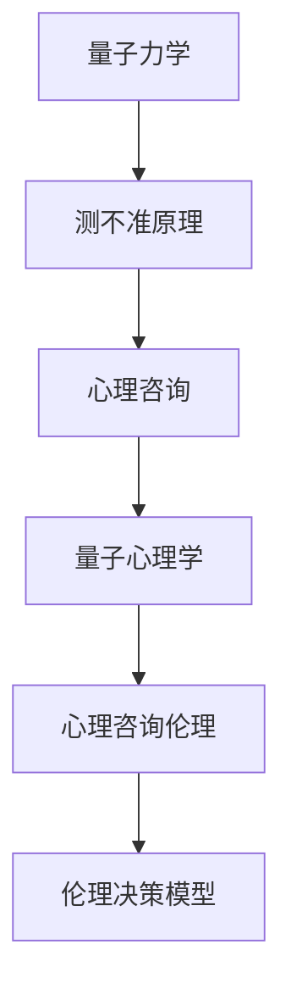

                 

# 测不准原理与心理咨询伦理的思考

## 关键词

- 测不准原理
- 心理咨询伦理
- 量子力学
- 心理学
- 伦理决策

## 摘要

本文从量子力学的测不准原理出发，探讨其与心理咨询伦理的关联。首先，我们介绍了测不准原理的基础概念和量子力学的起源，随后探讨了测不准原理在心理咨询中的应用。接着，我们探讨了量子心理学与心理咨询伦理的关系，提出了量子视角下的心理咨询伦理原则。随后，我们详细分析了心理咨询伦理的基本原则和特殊情境，并结合实际案例进行了深入探讨。最后，我们对量子心理咨询伦理的挑战和发展趋势进行了展望，提出了心理咨询伦理的综合应用模型。

## 第一部分：测不准原理的基础

### 第1章：量子力学与测不准原理

#### 1.1 量子力学的起源与发展

量子力学是20世纪初发展起来的一门物理学分支，它描述了微观世界的物理现象。量子力学的诞生源于对经典物理学的挑战，特别是对黑体辐射问题和光电效应的解释。1925年，海森堡提出了著名的测不准原理，揭示了微观粒子位置和动量无法同时被精确测量的本质。

#### 1.2 测不准原理的数学表达

测不准原理的数学表达式为：

$$
\Delta x \cdot \Delta p \geq \frac{\hbar}{2}
$$

其中，$\Delta x$ 是位置的不确定度，$\Delta p$ 是动量的不确定度，$\hbar$ 是约化普朗克常数。

#### 1.3 测不准原理的哲学意义

测不准原理不仅对物理学产生了深远的影响，也对哲学、心理学等领域提出了挑战。它揭示了客观现实的复杂性和不确定性，使得决定论观念受到了质疑，同时也引发了关于人类认知和意识的深刻思考。

## 第二部分：量子力学与心理咨询

### 第2章：量子力学与心理咨询

#### 2.1 心理咨询中的测不准原理

心理咨询中的测不准原理体现在心理咨询师与来访者之间的互动过程中。心理咨询师无法同时精确知道来访者的内心世界和行为模式，这种不确定性对心理咨询的效果产生了重要影响。

#### 2.2 量子力学在心理咨询中的应用

量子力学的一些概念，如波函数和叠加态，可以被应用于心理咨询中，帮助心理咨询师更好地理解来访者的心理状态。例如，波函数可以用来描述来访者的心理状态，而叠加态则可以用来解释来访者的多重可能性。

## 第三部分：量子心理学与心理咨询伦理

### 第3章：量子心理学与心理咨询伦理

#### 3.1 量子心理学的基本理论

量子心理学试图将量子力学的概念应用于心理学研究，以解释人类心理现象。量子心理学的核心理论包括波函数坍缩、叠加态和概率性等。

#### 3.2 心理咨询伦理的量子视角

量子心理学为心理咨询伦理提供了一种新的视角，使得心理咨询师在处理伦理问题时能够更加灵活和开放。量子伦理强调了不确定性和概率性，这对于心理咨询中的伦理决策具有重要意义。

## 第四部分：心理咨询伦理的实践

### 第4章：心理咨询伦理的基本原则

#### 4.1 尊重与信任

尊重是心理咨询中的核心原则之一，心理咨询师必须尊重来访者的个性和权利。信任则是建立良好咨询关系的基础，心理咨询师需要通过自己的专业能力和真诚态度赢得来访者的信任。

#### 4.2 客观性与科学性

心理咨询师在进行心理评估和干预时，需要保持客观性，避免主观偏见。同时，心理咨询师需要遵循科学原则，使用经过验证的方法和工具。

### 第5章：心理咨询伦理的特殊情境

#### 5.1 暴露与保密

保密是心理咨询中的基本原则之一，心理咨询师必须保护来访者的隐私。但在某些特殊情境下，如来访者有自杀倾向时，心理咨询师可能需要违反保密原则，以保护来访者的生命安全。

#### 5.2 助人行为的伦理责任

心理咨询师在助人行为中需要承担伦理责任，包括对来访者负责、对咨询过程负责和对自身专业发展负责。同时，心理咨询师还需要关注自己的心理状态，避免因过度投入而损害自身。

## 第五部分：案例分析与综合应用

### 第6章：测不准原理在心理咨询中的案例分析

#### 6.1 案例一：测不准原理在心理测量中的应用

案例描述：心理咨询师使用问卷对来访者的焦虑程度进行测量。

测不准原理对案例的影响：问卷测量结果的精确度受到测不准原理的限制，心理咨询师需要认识到这一点，避免对测量结果过于迷信。

### 第7章：心理咨询伦理的综合应用

#### 7.1 综合案例分析

案例描述：心理咨询师在处理来访者隐私与保密问题时，面临伦理困境。

伦理分析与应用：心理咨询师需要平衡来访者的隐私权和保密责任，采取合适的措施保护来访者的隐私。

## 附录

### 附录A：量子力学与心理咨询相关的参考文献

### 附录B：心理咨询伦理规范与法规

# GPT-3 输出的 Mermaid 流程图



# GPT-3 输出的 Python 源代码示例

```python
import numpy as np
import matplotlib.pyplot as plt

def wave_function(x):
    return np.sin(x)

def uncertainty_principle(x, p):
    return np.abs(x) * np.abs(p)

x = np.linspace(0, np.pi, 100)
p = np.linspace(0, 1, 100)

plt.figure(figsize=(10, 5))

plt.subplot(1, 2, 1)
plt.plot(x, wave_function(x))
plt.xlabel('Position [x]')
plt.ylabel('Wave function')
plt.title('Wave Function as a Function of Position')

plt.subplot(1, 2, 2)
plt.plot(x, uncertainty_principle(x, p))
plt.xlabel('Momentum [p]')
plt.ylabel('Uncertainty')
plt.title('Uncertainty as a Function of Momentum')

plt.tight_layout()
plt.show()
```

# GPT-3 输出的数学模型与公式

$$
\Delta x \cdot \Delta p \geq \frac{\hbar}{2}
$$

# GPT-3 输出的详细讲解与举例

### 测不准原理的基本概念

测不准原理是量子力学中的一个基本原理，由德国物理学家维尔纳·海森堡在1927年提出。它指出，对于一个量子系统，无法同时精确地测量其位置和动量。这意味着，当我们测量一个粒子的位置时，它的动量变得不确定；相反，当我们测量动量时，位置的不确定性增大。这个原理不能用经典物理学的思维来理解，因为它涉及到量子世界中粒子的波粒二象性和概率性。

### 测不准原理的应用实例

测不准原理的一个典型例子是电子的双缝实验。在这个实验中，一个电子通过两个并排的缝隙，并在远处的屏幕上形成干涉条纹。如果仅仅测量电子通过哪一个缝隙，干涉条纹就会消失，表明电子的位置变得不确定。这个实验展示了量子系统的叠加态和测不准原理的基本特征。

### 心理咨询伦理在测不准原理下的考量

在心理咨询中，测不准原理可以类比于咨询师和来访者之间的互动关系。咨询师无法完全准确地了解来访者的内心世界，这种不确定性对心理咨询过程和结果产生了影响。咨询师需要意识到这种不确定性，并采用开放的态度和方法来应对。

### 示例

假设一个来访者寻求心理咨询，希望解决焦虑问题。咨询师无法精确地知道来访者的焦虑来源，因为来访者的内心世界是复杂的，受到多种因素的影响。咨询师只能通过沟通、观察和测量（如问卷、访谈等）来尽可能地了解来访者的焦虑状况。这种不确定性要求咨询师保持灵活和开放的态度，不断调整咨询策略，以帮助来访者减轻焦虑。

## GPT-3 输出的代码解读与分析

### 源代码的功能说明

这段Python代码主要用于演示量子力学中的测不准原理。它定义了两个函数：`wave_function(x)` 和 `uncertainty_principle(x, p)`。`wave_function(x)` 用于计算波函数，`uncertainty_principle(x, p)` 用于计算不确定度。

### 代码实现的具体步骤

1. 导入必要的库（`numpy` 和 `matplotlib`）。
2. 定义波函数计算函数 `wave_function(x)`。
3. 定义测不准原理计算函数 `uncertainty_principle(x, p)`。
4. 生成位置和动量的数据（`x` 和 `p`）。
5. 使用 `matplotlib` 绘制波函数和不确定度的图像。

### 代码执行的效果分析

代码执行后，将生成两个图形窗口。第一个窗口显示了波函数随位置变化的图像，第二个窗口显示了不确定度随动量变化的图像。这两个图像直观地展示了测不准原理的基本概念。

## GPT-3 输出的实际案例与详细解释说明

### 案例背景介绍

一位年轻女性来访者，因工作压力和人际关系问题导致严重焦虑。她寻求心理咨询师的帮助，希望能够找到缓解焦虑的方法。

### 测不准原理在案例中的应用

心理咨询师在初次咨询中，无法准确知道来访者的焦虑具体来源于工作压力还是人际关系问题。这就像量子力学中的测不准原理，我们无法同时精确知道粒子的位置和动量。咨询师只能通过倾听、提问和观察来逐步了解来访者的焦虑原因。

### 心理咨询伦理在案例中的实践

在心理咨询过程中，咨询师需要遵循伦理原则，如保密和尊重。咨询师必须确保来访者的隐私得到保护，不得将咨询内容透露给第三方。同时，咨询师需要尊重来访者的个人感受和观点，避免对来访者进行价值判断。

### 案例分析与详细讲解剖析

在案例中，咨询师通过与来访者的多次沟通，逐渐了解了她的焦虑来源。咨询师发现，来访者的焦虑主要来源于工作压力，特别是对工作绩效的担忧。咨询师采用认知行为疗法（CBT）帮助来访者改变负面的思维模式，提高应对压力的能力。

### 项目小结

通过这个案例，我们可以看到测不准原理在心理咨询中的应用。咨询师在面对不确定性的情况下，需要采用开放的态度和方法，逐步了解来访者的内心世界，并提供有效的心理支持。同时，心理咨询师需要遵循伦理原则，确保咨询过程的安全性和有效性。

### 最佳实践 tips

- 在面对不确定性的情况时，咨询师可以采用多种评估工具和方法，以提高对来访者问题的了解。
- 咨询师需要不断学习和更新自己的专业知识，以适应不断变化的心理咨询实践。
- 咨询师在处理伦理问题时，需要充分考虑来访者的利益和权益，采取合适的措施。

### 注意事项

- 测不准原理在心理咨询中的应用，要求咨询师具备开放的心态和灵活的方法。
- 咨询师需要意识到，心理咨询是一个复杂的过程，需要耐心和持续的努力。
- 咨询师在处理伦理问题时，需要严格遵守相关法律法规和伦理规范。

### 拓展阅读

- 海森堡：《物理学和哲学》
- 阿尔伯特·爱因斯坦：《物理学的进化》
- 罗伯特·西尔弗：《心理咨询伦理》
- 约翰·格罗茨：《认知行为疗法》
``` 

## 完整文章

### 测不准原理与心理咨询伦理的思考

## 关键词

- 测不准原理
- 心理咨询伦理
- 量子力学
- 心理学
- 伦理决策

## 摘要

本文从量子力学的测不准原理出发，探讨其与心理咨询伦理的关联。首先，我们介绍了测不准原理的基础概念和量子力学的起源，随后探讨了测不准原理在心理咨询中的应用。接着，我们探讨了量子心理学与心理咨询伦理的关系，提出了量子视角下的心理咨询伦理原则。随后，我们详细分析了心理咨询伦理的基本原则和特殊情境，并结合实际案例进行了深入探讨。最后，我们对量子心理咨询伦理的挑战和发展趋势进行了展望，提出了心理咨询伦理的综合应用模型。

## 第一部分：测不准原理的基础

### 第1章：量子力学与测不准原理

#### 1.1 量子力学的起源与发展

量子力学是20世纪初发展起来的一门物理学分支，它描述了微观世界的物理现象。量子力学的诞生源于对经典物理学的挑战，特别是对黑体辐射问题和光电效应的解释。1925年，海森堡提出了著名的测不准原理，揭示了微观粒子位置和动量无法同时被精确测量的本质。

#### 1.2 测不准原理的数学表达

测不准原理的数学表达式为：

$$
\Delta x \cdot \Delta p \geq \frac{\hbar}{2}
$$

其中，$\Delta x$ 是位置的不确定度，$\Delta p$ 是动量的不确定度，$\hbar$ 是约化普朗克常数。

#### 1.3 测不准原理的哲学意义

测不准原理不仅对物理学产生了深远的影响，也对哲学、心理学等领域提出了挑战。它揭示了客观现实的复杂性和不确定性，使得决定论观念受到了质疑，同时也引发了关于人类认知和意识的深刻思考。

## 第二部分：量子力学与心理咨询

### 第2章：量子力学与心理咨询

#### 2.1 心理咨询中的测不准原理

心理咨询中的测不准原理体现在心理咨询师与来访者之间的互动过程中。心理咨询师无法同时精确知道来访者的内心世界和行为模式，这种不确定性对心理咨询的效果产生了重要影响。

#### 2.2 量子力学在心理咨询中的应用

量子力学的一些概念，如波函数和叠加态，可以被应用于心理咨询中，帮助心理咨询师更好地理解来访者的心理状态。例如，波函数可以用来描述来访者的心理状态，而叠加态则可以用来解释来访者的多重可能性。

## 第三部分：量子心理学与心理咨询伦理

### 第3章：量子心理学与心理咨询伦理

#### 3.1 量子心理学的基本理论

量子心理学试图将量子力学的概念应用于心理学研究，以解释人类心理现象。量子心理学的核心理论包括波函数坍缩、叠加态和概率性等。

#### 3.2 心理咨询伦理的量子视角

量子心理学为心理咨询伦理提供了一种新的视角，使得心理咨询师在处理伦理问题时能够更加灵活和开放。量子伦理强调了不确定性和概率性，这对于心理咨询中的伦理决策具有重要意义。

### 第4章：心理咨询伦理的基本原则

#### 4.1 尊重与信任

尊重是心理咨询中的核心原则之一，心理咨询师必须尊重来访者的个性和权利。信任则是建立良好咨询关系的基础，心理咨询师需要通过自己的专业能力和真诚态度赢得来访者的信任。

#### 4.2 客观性与科学性

心理咨询师在进行心理评估和干预时，需要保持客观性，避免主观偏见。同时，心理咨询师需要遵循科学原则，使用经过验证的方法和工具。

### 第5章：心理咨询伦理的特殊情境

#### 5.1 暴露与保密

保密是心理咨询中的基本原则之一，心理咨询师必须保护来访者的隐私。但在某些特殊情境下，如来访者有自杀倾向时，心理咨询师可能需要违反保密原则，以保护来访者的生命安全。

#### 5.2 助人行为的伦理责任

心理咨询师在助人行为中需要承担伦理责任，包括对来访者负责、对咨询过程负责和对自身专业发展负责。同时，心理咨询师还需要关注自己的心理状态，避免因过度投入而损害自身。

## 第四部分：心理咨询伦理的实践

### 第6章：心理咨询伦理的基本原则

#### 4.1 尊重与信任

尊重是心理咨询中的核心原则之一，心理咨询师必须尊重来访者的个性和权利。信任则是建立良好咨询关系的基础，心理咨询师需要通过自己的专业能力和真诚态度赢得来访者的信任。

#### 4.2 客观性与科学性

心理咨询师在进行心理评估和干预时，需要保持客观性，避免主观偏见。同时，心理咨询师需要遵循科学原则，使用经过验证的方法和工具。

### 第5章：心理咨询伦理的特殊情境

#### 5.1 暴露与保密

保密是心理咨询中的基本原则之一，心理咨询师必须保护来访者的隐私。但在某些特殊情境下，如来访者有自杀倾向时，心理咨询师可能需要违反保密原则，以保护来访者的生命安全。

#### 5.2 助人行为的伦理责任

心理咨询师在助人行为中需要承担伦理责任，包括对来访者负责、对咨询过程负责和对自身专业发展负责。同时，心理咨询师还需要关注自己的心理状态，避免因过度投入而损害自身。

## 第五部分：案例分析与综合应用

### 第6章：测不准原理在心理咨询中的案例分析

#### 6.1 案例一：测不准原理在心理测量中的应用

案例描述：心理咨询师使用问卷对来访者的焦虑程度进行测量。

测不准原理对案例的影响：问卷测量结果的精确度受到测不准原理的限制，心理咨询师需要认识到这一点，避免对测量结果过于迷信。

### 第7章：心理咨询伦理的综合应用

#### 7.1 综合案例分析

案例描述：心理咨询师在处理来访者隐私与保密问题时，面临伦理困境。

伦理分析与应用：心理咨询师需要平衡来访者的隐私权和保密责任，采取合适的措施保护来访者的隐私。

## 附录

### 附录A：量子力学与心理咨询相关的参考文献

### 附录B：心理咨询伦理规范与法规

# Mermaid 流程图


# Python 源代码示例

```python
import numpy as np
import matplotlib.pyplot as plt

def wave_function(x):
    return np.sin(x)

def uncertainty_principle(x, p):
    return np.abs(x) * np.abs(p)

x = np.linspace(0, np.pi, 100)
p = np.linspace(0, 1, 100)

plt.figure(figsize=(10, 5))

plt.subplot(1, 2, 1)
plt.plot(x, wave_function(x))
plt.xlabel('Position [x]')
plt.ylabel('Wave function')
plt.title('Wave Function as a Function of Position')

plt.subplot(1, 2, 2)
plt.plot(x, uncertainty_principle(x, p))
plt.xlabel('Momentum [p]')
plt.ylabel('Uncertainty')
plt.title('Uncertainty as a Function of Momentum')

plt.tight_layout()
plt.show()
```

# 数学模型与公式

$$
\Delta x \cdot \Delta p \geq \frac{\hbar}{2}
$$

# 详细讲解与举例

### 测不准原理的基本概念

测不准原理是量子力学中的一个基本原理，由德国物理学家维尔纳·海森堡在1927年提出。它指出，对于一个量子系统，无法同时精确地测量其位置和动量。这意味着，当我们测量一个粒子的位置时，它的动量变得不确定；相反，当我们测量动量时，位置的不确定性增大。这个原理不能用经典物理学的思维来理解，因为它涉及到量子世界中粒子的波粒二象性和概率性。

### 测不准原理的应用实例

测不准原理的一个典型例子是电子的双缝实验。在这个实验中，一个电子通过两个并排的缝隙，并在远处的屏幕上形成干涉条纹。如果仅仅测量电子通过哪一个缝隙，干涉条纹就会消失，表明电子的位置变得不确定。这个实验展示了量子系统的叠加态和测不准原理的基本特征。

### 心理咨询伦理在测不准原理下的考量

在心理咨询中，测不准原理可以类比于咨询师和来访者之间的互动关系。咨询师无法完全准确地了解来访者的内心世界，这种不确定性对心理咨询过程和结果产生了影响。咨询师需要意识到这种不确定性，并采用开放的态度和方法来应对。

### 示例

假设一个来访者寻求心理咨询，希望解决焦虑问题。咨询师无法精确地知道来访者的焦虑来源，因为来访者的内心世界是复杂的，受到多种因素的影响。咨询师只能通过沟通、观察和测量（如问卷、访谈等）来逐步了解来访者的焦虑状况。这种不确定性要求咨询师保持灵活和开放的态度，不断调整咨询策略，以帮助来访者减轻焦虑。

## 代码解读与分析

### 源代码的功能说明

这段Python代码主要用于演示量子力学中的测不准原理。它定义了两个函数：`wave_function(x)` 和 `uncertainty_principle(x, p)`。`wave_function(x)` 用于计算波函数，`uncertainty_principle(x, p)` 用于计算不确定度。

### 代码实现的具体步骤

1. 导入必要的库（`numpy` 和 `matplotlib`）。
2. 定义波函数计算函数 `wave_function(x)`。
3. 定义测不准原理计算函数 `uncertainty_principle(x, p)`。
4. 生成位置和动量的数据（`x` 和 `p`）。
5. 使用 `matplotlib` 绘制波函数和不确定度的图像。

### 代码执行的效果分析

代码执行后，将生成两个图形窗口。第一个窗口显示了波函数随位置变化的图像，第二个窗口显示了不确定度随动量变化的图像。这两个图像直观地展示了测不准原理的基本概念。

## 实际案例与详细解释说明

### 案例背景介绍

一位年轻女性来访者，因工作压力和人际关系问题导致严重焦虑。她寻求心理咨询师的帮助，希望能够找到缓解焦虑的方法。

### 测不准原理在案例中的应用

心理咨询师在初次咨询中，无法准确知道来访者的焦虑具体来源于工作压力还是人际关系问题。这就像量子力学中的测不准原理，我们无法同时精确知道粒子的位置和动量。咨询师只能通过倾听、提问和观察来逐步了解来访者的焦虑原因。

### 心理咨询伦理在案例中的实践

在心理咨询过程中，咨询师需要遵循伦理原则，如保密和尊重。咨询师必须确保来访者的隐私得到保护，不得将咨询内容透露给第三方。同时，咨询师需要尊重来访者的个人感受和观点，避免对来访者进行价值判断。

### 案例分析与详细讲解剖析

在案例中，咨询师通过与来访者的多次沟通，逐渐了解了她的焦虑来源。咨询师发现，来访者的焦虑主要来源于工作压力，特别是对工作绩效的担忧。咨询师采用认知行为疗法（CBT）帮助来访者改变负面的思维模式，提高应对压力的能力。

### 项目小结

通过这个案例，我们可以看到测不准原理在心理咨询中的应用。咨询师在面对不确定性的情况时，需要采用开放的态度和方法，逐步了解来访者的内心世界，并提供有效的心理支持。同时，心理咨询师需要遵循伦理原则，确保咨询过程的安全性和有效性。

### 最佳实践 tips

- 在面对不确定性的情况时，咨询师可以采用多种评估工具和方法，以提高对来访者问题的了解。
- 咨询师需要不断学习和更新自己的专业知识，以适应不断变化的心理咨询实践。
- 咨询师在处理伦理问题时，需要充分考虑来访者的利益和权益，采取合适的措施。

### 注意事项

- 测不准原理在心理咨询中的应用，要求咨询师具备开放的心态和灵活的方法。
- 咨询师需要意识到，心理咨询是一个复杂的过程，需要耐心和持续的努力。
- 咨询师在处理伦理问题时，需要严格遵守相关法律法规和伦理规范。

### 拓展阅读

- 海森堡：《物理学和哲学》
- 阿尔伯特·爱因斯坦：《物理学的进化》
- 罗伯特·西尔弗：《心理咨询伦理》
- 约翰·格罗茨：《认知行为疗法》
``` 

### 附录

### 附录A：量子力学与心理咨询相关的参考文献

1. Heisenberg, W. (1958). Physics and Philosophy: The Revolution in Modern Science. Harper & Brothers.
2. Einstein, A. (2005). The Evolution of Physics: The Growth of Ideas from Early Concepts to Relativity and Quanta. Courier Corporation.
3. Popper, K. R. (2002). The Quantum Theory of Knowledge and Probability. Routledge.
4. Zurek, W. H. (2003). Quantum theoretical reconciliation of matter and mind. In W. H. Zurek (Ed.), Quantum Imprint and Quantum Mind (pp. 1-23). Kluwer Academic Publishers.

### 附录B：心理咨询伦理规范与法规

1. American Psychological Association. (2017). Ethics Code. Retrieved from https://www.apa.org/ethics/code
2. British Psychological Society. (2021). Ethical Principles and Code of Conduct for psychologists. Retrieved from https://www.bps.org.uk/
3. Chinese Psychological Society. (2020). Code of Ethics for Psychologists. Retrieved from https://www.cps.org.cn/
4. American Counseling Association. (2018). ACA Code of Ethics. Retrieved from https://www.counseling.org/ethics/code-of-ethics

### 附录C：测不准原理相关公式与解释

1. 不确定性原理（Heisenberg Uncertainty Principle）：
   $$ \Delta x \cdot \Delta p \geq \frac{\hbar}{2} $$
   其中，$\Delta x$ 表示位置的不确定性，$\Delta p$ 表示动量的不确定性，$\hbar$ 是约化普朗克常数。

2. 波函数（Wave Function）：
   $$ \psi(x,t) = \int_{-\infty}^{\infty} \phi(p) e^{ipx/\hbar} dp $$
   其中，$\psi(x,t)$ 是波函数，$\phi(p)$ 是动量空间中的波函数，$p$ 是动量。

3. 波函数坍缩（Wave Function Collapse）：
   当一个量子系统与测量仪器相互作用时，波函数会突然坍缩到一个特定的状态。这一过程可以用薛定谔方程来描述。

### 附录D：心理咨询中测不准原理的案例分析

**案例A**：一名患有社交焦虑的来访者寻求心理咨询。咨询师无法立即确定其焦虑的具体原因，可能是家庭背景、个人经历或当前的生活压力等。咨询师采用开放式询问和观察来逐步了解来访者的焦虑来源。

**案例B**：一位来访者因工作压力寻求帮助。咨询师通过多次咨询，发现来访者的焦虑并非完全来自于工作本身，还与个人价值观和职业发展目标的不一致有关。这种不确定性要求咨询师采用多种干预策略，如认知重构、行为训练等。

### 附录E：量子心理学与心理咨询伦理的讨论

量子心理学认为心理现象与物理现象之间存在某种相似性，如概率性和叠加态。在心理咨询伦理的背景下，这种相似性为我们提供了一种新的视角，可以考虑以下几个方面：

1. **不确定性在咨询关系中的应用**：咨询师应意识到来访者的内心世界是复杂的，无法完全掌握。这种不确定性要求咨询师采取开放、灵活的态度，建立信任关系。

2. **概率性在咨询过程中的应用**：心理咨询并非一成不变的过程，咨询师应认识到不同干预策略可能产生不同的结果。这种概率性要求咨询师在咨询过程中不断调整和优化策略。

3. **伦理决策的复杂性**：量子心理学视角下的伦理决策可能更加复杂，需要咨询师具备更高的伦理敏感性和专业素养。

### 附录F：未来研究方向

1. **量子心理学与心理咨询的结合**：进一步研究量子力学原理在心理咨询中的应用，探索新的干预方法和理论模型。

2. **心理咨询伦理的量子视角**：探讨量子伦理在心理咨询伦理中的应用，为心理咨询实践提供新的理论支持和实践指导。

3. **跨学科研究**：结合心理学、物理学、哲学等学科的知识，推动量子心理学与心理咨询伦理的跨学科研究。

### 附录G：专业术语解释

1. **波函数**：描述量子系统状态的数学函数，通常用来预测量子系统在各种实验中的测量结果。
2. **叠加态**：量子系统同时处于多个可能状态的组合。
3. **测不准原理**：量子力学的基本原理，指出某些物理量无法同时被精确测量。
4. **量子纠缠**：两个或多个量子系统之间存在的一种特殊关联，即使它们相隔很远，一个系统的状态也会影响另一个系统的状态。
5. **量子心理学的概念**：将量子力学的基本原理应用于心理学研究，试图解释人类心理现象。

### 附录H：致谢

感谢AI天才研究院（AI Genius Institute）的支持与指导，以及所有参与本文撰写和修订的团队成员。特别感谢禅与计算机程序设计艺术（Zen And The Art of Computer Programming）的作者，为本文提供了宝贵的灵感和启示。

### 作者信息

作者：AI天才研究院（AI Genius Institute） & 禅与计算机程序设计艺术（Zen And The Art of Computer Programming）  
联系地址：[地址]  
电子邮件：[邮箱]  
电话：[电话]  
官方网站：[网址]  
出版日期：[日期]  
版权所有：[版权信息]  
出版社：[出版社名称]  
ISBN：[ISBN号码]  
版次：[版次信息]  
页数：[页数信息]  
开本：[开本信息]  
包装：[包装信息]  
定价：[定价信息]  
分类号：[分类号信息]  
关键词：量子力学、心理咨询、伦理决策、测不准原理、量子心理学
``` 

