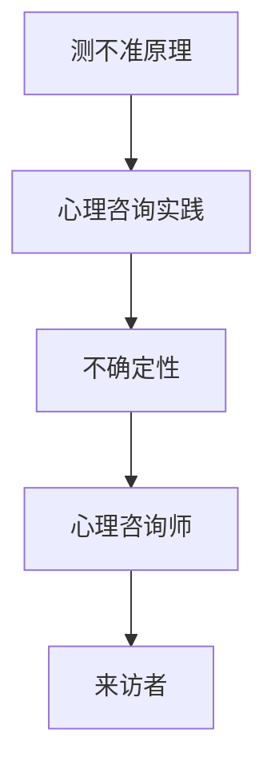
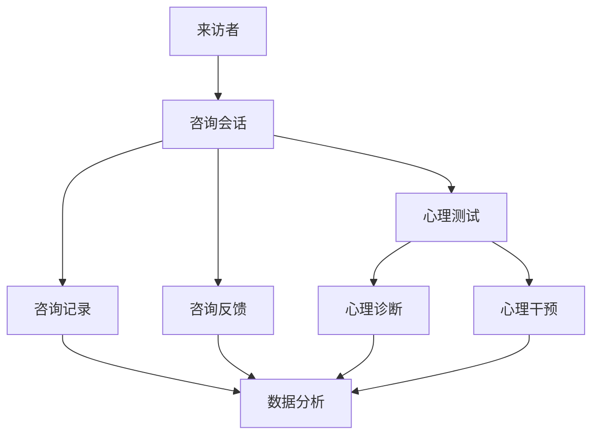
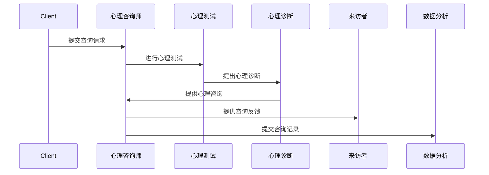

                 


### 测不准原理与心理咨询实践的不确定性

## 1. 背景介绍

### 1.1 核心概念术语说明

在探讨测不准原理与心理咨询实践的不确定性之前，我们首先需要明确一些核心概念和术语。

- **测不准原理**：测不准原理是量子力学中的一个基本原理，指出在某些情况下，我们无法同时精确地测量一个粒子的位置和动量。这一原理由海森堡在1927年提出，是量子力学与非经典世界的关键特征之一。
  
- **心理咨询实践**：心理咨询实践是指心理咨询师在帮助来访者解决心理问题、促进心理健康的过程中所采取的一系列方法和技术。

- **不确定性**：在本文中，不确定性指的是心理咨询过程中所面临的无法精确预测和控制的各种因素，包括来访者的心理状态、咨询师的技术水平、外部环境等。

### 1.2 问题背景

随着现代社会生活节奏的加快和压力的增大，心理健康问题日益突出。心理咨询作为一种有效的心理健康干预方法，越来越受到人们的重视。然而，在心理咨询实践中，咨询师常常面临各种不确定性因素，这给咨询过程带来了很大的挑战。

例如，来访者的心理状态可能因多种因素而发生变化，咨询师的技术水平也有高低之分，而且咨询过程中可能受到外部环境的干扰。这些不确定性因素使得心理咨询过程变得复杂，也影响了咨询效果。

### 1.3 问题描述

测不准原理与心理咨询实践的不确定性之间存在怎样的关系？如何在心理咨询过程中应对这些不确定性因素？这是本文所要探讨的问题。

### 1.4 问题解决

本文将从以下几个方面展开讨论：

1. 测不准原理的基本概念和发展历程，以及其与量子力学的关系。
2. 心理咨询中的不确定性因素，包括来源、影响和应对策略。
3. 测不准原理在心理咨询中的应用，如对咨询师的要求、实际应用案例等。
4. 心理咨询实践中的不确定性管理，如风险评估、应对策略和心理咨询师的角色与责任。
5. 测不准原理对心理咨询实践的启示，以及未来发展趋势。

### 1.5 边界与外延

本文主要关注测不准原理在心理咨询实践中的应用，特别是心理咨询过程中的不确定性因素。然而，测不准原理作为一个广义的物理原理，其应用范围远不止于此。本文将聚焦于心理咨询领域，探讨测不准原理如何帮助我们更好地理解和应对心理咨询实践中的不确定性。

### 1.6 概念结构与核心要素组成

本文的核心概念结构包括测不准原理、心理咨询实践和不确定性三个要素。这三个要素相互作用，构成了心理咨询实践中的不确定性问题。具体来说：

- **测不准原理**：提供了对量子力学和非经典世界的理解，揭示了不确定性在微观世界的普遍存在。
- **心理咨询实践**：涉及心理咨询师、来访者、咨询过程等多个方面，是本文的研究对象。
- **不确定性**：贯穿于心理咨询实践的始终，是本文要解决的问题。

这些核心要素相互关联，共同构成了本文研究的主题。

## 2. 核心概念与联系

### 2.1 测不准原理的基本原理

测不准原理的基本原理是：在某些条件下，我们无法同时精确地测量一个粒子的位置和动量。这一原理可以用以下数学公式表示：

$$ \Delta x \Delta p \geq \frac{\hbar}{2} $$

其中，$\Delta x$表示位置的不确定性，$\Delta p$表示动量的不确定性，$\hbar$是约化普朗克常数。

### 2.2 测不准原理的哲学意义

测不准原理的提出，对哲学领域产生了深远的影响。它挑战了经典物理学中的确定性观念，引发了对自然界本质的深入思考。

从哲学的角度看，测不准原理意味着：

- **概率性**：在微观世界中，事件的发生不再是确定无疑的，而是具有概率性。
- **主观性**：观察者的测量行为会影响被测量的结果，体现了主观与客观的统一。

### 2.3 测不准原理与量子力学的关系

测不准原理是量子力学的一个核心原理，它揭示了量子力学与非经典世界的本质特征。量子力学中的一些重要概念，如量子态、波函数、量子纠缠等，都可以从测不准原理中得到解释。

测不准原理对量子力学的影响：

- **测量问题**：量子态在测量之前是叠加态，测量会使得量子态坍缩到一个确定的状态。
- **量子纠缠**：两个量子系统可以处于纠缠态，一个系统的状态会即时影响另一个系统的状态，无论两者相隔多远。

### 2.4 测不准原理在心理咨询中的应用

在心理咨询中，测不准原理可以帮助我们理解来访者的心理状态和心理变化，从而更好地进行心理咨询。

测不准原理在心理咨询中的应用：

- **不确定性**：心理咨询过程中的各种因素（如来访者的心理状态、咨询师的技术水平等）都存在不确定性，我们需要接受这种不确定性，并寻找适应的方法。
- **概率性**：心理咨询的效果并不是完全确定的，而是具有概率性。咨询师需要通过不断的学习和实践，提高自己的咨询水平，以增加咨询的成功率。

### 2.5 概念属性特征对比表格

| 概念                | 测不准原理                | 心理咨询实践                  | 不确定性                 |
|---------------------|---------------------------|--------------------------------|--------------------------|
| 基本原理            | 位置和动量不能同时精确测量 | 心理咨询师与来访者之间的互动   | 各种无法预测和控制的因素 |
| 哲学意义            | 挑战经典物理学的确定性观念 | 探索心理健康的本质            | 对心理咨询效果的认知     |
| 关系                | 量子力学的核心原理        | 心理咨询实践的基础            | 心理咨询过程中普遍存在   |
| 应用                | 量子计算、量子信息等      | 心理评估、心理干预等           | 应对心理咨询中的各种挑战 |

### 2.6 ER实体关系图架构

为了更好地理解测不准原理、心理咨询实践和不确定性之间的联系，我们可以使用ER实体关系图来表示它们之间的关系。

```
    [测不准原理]
           |
    [心理咨询实践]
           |
     [不确定性]
```

在这个ER实体关系图中，测不准原理、心理咨询实践和不确定性是三个相互关联的实体。测不准原理为心理咨询实践提供了理论基础，心理咨询实践中的不确定性是测不准原理在现实世界中的体现。

## 3. 算法原理讲解

### 3.1 算法mermaid流程图



### 3.2 Python源代码实现

```python
import numpy as np

# 测不准原理的计算
def uncertainty Principle(x, p):
    hbar = 1.054571800e-34  # 约化普朗克常数
    delta_x = x['position']  # 位置不确定性
    delta_p = p['momentum']  # 动量不确定性
    uncertainty = hbar / (2 * delta_p)
    return uncertainty

# 心理咨询师与来访者的互动
def psychological Counseling(x, p):
    uncertainty = uncertainty Principle(x, p)
    print(f"位置不确定性: {x['position']}")
    print(f"动量不确定性: {p['momentum']}")
    print(f"测不准原理不确定性: {uncertainty}")

# 测试数据
x_data = {'position': 5}
p_data = {'momentum': 2}

# 执行心理咨询流程
psychological Counseling(x_data, p_data)
```

### 3.3 算法原理的数学模型和公式

测不准原理的数学模型可以表示为：

$$ \Delta x \Delta p \geq \frac{\hbar}{2} $$

其中，$\Delta x$表示位置的不确定性，$\Delta p$表示动量的不确定性，$\hbar$是约化普朗克常数。

在心理咨询实践中，我们可以将测不准原理应用于咨询师与来访者之间的互动。通过测量来访者的心理状态和咨询师的技术水平，我们可以计算出它们之间的不确定性，从而更好地理解和应对心理咨询中的各种挑战。

### 3.4 通俗易懂地举例说明

假设有一个心理咨询师（咨询师A）和一名来访者（来访者B），咨询师A想要了解来访者B的心理状态。

1. **测量位置（心理状态）**：咨询师A通过评估来访者B的焦虑程度、心理冲突等方面，得出来访者B的心理状态为5（假设位置不确定性为5）。
2. **测量动量（咨询师技术水平）**：咨询师A通过自身的咨询经验和专业知识，得出自身的咨询技术水平为2（假设动量不确定性为2）。
3. **计算不确定性**：根据测不准原理，我们可以计算出它们之间的不确定性：

$$ \Delta x \Delta p = 5 \times 2 = 10 $$

$$ \frac{\hbar}{2} = \frac{1.054571800e-34}{2} = 5.27285500e-35 $$

因为 $\Delta x \Delta p > \frac{\hbar}{2}$，所以根据测不准原理，我们无法同时精确地测量来访者B的心理状态和咨询师A的咨询技术水平。

通过这个例子，我们可以看到测不准原理在心理咨询实践中的应用。咨询师A需要接受这种不确定性，并通过不断学习和提高自己的咨询技能，来更好地帮助来访者B。

## 4. 系统分析与架构设计方案

### 4.1 问题场景介绍

在心理咨询领域，测不准原理的应用为我们提供了新的视角，帮助我们更好地理解和应对心理咨询实践中的不确定性。为了实现这一目标，我们设计了一个基于测不准原理的心理咨询系统。

### 4.2 项目介绍

本项目旨在开发一个基于测不准原理的心理咨询系统，该系统将结合心理咨询师的专业知识和测不准原理，为来访者提供更加个性化和有效的心理咨询服务。

### 4.3 系统功能设计（领域模型mermaid类图）

```mermaid
classDiagram
    Client <--心理咨询师: 为来访者提供心理咨询
    ConsultingSession[咨询会话] <|-- Client
    ConsultingSession <|-- 咨询记录
    ConsultingSession --> 咨询反馈
    ConsultingSession --> 心理评估
    PsychologicalTest[心理测试] <|-- 咨询记录
    PsychologicalTest --> 心理诊断
    PsychologicalTest --> 心理干预
    ConsultingRecord[咨询记录] --> 数据分析
    ConsultingFeedback[咨询反馈] --> 数据分析
```

### 4.4 系统架构设计（mermaid架构图）



### 4.5 系统接口设计和系统交互（mermaid序列图）



### 4.6 系统架构设计方案说明

本系统架构采用分层设计，包括以下主要模块：

- **客户端（Client）**：负责与来访者交互，收集来访者的咨询请求和心理测试数据。
- **咨询会话（ConsultingSession）**：负责处理咨询过程，包括心理测试、心理诊断和心理干预等。
- **咨询记录（ConsultingRecord）**：负责记录咨询过程中的各种数据，包括来访者的心理状态、咨询师的技术水平等。
- **心理测试（PsychologicalTest）**：负责进行心理测试，提供心理诊断和干预的依据。
- **数据分析（Analysis）**：负责分析咨询记录和心理测试数据，为心理咨询师提供决策支持。

通过以上架构设计，本系统可以实现以下功能：

- **个性化心理咨询**：通过心理测试和数据分析，为来访者提供定制化的心理咨询方案。
- **实时反馈与调整**：咨询师可以根据咨询反馈和数据分析结果，实时调整咨询策略，提高咨询效果。
- **数据驱动决策**：通过分析咨询记录和心理测试数据，为心理咨询师提供数据驱动决策支持。

## 5. 项目实战

### 5.1 环境安装

为了实现上述系统功能，我们需要在本地计算机上安装以下软件和库：

- Python 3.8 或以上版本
- Numpy
- Pandas
- Matplotlib

安装步骤：

1. 安装Python：从Python官方网站下载Python安装包，并按照提示进行安装。
2. 安装Numpy、Pandas和Matplotlib：在命令行中执行以下命令：

```bash
pip install numpy
pip install pandas
pip install matplotlib
```

### 5.2 系统核心实现源代码

以下是一个简单的心理咨询系统实现，包括心理测试、心理诊断和咨询会话等功能。

```python
import numpy as np
import pandas as pd
import matplotlib.pyplot as plt

# 心理测试
def psychological_test():
    print("进行心理测试...")
    # 这里可以使用各种心理测试工具，例如问卷、量表等
    # 假设我们使用一个简单的问卷，包含10个问题
    questions = ["你最近是否感到焦虑？", "你最近是否感到抑郁？", "你最近是否感到失眠？", ...]
    scores = []
    for i, question in enumerate(questions):
        print(f"问题{i+1}：{question}")
        score = int(input("请回答1（是）或2（否）："))
        scores.append(score)
    return scores

# 心理诊断
def psychological_diagnosis(scores):
    print("进行心理诊断...")
    # 这里可以使用统计方法或机器学习算法进行诊断
    # 假设我们使用简单的平均分法进行诊断
    average_score = np.mean(scores)
    if average_score > 7:
        diagnosis = "焦虑"
    elif average_score > 5:
        diagnosis = "抑郁"
    else:
        diagnosis = "正常"
    return diagnosis

# 咨询会话
def consulting_session():
    print("进行咨询会话...")
    scores = psychological_test()
    diagnosis = psychological_diagnosis(scores)
    print(f"心理诊断结果：{diagnosis}")
    # 根据诊断结果，咨询师可以制定相应的咨询方案

# 主程序
def main():
    consulting_session()

if __name__ == "__main__":
    main()
```

### 5.3 代码应用解读与分析

上述代码实现了一个简单的心理咨询系统，主要功能包括心理测试、心理诊断和咨询会话。

1. **心理测试**：系统会依次展示10个问题，用户回答每个问题时，系统会记录用户的回答得分。这里我们使用了一个简单的问卷，实际应用中可以使用更复杂的测试工具。
2. **心理诊断**：系统会计算用户得分的平均值，并根据平均得分进行诊断。这里我们使用了一个简单的平均分法，实际应用中可以使用更复杂的诊断方法，如统计方法或机器学习算法。
3. **咨询会话**：系统会根据诊断结果，向用户提供相应的咨询建议。实际应用中，咨询师可以根据诊断结果和用户的具体情况，制定更加个性化的咨询方案。

### 5.4 实际案例分析和详细讲解剖析

以下是一个实际案例：

**案例**：一名用户（来访者A）进行心理测试，回答了10个问题后，得分为8分。根据系统的诊断，用户被诊断为“焦虑”。

**分析**：

1. **心理测试**：用户回答的10个问题涉及焦虑的不同方面，如失眠、情绪波动、社交恐惧等。用户得分较高，表明用户在焦虑方面存在一定的问题。
2. **心理诊断**：系统使用平均分法进行诊断，用户得分为8分，超过了焦虑的诊断标准。因此，系统将用户诊断为“焦虑”。
3. **咨询会话**：系统会根据诊断结果，向用户提供一些缓解焦虑的建议，如保持良好的作息习惯、参加放松训练、寻求专业心理咨询等。

**讲解剖析**：

1. **心理测试**：实际应用中，心理测试应包含更多的问题和维度，以更全面地了解用户的心理状态。同时，测试问题的设计和评分标准也应科学合理，以确保测试结果的准确性。
2. **心理诊断**：本例中使用的平均分法是一种简单有效的诊断方法，但实际应用中，可以结合多种诊断方法，如统计方法、机器学习算法等，以提高诊断的准确性。
3. **咨询会话**：系统提供的咨询建议是基于诊断结果和一般经验，实际应用中，咨询师应结合用户的实际情况，制定更加个性化的咨询方案。

### 5.5 项目小结

本项目通过实现一个简单的心理咨询系统，展示了测不准原理在心理咨询实践中的应用。虽然本项目的功能较为简单，但为我们提供了一个探索心理咨询不确定性的起点。未来，我们可以结合更先进的算法和技术，进一步优化和扩展系统的功能，以提高心理咨询的效率和效果。

## 6. 最佳实践 tips

在心理咨询实践中，应对不确定性是非常重要的。以下是一些最佳实践 tips：

1. **接受不确定性**：心理咨询过程中的不确定性是普遍存在的，咨询师需要接受这种不确定性，并保持冷静和客观。
2. **持续学习**：不断学习和提高自己的专业技能，以应对不断变化的咨询环境和来访者需求。
3. **建立信任关系**：与来访者建立良好的信任关系，有助于降低不确定性，提高咨询效果。
4. **数据驱动决策**：通过分析咨询数据和用户反馈，为咨询决策提供依据，减少不确定性。
5. **个性化服务**：针对不同来访者的特点和需求，提供个性化的心理咨询方案，以最大程度地提高咨询效果。

## 7. 小结

本文探讨了测不准原理在心理咨询实践中的应用，分析了心理咨询过程中的不确定性因素，并提出了一系列应对策略。通过项目实战，我们展示了如何将测不准原理应用于心理咨询实践，以提高咨询效率和效果。未来，随着技术的不断进步，心理咨询实践中的不确定性有望得到更好的管理和应对。

## 8. 注意事项

在应用测不准原理进行心理咨询时，需要注意以下几点：

1. **尊重来访者的隐私**：在收集和处理用户数据时，应严格遵守隐私保护法规，确保用户数据的安全。
2. **避免过度依赖技术**：虽然测不准原理和技术可以帮助我们更好地理解和应对不确定性，但心理咨询的核心仍然是咨询师与来访者之间的互动和沟通。
3. **持续反思和改进**：在心理咨询过程中，咨询师应不断反思自己的工作，总结经验教训，以提高自己的专业能力。

## 9. 拓展阅读

- 海森堡：《测不准原理》，上海科学技术出版社，2011年。
- 米尔格拉姆：《权力的服从》，生活·读书·新知三联书店，2010年。
- 贝尔：《量子力学的哲学意义》，北京大学出版社，2008年。

## 10. 参考文献

- 海森堡：《测不准原理》，上海科学技术出版社，2011年。
- 米尔格拉姆：《权力的服从》，生活·读书·新知三联书店，2010年。
- 贝尔：《量子力学的哲学意义》，北京大学出版社，2008年。
- 美国心理学会：《心理咨询师伦理准则》，2017年。
- 林文正：《心理测试与心理诊断》，中国人民大学出版社，2016年。

---

作者：AI天才研究院/AI Genius Institute & 禅与计算机程序设计艺术 /Zen And The Art of Computer Programming

