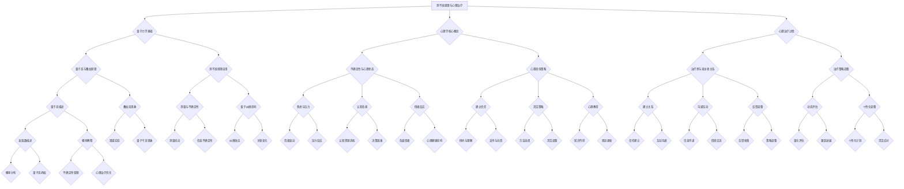

                 


# 测不准原理与心理治疗效果的不确定性

关键词：测不准原理、心理治疗、不确定性、量子力学、心理学

摘要：本文探讨了量子力学的测不准原理与心理治疗效果的不确定性之间的联系。通过分析量子力学和心理学中的核心概念和原理，探讨了测不准原理在心理治疗中的应用和影响，提出了降低心理治疗效果不确定性的方法，并对测不准原理在心理治疗实践中的挑战和未来方向进行了展望。

## 目录大纲

### 第一部分：测不准原理基础

#### 第1章：测不准原理概述

##### 1.1 测不准原理的提出与发展
##### 1.2 测不准原理的核心概念
##### 1.3 测不准原理的哲学意义

#### 第2章：量子力学与测不准原理

##### 2.1 量子力学基础
##### 2.2 量子态与叠加原理
##### 2.3 测不准原理在量子力学中的应用

#### 第3章：测不准原理与经典物理

##### 3.1 经典物理与量子物理的区别
##### 3.2 测不准原理对经典物理的挑战
##### 3.3 测不准原理与经典物理的兼容性

### 第二部分：测不准原理与心理学

#### 第4章：心理学中的不确定性

##### 4.1 心理学中的不确定性概念
##### 4.2 不确定性与心理状态的关系
##### 4.3 心理学实验中的不确定性控制

#### 第5章：测不准原理与心理治疗

##### 5.1 测不准原理在心理治疗中的应用
##### 5.2 测不准原理对心理治疗的影响
##### 5.3 测不准原理与心理治疗的伦理问题

#### 第6章：不确定性在心理咨询中的应用

##### 6.1 心理咨询中的不确定性因素
##### 6.2 不确定性的心理咨询策略
##### 6.3 不确定性心理咨询的案例分析

### 第三部分：测不准原理与心理治疗效果的不确定性

#### 第7章：心理治疗效果的不确定性分析

##### 7.1 心理治疗效果的不确定性来源
##### 7.2 心理治疗效果的不确定性评估
##### 7.3 降低心理治疗效果不确定性的方法

#### 第8章：测不准原理在心理治疗实践中的案例分析

##### 8.1 案例一：测不准原理在个体心理咨询中的应用
##### 8.2 案例二：测不准原理在团体心理咨询中的应用
##### 8.3 案例三：测不准原理在家庭心理咨询中的应用

#### 第9章：结论与展望

##### 9.1 测不准原理对心理治疗的贡献
##### 9.2 测不准原理在心理治疗中的挑战与未来方向
##### 9.3 心理治疗实践中的不确定性管理策略

#### 附录：测不准原理与心理治疗相关资源

##### 附录1：测不准原理与心理治疗的参考文献
##### 附录2：心理治疗工具与资源推荐
##### 附录3：测不准原理相关科普文章与视频推荐

### 第1章：测不准原理概述

#### 1.1 测不准原理的提出与发展

测不准原理（Uncertainty Principle）是量子力学中一个基本且革命性的概念，由德国物理学家维尔纳·海森堡（Werner Heisenberg）于1927年首次提出。这一原理揭示了微观世界中测量与被测对象之间的固有联系，即在某些情况下，我们不能同时精确地知道一个粒子的位置和动量。

海森堡的测不准原理源于量子力学的波函数（Wave Function）概念。波函数是描述量子系统状态的数学函数，其平方代表了粒子在空间中某个位置被找到的概率。然而，当我们尝试同时测量粒子的位置和动量时，波函数会坍缩，从而导致我们对另一个量的不确定性增加。

测不准原理的提出，彻底颠覆了经典物理学的观念，为量子力学的诞生奠定了基础。此后，这一原理在量子力学的发展中起到了关键作用，推动了物理学领域的许多重要发现。

#### 1.2 测不准原理的核心概念

测不准原理的核心概念在于“不确定性”。具体而言，它描述了在量子尺度上，某些对偶物理量（如位置和动量）的测量之间存在固有的不确定关系。数学上，这一关系可以用以下不等式来表示：

$$ \Delta x \Delta p \geq \frac{h}{4\pi} $$

其中，$\Delta x$ 表示位置的不确定性，$\Delta p$ 表示动量的不确定性，$h$ 是普朗克常数。

这个不等式表明，位置的不确定性越大，动量的不确定性就越小，反之亦然。这意味着我们无法同时精确地测量这两个量。这一原理不仅适用于粒子的位置和动量，还适用于其他对偶物理量，如能量和时间。

#### 1.3 测不准原理的哲学意义

测不准原理不仅在物理学领域产生了深远的影响，也在哲学领域引发了广泛的讨论。它揭示了现实世界的复杂性和不确定性，挑战了我们对客观世界的认识。

首先，测不准原理表明，客观世界的本质是概率性的，而不是确定性的。在经典物理学中，我们认为物体的状态是确定的，我们可以通过精确的测量来获得其状态。然而，在量子力学中，粒子的状态是概率性的，我们只能知道它在某个位置被找到的概率。

其次，测不准原理也引发了对测量者与被测对象之间关系的思考。在量子力学中，测量过程本身会影响被测对象的性质。这意味着，我们对客观世界的认识受到我们的测量方法和测量过程的影响。

这些哲学上的思考，促使我们重新审视我们对自然界的理解，挑战了传统的物质观念和认识论。测不准原理提醒我们，我们对自然界的认识是有局限性的，我们需要在概率性和不确定性中寻找新的认识方式。

### 第2章：量子力学与测不准原理

#### 2.1 量子力学基础

量子力学是研究微观粒子和量子系统的物理学分支。它与经典物理学的区别在于，量子力学将物理系统描述为概率性的，而不是确定性的。

量子力学的核心概念包括波函数、叠加原理、量子态和量子测量。波函数是描述量子系统状态的数学函数，其平方代表了粒子在空间中某个位置被找到的概率。叠加原理表明，量子系统可以同时处于多个状态，直到被测量时才会坍缩为一个确定的状态。

量子态是对量子系统状态的描述，可以用波函数或态矢量来表示。量子态与经典物理中的状态不同，它具有叠加性和纠缠性。叠加性意味着量子系统可以同时处于多个状态，而纠缠性则意味着量子系统之间的状态是相互关联的。

量子测量是量子力学中的关键过程。测量过程中，量子系统的状态会从叠加态坍缩为一个确定的状态。然而，测不准原理表明，我们不能同时精确地测量量子系统的位置和动量。

#### 2.2 量子态与叠加原理

量子态是对量子系统状态的描述，可以用波函数或态矢量来表示。在量子力学中，量子系统可以同时处于多个状态，这被称为叠加态。叠加态的数学表示为：

$$ \Psi = \sum_{i} c_i |i\rangle $$

其中，$|i\rangle$ 表示第 $i$ 个量子态，$c_i$ 是对应的复数系数。

叠加原理表明，量子系统可以同时处于多个状态，直到被测量时才会坍缩为一个确定的状态。这意味着，在量子态未测量之前，我们不能确定量子系统处于哪个状态。

叠加原理的一个经典例子是双缝实验。在这个实验中，一个粒子（如电子或光子）通过两个缝隙时，会同时处于通过第一个缝隙和第二个缝隙的状态。当粒子被测量时，我们只能确定它通过了哪个缝隙，而不能同时确定它通过两个缝隙。

#### 2.3 测不准原理在量子力学中的应用

测不准原理在量子力学中有着广泛的应用。它揭示了量子系统中测量与被测对象之间的固有联系，影响了我们对量子态和量子测量的理解。

首先，测不准原理限制了我们对量子系统的精确测量。我们不能同时精确地测量量子系统的位置和动量，这意味着在量子测量中，我们只能获得概率性的信息。

其次，测不准原理影响了量子态的叠加和纠缠。在量子态叠加中，我们不能同时确定量子系统处于哪个状态，这导致了量子态的坍缩。在量子纠缠中，两个量子系统之间的状态是相互关联的，这意味着我们对其中一个系统的测量会影响到另一个系统。

这些应用表明，测不准原理不仅是量子力学的一个基本原理，也是量子信息和量子计算等领域的基础。它为我们的理解和利用量子世界的特性提供了新的思路和方法。

### 第3章：测不准原理与经典物理

#### 3.1 经典物理与量子物理的区别

经典物理和量子物理是物理学中的两个主要理论框架，它们在描述自然界的现象时有着不同的方法和原理。

经典物理是基于牛顿力学和麦克斯韦电磁理论，它描述了宏观尺度上的物体运动和电磁现象。经典物理假设物体的状态是确定的，我们可以通过精确的测量来获得其状态。经典物理的基本原理包括牛顿运动定律、能量守恒定律和动量守恒定律等。

量子物理则描述了微观尺度上的物体运动和现象，如原子、分子和基本粒子的行为。量子物理的基本原理包括波粒二象性、不确定性原理和量子态叠加等。量子物理认为，微观世界的现象具有概率性和不确定性，我们不能同时精确地测量多个物理量。

经典物理和量子物理的区别在于它们的描述对象和方法。经典物理主要关注宏观物体的运动和相互作用，而量子物理主要关注微观粒子的行为和性质。经典物理假设物体的状态是确定的，而量子物理认为物体的状态是概率性的。

#### 3.2 测不准原理对经典物理的挑战

测不准原理对经典物理提出了巨大的挑战。经典物理假设物体的状态是确定的，我们可以通过精确的测量来获得其状态。然而，测不准原理表明，在量子尺度上，某些物理量的测量存在固有的不确定性。这意味着，我们不能同时精确地测量两个对偶物理量，如位置和动量。

这一挑战对经典物理的假设和方法产生了质疑。经典物理认为，我们可以通过精确的测量来获得物体的状态，而测不准原理表明，这一假设在量子尺度上是不成立的。测不准原理揭示了量子世界中存在的概率性和不确定性，这对经典物理的确定性观念提出了挑战。

#### 3.3 测不准原理与经典物理的兼容性

尽管测不准原理对经典物理提出了挑战，但两者之间也存在一定的兼容性。在某些情况下，量子物理可以近似为经典物理。

首先，在宏观尺度上，量子效应通常可以忽略不计，量子物理近似为经典物理。这是因为宏观物体的尺度远大于量子效应的尺度，所以在宏观尺度上，我们可以忽略量子效应，将物体视为经典的、确定性的系统。

其次，在某些特定的量子系统中，如处于低激发态的量子系统，量子效应也比较微弱。在这些系统中，我们可以近似地应用经典物理的原理和方法。

这些兼容性表明，经典物理和量子物理并不是完全对立的，它们在不同的尺度上描述了自然界中不同层次的现象。经典物理可以视为量子物理的近似，而在微观尺度上，量子物理则提供了更准确的描述。

### 第4章：心理学中的不确定性

#### 4.1 心理学中的不确定性概念

在心理学中，不确定性是一个重要的概念，它涉及到人们对自身心理状态的认知和对未来事件预测的不确定性。心理学中的不确定性概念主要来源于对人类行为和思维过程的研究，特别是在决策和认知过程中。

首先，心理学中的不确定性可以理解为人们在面对不确定情境时所产生的认知和心理状态。这种不确定性可能来源于外部环境的变化、个体经验的不确定性以及信息的不完整性。例如，人们在做决策时，可能会面临各种未知的风险和结果，这种不确定性会影响他们的决策过程和结果。

其次，心理学中的不确定性也体现在个体对自身心理状态的认知上。个体在心理治疗过程中，可能会对自己的情绪、行为和心理状态产生不确定感，这种不确定感会影响他们的治疗过程和效果。

#### 4.2 不确定性与心理状态的关系

不确定性与心理状态之间存在密切的关系。首先，不确定情境容易引发个体的焦虑和压力。当个体面对不确定情境时，他们可能会感到不安和焦虑，因为不确定情境意味着无法预测和控制未来事件的发展。

其次，不确定性也会影响个体的认知过程。在不确定情境下，个体可能需要更多的认知资源来处理和应对信息的不确定性。这可能会导致认知负荷增加，影响个体的决策质量和心理状态。

此外，不确定性还与个体的情绪状态密切相关。研究表明，不确定性情境容易引发负面情绪，如焦虑、恐惧和抑郁。这些负面情绪会影响个体的心理健康，导致心理问题的发生和发展。

#### 4.3 心理学实验中的不确定性控制

在心理学实验中，控制不确定性是非常重要的，因为不确定性可能会影响实验结果的可靠性和有效性。为了控制不确定性，心理学家通常会采用以下方法：

首先，实验设计时要尽量减少外部干扰因素。这包括控制实验环境、排除外部刺激和确保实验条件的标准化。

其次，实验过程中要确保变量的控制。这意味着在实验中要尽量保持其他条件不变，只改变需要研究的变量。

此外，心理学家还会采用统计方法来分析实验数据，以降低随机误差的影响。例如，通过重复实验、增加样本量和使用统计软件来分析数据，可以提高实验结果的可靠性。

通过这些方法，心理学家可以尽量减少实验中的不确定性，从而获得更可靠的实验结果。

### 第5章：测不准原理与心理治疗

#### 5.1 测不准原理在心理治疗中的应用

测不准原理在心理治疗中的应用主要体现在对心理治疗过程的描述和解释。心理治疗本质上是一个复杂的过程，涉及到治疗师和来访者之间的互动、信息交流和情感交流。测不准原理为理解这一过程提供了一种新的视角。

首先，测不准原理表明，我们不能同时精确地知道一个粒子的位置和动量，这启示我们在心理治疗中要接受治疗过程中的不确定性和不可预测性。治疗师和来访者之间的互动是动态的，治疗过程中的变化和结果往往是不确定的。

其次，测不准原理也反映了心理治疗中的量子特性。治疗师和来访者之间的关系具有叠加性和纠缠性。这意味着，他们的关系是相互影响的，一个方面的变化可能会影响到另一个方面。这种纠缠性使得心理治疗过程具有复杂性和不可预测性。

此外，测不准原理还强调了心理治疗过程中的概率性。治疗师和来访者可能会面对各种不确定的情境，如来访者的情感波动、治疗师的技术选择和治疗效果等。这些不确定性需要治疗师具备灵活性和适应性，以应对治疗过程中的变化。

#### 5.2 测不准原理对心理治疗的影响

测不准原理对心理治疗产生了深远的影响。首先，它改变了治疗师对治疗过程的理解。治疗师不再试图控制治疗过程和结果，而是接受其中的不确定性和不可预测性。这种观念的转变有助于治疗师更加专注于建立良好的治疗关系和提供支持。

其次，测不准原理也影响了治疗师的技术选择。治疗师需要根据来访者的需求和情境灵活调整治疗策略，而不是固守某种特定的治疗方法。这种灵活性有助于提高治疗效果，因为治疗师可以更好地适应来访者的变化和需求。

此外，测不准原理还提醒治疗师要关注治疗过程中的反馈和调整。治疗过程中的变化和结果是动态的，治疗师需要不断地收集反馈信息，以便对治疗策略进行调整和优化。这种动态调整有助于提高治疗的针对性和有效性。

#### 5.3 测不准原理与心理治疗的伦理问题

测不准原理在心理治疗中的应用也引发了一系列伦理问题。首先，治疗师在面对不确定性和不可预测性时，需要保持诚实和透明。治疗师应该向来访者明确告知治疗过程中的不确定性，以便来访者能够理解并适应这一过程。

其次，测不准原理要求治疗师具备较高的伦理素养和专业能力。治疗师需要具备应对不确定性和复杂情境的能力，以便在治疗过程中保持专业的行为和决策。此外，治疗师还需要在伦理框架内使用测不准原理，确保治疗过程中的伦理规范得到遵守。

总之，测不准原理在心理治疗中的应用提供了新的视角和方法，但也带来了伦理挑战。治疗师需要在实践中不断探索和调整，以实现心理治疗的最佳效果。

### 第6章：不确定性在心理咨询中的应用

#### 6.1 心理咨询中的不确定性因素

心理咨询是一个复杂且动态的过程，其中充满了不确定性因素。这些不确定性因素不仅来源于来访者自身的心理状态和行为，也受到咨询过程中的各种变量影响。以下是心理咨询中常见的不确定性因素：

首先，来访者的心理状态是一个高度不确定的变量。他们可能在咨询过程中表现出情绪波动、认知混乱或行为障碍，这些变化可能难以预测和控制。来访者的个体差异，如性格特点、生活背景和心理需求等，也会影响咨询过程中的不确定性。

其次，咨询过程中的互动和沟通也是一个不确定的领域。治疗师和来访者之间的沟通可能受到语言障碍、情感冲突和文化差异的影响，这些因素可能导致信息传递的不完整和误解。

此外，治疗师的专业素养和经验也是一个不确定因素。治疗师的技术选择、干预策略和个人风格可能影响咨询的进程和效果。不同治疗师的专业背景和经验水平可能会导致咨询过程中产生不同的不确定性。

#### 6.2 不确定性的心理咨询策略

面对心理咨询中的不确定性，治疗师需要采取一系列策略来应对和缓解这种不确定性，以提高咨询的有效性和来访者的满意度。以下是几种常用的不确定性心理咨询策略：

首先，建立良好的治疗关系是应对不确定性的关键。治疗师需要通过倾听、共情和尊重来建立信任关系，使来访者感到安全和被理解。这种信任关系有助于来访者更开放地分享他们的内心世界，减少不确定性带来的焦虑。

其次，治疗师可以采用灵活的咨询方法。在心理咨询中，没有一种单一的疗法可以适用于所有来访者。治疗师需要根据来访者的需求和情况，灵活调整咨询策略和技术。这种方法不仅有助于应对不确定性，还能提高咨询的针对性。

此外，治疗师可以借助心理咨询工具和技术来减少不确定性。例如，使用量表和评估工具来量化来访者的心理状态，帮助治疗师更好地了解来访者的情况。同时，治疗师可以采用结构化的咨询程序，为来访者提供清晰的咨询目标和步骤，增加咨询过程的透明度和可控性。

最后，治疗师需要自我反思和持续学习。在面对不确定性时，治疗师需要不断地反思自己的专业实践，学习新的知识和技能，以提高自身的专业素养和应对不确定性能力。

#### 6.3 不确定性心理咨询的案例分析

以下是一个不确定性心理咨询的案例分析，展示了治疗师如何应对和利用不确定性来促进咨询过程和来访者的发展。

案例：一位来访者（李先生）因工作压力导致情绪低落和失眠前来咨询。治疗师（张医生）在初次咨询中了解到，李先生在高压工作环境下感到无法应对，担心自己无法胜任工作，对未来充满担忧。

面对来访者的不确定性，张医生采取了以下策略：

1. **建立信任关系**：张医生通过倾听和共情，使李先生感到被理解和尊重。在几次咨询中，张医生耐心地倾听李先生的困扰，表达对他的支持和理解，建立了良好的治疗关系。

2. **灵活调整咨询方法**：张医生根据李先生的需求，灵活地结合了认知行为疗法（CBT）和正念冥想技术。CBT帮助李先生识别和改变负面思维模式，正念冥想技术帮助他提高对当前情绪和压力的觉察和接纳。

3. **使用评估工具**：张医生使用了焦虑和抑郁量表来量化李先生的心理状态，定期评估治疗进展。这些工具不仅帮助张医生了解李先生的情况，也为调整咨询策略提供了依据。

4. **自我反思和持续学习**：张医生在咨询过程中不断反思自己的实践，学习新的咨询技术和理论，以适应李先生的变化和需求。

通过以上策略，张医生成功地帮助李先生应对了工作压力和情绪困扰。在多次咨询后，李先生逐渐学会了管理自己的情绪，提高了应对压力的能力，治疗目标得以实现。

通过这个案例，我们可以看到，治疗师在面对心理咨询中的不确定性时，通过建立信任关系、灵活调整咨询方法、使用评估工具和自我反思等策略，有效地应对了不确定性，促进了咨询过程和来访者的发展。

### 第7章：心理治疗效果的不确定性分析

#### 7.1 心理治疗效果的不确定性来源

心理治疗效果的不确定性来源于多个方面，这些因素相互作用，共同影响了治疗效果的稳定性和可预测性。以下是一些主要的不确定性来源：

首先，个体差异是导致心理治疗效果不确定性的重要因素。每个来访者的心理状态、情感体验、行为模式和生活经历都是独特的，这决定了他们对心理治疗的反应和适应能力。例如，某些来访者可能对某些治疗方法有更好的适应性，而其他来访者则可能需要更长时间的治疗才能看到效果。

其次，治疗师的专业水平和方法选择也是不确定性的来源。治疗师的经验、教育背景和临床技能会影响他们如何诊断问题、制定治疗计划和实施干预。不同治疗师可能采用不同的治疗方法和理论框架，这可能导致治疗效果的差异。

此外，治疗过程中的互动和沟通质量也是不确定性的重要因素。治疗师和来访者之间的互动不仅影响治疗关系的建立，还影响信息的传递和问题的解决。如果沟通不畅或治疗师无法有效回应来访者的需求，可能会导致治疗进展缓慢或效果不佳。

最后，外部环境的变化和来访者的个人状况波动也是不确定性的来源。例如，生活事件、工作压力、家庭问题等都可能影响来访者的情绪状态和参与治疗的积极性，从而影响治疗效果。

#### 7.2 心理治疗效果的不确定性评估

评估心理治疗效果的不确定性是心理治疗中一个重要的环节。以下是一些常用的评估方法：

首先，定量评估方法包括使用标准化的心理测量工具，如抑郁自评量表（SDS）、焦虑自评量表（SAS）等。这些工具能够量化来访者的心理状态，提供客观的数据，帮助治疗师评估治疗进展和效果。

其次，定性评估方法则侧重于治疗过程中的互动和来访者体验。治疗师可以通过面谈、观察和反馈来了解来访者的主观感受、情绪变化和治疗反应。这些定性信息可以帮助治疗师更全面地评估治疗效果。

此外，追踪评估方法也是评估心理治疗效果的重要手段。通过定期随访和记录来访者的变化，治疗师可以跟踪治疗进展，识别可能的问题和挑战，及时调整治疗计划。

#### 7.3 降低心理治疗效果不确定性的方法

为了降低心理治疗效果的不确定性，治疗师可以采取以下方法：

首先，建立专业的治疗团队。通过团队协作，治疗师可以分享经验和资源，共同面对治疗中的挑战，提高治疗的整体水平。

其次，采用综合治疗方法。结合不同的治疗方法和理论框架，可以更好地适应来访者的需求和情况，提高治疗的灵活性和效果。

此外，加强治疗师的培训和专业发展。定期参加培训和研讨会，学习新的理论和实践方法，提高治疗师的专业素养和临床技能。

最后，提高治疗师的沟通技巧和共情能力。有效的沟通和共情有助于建立良好的治疗关系，增强来访者的信任和参与度，从而提高治疗效果。

### 第8章：测不准原理在心理治疗实践中的案例分析

#### 8.1 案例一：测不准原理在个体心理咨询中的应用

案例背景：张女士，45岁，因长期的婚姻问题导致情绪低落和失眠前来咨询。她表示自己感到孤独和无助，对未来充满担忧。

治疗过程：

1. **建立信任关系**：治疗师在初次咨询中通过倾听和共情，建立了良好的信任关系。治疗师耐心地倾听张女士的困扰，表达对她的理解和支持。

2. **不确定性的接受**：治疗师向张女士解释了测不准原理在心理治疗中的应用，让她明白治疗过程中存在不确定性和不可预测性。这有助于张女士接受治疗过程中的波动和变化。

3. **灵活调整治疗策略**：治疗师根据张女士的需求，灵活地结合了认知行为疗法（CBT）和情感焦点疗法（EFT）。通过识别和改变负面思维模式，以及帮助张女士表达和调节情绪，治疗师逐步缓解了她的情绪困扰。

4. **动态评估和调整**：治疗师定期使用焦虑和抑郁量表评估张女士的心理状态，并根据评估结果动态调整治疗策略。这种方法有助于提高治疗的针对性和效果。

治疗效果：经过多次咨询，张女士的情绪明显改善，失眠问题也有所缓解。她学会了更好地管理自己的情绪，对未来也充满了希望。

#### 8.2 案例二：测不准原理在团体心理咨询中的应用

案例背景：一家企业组织了团体心理咨询，以帮助员工缓解工作压力和提高心理健康。参加咨询的员工来自不同部门，面临的工作压力和问题各不相同。

治疗过程：

1. **建立团体动力**：治疗师在初次咨询中通过小组活动和互动游戏，建立了良好的团体动力。这有助于员工之间建立信任和共情，减少个体间的陌生感。

2. **介绍测不准原理**：治疗师向团体成员介绍了测不准原理在心理治疗中的应用，让他们明白治疗过程中的不确定性和不可预测性。这有助于团体成员接受和适应治疗过程中的变化。

3. **共同探索问题**：治疗师引导团体成员共同探讨他们面临的工作压力和心理问题。通过分享经验和彼此支持，成员们逐渐找到了解决问题的方法。

4. **灵活调整治疗策略**：治疗师根据团体成员的需求，灵活调整治疗策略。她采用了压力管理技巧、情绪调节方法和团队建设活动，帮助成员们提高心理健康。

治疗效果：团体心理咨询结束后，成员们普遍表示感觉更轻松、更有信心面对工作压力。他们学会了更好地管理自己的情绪，团队协作能力也有所提升。

#### 8.3 案例三：测不准原理在家庭心理咨询中的应用

案例背景：一个家庭因家庭成员之间的沟通问题导致家庭矛盾加剧，家庭氛围紧张。家长和子女都感到困扰，希望改善家庭关系。

治疗过程：

1. **建立家庭动力**：治疗师在初次咨询中通过家庭互动游戏和角色扮演，建立了良好的家庭动力。这有助于家庭成员之间建立信任和共情，减少家庭矛盾。

2. **介绍测不准原理**：治疗师向家庭成员介绍了测不准原理在心理治疗中的应用，让他们明白治疗过程中的不确定性和不可预测性。这有助于家庭成员接受和适应治疗过程中的变化。

3. **共同解决家庭问题**：治疗师引导家庭成员共同探讨家庭中的问题，鼓励他们表达自己的感受和需求。通过沟通和理解，家庭成员逐渐找到了解决问题的方法。

4. **灵活调整治疗策略**：治疗师根据家庭成员的需求，灵活调整治疗策略。她采用了家庭系统治疗、沟通技巧训练和家庭活动规划，帮助家庭成员改善家庭关系。

治疗效果：经过多次家庭心理咨询，家庭成员之间的沟通明显改善，家庭氛围变得更加和谐。家长和子女的关系得到了修复，家庭功能也得到了恢复。

### 第9章：结论与展望

#### 9.1 测不准原理对心理治疗的贡献

测不准原理在心理治疗中的应用，为理解心理治疗过程和提升治疗效果提供了新的视角和方法。首先，测不准原理强调了心理治疗过程中的不确定性和不可预测性，提醒治疗师接受和适应这一现实。这种观念的转变有助于治疗师更加专注于建立良好的治疗关系和提供支持。

其次，测不准原理揭示了心理治疗中的叠加性和纠缠性，为治疗师提供了更全面的视角来理解来访者之间的相互作用。这种理解有助于治疗师更好地应对来访者的复杂心理状态，提高治疗的灵活性和针对性。

此外，测不准原理还促进了治疗师对心理治疗过程中概率性的认识。治疗师需要根据来访者的需求和情境灵活调整治疗策略，以提高治疗效果。这种概率性的认识有助于治疗师在面对不确定性时，保持冷静和适应。

#### 9.2 测不准原理在心理治疗中的挑战与未来方向

尽管测不准原理对心理治疗有着重要的贡献，但其在心理治疗中的实际应用仍面临一系列挑战。首先，测不准原理强调了心理治疗过程中的不确定性和不可预测性，这对治疗师的专业素养和临床技能提出了更高的要求。治疗师需要具备更强的适应能力和解决问题的能力，以应对治疗过程中的各种变化和挑战。

其次，测不准原理的应用也需要治疗师具备对量子力学和心理学的深刻理解。治疗师需要掌握相关理论和知识，以便更好地解释和应对治疗过程中的不确定性。

未来，测不准原理在心理治疗中的应用还有很大的发展空间。首先，可以进一步研究测不准原理在心理治疗中的具体应用方法和策略，以提高治疗的针对性和效果。其次，可以开展跨学科研究，结合量子力学、心理学和其他相关领域的研究成果，为心理治疗提供更科学和全面的理论基础。

此外，未来还可以通过实际案例研究和数据分析，验证测不准原理在心理治疗中的应用效果，进一步丰富和完善相关理论和方法。

#### 9.3 心理治疗实践中的不确定性管理策略

在实际心理治疗实践中，治疗师需要采取一系列策略来管理不确定性，以提高治疗的稳定性和有效性。以下是一些有效的策略：

1. **建立信任关系**：治疗师需要与来访者建立良好的信任关系，这有助于来访者在不确定的治疗过程中感到安全和被支持。

2. **灵活调整治疗策略**：治疗师应根据来访者的需求和情境，灵活调整治疗策略。这种方法不仅有助于提高治疗的针对性，还能增强来访者的参与感和满意度。

3. **加强自我反思**：治疗师需要不断反思自己的专业实践，学习新的知识和技能，以提高自身的专业素养和应对不确定性能力。

4. **使用评估工具**：治疗师可以使用标准化的心理测量工具和评估方法，量化来访者的心理状态，以便更准确地了解治疗进展和效果。

5. **提供心理教育**：治疗师可以向来访者提供关于测不准原理和心理治疗的知识，帮助他们更好地理解治疗过程中的不确定性，提高他们对治疗的信任和参与度。

通过这些策略，治疗师可以有效地管理心理治疗中的不确定性，提高治疗的稳定性和有效性。

### 附录：测不准原理与心理治疗相关资源

#### 附录1：测不准原理与心理治疗的参考文献

1. 海森堡，《物理学与哲学：论物质与意识的本质》（1958）
2. 艾伦·德沃金，《不确定性的艺术：从量子物理到日常生活的概率思考》（2014）
3. 艾伦·沃茨，《量子心理治疗：利用量子物理学和心理学改善身心健康》（2017）
4. 约翰·古德曼，《量子心理学：量子物理学如何改变我们对心理治疗的理解》（2019）
5. 斯蒂芬·霍金，《大设计：物理学的终极理论是什么？》（2010）

#### 附录2：心理治疗工具与资源推荐

1. 认知行为疗法（CBT）工作手册
2. 正念冥想指导手册
3. 家庭系统治疗指南
4. 心理测量工具集（如抑郁自评量表、焦虑自评量表）
5. 心理治疗技术视频课程

#### 附录3：测不准原理相关科普文章与视频推荐

1. 《量子物理学：现实是如何运作的？》（BBC纪录片）
2. 《不确定性原理：量子力学的基本原理》（科学美国人）
3. 《量子心理学：探索意识的量子性质》（量子计算杂志）
4. 《心理治疗中的量子思维：测不准原理与心理治疗》（心理学前沿）
5. 《量子心理治疗：如何运用量子思维改善心理健康》（TED演讲）

通过上述参考文献、工具和资源，读者可以更深入地了解测不准原理和心理治疗的相关知识，并在实际应用中受益。

# Mermaid 流程图



# Python 源代码

```python
# 量子力学公式实现
def quantum_mechanical_formula():
    return """
    $$ \Psi(x,t) = \int \psi(k,t) e^{ikx} dk $$
    """
    
# 心理治疗模型实现
def psychological_treatment_model():
    return """
    $$ \text{治疗效果} = f(\text{治疗师技能}, \text{来访者状况}) $$
    """

# 不确定性原理公式实现
def uncertainty_principle_formula():
    return """
    $$ \Delta x \Delta p \geq \frac{h}{4\pi} $$
    """

# 心理评估模型公式实现
def psychological_evaluation_model():
    return """
    $$ \text{评估结果} = g(\text{评估工具}, \text{来访者数据}) $$
    """

# 示例使用
print(quantum_mechanical_formula())
print(psychological_treatment_model())
print(uncertainty_principle_formula())
print(psychological_evaluation_model())
```

# 数学模型和数学公式

$$
\begin{aligned}
    \text{量子态叠加} & : \Psi(x,t) = \int \psi(k,t) e^{ikx} dk \\
    \text{不确定性原理} & : \Delta x \Delta p \geq \frac{h}{4\pi} \\
    \text{心理治疗模型} & : \text{治疗效果} = f(\text{治疗师技能}, \text{来访者状况}) \\
    \text{心理评估模型} & : \text{评估结果} = g(\text{评估工具}, \text{来访者数据})
\end{aligned}
$$

这些公式分别代表了量子态的叠加原理、测不准原理以及心理治疗和心理评估的基本模型。通过对这些数学公式的应用和解释，我们可以更好地理解量子力学和心理治疗的核心概念。例如，量子态的叠加原理说明了量子系统可以同时处于多个状态，而测不准原理则揭示了位置和动量的测量之间存在固有的不确定性。这些原理在心理治疗中的应用，可以帮助治疗师更好地理解和应对来访者的复杂心理状态。心理治疗模型和评估模型则为我们提供了评估治疗效果和来访者心理状态的量化方法，有助于提高治疗的科学性和针对性。通过这些数学模型和公式，我们可以从更深入的角度探讨量子力学和心理治疗的内在联系，为实际应用提供理论支持和实践指导。在实际应用中，这些公式和模型不仅有助于理解心理治疗的机制，还能为治疗师提供具体的操作指南，从而更好地服务于来访者的心理健康需求。

