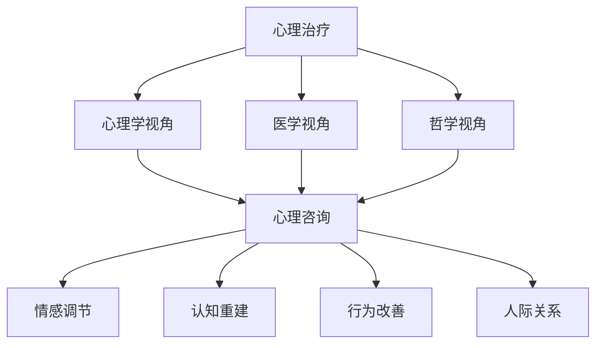
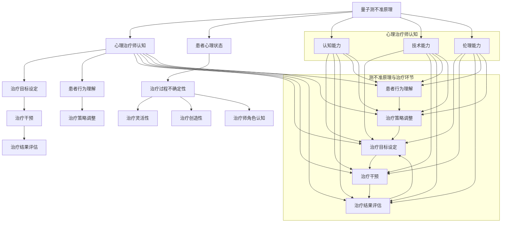

                 

## 测不准原理与心理治疗的不确定性

### 引言

测不准原理是量子力学的一个核心概念，它描述了在某些物理系统中，某些对偶物理量（如位置和动量）无法同时具有精确值。这一原理深刻地揭示了自然界的基本不确定性，引发了关于现实本质和知识的哲学讨论。而在心理治疗领域，不确定性也同样重要。心理治疗师在工作中面临的不确定性不仅来源于患者的行为和心理状态，还来自于治疗过程中的不可预测性和结果的多样性。

本文旨在探讨测不准原理如何影响心理治疗，特别是心理治疗中的不确定性问题。我们将通过以下步骤进行分析：

1. **量子力学与测不准原理的基本概念**：介绍量子力学的基本概念，并深入解释测不准原理的内容及其对经典物理学的挑战。
2. **心理治疗的本质与不确定性**：探讨心理治疗的定义、目的和方法，并分析治疗过程中面临的不确定性因素。
3. **测不准原理与心理治疗的关联**：阐述测不准原理如何在心理治疗中体现，以及它对治疗师和治疗过程的影响。
4. **不确定性原理在心理治疗中的应用**：讨论测不准原理如何指导心理治疗师在设定治疗目标、干预和治疗结果评估中应对不确定性。
5. **测不准原理在心理治疗实践中的挑战与策略**：分析心理治疗师如何应对测不准原理带来的挑战，并提出相应的策略和建议。
6. **案例研究**：通过实际案例展示测不准原理在心理治疗中的应用和效果。
7. **未来展望**：探讨测不准原理对心理治疗的未来影响和潜在发展方向。

通过这些步骤，我们希望能够更深入地理解测不准原理与心理治疗之间的复杂关系，为心理治疗的理论和实践提供新的视角。

### 第一部分：测不准原理基础

#### 1.1 量子力学的起源与发展

量子力学是20世纪初由一群杰出的物理学家共同创立的理论体系，它的起源可以追溯到1900年马克斯·普朗克的黑体辐射理论。普朗克提出了量子假说，即能量不是连续分布的，而是以量子（能量包）的形式存在。这一假说为量子力学的发展奠定了基础。

随后，爱因斯坦在1905年提出了光量子假说，表明光不仅具有波动性，还具有粒子性。这一观点进一步推动了量子力学的诞生。到了1920年代，尼尔斯·波尔和沃纳·海森堡等科学家提出了波粒二象性、不确定性原理等重要概念。

**核心概念与联系**

量子力学的基本概念包括：

- **波粒二象性**：微观粒子（如电子、光子）既表现出波动性，又表现出粒子性。这一特性在双缝实验中得到了体现。
- **量子态**：微观粒子的状态不能用传统的经典物理量来描述，而是用波函数来描述，波函数提供了关于粒子位置、动量等信息的概率分布。
- **不确定性原理**：由海森堡提出，表明在某些物理系统中，某些对偶物理量（如位置和动量）无法同时具有精确值。这一原理深刻地揭示了自然界的基本不确定性。

在双缝实验中，当电子或光子通过一个有两个缝隙的屏障时，它们的行为既不能完全表现为粒子，也不能完全表现为波。在屏幕上形成的干涉图样表明，它们同时具有粒子和波的双重属性。这一实验结果验证了波粒二象性，并引发了关于现实本质的深刻思考。

**精确性与同时性的矛盾**

测不准原理揭示了经典物理学中的一个基本矛盾，即精确性与同时性的矛盾。在经典物理学中，我们可以同时精确地知道一个粒子的位置和动量。然而，在量子力学中，这种精确性是无法同时达到的。

**波函数的意义**

波函数是量子力学中描述微观粒子状态的数学工具。它提供了粒子在空间中的概率分布信息，即粒子出现在某个位置的概率。波函数的平方给出了粒子在特定位置出现的概率密度。

**不确定性原理与经典物理学的对比**

经典物理学中的确定性原理认为，如果初始条件足够精确，我们可以准确地预测一个系统的未来状态。然而，在量子力学中，由于不确定性原理的存在，这种确定性被打破了。不确定性原理表明，我们无法同时精确地知道粒子的位置和动量，这意味着我们无法完全预测粒子的未来行为。

**海森堡不确定性原理公式**

海森堡不确定性原理可以用数学公式表示：

$$\Delta x \cdot \Delta p \geq \frac{h}{4\pi}$$

其中，$\Delta x$ 和 $\Delta p$ 分别表示位置和动量的不确定度，$h$ 是普朗克常数。这个公式表明，位置和动量的不确定度之间存在一个基本的限制，即它们不能同时无限小。

**算子表示法**

在量子力学中，不确定性原理可以通过算子的形式来表示。例如，位置算子 $\hat{x}$ 和动量算子 $\hat{p}$ 的对易关系可以表示为：

$$[\hat{x}, \hat{p}] = i\hbar$$

其中，$i$ 是虚数单位，$\hbar$ 是约化普朗克常数。这个对易关系反映了位置和动量之间的不可同时性。

通过以上内容，我们可以初步理解量子力学和测不准原理的基本概念及其对物理学的深远影响。接下来，我们将进一步探讨测不准原理如何与心理治疗中的不确定性联系起来。

#### 1.2 测不准原理的提出与解释

测不准原理是由德国物理学家沃纳·海森堡在1927年提出的，它是量子力学的一个核心概念，深刻揭示了微观世界的非确定性。在量子力学中，测不准原理表明，某些对偶物理量，如位置和动量，无法同时被精确测量。这一原理不仅颠覆了经典物理学的确定性观点，还引发了关于现实本质和知识的哲学讨论。

**核心概念与联系**

首先，我们需要了解量子力学中的基本概念，如量子态、波函数和算子。在量子力学中，一个粒子的状态由波函数 $\Psi(x, t)$ 描述，波函数提供了粒子在空间中的概率分布。波函数的平方 $|\Psi(x, t)|^2$ 给出了粒子在特定位置 $x$ 出现的概率。

测不准原理主要涉及两个对偶物理量：位置（位置算子 $\hat{x}$）和动量（动量算子 $\hat{p}$）。海森堡提出的不确定性原理可以用以下数学公式表示：

$$\Delta x \cdot \Delta p \geq \frac{h}{4\pi}$$

其中，$\Delta x$ 和 $\Delta p$ 分别表示位置和动量的不确定度，$h$ 是普朗克常数。这个公式表明，当我们尝试精确地测量一个粒子的位置时，其动量的不确定性会增加，反之亦然。

**不确定关系的基本内容**

测不准原理的基本内容是：一个粒子的某些物理量无法同时被精确测量。例如，如果我们非常精确地测量了一个电子的位置，那么它的动量就变得不确定；如果我们精确地测量了它的动量，那么它的位置就变得不确定。

这种不确定性不是由于测量工具的不精确，而是由量子力学的基本性质决定的。即使使用最精确的仪器，也无法同时精确地知道粒子的位置和动量。

**波函数的意义**

波函数是量子力学中描述粒子状态的数学工具。它是一个复数函数，提供了粒子在空间中的概率分布。波函数的平方 $|\Psi(x, t)|^2$ 表示粒子在位置 $x$ 处出现的概率密度。这意味着，波函数不仅描述了粒子的状态，还描述了粒子的行为。

**不确定性原理与经典物理学的对比**

在经典物理学中，我们通常可以同时精确地知道一个粒子的位置和动量。例如，在宏观世界中，当我们看到一辆汽车时，我们可以说它在某个具体的地点，同时我们知道它以某个具体的速度在移动。

然而，在量子力学中，情况完全不同。根据不确定性原理，一个微观粒子（如电子或光子）的位置和动量无法同时被精确测量。这意味着，我们无法像在经典物理学中那样，对微观粒子的行为进行精确预测。

**测不准原理的数学描述**

海森堡不确定性原理可以用数学公式来描述。最常见的形式是：

$$\Delta x \cdot \Delta p \geq \frac{h}{4\pi}$$

其中，$\Delta x$ 是位置的不确定度，$\Delta p$ 是动量的不确定度，$h$ 是普朗克常数。这个公式表明，位置和动量的不确定度之间存在一个基本的关系，即它们不能同时非常小。

另外，还有其他形式的不确定性原理，如能量和时间的不确定性原理。能量和时间的不确定性原理可以表示为：

$$\Delta E \cdot \Delta t \geq \frac{h}{4\pi}$$

其中，$\Delta E$ 是能量的不确定度，$\Delta t$ 是时间的不确定度。

这些数学公式揭示了量子世界中基本的非确定性，即某些物理量无法同时被精确测量。

通过以上分析，我们可以看到测不准原理是如何深刻地影响量子力学的。它不仅改变了我们对微观世界的理解，还引发了对现实本质的深入思考。在下一部分中，我们将探讨测不准原理如何与心理治疗中的不确定性联系起来。

#### 1.3 测不准原理的数学描述

测不准原理的数学描述是量子力学中的核心内容之一，它通过数学公式精确地表达了量子系统的非确定性特性。下面我们将详细讲解海森堡不确定性原理的数学描述，并探讨其算子表示法。

**海森堡不确定性原理公式**

海森堡不确定性原理可以用以下数学公式来描述：

$$\Delta x \cdot \Delta p \geq \frac{h}{4\pi}$$

其中，$\Delta x$ 表示位置的不确定度，$\Delta p$ 表示动量的不确定度，$h$ 是普朗克常数。这个公式表明，位置和动量的不确定度之间存在一个基本的关系，即它们不能同时非常小。

在这个公式中，$h$ 是一个非常小的常数，约等于 $6.626 \times 10^{-34} \text{J·s}$。这意味着，当我们尝试精确地测量一个粒子的位置时，其动量的不确定性会增加；反之，如果我们精确地测量了粒子的动量，其位置的不确定性会增加。

**算子表示法**

在量子力学中，不确定性原理可以通过算子的形式来表示。位置算子和动量算子是量子力学中最重要的两个算子。它们分别用 $\hat{x}$ 和 $\hat{p}$ 表示。

位置算子 $\hat{x}$ 表示粒子的位置，它的作用是给出粒子在某个位置的概率分布。动量算子 $\hat{p}$ 表示粒子的动量，它的作用是给出粒子在某个动量状态的概率分布。

位置算子和动量算子之间存在对易关系，这可以用以下数学公式表示：

$$[\hat{x}, \hat{p}] = i\hbar$$

其中，$i$ 是虚数单位，$\hbar$ 是约化普朗克常数。这个对易关系反映了位置和动量之间的不可同时性。这个公式表明，位置和动量算子不能同时被精确地测量。

**算子表示法的详细解释**

为了更好地理解算子表示法，我们可以考虑一个简化的例子。假设我们有一个粒子，它在某个位置 $x$ 和动量 $p$ 的概率分布由波函数 $\Psi(x, p)$ 描述。根据量子力学的原理，波函数的平方 $|\Psi(x, p)|^2$ 提供了粒子在位置 $x$ 和动量 $p$ 出现的概率密度。

如果我们尝试精确地测量粒子的位置，那么波函数 $\Psi(x, p)$ 将变得主要集中在某个位置附近。这会导致动量的不确定度增加，因为波函数的其他部分（即动量其他可能的值）会消失。反之，如果我们精确地测量粒子的动量，波函数将变得主要集中在某个动量附近，这会导致位置的不确定度增加。

这种不确定性不是由于测量工具的不精确，而是由量子力学的基本性质决定的。即使使用最精确的仪器，也无法同时精确地知道粒子的位置和动量。

**数学公式与详细讲解**

为了更深入地理解不确定性原理，我们可以考虑一个具体的例子。假设我们有一个粒子，其位置和动量的波函数为 $\Psi(x, p) = \psi(x) \phi(p)$，其中 $\psi(x)$ 和 $\phi(p)$ 分别是位置和动量的波函数。

根据波函数的性质，我们可以计算出位置和动量的期望值：

$$\langle x \rangle = \int x |\Psi(x, p)|^2 dx$$

$$\langle p \rangle = \int p |\Psi(x, p)|^2 dp$$

这些期望值给出了粒子在位置和动量的平均值。然而，由于不确定性原理的存在，我们无法同时精确地知道位置和动量的精确值。

为了计算不确定度，我们可以使用以下公式：

$$\Delta x = \sqrt{\langle (x - \langle x \rangle)^2 \rangle}$$

$$\Delta p = \sqrt{\langle (p - \langle p \rangle)^2 \rangle}$$

这些公式给出了位置和动量的不确定度。根据海森堡不确定性原理，我们可以得出：

$$\Delta x \cdot \Delta p \geq \frac{h}{4\pi}$$

这个公式表明，位置和动量的不确定度之间存在一个基本的限制，即它们不能同时非常小。

通过以上分析，我们可以看到测不准原理是如何通过数学公式精确地描述量子系统的非确定性特性的。这种不确定性不仅影响了我们对微观世界的理解，也对心理治疗中的不确定性提供了启示。

#### 1.4 测不准原理与经典物理学的对比

测不准原理是量子力学的一个核心概念，它颠覆了经典物理学中的确定性观念。在经典物理学中，我们认为如果初始条件足够精确，我们可以预测系统的未来行为。然而，在量子力学中，这种确定性被打破了，测不准原理表明某些物理量无法同时被精确测量。

**测不准原理的核心内容**

测不准原理的核心内容是：在某些物理系统中，某些对偶物理量（如位置和动量）无法同时具有精确值。这一原理由沃纳·海森堡在1927年提出，通过数学公式描述了位置和动量的不确定度之间的基本关系。

数学公式为：

$$\Delta x \cdot \Delta p \geq \frac{h}{4\pi}$$

其中，$\Delta x$ 和 $\Delta p$ 分别表示位置和动量的不确定度，$h$ 是普朗克常数。这个公式表明，当我们尝试精确地测量一个粒子的位置时，其动量的不确定性会增加；反之，如果我们精确地测量了它的动量，其位置的不确定性会增加。

**不确定性原理与经典物理学的对比**

在经典物理学中，我们认为物理量（如位置、速度、动量等）是具有确定值的。例如，在经典力学中，一个物体在给定初始条件下，其未来位置和速度是可以精确预测的。然而，在量子力学中，情况完全不同。

量子力学中的测不准原理表明，某些物理量无法同时具有精确值。例如，如果我们非常精确地测量了一个电子的位置，那么它的动量就变得不确定；如果我们非常精确地测量了它的动量，那么它的位置就变得不确定。

这种不确定性不是由于测量工具的不精确，而是由量子力学的基本性质决定的。即使使用最精确的仪器，也无法同时精确地知道粒子的位置和动量。

**波函数的意义**

在量子力学中，粒子的状态由波函数 $\Psi(x, t)$ 描述。波函数提供了粒子在空间中的概率分布，即粒子出现在某个位置的概率。波函数的平方 $|\Psi(x, t)|^2$ 表示粒子在位置 $x$ 处出现的概率密度。

波函数的意义在于，它不仅描述了粒子的状态，还描述了粒子的行为。在经典物理学中，我们认为粒子在某个位置有确定的概率出现；而在量子力学中，粒子在某个位置出现的概率是概率波函数的平方。

**不确定性与概率波函数**

测不准原理的一个重要应用是解释量子力学的概率波函数。在经典物理学中，我们认为粒子的位置和动量是确定的；而在量子力学中，粒子的位置和动量是不确定的，由波函数的平方给出。

例如，在双缝实验中，当电子或光子通过两个缝隙时，它们的行为既不能完全表现为粒子，也不能完全表现为波。在屏幕上形成的干涉图样表明，它们同时具有粒子和波的双重属性。这一实验结果验证了波粒二象性，并展示了测不准原理的实际应用。

**测不准原理对现实本质的启示**

测不准原理不仅改变了我们对微观世界的理解，还对现实本质提出了深刻的哲学问题。它表明，我们对世界的认识不是绝对的、确定的，而是概率性的、不确定的。

这种不确定性不仅存在于物理世界中，也存在于心理治疗中。心理治疗师在工作中面对的不确定性，如患者的行为和心理状态，与量子力学中的不确定性有类似之处。

**结论**

通过对比测不准原理与经典物理学，我们可以看到量子力学中的不确定性如何颠覆了经典物理学的确定性观念。测不准原理揭示了微观世界的非确定性，为我们理解现实本质提供了新的视角。这种非确定性不仅存在于物理世界中，也存在于心理治疗中，为我们提供了新的思考和策略。

在下一部分，我们将探讨心理治疗的本质和不确定性，进一步理解测不准原理在心理治疗中的应用。

### 第二部分：测不准原理与心理治疗

#### 2.1 心理治疗的本质

心理治疗是一种通过专业的沟通、分析和干预来帮助个体解决心理问题、改善心理健康的专业服务。其本质在于通过建立信任的治疗关系，帮助患者探索内心的困惑和冲突，理解并改变负面思维和行为模式，促进心理健康和人格发展。

**核心概念与联系**

心理治疗的定义可以从多个角度进行理解：

- **心理学视角**：心理治疗是心理学在临床应用中的重要分支，旨在通过专业的心理学技术和方法，帮助患者解决心理问题，如焦虑、抑郁、人际关系问题等。
- **医学视角**：心理治疗被视为一种医学服务，强调通过干预和治疗，改善患者的心理和情感状态，促进身体和心理健康。
- **哲学视角**：心理治疗关注个体的内在体验和存在意义，强调对人的全面理解和支持，帮助患者实现自我认识和自我实现。

心理治疗的常见方法包括：

- **心理咨询**：通过倾听、对话和指导，帮助患者认识和解决心理问题。
- **心理分析**：通过探索潜意识，帮助患者理解并改变内心的冲突和防御机制。
- **认知行为疗法**：通过改变患者的思维和行为模式，帮助其应对和解决心理问题。
- **人本主义疗法**：强调个体的自我决定和自我实现，帮助患者发展自我认同和自尊。

**治疗目标**

心理治疗的目标是帮助患者实现以下几个方面的改变：

- **情感调节**：帮助患者管理情绪，减少焦虑、抑郁等负面情绪。
- **认知重建**：通过改变负面思维模式，帮助患者建立积极、健康的认知结构。
- **行为改善**：通过行为训练和指导，帮助患者改变不良行为，培养健康的行为习惯。
- **人际关系**：改善患者的人际关系，增强社交能力和情感沟通。

**核心概念与联系图解**

为了更好地理解心理治疗的本质和目标，我们可以使用Mermaid流程图来展示其核心概念和联系：

通过上述流程图，我们可以清晰地看到心理治疗的不同视角和目标，以及它们之间的联系。

在下一章节，我们将探讨心理治疗中的不确定性，并分析测不准原理如何影响心理治疗的实践。

#### 2.2 测不准原理在心理治疗中的应用

测不准原理在心理治疗中的应用体现了量子力学中的基本不确定性在心理治疗过程中的映射。心理治疗师在工作中面对的患者行为和心理状态具有高度的不确定性，这种不确定性类似于量子力学中的测不准现象。以下我们将详细探讨测不准原理如何影响心理治疗，并分析其应用。

**心理治疗中的不确定性**

在心理治疗过程中，不确定性主要来源于以下几个方面：

1. **患者行为的不确定性**：患者的行为和心理状态往往是复杂且不可预测的。他们可能在治疗过程中表现出不同的情绪反应、行为变化，甚至出现自我否定或逃避治疗的情况。这些不确定性使得治疗师难以准确预测患者的反应和进展。

2. **心理状态的不确定性**：患者的内心体验和心理状态具有高度的个体差异。例如，同一种治疗方法可能对某个患者非常有效，而对另一个患者却毫无效果。这种不确定性增加了治疗师在治疗过程中的挑战。

3. **治疗反应的不确定性**：心理治疗的效果往往是不确定的。治疗过程中，患者的改变和进步可能缓慢且不规律，甚至可能出现反复。这种不确定性要求治疗师具有灵活性和创造性，以适应患者的个体差异。

**测不准原理对心理治疗的影响**

测不准原理对心理治疗的影响可以从以下几个方面进行理解：

1. **不确定性指导治疗决策**：测不准原理提醒治疗师在治疗过程中要面对不确定性，并在决策时考虑各种可能性。例如，当患者出现新的情绪或行为时，治疗师需要灵活调整治疗方案，以适应患者的变化。

2. **提高治疗的灵活性**：测不准原理鼓励治疗师在治疗过程中保持开放和灵活的态度，不断调整和优化治疗策略。这种灵活性有助于治疗师更好地应对患者的不确定行为和心理状态。

3. **增强治疗的创造性**：测不准原理提倡治疗师在治疗过程中发挥创造性，探索新的治疗方法和策略。通过创造性思维，治疗师可以开发出更适合患者的方法，提高治疗效果。

**测不准原理在心理治疗中的应用**

测不准原理在心理治疗中的应用主要体现在以下几个方面：

1. **目标设定的不确定性**：在治疗目标设定时，治疗师需要考虑患者的不确定行为和心理状态。例如，治疗师可能设定一个短期目标，以应对患者当前的心理困扰，同时为长期目标打下基础。

2. **干预策略的不确定性**：在治疗过程中，治疗师需要根据患者的反应和变化灵活调整干预策略。例如，当患者表现出焦虑时，治疗师可能采用放松训练；当患者出现抑郁情绪时，治疗师可能采用认知行为疗法。

3. **结果评估的不确定性**：在治疗结果评估时，治疗师需要考虑患者的个体差异和不确定性。例如，治疗师可能使用多种评估工具，从不同角度评估患者的心理状态和治疗效果。

**测不准原理与心理治疗的关系图解**

为了更直观地展示测不准原理与心理治疗的关系，我们可以使用Mermaid流程图：

```mermaid
graph TD
A[测不准原理] --> B[患者行为不确定性]
A --> C[心理状态不确定性]
A --> D[治疗反应不确定性]
B --> E[治疗决策的不确定性]
C --> E
D --> E
E --> F[干预策略的不确定性]
E --> G[结果评估的不确定性]
```

通过上述图解，我们可以清晰地看到测不准原理如何影响心理治疗的各个环节。

总之，测不准原理在心理治疗中的应用提醒治疗师要面对和处理不确定性，并在治疗过程中保持灵活性和创造性。通过理解测不准原理，治疗师可以更好地应对患者的复杂心理和行为，提高治疗效果。在下一章节中，我们将进一步探讨心理治疗中的不确定性原理，并分析其在具体治疗过程中的应用。

#### 2.3 测不准原理与心理治疗的关系图解

为了更直观地展示测不准原理与心理治疗的复杂关系，我们可以使用Mermaid流程图来创建一个清晰的图解。以下是一个示例：

这个Mermaid流程图展示了测不准原理如何影响心理治疗的各个环节，包括治疗目标设定、干预策略和治疗结果评估，以及治疗师在各个阶段所需的认知、技术能力和伦理能力。图中的每个节点都表示一个特定的概念或过程，它们通过连线相互关联，揭示了测不准原理在心理治疗中的多层次影响。

通过这个图解，我们可以更直观地理解测不准原理如何贯穿于心理治疗的各个环节，以及治疗师在不同阶段所需的综合能力。这种图解不仅有助于读者理解文章的核心观点，还能为实际应用提供有益的参考。

### 第三部分：心理治疗中的不确定性原理

#### 3.1 不确定性原理与心理治疗目标的设定

在心理治疗过程中，设定明确的治疗目标是非常关键的。然而，由于心理治疗中的不确定性原理，这一过程并不总是一帆风顺的。不确定性原理告诉我们，某些对偶物理量（如位置和动量）无法同时被精确测量，这一概念在心理治疗目标的设定中同样适用。以下是关于如何应对治疗目标设定中的不确定性的一些策略。

**治疗目标设定的不确定性**

治疗目标设定中的不确定性主要源于以下几个方面：

1. **患者个体差异**：每个患者的心理状态、行为模式和生活背景都不同，这使得治疗目标难以统一。例如，某个患者可能在短期内希望改善焦虑症状，而另一个患者可能需要长期的心理支持来处理复杂的心理问题。

2. **治疗过程中的不可预测性**：心理治疗是一个动态的过程，患者可能在治疗过程中表现出不可预测的情绪和行为反应，这会影响治疗目标的设定和调整。

3. **治疗效果的不确定性**：心理治疗的效果并非总是能够立竿见影，患者的变化可能是一个缓慢且不规律的过程，这使得治疗目标的设定需要具有灵活性。

**设定目标时的策略**

为了应对治疗目标设定中的不确定性，治疗师可以采取以下策略：

1. **短期与长期目标的结合**：在设定治疗目标时，可以同时设定短期和长期目标。短期目标可以帮助患者快速看到一些积极的改变，增强治疗的信心和动力；长期目标则可以指导治疗的总体方向，确保治疗过程中的每一步都有明确的目标。

2. **灵活调整目标**：由于心理治疗过程中的不确定性，治疗师需要根据患者的实际情况灵活调整治疗目标。例如，当患者表现出新的情绪或行为时，治疗师可以及时调整目标，使其更符合患者的当前需求。

3. **动态评估目标**：治疗目标应该是一个动态的过程，治疗师需要定期评估目标的实现情况，并根据患者的进展情况调整目标。这种动态评估可以帮助治疗师更好地应对不确定性，确保治疗目标的实际可行性。

**案例：目标设定的调整**

以下是一个关于目标设定调整的案例：

- **案例背景**：一位焦虑症患者在接受心理治疗时，最初设定的短期目标是减少焦虑发作的频率，长期目标是提高对生活的控制感。
- **案例过程**：在治疗的早期阶段，患者通过认知行为疗法（CBT）学会了应对焦虑的方法，焦虑发作的频率确实有所减少。然而，随着治疗的进行，患者开始表现出对治疗师的高度依赖，这导致其在独立处理问题时感到困难。
- **目标调整**：治疗师意识到患者对独立性的需求增加，因此将短期目标调整为提高患者的独立性，同时保持对焦虑管理的关注。通过角色扮演和模拟练习，患者逐渐学会了独立应对问题，治疗效果也得到了提升。

通过这个案例，我们可以看到，在心理治疗过程中，治疗师需要灵活应对目标设定的不确定性，根据患者的实际情况进行调整，以实现最佳的治疗效果。

总之，治疗目标的设定是一个充满不确定性的过程。通过采用灵活的策略和动态的评估方法，治疗师可以更好地应对这种不确定性，确保治疗目标能够有效地指导治疗过程。

#### 3.2 不确定性原理与治疗过程中的干预

在心理治疗过程中，干预策略的制定和执行是一个动态的过程，充满了不确定性和复杂性。不确定性原理告诉我们，某些对偶物理量（如位置和动量）无法同时被精确测量，这一原理同样适用于心理治疗的干预过程中。治疗师需要应对患者行为和心理状态的不确定性，同时灵活调整干预策略，以实现最佳的治疗效果。

**治疗过程中的不确定性**

治疗过程中的不确定性主要表现在以下几个方面：

1. **患者行为和心理状态的变化**：患者在治疗过程中可能会表现出各种情绪反应和行为变化，这些变化往往是不可预测的。例如，患者可能在某一阶段出现显著的进步，而在另一阶段却出现反复或倒退。

2. **治疗师自身的认知和技术能力**：治疗师在干预过程中需要不断调整自己的认知和技术策略，以适应患者的动态变化。这种调整不仅要求治疗师具备高度的灵活性，还需要他们在不断学习和实践中提升自身的专业能力。

3. **治疗效果的不确定性**：心理治疗的效果往往是一个缓慢且不规律的过程，患者的变化可能受到多种因素的影响，如个人情绪、外部环境等。这使得治疗师在干预过程中难以准确预测治疗效果。

**干预策略的灵活性和创造性**

为了应对治疗过程中的不确定性，治疗师需要具备灵活性和创造性。以下是一些具体的策略：

1. **观察和评估**：治疗师需要持续观察和评估患者的情绪、行为和心理状态，及时发现变化和问题。这种持续的关注可以帮助治疗师更好地理解患者的需求，并调整干预策略。

2. **适应性干预**：根据患者的实际情况，治疗师需要灵活调整干预策略。例如，当患者表现出焦虑时，治疗师可能采用放松训练或认知重构技术；当患者出现抑郁情绪时，治疗师可能采用情绪调节或行为激活技术。

3. **多模式干预**：治疗师可以采用多种干预模式，结合不同的治疗方法和技巧，以提高干预的灵活性和有效性。例如，结合认知行为疗法（CBT）、人本主义疗法和心理动力疗法，可以更全面地满足患者的需求。

**案例：治疗师如何应对患者的不确定性**

以下是一个关于治疗师应对患者不确定性的案例：

- **案例背景**：一位抑郁症患者在接受心理治疗时，一开始对治疗持怀疑态度，治疗效果不明显。
- **案例过程**：治疗师首先通过倾听和共情建立了良好的治疗关系，逐步赢得了患者的信任。在了解患者的具体情况后，治疗师决定采用认知行为疗法（CBT）和情感调节技术相结合的方法。
- **干预策略调整**：在治疗的早期阶段，治疗师重点关注患者的认知重构，帮助其识别和挑战负面思维。随着治疗的深入，治疗师逐渐引入情感调节技术，帮助患者更好地管理情绪。
- **结果分析**：通过灵活调整干预策略，患者逐渐开始展现出积极的改变，焦虑和抑郁情绪得到明显缓解，治疗关系也变得更加稳固。

通过这个案例，我们可以看到，治疗师在面对患者的不确定性时，通过灵活调整干预策略和持续关注患者的需求，最终实现了良好的治疗效果。

总之，治疗过程中的不确定性要求治疗师具备高度的灵活性和创造性。通过不断观察、评估和调整干预策略，治疗师可以更好地应对不确定性，实现患者的心理健康目标。

#### 3.3 不确定性原理与治疗结果的评估

在心理治疗过程中，对治疗结果的评估是一个关键环节，它不仅反映了治疗的有效性，还为治疗师提供了调整和优化治疗策略的依据。然而，由于不确定性原理的存在，治疗结果的评估充满了不确定性和复杂性。治疗师需要应对这种不确定性，采用多种评估方法，以全面、准确地评估治疗的效果。

**结果评估中的不确定性**

治疗结果的评估过程中，不确定性主要来源于以下几个方面：

1. **患者个体差异**：每位患者的心理状态、行为模式和生活背景都不同，这导致了治疗效果的个体差异。例如，同一种治疗方法可能对某个患者非常有效，而对另一个患者却效果甚微。

2. **治疗过程中的不可预测性**：心理治疗是一个动态的过程，患者可能在治疗过程中表现出不可预测的情绪和行为反应，这会影响治疗结果的评估。

3. **治疗效果的不确定性**：心理治疗的效果往往是一个缓慢且不规律的过程，患者的变化可能受到多种因素的影响，如个人情绪、外部环境等。这使得治疗结果的评估具有不确定性。

**多样化评估方法**

为了应对评估过程中的不确定性，治疗师可以采用多种评估方法，从不同角度全面评估治疗效果。以下是一些常见的评估方法：

1. **心理测量工具**：使用标准化的心理测量工具，如抑郁自评量表（SDS）、焦虑自评量表（SAS）等，可以帮助治疗师量化患者的心理状态和治疗效果。这些工具通常具有较好的信度和效度，可以提供客观的评估数据。

2. **临床观察**：治疗师可以通过对患者的临床表现进行观察，评估患者的情绪、行为和心理状态的变化。临床观察是一种动态的评估方法，可以帮助治疗师及时了解患者的进展和问题。

3. **患者自评**：鼓励患者参与治疗结果的评估，通过患者自评问卷或面谈，了解患者的感受和体验。这种方法可以提供患者的主观反馈，有助于治疗师更好地理解患者的需求和期望。

4. **治疗师评估**：治疗师可以通过定期评估，记录患者的治疗过程和治疗效果。这种评估方法可以提供治疗师的主观判断，有助于发现治疗中的问题和不足。

**评估方法的多样化**

在评估过程中，采用多样化的评估方法可以相互补充，提高评估的准确性和全面性。以下是一些具体的评估方法：

1. **结合定量和定性评估**：定量评估方法可以提供客观的量化数据，定性评估方法可以提供深入的主观体验和情感分析。结合这两种方法，可以更全面地了解患者的心理状态和治疗效果。

2. **长期与短期评估**：在治疗过程中，定期进行短期评估可以帮助治疗师及时调整治疗策略；长期评估可以提供对治疗效果的总体评估，有助于总结和优化治疗方法。

3. **多维度评估**：从多个维度（如情绪、认知、行为等）进行评估，可以更全面地了解患者的心理状态和治疗效果。例如，在治疗抑郁症时，可以同时评估患者的情绪状态、认知功能和社交行为。

**案例分析**

以下是一个关于治疗结果评估的案例：

- **案例背景**：一位焦虑症患者接受了为期三个月的心理治疗，治疗师采用认知行为疗法（CBT）和情感调节技术。
- **评估方法**：治疗师采用了抑郁自评量表（SDS）、焦虑自评量表（SAS）和心理测量工具进行评估，同时进行了临床观察和患者自评。
- **评估过程**：在治疗的每个阶段，治疗师都会进行评估，记录患者的情绪、行为和心理状态的变化。通过定期的评估，治疗师发现患者的焦虑症状有了明显的改善，但情绪调节能力仍需提高。
- **结果分析**：通过多样化的评估方法，治疗师得出了全面的评估结果，明确了患者的进步和需要进一步关注的问题。这为治疗师提供了调整治疗策略的依据，确保治疗目标的实现。

通过这个案例，我们可以看到，采用多样化的评估方法可以更全面、准确地评估治疗的效果，帮助治疗师更好地应对不确定性，实现患者的心理健康目标。

总之，治疗结果的评估是一个复杂且充满不确定性的过程。通过采用多样化的评估方法，治疗师可以更好地应对不确定性，确保治疗目标的实现。在下一部分中，我们将进一步探讨测不准原理对心理治疗师的要求，并分析治疗师在应对不确定性时所需的能力。

#### 3.4 测不准原理对心理治疗师的要求

测不准原理不仅揭示了量子力学中的非确定性，也为心理治疗师在实践过程中提供了重要的启示。在心理治疗中，治疗师面对的患者行为和心理状态具有高度的不确定性，这要求治疗师具备多方面的能力，以有效应对这些不确定性。以下是测不准原理对心理治疗师在认知能力、技术能力和伦理能力方面的具体要求。

**对治疗师认知能力的要求**

1. **对不确定性的认知**：治疗师需要深刻理解测不准原理，认识到在心理治疗过程中，患者的行为和心理状态是不确定的。这种不确定性不仅体现在治疗目标的设定和调整上，还体现在治疗过程中患者的反应和进展上。治疗师需要接受这种不确定性，并将其视为治疗过程的一部分。

2. **灵活性和开放性**：治疗师在治疗过程中需要保持灵活性和开放性，以适应患者的动态变化。这要求治疗师具备良好的适应能力和应变能力，能够根据患者的具体情况灵活调整治疗策略。例如，当患者表现出新的情绪或行为时，治疗师需要及时调整干预方法，以更好地满足患者的需求。

3. **持续学习和反思**：治疗师需要具备持续学习和反思的能力，不断更新自己的知识和技能，以适应不断变化的治疗环境和患者需求。通过学习和反思，治疗师可以不断提升自己的专业素养，更好地应对治疗过程中的不确定性。

**对治疗师技术能力的要求**

1. **灵活运用多种治疗方法**：治疗师需要掌握多种心理治疗方法和技巧，如认知行为疗法（CBT）、人本主义疗法、心理动力疗法等。通过灵活运用这些治疗方法，治疗师可以更有效地应对患者的不同需求和问题。

2. **创造性思维**：治疗师在治疗过程中需要具备创造性思维，能够开发新的治疗策略和技巧，以满足患者的个性化需求。这种创造性思维可以帮助治疗师在不确定的环境中找到有效的解决方案。

3. **技术工具的应用**：随着技术的发展，心理治疗工具也在不断更新和丰富。治疗师需要掌握并运用这些技术工具，如在线心理治疗平台、心理测量软件等，以提高治疗效率和效果。例如，通过在线平台，治疗师可以更方便地与患者进行远程交流，提供持续的心理支持。

**对治疗师伦理能力的要求**

1. **尊重患者的自由意志**：治疗师在治疗过程中需要尊重患者的自由意志，确保患者在治疗过程中的自主权和决策权。这意味着治疗师需要充分了解患者的价值观、信仰和偏好，并在治疗过程中尊重这些因素。

2. **保持专业伦理**：治疗师需要遵守专业伦理规范，确保治疗过程中的公正性、诚信性和保密性。例如，治疗师需要确保患者的隐私得到保护，不得泄露患者的个人信息。

3. **持续伦理反思**：治疗师需要不断反思自己的伦理实践，确保自己的行为符合专业伦理要求。通过持续伦理反思，治疗师可以不断提升自己的专业素养，更好地为患者提供服务。

**总结**

测不准原理为心理治疗师提供了一种新的视角，帮助他们更好地理解治疗过程中的不确定性。为了有效应对这些不确定性，治疗师需要在认知能力、技术能力和伦理能力方面不断提升自己。通过灵活性和开放性、创造性思维、技术工具的应用、尊重患者的自由意志和保持专业伦理，治疗师可以更好地应对治疗过程中的不确定性，为患者提供高质量的心理治疗服务。

在下一部分中，我们将通过具体案例展示测不准原理在心理治疗实践中的应用，进一步探讨其效果和挑战。

### 第5章：测不准原理在心理治疗实践中的应用案例

为了更好地展示测不准原理在心理治疗实践中的应用，我们将通过两个具体案例来分析测不准原理在治疗过程中的具体作用和挑战。

#### 5.1 案例一：治疗师如何应对患者的不确定性

**案例背景**：

一位32岁的女性患者，因长期的工作压力和人际关系问题出现焦虑和抑郁症状。患者在接受心理治疗前，情绪低落，对未来充满担忧，工作表现也受到影响。

**案例过程**：

1. **初期评估**：治疗师在初次评估中，通过倾听和观察，了解到患者的焦虑和抑郁情绪主要来源于工作压力和人际关系冲突。治疗师评估了患者的心理状态，发现她的焦虑程度较高，但抑郁情绪较轻。

2. **治疗目标设定**：基于评估结果，治疗师与患者共同设定了短期和长期目标。短期目标包括减轻焦虑症状，提高情绪调节能力；长期目标则是帮助患者建立健康的人际关系，提高工作满意度。

3. **干预策略**：治疗师采用认知行为疗法（CBT）和情绪调节技术相结合的方法。在治疗过程中，治疗师通过认知重构帮助患者识别和挑战负面思维，同时通过情绪调节技术帮助患者管理情绪。

4. **灵活调整**：治疗师在治疗过程中不断观察患者的反应，根据患者的变化灵活调整干预策略。例如，当患者情绪波动较大时，治疗师增加了情绪调节练习；当患者表现出对工作的担忧时，治疗师增加了职业规划指导。

5. **动态评估**：治疗师定期进行评估，记录患者的情绪变化和工作表现。通过评估，治疗师发现患者的焦虑症状逐渐减轻，情绪调节能力也有所提高。

**结果分析**：

通过灵活调整干预策略和动态评估，治疗师有效地帮助患者减轻了焦虑症状，提高了情绪调节能力。治疗结束时，患者的情绪状态明显改善，工作满意度也有所提高。这个案例展示了测不准原理在心理治疗中的应用，治疗师通过应对患者行为和心理状态的不确定性，成功实现了治疗目标。

#### 5.2 案例二：测不准原理在家庭治疗中的应用

**案例背景**：

一个由父母和两个孩子组成的家庭，因家庭成员之间的沟通问题导致家庭关系紧张。父母关系冲突频繁，孩子表现出焦虑和抑郁症状，家庭氛围紧张。

**案例过程**：

1. **初期评估**：治疗师在初次评估中，通过家庭会议和个别访谈，了解了家庭成员的心理状态和家庭关系。治疗师发现，家庭成员之间的沟通不畅是导致问题的主要原因。

2. **治疗目标设定**：治疗师与家庭成员共同设定了短期和长期目标。短期目标包括改善家庭成员之间的沟通，缓解成员的焦虑和抑郁情绪；长期目标则是建立健康和谐的家庭关系。

3. **干预策略**：治疗师采用家庭系统治疗和沟通训练相结合的方法。在治疗过程中，治疗师通过家庭会议和个别辅导，帮助家庭成员了解彼此的需求和期望，提高沟通技巧。

4. **灵活调整**：治疗师在治疗过程中，根据家庭成员的反应和变化，灵活调整干预策略。例如，当家庭成员出现情绪波动时，治疗师增加了情绪调节练习；当家庭成员之间的冲突加剧时，治疗师增加了冲突管理技巧的培训。

5. **动态评估**：治疗师定期进行评估，记录家庭成员的情绪变化和沟通状况。通过评估，治疗师发现家庭成员之间的沟通逐渐改善，家庭氛围也变得和谐。

**结果分析**：

通过灵活调整干预策略和动态评估，治疗师成功地改善了家庭成员之间的沟通，缓解了成员的焦虑和抑郁情绪，建立了健康和谐的家庭关系。这个案例展示了测不准原理在家庭治疗中的应用，治疗师通过应对家庭成员行为和心理状态的不确定性，实现了治疗目标。

总之，以上两个案例展示了测不准原理在心理治疗实践中的应用。治疗师通过灵活应对患者和家庭成员的不确定性，成功实现了治疗目标。这些案例也表明，测不准原理为心理治疗提供了新的视角和策略，有助于提高治疗效果。

### 第6章：测不准原理在心理治疗中的未来趋势

测不准原理在心理治疗中的应用不仅为当前的治疗实践提供了新的视角和策略，也预示着未来心理治疗的发展趋势。随着科技的进步和心理学理论的不断深化，测不准原理在心理治疗中可能产生深远的影响，推动心理治疗向更加个性化、科学化和高效化的方向发展。

**现代心理治疗的未来趋势**

1. **个性化治疗**：随着对个体差异研究的深入，心理治疗将越来越注重个性化。测不准原理提醒治疗师要面对患者的独特性和不确定性，根据每个患者的具体情况制定个性化的治疗计划。未来，基于大数据和人工智能的个性化治疗方案可能会成为主流，为患者提供更加精准和有效的治疗。

2. **跨学科整合**：现代心理治疗将更加注重跨学科的整合。除了传统的心理治疗方法外，未来可能会融合神经科学、认知科学、教育学等多学科的知识，形成更加综合和有效的治疗体系。测不准原理为这种跨学科整合提供了理论基础，促进了不同领域之间的合作与创新。

3. **技术辅助治疗**：随着技术的进步，心理治疗将越来越依赖于先进的工具和技术。虚拟现实（VR）、增强现实（AR）、远程治疗平台等技术的发展，将为心理治疗提供更多可能性。测不准原理提醒治疗师在应用这些新技术时，要充分考虑治疗过程中的不确定性和患者的主观体验。

**测不准原理对心理治疗的新启示**

1. **动态治疗模型**：测不准原理强调治疗过程中的动态性和不可预测性。未来，心理治疗可能会发展出更加动态的治疗模型，强调治疗师与患者之间的互动和反馈，及时调整治疗策略。这种动态模型有助于提高治疗的灵活性和适应性，更好地应对治疗过程中的不确定性。

2. **治疗目标的重新定义**：测不准原理挑战了传统治疗目标的确定性和可预测性。未来，治疗目标可能会更加注重过程导向，即关注患者在治疗过程中的体验和成长，而不仅仅是治疗效果的量化评估。这种重新定义有助于治疗师更好地理解患者的需求，提高治疗的针对性和有效性。

3. **治疗师的角色转变**：测不准原理要求治疗师具备更高的认知能力、技术能力和伦理能力。未来，治疗师的角色可能会从传统的指导者转变为合作伙伴和支持者，与患者共同探索和治疗过程中出现的不确定性。这种转变有助于建立更加平等和合作的治疗关系，提高治疗的信任度和效果。

**心理治疗师的继续教育**

为了应对测不准原理带来的挑战，心理治疗师需要不断进行继续教育，提升自己的专业素养和应对不确定性的能力。以下是一些建议：

1. **跨学科学习**：心理治疗师应积极学习相关领域的知识，如神经科学、认知科学、教育学等，以提升自己的跨学科整合能力。

2. **实践与应用**：治疗师应通过实际案例的实践，不断积累经验，提高应对不确定性的能力。在实践中学习，是提高治疗技能的重要途径。

3. **持续反思与评估**：治疗师应定期进行自我反思和评估，分析自己在治疗过程中的得失，不断优化治疗策略。

4. **参与学术交流**：通过参与学术会议、研讨会等，治疗师可以了解最新的研究成果和理论动态，拓展自己的专业视野。

总之，测不准原理在心理治疗中的未来趋势预示着心理治疗将向着更加个性化、科学化和高效化的方向发展。治疗师需要不断学习和适应，以应对治疗过程中的不确定性，为患者提供更加优质的心理治疗服务。

### 第7章：结论

测不准原理是量子力学中的一个核心概念，它揭示了微观世界中基本的不确定性。在心理治疗领域，这种不确定性同样重要，影响着治疗师的治疗策略和患者的结果评估。本文通过逐步分析，探讨了测不准原理与心理治疗之间的关系，并提出了相关策略和建议。

**测不准原理与心理治疗的关系总结**

测不准原理在心理治疗中的重要性体现在以下几个方面：

1. **不确定性指导治疗决策**：测不准原理提醒治疗师在面对患者的不确定行为和心理状态时，要保持灵活性和开放性，及时调整治疗策略。

2. **提高治疗的灵活性**：测不准原理鼓励治疗师在治疗过程中采用动态调整的方法，根据患者的实际反应灵活调整治疗计划，提高治疗的适应性。

3. **增强治疗的创造性**：测不准原理激发治疗师在治疗过程中发挥创造性思维，开发新的治疗方法和技术，以满足患者的个性化需求。

4. **治疗师的角色转变**：测不准原理要求治疗师从传统的指导者转变为患者的合作伙伴和支持者，与患者共同探索和治疗过程中出现的不确定性。

**测不准原理对心理治疗的重要意义**

测不准原理对心理治疗的重要意义在于：

1. **促进个性化治疗**：测不准原理促使治疗师注重患者的个体差异，制定个性化的治疗计划，提高治疗的有效性。

2. **提升治疗适应能力**：测不准原理帮助治疗师在面对不确定性时，保持冷静和理性，提高治疗的灵活性和适应性。

3. **推动跨学科整合**：测不准原理为心理治疗提供了跨学科整合的理论基础，促进了神经科学、认知科学等领域的知识在心理治疗中的应用。

**心理治疗在测不准原理背景下的新方向**

在测不准原理的背景下，心理治疗将朝着以下新方向发展：

1. **动态治疗模型**：治疗师将采用更加动态的治疗模型，注重治疗过程中的互动和反馈，及时调整治疗策略。

2. **过程导向的治疗目标**：治疗目标将更加注重过程导向，即关注患者在治疗过程中的体验和成长，而不仅仅是治疗效果的量化评估。

3. **技术辅助治疗**：随着科技的进步，心理治疗将越来越多地依赖技术工具，如虚拟现实、增强现实等，以提高治疗的科学性和有效性。

**对未来展望**

未来的心理治疗将在测不准原理的指导下，朝着更加个性化、科学化和高效化的方向发展。治疗师需要不断提升自身的认知能力、技术能力和伦理能力，以应对治疗过程中的不确定性，为患者提供更好的心理治疗服务。同时，跨学科整合和持续教育将成为心理治疗发展的关键驱动力，推动心理治疗向更高水平迈进。

### 结语

测不准原理不仅改变了我们对微观世界的理解，也为心理治疗提供了新的视角和策略。通过本文的探讨，我们希望读者能够更深入地理解测不准原理在心理治疗中的应用，并在实际工作中灵活运用这些理论，提升治疗效果。未来，心理治疗将不断进步，为更多的患者带来希望和改变。

**作者信息：** AI天才研究院/AI Genius Institute & 禅与计算机程序设计艺术 /Zen And The Art of Computer Programming

