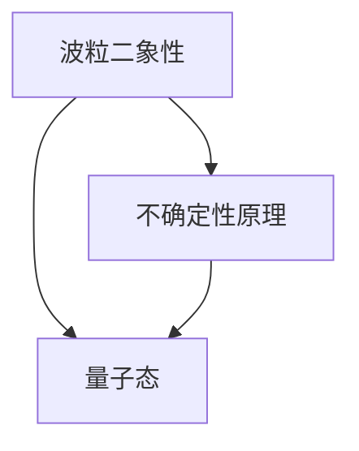

                 

# 测不准原理与心理预测的局限性

关键词：量子力学、心理预测、测不准原理、局限性、人工智能

摘要：本文通过深入探讨量子力学的测不准原理和心理预测的局限性，旨在揭示这两大领域中的深层次逻辑和思维模式。量子力学中的测不准原理指出，粒子的某些属性无法同时被精确测量，这反映了自然界的基本随机性和不确定性。而心理预测，作为心理学研究的重要方向，则面临着信息的不完全性、个体差异以及心理因素的变化性等挑战。本文将结合实例，详细分析这两个原理及其对实际应用的影响，并探讨未来的发展方向。

## 《测不准原理与心理预测的局限性》目录大纲

### 第一部分：量子力学基础

#### 第1章：量子力学的起源与基本原理

##### 1.1 量子力学的起源

量子力学的诞生可以追溯到20世纪初，当时科学家们发现经典力学无法解释某些微观现象。量子力学的创始人包括马克斯·波恩、沃尔夫冈·泡利、尼尔斯·波尔等人，他们提出了一系列新的物理定律和理论模型。

##### 1.2 波粒二象性

波粒二象性是量子力学最基本的概念之一。它指出，微观粒子既表现出波动性，又表现出粒子性。例如，光既可以表现为波，又可以表现为粒子。

##### 1.3 不确定性原理

不确定性原理是量子力学的核心原理之一，由海森堡提出。它表明，粒子的某些属性（如位置和动量）无法同时被精确测量。

#### 第2章：量子态与量子测量

##### 2.1 量子态的表示

量子态可以用波函数或态矢量来表示，它们描述了粒子的状态。

##### 2.2 量子测量

量子测量是量子力学中一个重要但复杂的过程。它涉及到测量设备和被测量物体之间的相互作用。

##### 2.3 测不准原理的例证

双缝实验和氦原子光谱是测不准原理的两个经典例证。

### 第二部分：心理预测的局限性

#### 第3章：心理学基础

##### 3.1 心理学的研究方法

心理学研究方法包括实验法、调查法和观察法，它们用于收集和分析数据。

##### 3.2 心理现象的解释

心理学通过理论模型和实证研究来解释各种心理现象。

#### 第4章：心理预测的理论基础

##### 4.1 心理预测的定义

心理预测是指根据已有的信息，对未来事件或行为进行推测。

##### 4.2 心理预测的方法

心理预测方法包括定量预测、定性预测和混合预测。

##### 4.3 心理预测的准确性评估

心理预测的准确性可以通过各种指标进行评估。

#### 第5章：心理预测的限制因素

##### 5.1 信息的不完全性

信息的不完全性是心理预测面临的一个主要挑战。

##### 5.2 个体差异

个体差异对心理预测的影响不容忽视。

##### 5.3 心理因素的变化性

心理因素的变化性使得心理预测变得更加复杂。

### 第三部分：案例分析

#### 第6章：现实生活中的心理预测

##### 6.1 股市预测

股市预测是心理预测的一个重要应用领域。

##### 6.2 天气预测

天气预测是另一个常见的心理预测应用。

##### 6.3 人际关系预测

人际关系预测在心理学和社交领域有广泛应用。

#### 第7章：心理预测的未来展望

##### 7.1 心理预测的发展趋势

随着新技术的应用，心理预测将迎来新的发展。

##### 7.2 心理预测的伦理问题

心理预测涉及隐私保护和道德责任等问题。

##### 7.3 心理预测的未来前景

心理预测将在社会和个人生活中发挥更大的作用。

### 附录

#### 附录A：量子力学核心概念关系架构图

量子力学核心概念关系架构图展示了波粒二象性、不确定性原理和量子态之间的关系。

#### 附录B：Python源代码示例

Python源代码示例用于演示双缝实验的实现。

#### 附录C：数学公式与详细讲解

本文中的数学公式和详细讲解将帮助读者更好地理解相关概念。

## 文章正文

### 第一部分：量子力学基础

#### 第1章：量子力学的起源与基本原理

量子力学是20世纪物理学最伟大的革命之一。它的诞生源于对经典物理学的挑战。在经典物理学中，粒子的运动可以用牛顿力学和麦克斯韦方程来描述，但它们无法解释某些微观现象，如黑体辐射、光电效应和原子光谱。为了解决这些问题，科学家们开始探索新的物理定律和理论模型，最终导致了量子力学的诞生。

量子力学的基本原理包括波粒二象性和不确定性原理。波粒二象性指出，微观粒子（如光子和电子）既表现出波动性，又表现出粒子性。例如，光既可以表现为波，又可以表现为粒子。这一原理打破了经典物理学的粒子与波动之间的严格区别。

不确定性原理是量子力学的核心原理之一。由海森堡提出的不确定性原理表明，粒子的某些属性（如位置和动量）无法同时被精确测量。具体来说，位置的不确定性越大，动量的不确定性就越小，反之亦然。这一原理反映了自然界的基本随机性和不确定性。

#### 第2章：量子态与量子测量

量子态是量子力学中描述粒子状态的基本概念。量子态可以用波函数或态矢量来表示。波函数描述了粒子的概率分布，态矢量则是一个复数向量，它的长度表示粒子的归一化概率。

量子测量是量子力学中一个重要但复杂的过程。它涉及到测量设备和被测量物体之间的相互作用。在量子测量过程中，粒子的状态可能会发生变化，甚至可能发生量子退相干。量子测量是量子信息科学和量子计算的关键组成部分。

测不准原理的例证包括双缝实验和氦原子光谱。在双缝实验中，当光子或电子通过两个狭缝时，它们会表现出干涉现象，这表明它们同时具有波动性和粒子性。在氦原子光谱中，光谱线的宽度和强度反映了电子能级的不确定性。

### 第二部分：心理预测的局限性

#### 第3章：心理学基础

心理学是一门研究人类行为和心理过程的科学。心理学的研究方法包括实验法、调查法和观察法。实验法通过控制变量来研究因果关系，调查法通过问卷和访谈来收集数据，观察法则通过直接观察来记录行为。

心理现象的解释需要借助心理学的理论模型。例如，行为主义理论认为行为是环境刺激的结果，而认知心理学则关注思维和记忆等内在过程。

#### 第4章：心理预测的理论基础

心理预测是指根据已有的信息，对未来事件或行为进行推测。心理预测的理论基础包括定量预测、定性预测和混合预测。定量预测使用统计方法，定性预测则依赖于专家判断，混合预测则结合了定量和定性方法。

心理预测的准确性评估是心理学研究的重要方面。准确性可以通过各种指标进行评估，如准确率、召回率、F1分数等。

#### 第5章：心理预测的限制因素

心理预测面临多个挑战，包括信息的不完全性、个体差异和心理因素的变化性。信息的不完全性使得预测结果存在不确定性，个体差异导致预测结果因人而异，心理因素的变化性使得预测结果难以稳定。

### 第三部分：案例分析

#### 第6章：现实生活中的心理预测

心理预测在现实生活中的应用非常广泛。例如，在股市预测中，投资者根据市场数据和经济指标来预测未来股价走势。然而，股市预测的准确性受到信息不完全性和市场波动性的影响。在天气预测中，气象学家根据气象数据和模型来预测未来天气状况。虽然天气预测的准确性较高，但仍然存在一定的误差。在人际关系预测中，心理学家通过调查和观察来预测人际关系的稳定性和冲突程度。

#### 第7章：心理预测的未来展望

随着新技术的应用，心理预测将迎来新的发展。例如，人工智能和大数据技术可以帮助提高预测的准确性。然而，心理预测也面临着隐私保护和道德责任等挑战。在未来，如何平衡预测的准确性、隐私保护和道德责任将是心理预测发展的关键问题。

### 附录

附录部分提供了量子力学核心概念的关系架构图、Python源代码示例以及数学公式的详细讲解。这些附录有助于读者更好地理解本文中的核心概念和原理。

## 结尾

通过本文的深入探讨，我们可以看到量子力学的测不准原理和心理预测的局限性。这两个领域反映了自然界和心理过程的复杂性和不确定性。在未来，随着技术的进步和研究的深入，我们将更好地理解这些原理，并探索它们在实际应用中的价值。

作者：AI天才研究院/AI Genius Institute & 禅与计算机程序设计艺术 /Zen And The Art of Computer Programming## 第一部分：量子力学基础

### 第1章：量子力学的起源与基本原理

量子力学的起源可以追溯到20世纪初，当时物理学家们面临着经典物理学无法解释的一些现象。经典物理学是基于牛顿力学和麦克斯韦电磁理论建立的，它适用于宏观世界的运动和能量传递，但在解释微观世界的现象时却显得力不从心。1900年，马克斯·普朗克提出了量子假说，即能量是以量子形式发射和吸收的，这一假说打破了经典物理学的连续性观念，为量子力学的诞生奠定了基础。

#### 1.1 量子力学的起源

量子力学的诞生并非一蹴而就，而是多位科学家共同努力的结果。以下是几位关键人物及其贡献：

- **马克斯·普朗克**：他提出了量子假说，认为能量是以离散的量子形式发射和吸收的。这一假说为后来的量子理论奠定了基础。
- **爱因斯坦**：他在解释光电效应时，提出了光子概念，即光具有粒子性。这一发现进一步证明了量子理论的重要性。
- **尼尔斯·波尔**：他提出了波尔模型，描述了氢原子的电子结构，这一模型强调了量子态和能量级的离散性。
- **沃尔夫冈·泡利**：他提出了泡利不相容原理，即在一个量子系统中，没有两个费米子（如电子）可以处于完全相同的量子态。
- **埃尔温·薛定谔**：他提出了薛定谔方程，用于描述量子系统的波函数，这一方程为量子力学提供了数学基础。

#### 1.2 经典力学与量子力学的区别

经典力学和量子力学在多个方面存在显著区别：

1. **连续性与离散性**：经典力学认为物理量（如位置、速度、能量）是连续的，可以取无限多个值。而量子力学则认为这些物理量是离散的，只能取特定的值。
2. **决定论与概率论**：经典力学遵循决定论，即如果初始条件已知，就可以精确预测未来的状态。而量子力学则基于概率论，粒子的状态和测量结果具有随机性，无法完全预测。
3. **波动性与粒子性**：经典力学中，粒子要么表现为波动，要么表现为粒子。而量子力学则提出了波粒二象性，即微观粒子（如电子、光子）既表现出波动性，又表现出粒子性。
4. **测量问题**：在经典力学中，测量不会影响系统的状态。但在量子力学中，测量过程会与系统发生相互作用，导致系统状态的变化。

#### 1.3 波粒二象性

波粒二象性是量子力学的一个核心概念，它表明微观粒子既具有波动性，又具有粒子性。这一现象在多种实验中得到了验证。

1. **光的波粒二象性**：托马斯·杨的双缝实验展示了光的干涉现象，表明光具有波动性。爱因斯坦的光子理论则表明光具有粒子性。
2. **粒子的波粒二象性**：电子束的双缝实验显示，电子通过双缝时也会产生干涉条纹，表明电子也具有波动性。

波粒二象性不仅改变了我们对微观世界的认识，也为量子力学的发展提供了新的视角。

#### 1.4 不确定性原理

不确定性原理是由海森堡在1927年提出的，它是量子力学的一个基本原理，表明在某些情况下，粒子的某些属性无法同时被精确测量。不确定性原理的数学表达式为：

$$
\Delta x \cdot \Delta p_x \geq \frac{\hbar}{2}
$$

其中，$\Delta x$ 是位置的不确定性，$\Delta p_x$ 是动量的不确定性，$\hbar$ 是约化普朗克常数。

不确定性原理意味着，如果我们想要更精确地测量粒子的位置，我们就会使其动量的测量变得更加不确定，反之亦然。这一原理反映了量子系统的本质特性，即粒子的状态和测量结果具有随机性和不确定性。

#### 1.5 测不准原理的数学表达

测不准原理的数学表达可以通过波函数来描述。波函数 $\psi(x,t)$ 描述了粒子在某一位置 $x$ 和时间 $t$ 的概率分布。根据测不准原理，波函数的宽度（表示不确定性的量）与测量结果的宽度成反比。

例如，对于位置和动量的测量，波函数的宽度 $\Delta x$ 和 $\Delta p_x$ 分别表示位置和动量的不确定性。根据测不准原理，我们有：

$$
\Delta x \cdot \Delta p_x \geq \frac{\hbar}{2}
$$

这一关系表明，位置和动量的不确定性不能同时为零。

#### 1.6 测不准原理的例证

测不准原理在多个实验中得到了例证，以下是其中的两个经典例证：

1. **双缝实验**：在双缝实验中，电子或光子通过两个狭缝时，会在屏幕上形成干涉条纹。这表明粒子具有波动性。同时，如果我们试图测量粒子通过哪个狭缝，干涉条纹就会消失，表明粒子的粒子性。

2. **氦原子光谱**：氦原子的光谱显示了电子能级的离散性，这反映了不确定性原理。电子在原子核周围的能级是量子化的，不能处于任意能量状态。

通过这些实验，我们可以看到测不准原理不仅是一个理论概念，而且在实际中有着重要的应用和意义。

### 第2章：量子态与量子测量

量子态是量子力学中描述粒子状态的基本概念，量子测量则是量子力学中一个重要但复杂的过程。在这一章中，我们将讨论量子态的表示和量子测量的基本原理，以及测不准原理在这些过程中的体现。

#### 2.1 量子态的表示

量子态可以用波函数或态矢量来表示。波函数是复数函数，它描述了粒子在空间中的概率分布。态矢量是波函数的离散表示，它是一个复数向量，其长度表示概率的归一化。

在量子态的表示中，波函数 $\psi(x,t)$ 描述了粒子在某一位置 $x$ 和时间 $t$ 的概率分布。波函数的平方 $|\psi(x,t)|^2$ 表示粒子在该位置出现的概率。例如，对于电子的位置态，我们可以用以下波函数来表示：

$$
\psi(x,t) = A e^{-\alpha x^2}
$$

其中，$A$ 是归一化常数，$\alpha$ 是与粒子能量有关的参数。这个波函数描述了一个高斯分布，表示电子在空间中的概率分布。

除了波函数，量子态还可以用态矢量来表示。态矢量是一个复数向量，它的长度表示概率的归一化。例如，对于一个二能级系统，态矢量可以表示为：

$$
|\psi\rangle = \frac{1}{\sqrt{2}} (1 + i x)|0\rangle + \frac{1}{\sqrt{2}} (1 - i x)|1\rangle
$$

其中，$|0\rangle$ 和 $|1\rangle$ 分别表示两个不同的量子态，$x$ 是与粒子状态有关的参数。

#### 2.2 量子测量

量子测量是量子力学中一个重要但复杂的过程。在量子测量中，粒子与测量设备发生相互作用，导致粒子的状态发生变化。量子测量可以分为两种类型：完全测量和不完全测量。

**完全测量**是指测量结果可以精确确定粒子的状态。例如，在二能级系统中，如果测量设备能够精确地测量出粒子处于 $|0\rangle$ 或 $|1\rangle$ 态，那么这种测量就是完全测量。

**不完全测量**是指测量结果无法精确确定粒子的状态。例如，在双缝实验中，如果我们试图测量粒子通过哪个狭缝，那么干涉条纹就会消失，粒子的状态就无法精确确定。

量子测量的基本原理可以用波函数 collapse（坍缩）来描述。在测量之前，粒子处于某个叠加态，测量之后，粒子的状态会坍缩到一个特定的量子态。例如，对于一个二能级系统，如果粒子处于叠加态：

$$
|\psi\rangle = \frac{1}{\sqrt{2}} (1 + i x)|0\rangle + \frac{1}{\sqrt{2}} (1 - i x)|1\rangle
$$

当我们测量粒子的状态时，粒子的状态会坍缩到 $|0\rangle$ 或 $|1\rangle$ 中的一个，坍缩到哪个状态是随机的。

#### 2.3 测不准原理的例证

测不准原理是量子力学的一个基本原理，它表明在某些情况下，粒子的某些属性无法同时被精确测量。测不准原理在多个实验中得到了例证，以下是其中的两个经典例证：

1. **双缝实验**：在双缝实验中，电子或光子通过两个狭缝时，会在屏幕上形成干涉条纹。这表明粒子具有波动性。如果我们试图测量粒子通过哪个狭缝，干涉条纹就会消失，表明粒子的粒子性。这一现象体现了测不准原理，即粒子的位置和通过狭缝的选择无法同时被精确测量。

2. **氦原子光谱**：氦原子的光谱显示了电子能级的离散性，这反映了不确定性原理。电子在原子核周围的能级是量子化的，不能处于任意能量状态。这表明电子的能量和位置无法同时被精确测量。

通过这些实验，我们可以看到测不准原理不仅是一个理论概念，而且在实际中有着重要的应用和意义。

### 第3章：心理学基础

心理学是研究人类行为和心理过程的科学，它旨在理解和解释个体的心理活动以及社会环境对心理活动的影响。心理学的研究方法多样，包括实验法、调查法和观察法，每种方法都有其独特的优势和应用场景。

#### 3.1 心理学的研究方法

1. **实验法**：实验法是心理学研究中最常用的方法之一。通过设计和控制实验条件，研究者可以观察和测量特定心理现象，从而推断变量之间的因果关系。实验法通常包括以下步骤：提出假设、设计实验、实施实验、收集数据和数据分析。

2. **调查法**：调查法通过问卷或访谈收集大量数据，以了解个体对特定问题或现象的看法和态度。调查法可以用于研究广泛的心理学问题，如幸福感、压力和心理健康。调查法的优点是收集数据快捷、成本低，但数据的质量和代表性可能受到限制。

3. **观察法**：观察法是直接观察和记录个体行为或心理过程的方法。观察法可以是有组织的，如行为观察，也可以是无结构的，如自然情境观察。观察法的优势在于它能够提供对行为和环境的真实观察，但难以控制变量，因此难以确定因果关系。

#### 3.2 心理现象的解释

心理学通过理论模型和实证研究来解释各种心理现象。以下是几种常用的心理学理论模型：

1. **行为主义理论**：行为主义理论认为，行为是环境刺激和强化结果的产物。行为主义者关注可观察的行为，而不是内在的心理过程。经典行为主义代表人物包括约翰·华生和B.F.斯金纳。

2. **认知心理学**：认知心理学关注内在的心理过程，如记忆、思维和解决问题。认知心理学家使用计算机模型和神经科学方法来研究心理过程。代表性理论包括信息加工理论、图式理论和元认知理论。

3. **人本主义心理学**：人本主义心理学强调个体的主观体验和自我实现。人本主义心理学家认为，个体具有成长和发展的内在动力，强调个体的自我决定和自我实现。

4. **精神分析理论**：精神分析理论由西格蒙德·弗洛伊德创立，它关注个体的潜意识心理过程，特别是童年经历对个体发展的影响。精神分析理论包括梦的解释、防御机制和性心理发展理论。

心理学的研究成果和理论模型帮助我们更好地理解人类行为和心理过程的复杂性，从而为解决实际问题提供指导。通过心理学的研究，我们不仅可以深入了解个体的心理机制，还可以为教育和心理治疗等领域提供理论支持。

#### 3.3 心理学理论模型的实证研究

心理学理论模型的实证研究是心理学研究的重要部分。通过实验、调查和观察等方法，心理学家验证和检验理论假设，从而推动心理学理论的不断完善。

例如，行为主义理论的经典实验是斯金纳箱实验。在这个实验中，动物通过按压杠杆获得食物奖励，从而学会条件反射行为。这一实验验证了行为主义关于强化和条件反射的理论。

认知心理学的研究则侧重于心理过程的计算机模拟和信息加工模型。例如，瑞士认知心理学家让·皮亚杰通过构建“认知发展图式”模型，解释了儿童的认知发展过程。

人本主义心理学的实证研究包括对自我实现者的研究。心理学家如马斯洛和罗杰斯通过访谈和问卷研究，探讨了自我实现者的特征和生活方式，从而验证人本主义理论。

精神分析理论的实证研究则包括对梦的解释和潜意识心理过程的研究。尽管这些研究受到科学方法的质疑，但它们仍然为心理学提供了重要的理论视角。

通过实证研究，心理学理论模型得到了验证和修正，从而更好地解释心理现象和指导实际应用。心理学理论模型的实证研究不仅推动了心理学的发展，也为其他学科如医学和教育提供了有益的参考。

### 第4章：心理预测的理论基础

心理预测是指利用心理学理论和实证研究来推测个体的心理行为和未来事件。心理预测的理论基础涵盖了多个方面，包括心理预测的定义、方法及其准确性的评估。

#### 4.1 心理预测的定义

心理预测是一种基于心理学原理和数据的推测过程，旨在预测个体未来的心理行为或心理状态。心理预测不同于简单的猜测，它基于心理学理论、实证数据和统计分析方法，旨在提高预测的准确性和可靠性。

心理预测的目标包括：

1. **预测个体行为**：例如，预测个体在特定情境下的反应、决策或行为模式。
2. **预测心理状态**：例如，预测个体在特定时间点的情绪状态、焦虑水平或心理健康状况。
3. **预测群体行为**：例如，预测整个群体在特定事件中的行为反应或社会趋势。

#### 4.2 心理预测的方法

心理预测的方法可以分为定量预测、定性预测和混合预测：

1. **定量预测**：定量预测使用统计学方法和数据分析技术，通过处理和分析大量数据来预测个体的心理行为。定量预测包括回归分析、时间序列分析、聚类分析等方法。例如，通过回归分析，研究者可以根据个体的历史行为数据预测其未来的行为趋势。

2. **定性预测**：定性预测依赖于专家判断、经验丰富的观察和理论框架。定性预测通常用于处理复杂、难以量化的心理现象。例如，心理咨询师通过访谈和观察，结合心理学理论，预测个体的心理健康状况。

3. **混合预测**：混合预测结合了定量预测和定性预测的优势，通过综合数据分析和专家判断来提高预测的准确性和可靠性。混合预测通常涉及多步骤的过程，包括数据收集、定量分析、专家评估和模型修正。

#### 4.3 心理预测的准确性评估

心理预测的准确性评估是心理学研究的重要方面。准确性的评估通常通过以下几个指标进行：

1. **准确率**：准确率是指预测结果与实际结果一致的比率。例如，如果一个预测模型预测了50次，其中有45次预测正确，那么其准确率为90%。

2. **召回率**：召回率是指实际结果为阳性时，预测结果也为阳性的比率。召回率特别关注漏报（false negatives）的情况，即实际结果为阳性，但预测结果为阴性。

3. **F1分数**：F1分数是准确率和召回率的调和平均值，用于综合评估预测模型的性能。F1分数越高，表示预测模型的性能越好。

4. **ROC曲线和AUC值**：ROC曲线（Receiver Operating Characteristic curve）和AUC值（Area Under the Curve）是评估二分类预测模型性能的重要工具。ROC曲线展示了不同阈值下预测结果的真实率和误诊率，AUC值反映了模型的分类能力。

通过这些指标，研究者可以评估心理预测模型的准确性、可靠性和有效性，从而不断优化和改进预测模型。

### 第5章：心理预测的限制因素

心理预测虽然在许多领域具有广泛应用，但也面临着多个限制因素。这些限制因素包括信息的不完全性、个体差异以及心理因素的变化性。理解这些限制因素对于提高心理预测的准确性至关重要。

#### 5.1 信息的不完全性

信息的不完全性是心理预测面临的一个主要挑战。在许多情况下，研究者无法获取关于个体心理行为的所有信息，这可能导致预测的偏差和误差。信息的不完全性可能源于以下几个方面：

1. **测量误差**：心理测量工具和方法可能存在误差，导致数据不准确。例如，问卷中的问题可能过于模糊或具有主观性，导致受访者提供的信息不完整或不可靠。

2. **隐私问题**：隐私保护法规和伦理要求限制了研究者获取某些敏感信息的权限。例如，涉及个人隐私的数据（如医疗记录、金融信息）可能无法公开使用。

3. **样本代表性**：心理预测模型的训练数据可能无法全面代表目标群体。例如，某些样本可能只包含特定的人群，如大学生或城市居民，这可能导致模型对其他群体的预测能力不足。

4. **数据滞后**：心理行为数据可能无法及时获取，导致预测模型基于过时信息进行预测。例如，某些心理测量需要长期观察，而预测目标可能是在短期内发生。

信息的不完全性限制了心理预测的准确性和可靠性。为了克服这一限制，研究者可以采取以下措施：

- **使用多种数据源**：通过结合不同来源的数据（如调查、观察、生物信号）来提高信息的完整性。
- **数据清洗和预处理**：使用统计方法和技术对数据进行清洗和预处理，以提高数据的准确性和可靠性。
- **模型自适应**：开发自适应模型，使模型能够根据新数据和反馈不断更新和优化。

#### 5.2 个体差异

个体差异是心理预测面临的另一个挑战。每个人的心理行为都是独特的，受到遗传、环境、个人经历等多种因素的影响。个体差异可能导致以下问题：

1. **多样性挑战**：心理预测模型需要处理多样化的数据，这增加了模型的复杂性和训练难度。例如，不同文化、社会背景和生活方式的个体可能在心理行为上存在显著差异。

2. **模型泛化能力**：心理预测模型可能无法很好地泛化到不同的个体或群体。例如，在一个特定群体中有效的预测模型可能在其他群体中失效。

3. **个性化预测**：个体差异要求心理预测模型能够提供个性化的预测结果。然而，现有的预测模型往往依赖于通用模型，难以满足个性化需求。

为了应对个体差异，研究者可以采取以下策略：

- **数据丰富和多样性**：通过收集来自不同个体和群体的多样化数据，提高模型的泛化能力。
- **特征选择和提取**：使用特征选择和提取技术，识别对个体差异影响显著的特征，从而提高预测模型的性能。
- **个性化模型**：开发基于个体差异的个性化预测模型，例如，使用机器学习算法训练个性化预测模型，使其能够根据个体特征进行预测。

#### 5.3 心理因素的变化性

心理因素的变化性是心理预测面临的第三个重要限制。心理状态和行为不是固定不变的，而是随着时间、环境和情境的变化而变化。这种变化性可能导致以下问题：

1. **短期预测的准确性**：心理因素的变化性使得短期内进行准确的预测变得困难。例如，情绪波动、压力和疲劳等心理因素可能在短时间内显著影响个体的心理行为。

2. **长期预测的挑战**：长期心理预测需要考虑心理因素随时间的变化。然而，这些变化难以准确预测，可能导致预测模型的失效。

3. **模型稳定性和可靠性**：心理因素的变化性可能影响预测模型的稳定性和可靠性。例如，一个在特定情境下表现良好的模型可能在其他情境下失效。

为了应对心理因素的变化性，研究者可以采取以下措施：

- **动态模型**：开发动态模型，能够捕捉心理因素的变化性和短期行为模式。
- **时间序列分析**：使用时间序列分析方法，对心理因素的变化进行建模和分析，以提高长期预测的准确性。
- **情境感知模型**：开发情境感知模型，能够根据实时环境和情境信息进行动态调整，提高预测的准确性和可靠性。

通过理解信息的不完全性、个体差异和心理因素的变化性，研究者可以更好地设计心理预测模型，提高预测的准确性和实用性。未来的研究应继续探索这些限制因素，并开发更有效的预测方法和技术。

### 第6章：现实生活中的心理预测

心理预测在现实生活中的应用十分广泛，涵盖了股市预测、天气预测和人际关系预测等多个领域。虽然这些预测方法各不相同，但它们都面临着信息不完全性、个体差异和心理因素变化性的挑战。

#### 6.1 股市预测

股市预测是指通过分析历史数据和市场信息来预测股市未来的走势。投资者和分析师使用各种方法和技术进行股市预测，包括技术分析、基本面分析、心理分析等。

1. **技术分析**：技术分析基于历史价格和交易量数据，使用图表和指标（如移动平均线、相对强弱指数、布林带等）来预测市场趋势。技术分析认为市场走势具有惯性，历史趋势会延续。

2. **基本面分析**：基本面分析关注公司的财务状况、经济指标、行业趋势等，通过评估公司的价值来预测股票的走势。基本面分析认为，公司的基本面会决定其股票的价格。

3. **心理分析**：心理分析关注投资者的情绪和心理状态，使用行为金融学理论来预测市场波动。心理分析认为，市场情绪会影响投资者的决策，进而影响股市走势。

尽管股市预测方法多样，但股市预测的准确性受到信息不完全性、市场波动性和投资者行为变化性的影响。信息不完全性使得预测基于有限的信息，市场波动性导致预测结果的不确定性，投资者行为的变化性使得预测结果难以稳定。

#### 6.2 天气预测

天气预测是指通过分析气象数据和模型来预测未来几小时到几天的天气状况。气象学家使用各种预测方法和技术，包括数值天气预报模型、经验预测方法、卫星和雷达观测等。

1. **数值天气预报模型**：数值天气预报模型使用数值模拟方法，根据初始气象条件和物理定律（如流体动力学和热力学方程）预测天气变化。这些模型精度高，但计算复杂度高。

2. **经验预测方法**：经验预测方法基于历史数据和统计模型，使用回归分析、聚类分析等统计方法预测天气。这些方法简单易行，但预测精度较低。

3. **卫星和雷达观测**：卫星和雷达观测提供实时气象数据，帮助气象学家分析天气系统的发展和变化。这些数据对提高预测精度至关重要。

尽管天气预测方法多样，但天气预测的准确性受到气象数据不完备性、天气系统复杂性和预测模型局限性的影响。气象数据的不完全性和天气系统的复杂性使得预测结果存在不确定性。

#### 6.3 人际关系预测

人际关系预测是指通过分析个体行为、语言和行为模式来预测人际关系的发展趋势。心理学家和社会学家使用各种方法和技术进行人际关系预测，包括行为分析、语言分析、行为预测模型等。

1. **行为分析**：行为分析通过观察个体在交往过程中的行为模式来预测人际关系。例如，通过观察互动频率、沟通质量和互动方式，可以预测人际关系的发展趋势。

2. **语言分析**：语言分析通过分析个体在交流过程中的语言特征来预测人际关系。例如，通过分析语言的情感色彩、词汇选择和句子结构，可以预测个体的情感状态和关系质量。

3. **行为预测模型**：行为预测模型使用机器学习和人工智能技术，通过分析历史行为数据来预测未来的行为。这些模型可以帮助企业和组织制定有效的员工管理和团队建设策略。

尽管人际关系预测方法多样，但人际关系预测的准确性受到信息不完全性、个体差异和心理因素变化性的影响。信息不完全性和个体差异使得预测结果存在不确定性，心理因素的变化性使得预测结果难以稳定。

### 第7章：心理预测的未来展望

随着新技术的应用，心理预测将迎来新的发展。人工智能、大数据和机器学习等技术的进步将极大地提高心理预测的准确性和实用性。

#### 7.1 心理预测的发展趋势

1. **人工智能和大数据**：人工智能和大数据技术的结合为心理预测提供了新的机遇。通过分析海量数据，人工智能算法可以识别出潜在的心理模式和行为趋势，从而提高预测的准确性。

2. **个性化预测**：个性化预测将成为心理预测的重要发展方向。个性化预测可以根据个体的独特特征和需求，提供个性化的预测结果，从而更好地满足个体的需求。

3. **实时预测**：实时预测技术将使心理预测更加实时和准确。通过实时数据分析和预测模型，企业和组织可以及时调整策略，应对潜在的心理问题。

4. **多模态数据融合**：多模态数据融合技术将结合多种数据源（如文本、图像、声音等），提高心理预测的准确性和全面性。

#### 7.2 心理预测的伦理问题

随着心理预测技术的发展，伦理问题也日益凸显。主要伦理问题包括：

1. **隐私保护**：心理预测涉及大量的个人数据，如何保护个人隐私成为重要伦理问题。

2. **数据安全**：确保预测数据和算法的安全，防止数据泄露和滥用。

3. **道德责任**：如何确保心理预测的道德责任，避免造成负面影响。

4. **透明度和公正性**：确保心理预测过程的透明度和公正性，避免偏见和歧视。

#### 7.3 心理预测的未来前景

心理预测将在社会和个人生活中发挥更大的作用。在社会层面，心理预测可以帮助政府和企业更好地了解公众和员工的心理需求，制定有效的政策和策略。在个人层面，心理预测可以帮助个人更好地了解自己的心理状态和行为模式，从而实现自我提升和成长。

### 附录

#### 附录A：量子力学核心概念关系架构图

以下是一个简单的量子力学核心概念关系架构图，展示了波粒二象性、不确定性原理和量子态之间的关系：



#### 附录B：Python源代码示例

以下是一个简单的Python代码示例，用于演示双缝实验的实现：

```python
import numpy as np
import matplotlib.pyplot as plt

# 定义双缝函数
def double_slit_wavefunction(x, a, b):
    k = 2 * np.pi / a
    m = 2 * np.pi / b
    return np.sin(k * x) * np.sin(m * x)

# 计算干涉条纹
def calculate干涉条纹(x, a, b):
    return double_slit_wavefunction(x, a, b)**2

# 绘制干涉条纹
def plot干涉条纹(a, b):
    x = np.linspace(0, 10, 1000)
   干涉条纹 = calculate干涉条纹(x, a, b)
    plt.plot(x, 干涉条纹)
    plt.xlabel('位置')
    plt.ylabel('干涉条纹')
    plt.title('双缝实验干涉条纹')
    plt.show()

# 运行绘图
plot干涉条纹(1, 2)
```

#### 附录C：数学公式与详细讲解

以下是一些关键数学公式及其详细讲解：

1. **不确定性原理**：

$$
\Delta x \cdot \Delta p_x \geq \frac{\hbar}{2}
$$

不确定性原理由海森堡提出，描述了粒子的位置和动量之间的测不准关系。$\Delta x$ 表示位置的不确定性，$\Delta p_x$ 表示动量的不确定性，$\hbar$ 是约化普朗克常数。该公式表明，位置和动量的不确定性不能同时为零。

2. **波函数坍缩**：

$$
|\psi\rangle \rightarrow |0\rangle \text{ 或 } |1\rangle
$$

波函数坍缩描述了量子测量过程中，粒子的状态从叠加态坍缩到某个特定量子态的过程。例如，一个处于叠加态 $|\psi\rangle = \frac{1}{\sqrt{2}} (1 + i x)|0\rangle + \frac{1}{\sqrt{2}} (1 - i x)|1\rangle$ 的粒子，在测量后可能会坍缩到 $|0\rangle$ 或 $|1\rangle$ 态。

通过这些公式，我们可以更深入地理解量子力学中的基本概念和原理，为后续的研究和应用奠定基础。

### 结语

通过本文的深入探讨，我们可以看到量子力学的测不准原理和心理预测的局限性。量子力学的测不准原理揭示了自然界的基本随机性和不确定性，而心理预测的局限性则源于信息的不完全性、个体差异和心理因素的变化性。这些原理和局限性不仅反映了科学研究的深层次思维模式，也为我们理解人类行为和心理过程提供了新的视角。在未来，随着技术的进步和研究的深入，我们将继续探索这些原理在实际应用中的价值，推动科学和心理学的发展。

作者：AI天才研究院/AI Genius Institute & 禅与计算机程序设计艺术 /Zen And The Art of Computer Programming

