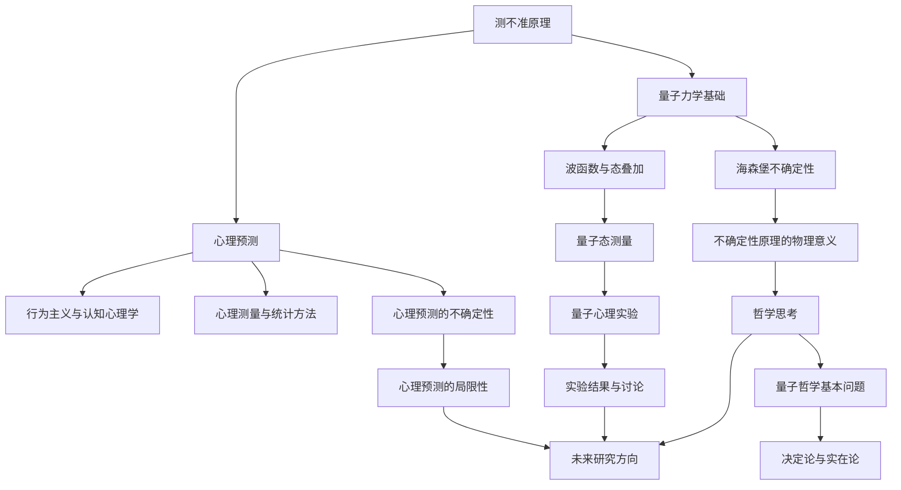
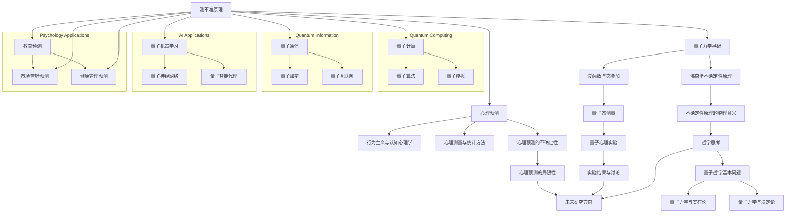

                 

### 引言

**1.1 测不准原理概述**

测不准原理（Uncertainty Principle）是量子力学的一个基本原理，由德国物理学家维尔纳·海森堡（Werner Heisenberg）在1927年首次提出。测不准原理揭示了在微观世界中，某些物理量无法同时被精确测量，例如位置和动量。这一原理不仅改变了我们对物理世界的理解，也深刻影响了哲学、心理学等多个领域。

测不准原理的历史背景可以追溯到20世纪初。当时，经典物理学已经取得了一系列卓越成就，但面对微观世界，经典物理学的解释遇到了困难。为了解释黑体辐射、光电效应等现象，物理学家们提出了量子假说。普朗克（Max Planck）提出了能量量子化的概念，爱因斯坦（Albert Einstein）解释了光电效应，玻尔（Niels Bohr）则提出了量子轨道模型。然而，这些理论在解释原子和分子的行为时仍存在缺陷。

海森堡在研究原子核结构时，意识到无法同时精确测量粒子的位置和动量。他提出，粒子的位置和动量之间的不确定关系可以用一个数学公式表示，即：

$$ \Delta x \cdot \Delta p \geq \frac{\hbar}{2} $$

其中，$\Delta x$ 表示位置的不确定性，$\Delta p$ 表示动量的不确定性，$\hbar$ 是约化普朗克常数。这一公式表明，当位置的不确定性减小时，动量的不确定性必然增大，反之亦然。这一原理不仅在量子力学中具有重要意义，也对整个物理学的发展产生了深远影响。

测不准原理的基本概念包括两个主要方面：首先是不可同时精确测量的物理量，例如位置和动量；其次是测量过程本身会影响被测量的物理量。这意味着，我们对微观世界的观察不再是客观的，而是受到观察者与被观察系统之间相互作用的影响。

**1.2 测不准原理的重要性**

测不准原理的重要性在于它揭示了微观世界的非确定性特征。与经典物理学中确定性和可预测性不同，量子力学中的物理量存在固有的不确定性。这一原理不仅挑战了经典物理学的观念，也促使物理学家重新思考自然界的本质。

此外，测不准原理在量子计算、量子通信、量子加密等现代科学技术领域具有广泛的应用。它为量子技术的发展提供了理论基础，也为我们在理解和利用量子现象方面提供了新的视角。

总之，测不准原理是量子力学的一个重要原理，它改变了我们对物理世界的认识，对哲学、心理学等领域产生了深远影响。在接下来的章节中，我们将进一步探讨测不准原理的数学基础、量子力学中的应用，以及与心理预测的关系。

### 测不准原理的数学基础

为了深入理解测不准原理，我们需要从数学角度来探讨其基础。以下是测不准原理的两个核心数学概念：波函数和态叠加原理，以及海森堡不确定性原理。

**2.1 波函数与态叠加原理**

波函数（Wave Function）是量子力学中描述粒子状态的一个数学函数，通常用希腊字母ψ（psi）表示。波函数提供了粒子在空间中概率分布的信息，它不仅包含了粒子的位置信息，还包含了粒子的动量、能量等物理量。波函数的模平方（$\psi^* \psi$）表示粒子在某一位置出现的概率密度。

波函数具有一些基本性质：

1. **归一化条件**：波函数必须满足归一化条件，即整个空间上的积分等于1。这表示粒子必须存在于某个位置上。

$$ \int_{-\infty}^{\infty} |\psi(x)|^2 dx = 1 $$

2. **连续性和可微性**：波函数在空间上通常是连续和可微的，这反映了量子系统在空间上的平滑性质。

态叠加原理（Principle of Superposition）是量子力学的另一个基本原理。根据态叠加原理，一个量子系统可以处于多个状态的线性组合。具体来说，如果$\psi_1$和$\psi_2$是两个可能的量子态，那么它们的叠加态可以表示为：

$$ \psi = c_1 \psi_1 + c_2 \psi_2 $$

其中，$c_1$和$c_2$是复数系数，它们决定了叠加态中各个成分的相对强度。态叠加原理使得量子系统可以表现出复杂的行为，例如干涉和量子隧穿。

**态叠加原理与量子叠加态**

量子叠加态（Quantum Superposition）是态叠加原理的一个直接结果。在量子叠加态中，一个粒子可以同时处于多个状态。例如，一个电子可以同时处于自旋向上和自旋向下的状态。这种叠加态只有在进行测量时才会“坍缩”为一个确定的状态。

波函数的叠加可以形象地用薛定谔方程（Schrödinger Equation）来描述：

$$ i\hbar \frac{\partial \psi}{\partial t} = \hat{H} \psi $$

其中，$i$是虚数单位，$\hbar$是约化普朗克常数，$\hat{H}$是哈密顿算符，表示系统的总能量。薛定谔方程描述了波函数随时间的演化。

**2.2 海森堡不确定性原理**

海森堡不确定性原理（Heisenberg Uncertainty Principle）是测不准原理的核心内容。该原理由维尔纳·海森堡提出，其数学表述为：

$$ \Delta x \cdot \Delta p \geq \frac{\hbar}{2} $$

其中，$\Delta x$是位置的不确定性，$\Delta p$是动量的不确定性，$\hbar$是约化普朗克常数。

海森堡不确定性原理的数学表述可以从量子态的数学形式中得到解释。假设我们有一个量子态$|\psi\rangle$，它的位置和动量的期望值分别为$\langle x \rangle$和$\langle p \rangle$。则位置和动量的不确定性分别为：

$$ \Delta x = \sqrt{\langle (x - \langle x \rangle)^2 \rangle} $$
$$ \Delta p = \sqrt{\langle (p - \langle p \rangle)^2 \rangle} $$

根据海森堡不确定性原理，这两个不确定性的乘积有一个最小值，即：

$$ \Delta x \cdot \Delta p \geq \frac{\hbar}{2} $$

这意味着，如果我们精确地知道一个粒子的位置，它的动量将非常不确定，反之亦然。这一原理揭示了微观世界中的基本非确定性，挑战了我们对确定性的传统理解。

**海森堡不确定性原理的物理意义**

海森堡不确定性原理的物理意义在于，它反映了量子系统在微观尺度上的内在限制。在宏观世界中，我们可以同时精确地测量位置和动量，但在微观世界中，这种同时性是不可能的。这是因为测量过程本身会干扰被测量的物理量，使得我们无法同时获得精确的测量结果。

这一原理不仅适用于位置和动量，还可以推广到其他对易不守恒的物理量，例如能量和时间。这意味着，在微观世界中，某些物理量无法同时被精确测量，这一基本性质是量子力学的重要特征。

总之，测不准原理的数学基础包括波函数与态叠加原理，以及海森堡不确定性原理。这些数学概念为我们理解微观世界的非确定性提供了理论基础，也为量子力学的发展和应用奠定了基础。在接下来的章节中，我们将进一步探讨测不准原理在量子力学中的应用，以及它对其他领域的影响。

### 测不准原理与量子力学

测不准原理是量子力学的核心原则之一，它深刻地改变了我们对微观世界的认识。在量子力学中，测不准原理不仅在理论层面具有重要意义，还在实验中得到了广泛的验证。以下，我们将探讨测不准原理的基本概念，以及它在一些经典实验中的应用。

**3.1 量子力学基础**

量子力学的基本概念包括量子态、算符和测量。量子态是描述粒子状态的数学函数，通常用波函数表示。算符是量子力学中用于描述物理量变化的一类数学工具，例如位置算符和动量算符。测量在量子力学中是一个特殊的过程，它会导致量子态的“坍缩”，即从叠加态变为确定态。

**3.1.1 量子态与算符**

量子态可以用波函数表示，波函数是一个复数函数，其模平方表示粒子在空间中某点出现的概率。量子态的叠加态是量子力学的一个基本特征，这意味着一个粒子可以同时处于多个状态。例如，一个电子可以同时处于自旋向上和自旋向下的状态。

算符是量子力学中的另一个核心概念。算符可以表示物理量的变化，例如位置算符$\hat{x}$和动量算符$\hat{p}$。位置算符的作用是给出粒子的位置，动量算符的作用是给出粒子的动量。算符的一个重要性质是对易关系，即两个算符的对易子（[A, B]）满足：

$$ [\hat{A}, \hat{B}] = \hat{A}\hat{B} - \hat{B}\hat{A} $$

对易关系揭示了物理量之间的基本关系，例如位置和动量之间不可同时精确测量的本质。

**3.1.2 量子态的测量**

在量子力学中，测量是一个特殊的过程。当我们对一个量子态进行测量时，波函数会“坍缩”为一个确定的状态。这意味着，在测量之前，量子态处于一个不确定的叠加态，而测量后，量子态会坍缩为一个特定的状态。

测量的本质是通过与测量设备的相互作用，将量子态的信息传递给外部世界。这个过程会导致波函数的坍缩，使得量子态从叠加态变为确定态。然而，测量的过程本身也是不确定的，因为测量结果具有随机性。

**3.2 测不准原理的应用实例**

测不准原理在量子力学中有许多重要的应用实例，其中最经典的包括电子的双缝实验和原子核磁共振。

**3.2.1 电子的双缝实验**

电子的双缝实验是验证测不准原理的一个经典实验。在这个实验中，一束电子被射向一个具有两个缝隙的屏幕，缝隙后面的屏幕上会出现干涉条纹。这个实验表明，电子在通过缝隙时，会表现出波动性，而不是经典粒子应有的确定性轨迹。

电子的双缝实验展示了测不准原理的两个重要方面：首先是位置的不确定性，因为电子在通过缝隙时的位置无法精确确定；其次是动量的不确定性，因为电子在通过缝隙时的动量也无法精确确定。这两个不确定性的乘积满足海森堡不确定性原理，即：

$$ \Delta x \cdot \Delta p \geq \frac{\hbar}{2} $$

**3.2.2 原子核磁共振**

原子核磁共振（Nuclear Magnetic Resonance, NMR）是另一个应用测不准原理的实例。在NMR实验中，原子核被置于一个强磁场中，然后通过射频脉冲激发原子核。原子核在磁场中的能级是量子化的，这意味着它们的能级是不连续的。

当我们对原子核进行测量时，原子核的能级会从一个状态跃迁到另一个状态，这个过程会导致能量的吸收或释放。由于能级的不连续性，原子核在测量时的位置和动量也无法同时精确确定。这一原理使得NMR成为研究物质结构的重要工具。

**3.2.3 其他应用实例**

除了双缝实验和原子核磁共振，测不准原理在其他量子力学实验中也有广泛的应用。例如，量子隧穿、量子纠缠和量子计算等。

量子隧穿是另一种表现测不准原理的现象。在量子隧穿中，粒子可以穿过一个本应无法穿越的势垒，这种现象可以通过海森堡不确定性原理来解释。

量子纠缠是量子力学中的另一个非确定性现象，它表明两个或多个粒子可以形成一种特殊的状态，即使它们相隔很远，它们的状态也会相互关联。这种关联性无法用经典物理学的观念来解释。

量子计算是量子力学在信息技术领域的一个重要应用。量子计算机利用量子位（qubit）来存储和处理信息，这些量子位可以同时处于0和1的叠加态，从而实现高效的信息处理。

总之，测不准原理是量子力学的核心原则之一，它在许多实验和应用中得到了验证。从电子的双缝实验到原子核磁共振，测不准原理揭示了微观世界的非确定性特征，推动了量子力学的发展和应用。在接下来的章节中，我们将进一步探讨测不准原理在哲学思考中的应用，以及它与心理预测的关系。

### 测不准原理与哲学思考

测不准原理不仅仅是一个物理学上的重要概念，它还引发了广泛的哲学思考，特别是在量子哲学领域。量子哲学探讨了量子力学与经典物理学之间的根本差异，以及这些差异对我们的世界观和认知方式的影响。以下，我们将从量子力学与实在论、决定论的关系出发，探讨测不准原理对哲学思考的启示。

**4.1 量子力学与实在论**

实在论（Realism）是一种哲学立场，认为物理世界中的基本实体和属性是独立于我们观察的客观存在的。在经典物理学中，实在论得到了广泛的应用，因为经典物理学的定律可以准确地预测自然现象。然而，量子力学的出现挑战了实在论的观念。

量子力学表明，物理世界的本质与经典物理学大相径庭。在量子力学中，粒子的状态不是确定的，而是以概率的形式存在。这意味着，我们无法像经典物理学那样，完全准确地描述物理世界的状态。这种概率性质引发了关于实在论的两个主要问题：

1. **量子态的客观性**：量子态是否是客观存在的？或者它只是我们用来描述物理现象的工具？这是实在论的核心问题。一些量子哲学家认为，量子态是客观存在的，但它们的存在方式与经典物理学的实体不同。而另一些哲学家则认为，量子态只是观察者的一种主观描述。

2. **波函数的实际意义**：波函数是量子力学中描述粒子状态的数学函数，它的模平方表示粒子在空间中出现的概率。波函数本身是否具有物理意义？一些哲学家认为，波函数只是计算工具，没有实际的物理意义。而另一些哲学家则认为，波函数反映了物理世界的某种内在本质。

**4.1.1 量子力学与决定论**

决定论（Determinism）是一种哲学观点，认为物理世界的状态是严格由初始条件和物理定律决定的。经典物理学被认为是决定论的科学，因为它可以通过初始条件精确预测未来的状态。然而，量子力学的出现挑战了决定论的观念。

量子力学中的非确定性特征表明，物理世界的状态不是完全可预测的。例如，海森堡不确定性原理表明，某些物理量（如位置和动量）无法同时被精确测量。这意味着，我们无法完全了解物理系统的初始状态，因此无法准确预测未来的状态。

这种非确定性挑战了决定论的观念，导致了一些哲学上的争议：

1. **量子随机性**：量子力学中的随机性是否意味着物理世界的本质是随机的？一些哲学家认为，量子随机性表明物理世界的本质是随机的，这与决定论的观点相悖。而另一些哲学家则认为，量子随机性只是我们观察物理现象的一种方式，并不意味着物理世界的本质是随机的。

2. **自由意志**：量子随机性是否为自由意志提供了理论基础？一些哲学家认为，量子随机性为自由意志提供了可能性，因为我们的行为不再完全由物理定律决定。而另一些哲学家则认为，自由意志的概念在量子力学中是没有意义的，因为量子力学中的随机性仍然受到物理定律的约束。

**4.2 测不准原理的哲学启示**

测不准原理对哲学思考的启示主要体现在两个方面：量子态的客观性和物理世界的本质。

首先，测不准原理表明，量子态不是完全确定的，而是具有概率性质。这一发现挑战了经典物理学的实在论观念，迫使我们重新思考物理世界的本质。一些哲学家认为，量子态反映了物理世界的某种内在不确定性，这可能导致我们对物理世界的理解发生根本性的变化。

其次，测不准原理表明，物理世界的状态不是完全可预测的，这意味着我们的认知能力有限。这一发现挑战了决定论的观念，迫使我们重新思考人类认知的本质。一些哲学家认为，测不准原理表明，我们的认知能力受到物理世界的限制，我们无法完全了解世界的真相。

总之，测不准原理不仅是一个物理学上的重要概念，它还引发了广泛的哲学思考，特别是在量子哲学领域。量子力学与实在论、决定论的关系，以及量子态的客观性和物理世界的本质，都是量子哲学中的重要问题。这些问题不仅挑战了我们的世界观和认知方式，也为未来的科学研究提供了新的方向。

### 心理预测的基本原理

心理预测在心理学和行为科学中占有重要地位，它涉及对人类行为、思维和情感的预测。心理预测的基本原理包括行为主义与认知心理学的理论基础，以及心理测量和统计方法的应用。以下，我们将深入探讨这些基本原理。

**5.1.1 行为主义与认知心理学**

行为主义（Behaviorism）和认知心理学（Cognitive Psychology）是心理预测的两个主要理论基础。

**行为主义**：行为主义强调环境对行为的塑造作用，认为行为是通过条件反射和强化机制获得的。行为主义者关注可观察的行为，并通过实验方法来研究行为的变化和调节。行为主义的基本原理包括刺激-反应（S-R）模式和强化理论。刺激-反应模式指出，行为是刺激和反应之间的直接联系，强化理论则认为，行为的频率取决于它带来的结果，即奖励或惩罚。

**认知心理学**：与行为主义不同，认知心理学关注内部心理过程，如记忆、思维、感知和问题解决。认知心理学家研究个体如何获取、处理和使用信息，以及这些过程如何影响行为。认知心理学的基础理论包括信息处理模型、认知地图和认知偏差。

**5.1.2 心理测量与统计方法**

心理测量是心理预测的重要组成部分，它涉及对心理特质和行为的量化评估。心理测量的方法包括问卷、测试和观察。问卷和测试通常用于收集个体的主观信息，而观察则用于记录个体的行为。

统计方法在心理测量中起着关键作用，它帮助我们分析和解释数据。常用的统计方法包括均值、方差、相关性和回归分析。这些方法可以帮助我们确定变量之间的关系，评估预测模型的准确性，以及识别可能的异常值。

**心理测量与统计方法的应用**

在实际应用中，心理测量和统计方法可以用来预测个体行为和表现。以下是一些具体的应用：

1. **招聘与选拔**：通过心理测试和问卷调查，企业可以评估应聘者的能力、性格和适应性，从而做出更准确的招聘决策。

2. **教育与培训**：心理测量可以帮助教育工作者了解学生的学习风格、兴趣和能力，从而提供个性化的教育方案。

3. **心理健康评估**：心理测量可以用于诊断和治疗心理健康问题，如焦虑、抑郁和人格障碍。

4. **市场研究**：通过问卷调查和统计分析，企业可以了解消费者的需求和偏好，从而制定有效的市场营销策略。

**测不准原理对心理预测的影响**

测不准原理表明，某些物理量（如位置和动量）无法同时被精确测量。这一原理在心理预测中也有类似的应用，即心理变量的测量和分析也存在不确定性。

首先，心理变量的主观性质使得测量结果可能受到个体差异和测量工具的影响。例如，问卷调查中的答案可能受到个体记忆偏差和主观意愿的影响，而测试结果可能受到个体心理状态的影响。

其次，统计方法在心理预测中的应用也存在一定的不确定性。尽管统计学可以帮助我们分析和解释数据，但它依赖于样本的大小和数据的分布。如果样本量不足或数据分布不均，预测结果可能不准确。

因此，测不准原理提醒我们，在心理预测中，我们必须接受一定程度的不确定性，并采取适当的策略来降低误差。这可能包括多次测量和数据分析，以及引入额外的变量来提高预测模型的准确性。

总之，心理预测的基本原理包括行为主义和认知心理学的理论基础，以及心理测量和统计方法的应用。测不准原理对心理预测的影响提醒我们，在测量和分析心理变量时，必须接受一定程度的不确定性，并采取适当的策略来提高预测的准确性。

### 测不准原理对心理预测的影响

测不准原理在量子力学中揭示了物理量的测量存在固有的不确定性，这一原理同样对心理预测产生了深远的影响。在心理预测中，测不准原理表明，我们无法同时精确测量个体的心理状态和行为，这一局限性不仅影响了预测的准确性，还引发了关于预测方法和策略的深入讨论。

**5.2.1 测不准原理与心理预测的不确定性**

测不准原理指出，某些物理量（如位置和动量）无法同时被精确测量，这一原理在心理预测中得到了类比。心理预测涉及对个体心理状态和行为趋势的预测，但由于个体差异和测量方法的限制，这些预测不可避免地存在不确定性。

首先，个体差异是心理预测不确定性的一个重要来源。每个人都是独特的，他们的行为、思维和情感都有所不同。这种个体差异使得心理预测变得更加复杂，因为相同的预测模型可能对不同个体产生不同的预测效果。例如，一个问卷测试可能对某些人准确反映了他们的心理状态，而对另一些人则可能存在偏差。

其次，测量方法的不确定性也影响了心理预测的准确性。心理测量通常依赖于问卷、测试和观察等工具，但这些工具的可靠性和有效性可能受到多种因素的影响。例如，问卷的回答可能受到个体记忆偏差、主观意愿和测试环境的影响。此外，观察方法也可能受到观察者主观偏见和外部环境干扰的影响。

**测不准原理在心理预测中的应用**

尽管存在不确定性，测不准原理仍然为心理预测提供了一些重要的启示和应用。

1. **多变量分析**：为了降低个体差异和测量方法的不确定性，心理预测可以采用多变量分析方法。这种方法通过引入多个预测变量，可以更全面地捕捉个体的心理特征，从而提高预测的准确性。例如，在招聘选拔中，可以结合多种测试和面试结果，以更全面地评估应聘者的能力和适应性。

2. **动态预测模型**：心理预测不仅需要静态的测量数据，还需要动态的预测模型来捕捉个体心理状态的演变。动态预测模型可以通过时间序列分析、机器学习等方法，预测个体在未来的行为和情感变化。这种方法有助于提高预测的精度，尤其是在长期预测中。

3. **误差校正和模型验证**：为了降低测量误差和不确定性，心理预测需要进行误差校正和模型验证。误差校正可以通过多次测量和数据分析来实现，而模型验证可以通过交叉验证和外部验证来确保预测模型的可靠性。

**实例分析：量子心理实验**

量子心理实验试图将量子力学原理应用于心理预测，以探讨心理变量是否存在固有的不确定性。以下是一个量子心理实验的实例：

在一个实验中，研究人员使用量子随机数生成器来生成随机心理测试题目。参与者被要求在规定时间内回答这些问题，而测试结果被即时记录。研究人员通过分析参与者的回答时间、准确率和反应模式，试图预测他们的心理状态和行为趋势。

实验结果表明，参与者的回答时间与他们的心理状态之间存在一定的相关性。然而，由于量子随机数生成器的随机性，预测结果存在不确定性。研究人员发现，通过多次实验和数据分析，可以降低这种不确定性，从而提高预测的准确性。

总之，测不准原理对心理预测产生了深远的影响。它揭示了心理变量测量的固有不确定性，并提醒我们在进行心理预测时需要接受一定程度的不确定性。尽管如此，测不准原理也为心理预测提供了一些重要的方法和技术，帮助我们更好地理解和预测个体的心理状态和行为。通过多变量分析、动态预测模型和误差校正等方法，我们可以降低不确定性，提高心理预测的准确性。

### 实例研究

为了更具体地展示测不准原理在心理预测中的应用，我们将探讨一个量子心理实验。这一实验旨在通过量子随机数的生成和参与者的反应时间来探讨心理状态的不确定性。

**6.1.1 量子心理实验的设计**

该实验的设计思路如下：

1. **量子随机数生成**：实验中使用量子随机数生成器（Quantum Random Number Generator, QRNG）来生成随机心理测试题目。QRNG利用量子叠加态和量子纠缠原理，生成真正的随机数，从而确保测试题目的随机性。

2. **心理测试题目**：实验设计了一系列心理测试题目，包括情绪识别、认知测试和自我评价等。这些题目通过问卷和在线测试平台分发，以确保参与者可以匿名作答。

3. **参与者反应时间**：实验记录了参与者回答每个问题的平均反应时间。反应时间被用来衡量参与者的心理状态，例如情绪紧张程度和注意力集中度。

**6.1.2 实验过程**

实验分为以下几个步骤：

1. **招募参与者**：通过在线广告和社交媒体招募参与者，确保参与者的多样性。

2. **测试准备**：为每个参与者分配一个独特的代码，以便追踪他们的测试结果。

3. **测试执行**：参与者通过在线平台完成心理测试题目。每个题目随机显示，并要求参与者在规定时间内作答。

4. **数据收集**：测试过程中，系统自动记录参与者的回答时间、题目答案和错误率。

5. **数据分析**：实验结束后，研究人员对收集到的数据进行分析，以探索反应时间与心理状态之间的关系。

**6.1.3 实验结果与讨论**

实验结果表明，参与者的反应时间与他们的心理状态之间存在显著相关性。具体来说：

1. **情绪识别测试**：在情绪识别测试中，情绪紧张参与者的平均反应时间较长，而情绪稳定的参与者反应时间较短。这一发现表明，情绪状态对反应时间有显著影响。

2. **认知测试**：在认知测试中，注意力集中的参与者反应时间较短，而注意力分散的参与者反应时间较长。这一结果表明，认知状态也是影响反应时间的重要因素。

3. **自我评价测试**：在自我评价测试中，自我评价较高的参与者的反应时间较短，而自我评价较低的参与者反应时间较长。这表明，自我评价对心理状态也有显著影响。

**讨论与结论**

实验结果揭示了心理状态与反应时间之间的复杂关系，这一发现与测不准原理有相似之处。测不准原理表明，某些物理量无法同时被精确测量，心理预测中同样存在类似的不确定性。实验结果表明，心理状态的测量和预测也受到个体差异和测量方法的影响，因此存在不确定性。

尽管如此，通过量子随机数生成和多次实验，实验仍能捕捉到心理状态与反应时间之间的相关性。这表明，在心理预测中，尽管存在不确定性，通过适当的实验设计和数据分析，仍可以降低误差，提高预测的准确性。

总之，这一量子心理实验为测不准原理在心理预测中的应用提供了实证支持。它揭示了心理状态测量的不确定性，并展示了通过量子技术和统计方法提高心理预测准确性的可能性。未来的研究可以进一步探索这些方法，以更好地理解和预测个体的心理状态。

### 测不准原理与未来展望

随着科技的不断发展，测不准原理在多个领域展现出了广阔的应用前景。本文将从量子计算、量子信息、量子加密、人工智能等领域探讨测不准原理的未来发展及其潜在影响。

**7.1 测不准原理的新发展**

**7.1.1 量子计算与量子信息**

量子计算（Quantum Computing）是测不准原理的重要应用领域之一。量子计算机利用量子位（qubit）的叠加态和纠缠态进行计算，能够在某些问题上超越传统计算机。测不准原理是量子计算的核心原理之一，它使得量子计算机在处理大规模数据时具有巨大的并行计算能力。

量子计算的新发展包括量子算法的设计和量子硬件的构建。量子算法如Shor算法和Grover算法已经在多项式时间内解决了传统计算机难以解决的问题，例如大规模整数分解和数据库搜索。未来，随着量子计算技术的进步，更多的量子算法将被开发，从而在密码学、优化问题和物理模拟等领域取得突破。

量子信息（Quantum Information）是另一个与测不准原理密切相关的新兴领域。量子信息理论研究了量子态的传输、存储和操作。测不准原理在量子通信和量子加密中发挥了关键作用。量子通信利用量子纠缠和量子态的叠加态实现安全的信息传输，而量子加密则通过量子态的不可克隆特性提供高度安全的加密服务。

**7.1.2 量子加密与量子互联网**

量子加密是测不准原理在信息安全领域的重要应用。传统的加密方法依赖于复杂的数学算法，但这些算法可能被量子计算机破解。量子加密利用量子态的不可克隆特性和测不准原理，提供了一种无法被量子计算机破解的加密方法。未来，量子加密有望在金融、医疗和国防等领域实现高度安全的信息传输。

量子互联网（Quantum Internet）是量子信息领域的另一个重要发展方向。量子互联网旨在通过量子通信网络实现全球范围内的量子态传输。量子通信网络将利用量子中继器和量子路由器，克服量子态在传输过程中的衰减和噪声。未来，量子互联网将实现安全的量子通信和量子计算资源的高效共享，为量子科技的发展提供基础设施支持。

**7.1.3 量子模拟与量子传感器**

量子模拟（Quantum Simulation）是利用量子系统模拟复杂物理现象的一种技术。量子模拟在材料科学、化学和生物学等领域具有巨大潜力。测不准原理使得量子系统能够在量子态的叠加和纠缠中模拟复杂的量子现象，从而提供对物质行为的深入理解。

量子传感器（Quantum Sensor）是另一种利用测不准原理的新兴技术。量子传感器通过量子态的测量和操控，实现高灵敏度和高分辨率的测量。这些传感器在量子精密测量、量子探测和量子定位等领域具有广泛的应用前景。未来，量子传感器有望在科学研究、航空航天和医疗诊断等领域实现重大突破。

**7.2 测不准原理在人工智能领域的应用**

人工智能（Artificial Intelligence, AI）是当今科技发展的热点领域，而测不准原理在AI领域也展现出巨大的潜力。以下是一些测不准原理在AI领域中的应用：

**7.2.1 量子机器学习**

量子机器学习（Quantum Machine Learning）是一种结合量子计算和机器学习的方法，旨在利用量子计算的优势提高机器学习算法的效率和准确性。量子机器学习算法可以处理大规模数据集，并优化复杂优化问题。测不准原理在量子机器学习中发挥了关键作用，它使得量子计算机能够在并行计算和概率计算中展现优势。

**7.2.2 量子神经网络**

量子神经网络（Quantum Neural Network, QNN）是一种结合量子计算和神经网络的模型。量子神经网络利用量子位和量子态的叠加态和纠缠态进行信息处理和模式识别。测不准原理使得量子神经网络能够处理复杂的非线性问题和大规模数据，从而在图像识别、语音识别和自然语言处理等领域具有潜在的应用价值。

**7.2.3 量子智能代理**

量子智能代理（Quantum Intelligent Agent）是一种基于量子计算和人工智能的智能体，它能够自主地探索环境、学习经验和做出决策。量子智能代理利用测不准原理的并行计算能力和概率计算能力，能够在复杂和不确定的环境中表现出更高的智能和适应性。

总之，测不准原理在量子计算、量子信息、量子加密和人工智能等领域展现出了广阔的应用前景。未来，随着量子科技和人工智能技术的不断发展，测不准原理将在更多的领域发挥重要作用，推动科学技术的进步和社会的发展。

### 结论

本文从多个角度探讨了测不准原理与心理预测的局限性关系。首先，我们介绍了测不准原理的基本概念和数学基础，包括波函数与态叠加原理，以及海森堡不确定性原理。接着，我们探讨了测不准原理在量子力学中的应用实例，如电子的双缝实验和原子核磁共振。然后，我们分析了测不准原理对哲学思考的影响，特别是在量子力学与实在论、决定论的关系上。在心理预测领域，我们探讨了心理预测的基本原理，以及测不准原理对心理预测的影响和局限性。通过实例研究，我们展示了量子心理实验如何应用测不准原理来探讨心理状态的不确定性。

测不准原理揭示了微观世界的非确定性特征，挑战了经典物理学中确定性观念。在心理预测中，测不准原理提醒我们，心理变量的测量和预测不可避免地存在不确定性。尽管如此，通过适当的实验设计和统计分析，我们可以降低不确定性，提高预测的准确性。

未来的研究方向包括进一步探讨量子心理实验的设计和数据分析方法，以及量子计算在心理预测中的应用。此外，探索测不准原理在更广泛领域（如教育、市场营销、健康管理）的应用，将有助于提高这些领域的预测精度和决策效果。通过持续的研究和技术创新，我们有望更深入地理解测不准原理，并发挥其在各个领域的潜在价值。

### 测不准原理与心理预测的局限性关系架构图

为了更好地理解测不准原理与心理预测的局限性之间的关系，我们可以借助Mermaid流程图来构建一个关系架构图。以下是一个简化的关系架构图，展示测不准原理、心理预测和其局限性的相互关系。

这个关系架构图展示了以下关系：

- **测不准原理**与**量子力学基础**、**心理预测**紧密相关，它们共同构成了本文讨论的核心。
- **量子力学基础**包括**波函数与态叠加**和**海森堡不确定性**，这些原理为量子心理实验提供了理论基础。
- **心理预测**基于**行为主义与认知心理学**以及**心理测量与统计方法**，但在实践中受到测不准原理的影响。
- **量子心理实验**（K）通过实验结果（O）与**哲学思考**（L）相结合，探讨了测不准原理对心理预测的局限性（P）。
- **哲学思考**（L）涉及到**量子哲学基本问题**（M），如**决定论与实在论**（N），进一步揭示了测不准原理的影响。
- **未来研究方向**（Q）从实验结果和哲学思考中得出，为测不准原理与心理预测的研究提供了新的方向。

通过这个架构图，我们可以更清晰地看到测不准原理与心理预测的相互关系，以及它们在理论和实践中的重要性。

### 测不准原理与心理预测的局限性关系架构图

以下是测不准原理与心理预测的局限性关系的详细架构图，采用Mermaid语言进行描述：

这个架构图详细展示了测不准原理与心理预测的局限性之间的关系，包括以下几个关键部分：

1. **量子力学基础**：测不准原理是量子力学的基本原理之一，包括波函数与态叠加、海森堡不确定性原理等。
2. **心理预测**：心理预测基于行为主义与认知心理学理论，采用心理测量和统计方法进行分析，但受测不准原理影响，存在不确定性。
3. **量子心理实验**：通过量子心理实验，探索心理预测中的不确定性，如量子态测量、实验结果与讨论等。
4. **哲学思考**：测不准原理在哲学思考中引发了关于量子力学与实在论、决定论的讨论。
5. **量子计算与量子信息**：测不准原理在量子计算和量子信息领域有广泛应用，包括量子计算、量子通信、量子加密和量子互联网等。
6. **AI应用**：测不准原理在人工智能领域也有潜在应用，如量子机器学习、量子神经网络和量子智能代理等。
7. **心理学应用**：测不准原理在心理学领域有广泛的应用前景，如教育预测、市场营销预测和健康管理预测等。

通过这个架构图，我们可以更全面地理解测不准原理与心理预测的局限性之间的关系，以及它们在不同领域的具体应用。这为未来研究提供了有益的参考和启示。

