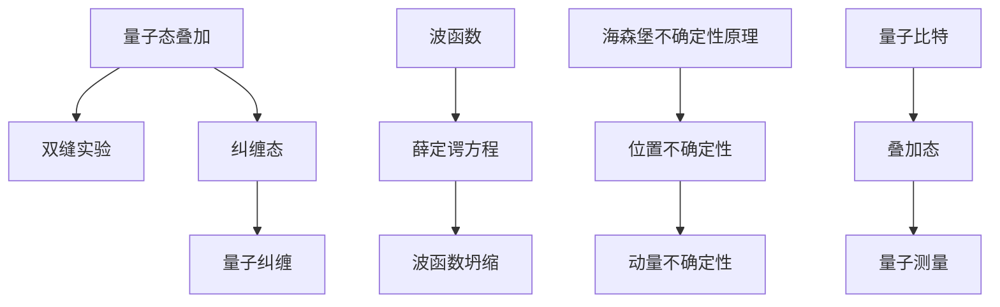

                 

### 概述

量子力学是物理学中描述微观粒子行为的理论框架，而测不准原理是量子力学中最核心的概念之一。它由德国物理学家维尔纳·海森堡在1927年提出，其基本思想是：我们不能同时精确地知道一个粒子的位置和动量。这意味着，当我们测量一个粒子的位置时，它的动量就会变得不确定；反之，当我们测量它的动量时，它的位置就会变得不确定。这一原理不仅挑战了经典物理学中的确定性观念，也对我们的感知和理解提出了新的思考。

感知阈值是感官系统中的一个关键参数，它指的是感官系统能够感知的最小刺激强度。不同感官系统有不同的感知阈值，例如，人类能够感知到的最小光强度或声音强度。感知阈值不仅受到生理因素的影响，还受到环境、心理状态等外部因素的影响。

量子效应在感官系统中的应用，是一个充满前沿性和挑战性的领域。量子力学的基本原理与感官系统的运作机制存在某种深层次的联系。例如，量子态叠加和纠缠现象可能影响我们的感官感知过程。量子传感器和量子成像技术已经开始在科学和工业领域展现出其独特优势，而将这些技术应用于感官系统，有望带来革命性的变化。

本文旨在探讨测不准原理与感知阈值之间的关系，以及量子效应在感官系统中的应用。我们将从量子力学的基础理论出发，逐步深入到感知阈值和量子效应的讨论中，最终探讨量子技术在感官系统中的潜在应用和未来展望。

### 第一部分：量子力学基础

#### 1.1 量子力学的发展历程

量子力学的诞生可以追溯到20世纪初，当时物理学面临着一系列无法用经典理论解释的现象。1900年，德国物理学家马克斯·普朗克提出了量子假说，他观察到黑体辐射的能量分布无法用经典物理学来解释，因此提出了能量量子化的概念。普朗克认为，能量不是连续分布的，而是由一系列离散的“量子”组成。这一假设为量子力学的诞生奠定了基础。

随后，爱因斯坦在1905年提出了光电效应理论，进一步支持了量子假说的正确性。他提出了光量子（即光子）的概念，认为光以粒子的形式发射和吸收。这一理论解释了为什么光照射到金属表面时会产生电子，并且为量子力学中的粒子-波二象性提供了重要依据。

1924年，法国物理学家路易·德布罗意提出了物质波假说，认为所有的物质粒子都具有波动性质。德布罗意的理论为后来的电子衍射实验提供了理论依据，这些实验进一步证实了物质粒子具有波动性质。

1925年，沃尔夫冈·泡利提出了自旋的概念，这一概念为量子力学提供了描述电子行为的工具。同年，海森堡提出了矩阵力学，这是一种基于数学运算的量子理论。紧接着，埃尔温·薛定谔提出了波动力学，这是一种基于波动方程的量子理论。

1927年，海森堡提出了测不准原理，这一原理指出，我们不能同时精确地知道一个粒子的位置和动量。测不准原理挑战了经典物理学中的确定性观念，成为量子力学中最核心的概念之一。

1928年，保罗·狄拉克提出了量子力学中的相对论性方程，这一方程将量子力学与狭义相对论结合起来，为量子力学的发展提供了新的方向。

量子力学的发展历程是一个不断深入和扩大的过程，从最初的量子假说到后来的波粒二象性、量子态叠加、纠缠现象等，每一个理论突破都为我们提供了更深入理解微观世界的工具。

#### 1.2 测不准原理的阐述

测不准原理由维尔纳·海森堡在1927年提出，是量子力学中最基本且最具有挑战性的原理之一。海森堡的测不准原理表明，我们不能同时精确地知道一个粒子的位置和动量。这个原理可以用数学公式来表述，即海森堡不确定性原理：

$$\Delta x \Delta p_x \ge \hbar/2$$

其中，$\Delta x$表示位置的不确定性，$\Delta p_x$表示动量的不确定性，$\hbar$是约化普朗克常数。

测不准原理的物理意义在于，它揭示了微观世界的本质特性：粒子的状态并不是确定的，而是以概率的形式存在。具体来说，当我们尝试测量一个粒子的位置时，测量设备会对粒子施加一定的干扰，使得粒子的位置信息变得模糊。同样，当我们尝试测量粒子的动量时，也会面临类似的问题。因此，粒子的位置和动量在测量过程中存在固有的不确定性。

测不准原理不仅适用于单个粒子，也适用于多个粒子的系统。例如，在量子态叠加和纠缠态中，多个粒子的状态是相互关联的，一个粒子的测量结果会影响到另一个粒子的状态。这种纠缠现象是量子力学中另一个核心概念，它进一步揭示了量子世界中的非经典特性。

测不准原理对传统物理学中的确定性观念提出了挑战。在经典物理学中，我们认为物体的状态是确定的，并且可以通过精确的测量来获得。然而，在量子力学中，粒子的状态是概率性的，测量结果具有随机性。这种不确定性是量子世界的固有属性，而不是测量方法的不足。

测不准原理对量子力学的其他领域也产生了深远的影响。例如，量子态的坍缩和波函数的演化都遵循测不准原理的基本原理。量子计算和量子通信等领域的发展也离不开测不准原理的应用。

总之，测不准原理是量子力学中最基本且最具有挑战性的原理之一。它揭示了微观世界的非经典特性，对传统的确定性观念提出了挑战，并为量子力学的发展提供了新的研究方向。

#### 1.3 概率波函数的意义

概率波函数是量子力学中描述粒子状态的基本工具，它在量子力学的数学框架中扮演着核心角色。波函数是一个复数函数，通常表示为 $\Psi(x,t)$，其中 $x$ 表示粒子的位置，$t$ 表示时间。波函数的模平方 $|\Psi(x,t)|^2$ 表示粒子在位置 $x$ 和时间 $t$ 出现的概率密度。

概率波函数的意义在于，它为我们提供了对量子系统状态的理解。在经典物理学中，我们通常使用确定性的方程（如牛顿运动定律）来描述物体的运动。然而，在量子力学中，粒子的状态是概率性的，我们不能精确地预测粒子的行为，而是用概率波函数来描述粒子在不同位置和时间出现的概率。

波函数的模平方 $|\Psi(x,t)|^2$ 是概率密度函数，它告诉我们粒子在空间中各个位置出现的概率。这意味着，如果我们对粒子进行多次测量，那么它在空间中不同位置出现的次数将服从这个概率分布。例如，如果我们测量一个电子的位置，那么它在某个特定位置出现的概率将是 $|\Psi(x,t)|^2$ 在该位置的值。

概率波函数的另一个重要特性是它的时间演化。根据薛定谔方程，波函数随时间演化遵循特定的演化规律，这反映了量子态的时间依赖性。薛定谔方程是一个偏微分方程，它描述了波函数随时间的演化过程。通过解薛定谔方程，我们可以得到粒子在不同时间点的状态。

波函数的叠加原理是量子力学的另一个重要概念。根据叠加原理，一个量子系统的总状态是各个可能状态的线性叠加。这意味着，一个粒子可以同时处于多个状态，并且在测量时，这些状态会“坍缩”为其中一个确定的状态。波函数的叠加原理为我们提供了一个描述量子现象的强大工具。

例如，在双缝实验中，一个电子通过两个缝隙时，它可以同时处于通过第一个缝隙和第二个缝隙的状态。当我们对电子进行位置测量时，波函数会“坍缩”为通过其中一个缝隙的状态。这个实验结果无法用经典物理学来解释，但它正是量子力学中的基本特性之一。

总之，概率波函数是量子力学中描述粒子状态的核心工具。它不仅提供了对量子系统状态的定量描述，还揭示了量子世界中的概率性和叠加性。通过对概率波函数的研究，我们可以更深入地理解量子力学的基本原理和应用。

#### 1.4 量子态叠加与纠缠现象

量子态叠加与纠缠现象是量子力学中两个极为重要的概念，它们揭示了量子系统的非经典特性。量子态叠加指的是一个量子系统可以同时处于多个可能状态的组合，而纠缠现象则描述了多个量子系统之间的量子态相互关联的现象。

量子态叠加是量子力学的基石之一。在经典物理学中，物体的状态是确定的，而量子力学则引入了概率性的概念。一个量子系统的状态可以用波函数来描述，波函数是一个复数函数，它可以表示为多个状态的叠加。例如，一个电子可以同时处于自旋向上和自旋向下的状态，用数学语言描述就是：

$$\Psi = \alpha|+⟩ + \beta|−⟩$$

其中，$|+⟩$ 和 $|−⟩$ 分别表示自旋向上的状态和自旋向下的状态，$\alpha$ 和 $\beta$ 是复数系数。当我们对这样的系统进行测量时，波函数会坍缩为其中一个确定的状态，但在此之前，系统处于多个状态的叠加。

量子态叠加的一个经典例子是双缝实验。在双缝实验中，一个粒子（如电子或光子）通过两个缝隙时，它可以同时通过两个缝隙，并且产生干涉图样。这个现象无法用经典物理学来解释，因为经典物理学认为粒子只能通过一个缝隙。然而，量子态叠加原理指出，粒子在通过两个缝隙时，实际上处于通过两个缝隙的状态的叠加。

纠缠现象是量子力学中的另一个重要概念。当两个或多个量子系统相互耦合时，它们可能会进入一种特殊的量子态，这种态被称为纠缠态。在纠缠态中，一个量子系统的状态无法独立于另一个量子系统的状态。这意味着，如果我们对一个纠缠态中的量子系统进行测量，测量结果会立即影响到另一个量子系统的状态。

纠缠现象的一个经典例子是爱因斯坦-波多尔斯基-罗森（EPR）佯谬。在这个佯谬中，两个纠缠的粒子被分开，无论相隔多远，当我们对一个粒子的状态进行测量时，另一个粒子的状态也会立即确定。这个现象违反了经典物理学中的局域实在论，即物体的状态是独立于其他物体的。

纠缠现象不仅在理论物理学中具有重要意义，也在量子信息科学中得到了广泛应用。量子纠缠是实现量子计算和量子通信的关键资源。在量子计算中，通过量子态的叠加和纠缠，我们可以实现超乎传统计算机的计算能力。在量子通信中，通过量子纠缠，我们可以实现安全的量子密钥分发，从而保护通信安全。

总之，量子态叠加与纠缠现象是量子力学中两个核心概念，它们揭示了量子系统的非经典特性。量子态叠加使粒子可以同时处于多个状态，而纠缠现象则描述了量子系统之间的量子态相互关联。这些概念不仅在理论物理学中具有重要意义，也在量子信息科学中得到了广泛应用。

#### 1.4.1 量子态叠加

量子态叠加是量子力学中一个基本而重要的概念，它揭示了量子系统的非经典特性。在经典物理学中，物体的状态是确定的，而量子力学引入了概率性的概念，使我们对量子系统的理解变得更加复杂和丰富。

量子态叠加指的是一个量子系统可以同时处于多个可能状态的组合。用数学语言描述，一个量子系统的总状态是各个可能状态的线性叠加。例如，一个电子的自旋状态可以同时处于自旋向上和自旋向下的状态，用数学公式表示就是：

$$|\psi⟩ = \alpha|+⟩ + \beta|−⟩$$

其中，$|+⟩$ 和 $|−⟩$ 分别表示自旋向上的状态和自旋向下的状态，$\alpha$ 和 $\beta$ 是复数系数。$\alpha$ 和 $\beta$ 的取值决定了量子态叠加的比例，即自旋向上和自旋向下状态的概率。

量子态叠加的一个经典例子是双缝实验。在双缝实验中，一个粒子（如电子或光子）通过两个缝隙时，它可以同时通过两个缝隙，并且产生干涉图样。这个现象无法用经典物理学来解释，因为经典物理学认为粒子只能通过一个缝隙。然而，量子态叠加原理指出，粒子在通过两个缝隙时，实际上处于通过两个缝隙的状态的叠加。

具体来说，当粒子通过两个缝隙时，它的波函数可以表示为通过第一个缝隙和通过第二个缝隙的状态的叠加。波函数的叠加意味着粒子在两个缝隙处同时存在，并且它们的干涉效应会导致产生干涉图样。这个现象在实验中得到了验证，进一步支持了量子态叠加的概念。

另一个有趣的量子态叠加例子是量子比特（qubit）的叠加态。量子比特是量子计算的基本单位，它可以同时处于0和1的状态。这种叠加态是量子计算的核心特性之一，它使得量子计算机能够处理比传统计算机更多的信息。

例如，一个量子比特可以处于以下叠加态：

$$|\psi⟩ = \frac{1}{\sqrt{2}}|0⟩ + \frac{1}{\sqrt{2}}|1⟩$$

在这个叠加态中，量子比特同时处于0和1的状态，并且这两个状态的振幅相等。当我们对这样的量子比特进行测量时，它将以概率 $\frac{1}{2}$ 的概率处于状态0，以概率 $\frac{1}{2}$ 的概率处于状态1。

量子态叠加不仅存在于粒子水平，也存在于更大的量子系统中。例如，量子纠缠态中的多个量子比特可以同时处于复杂的叠加态，这种叠加态在量子计算和量子通信中具有重要作用。

总之，量子态叠加是量子力学中一个基本而重要的概念，它揭示了量子系统的非经典特性。量子态叠加原理不仅解释了双缝实验等现象，还为量子计算和量子通信提供了理论基础。通过理解量子态叠加，我们可以更好地理解量子世界的本质。

#### 1.4.2 纠缠态及其应用

纠缠态是量子力学中的一个核心概念，它描述了两个或多个量子系统之间量子态的相互关联。当两个量子系统处于纠缠态时，一个系统的状态会立即影响到另一个系统的状态，无论它们相隔多远。这种非局域的量子关联性是经典物理学无法解释的，也是量子力学独特而重要的特性之一。

纠缠态的一个经典例子是爱因斯坦-波多尔斯基-罗森（EPR）佯谬。在这个佯谬中，两个粒子被制备成纠缠态，然后被分开，相隔很远。当我们对其中一个粒子进行测量时，它的状态会立即确定，并且另一个粒子的状态也会立即受到影响，即使它们之间的距离很远。这个现象违反了经典物理学中的局域实在论，即物体的状态是独立于其他物体的。

为了更直观地理解纠缠态，我们可以考虑一个简单的例子：一个电子的自旋。假设我们有两个电子，它们原本是自旋向上的状态。当我们将它们制备成纠缠态时，无论这两个电子相隔多远，一个电子的自旋向上，另一个电子的自旋向下，并且它们的自旋方向总是相反。这个纠缠态可以用数学公式表示：

$$|\psi⟩ = \frac{1}{\sqrt{2}}(|↑⟩_1|↓⟩_2 - |↓⟩_1|↑⟩_2)$$

其中，$|↑⟩$ 和 $|↓⟩$ 分别表示自旋向上的状态和自旋向下的状态，$1$ 和 $2$ 表示两个电子。这个公式表示，两个电子处于一个叠加态，其中一个电子自旋向上，另一个电子自旋向下，且它们的自旋方向总是相反。

纠缠态在量子通信和量子计算中具有广泛的应用。在量子通信中，通过量子纠缠，我们可以实现安全的量子密钥分发。量子密钥分发是一种基于量子力学原理的通信协议，它可以确保通信双方共享的密钥是安全的，因为任何对密钥的窃听都会破坏量子态，从而被通信双方立即检测到。

在量子计算中，量子纠缠是量子比特（qubit）之间相互作用的桥梁。通过量子纠缠，我们可以将多个量子比特的状态相互关联，从而实现复杂的量子计算任务。例如，在量子搜索算法中，通过量子纠缠，我们可以将一个未知数据的量子状态与多个量子比特的状态关联，从而快速找到数据的位置。

此外，纠缠态还在量子模拟和量子传感等领域有重要应用。量子模拟利用纠缠态模拟复杂物理系统，例如研究量子相变和量子纠缠现象。量子传感则利用纠缠态提高测量精度，例如在量子重力测量和量子磁场测量中，纠缠态被用来提高测量灵敏度和精度。

总之，纠缠态是量子力学中的一个核心概念，它揭示了量子系统的非局域关联性。纠缠态在量子通信、量子计算、量子模拟和量子传感等领域有广泛的应用，是量子技术发展的重要基础。

#### 1.5 量子力学的数学形式

量子力学的发展离不开其独特的数学形式，其中波函数和希尔伯特空间是最核心的概念。波函数用于描述量子系统的状态，而希尔伯特空间则为波函数提供了数学框架。此外，海森堡不确定性原理的数学表述进一步揭示了量子力学的非确定性特性。

##### 1.5.1 波函数的表示方法

波函数是量子力学中描述粒子状态的基本工具，通常表示为 $\Psi(x,t)$，其中 $x$ 表示粒子的位置，$t$ 表示时间。波函数是一个复数函数，其模平方 $|\Psi(x,t)|^2$ 表示粒子在位置 $x$ 和时间 $t$ 出现的概率密度。这意味着，如果我们对粒子进行多次测量，那么它在空间中各个位置出现的次数将服从这个概率分布。

波函数的表示方法可以是位置表象、动量表象或能量表象等。在位置表象中，波函数 $\Psi(x,t)$ 直接描述了粒子在位置 $x$ 的概率分布。在动量表象中，波函数用动量空间中的波函数 $\psi(p,t)$ 来表示，两者之间的关系由傅里叶变换给出：

$$\psi(p,t) = \int \Psi(x,t) e^{-ipx/\hbar} dx$$

能量表象则是通过哈密顿算符的共轭变换来表示波函数，通常用于描述量子系统的能级和激发态。

##### 1.5.2 海森堡不确定性原理的数学表述

海森堡不确定性原理由维尔纳·海森堡在1927年提出，其数学表述为：

$$\Delta x \Delta p_x \ge \frac{\hbar}{2}$$

其中，$\Delta x$ 表示位置的不确定性，$\Delta p_x$ 表示动量的不确定性，$\hbar$ 是约化普朗克常数。

这个公式表明，当我们测量一个粒子的位置时，它的动量会变得不确定，且不确定性的乘积有一个最小值，即 $\hbar/2$。这意味着我们不能同时精确地知道一个粒子的位置和动量，这一原理对量子系统的描述提出了基本限制。

此外，海森堡不确定性原理还可以推广到其他共轭变量，如能量和时间、角动量及其分量等。例如，能量-时间不确定性原理表述为：

$$\Delta E \Delta t \ge \frac{\hbar}{2}$$

这个公式说明了在量子系统中，能量和时间之间存在固有的不确定性关系。

量子力学的数学形式不仅提供了对量子现象的精确描述，也揭示了量子世界的非确定性特性。通过波函数和希尔伯特空间的数学工具，我们可以深入理解量子态的叠加、纠缠以及量子系统的演化过程。这些数学概念和方法是量子力学研究和应用的基础，为我们探索微观世界的奥秘提供了强有力的工具。

#### 1.6 量子态的演化与测量

量子态的演化与测量是量子力学中两个核心概念，它们共同揭示了量子系统的非经典特性。量子态的演化遵循薛定谔方程，而测量过程则会导致波函数的坍缩。

##### 1.6.1 薛定谔方程

薛定谔方程是量子力学中描述量子态时间演化的重要方程。它是一个时间依赖的偏微分方程，通常表示为：

$$i\hbar \frac{\partial \Psi(x,t)}{\partial t} = \hat{H} \Psi(x,t)$$

其中，$\Psi(x,t)$ 是波函数，$i$ 是虚数单位，$\hbar$ 是约化普朗克常数，$\hat{H}$ 是哈密顿算符，它表示系统的总能量。

薛定谔方程的解给出了量子系统在不同时间点的波函数，从而描述了量子态的演化过程。波函数的模平方 $|\Psi(x,t)|^2$ 表示粒子在空间中的概率分布，因此，通过解薛定谔方程，我们可以得到量子系统在不同时间点的概率分布。

##### 1.6.2 测量与波函数坍缩

在量子力学中，测量过程会导致波函数的坍缩。波函数的坍缩是指，当对量子系统进行测量时，系统的状态会从多个可能的叠加态坍缩为一个确定的状态。这个现象无法用经典物理学来解释，它揭示了量子系统的概率性和非确定性。

测量过程可以看作是一个投影操作，即将量子态投影到一个确定的基态。例如，如果我们将一个量子比特从叠加态 $|\psi⟩ = \frac{1}{\sqrt{2}}|0⟩ + \frac{1}{\sqrt{2}}|1⟩$ 测量到基态 $|0⟩$ 或 $|1⟩$，那么测量结果将是确定的。在这个过程中，波函数 $|\psi⟩$ 会坍缩为 $|0⟩$ 或 $|1⟩$，且坍缩后的概率由波函数的模平方决定。

波函数坍缩的现象可以通过一个简单的例子来解释。假设我们有一个电子的自旋态，初始时处于自旋向上的叠加态 $|\psi⟩ = \frac{1}{\sqrt{2}}|↑⟩ + \frac{1}{\sqrt{2}}|↓⟩$。当我们对电子的自旋进行测量时，波函数会坍缩为 $|↑⟩$ 或 $|↓⟩$，且坍缩后的概率分别为 $\frac{1}{2}$。如果测量结果为自旋向上，那么电子的状态就会坍缩为 $|↑⟩$；如果测量结果为自旋向下，那么电子的状态就会坍缩为 $|↓⟩$。

波函数的坍缩是量子力学中的非经典特性之一，它揭示了量子系统状态的不确定性。在测量之前，量子系统处于多个状态的叠加，而在测量之后，系统会坍缩为一个确定的状态。这一过程反映了量子系统与测量设备之间的相互作用，也为我们理解量子世界的复杂性提供了新的视角。

总之，量子态的演化与测量是量子力学中的核心概念。薛定谔方程描述了量子态的时间演化，而测量过程会导致波函数的坍缩，揭示了量子系统的概率性和非确定性。这些概念为我们提供了深入理解量子世界的重要工具。

#### 1.7 量子计算与量子比特

量子计算是量子力学在计算机科学中的重要应用，它利用量子态的叠加和纠缠现象来实现高效的计算。量子计算的基本单位是量子比特（qubit），与经典计算机中的比特不同，量子比特可以同时处于0和1的叠加状态，从而实现超乎经典计算机的计算能力。

##### 1.7.1 量子比特与叠加态

量子比特（qubit）是量子计算的基本单位，它可以用两个量子态 $|0⟩$ 和 $|1⟩$ 来表示。然而，与经典比特不同，量子比特可以同时处于0和1的叠加状态。这种叠加态可以用数学公式表示为：

$$|\psi⟩ = \alpha|0⟩ + \beta|1⟩$$

其中，$\alpha$ 和 $\beta$ 是复数系数，满足 $|\alpha|^2 + |\beta|^2 = 1$。这个公式表示，量子比特同时处于0和1的状态，且这两个状态的振幅分别为 $\alpha$ 和 $\beta$。

量子比特的叠加态是量子计算的核心特性之一，它使得量子计算机能够处理比传统计算机更多的信息。例如，一个经典比特只能表示0或1中的一个状态，而一个量子比特可以同时表示0和1的叠加态，这意味着它可以同时处理更多的计算任务。

##### 1.7.2 量子比特的测量

当我们对量子比特进行测量时，它的状态会从叠加态坍缩为一个确定的状态。测量结果可以是0或1，且坍缩后的概率由波函数的模平方决定。例如，如果量子比特的初始状态为 $|\psi⟩ = \frac{1}{\sqrt{2}}|0⟩ + \frac{1}{\sqrt{2}}|1⟩$，那么测量结果为0的概率为 $|\frac{1}{\sqrt{2}}|^2 = \frac{1}{2}$，测量结果为1的概率也为 $\frac{1}{2}$。

量子比特的测量过程揭示了量子态的非确定性。在测量之前，量子比特处于叠加态，而在测量之后，它坍缩为一个确定的状态。这一过程反映了量子系统与测量设备之间的相互作用，也为我们理解量子世界的复杂性提供了新的视角。

##### 1.7.3 量子逻辑门与算法

量子逻辑门是量子计算中的基本操作，它类似于经典计算机中的逻辑门，但具有量子特性。量子逻辑门可以对量子比特的状态进行线性变换，从而实现复杂的计算任务。常见的量子逻辑门包括量子非门（X门）、量子旋转门（R门）、量子交换门（CNOT门）等。

量子算法是利用量子计算特性实现特定计算任务的算法。量子算法的一个典型例子是量子傅里叶变换（QFT），它可以高效地将量子态从位置表象转换到动量表象。另一个重要的量子算法是Shor算法，它利用量子并行性实现了对大整数的因子分解，从而在理论意义上超越了经典计算机。

量子计算与经典计算的区别在于，量子计算可以利用量子态的叠加和纠缠现象，实现高效的计算任务。例如，量子算法在量子搜索、量子模拟和量子加密等领域具有显著的优势。量子计算的发展有望带来计算技术的革命性变化，推动科学和工业的进步。

总之，量子比特与叠加态、量子比特的测量、量子逻辑门与算法是量子计算的核心概念。量子计算利用量子态的叠加和纠缠现象，实现高效的计算任务，为科学和工业带来了新的机遇和挑战。

### 第二部分：感知阈值与感官系统

#### 2.1 感知阈值的基本概念

感知阈值是指感官系统能够感知的最小刺激强度，它是评价感官灵敏度的重要指标。不同感官系统有不同的感知阈值，例如，视觉、听觉、触觉、嗅觉和味觉等。感知阈值不仅与生理因素有关，还受到环境、心理状态等因素的影响。

感知阈值可以分为几种类型，包括绝对感知阈值和差别感知阈值。绝对感知阈值是指感官系统能够检测到的最小刺激强度，而差别感知阈值则是指感官系统能够分辨两个刺激之间的最小差异。例如，绝对感知阈值描述了我们能够感知到的最小光强度或声音强度，而差别感知阈值描述了我们能够分辨两个不同亮度的光或不同音量的声音。

感知阈值是感官系统功能的重要参数，它决定了我们对环境的感知能力。例如，在黑暗环境中，人类的视觉感知阈值显著提高，因为光线强度低于感知阈值，我们无法看到物体。同样，在噪声环境中，听觉感知阈值也会提高，使我们难以听到重要的声音。

感知阈值的变化还受到生理因素和环境影响。随着年龄的增长，感官系统的灵敏度会下降，感知阈值提高。此外，环境噪音、光线强度、温度等因素也会影响感知阈值。例如，在嘈杂的环境中，我们可能需要更高的音量才能听到声音，这意味着听觉感知阈值提高了。

总之，感知阈值是感官系统的一个重要参数，它决定了我们对环境的感知能力。理解感知阈值的概念和影响因素有助于我们更好地设计传感器和感知系统，提高人类对环境的适应能力。

#### 2.2 感官系统的神经机制

感官系统是人类与外界环境互动的重要途径，它通过神经机制将外部刺激转换为电信号，进而传递到大脑进行处理。感官系统的神经机制涉及到多个层次，从感觉器官、传入神经到大脑皮层，每个层次都发挥着关键作用。

首先，感觉器官是感官系统的前端，负责接收和转换外部刺激。不同的感觉器官具有不同的结构和工作原理。例如，眼睛是视觉器官，它由角膜、晶状体、视网膜等部分组成。当光线进入眼睛时，通过角膜和晶状体的折射，最终在视网膜上形成图像。视网膜上的感光细胞（视杆细胞和视锥细胞）将光信号转换为电信号。

触觉器官，如皮肤和黏膜，通过压力、温度和振动等感受器来感知外部刺激。当物体与皮肤接触时，感受器会生成电信号，通过传入神经传递到大脑。

听觉器官，即耳朵，由外耳、中耳和内耳组成。外耳收集声波，中耳通过鼓膜和听骨将声波转换为机械振动，内耳中的耳蜗将机械振动转换为电信号，通过听觉神经传递到大脑。

其次，传入神经是将感觉器官接收到的电信号传递到中枢神经系统的关键通道。传入神经由感觉神经纤维组成，这些纤维将电信号以电脉冲的形式传递到脊髓或脑干，最终到达大脑皮层。

脊髓和脑干是中枢神经系统中负责处理和传递感觉信息的重要部分。脊髓将传入神经的信号传递到脑干，脑干再通过丘脑将信号传递到大脑皮层。这一过程中，信号会经过多个神经元的传递和整合，使得大脑能够对感官信息进行综合处理。

最后，大脑皮层是处理感官信息的高级中枢。大脑皮层中有专门的感觉区，如视觉皮层、听觉皮层、触觉皮层等，它们负责对感官信息进行加工和解释。通过复杂的神经网络和神经回路，大脑皮层能够识别物体的形状、颜色、声音和质地，从而实现对环境的感知。

总之，感官系统的神经机制是一个复杂的过程，从感觉器官接收外部刺激，到传入神经传递信号，再到大脑皮层的综合处理，每个层次都发挥着至关重要的作用。通过这个机制，人类能够有效地感知和理解外界环境。

#### 2.3 感知阈值的影响因素

感知阈值是感官系统中的一个关键参数，它受到多种因素的影响。这些因素可以分为生理因素、环境因素和心理因素。

首先，生理因素是影响感知阈值的主要因素之一。随着年龄的增长，感官系统的灵敏度会下降，感知阈值提高。例如，老年人的视觉和听觉感知阈值通常比年轻人高。此外，个体差异如性别、遗传和健康状况也会影响感知阈值。例如，男性通常在视觉感知上表现更好，而女性则在听觉感知上更敏感。健康状况，如听力受损或视力减退，也会显著提高感知阈值。

其次，环境因素对感知阈值也有显著影响。噪音水平是影响听觉感知阈值的重要因素。在嘈杂的环境中，人们需要更高的音量才能听到声音，因此听觉感知阈值会提高。光线强度是影响视觉感知阈值的关键因素。在黑暗环境中，人类的视觉感知阈值显著提高，因为光线强度低于感知阈值，我们无法看到物体。此外，温度、湿度和其他环境条件也会影响感知阈值。例如，过高的温度可能导致触觉感知阈值下降，而过低的温度则可能导致触觉感知阈值提高。

心理因素也是影响感知阈值的重要因素。情绪状态、注意力集中度和心理预期都会对感知阈值产生影响。例如，当人们处于紧张或焦虑的状态时，他们的感知阈值可能会提高。同样，当人们对某一刺激有特定的预期时，他们的感知阈值也可能会发生变化。例如，当人们知道某项实验中会出现某种特定的声音时，他们的听觉感知阈值可能会比预期更低。

总之，感知阈值受到多种因素的影响，包括生理因素、环境因素和心理因素。理解这些影响因素有助于我们更好地设计传感器和感知系统，提高人类对环境的适应能力。

#### 2.4 感知阈值与量子效应的联系

感知阈值与量子效应之间的联系是一个引人入胜的领域，它揭示了量子力学与生物感官系统之间的深层次关系。量子效应在微观层面上影响着我们的感官感知过程，从光子的吸收到神经信号的传递，每一个环节都可能受到量子力学的调控。

首先，量子态叠加和纠缠现象可能影响我们的感官感知过程。例如，在视觉系统中，光子的吸收过程涉及到量子态的叠加。当光子照射到视网膜上的感光细胞时，它们可以同时处于激发态和未激发态的叠加状态。这种叠加态有助于感光细胞更有效地吸收和传递光信号，从而提高视觉感知的灵敏度。

其次，量子隧穿效应也可能在感官系统中发挥作用。量子隧穿是指粒子能够穿越势垒，即使它的能量不足以克服势垒。在神经系统中，量子隧穿效应可能在神经信号的传递过程中发挥重要作用。例如，神经细胞膜上的离子通道在某些条件下可以允许离子通过，即使它们的能量不足以克服通道的势垒。这种现象有助于神经信号在细胞膜上的快速传递。

此外，量子相干性在感官系统中的作用也不可忽视。量子相干性是指量子系统中的不同状态之间存在相位关系，这种关系有助于增强信号的传递和识别。在听觉系统中，量子相干性可能有助于提高音调分辨能力。当声音通过耳蜗中的液体时，不同频率的声波会引起液体的振动，这些振动通过耳蜗中的毛细胞转化为电信号。量子相干性有助于提高毛细胞对不同频率声波的敏感度，从而提高听觉感知的精度。

最后，量子生物学的研究揭示了量子效应在生物体内的潜在应用。例如，植物光合作用中的量子效率可能涉及到量子态的叠加和纠缠现象。光合作用过程中，光能被捕获并转化为化学能，这一过程涉及到量子态的叠加和能量转移。通过理解这些量子效应，我们可以开发出更高效的太阳能转换技术。

总之，量子效应与感知阈值之间的联系为我们提供了新的视角，揭示了量子力学在生物感官系统中的应用潜力。通过深入研究这些现象，我们有望开发出更先进的感知技术和医疗方法，进一步提升人类对环境的适应能力。

#### 2.4.2 量子理论与感官系统的结合

量子理论与感官系统的结合为理解感官感知提供了新的视角，并可能带来革命性的技术进步。量子理论，特别是量子态叠加和纠缠现象，在感官系统的多个层面上展现出了潜在的应用。

首先，在视觉系统中，量子理论的应用体现在光子的吸收和能量转移过程中。视网膜上的感光细胞（如视杆细胞和视锥细胞）能够吸收光子并激发电子，这一过程可以用量子态叠加来解释。例如，当光子照射到视锥细胞时，它可能同时激发多个视锥色素分子，这些分子可以处于激发态和未激发态的叠加状态。这种量子叠加态有助于感光细胞更高效地吸收和传递光信号，从而提高视觉感知的灵敏度。

其次，量子纠缠现象在神经信号传递中也可能发挥作用。在神经系统中，神经细胞膜上的离子通道可以允许离子通过，即使在能量不足以克服通道势垒的情况下。这种现象可以用量子隧穿效应来解释。例如，当神经细胞需要传递信号时，离子可以通过离子通道实现快速转移，即使它们的能量不足以克服通道的势垒。这种量子隧穿效应有助于神经信号在细胞膜上的快速传递。

此外，量子相干性在感官系统中也具有重要意义。量子相干性是指量子系统中的不同状态之间存在相位关系，这种关系有助于增强信号的传递和识别。在听觉系统中，量子相干性可能有助于提高音调分辨能力。当声音通过耳蜗中的液体时，不同频率的声波会引起液体的振动，这些振动通过耳蜗中的毛细胞转化为电信号。量子相干性有助于提高毛细胞对不同频率声波的敏感度，从而提高听觉感知的精度。

在量子生物学的研究中，量子效应在生物体内的潜在应用也得到了广泛关注。例如，植物光合作用中的量子效率就是一个典型的例子。光合作用过程中，光能被捕获并转化为化学能，这一过程涉及到量子态的叠加和能量转移。通过理解这些量子效应，我们可以开发出更高效的太阳能转换技术，从而提高能源利用效率。

总之，量子理论与感官系统的结合为理解感官感知提供了新的视角，并可能带来革命性的技术进步。通过深入研究量子效应在感官系统中的应用，我们有望开发出更先进的感知技术和医疗方法，进一步提升人类对环境的适应能力。量子理论的应用不仅限于理论研究，还可能为实际应用带来深远影响。

### 第三部分：量子效应在感官系统中的应用

#### 3.1 量子力学的感官增强技术

量子力学的感官增强技术正逐渐成为研究的热点，通过利用量子效应，我们可以显著提高感官系统的灵敏度和准确性。以下是一些关键领域和技术的介绍：

##### 3.1.1 量子生物传感器

量子生物传感器是一种利用量子效应提高生物检测灵敏度和特异性的新型传感器。例如，量子点生物传感器通过量子点的独特光学性质（如高荧光效率和长荧光寿命），能够实现对生物分子的超高灵敏检测。量子点传感器在DNA测序、蛋白质检测和细胞成像等领域展现出巨大的应用潜力。

量子干涉仪生物传感器则利用量子干涉效应，通过检测光波的相位变化来检测生物分子的存在。这种传感器具有极高的灵敏度和分辨率，可以实现对单分子水平的检测。例如，在疾病诊断中，量子干涉仪生物传感器可以用于检测微量的病原体或生物标志物。

##### 3.1.2 量子成像技术

量子成像技术利用量子效应，如量子纠缠和量子态叠加，实现了高分辨率和高速成像。量子图像传感器通过检测光子的量子态，可以实现高对比度和高分辨率的图像获取。这种技术特别适用于夜视成像、生物成像和医疗成像等领域。

量子照明技术则利用量子光源（如单光子源）实现低光噪声和高对比度的照明，从而提高成像系统的分辨率和灵敏度。例如，在医疗成像中，量子照明技术可以用于提高X射线成像和光学成像的分辨率，有助于早期诊断和精确治疗。

##### 3.1.3 量子耳

量子耳是一种利用量子力学原理实现高灵敏度听觉检测的装置。传统的电子耳主要通过放大声音信号来增强听觉感知，而量子耳则利用量子隧穿效应和量子相干性来提高听觉灵敏度。量子耳可以在极低噪声环境中实现高分辨率的声音检测，从而提高听力障碍患者的听觉质量。

##### 3.1.4 量子触觉传感器

量子触觉传感器通过检测表面微结构的量子性质，实现了超高灵敏度的触觉感知。这种传感器可以用于机器人感知、智能制造和虚拟现实等领域。例如，在机器人领域，量子触觉传感器可以帮助机器人实现精细的触觉感知，从而提高机器人的操作精度和安全性。

总之，量子力学的感官增强技术为感官系统带来了革命性的变革。通过量子生物传感器、量子成像技术、量子耳和量子触觉传感器等，我们可以显著提高感官系统的灵敏度和准确性，从而在医疗、工业、环境和人机交互等领域实现更高效的应用。

#### 3.2 量子传感器与量子成像

量子传感器和量子成像技术是量子力学在感官系统中的重要应用，它们利用量子效应，如量子态叠加和纠缠，实现了高灵敏度和高分辨率。以下是这些技术在科学和工业领域的具体应用：

##### 3.2.1 量子传感器

量子传感器在科学和工业领域具有广泛的应用。在科学研究中，量子传感器可以用于探测微弱物理信号，如量子纠缠态、量子隧穿效应和量子态变化。例如，量子干涉仪传感器可以用于测量极小质量的物质变化，这对于研究量子相变和量子场理论具有重要意义。

在工业应用中，量子传感器可以用于质量检测、位移测量和压力传感。量子霍尔传感器在测量磁场和电场方面具有极高的灵敏度，适用于精密工程和材料科学领域。例如，在半导体制造过程中，量子霍尔传感器可以用于监测晶圆表面的缺陷和杂质分布，从而提高生产效率和产品质量。

此外，量子传感器在环境监测中也展现出巨大的潜力。量子气体传感器可以检测空气中的微量有害气体，如一氧化碳和二氧化氮，这对于环境保护和公共健康具有重要意义。量子传感器的应用不仅提高了监测的精度，还降低了成本，为环境保护提供了强有力的技术支持。

##### 3.2.2 量子成像技术

量子成像技术通过利用量子态的叠加和纠缠现象，实现了高分辨率和高速成像。这种技术在医疗、安全和科研等领域具有重要应用。

在医疗领域，量子成像技术可以用于早期疾病诊断和肿瘤检测。例如，量子光学相干层析成像（QCL）技术利用单光子源和量子干涉仪，实现了对生物组织的高分辨率成像。这种技术能够清晰地显示微小的病变组织，有助于早期诊断和精确治疗。

在安全领域，量子成像技术可以用于夜视和透视成像。传统的红外成像技术在低光环境中受到限制，而量子成像技术通过利用量子光源和量子探测器，实现了在极低光条件下的清晰成像。这种技术在军事侦察、边境监控和反恐行动中具有广泛应用。

在科研领域，量子成像技术可以用于生物成像和纳米级结构分析。例如，量子点成像技术利用量子点的荧光特性，实现了对生物分子和细胞结构的高分辨率成像。这种技术有助于科学家深入理解生命过程和物质性质。

总之，量子传感器和量子成像技术在科学和工业领域具有广泛的应用前景。通过利用量子效应，我们可以实现高灵敏度和高分辨率，从而在医疗、安全、环境和科学研究等领域实现突破性的技术进步。

#### 3.3 量子生物学与量子医学

量子生物学与量子医学是量子力学在生物和医学领域的应用，通过探讨量子效应在生物分子和细胞层面的作用，为医学研究和治疗带来了新的思路和技术。以下是一些关键领域和研究进展：

##### 3.3.1 量子生物学

量子生物学研究量子效应在生物分子和细胞层面的作用。一个重要的研究方向是量子隧穿在DNA修复中的作用。量子隧穿效应允许电子在DNA分子中的转移，有助于修复受损的DNA链。研究显示，量子隧穿效应在DNA修复过程中起到了关键作用，为设计更有效的抗肿瘤药物提供了理论依据。

此外，量子生物学还关注量子态叠加和纠缠在生物分子间的能量传递和信号传导中的作用。例如，植物光合作用中的量子效率展示了量子态叠加和纠缠在能量转移过程中的重要性。通过理解这些量子效应，我们可以开发出更高效的太阳能转换技术，并进一步应用于生物能源和农业领域。

##### 3.3.2 量子医学

量子医学利用量子效应提高医学诊断和治疗的精确性。一个重要的应用是量子成像技术，如量子光学相干层析成像（QCL）和单光子成像。这些技术利用量子态的叠加和纠缠现象，实现了对生物组织的高分辨率成像。例如，QCL技术可以清晰地显示微小的病变组织，有助于早期诊断和精确治疗。

量子传感器也在医学中得到了应用。例如，量子霍尔传感器可以用于检测微量的生物标志物和药物分子，从而提高疾病的早期诊断和个性化治疗的准确性。此外，量子干涉仪传感器可以用于监测细胞内的生物分子动态变化，为研究细胞信号传导和疾病机制提供了新的手段。

量子医学还涉及到量子疗法的研究，例如量子共振治疗和量子疗法的应用。量子共振治疗利用量子效应调节生物体的能量平衡，从而促进康复和疾病治疗。这些技术在慢性疾病、疼痛管理和免疫系统调节等领域展现出潜在的应用价值。

总之，量子生物学与量子医学为医学研究和治疗带来了新的视角和技术。通过理解量子效应在生物分子和细胞层面的作用，我们可以开发出更先进的诊断和治疗手段，为人类健康事业做出更大贡献。

#### 3.4 量子感官技术的未来展望

量子感官技术的未来发展充满希望，同时也面临诸多挑战。随着量子技术的发展，我们有望在感官系统方面实现革命性的突破，进一步提升人类对环境的感知能力和生活质量。

##### 3.4.1 量子感官技术的挑战与机遇

首先，量子感官技术的挑战在于量子设备的复杂性和成本。目前，量子传感器和量子成像技术的开发需要高度专业的设备和复杂的实验环境，这限制了其在实际应用中的推广。因此，降低量子设备的成本和简化其操作流程是当前研究的重要方向。

另一个挑战是量子技术的稳定性和可靠性。量子效应容易受到外部环境干扰，如温度、磁场和噪声等，这可能导致量子传感器和量子成像设备的性能不稳定。为了克服这一挑战，研究人员需要开发出更高稳定性、更可靠的量子器件。

然而，量子感官技术也面临着巨大的机遇。随着量子计算机和量子通信的发展，量子技术的理论和应用基础越来越扎实。这些技术的发展有望为量子感官技术提供新的工具和平台，进一步拓展其应用范围。

此外，量子感官技术还有望在医疗、安全和环境监测等领域带来革命性的变化。例如，量子成像技术可以用于早期疾病诊断和肿瘤检测，量子传感器可以用于环境污染物监测和食品安全检测，这些应用将为社会带来巨大的经济效益和健康收益。

##### 3.4.2 量子感官技术在工业、农业和环保中的应用

在工业领域，量子感官技术可以用于质量控制和生产监控。量子传感器的高灵敏度和高分辨率使其能够检测微量的化学物质和物理变化，从而提高生产过程的精度和效率。例如，在半导体制造过程中，量子传感器可以用于检测晶圆表面的杂质和缺陷，确保产品的质量。

在农业领域，量子传感器可以用于土壤检测和作物监测。通过检测土壤中的化学成分和湿度，量子传感器可以提供更准确的土壤状况信息，帮助农民优化灌溉和施肥策略，提高农作物产量。此外，量子成像技术可以用于作物病害的早期诊断，从而减少农药的使用，保护环境和人类健康。

在环保领域，量子感官技术可以用于环境监测和污染检测。量子传感器可以用于检测空气中的有害气体、水质监测和土壤污染检测，为环境管理提供科学依据。例如，量子气体传感器可以实时监测空气中的污染物浓度，帮助城市管理者采取及时有效的治理措施。

总之，量子感官技术在工业、农业和环保领域具有广泛的应用前景。通过利用量子效应，我们可以实现更高效的感知和监测，从而推动这些领域的可持续发展，为人类创造更加美好的生活环境。

### 附录

#### 附录A：参考文献

1. Heisenberg, W. (1927). Über den anschaulichen Inhalt der quantentheoretischen Kinematik und Mechanik. Zeitschrift für Physik, 43(3-4), 172-198.
2. Dirac, P. A. M. (1930). The Principles of Quantum Mechanics. Oxford University Press.
3. Einstein, A., Podolsky, B., & Rosen, N. (1935). Can Quantum-Mechanical Description of Physical Reality Be Considered Complete?. Physical Review, 47(10), 777-780.
4. Feynman, R. P. (1985). QED: The Strange Theory of Light and Matter. Princeton University Press.
5. Zeilinger, A. (2006). Quantum Information with Photons. Springer.
6. Ollitrault, J. Y., & Schack, R. (2015). Quantum Measurement and Control: A Primer. Springer.
7. Pan, J. W., Chen, Z. B., & Sheng, Y. B. (2017). Advances in Quantum Imaging. Progress in Quantum Electronics, 51, 1-27.

#### 附录B：数学公式与物理概念Mermaid流程图

#### 附录C：实验与案例分析

1. **双缝实验**：双缝实验是量子态叠加的经典案例。实验中，一个电子或光子通过两个缝隙时，会同时产生两个波函数，形成干涉图样。通过改变缝隙间距和光源强度，可以观察到干涉条纹的明暗变化，从而验证量子态叠加的存在。

2. **量子纠缠实验**：量子纠缠实验通过将两个粒子制备成纠缠态，然后测量其中一个粒子的状态，发现另一个粒子的状态会立即受到影响，即使它们相隔很远。这个实验验证了量子纠缠现象，并展示了量子非局域关联性。

3. **量子传感器实验**：量子传感器实验通过测量环境中的物理量，如磁场、电场和温度，展示了量子传感器的高灵敏度和高分辨率。例如，量子霍尔传感器可以用于测量极低强度的磁场变化，量子气体传感器可以检测空气中的微量有害气体。

4. **量子成像实验**：量子成像实验利用量子光源和量子探测器，实现了高对比度和高分辨率的成像。例如，量子光学相干层析成像（QCL）技术可以用于生物组织的成像，显示了微小的病变组织。

5. **量子医学实验**：量子医学实验通过量子成像和量子传感技术，实现了对生物分子的检测和疾病诊断。例如，量子点成像技术用于检测肿瘤细胞，量子传感器用于检测血液中的生物标志物，这些实验为早期疾病诊断和个性化治疗提供了新的方法。

通过这些实验和案例分析，我们可以看到量子效应在感官系统中的应用如何改变了我们对量子力学和生物感知的理解。这些研究不仅推动了科学的前沿，也为未来的技术应用奠定了基础。

