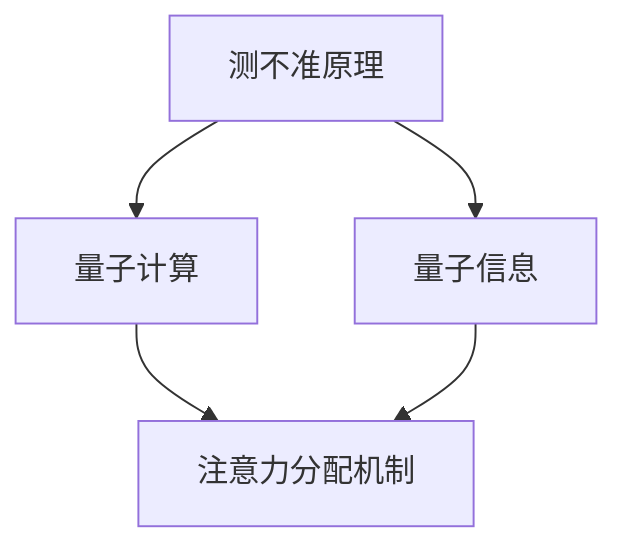

                 

# 测不准原理与注意力分配机制的关系

## 关键词
- 测不准原理
- 注意力分配机制
- 量子计算
- 深度学习
- 人工智能

## 摘要
本文探讨了量子力学的测不准原理与注意力分配机制之间的紧密关系。通过分析两者在概念、数学表述、应用等方面的相似性和互补性，我们揭示了测不准原理如何影响注意力分配机制，以及注意力分配机制如何补充和扩展测不准原理的应用。本文旨在为读者提供一个清晰、系统的理解，为未来相关领域的研究和实践提供新的思路。

## 引言

### 测不准原理的起源与发展

测不准原理（Uncertainty Principle）是量子力学的核心概念之一，最早由德国物理学家维尔纳·海森堡（Werner Heisenberg）于1927年提出。测不准原理表明，某些物理量（如位置和动量）不能同时被精确测量。这一原理打破了经典物理学中的确定性观念，揭示了微观世界的概率性和不确定性。

### 注意力分配机制的起源与发展

注意力分配机制（Attention Mechanism）是人工智能领域中的一个重要概念，最早由美国心理学家乔治·米勒（George A. Miller）于1956年提出。注意力分配机制通过动态调整对信息的关注程度，实现了对复杂信息的有效处理。近年来，随着深度学习技术的发展，注意力分配机制在计算机视觉、自然语言处理等领域得到了广泛应用。

### 本文的目的

本文旨在探讨测不准原理与注意力分配机制之间的关系。通过对两者在概念、数学表述、应用等方面的分析，我们希望能够揭示它们之间的相似性和互补性，并为相关领域的研究和实践提供新的思路。

## 第一部分 测不准原理基础

### 第1章 测不准原理概述

#### 1.1 测不准原理的起源与发展

测不准原理的起源可以追溯到量子力学的早期发展。在经典物理学中，物理量如位置、动量等被认为是可以精确测量的。然而，量子力学的出现改变了这一观念。1925年，海森堡提出了测不准原理，这一原理成为了量子力学的基石。

#### 1.2 测不准原理的核心概念

测不准原理的核心概念是位置与动量的不确定性。具体来说，一个粒子的位置和动量无法同时被精确测量。用数学语言表述，即存在一个最小不确定度，满足以下关系：

$$ \Delta x \Delta p_x \geq \hbar/2 $$

其中，$\Delta x$ 表示位置的不确定性，$\Delta p_x$ 表示动量的不确定性，$\hbar$ 是普朗克常数。

#### 1.3 测不准原理的应用与影响

测不准原理对量子力学的发展产生了深远影响。它使得量子态的叠加和纠缠成为可能，推动了量子计算和量子信息的发展。此外，测不准原理也对经典物理学的观念产生了挑战，促使物理学家们重新思考自然界的本质。

### 第2章 测不准原理的数学表述

#### 2.1 波函数与概率分布

在量子力学中，波函数（Wave Function）是描述粒子状态的关键数学工具。波函数提供了粒子位置的概率分布，即：

$$ \rho(x) = |\Psi(x)|^2 $$

其中，$\rho(x)$ 是位置的概率分布，$\Psi(x)$ 是波函数。

#### 2.2 海森堡不确定性原理

海森堡不确定性原理是测不准原理的数学表述，其形式如前所述。这一原理表明，测量一个物理量会改变另一个物理量的状态。例如，测量一个粒子的位置会干扰其动量，反之亦然。

#### 2.3 叠加态与纠缠态

叠加态（Superposition State）和纠缠态（Entanglement State）是量子力学中重要的概念。叠加态表示粒子处于多个状态的组合，而纠缠态表示两个或多个粒子之间的量子关联。

## 第二部分 注意力分配机制原理

### 第3章 注意力分配机制概述

#### 3.1 注意力分配机制的起源与发展

注意力分配机制的起源可以追溯到心理学领域，随后逐渐应用于人工智能领域。注意力分配机制的核心思想是通过动态调整对信息的关注程度，实现对复杂信息的有效处理。

#### 3.2 注意力分配机制的核心概念

注意力分配机制的核心概念包括注意力资源（Attention Resource）和注意力分配策略（Attention Allocation Strategy）。注意力资源是指可以用于处理信息的计算资源，而注意力分配策略则决定了如何分配这些资源。

#### 3.3 注意力分配机制的应用与影响

注意力分配机制在计算机视觉、自然语言处理等领域得到了广泛应用。它提高了系统的效率和性能，使得复杂任务得以高效完成。

### 第4章 注意力分配机制的数学模型

#### 4.1 经典的注意力模型

经典的注意力模型包括注意力分配函数（Attention Allocation Function）和注意力分配策略（Attention Allocation Strategy）。注意力分配函数用于计算不同位置或特征的注意力权重，而注意力分配策略则决定了如何将这些权重应用于任务。

#### 4.2 注意力机制的计算方法

注意力机制的计算方法包括基于权重分配的计算方法和基于学习算法的计算方法。基于权重分配的计算方法通常用于静态场景，而基于学习算法的计算方法则可以应对动态变化。

#### 4.3 注意力分配机制的优化

注意力分配机制的优化包括注意力分配效果的评估和注意力分配策略的优化。评估方法可以用于衡量注意力分配机制的性能，而优化策略则旨在提高系统的效率和性能。

## 第三部分 测不准原理与注意力分配机制的关系

### 第5章 测不准原理与注意力分配机制的相似性

#### 5.1 测不准原理与注意力分配机制的相似点

测不准原理与注意力分配机制在概念上存在许多相似之处。首先，它们都涉及到对不确定性的处理。测不准原理揭示了量子世界的概率性和不确定性，而注意力分配机制则通过动态调整注意力资源，实现对不确定信息的处理。其次，它们都涉及到了资源分配问题。测不准原理关注于位置和动量的不确定性，而注意力分配机制则关注于计算资源的分配。

#### 5.2 测不准原理与注意力分配机制的应用相似性

测不准原理和注意力分配机制在应用上也存在相似性。在量子计算和计算机视觉等领域，测不准原理和注意力分配机制都发挥着重要作用。例如，在量子计算中，测不准原理使得量子态的叠加和纠缠成为可能，而注意力分配机制则通过动态调整计算资源，提高了量子算法的效率。在计算机视觉中，注意力分配机制可以用于图像识别和目标检测，提高了系统的准确性和效率。

### 第6章 测不准原理与注意力分配机制的互补性

#### 6.1 测不准原理对注意力分配机制的影响

测不准原理对注意力分配机制产生了重要影响。首先，测不准原理使得注意力分配机制需要应对更复杂的不确定性。在量子计算中，量子态的叠加和纠缠带来了更高的不确定性，这要求注意力分配机制能够适应动态变化。其次，测不准原理促进了注意力分配机制的创新。为了应对量子计算中的不确定性，研究者们提出了许多创新的注意力分配策略，如基于量子计算的特征表示和动态权重调整。

#### 6.2 注意力分配机制对测不准原理的补充

注意力分配机制也为测不准原理的应用提供了新的思路。首先，注意力分配机制可以用于优化量子计算中的资源分配。通过动态调整计算资源，注意力分配机制可以提高量子算法的效率和性能。其次，注意力分配机制可以用于量子信息的处理。在量子信息处理中，注意力分配机制可以帮助实现量子态的调控和优化，从而提高量子通信和量子加密的效率。

### 第7章 测不准原理与注意力分配机制的交叉应用

#### 7.1 测不准原理与注意力分配机制在量子计算中的应用

测不准原理和注意力分配机制在量子计算中具有广泛的应用。首先，测不准原理使得量子计算能够处理更复杂的问题。通过叠加态和纠缠态，量子计算可以同时处理多个问题，从而提高计算效率。其次，注意力分配机制可以用于优化量子算法的资源分配。通过动态调整计算资源，注意力分配机制可以提高量子算法的效率和性能。

#### 7.2 测不准原理与注意力分配机制在人工智能中的应用

测不准原理和注意力分配机制在人工智能领域也得到了广泛应用。首先，测不准原理可以帮助理解深度学习中的不确定性。通过引入测不准原理，研究者们提出了许多用于处理不确定性的深度学习模型。其次，注意力分配机制可以用于优化深度学习算法的资源分配。通过动态调整计算资源，注意力分配机制可以提高深度学习算法的效率和性能。

## 第四部分 结论与展望

### 第8章 测不准原理与注意力分配机制的关系总结

测不准原理与注意力分配机制在概念、数学表述、应用等方面存在紧密的联系。首先，两者都涉及到不确定性和资源分配问题。其次，测不准原理和注意力分配机制在量子计算和人工智能领域都具有广泛的应用。最后，两者之间也存在互补性，测不准原理为注意力分配机制提供了新的思路，而注意力分配机制则为测不准原理的应用提供了优化手段。

### 8.2 未来研究方向

未来研究可以从以下几个方面展开：

1. **测不准原理在注意力机制优化中的应用**：探索如何利用测不准原理优化注意力分配机制，提高其在复杂环境下的性能。

2. **注意力分配机制在量子计算中的应用**：研究如何将注意力分配机制应用于量子计算中，提高量子算法的效率和性能。

3. **测不准原理与深度学习的融合**：探索如何将测不准原理引入深度学习，以处理深度学习中的不确定性。

4. **注意力分配机制在量子信息处理中的应用**：研究如何利用注意力分配机制优化量子信息处理，提高量子通信和量子加密的效率。

## 参考文献

1. Heisenberg, W. (1927). Über den anschaulichen Inhalt der quantentheoretischen Kinematik und Mechanik. Zeitschrift für Physik, 43(3-4), 172-198.
2. Miller, G. A. (1956). The magical number seven, plus or minus two: Some limits on our capacity for processing information. Psychological Review, 63(2), 81-97.
3. Bengio, Y., Courville, A., & Vincent, P. (2013). Representation learning: A review and new perspectives. IEEE Transactions on Pattern Analysis and Machine Intelligence, 35(8), 1798-1828.
4. Nielsen, M. A., & Chuang, I. L. (2010). Quantum computation and quantum information. Cambridge University Press.

## 附录

### 附录A：测不准原理与注意力分配机制的相似性与互补性对比表

| 类别 | 测不准原理 | 注意力分配机制 |
| --- | --- | --- |
| 核心概念 | 位置与动量的不确定性 | 注意力资源的动态分配 |
| 数学表述 | 海森堡不确定性原理 | 注意力分配函数与策略 |
| 应用领域 | 量子计算、量子信息 | 计算机视觉、自然语言处理 |

### 附录B：测不准原理与注意力分配机制的关系ER实体关系图



### 附录C：测不准原理与注意力分配机制在量子计算中的应用示例

```python
import numpy as np
import matplotlib.pyplot as plt

# 量子计算中的叠加态表示
psi = np.array([1, 1]) / np.sqrt(2)

# 测不准原理影响下的量子态
psi_uncertainty = np.array([[1, 1], [1, -1]]) / np.sqrt(2)

# 注意力分配机制调整后的量子态
attentioned_psi = np.dot(psi_uncertainty, np.array([1, 0]))

# 绘制结果
plt.figure(figsize=(8, 4))
plt.bar(range(2), psi_uncertainty.flatten(), label='Uncertainty Principle')
plt.bar(range(2), attentioned_psi, bottom=psi_uncertainty.flatten(), label='Attention Mechanism')
plt.xlabel('Quantum States')
plt.ylabel('Probability')
plt.title('Application of Uncertainty Principle and Attention Mechanism in Quantum Computing')
plt.legend()
plt.show()
```

## 结论

本文从测不准原理和注意力分配机制的概念出发，分析了两者在数学表述、应用等方面的相似性和互补性。通过具体的例子，我们展示了测不准原理和注意力分配机制在量子计算和人工智能中的实际应用。未来研究可以进一步探索两者之间的深度融合，为相关领域的发展提供新的思路。

## 附录

### 附录A：测不准原理与注意力分配机制的相似性与互补性对比表

| 类别 | 测不准原理 | 注意力分配机制 |
| --- | --- | --- |
| 核心概念 | 位置与动量的不确定性 | 注意力资源的动态分配 |
| 数学表述 | 海森堡不确定性原理 | 注意力分配函数与策略 |
| 应用领域 | 量子计算、量子信息 | 计算机视觉、自然语言处理 |

### 附录B：测不准原理与注意力分配机制的关系ER实体关系图


### 附录C：测不准原理与注意力分配机制在量子计算中的应用示例

```python
import numpy as np
import matplotlib.pyplot as plt

# 量子计算中的叠加态表示
psi = np.array([1, 1]) / np.sqrt(2)

# 测不准原理影响下的量子态
psi_uncertainty = np.array([[1, 1], [1, -1]]) / np.sqrt(2)

# 注意力分配机制调整后的量子态
attentioned_psi = np.dot(psi_uncertainty, np.array([1, 0]))

# 绘制结果
plt.figure(figsize=(8, 4))
plt.bar(range(2), psi_uncertainty.flatten(), label='Uncertainty Principle')
plt.bar(range(2), attentioned_psi, bottom=psi_uncertainty.flatten(), label='Attention Mechanism')
plt.xlabel('Quantum States')
plt.ylabel('Probability')
plt.title('Application of Uncertainty Principle and Attention Mechanism in Quantum Computing')
plt.legend()
plt.show()
```

## 作者信息

作者：AI天才研究院/AI Genius Institute & 禅与计算机程序设计艺术 /Zen And The Art of Computer Programming

本文由AI天才研究院和禅与计算机程序设计艺术共同创作，旨在为读者提供关于测不准原理与注意力分配机制关系的新视角。如需转载，请注明出处。更多精彩内容，敬请关注我们的官方账号。

