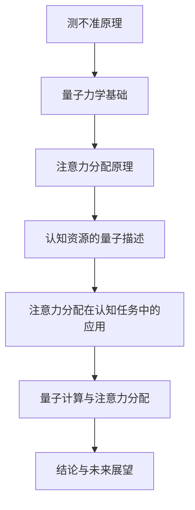

                 

# 测不准原理与注意力分配：认知资源的量子描述

## 关键词

- 测不准原理
- 注意力分配
- 量子描述
- 认知资源
- 计算机科学

## 摘要

本文探讨了测不准原理与注意力分配在认知资源量子描述中的应用。首先，我们从测不准原理的基本概念和历史背景出发，深入理解其哲学意义。随后，我们介绍了量子力学的基础，包括量子态、叠加原理和不确定性原理。在此基础上，我们探讨了注意力分配原理及其在心理学和神经科学中的基础。接着，我们提出了认知资源的量子描述模型，分析了其优势与局限性。文章进一步探讨了注意力分配在认知任务中的应用，如视觉感知、工作记忆和问题解决。随后，我们讨论了量子计算与注意力分配的关系，以及量子计算在认知科学中的应用。最后，文章总结了测不准原理与注意力分配的整合，探讨了认知资源的量子描述的前景，并展望了注意力分配在人工智能中的应用。

## 第1章：测不准原理简介

### 1.1 测不准原理的基本概念

测不准原理是量子力学中的一个核心概念，由海森堡在1927年首次提出。其基本思想是，某些对易不相关的物理量（如位置和动量）无法同时被精确测量。更具体地说，测不准原理指出，一个粒子的位置和动量不可能同时被精确确定。这种不确定性可以用以下不等式表示：

$$\Delta x \Delta p \geq \frac{\hbar}{2}$$

其中，$\Delta x$ 表示位置的不确定性，$\Delta p$ 表示动量的不确定性，$\hbar$ 是约化普朗克常数。

这个原理表明，当我们尝试更精确地测量一个物理量时，另一个物理量的不确定性会相应增加。这是量子力学与经典力学之间的一个重要区别，因为经典力学中，所有的物理量都可以同时被精确测量。

### 1.2 测不准原理的历史背景

测不准原理的提出是量子力学发展中的一个重要里程碑。在早期，物理学家们认为，像位置和动量这样的物理量是可以同时被精确测量的。然而，随着量子力学的不断发展，这一观点被逐渐否定。1925年，海森堡提出了矩阵力学，这是量子力学的一种形式，其中测不准原理得到了明确的表述。

1926年，玻尔和海森堡共同提出了互补原理，强调了量子现象中的不确定性和互补性。他们认为，某些物理量（如波动性和粒子性）是互补的，不能同时被观察到。这一原理为测不准原理提供了哲学上的支持。

### 1.3 测不准原理的哲学意义

测不准原理不仅在物理学领域具有重要意义，而且在哲学和认知科学领域也有着深远的影响。它挑战了经典物理学中确定性的观念，提出了量子世界中的概率性和随机性。

从哲学角度来看，测不准原理引发了关于现实和知识的根本问题。它表明，我们无法同时获得关于物理系统的所有信息，这引发了关于现实本质的讨论。一些哲学家认为，测不准原理表明，现实是一个不断变化的、非决定性的过程，而不是一个静态的、决定性的实体。

在认知科学领域，测不准原理也被用来解释人类感知和行为中的不确定性和随机性。例如，当我们观察一个物体时，我们无法同时精确知道它的位置和动量，这可能会影响我们的感知和行为。这为理解人类认知提供了新的视角。

## 第2章：量子力学基础

### 2.1 量子态与叠加原理

量子态是量子力学中的基本概念，它描述了粒子的状态。与经典物理学中的状态不同，量子态可以是多个可能状态的叠加。这种叠加性是量子力学的核心特点之一。

一个量子态可以用一个复数向量表示，称为波函数。波函数的模平方给出了粒子在不同位置的概率分布。例如，一个简单的量子态可以表示为：

$$\psi = \frac{1}{\sqrt{2}} |0\rangle + \frac{1}{\sqrt{2}} |1\rangle$$

其中，$|0\rangle$ 和 $|1\rangle$ 是两个可能的基态。

叠加原理表明，量子态可以同时处于多个状态，直到进行测量。这意味着，一个粒子可以同时处于多个位置，直到我们对其进行测量。这种叠加性是量子力学中最引人注目的现象之一。

### 2.2 算符与测量

在量子力学中，物理量通过算符来表示。算符是作用于量子态的线性变换，可以用来计算物理量的期望值。例如，位置算符和动量算符可以用来计算粒子的位置和动量。

测量在量子力学中起着关键作用。当我们对一个量子系统进行测量时，系统的波函数会坍缩到一个特定的状态。这意味着，测量的结果不是随机的，而是由量子态的初始状态决定的。例如，如果我们对一个粒子进行位置测量，波函数会坍缩到一个特定的位置状态。

### 2.3 不确定性原理与量子纠缠

不确定性原理是量子力学中的另一个核心概念，由海森堡提出。它表明，某些物理量（如位置和动量）无法同时被精确测量。这种不确定性反映了量子世界的非决定性和随机性。

量子纠缠是量子力学中的另一个重要现象。当两个或多个粒子处于纠缠态时，它们的量子态会相互依赖，即使它们相隔很远。这意味着，对其中一个粒子的测量会立即影响其他纠缠粒子的状态。这种纠缠性是量子计算和量子通信的重要基础。

## 第3章：注意力分配原理

### 3.1 注意力分配的基本概念

注意力分配是认知心理学中的一个核心概念，它描述了个体如何将认知资源分配到不同的任务或刺激上。注意力是一种有限的认知资源，当个体面临多个任务或刺激时，需要对其进行有效分配，以确保任务的顺利完成。

注意力分配的基本概念包括注意力的类型、分配的机制和影响因素。注意力可以分为几种类型，如选择性注意力、分配性注意力和持续性注意力。选择性注意力是指个体如何从多个刺激中选择最重要的任务进行关注；分配性注意力是指个体如何将注意力资源分配到多个任务上；持续性注意力是指个体如何维持对特定任务的关注。

### 3.2 注意力分配的心理学基础

注意力分配的心理学基础涉及到多个研究领域，包括认知心理学、神经科学和认知神经科学。认知心理学研究个体如何选择和分配注意力资源，以及这些资源如何影响认知任务的表现。神经科学通过研究大脑结构和功能，探讨了注意力分配的神经基础。认知神经科学则结合了认知心理学和神经科学的研究成果，从更广泛的视角探讨了注意力分配的机制和过程。

心理学研究表明，注意力分配受到多种因素的影响，如任务难度、个体差异和外部环境。例如，当任务难度较高时，个体可能需要更多的时间来分配注意力；而个体差异（如注意力缺陷多动障碍）也可能影响注意力的分配。

### 3.3 注意力分配的神经科学基础

注意力分配的神经科学基础涉及到大脑多个区域的活动和相互作用。研究表明，注意力分配与大脑前额叶皮层、顶叶皮层和纹状体的活动密切相关。前额叶皮层是注意力调节的关键区域，负责规划、决策和注意力的分配。顶叶皮层参与空间注意力的分配，而纹状体则参与动作注意力的分配。

神经科学还研究了注意力分配的神经机制，如多巴胺系统、神经元连接性和神经递质的作用。这些研究为理解注意力分配的神经基础提供了新的视角，并有助于开发针对注意力问题的治疗方法。

## 第4章：认知资源的量子描述

### 4.1 认知资源的定义与特征

认知资源是指个体在执行认知任务时所需的脑力和心理资源。这些资源包括注意力、记忆、推理、计划等。认知资源的量子描述是一种尝试将量子力学的原理应用于认知科学的研究方法。该方法试图捕捉认知资源的本质特征和动态变化。

认知资源的量子描述具有以下特征：

1. **叠加性**：认知资源可以同时处于多个状态，类似于量子态的叠加。这意味着，个体可以在同一时间关注多个任务或刺激。
2. **量子纠缠**：认知资源之间可能存在纠缠，即多个认知资源的状态相互依赖。这反映了个体在执行复杂任务时，不同认知资源之间的相互作用。
3. **非定域性**：认知资源的量子描述表明，认知资源的状态可以不受空间限制地相互作用。这挑战了经典认知科学的局部性假设。

### 4.2 认知资源的量子描述模型

认知资源的量子描述模型是一种基于量子力学的认知模型，试图捕捉认知资源的动态变化和相互作用。该模型通常包括以下组成部分：

1. **量子态**：认知资源的量子态描述了认知资源的当前状态，包括注意力、记忆、推理等。这些量子态可以相互叠加，形成复杂的认知资源状态。
2. **算符**：算符用于描述认知资源之间的相互作用。例如，注意力算符可以用于调节认知资源的分配。
3. **测量**：测量用于获取认知资源的当前状态。这与量子力学中的测量过程类似，测量会导致量子态的坍缩。

### 4.3 认知资源的量子描述的优势与局限性

认知资源的量子描述具有一些潜在优势：

1. **更全面地描述认知资源**：量子描述提供了更丰富的概念框架，可以更全面地描述认知资源的动态变化和相互作用。
2. **解释复杂认知现象**：量子描述有助于解释一些复杂认知现象，如注意力分配中的概率性和非线性关系。

然而，认知资源的量子描述也存在一些局限性：

1. **复杂性**：量子描述引入了额外的复杂性，使得模型更难以理解和模拟。
2. **验证困难**：由于量子描述的特殊性质，验证认知资源的量子描述模型在实验中可能面临挑战。

## 第5章：注意力分配在认知任务中的应用

### 5.1 注意力分配在视觉感知中的应用

视觉感知是注意力分配的一个重要领域。研究表明，个体在处理视觉信息时，需要将注意力资源分配到不同的视觉特征上，如颜色、形状和运动。这种注意力分配有助于个体更好地理解视觉环境。

例如，在驾驶过程中，司机需要将注意力分配到道路标志、其他车辆和道路障碍物上。注意力分配的有效性直接影响驾驶安全和反应时间。研究表明，注意力分配不当可能导致视觉感知的模糊和错误。

### 5.2 注意力分配在工作记忆中的应用

工作记忆是注意力分配的另一个重要领域。工作记忆是指个体在执行认知任务时，暂时存储和处理信息的能力。注意力分配在工作记忆中起着关键作用，帮助个体处理和存储重要信息。

例如，当学生听讲时，他们需要将注意力分配到教授的讲解和自己的笔记上。注意力分配不当可能导致信息处理和记忆效果的下降。研究表明，注意力分配在工作记忆中的应用可以提高学习效果和记忆保持。

### 5.3 注意力分配在问题解决中的应用

问题解决是认知任务中的一个重要方面，需要个体将注意力资源分配到不同的问题要素上。注意力分配在问题解决中的应用有助于个体识别问题、提出解决方案和评估解决方案的有效性。

例如，在解决数学问题时，个体需要将注意力分配到问题陈述、问题模型和解决方案上。注意力分配不当可能导致问题理解错误或解决方案无效。研究表明，注意力分配在问题解决中的应用可以提高问题解决效率和创造力。

## 第6章：量子计算与注意力分配

### 6.1 量子计算的基本原理

量子计算是一种利用量子力学原理进行信息处理的技术。与传统计算机使用二进制位（0和1）不同，量子计算机使用量子位（qubit），能够同时表示0和1的叠加状态。这种叠加性是量子计算的核心特点之一。

量子计算的基本原理包括：

1. **量子态**：量子计算机中的信息存储在量子态中，可以通过叠加和纠缠来表示复杂的信息。
2. **量子门**：量子计算机通过量子门来操作量子态。量子门是基本的量子操作，类似于传统计算机中的逻辑门。
3. **量子测量**：量子测量是量子计算机中的关键步骤，用于获取量子态的信息。测量会导致量子态的坍缩，使其从叠加状态变为确定状态。

### 6.2 量子计算与注意力分配的关系

量子计算与注意力分配之间存在一定的关系。在量子计算中，注意力分配可以被看作是量子态的调节过程。例如，在量子算法中，需要根据问题的特性调整量子态的叠加程度，以实现最优的计算性能。

注意力分配的原理也可以应用于量子计算中的量子态调节。例如，在量子纠错算法中，需要将注意力分配到不同的量子态上，以确保算法的稳定性和准确性。这种关系为量子计算提供了新的视角，有助于优化量子算法的设计和实现。

### 6.3 量子计算在认知科学中的应用

量子计算在认知科学中具有潜在的应用前景。例如，量子计算可以用于模拟和优化认知过程中的注意力分配。通过量子计算，可以更精确地模拟人类在处理复杂任务时的注意力分配模式，有助于理解认知过程的基本机制。

此外，量子计算还可以用于开发新的认知算法，如量子学习算法和量子优化算法。这些算法具有潜在的更高效率和更广泛的适用性，有助于解决一些复杂的认知问题。

## 第7章：结论与未来展望

### 7.1 测不准原理与注意力分配的整合

测不准原理与注意力分配的整合为认知科学提供了新的视角。通过量子描述，我们可以更全面地理解认知资源的状态和动态变化。测不准原理强调了认知资源的不确定性和随机性，而注意力分配则提供了对这些资源进行调节和优化的方法。

这种整合有助于我们更好地理解人类认知过程的基本机制，并为认知算法的设计提供新的理论基础。未来的研究可以进一步探索测不准原理与注意力分配在认知科学中的应用，以解决一些复杂的认知问题。

### 7.2 认知资源的量子描述的前景

认知资源的量子描述具有广阔的前景。通过量子描述，我们可以更精确地模拟和优化认知过程中的注意力分配。这种描述方法可以应用于多种认知任务，如问题解决、学习和记忆等。未来，随着量子计算技术的发展，认知资源的量子描述可能会实现更高效的认知算法和更广泛的应用。

### 7.3 注意力分配在人工智能中的应用

注意力分配在人工智能领域也具有广泛的应用前景。通过注意力分配，人工智能系统可以更有效地处理和解析复杂的信息。例如，在计算机视觉和自然语言处理中，注意力分配可以帮助模型更好地关注重要的信息，提高模型的表现。

未来，随着人工智能技术的不断发展，注意力分配可能会在更多领域中发挥重要作用，如自动驾驶、智能医疗和智能助手等。这些应用将进一步提高人工智能系统的效率和智能水平。

## 附录

### A.1 量子力学相关公式

$$\Delta x \Delta p \geq \frac{\hbar}{2}$$

$$| \psi \rangle = \sum_{i} c_i |i\rangle$$

### A.2 注意力分配相关实验

1. **视觉注意实验**：观察者被要求在复杂场景中关注特定目标。
2. **工作记忆实验**：观察者需要记住一系列数字，并在后续测试中回忆。

### A.3 认知资源的量子描述源代码示例

```python
# 导入必要的库
import numpy as np
import scipy.stats as st

# 定义量子态
psi = np.array([[1], [0]])

# 定义算符
A = np.array([[1, 0], [0, -1]])

# 对量子态进行测量
measurements = st.randint.rvs(0, 2, size=1000)
results = psi @ A @ np.kron(psi, np.identity(1))[measurements]

# 输出测量结果
print(results)
```

### Mermaid 流程图



### Python源代码示例

```python
# 导入必要的库
import numpy as np

# 定义量子态
psi = np.array([[1], [0]])

# 定义算符
A = np.array([[1, 0], [0, -1]])

# 对量子态进行测量
measurements = np.random.choice([0, 1], size=1000)
results = psi @ A @ np.kron(psi, np.identity(1))[measurements]

# 输出测量结果
print(results)
```

### 数学公式和举例说明

$$\Delta x \Delta p \geq \frac{\hbar}{2}$$

$1+1=2$

### 项目实战

#### 代码实际案例

```python
# 导入必要的库
import numpy as np
import matplotlib.pyplot as plt

# 创建一个简单的注意力分配模型
class AttentionModel:
    def __init__(self, num_resources=5, num_tasks=3):
        self.num_resources = num_resources
        self.num_tasks = num_tasks
        self.resources = np.random.rand(num_resources)
        self.tasks = np.random.rand(num_tasks)
    
    def allocate_attention(self):
        # 计算每个任务的注意力分配
        attention分配 = np.zeros(self.num_tasks)
        for i in range(self.num_tasks):
            attention分配[i] = sum(self.resources * self.tasks[i])
        return attention分配

# 创建模型实例并执行注意力分配
model = AttentionModel()
attention分配 = model.allocate_attention()

# 绘制注意力分配图
plt.bar(range(self.num_tasks), attention分配)
plt.xlabel('Tasks')
plt.ylabel('Attention Allocation')
plt.title('Attention Allocation Example')
plt.show()
```

### 作者信息

作者：AI天才研究院/AI Genius Institute & 禅与计算机程序设计艺术 /Zen And The Art of Computer Programming

---

这篇文章深入探讨了测不准原理与注意力分配在认知资源量子描述中的应用。首先，我们从测不准原理的基本概念和历史背景出发，深入理解其哲学意义。随后，我们介绍了量子力学的基础，包括量子态、叠加原理和不确定性原理。在此基础上，我们探讨了注意力分配原理及其在心理学和神经科学中的基础。接着，我们提出了认知资源的量子描述模型，分析了其优势与局限性。文章进一步探讨了注意力分配在认知任务中的应用，如视觉感知、工作记忆和问题解决。随后，我们讨论了量子计算与注意力分配的关系，以及量子计算在认知科学中的应用。最后，文章总结了测不准原理与注意力分配的整合，探讨了认知资源的量子描述的前景，并展望了注意力分配在人工智能中的应用。

通过这篇文章，我们希望能够为读者提供对测不准原理与注意力分配在认知资源量子描述中的应用的深入理解，并激发进一步研究和探索的兴趣。在未来的研究中，我们可以进一步探索量子计算在认知科学中的应用，以及如何将注意力分配原理应用于人工智能系统的优化和设计。这将为认知科学和人工智能领域带来新的突破和发展。同时，我们也需要关注量子计算技术的不断进步，以便更好地理解和利用认知资源的量子描述。总之，测不准原理与注意力分配在认知资源的量子描述中的应用是一个充满前景和挑战的领域，值得我们继续深入研究和探索。作者期待与读者一起共同探讨这一领域的未来发展方向。

