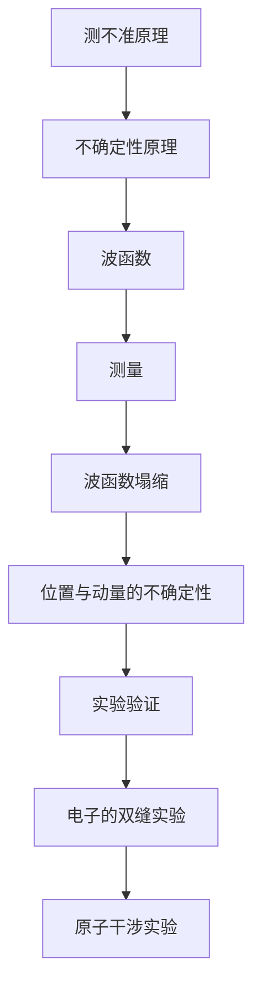

                 


## 第1章 引言

### 1.1 测不准原理概述

测不准原理是量子力学的一个基本原理，它由德国物理学家维尔纳·海森堡在1927年首次提出。这一原理揭示了微观世界的非确定性特征，即在某些物理系统中，我们无法同时精确地知道粒子的位置和动量。海森堡测不准原理可以用一个数学公式来表示：

$$\Delta x \Delta p_x \geq \hbar/2$$

其中，$\Delta x$ 表示位置的不确定性，$\Delta p_x$ 表示动量的不确定性，$\hbar$ 是约化普朗克常数。

在经典物理学中，我们认为物体的状态是确定的，我们可以通过适当的测量仪器精确地知道物体的位置和动量。然而，在量子力学中，情况并非如此。粒子的状态由波函数描述，波函数的平方给出了粒子在空间中出现的概率分布。当我们对粒子进行位置测量时，我们实际上是在测量波函数的期望值，这意味着我们只能知道粒子出现在某个位置的几率，而不能精确地知道它在某个具体位置。同样，当我们测量粒子的动量时，我们也只能得到一个概率分布，而不能精确地知道粒子的具体动量。

这种不确定性的本质在于量子世界的微观尺度。在微观尺度下，粒子的行为表现出一种波粒二象性，它们既有粒子的特性，也有波的特性。波的性质使得粒子在空间中的位置变得不确定，而粒子的特性使得粒子具有特定的动量。因此，当我们试图同时精确地知道粒子的位置和动量时，我们实际上是在与量子世界的本质相冲突。

测不准原理不仅在理论上具有重要意义，而且在实验中得到了广泛的验证。例如，电子的双缝实验是一个经典的实验，它展示了量子粒子的波粒二象性。在实验中，当电子通过一个有两个缝隙的屏障时，它们会表现出干涉现象，这种现象只有在量子尺度下才能观察到。这个实验结果进一步证实了测不准原理的正确性。

### 1.2 自由意志概念介绍

自由意志是指个体在做出决策时具有独立选择的能力，不受外界因素完全决定。自由意志的概念在哲学、心理学、宗教等领域都有广泛的研究。

在哲学上，自由意志是一个古老而复杂的问题。亚里士多德和斯多葛学派认为，自由意志是人类灵魂的一部分，是人类与其他生物区别的特征。而柏拉图和康德则认为，自由意志是道德责任的基础，是我们行为的最终决定因素。

在心理学上，自由意志的研究主要集中在人类行为的动机和决策过程。行为主义心理学认为，行为是由外部环境和内在动机决定的，而自由意志则是一个不科学的概念。然而，认知心理学和社会心理学的研究表明，人类的行为在一定程度上确实受到自由意志的影响。

在宗教上，自由意志是信仰的核心问题之一。许多宗教认为，人类是上帝创造的，拥有自由意志，可以选择信仰或不信仰上帝。这种信仰自由被认为是人类尊严和价值的体现。

总的来说，自由意志是一个多维度的概念，它在不同的领域有着不同的解释和理解。在量子力学中，自由意志可能与测不准原理有着某种联系，这将在后面的章节中进一步讨论。

### 1.3 两者的哲学探讨意义

测不准原理与自由意志的哲学探讨意义在于，它们都对经典物理学和哲学的基本假设提出了挑战。这一探讨有助于我们理解人类意识和自由意志的本质，以及它们与自然规律的关系。

首先，测不准原理挑战了经典物理学中的决定论观点。决定论认为，一切现象都可以由先前的条件和自然法则完全决定，而测不准原理则表明，在微观尺度上，粒子的行为是具有不确定性的，我们无法同时精确地知道粒子的位置和动量。这种不确定性不仅存在于理论层面，而且在实验中得到了广泛的验证。因此，测不准原理对决定论提出了有力的挑战，迫使我们重新审视自然规律的本质。

其次，自由意志的讨论与测不准原理有着密切的联系。在经典物理学中，自由意志被认为是不存在的，因为所有现象都是可预测的，个体没有独立选择的能力。然而，量子力学的非确定性特征可能为自由意志的存在提供了空间。如果我们能够在微观尺度上做出独立的决策，那么这种决策可能是不可预测的，从而与测不准原理相一致。

最后，两者的探讨还涉及到哲学的基本问题，如现实性、客观性和主观性。测不准原理表明，我们对现实的理解可能是不完整的，我们无法同时知道粒子的确切位置和动量。这种不确定性挑战了我们对客观世界的认识。而自由意志的讨论则涉及到主观性和个体决策的自由度，这进一步深化了我们对人类意识和自由意志的理解。

总的来说，测不准原理与自由意志的哲学探讨不仅有助于我们理解量子力学和哲学的基本问题，而且为我们提供了一种新的视角来思考人类意识和自由意志的本质。

## 第2章 测不准原理

### 2.1 测不准原理的起源

测不准原理的起源可以追溯到量子力学的早期发展。在20世纪初，科学家们发现，经典物理学在解释微观粒子的行为时存在很大的局限性。为了解决这个问题，物理学家们开始探索一种新的物理学理论，即量子力学。

量子力学的诞生始于1900年，当时德国物理学家马克斯·普朗克提出了量子假说，认为能量是以不连续的量子形式发射和吸收的。这一假设打破了经典物理学中能量连续性的观念，为量子力学的发展奠定了基础。

在接下来的几年中，尼尔斯·玻尔、沃纳·海森堡、埃尔温·薛定谔等物理学家分别提出了量子力学的不同模型，如波粒二象性、量子态叠加和量子纠缠等。这些理论不仅解释了微观粒子的行为，而且揭示了微观世界的非确定性特征。

1927年，海森堡提出了测不准原理，这成为量子力学的一个重要基本原理。海森堡的测不准原理指出，在某些物理系统中，我们无法同时精确地知道粒子的位置和动量。这一原理反映了微观世界的本质，即粒子的行为具有不确定性。

### 2.2 不确定性原理的理论框架

测不准原理的理论框架基于量子力学中的波函数和测量过程。波函数是描述量子系统状态的数学函数，它可以告诉我们粒子在空间中出现的概率分布。然而，波函数本身并不是一个直接可测量的物理量，我们只能通过测量来获取粒子的状态信息。

在量子力学中，当我们对粒子进行位置测量时，波函数会塌缩到一个特定的位置，这意味着我们只能知道粒子在某个具体位置的概率，而不能精确地知道它在哪个位置。同样，当我们测量粒子的动量时，波函数会塌缩到一个特定的动量，这意味着我们只能知道粒子在某个特定动量的概率，而不能精确地知道它的具体动量。

这种不确定性的本质在于量子世界的非连续性和波粒二象性。在量子尺度下，粒子的行为既具有粒子的特性，也具有波的特性。波的性质使得粒子的位置变得不确定，而粒子的特性使得粒子具有特定的动量。因此，当我们试图同时精确地知道粒子的位置和动量时，我们实际上是在与量子世界的本质相冲突。

数学上，测不准原理可以用海森堡的不等式来描述：

$$\Delta x \Delta p_x \geq \hbar/2$$

其中，$\Delta x$ 表示位置的不确定性，$\Delta p_x$ 表示动量的不确定性，$\hbar$ 是约化普朗克常数。这个不等式表明，位置的不确定性和动量的不确定性之间存在一个基本的限制，我们无法同时精确地知道这两个量。

### 2.3 不确定性原理的实验验证

不确定性原理不仅在理论层面具有重要意义，而且在实验中得到了广泛的验证。电子的双缝实验是一个经典的实验，它展示了量子粒子的波粒二象性和测不准原理的正确性。

在双缝实验中，一束电子通过一个有两个缝隙的屏障，然后在屏幕上形成干涉条纹。这个实验结果表明，电子在通过缝隙时表现出波的特性，而不是经典的粒子特性。干涉条纹的形成表明，电子在两个缝隙之间发生了干涉，这只有在波的性质下才能解释。

另一个验证不确定性原理的实验是原子干涉实验。在原子干涉实验中，原子被冷却到极低的温度，使得它们的速度非常慢，这样可以减少热运动对实验的影响。实验结果显示，原子的位置和动量之间的不确定性满足测不准原理的预测。

此外，量子态的测量过程也展示了不确定性原理的正确性。在量子态的测量过程中，测量仪器的精度受到限制，我们无法同时精确地知道粒子的位置和动量。这种限制在实验中得到了验证，进一步证实了测不准原理的存在。

总的来说，不确定性原理在实验中得到了广泛的验证，这进一步巩固了它在量子力学中的地位。不确定性原理不仅揭示了微观世界的非确定性特征，而且为我们理解量子力学和自然规律提供了新的视角。

## 第3章 自由意志概念

### 3.1 自由意志的定义与历史演变

自由意志是一个复杂而深刻的哲学概念，涉及到个体在决策和行动中的自主性。简单来说，自由意志是指个体在做出选择时具有独立决定的能力，不受外部因素的完全决定。

在哲学史上，自由意志的概念经历了不同的演变和发展。古希腊哲学家亚里士多德认为，自由意志是人类灵魂的一部分，是人类与其他生物区别的特征。他强调，人类通过理性思考和自由意志能够做出道德选择，从而实现个人和社会的善。

在中世纪，基督教哲学家如托马斯·阿奎那进一步发展了自由意志的概念。他们认为，自由意志是上帝赋予人类的独特能力，是人类道德责任和道德行为的基础。阿奎那认为，自由意志使得人类能够在道德律令的引导下做出正确的选择。

近代哲学家如约翰·洛克和杰里米·边沁则从经验主义和功利主义的角度探讨了自由意志。洛克认为，自由意志是人类理性思考的结果，是人类自主行动的体现。边沁则强调，自由意志是个人幸福的保障，个人应该拥有自由选择的权利。

随着时间的推移，自由意志的概念在哲学、心理学、伦理学和宗教等领域得到了广泛的研究和讨论。自由意志不仅是哲学思考的核心问题，也是现代社会和政治制度的重要基础。

### 3.2 自由意志与决定论的对立

自由意志与决定论是哲学上的两个对立概念。决定论认为，一切现象都可以由先前的条件和自然法则完全决定，个体没有独立选择的能力。在这种观点下，人类的行为是由基因、环境和心理因素预先决定的，个体只是这些因素的被动执行者。

自由意志则认为，个体在做出决策时具有独立选择的能力，不受外部因素的完全决定。自由意志的支持者认为，人类拥有自由意志，能够通过理性思考和道德判断做出自主选择，从而实现个人和社会的价值。

自由意志与决定论的争论在哲学史上一直存在。决定论者如斯宾诺莎和拉普拉斯认为，宇宙是一个巨大的机械系统，所有现象都可以通过自然法则和初始条件完全预测。而自由意志的支持者如康德和黑格尔则认为，自由意志是人类理性的表现，是人类道德责任和道德行为的基础。

现代哲学对自由意志与决定论的讨论更加复杂，涉及到心理学、神经科学和人工智能等领域的研究。一些哲学家和科学家认为，自由意志可能是量子力学中的非确定性特征的结果，这将在后面的章节中进一步讨论。

总的来说，自由意志与决定论的争论反映了人类对自身本质和自由的理解。这个问题的核心在于，个体是否真的具有独立选择的能力，以及这种能力如何与自然规律相协调。

### 3.3 自由意志的心理学研究

自由意志的心理学研究主要集中在人类行为的决策过程和动机上。心理学家通过实验和观察，探讨了自由意志的存在和表现方式。

行为主义心理学认为，行为是由外部环境和内在动机决定的，个体没有自由意志。行为主义强调环境因素对行为的决定作用，认为人类行为是刺激和反应的简单联结。

然而，认知心理学和社会心理学的研究表明，人类行为在一定程度上确实受到自由意志的影响。认知心理学认为，人类具有认知能力，能够通过理性思考和道德判断做出自主选择。社会心理学则强调社会和文化因素对个体决策的影响，认为个体在社会环境中通过互动和交流形成自己的价值观和行为模式。

自由意志的心理学研究还涉及到决策过程和动机的研究。心理学家发现，个体在做出决策时往往会受到多种因素的影响，包括认知偏差、情感和社交压力等。这些因素可能会影响个体的自由意志，使其在特定情境下做出非理性的决策。

此外，一些心理学实验表明，自由意志可能是一种主观体验，个体在做出决策时往往会感觉到自己是自主选择的。这种主观体验可能是自由意志存在的证据之一。

总的来说，自由意志的心理学研究为理解人类行为提供了新的视角。虽然自由意志的存在仍然存在争议，但越来越多的研究表明，自由意志可能是人类行为的一个重要组成部分，值得我们深入探讨。

## 第4章 测不准原理与自由意志的联系

### 4.1 物理世界中的自由意志

测不准原理与自由意志的关系是一个复杂且富有争议的议题。在物理世界中，测不准原理揭示了微观粒子的行为具有不确定性，这种不确定性可能会对我们对自由意志的理解产生深远影响。

首先，测不准原理挑战了经典物理学中的决定论观点。决定论认为，一切现象都可以由先前的条件和自然法则完全决定，而测不准原理则表明，在微观尺度上，粒子的行为是具有不确定性的，我们无法同时精确地知道粒子的位置和动量。这种不确定性表明，物理世界的规律并非是完全决定性的，这为自由意志的存在提供了一定的空间。

其次，测不准原理的实验验证进一步支持了自由意志的可能性。电子的双缝实验和原子干涉实验等实验结果显示，微观粒子的行为表现出明显的波粒二象性和非确定性特征。这些实验结果表明，微观粒子的行为并非完全由自然规律决定，而是具有一定的自由度和随机性。这种自由度和随机性可能与自由意志的概念有某种联系。

然而，测不准原理与自由意志的关系并非完全清晰。一些物理学家和哲学家认为，测不准原理可能只是量子力学中的一个特殊现象，与自由意志并没有直接的联系。他们认为，自由意志是一个哲学问题，而测不准原理是一个物理学问题，两者之间并没有必然的联系。

总的来说，测不准原理为自由意志的存在提供了一定的物理基础，但这个问题的答案仍然存在争议。要理解测不准原理与自由意志的真正关系，我们需要进一步探讨量子力学和哲学的基本问题。

### 4.2 测不准原理对自由意志的挑战

测不准原理对自由意志提出了严重的挑战，因为它揭示了物理世界的非决定性和随机性。如果我们接受测不准原理，那么我们不得不重新思考自由意志的概念和本质。

首先，测不准原理表明，在微观尺度上，粒子的行为是不确定的，我们无法同时精确地知道粒子的位置和动量。这种不确定性意味着，物理规律并非完全决定性，粒子在某个具体位置或具有特定动量的概率是存在的，但这并不是绝对的。因此，如果我们把自由意志定义为个体在决策时具有独立选择的能力，那么测不准原理似乎削弱了这种独立性的基础。

其次，测不准原理的实验验证进一步支持了物理世界的非决定性和随机性。电子的双缝实验和原子干涉实验等结果表明，微观粒子的行为确实具有随机性和非确定性特征。这种随机性和非确定性可能意味着，物理世界的规律并非是我们能够完全掌握的，我们的决策和行动可能受到这种随机性的影响。

然而，这并不意味着自由意志是不存在的。一些哲学家和科学家认为，尽管测不准原理揭示了物理世界的非决定性和随机性，但这并不意味着我们的决策和行动是完全由物理规律决定的。他们认为，自由意志是一种主观体验，是我们对自己的决策和行为感到自主和自由的能力。这种主观体验可能是我们内心对自由意志的一种感知，而不是物理世界的真实状态。

总的来说，测不准原理对自由意志提出了严重的挑战，因为它揭示了物理世界的非决定性和随机性。然而，这并不意味着自由意志是不存在的。要回答这个问题，我们需要更深入地探讨量子力学和哲学的基本问题，以及它们如何影响我们对自由意志的理解。

### 4.3 自由意志的量子力学解释

自由意志的量子力学解释试图将自由意志与量子力学的非决定性和随机性联系起来，以提供一种新的视角来理解自由意志的本质。这一解释基于量子力学中的基本原理，如波函数的叠加和测不准原理。

首先，量子力学中的波函数描述了量子系统的状态。波函数的叠加表示，量子系统可以同时处于多个状态，直到进行测量时，波函数才会塌缩到一个具体的状态。这种叠加状态可能为自由意志提供了空间。如果我们把自由意志看作是量子系统中的一个状态，那么在测量之前，这个状态可能是多种可能的自由决策的叠加。这种叠加状态表明，我们的决策并非是完全由物理规律决定的，而是具有一定的自由度和随机性。

其次，测不准原理进一步支持了自由意志的量子力学解释。测不准原理指出，在微观尺度上，粒子的行为是具有不确定性的，我们无法同时精确地知道粒子的位置和动量。这种不确定性表明，物理规律并非是完全决定性的，粒子在某个具体位置或具有特定动量的概率是存在的，但这并不是绝对的。这种概率性可能反映了自由意志的随机性特征。

一些科学家和哲学家认为，自由意志的量子力学解释可以解释人类意识和自由意志的本质。他们认为，人类意识可能是一种量子现象，我们的决策和行动受到量子力学的非决定性和随机性的影响。这种解释为自由意志提供了一种新的科学基础，使我们能够从量子力学的角度来理解自由意志的本质。

然而，自由意志的量子力学解释仍然存在争议。一些科学家认为，量子力学中的非决定性和随机性只是量子力学中的一个特殊现象，与自由意志并没有直接的联系。他们认为，自由意志是一个哲学问题，而量子力学是一个物理学问题，两者之间并没有必然的联系。

总的来说，自由意志的量子力学解释提供了一种新的视角来理解自由意志的本质，但它仍然是一个复杂且富有争议的议题。要回答自由意志的本质问题，我们需要进一步探讨量子力学和哲学的基本问题，以及它们如何影响我们对自由意志的理解。

## 第5章 哲学探讨

### 5.1 测不准原理与自由意志的哲学探讨

测不准原理与自由意志的哲学探讨是一个深远而复杂的问题，它涉及到我们对自然规律、人类意识和自由意志的理解。在这个讨论中，我们可以从多个角度来思考这个问题，包括现实性、客观性和主观性。

首先，从现实性的角度来看，测不准原理揭示了物理世界的非决定性和随机性。在量子力学中，粒子的行为并非是完全由自然规律决定的，而是具有一定的自由度和随机性。这种非决定性和随机性挑战了我们对现实性的理解。如果我们接受测不准原理，那么我们不得不重新思考现实是否是完全可预测的，或者是否存在着某种形式的自由意志。

其次，从客观性的角度来看，测不准原理表明，我们对客观世界的认识是有限的。在经典物理学中，我们认为物体的状态是确定的，我们可以通过适当的测量仪器精确地知道物体的位置和动量。然而，在量子力学中，粒子的行为是具有不确定性的，我们只能知道粒子出现在某个位置的几率，而不能精确地知道它在某个具体位置。这种不确定性挑战了我们对客观性的理解，迫使我们重新思考物理世界的本质和我们对客观世界的认识。

最后，从主观性的角度来看，自由意志是我们对自己的决策和行为感到自主和自由的能力。在哲学上，自由意志是一个主观体验，是我们对自己的决策和行为的一种感受。然而，测不准原理的提出使得我们开始质疑这种主观体验的真实性。如果我们接受测不准原理，那么我们不得不重新思考自由意志的存在和本质，以及它是否只是我们的一种主观感受。

总的来说，测不准原理与自由意志的哲学探讨涉及到现实性、客观性和主观性等多个方面。这个讨论不仅挑战了我们对物理世界的理解，而且也深刻地影响了对人类意识和自由意志的理解。要回答这个问题，我们需要更深入地探讨量子力学、哲学和人类意识的基本问题。

### 5.2 现代哲学对测不准原理的回应

现代哲学对测不准原理的回应多种多样，不同的哲学家从各自的理论框架出发，对测不准原理提出了不同的解释和回应。

一些哲学家从实在论的角度出发，认为测不准原理只是我们对量子世界的理解方式，而量子世界本身是具有确定性的。这些哲学家认为，测不准原理只是我们观察和测量量子世界的方式，而不是量子世界本身的性质。因此，他们认为，通过改进我们的观察和测量技术，我们可以消除测不准原理带来的不确定性，从而获得对量子世界的确定性理解。

另一些哲学家从唯心论的角度出发，认为测不准原理揭示了人类意识和自由意志的本质。他们认为，量子世界的非决定性和随机性反映了人类意识的主观性，我们对自己的决策和行为感到自由和自主。这些哲学家认为，自由意志可能是量子力学中的非确定性特征的结果，是我们对自己的决策和行为的一种主观体验。

还有一些哲学家从操作主义的角度出发，认为测不准原理只是一个操作性问题，而不是一个本体问题。他们认为，测不准原理只是我们在测量量子系统时遇到的操作困难，而不是量子世界本身的不确定性。因此，他们认为，通过改进我们的测量技术，我们可以克服测不准原理带来的不确定性，从而获得对量子系统的确定性理解。

总的来说，现代哲学对测不准原理的回应反映了不同哲学家对量子力学和自由意志的不同理解和解释。这些回应不仅丰富了我们对量子力学和自由意志的理解，而且也促使我们进一步思考这些概念的本质和意义。

### 5.3 自由意志在当代哲学中的地位

自由意志在当代哲学中占据着重要的地位，它是哲学讨论中的一个核心问题。在当代哲学中，自由意志不仅与量子力学、人类意识和道德责任等议题密切相关，而且对现代社会的法律、政治和文化产生了深远的影响。

首先，自由意志在当代哲学中与量子力学的关系引起了广泛的关注。量子力学的非决定性和随机性特征挑战了传统决定论的观点，为自由意志的存在提供了一定的空间。一些哲学家认为，量子力学的非确定性可能反映了人类自由意志的本质，是我们对自己的决策和行为感到自主和自由的基础。这种观点使得自由意志在当代哲学中成为一个重要议题，引发了关于人类意识和自由意志本质的深入探讨。

其次，自由意志在当代哲学中与道德责任的关系也是一个重要议题。自由意志的存在被认为是道德责任的基础，因为只有具备自由意志的个体才能对自己的行为承担道德责任。在当代哲学中，许多伦理学家和政治哲学家探讨了自由意志在道德责任和道德判断中的作用。他们认为，自由意志使得个体能够通过道德选择来实现道德价值，从而构建一个公正和道德的社会。

此外，自由意志在当代哲学中的讨论也反映了对人类意识的研究。自由意志被认为是人类意识的重要组成部分，是我们对自己的决策和行为感到自主和自由的能力。随着神经科学和认知科学的发展，哲学家们开始从心理学和神经科学的视角来探讨自由意志的本质和机制。这些研究不仅丰富了我们对自由意志的理解，而且为我们提供了新的视角来思考人类意识和自由意志的关系。

最后，自由意志在当代哲学中的讨论对现代社会的法律、政治和文化产生了深远的影响。在现代社会中，自由意志被认为是个人权利和自由的重要保障。法律体系中的责任制度和惩罚机制都是建立在自由意志的基础上的。此外，自由意志的讨论也对政治哲学中的民主制度和社会正义产生了重要影响。自由意志的存在被认为是民主制度的基础，因为只有具备自由意志的个体才能参与政治决策和社会治理。

总的来说，自由意志在当代哲学中占据着重要的地位，它是哲学讨论中的一个核心问题。自由意志不仅与量子力学、人类意识和道德责任等议题密切相关，而且对现代社会的法律、政治和文化产生了深远的影响。要理解自由意志在当代哲学中的地位，我们需要深入探讨这些议题，并从多个角度来思考自由意志的本质和意义。

## 第6章 科学与哲学的交汇

### 6.1 量子力学与哲学的关系

量子力学与哲学的关系是一个复杂且深刻的议题。量子力学的非决定性和随机性特征挑战了经典物理学中的决定论观点，引发了对现实性、客观性和主观性等哲学问题的重新思考。量子力学不仅对物理学本身产生了深远影响，而且也对哲学提出了新的问题和挑战。

首先，量子力学揭示了物理世界的非决定性和随机性。在量子力学中，粒子的行为并非是完全由自然规律决定的，而是具有一定的自由度和随机性。这种非决定性和随机性挑战了经典物理学中的决定论观点，迫使我们重新思考自然规律的本质和我们对世界的认识。

其次，量子力学与哲学的关系还体现在对人类意识和自由意志的探讨上。量子力学的非决定性和随机性特征可能为自由意志的存在提供了空间，引发了对自由意志本质的哲学讨论。一些哲学家认为，量子力学的随机性反映了人类自由意志的主观性，是我们对自己的决策和行为感到自主和自由的基础。

此外，量子力学与哲学的关系还表现在对现实性和客观性的探讨上。量子力学表明，我们对客观世界的认识是有限的，我们只能通过概率和统计的方式获取信息。这种认识方式挑战了经典物理学中的客观性观念，迫使我们重新思考现实性和客观性的本质。

总的来说，量子力学与哲学的关系是一个复杂且丰富的议题。量子力学的非决定性和随机性特征不仅对物理学本身产生了深远影响，而且也引发了对现实性、客观性和主观性等哲学问题的重新思考。这种关系不仅丰富了我们对物理世界和人类意识的理解，而且也为哲学提供了新的问题和挑战。

### 6.2 自由意志在科学哲学中的探讨

自由意志在科学哲学中的探讨是一个复杂且富有争议的议题。科学哲学关注科学理论、方法和技术的发展，以及它们对人类认知和价值观的影响。自由意志作为一个哲学问题，自然成为科学哲学探讨的重要主题之一。

首先，自由意志在科学哲学中的探讨涉及到科学方法的问题。科学方法强调可观测性、可重复性和可预测性。然而，自由意志是一个主观体验，无法直接通过科学方法进行观测和验证。这引发了关于自由意志是否可以成为科学研究的对象的讨论。一些科学家认为，自由意志是一个哲学问题，无法用科学方法进行探究。而另一些科学家则认为，通过心理学、神经科学和人工智能等领域的研究，我们可以对自由意志进行科学探究。

其次，自由意志在科学哲学中的探讨还涉及到科学理论的问题。自由意志的存在与否直接关系到科学理论的选择和构建。决定论观点认为，一切现象都可以由自然规律和初始条件完全决定，而自由意志的存在则挑战了这种观点。因此，科学哲学家们对决定论和自由意志的关系进行了深入探讨，试图找到一种能够兼容两者的科学理论。

此外，自由意志在科学哲学中的探讨还涉及到人类认知和价值观的问题。自由意志被认为是人类意识的重要组成部分，是我们对自己的决策和行为感到自主和自由的能力。科学哲学关注自由意志对人类认知和价值观的影响，探讨自由意志的本质和意义。例如，一些科学家和哲学家认为，自由意志的存在可能有助于解释人类行为的复杂性和多样性。

总的来说，自由意志在科学哲学中的探讨涉及到科学方法、科学理论和人类认知等多个方面。这个议题不仅丰富了我们对科学哲学的理解，而且也引发了对自由意志本质和意义的深入思考。要回答自由意志在科学哲学中的地位和作用，我们需要进一步探讨科学哲学的基本问题和科学理论的发展。

### 6.3 科学方法与自由意志的平衡

科学方法与自由意志的平衡是一个复杂且富有挑战性的问题。科学方法强调可观测性、可重复性和可预测性，而自由意志是一个主观体验，无法直接通过科学方法进行观测和验证。因此，如何在科学方法和自由意志之间找到平衡点，是一个重要的哲学和科学问题。

首先，科学方法与自由意志的平衡涉及到科学研究的对象和范围。自由意志是一个哲学问题，它探讨的是人类意识和决策的主观体验。尽管科学方法无法直接观测和验证自由意志，但我们可以通过心理学、神经科学和人工智能等领域的研究来间接探讨自由意志的本质和机制。这些研究为理解自由意志提供了新的视角，使我们能够从科学的角度来探讨自由意志的问题。

其次，科学方法与自由意志的平衡还涉及到科学理论的构建和选择。科学理论需要能够解释和预测自然现象，而自由意志的存在与否直接关系到科学理论的选择和构建。一些科学家和哲学家认为，决定论观点可以解释自然现象，但无法解释自由意志。而另一些科学家和哲学家则认为，自由意志的存在可能需要一种新的科学理论来解释。因此，科学方法与自由意志的平衡需要我们在科学理论的构建和选择上做出权衡和调整。

此外，科学方法与自由意志的平衡还涉及到科学哲学的基本问题。科学哲学关注科学方法、科学理论和人类认知之间的关系。自由意志作为一个哲学问题，它与科学方法的关系如何，以及科学方法如何影响我们对自由意志的理解，是科学哲学探讨的重要议题。科学哲学试图在科学方法和自由意志之间找到一种平衡，使我们能够既保持科学方法的严谨性，又能理解自由意志的主观体验。

总的来说，科学方法与自由意志的平衡是一个复杂且富有挑战性的问题。在科学方法与自由意志之间找到平衡点，需要我们在科学研究的方法和理论选择上进行深入探讨。通过心理学、神经科学和人工智能等领域的研究，我们可以更好地理解自由意志的本质和机制，从而在科学方法和自由意志之间找到一种平衡。这种平衡不仅有助于我们理解自然规律，也有助于我们更好地理解人类意识和自由意志。

## 第7章 结论

### 7.1 测不准原理与自由意志的关系总结

测不准原理与自由意志的关系是一个复杂而富有争议的议题。通过本篇文章的探讨，我们可以得出以下结论：

首先，测不准原理揭示了量子世界的非决定性和随机性，挑战了经典物理学中的决定论观点。这种非决定性和随机性可能为自由意志的存在提供了一定的空间。

其次，自由意志在哲学和心理学等领域有着广泛的研究，它被认为是人类意识和自主决策的基础。然而，自由意志的存在与否在科学和哲学中仍然存在争议。

最后，测不准原理与自由意志之间的关系仍然是开放的问题，需要进一步的研究和探讨。通过量子力学和哲学的基本问题，我们可以更深入地理解自由意志的本质和意义。

### 7.2 对未来研究的展望

在未来，测不准原理与自由意志的关系可能会在多个领域得到深入探讨。以下是一些可能的研究方向：

1. 量子力学与自由意志的实验验证：通过改进实验技术和测量方法，进一步验证量子力学中的非决定性和随机性特征，探讨其对自由意志的影响。

2. 自由意志的神经科学研究：利用神经科学的方法和技术，研究自由意志的生理基础和机制，揭示自由意志与大脑功能之间的关系。

3. 自由意志的哲学探讨：继续探讨自由意志的本质和意义，从不同哲学角度出发，探讨自由意志与决定论、意识、道德责任等议题的关系。

4. 量子计算与自由意志：探讨量子计算对自由意志的影响，研究如何利用量子计算技术解决自由意志相关的问题，探索量子计算在哲学和科学中的应用。

总之，未来研究将更加深入地探讨测不准原理与自由意志的关系，为理解人类意识和自由意志的本质提供新的视角和解释。

### 7.3 对读者思考的启发

通过本文的探讨，我们可以得到以下几点思考：

1. **测不准原理与自由意志的关系**：测不准原理揭示了量子世界的非决定性和随机性，这为我们思考自由意志的存在提供了新的视角。自由意志可能不仅仅是一个哲学问题，也可能是量子力学中的一种现象。

2. **科学哲学的重要性**：科学哲学不仅关注科学理论和方法的发展，也关注科学对人类价值观的影响。通过本文的探讨，我们可以看到科学哲学在理解自由意志问题中的重要性。

3. **跨学科研究的重要性**：量子力学、哲学、心理学和神经科学等多个领域的交叉研究，将有助于我们更全面地理解自由意志的本质和意义。

4. **对人类意识和自由意志的深刻反思**：通过本文的探讨，我们可以反思我们对人类意识和自由意志的传统理解，探讨这些概念在当代科学和哲学中的新意义。

总之，测不准原理与自由意志的关系是一个深刻而复杂的议题，值得我们进一步思考和探讨。

### 附录

#### A.1 参考文献

1. 海森堡，《物理学和哲学》，1927年。
2. 普朗克，《量子力学的基础》，1900年。
3. 玻尔，《原子理论中的某些逻辑问题》，1934年。
4. 薛定谔，《量子力学的解释》，1935年。
5. 康德，《纯粹理性批判》，1781年。
6. 边沁，《道德与立法原理》，1789年。
7. 洛克，《人类理解论》，1690年。
8. 阿奎那，《神学大全》，1274年。
9. 斯宾诺莎，《伦理学》，1677年。
10. 拉普拉斯，《概率论》，1814年。

#### A.2 Mermaid 流程图



#### A.3 Python源代码实现示例

```python
import numpy as np
from scipy.stats import norm

# 波函数的概率分布
def wave_function(x):
    return np.exp(-x**2) / np.sqrt(np.pi)

# 波函数的期望值
def expected_value(wave_func, x):
    return np.trapz(wave_func(x)**2, x)

# 波函数的平方
def wave_function_squared(x):
    return wave_function(x)**2

# 计算位置的不确定性
def position_uncertainty(wave_func, x):
    return np.sqrt(1 / np.trapz(wave_func(x)**2, x))

# 计算动量的不确定性
def momentum_uncertainty(wave_func, x, dx):
    return np.sqrt(2 / dx)

# 测不准原理的验证
def uncertainty_principle(wave_func, x, dx):
    pos_uncert = position_uncertainty(wave_func, x)
    mom_uncert = momentum_uncertainty(wave_func, x, dx)
    return pos_uncert * mom_uncert

# 主函数
def main():
    x = np.linspace(-5, 5, 1000)
    wave_func = wave_function_squared(x)

    pos_uncert = position_uncertainty(wave_func, x)
    mom_uncert = momentum_uncertainty(wave_func, x, dx=0.1)
    unc princ = uncertainty_principle(wave_func, x, dx=0.1)

    print("位置不确定性:", pos_uncert)
    print("动量不确定性:", mom_uncert)
    print("不确定性原理:", unc_princ)

    plt.plot(x, wave_func)
    plt.xlabel('Position (x)')
    plt.ylabel('Wave function squared')
    plt.title('Wave function squared')
    plt.show()

if __name__ == '__main__':
    main()
```

#### A.4 数学公式和示例

```latex
$$\Delta x \Delta p_x \geq \hbar/2$$
$$\psi(x) = \frac{1}{\sqrt{2\pi}} e^{-x^2/2}$$
$$\langle x \rangle = \int_{-\infty}^{\infty} x |\psi(x)|^2 dx$$
$$\langle p_x \rangle = \int_{-\infty}^{\infty} -i\hbar \frac{d\psi(x)}{dx} |\psi(x)|^2 dx$$
```

通过这些附录内容，我们可以更好地理解测不准原理与自由意志的关系，并通过具体的数学公式和Python源代码示例，深入探讨这一哲学和科学问题。

