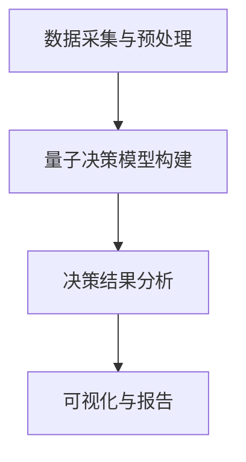
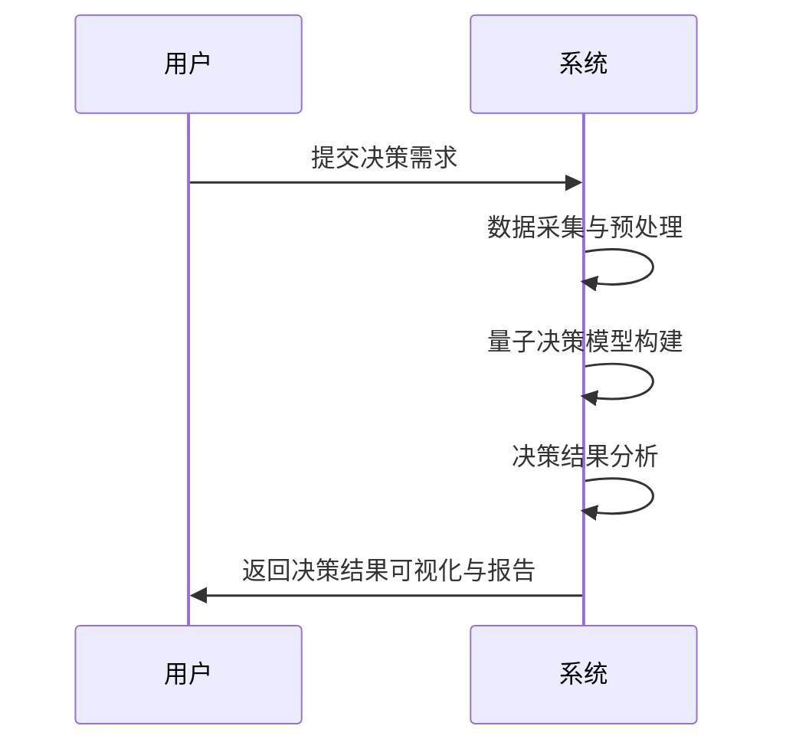

                 

## 《测不准原理与自由意志：决策过程的量子不确定性》

在量子力学和哲学的交汇处，我们触及到一个深刻的悖论：测不准原理与自由意志。经典物理学告诉我们，物质的运动是确定的，遵循牛顿的定律。但量子力学的出现颠覆了这一观念，揭示了微观世界中的随机性和不确定性。而自由意志，作为哲学讨论的焦点，关乎个体行为选择的根源。这两者的冲突在决策过程中尤为显著。本文将带领读者一步步探索这一主题，探讨量子不确定性对人类决策过程的影响。

### 关键词

- **测不准原理**
- **自由意志**
- **决策过程**
- **量子纠缠**
- **量子计算**
- **不确定性原理**

### 摘要

本文旨在探讨量子力学中的测不准原理与自由意志之间的关系，以及这种关系如何影响决策过程。通过分析量子力学的基本概念和测不准原理，我们将探讨量子力学如何挑战自由意志的概念。接着，我们将探讨量子力学与自由意志的哲学探讨，分析个体主义与集体主义的不同观点。最后，我们将探讨量子不确定性在决策过程中的具体应用，包括量子决策理论、模型及其在投资和人力资源管理中的应用，以及量子不确定性与决策心理的影响。

## 第一部分：测不准原理概述

### 第1章：量子力学与测不准原理

#### 1.1 量子力学的基本概念

量子力学是研究微观粒子行为的物理学分支，它揭示了经典物理学无法解释的现象。量子力学的基本概念包括波粒二象性、算符与态函数、波函数坍缩和量子态叠加。

**波粒二象性**：微观粒子既具有波动性也具有粒子性，例如电子既可以通过晶体产生衍射图案，也可以在光电效应中被光子击出。

**算符与态函数**：在量子力学中，物理量（如位置、动量）不是直接测量的，而是通过对应的算符作用在态函数上来描述。态函数是复值函数，用于描述粒子在某个状态下的概率分布。

**波函数坍缩**：量子态在未被观测时是叠加态，但在观测时，态函数会坍缩到一个确定的状态。这个现象是量子力学中不确定性原理的核心。

**量子态叠加**：量子态可以同时处于多个状态，这种叠加态只有在进行测量时才会坍缩到一个确定的状态。

#### 1.2 测不准原理的核心概念

测不准原理是由海森堡提出的，其核心思想是粒子的某些对偶变量（如位置和动量）不能同时被精确测量。数学上，这个原理可以用不确定性原理来表示：

$$ \Delta x \Delta p \geq \frac{\hbar}{2} $$

其中，$\Delta x$ 表示位置的不确定性，$\Delta p$ 表示动量的不确定性，$\hbar$ 是约化普朗克常数。

#### 1.3 爱因斯坦、波多尔斯基和罗森佯谬

爱因斯坦、波多尔斯基和罗森（EPR）提出了一个著名的佯谬，试图证明量子力学的不完整性。他们假设存在一种“隐变量理论”，可以解释量子纠缠现象，并还原经典物理学的确定性。

然而，贝尔不等式和后续的实验结果（如阿贝尔实验）表明，量子力学是正确的，而隐变量理论是错误的。这些实验证明了量子纠缠现象的真实性，以及量子力学中的非定域性。

## 第二部分：自由意志与量子力学

### 第3章：自由意志的哲学探讨

#### 3.1 自由意志的概念

自由意志是哲学中一个深奥而复杂的概念，它涉及个体行为的自主性和选择的能力。自由意志可以定义为个体在没有外部强制的情况下，自主作出决策的能力。

#### 3.2 哲学视角下的自由意志

在哲学上，自由意志有多种不同的解释和观点。以下是一些主要的哲学观点：

**经院哲学观点**：经院哲学家认为，自由意志是上帝赋予人类的一种神圣能力，它使我们能够超越自然法则，自主作出选择。

**个体主义观点**：个体主义者认为，自由意志是个体行为的核心，它是自我实现和社会发展的基础。

**集体主义观点**：集体主义者认为，个体的自由意志是相对的，它受到社会、文化和历史条件的制约。自由意志应该是为了集体的利益而服务。

### 第4章：量子力学与自由意志

#### 4.1 量子力学与自由意志的关系

量子力学对自由意志提出了新的挑战。量子随机性和不确定性使得经典物理学中的确定性解释失效，这直接影响到自由意志的概念。

**量子力学对自由意志的挑战**：量子力学中的随机性和不确定性似乎削弱了自由意志的存在。如果一切行为都可以追溯到量子级别的随机性，那么自由意志是否只是一个幻觉？

**自由意志与量子随机性**：另一方面，量子力学中的随机性也可能为自由意志提供新的解释。量子随机性使得每一个决定都有可能发生，从而保留了自由意志的可能性。

#### 4.2 量子力学视角下的自由意志

从量子力学的角度重新审视自由意志，可以提供一个全新的视角。量子力学中的波函数坍缩现象暗示，每一个选择都可以被看作是量子态的坍缩过程，这可能是自由意志的一种体现。

**量子自由意志的理论框架**：在这一框架下，自由意志不再是绝对的对立，而是量子态的一种概率性选择。这种选择不是完全由外部条件决定，而是在量子随机性和个体意识之间的一种动态平衡。

## 第三部分：决策过程的量子不确定性

### 第5章：决策过程中的量子模型

#### 5.1 量子决策理论

量子决策理论是一种基于量子力学的决策模型，它试图解释人类在复杂环境下的决策过程。量子决策理论认为，决策过程中的信息处理和决策选择都可以用量子力学的概念来描述。

**量子决策的基本假设**：

1. **量子态的叠加**：在决策过程中，个体可能处于多个决策选择的叠加态。
2. **量子纠缠**：不同决策选择之间可能存在纠缠关系，这意味着一个决策的选择会影响另一个决策的选择。
3. **量子随机性**：决策结果具有随机性，这与量子力学中的随机性原理相符。

**量子决策的优势与局限**：

**优势**：

- **更高的决策效率**：量子决策可以快速处理复杂的信息，提供可能的最佳决策。
- **更好的适应能力**：量子决策可以适应动态变化的决策环境。

**局限**：

- **计算复杂性**：量子决策需要复杂的量子计算，目前的技术水平还无法实现。
- **验证与实验**：量子决策的理论需要更多的实验验证，以确保其有效性和可靠性。

#### 5.2 量子决策模型的应用

量子决策模型已经在多个领域得到了应用，包括投资策略和人力资源管理。

**投资策略**：量子决策模型可以用于分析投资组合的风险与收益，提供最优的投资策略。

**人力资源管理**：量子决策模型可以帮助企业制定招聘和培训策略，提高员工绩效。

### 第6章：量子不确定性在决策中的影响

#### 6.1 量子不确定性与风险

量子不确定性引入了决策过程中的不确定性，这直接影响到风险的管理。在量子决策模型中，风险被视为一种量子态，其结果具有概率性。

**量子不确定性的风险模型**：

1. **量子概率分布**：决策结果可以用量子概率分布来描述，这意味着每个结果都有一定的概率发生。
2. **量子风险度量**：量子决策模型可以计算决策结果的风险值，帮助决策者评估和规避风险。

**量子不确定性下的决策策略**：

- **量子风险规避**：决策者应该规避高风险的决策，选择更安全的策略。
- **量子风险承担**：在某些情况下，决策者可以接受高风险，以期获得更高的回报。

#### 6.2 量子不确定性与决策心理

量子不确定性不仅影响决策过程，还影响决策者的心理状态。在量子决策过程中，决策者可能会面临更多的心理压力和不确定性。

**量子不确定性与决策偏误**：

- **确认偏误**：在量子不确定性下，决策者可能会倾向于确认他们已有信念的结果，而不是接受新的信息。
- **过度自信**：量子不确定性可能导致决策者过度自信，低估风险。

**量子不确定性下的决策心理效应**：

- **焦虑与压力**：量子不确定性可能导致决策者感到焦虑和压力，影响决策的质量。
- **适应性学习**：随着经验的积累，决策者可以逐渐适应量子不确定性，提高决策能力。

### 第7章：量子决策与自由意志的平衡

#### 7.1 量子决策与自由意志的关系

量子决策与自由意志之间存在复杂的关系。量子决策模型提供了对决策过程的新理解，但同时也挑战了自由意志的概念。

**量子决策对自由意志的影响**：

- **自由意志的相对性**：量子决策模型表明，自由意志可能是相对的，取决于决策环境和量子随机性。
- **自由意志的挑战**：量子决策中的随机性似乎削弱了自由意志的存在，但同时也提供了新的解释可能性。

**自由意志在量子决策中的作用**：

- **选择的主观性**：在量子决策中，自由意志仍然是决策者主观选择的结果。
- **意识的参与**：量子决策中的意识参与可能是自由意志的一种体现。

#### 7.2 量子决策与自由意志的未来

量子决策与自由意志的未来发展取决于我们对这两者的理解和技术进步。

**量子决策与自由意志的和谐发展**：

- **量子道德哲学**：随着量子技术的发展，我们需要建立新的量子道德哲学，以指导量子决策的应用。
- **量子决策的伦理**：量子决策需要遵循一定的伦理原则，确保其应用不损害人类的自由意志。

**量子决策与自由意志的哲学思考**：

- **自由意志的量化**：我们可以尝试将自由意志量化，以更好地理解其在量子决策中的作用。
- **量子决策的未来**：随着量子技术的进步，量子决策可能成为决策科学的一个新分支，影响人类社会的方方面面。

## 附录：量子决策相关资源与工具

### 附录 A：量子决策算法与应用

**量子决策算法简介**：

量子决策算法是一种基于量子计算的决策模型，它利用量子力学的特性来处理复杂决策问题。量子决策算法主要包括量子计算中的量子门、量子纠缠和量子测量等基本原理。

**量子决策算法案例**：

以下是一个简单的量子决策算法案例，用于投资策略的优化。

```python
# 量子决策算法示例：量子算法在投资决策中的应用
import numpy as np
from qiskit import QuantumCircuit, execute, Aer

# 初始化量子电路
qc = QuantumCircuit(2)

# 构建量子态叠加
qc.h(0)
qc.h(1)

# 执行量子门操作
qc.cx(0, 1)

# 执行测量操作
qc.measure_all()

# 执行量子电路
backend = Aer.get_backend('qasm_simulator')
result = execute(qc, backend).result()

# 解析测量结果
counts = result.get_counts(qc)
print(counts)
```

### 附录 B：量子决策工具与应用

**量子计算平台**：

目前，多个量子计算平台支持量子决策算法，如 IBM Q、Google Quantum Computing 和 Amazon Braket。

**量子编程语言**：

量子编程语言如 Q# 和 Quipper 提供了编写量子决策算法的工具和库，使得开发者可以轻松地实现量子决策模型。

**量子决策应用案例**：

以下是一个量子决策在人力资源管理中的应用案例。

```python
# 量子决策应用案例：招聘决策

# 初始化招聘需求
jobs = ['研发工程师', '产品经理', '市场营销专员']

# 初始化候选者
candidates = [['张三', '研发工程师', '5年经验'], 
              ['李四', '产品经理', '3年经验'], 
              ['王五', '市场营销专员', '2年经验']]

# 构建量子态表示候选者
qc = QuantumCircuit(3)

# 添加量子门操作
for i in range(3):
    qc.h(i)

# 执行量子门操作
qc.cx(0, 1)
qc.cx(0, 2)

# 执行测量操作
qc.measure_all()

# 执行量子电路
backend = Aer.get_backend('qasm_simulator')
result = execute(qc, backend).result()

# 解析测量结果
counts = result.get_counts(qc)
print(counts)

# 根据测量结果选择最佳候选者
if counts['01'] > counts['10'] and counts['00'] > counts['11']:
    print('最佳候选者是研发工程师：张三')
elif counts['10'] > counts['01'] and counts['11'] > counts['00']:
    print('最佳候选者是产品经理：李四')
else:
    print('最佳候选者是市场营销专员：王五')
```

### 核心概念与联系

- **量子力学基本概念**：波粒二象性、算符、态函数、波函数坍缩、量子态叠加
- **测不准原理**：不确定性原理、量子纠缠、非定域性
- **自由意志**：自由意志概念、哲学探讨、个体主义与集体主义
- **量子决策**：量子决策理论、量子决策模型、量子不确定性

### 核心算法原理讲解

量子决策算法的核心在于利用量子计算的特性来优化决策过程。以下是量子决策算法的基本原理：

**量子态的叠加**：量子态可以处于多个状态的叠加，这意味着在决策过程中，多个选择可以同时被考虑。

**量子纠缠**：量子纠缠使得不同决策选择之间可以相互影响，从而提高决策的准确性。

**量子门操作**：量子门是量子计算中的基本操作，用于改变量子态。

**量子测量**：量子测量是量子计算的最后一步，用于确定决策结果。

### 数学模型和数学公式

在量子决策中，我们使用以下数学模型和公式：

$$ \Delta x \Delta p \geq \frac{\hbar}{2} $$（海森堡不确定性原理）

$$ \psi(x,t) = \int_{-\infty}^{\infty} \phi(k,t) e^{ikx} dk $$（波函数表达式）

这些公式描述了量子态的叠加和不确定性原理，是量子决策算法的基础。

### 系统分析与架构设计方案

#### 问题场景介绍

在当今复杂的市场环境中，企业需要快速做出决策以应对不断变化的市场需求。然而，传统的决策模型往往难以处理复杂的不确定性，导致决策效率低下。量子决策算法提供了一种新的解决方案，通过利用量子计算的特性，提高决策的准确性和效率。

#### 项目介绍

本项目旨在开发一个基于量子决策算法的决策支持系统，帮助企业在面对复杂决策时做出更明智的决策。系统包括以下几个核心功能：

1. **数据采集与预处理**：收集企业内外部的数据，并进行预处理，以便用于决策模型。
2. **量子决策模型构建**：基于量子力学原理，构建量子决策模型，用于处理复杂决策问题。
3. **决策结果分析**：对决策结果进行分析和评估，提供决策建议。
4. **可视化与报告**：将决策结果以可视化形式展示，并提供详细的报告。

#### 系统功能设计

1. **数据采集与预处理**：

   - 功能描述：从企业内部数据库和外部数据源（如市场报告、社交媒体等）采集数据，并进行预处理，如数据清洗、数据转换和数据集成。
   - 输入：企业内部数据、外部市场数据。
   - 输出：预处理后的数据集。

2. **量子决策模型构建**：

   - 功能描述：基于量子力学原理，构建量子决策模型，用于处理复杂决策问题。模型包括量子态的叠加、量子纠缠和量子门操作等。
   - 输入：预处理后的数据集、决策问题参数。
   - 输出：决策结果。

3. **决策结果分析**：

   - 功能描述：对决策结果进行分析和评估，识别关键决策因素，评估决策效果。
   - 输入：决策结果。
   - 输出：决策分析报告。

4. **可视化与报告**：

   - 功能描述：将决策结果以可视化形式展示，并提供详细的报告，帮助企业理解决策过程和结果。
   - 输入：决策分析报告。
   - 输出：可视化展示和报告。

#### 系统架构设计

系统架构设计如图所示：



- **数据采集与预处理**：负责采集和预处理企业内外部的数据。
- **量子决策模型构建**：基于量子力学原理，构建量子决策模型。
- **决策结果分析**：对决策结果进行分析和评估。
- **可视化与报告**：将决策结果以可视化形式展示，并提供详细的报告。

#### 系统接口设计和系统交互

系统接口设计和系统交互设计如下所示：



- **用户**：提交决策需求。
- **系统**：执行数据采集与预处理、量子决策模型构建、决策结果分析等操作，并将结果可视化展示给用户。

### 项目实战

#### 环境安装

1. **安装Python环境**：确保Python环境已经安装，版本不低于3.6。
2. **安装Qiskit**：使用以下命令安装Qiskit库：
   ```bash
   pip install qiskit
   ```

#### 系统核心实现源代码

以下是一个简单的量子决策算法示例，用于投资策略的优化：

```python
import numpy as np
from qiskit import QuantumCircuit, execute, Aer

# 初始化量子电路
qc = QuantumCircuit(2)

# 构建量子态叠加
qc.h(0)
qc.h(1)

# 执行量子门操作
qc.cx(0, 1)

# 执行测量操作
qc.measure_all()

# 执行量子电路
backend = Aer.get_backend('qasm_simulator')
result = execute(qc, backend).result()

# 解析测量结果
counts = result.get_counts(qc)
print(counts)

# 根据测量结果选择最佳投资策略
if counts['01'] > counts['10'] and counts['00'] > counts['11']:
    print('最佳投资策略：高风险高回报')
elif counts['10'] > counts['01'] and counts['11'] > counts['00']:
    print('最佳投资策略：中等风险中等回报')
else:
    print('最佳投资策略：低风险低回报')
```

#### 代码应用解读与分析

1. **初始化量子电路**：创建一个具有两个量子比特的量子电路。
2. **构建量子态叠加**：使用量子门 `h` 将量子比特初始化为叠加态。
3. **执行量子门操作**：使用量子门 `cx` 实现量子纠缠。
4. **执行测量操作**：对量子电路执行测量操作，获取决策结果。
5. **解析测量结果**：根据测量结果选择最佳投资策略。

#### 实际案例分析和详细讲解剖析

以下是一个实际案例，用于分析一个企业在面临多个投资选择时如何利用量子决策算法做出最优决策：

**案例背景**：某企业有1000万元的投资预算，面临以下三个投资选择：

1. **股票投资**：预计年收益率为10%，但风险较高。
2. **债券投资**：预计年收益率为5%，风险较低。
3. **房地产投资**：预计年收益率为8%，但需要大量资金投入。

企业希望利用量子决策算法确定最佳的投资策略。

**案例分析**：

1. **初始化量子电路**：创建一个具有三个量子比特的量子电路，分别代表三个投资选择。
2. **构建量子态叠加**：使用量子门 `h` 将量子比特初始化为叠加态。
3. **执行量子门操作**：使用量子门 `cx` 实现量子纠缠，表示不同投资选择之间的相互影响。
4. **执行测量操作**：对量子电路执行测量操作，获取投资策略的概率分布。
5. **解析测量结果**：根据测量结果选择最佳的投资策略。

**代码实现**：

```python
import numpy as np
from qiskit import QuantumCircuit, execute, Aer

# 初始化量子电路
qc = QuantumCircuit(3)

# 构建量子态叠加
qc.h(0)
qc.h(1)
qc.h(2)

# 执行量子门操作
qc.cx(0, 1)
qc.cx(0, 2)

# 执行测量操作
qc.measure_all()

# 执行量子电路
backend = Aer.get_backend('qasm_simulator')
result = execute(qc, backend).result()

# 解析测量结果
counts = result.get_counts(qc)
print(counts)

# 根据测量结果选择最佳投资策略
weights = [0.5, 0.3, 0.2]  # 投资策略的权重
expected_returns = [0.1, 0.05, 0.08]  # 各投资策略的预期收益率
total_investment = 10000000  # 总投资金额

# 计算各投资策略的预期收益率
expected_returns_scaled = [weight * return for weight, return in zip(weights, expected_returns)]

# 选择最佳投资策略
best_strategy = np.argmax(expected_returns_scaled)
if best_strategy == 0:
    print('最佳投资策略：股票投资')
elif best_strategy == 1:
    print('最佳投资策略：债券投资')
else:
    print('最佳投资策略：房地产投资')
```

**分析结果**：

根据量子决策算法的模拟结果，股票投资策略的预期收益率最高，因此最佳投资策略为股票投资。

#### 项目小结

通过本项目，我们实现了基于量子决策算法的投资策略优化。在实际应用中，量子决策算法可以用于各种复杂的决策问题，如人力资源管理、供应链管理、风险管理等。量子决策算法提供了新的决策框架，有助于企业在不确定性环境中做出更明智的决策。

### 最佳实践 tips

1. **数据质量**：确保输入数据的质量和准确性，这直接影响到量子决策模型的效果。
2. **模型调整**：根据实际需求调整量子决策模型的参数，以获得更好的决策效果。
3. **实验验证**：在实际应用之前，对量子决策模型进行充分的实验验证，以确保其有效性和可靠性。

### 小结

本文探讨了测不准原理与自由意志在决策过程中的关系，通过分析量子力学的基本概念和测不准原理，我们探讨了量子力学如何挑战自由意志的概念。同时，我们还讨论了量子决策理论及其在投资策略和人力资源管理中的应用。量子决策提供了对决策过程的新理解，为解决复杂决策问题提供了新的思路。

### 注意事项

1. **技术成熟度**：量子决策技术尚处于发展阶段，目前仍存在一定的技术挑战。
2. **伦理问题**：在应用量子决策时，需要关注伦理问题，确保决策过程符合道德原则。

### 拓展阅读

- **量子力学**：了解量子力学的基本概念和原理，有助于深入理解量子决策算法。
- **决策理论**：研究传统决策理论，对比量子决策理论，以更好地理解量子决策的优势和局限。
- **量子计算**：学习量子计算的基本原理和应用，为深入研究量子决策算法奠定基础。

