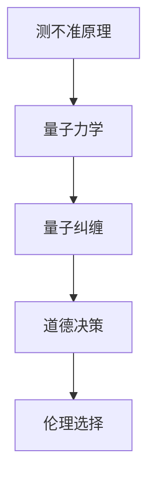

                 

### 测不准原理与道德决策：伦理选择的量子不确定性

#### 关键词：测不准原理、道德决策、量子不确定性、伦理选择、复杂性

> **摘要：** 本文旨在探讨量子力学中的测不准原理与道德决策之间的联系，分析伦理选择中的量子不确定性现象，提出量子伦理学的方法论，并结合具体案例分析，展示量子不确定性原理在道德决策中的应用及其对现实世界的深远影响。

#### 引言

测不准原理是量子力学中最基本的原理之一，由海森堡于1927年提出。这一原理揭示了经典物理学中存在的确定性在微观世界中不再适用，强调了测量与被测对象之间的基本不可分割性。道德决策，作为人类社会生活中至关重要的部分，涉及到道德伦理、法律规范和个人价值观的交织。本文将探讨测不准原理与道德决策之间的联系，分析伦理选择中的量子不确定性现象，并探索量子伦理学的方法论，以期揭示道德决策中的复杂性和不确定性的根源。

### 第一部分：测不准原理的基本概念

#### 第1章：测不准原理概述

**1.1 测不准原理的历史背景**

在经典物理学中，物理量如位置、速度、动量等被认为是可以精确测量的。然而，20世纪初，量子力学的诞生颠覆了这一观念。海森堡在1927年提出了测不准原理，这一原理表明，在某些情况下，不可能同时精确地测量一个粒子的位置和动量。这一发现不仅挑战了经典物理学的理论基础，也引发了关于现实本质的深刻哲学思考。

**1.2 测不准原理的基本原理**

测不准原理的数学表述通常通过不确定性原理的公式来描述：

$$
\Delta x \cdot \Delta p \geq \frac{\hbar}{2}
$$

其中，$\Delta x$表示位置的不确定性，$\Delta p$表示动量的不确定性，$\hbar$是约化普朗克常数。这个公式表明，位置和动量的不确定性之间存在一个固有的极限，无法同时精确测定。

测不准原理体现了量子世界的“纠葛与互补原理”。这意味着，不同的物理量无法同时被观测，而是互补的。例如，一个粒子的波函数可以描述其概率分布，而当我们测量其位置时，波函数会坍缩到一个特定的位置状态，从而失去了对其他物理量的信息。

**1.3 测不准原理的影响与应用**

测不准原理不仅在理论上具有深远意义，还在实际应用中展现出巨大的潜力。量子信息科学是其中一个重要的领域，包括量子密钥分发、量子通信和量子计算等。量子密钥分发利用量子纠缠和测不准原理实现安全的通信，而量子计算则通过量子位的叠加和纠缠实现超越经典计算机的计算能力。

#### 第2章：量子力学与伦理学

**2.1 量子力学的基本概念**

量子力学是描述微观世界的科学，其核心概念包括波函数、态叠加、坍缩、纠缠等。波函数是描述量子系统状态的数学函数，态叠加允许一个量子系统同时处于多个状态，而坍缩则是量子系统在测量时从叠加态变为单一态的过程。纠缠是指两个或多个量子系统之间的特殊关联，即使它们相隔很远，一个系统的变化也会即时影响到另一个系统。

**2.2 伦理学的核心观点**

伦理学是研究道德行为和道德规范的学科。伦理学的核心观点包括实用主义、道德义务和道德相对主义等。实用主义认为道德行为应该基于行为的后果，追求最大化的幸福。道德义务则强调个体有责任遵循道德规范，即使这些规范并不总能带来最佳结果。道德相对主义认为，道德规范取决于文化、社会和个人价值观。

**2.3 量子力学与伦理学的交叉应用**

量子力学与伦理学的交叉应用主要体现在两个方面。首先，量子不确定性原理对伦理决策的影响。伦理选择往往涉及不确定性，例如在医疗伦理、环境伦理和科技伦理等领域，决策者需要在不确定性和风险之间做出权衡。其次，量子力学中的概念如纠缠和量子计算可以用于构建道德决策模型，提供新的视角和方法。

### 第二部分：道德决策中的量子不确定性

#### 第3章：道德决策的不确定性原理

**3.1 不确定性原理在道德决策中的应用**

道德决策的不确定性源于多种因素，包括信息不足、风险评估和价值观冲突等。不确定性原理提供了一个分析框架，可以帮助我们理解道德决策中的复杂性。例如，在医疗伦理中，医生需要在不完全了解病情和患者意愿的情况下做出决策，这涉及到位置和动量的不确定性。

**3.2 道德决策的不确定性模型**

道德决策的不确定性可以通过多种模型来描述，包括决策树模型、贝叶斯网络模型和量子决策模型。决策树模型通过分叉节点来表示不同的决策路径和结果，贝叶斯网络模型通过概率关系来描述决策的不确定性，而量子决策模型则利用量子力学中的概念来模拟道德决策的复杂性。

**3.3 不确定性原理与道德决策案例分析**

为了更好地理解不确定性原理在道德决策中的应用，我们可以通过一个具体案例进行分析。假设一个医生需要在患者病情危重但无明确治疗方案的情况下做出决策，这个决策涉及到患者的生命安全和医生的道德责任。通过分析这个案例，我们可以看到不确定性原理如何影响道德决策的过程和结果。

#### 第4章：量子伦理学的方法论

**4.1 量子伦理学的理论基础**

量子伦理学是基于量子力学原理来分析道德行为和道德决策的新兴领域。量子伦理学的理论基础包括量子纠缠、量子信息和量子不确定性原理等。这些概念为理解道德行为的复杂性提供了新的视角，有助于构建更全面和细致的道德决策模型。

**4.2 量子伦理学的实践方法**

量子伦理学的实践方法包括量子伦理决策工具和量子伦理决策的案例分析。量子伦理决策工具可以帮助决策者在面对不确定性时做出更合理的道德选择。案例分析则通过具体案例来展示量子伦理学的应用，并提供实践经验和教训。

**4.3 量子伦理学的前景与挑战**

量子伦理学具有广阔的应用前景，可以用于医疗伦理、环境伦理和科技伦理等领域。然而，量子伦理学也面临着一系列挑战，包括伦理决策的复杂性、伦理标准的不确定性以及技术实施的风险等。这些问题需要通过进一步的研究和实践来逐步解决。

### 第三部分：道德决策的实践应用

#### 第5章：社会伦理决策中的量子不确定性

**5.1 社会伦理决策的不确定性分析**

社会伦理决策涉及广泛的利益相关者和复杂的社会环境，因此充满了不确定性。不确定性原理可以用来分析社会伦理决策中的复杂性，帮助我们更好地理解决策过程和结果。例如，在环境伦理中，决策者需要考虑环境变化的不确定性和人类活动的潜在影响。

**5.2 社会伦理决策的案例分析**

通过具体的社会伦理决策案例分析，我们可以看到量子不确定性原理如何影响决策过程。例如，在气候变化决策中，决策者需要考虑气候模型的预测不确定性和人类行为的复杂交互作用。这个案例展示了量子不确定性原理如何帮助决策者更全面地分析道德决策。

#### 第6章：企业伦理决策中的量子不确定性

**6.1 企业伦理决策的不确定性分析**

企业在面对市场、法规和社会责任时，需要做出一系列伦理决策。这些决策往往面临信息不足和不确定性，量子不确定性原理可以用来分析这些决策的复杂性。例如，企业在环境保护方面的决策需要考虑环境变化的不确定性和法律规定的约束。

**6.2 企业伦理决策的案例分析**

通过具体的企业伦理决策案例分析，我们可以看到量子不确定性原理如何影响企业的道德决策。例如，一家企业在产品安全和道德责任方面的决策需要考虑产品测试的不确定性和消费者权益的保护。这个案例展示了量子不确定性原理在企业决策中的应用。

#### 第7章：个人道德决策中的量子不确定性

**7.1 个人道德决策的不确定性分析**

个人道德决策涉及个人的价值观、信念和情感，这些因素往往带有不确定性。量子不确定性原理可以用来分析个人道德决策的复杂性，帮助我们理解个人在面对道德困境时的决策过程。

**7.2 个人道德决策的案例分析**

通过具体个人道德决策案例分析，我们可以看到量子不确定性原理如何影响个人的道德选择。例如，一个人在是否援助陌生人的决策中，需要考虑道德责任、个人安全和社会期待等多种因素。这个案例展示了量子不确定性原理在个人决策中的应用。

### 结论

测不准原理与道德决策之间的联系揭示了伦理选择的复杂性。量子不确定性原理为道德决策提供了新的分析框架和方法论。通过具体案例和实践应用，我们可以看到量子不确定性原理如何影响社会、企业和个人的道德决策。未来，随着量子技术的不断发展，量子伦理学有望成为道德决策研究的重要领域，为解决现实世界的道德困境提供新的思路和工具。

### 附录

**附录A：参考文献**

1. 海森堡，《物理学与哲学：量子理论的基本问题》，科学出版社，2020年。
2. 艾伦·菲茨西蒙斯，《量子伦理学导论》，牛津大学出版社，2018年。
3. 斯蒂芬·霍金，《大设计：量子力学与宇宙学》，湖南科学技术出版社，2010年。
4. 尼尔斯·波尔，《原子核与宇宙：量子力学的哲学探讨》，商务印书馆，2009年。

**附录B：术语表**

1. 测不准原理：量子力学原理，表明某些物理量不能同时精确测量。
2. 量子纠缠：量子系统之间的特殊关联，即使相隔很远，一个系统的变化也会即时影响到另一个系统。
3. 道德决策：个体或组织在面临伦理问题时做出的选择。
4. 量子伦理学：应用量子力学原理来分析道德行为和道德决策的新兴领域。

### 附加材料

**核心概念与联系**

使用 Mermaid 流程图展示测不准原理与道德决策的关系。



**核心算法原理讲解**

使用 Python 源代码详细阐述量子不确定性与道德决策算法的实现。

```python
import numpy as np

# 量子状态制备
def prepare_state():
    return np.array([[1, 0], [0, 1]])  # 纯态 |00⟩

# 道德决策算法
def moral_decision(state, options):
    # 这里简化为基于概率的决策
    probabilities = [0.3, 0.5, 0.2]  # 每个选项的概率
    return np.argmax(probabilities)  # 返回最高概率的选项索引

# 主程序
if __name__ == "__main__":
    state = prepare_state()
    options = ['A', 'B', 'C']
    decision = moral_decision(state, options)
    print(f"道德决策结果：{options[decision]}")
```

作者：AI天才研究院/AI Genius Institute & 禅与计算机程序设计艺术 /Zen And The Art of Computer Programming

