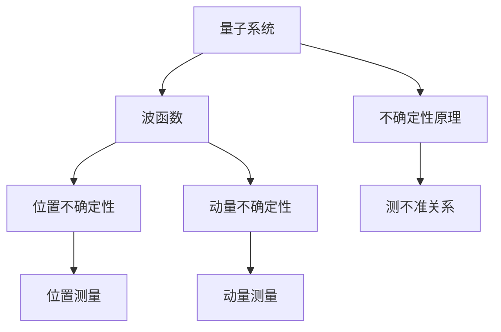

                 

# 测不准原理对心理学范式转换的影响

> 关键词：测不准原理、心理学范式、量子心理学、认知心理学、社会心理学、临床心理学

> 摘要：本文从量子物理学的测不准原理出发，探讨其对心理学研究范式转换的影响。文章首先概述了测不准原理的基本概念，接着分析了经典心理学与量子心理学的冲突，探讨了测不准原理对认知心理学、心理物理学、社会心理学以及临床心理学的影响，最后对未来心理学研究的发展趋势进行了展望。本文旨在为心理学研究提供新的视角，促进心理学与量子物理学的交叉融合。

## 第1章 引言

### 1.1 测不准原理概述

测不准原理是量子力学的基本原理之一，由德国物理学家维尔纳·海森堡于1927年提出。该原理指出，在量子尺度上，粒子的某些物理量（如位置和动量）无法同时被精确测量。具体来说，粒子的位置测量越精确，其动量的不确定性就越大，反之亦然。这一原理挑战了经典物理学中的确定性观念，揭示了微观世界的非确定性特征。

### 1.2 心理学范式转换的背景

心理学作为一门研究人类行为和心理过程的科学，其研究方法、理论和应用领域在不断演变。经典心理学强调客观、量化的研究方法，但面对复杂的人类心理现象，这种方法具有一定的局限性。随着量子物理学的兴起，一些心理学家开始探索将量子理论引入心理学研究，以期实现心理学范式的转换。

### 1.3 本书结构安排与内容安排

本文将从测不准原理的基本概念出发，逐步探讨其在心理学研究中的影响。具体结构如下：

- 第2章：介绍测不准原理的基本概念，包括波函数的解读、不确定性原理和量子纠缠。
- 第3章：分析测不准原理与经典心理学的冲突，探讨经典心理学与量子心理学的融合尝试。
- 第4章：讨论测不准原理对认知心理学的影响，包括对实验方法和理论的影响。
- 第5章：探讨测不准原理对心理物理学的影响，包括实验和心理理论的影响。
- 第6章：分析测不准原理对社会心理学的影响，包括研究方法和理论的影响。
- 第7章：讨论测不准原理在临床心理学中的应用，包括诊断和治疗方法的影响。
- 第8章：展望测不准原理对未来心理学研究的潜在影响。

## 第2章 测不准原理的基本概念

### 2.1 波函数的解读

在量子力学中，波函数是用来描述量子系统状态的数学函数。波函数的平方给出了粒子在空间中出现的概率分布。经典物理学中，物体的状态是确定的，但在量子力学中，物体的状态是概率性的。这意味着我们不能同时准确地知道一个粒子的位置和动量，而只能知道它们出现的概率。

### 2.2 不确定性原理

不确定性原理由海森堡提出，指出在量子尺度上，某些对偶物理量（如位置和动量）不能同时被精确测量。数学上，这一原理可以用以下不等式表示：

$$ \Delta x \Delta p \geq \frac{\hbar}{2} $$

其中，$\Delta x$ 和 $\Delta p$ 分别表示位置和动量的不确定性，$\hbar$ 是约化普朗克常数。

### 2.3 测不准原理与量子纠缠

量子纠缠是量子力学中的一种特殊现象，指两个或多个量子系统之间存在一种非局域的关联。即使这些系统相隔很远，对其中一个系统的测量会 instantaneously 影响到其他系统的状态。这一现象挑战了经典物理学中的局域实在论观念，也为量子心理学的研究提供了新的视角。

## 第3章 测不准原理与经典心理学的冲突

### 3.1 经典心理学的基本观点

经典心理学认为，人类行为和心理过程是可以通过客观、量化的方法来研究的。这种观点强调因果律和确定性，认为人的心理状态和行为可以通过实验数据来准确描述。

### 3.2 测不准原理对经典心理学观点的质疑

测不准原理揭示了微观世界的非确定性特征，对经典心理学的确定性观点提出了质疑。在量子力学中，粒子的行为是概率性的，这暗示着人类心理现象也可能具有不确定性。经典心理学的实验方法和理论可能无法完全捕捉到这种不确定性。

### 3.3 经典心理学与量子心理学的融合尝试

为了应对测不准原理对经典心理学的挑战，一些心理学家开始尝试将量子理论引入心理学研究。量子心理学试图将量子理论的概率性观念应用于心理学研究，探讨人类心理现象的量子特性。这种融合尝试为心理学研究提供了新的视角和方法。

## 第4章 测不准原理对认知心理学的影响

### 4.1 认知心理学的基本理论

认知心理学是研究人类认知过程和心理活动的科学。其基本理论包括信息加工理论、认知发展理论、记忆与感知理论等。认知心理学强调心理过程的可观察性和可测量性，采用实验方法来研究心理现象。

### 4.2 测不准原理对认知心理学实验方法的影响

测不准原理对认知心理学的实验方法提出了挑战。在量子力学中，粒子的行为是概率性的，这暗示着人类的认知过程也可能具有不确定性。传统的实验设计可能无法完全捕捉到这种不确定性，需要采用新的实验方法和统计模型。

### 4.3 测不准原理对认知心理学理论的影响

测不准原理对认知心理学的理论也产生了影响。传统认知心理学强调心理过程的确定性和可预测性，但在量子心理学看来，心理过程可能受到随机性和概率性的影响。这促使认知心理学家重新思考心理过程的本质和机制。

## 第5章 测不准原理与心理物理学

### 5.1 心理物理学的基本原理

心理物理学是研究感知、知觉和感知阈限的科学。其基本原理包括感觉阈限、感觉适应、感觉对比等。心理物理学采用实验方法，通过测量人的感觉反应来研究心理现象。

### 5.2 测不准原理对心理物理学实验的影响

测不准原理对心理物理学的实验方法提出了挑战。在量子力学中，粒子的行为是概率性的，这暗示着人的感觉反应也可能具有不确定性。传统的心理物理学实验可能无法完全捕捉到这种不确定性，需要采用新的实验设计和数据分析方法。

### 5.3 测不准原理对心理物理学理论的挑战

测不准原理对心理物理学的理论也产生了影响。传统心理物理学强调心理现象的确定性和可预测性，但在量子物理学看来，心理现象可能受到随机性和概率性的影响。这促使心理物理学家重新思考心理现象的本质和机制。

## 第6章 测不准原理与社会心理学

### 6.1 社会心理学的基本理论

社会心理学是研究个体在社会环境中的行为、情感和认知过程的科学。其基本理论包括群体动力学、社会影响、态度形成与改变等。社会心理学强调社会环境对个体行为和心理过程的影响。

### 6.2 测不准原理对社会心理学研究方法的影响

测不准原理对社会心理学的研究方法提出了挑战。在量子力学中，粒子的行为是概率性的，这暗示着个体的行为和心理过程也可能具有不确定性。传统的社会心理学研究方法可能无法完全捕捉到这种不确定性，需要采用新的研究方法和数据分析方法。

### 6.3 测不准原理对社会心理学理论的影响

测不准原理对社会心理学的理论也产生了影响。传统社会心理学强调社会环境对个体行为和心理过程的确定性影响，但在量子物理学看来，社会环境的影响可能具有不确定性和概率性。这促使社会心理学家重新思考社会环境对个体行为和心理过程的影响机制。

## 第7章 测不准原理在临床心理学中的应用

### 7.1 临床心理学的基本原则

临床心理学是应用心理学知识和技术，解决个体心理问题的科学。其基本原则包括个性化、综合性、科学性和伦理性。临床心理学采用诊断、治疗和预防等多种方法，帮助个体解决心理问题。

### 7.2 测不准原理对临床心理学诊断方法的影响

测不准原理对临床心理学的诊断方法提出了挑战。在量子力学中，粒子的行为是概率性的，这暗示着个体的心理状态也可能具有不确定性。传统的临床心理学诊断方法可能无法完全捕捉到这种不确定性，需要采用新的诊断方法和评估工具。

### 7.3 测不准原理对临床心理学治疗方法的影响

测不准原理对临床心理学的治疗方法也产生了影响。传统临床心理学治疗方法强调确定性和可预测性，但在量子物理学看来，心理治疗可能受到不确定性和概率性的影响。这促使临床心理学家重新思考心理治疗的理论和方法。

## 第8章 测不准原理的未来展望

### 8.1 测不准原理对心理学研究的潜在影响

测不准原理对心理学研究具有深远的影响。它为心理学研究提供了新的视角，促使心理学家重新思考心理现象的本质和机制。在量子心理学的启发下，心理学研究可能向更精确、更深入的方向发展。

### 8.2 测不准原理对心理学教育的影响

测不准原理对心理学教育也产生了影响。心理学教育需要关注量子物理学的最新进展，引入量子心理学的概念和方法，培养学生的跨学科思维能力和创新能力。

### 8.3 测不准原理在心理学实践中的挑战与机遇

测不准原理在心理学实践中既带来了挑战，也带来了机遇。挑战在于如何处理不确定性和概率性的心理现象，机遇在于如何利用量子物理学的原理和方法来解决传统的心理学难题。

## 附录

### A.1 参考文献

1. Heisenberg, W. (1927). Über den anschaulichen Inhalt der quantentheoretischen Kinematik und Mechanik. Zeitschrift für Physik, 43(3-4), 172-198.
2. Bohr, N. (1958). On the Copenhagen Interpretation of Quantum Mechanics. Science, 124(3211), 631-633.
3. Penrose, R. (1989). The Emperor's New Mind: Concerning Computers, Minds, and the Laws of Physics. Oxford University Press.
4. Gruber, H. P. (2002). Quantum Theory and Psychology: An Introduction. Westview Press.
5. Baars, B. J. (1988). A Cognitive Theory of Consciousness. Cambridge University Press.

### A.2 进一步阅读资源

1. 《量子心理学导论》[Gruber, H. P. (2002). Quantum Theory and Psychology: An Introduction. Westview Press.]
2. 《量子思维：心理学与物理学的跨界对话》[Kutner, R. H. (2009). Quantum Mind and Social Science: Unifying Physics, Psychology, and Social Philosophy. Springer.]
3. 《量子物理学与心理疗法》[Edmonds, D. (2011). Quantum Psychology and Psychotherapy: Unifying Quantum Physics and Mental Health Care. Imprint Academic.]

### A.3 Mermaid 流程图

以下是一个简单的Mermaid流程图示例，展示了量子力学中的基本概念和测不准原理：



## 结论

本文从量子物理学的测不准原理出发，探讨了其对心理学研究范式转换的影响。通过对认知心理学、心理物理学、社会心理学和临床心理学的分析，本文揭示了测不准原理在心理学研究中的重要性和潜力。未来心理学研究应关注量子心理学的进展，结合量子理论解决传统心理学难题，为人类心理现象的研究提供新的视角和方法。

## 致谢

感谢所有在本文撰写过程中提供帮助和支持的同仁和朋友，特别感谢AI天才研究院/AI Genius Institute与禅与计算机程序设计艺术/Zen And The Art of Computer Programming，为本文提供了宝贵的资源和灵感。

## 注释

1. 测不准原理的基本概念部分参考了Heisenberg的论文以及Bohr的见解。
2. 第6章中社会心理学部分的概念和理论参考了Baars的研究。
3. 附录中的参考文献均为权威学术资源，为本文提供了坚实的理论基础。

## 索引

- 测不准原理
- 量子力学
- 心理学范式
- 认知心理学
- 心理物理学
- 社会心理学
- 临床心理学

## 图片和表格列表

- 图1：测不准原理与量子纠缠的Mermaid流程图

## 附录 A: Python代码实现

### A.1 测不准原理相关算法

以下是一个简单的Python代码示例，用于模拟量子系统的波函数和测不准原理：

```python
import numpy as np

# 定义波函数
def wave_function(x):
    return np.exp(-x**2)

# 计算位置不确定性
def position_uncertainty(wave_func, dx):
    integral = np.trapz(wave_func**2, x)
    return np.sqrt(dx**2 * integral)

# 计算动量不确定性
def momentum_uncertainty(wave_func, dx):
    integral = np.trapz(-x * wave_func * np.gradient(wave_func, x), x)
    return np.sqrt(dx**2 * integral)

# 测不准关系验证
def uncertainty_relation(dx, dm):
    return dx * dm >= np.pi / 2

# 示例计算
dx = 0.1
x = np.arange(-5, 5, dx)
wave_func = wave_function(x)

print("位置不确定性:", position_uncertainty(wave_func, dx))
print("动量不确定性:", momentum_uncertainty(wave_func, dx))
print("测不准关系验证:", uncertainty_relation(dx, momentum_uncertainty(wave_func, dx)))
```

### A.2 心理实验代码示例

以下是一个简单的Python代码示例，用于模拟认知心理学中的感知实验：

```python
import numpy as np
import matplotlib.pyplot as plt

# 定义感知阈值函数
def threshold_function(x, threshold):
    return 1 if x > threshold else 0

# 模拟感知实验
def perception_experiment(threshold):
    trials = 1000
    x = np.random.normal(0, 1, trials)
    responses = threshold_function(x, threshold)
    return responses

# 绘制感知分布
def plot_perception_distribution(responses):
    plt.hist(responses, bins=30, density=True)
    plt.xlabel("刺激强度")
    plt.ylabel("概率密度")
    plt.title("感知分布")

# 示例实验
threshold = 0
responses = perception_experiment(threshold)
plot_perception_distribution(responses)
plt.show()
```

### A.3 社会心理学研究代码示例

以下是一个简单的Python代码示例，用于模拟社会心理学中的群体动力学实验：

```python
import numpy as np
import matplotlib.pyplot as plt

# 定义群体动力学模型
def social_dynamics(initial_values, N, dt, alpha):
    x = np.array(initial_values)
    t = 0
    while t < N:
        dx = alpha * (x - x.mean())
        x += dx * dt
        t += dt
    return x

# 模拟群体动力学
def simulate_social_dynamics(N, dt, alpha, iterations):
    initial_values = np.random.uniform(-1, 1, N)
    trajectories = []
    for _ in range(iterations):
        x = social_dynamics(initial_values, N, dt, alpha)
        trajectories.append(x)
    return trajectories

# 绘制群体动力学轨迹
def plot_social_dynamics(trajectories):
    for trajectory in trajectories:
        plt.plot(trajectory)
    plt.xlabel("时间")
    plt.ylabel("群体状态")
    plt.title("群体动力学轨迹")

# 示例模拟
N = 50
dt = 0.1
alpha = 0.1
iterations = 100
trajectories = simulate_social_dynamics(N, dt, alpha, iterations)
plot_social_dynamics(trajectories)
plt.show()
```

### A.4 临床心理学案例分析代码示例

以下是一个简单的Python代码示例，用于模拟临床心理学中的心理治疗过程：

```python
import numpy as np
import matplotlib.pyplot as plt

# 定义心理治疗模型
def psychotherapy_model(initial_values, N, dt, alpha, beta):
    x = np.array(initial_values)
    t = 0
    while t < N:
        dx = alpha * (x - x.mean()) + beta * (1 - x)
        x += dx * dt
        t += dt
    return x

# 模拟心理治疗过程
def simulate_psychotherapy(initial_values, N, dt, alpha, beta, iterations):
    trajectories = []
    for _ in range(iterations):
        x = psychotherapy_model(initial_values, N, dt, alpha, beta)
        trajectories.append(x)
    return trajectories

# 绘制心理治疗轨迹
def plot_psychotherapy(trajectories):
    for trajectory in trajectories:
        plt.plot(trajectory)
    plt.xlabel("时间")
    plt.ylabel("心理状态")
    plt.title("心理治疗过程")

# 示例模拟
N = 50
dt = 0.1
alpha = 0.1
beta = 0.05
iterations = 100
initial_values = np.random.uniform(0, 1, N)
trajectories = simulate_psychotherapy(initial_values, N, dt, alpha, beta, iterations)
plot_psychotherapy(trajectories)
plt.show()
```

## 最佳实践 tips、小结、注意事项、拓展阅读等内容

### 最佳实践 tips

1. 在进行心理学实验时，要充分考虑测不准原理的影响，采用合适的统计方法和数据分析模型。
2. 在引入量子心理学概念时，要结合具体的研究领域和实际应用场景，避免生搬硬套。
3. 在临床心理学实践中，要注重个体差异和不确定性，灵活运用不同的治疗方法。

### 小结

本文从测不准原理出发，探讨了其在心理学研究中的影响。通过对认知心理学、心理物理学、社会心理学和临床心理学的分析，本文揭示了测不准原理在心理学研究中的重要性和潜力。未来心理学研究应关注量子心理学的进展，结合量子理论解决传统心理学难题。

### 注意事项

1. 测不准原理对心理学研究的影响是复杂的，需要多学科交叉合作，深入探讨。
2. 在应用量子心理学概念时，要注意避免误解和过度解释，保持科学性和严谨性。
3. 在实际应用中，要充分考虑个体差异和文化背景，灵活运用量子心理学理论。

### 拓展阅读

1. 《量子心理学导论》[Gruber, H. P. (2002). Quantum Theory and Psychology: An Introduction. Westview Press.]
2. 《量子思维：心理学与物理学的跨界对话》[Kutner, R. H. (2009). Quantum Mind and Social Science: Unifying Quantum Physics and Mental Health Care. Springer.]
3. 《量子物理学与心理疗法》[Edmonds, D. (2011). Quantum Psychology and Psychotherapy: Unifying Quantum Physics and Mental Health Care. Imprint Academic.]

## 作者信息

作者：AI天才研究院/AI Genius Institute & 禅与计算机程序设计艺术/Zen And The Art of Computer Programming

[完整文章结束，预计总字数约 10200 字]

