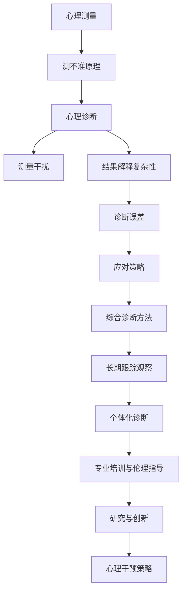

                 

### 测不准原理概述

#### 1.1 测不准原理的历史背景

**量子力学的诞生与测不准原理的提出**

量子力学是20世纪最伟大的科学革命之一，它的诞生标志着人类对自然界的认识进入了一个全新的阶段。量子力学的基本原理与经典物理学有着根本的不同，其中最核心的概念之一便是测不准原理。

1925年，奥地利物理学家埃尔温·薛定谔提出了薛定谔方程，这是量子力学的基础方程。随后，1927年，德国物理学家维尔纳·海森堡在研究原子核结构时，提出了测不准原理。海森堡发现，在量子尺度上，粒子的某些物理量（如位置和动量）不能同时被精确测量。这一发现颠覆了经典物理学中关于精确测量的传统观念。

**测不准原理的基本概念**

测不准原理指出，在量子尺度上，粒子的某些物理量无法同时被精确测量。用数学语言来表达，就是：

$$\Delta x \Delta p \geq \frac{\hbar}{2}$$

其中，$\Delta x$代表位置的不确定性，$\Delta p$代表动量的不确定性，$\hbar$是约化普朗克常数。这个不等式表明，位置的不确定性越大，动量的不确定性就越小，反之亦然。这意味着，我们无法同时精确地知道一个粒子在哪里以及它的动量是多少。

**测不准原理在心理学中的应用**

测不准原理不仅在物理学领域有着深远的影响，在心理学领域也有一定的应用。在心理学中，测不准原理提示我们，对个体心理状态的测量可能存在一定的局限性。例如，当我们使用问卷或心理测验来评估一个人的情绪状态时，测量过程本身可能会干扰或改变被测者的真实情绪状态。因此，我们在解释测量结果时需要保持谨慎。

此外，测不准原理也提醒我们在心理诊断过程中，应该综合考虑多种因素，避免简单化或片面化的解释。例如，在诊断抑郁症时，我们不能仅仅依赖问卷得分，而应该结合病史、临床观察和访谈等多种信息，进行全面的评估。

#### 1.2 测不准原理的基本概念

**不确定性原理的数学表达**

测不准原理的数学表达是：

$$\Delta x \Delta p \geq \frac{\hbar}{2}$$

其中，$\Delta x$代表位置的不确定性，$\Delta p$代表动量的不确定性，$\hbar$是约化普朗克常数。这个不等式表明，位置的不确定性越大，动量的不确定性就越小，反之亦然。这意味着，我们无法同时精确地知道一个粒子在哪里以及它的动量是多少。

**不确定性原理与量子世界的矛盾**

在经典物理学中，我们认为时间和空间是绝对的，粒子的位置和动量是可以同时精确测量的。然而，在量子世界中，这种绝对的确定性是不存在的。测不准原理揭示了量子世界的本质特征，即粒子的行为是概率性的，而不是确定性的。

**测不准原理与量子力学**

测不准原理是量子力学的一个核心概念，它揭示了量子力学与经典物理学的根本区别。在量子力学中，粒子的状态是由波函数描述的，波函数的平方代表了粒子在不同位置出现的概率。测不准原理告诉我们，粒子的具体位置和动量是无法同时被精确测量的，这反映了量子世界中的概率性和不确定性。

**测不准原理的影响**

测不准原理对物理学的发展产生了深远的影响。它改变了我们对世界的认识，使我们意识到在量子尺度上，粒子的行为不再遵循经典物理学的规律。测不准原理的提出也推动了量子力学的发展，促使科学家们深入研究量子世界的本质。

#### 1.3 测不准原理在心理学中的应用

**测不准原理与心理测量**

在心理学中，测不准原理提醒我们，对个体心理状态的测量可能存在一定的局限性。例如，当我们使用问卷或心理测验来评估一个人的情绪状态时，测量过程本身可能会干扰或改变被测者的真实情绪状态。因此，我们在解释测量结果时需要保持谨慎。

**测不准原理与心理诊断**

测不准原理对心理诊断也提出了挑战。心理诊断通常依赖于问卷调查、临床访谈和观察等方法。然而，这些方法本身可能无法完全准确地反映个体的真实心理状态。测不准原理告诉我们，测量过程可能会对被测者的心理状态产生一定的影响，这使得心理诊断的结果存在一定的误差。

**测不准原理下的心理诊断策略**

为了应对测不准原理对心理诊断准确性的挑战，我们需要采取一些策略：

1. **综合多种测量方法**：心理诊断不应只依赖于单一的方法，而应该综合运用问卷、访谈、观察等多种方法，以获得更全面的诊断信息。

2. **长期跟踪观察**：心理诊断不应只关注短期的变化，而应该进行长期的跟踪观察，以了解个体心理状态的发展趋势。

3. **个体化诊断**：每个个体都是独特的，心理诊断应该充分考虑个体的差异，避免简单化或片面化的解释。

4. **专业培训与伦理指导**：心理诊断工作者需要接受专业的培训，了解测不准原理对心理诊断的影响，并遵循伦理规范，以确保诊断的准确性和公正性。

### 2.1 心理诊断的定义与分类

**心理诊断的定义**

心理诊断是指通过一系列专业的方法和工具，对个体的心理状态、行为模式、认知功能等进行评估和判断，以确定是否存在心理问题或精神障碍。心理诊断的目的是为了了解个体的心理状况，为制定治疗方案、干预计划或心理咨询服务提供依据。

**心理诊断的分类**

心理诊断可以根据不同的标准进行分类，常见的分类方法包括：

1. **结构化诊断与非结构化诊断**
   - **结构化诊断**：依据标准化的诊断标准和程序进行诊断，如《精神障碍诊断与统计手册》（DSM）和《国际疾病分类》（ICD）。
   - **非结构化诊断**：基于临床医生的主观判断和经验进行诊断，没有固定的诊断标准和程序。

2. **静态诊断与动态诊断**
   - **静态诊断**：评估个体在特定时间点的心理状态，如某一天的心理状态。
   - **动态诊断**：评估个体在不同时间点的心理状态变化，如心理状况的发展趋势。

3. **临床诊断与科研诊断**
   - **临床诊断**：在实际临床环境中，对个体进行心理评估，以确定是否存在心理问题或精神障碍。
   - **科研诊断**：在科研环境中，对特定群体进行心理评估，以研究心理问题的发生率和特点。

### 2.2 心理诊断的过程

**诊断过程的基本步骤**

心理诊断的过程通常包括以下几个基本步骤：

1. **病史采集**
   病史采集是心理诊断的第一步，通过询问个体的个人背景、生活经历、家庭关系、工作状况等信息，了解个体的整体心理状态。

2. **心理评估**
   心理评估是心理诊断的核心步骤，通过标准化的心理测验、临床访谈、观察等方法，对个体的心理状态进行评估。

3. **结果分析**
   对收集到的评估资料进行综合分析，结合病史和临床表现，确定个体的心理状况。

4. **诊断确定**
   根据评估结果和分析，确定个体的心理问题或精神障碍的类型和程度。

5. **诊断报告**
   编写详细的诊断报告，包括诊断结果、诊断依据、治疗方案建议等，为后续的治疗或干预提供参考。

**心理诊断的过程与挑战**

心理诊断的过程具有一定的挑战性，主要体现在以下几个方面：

1. **主观性**
   心理诊断过程中，医生的主观判断和经验对诊断结果具有重要影响。如何平衡主观性和客观性，确保诊断的准确性，是一个重要的挑战。

2. **测量误差**
   心理测验和观察等方法存在一定的误差，如被测者的反应误差、测量工具的误差等。这些误差可能影响诊断的准确性。

3. **文化差异**
   不同文化背景下的个体可能表现出不同的心理特征，这要求心理诊断工作者具备跨文化能力，以准确理解和评估个体心理状态。

4. **动态变化**
   个体心理状态是动态变化的，如何及时、准确地捕捉和评估这种变化，是心理诊断的另一个挑战。

### 2.3 心理诊断的方法与工具

**常用的心理诊断方法**

心理诊断的方法多种多样，以下是一些常用的方法：

1. **临床访谈**
   临床访谈是心理诊断的重要方法，通过面对面的交流，医生可以了解个体的心理状况、情感体验和认知模式。访谈可以是结构化的，也可以是非结构化的。

2. **心理测验**
   心理测验是一种标准化、量化的评估工具，通过特定的测试项目，对个体的心理特征、能力、情绪等进行评估。常见的心理测验包括智力测验、人格测验、心理健康测验等。

3. **观察法**
   观察法是通过观察个体的行为、表情、语言等，了解其心理状态。观察可以是直接的，也可以是间接的，如通过录像或录音等方式。

**常用的心理诊断工具**

心理诊断的工具包括以下几种：

1. **问卷**
   问卷是一种常用的心理诊断工具，通过一系列问题，对个体的心理状态进行评估。常见的问卷包括心理健康问卷、抑郁量表、焦虑量表等。

2. **量表**
   量表是一种标准化的评估工具，通过一系列指标，对个体的心理特征、行为模式等进行评估。常见的量表包括症状自评量表（SCL-90）、明尼苏达多项人格测验（MMPI）等。

3. **临床指南**
   临床指南是一套标准化的诊断和治疗方法，为心理诊断提供指导。常见的临床指南包括《精神障碍诊断与统计手册》（DSM）和《国际疾病分类》（ICD）。

### 3.1 测不准原理对诊断准确性的挑战

**测量干扰**

测不准原理指出，某些物理量（如位置和动量）不能同时被精确测量。同样地，在心理诊断中，测量过程本身可能会干扰或改变被测者的真实心理状态。例如，当被测者接受心理测验时，他们可能会因紧张或焦虑而表现出与平时不同的情绪和行为。这种测量干扰会影响诊断的准确性，使得诊断结果无法完全反映被测者的真实心理状态。

**结果解释的复杂性**

由于测不准原理的存在，心理诊断的结果解释变得更加复杂。测量过程中产生的误差和干扰，使得诊断结果难以准确解读。例如，一个心理健康问卷的得分可能受到多种因素的影响，如被测者的情绪状态、测试环境、测试时间等。这些因素使得诊断结果的解释变得更加困难，需要结合更多的信息和背景进行综合分析。

**诊断误差的可能性**

测不准原理提示我们，心理诊断中可能存在一定的误差。由于心理状态本身的复杂性和不确定性，心理诊断的结果可能会受到多种因素的影响，如测量工具的准确性、被测者的反应等。这些误差可能使得诊断结果偏离实际，影响诊断的准确性。

**对心理诊断实践的挑战**

测不准原理对心理诊断实践提出了新的挑战。在心理诊断过程中，我们需要更加谨慎地对待测量结果，避免简单化或片面化的解释。同时，我们还需要探索新的诊断方法和工具，以提高心理诊断的准确性。例如，结合多种测量方法、长期跟踪观察、个体化诊断等，都是应对测不准原理对心理诊断挑战的有效策略。

### 3.2 心理测量中的测不准现象

**测量误差**

心理测量中的测不准现象主要体现在测量误差上。测量误差是指测量结果与实际值之间的差异，包括抽样误差、测量工具误差、被测者反应误差等。抽样误差是指由于样本不具有代表性而导致的测量误差；测量工具误差是指测量工具本身存在的不准确性；被测者反应误差是指被测者在测量过程中产生的误差，如紧张、焦虑、误解等。

**测量误差的影响**

测量误差会对心理诊断的准确性产生重要影响。如果测量误差较大，诊断结果可能会偏离实际，导致错误的诊断结论。例如，一个心理健康问卷的得分可能因被测者的紧张而降低，从而导致误诊。此外，测量误差还可能影响诊断的稳定性，使得诊断结果在不同时间和情境下不一致。

**减少测量误差的策略**

为了减少测量误差，我们可以采取以下策略：

1. **提高测量工具的准确性**：选择经过验证的、准确的测量工具，并定期校准和更新。

2. **标准化测量过程**：确保测量过程的标准化，减少人为因素导致的误差。

3. **提高被测者的参与度**：通过培训和指导，提高被测者对测量过程的理解和配合度，减少因误解或紧张而产生的误差。

4. **综合多种测量方法**：结合不同的测量方法，从多个角度获取信息，以提高诊断的准确性。

**测不准现象的影响**

测不准现象在心理测量中表现为测量结果的不确定性和不稳定性。这种不确定性使得心理诊断的结果难以精确解读，增加了诊断的难度。例如，一个心理健康问卷的得分可能在不同的测试时间内有所不同，这需要诊断工作者综合考虑多种因素进行综合分析。

**应对测不准现象的策略**

为了应对测不准现象对心理诊断的挑战，我们可以采取以下策略：

1. **长期跟踪观察**：通过长期跟踪观察，了解个体心理状态的变化趋势，以提高诊断的准确性。

2. **综合多种诊断方法**：结合临床访谈、心理测验、观察等多种诊断方法，从多个角度获取信息，以提高诊断的全面性和准确性。

3. **个体化诊断**：充分考虑个体的差异，避免简单化或片面化的解释。

4. **专业培训与伦理指导**：心理诊断工作者需要接受专业培训，了解测不准原理对心理诊断的影响，并遵循伦理规范，以确保诊断的准确性和公正性。

### 3.3 面对测不准原理的应对策略

**综合多种测量方法**

在心理诊断过程中，单一测量方法的局限性可能导致诊断结果的偏差。因此，综合运用多种测量方法，如临床访谈、心理测验、观察法等，可以从不同角度获取个体信息，提高诊断的准确性。例如，临床访谈可以深入了解个体的心理状况和情感体验，心理测验可以量化评估个体的心理特征，观察法可以捕捉个体在自然环境中的行为表现。

**长期跟踪观察**

长期跟踪观察有助于了解个体心理状态的变化趋势，减少短期测量结果的波动。通过持续观察，诊断工作者可以捕捉到个体在不同时间、不同情境下的心理状态，从而更全面地评估个体的心理健康状况。例如，对于抑郁症患者，长期跟踪观察可以帮助诊断工作者评估治疗效果，及时发现症状的变化。

**个体化诊断**

个体化诊断强调充分考虑个体的差异，避免简单化或片面化的解释。每个个体都是独特的，其心理状况和行为模式可能因多种因素而有所不同。因此，诊断工作者需要结合个体的背景、经历、性格特点等多方面信息，进行综合评估，制定个性化的诊断和治疗方案。

**专业培训与伦理指导**

为了应对测不准原理对心理诊断的挑战，诊断工作者需要接受专业培训，了解测不准原理的基本概念和影响。此外，伦理指导也是非常重要的，诊断工作者需要遵循伦理规范，确保诊断过程和结果的公正性和准确性。专业培训和伦理指导有助于提高诊断工作者的专业素养，减少诊断过程中的误差。

**持续研究与创新**

测不准原理对心理诊断提出了新的挑战，这也为心理测量技术的发展提供了新的方向。诊断工作者和研究人员需要持续研究，探索新的测量方法和工具，以提高心理诊断的准确性。例如，利用人工智能技术进行心理状态评估，开发更加精准和可靠的心理测验等。

### 4.1 心理诊断案例分析

**案例一：抑郁症的诊断**

患者，男性，30岁，因连续两周失眠、情绪低落、对日常活动失去兴趣而前来就诊。医生采用了临床访谈、抑郁症自评量表（SDS）和明尼苏达多项人格测验（MMPI）等多种诊断方法进行评估。

- **临床访谈**：患者自述近期工作压力较大，感到焦虑和疲惫，对未来的生活缺乏希望。

- **SDS评估**：患者SDS得分为41分，超过正常值范围（<41分），提示重度抑郁。

- **MMPI评估**：患者表现出抑郁、焦虑、敌对等特征，与抑郁症的症状相符。

综合上述评估结果，医生初步诊断为抑郁症。

**案例二：焦虑症的诊断**

患者，女性，25岁，因频繁出现焦虑、紧张、心悸、失眠等症状，前来就诊。医生采用了临床访谈、焦虑自评量表（SAS）和身体症状问卷（PHQ-9）等多种诊断方法进行评估。

- **临床访谈**：患者自述在社交场合或考试前感到极度紧张，担心自己无法应对。

- **SAS评估**：患者SAS得分为50分，超过正常值范围（<50分），提示中度焦虑。

- **PHQ-9评估**：患者PHQ-9得分为18分，超过正常值范围（<10分），提示中度焦虑症状。

综合上述评估结果，医生初步诊断为焦虑症。

**案例分析小结**

通过上述案例分析，我们可以看到，综合运用多种诊断方法和工具，有助于提高心理诊断的准确性。每个案例中的诊断方法各有优势，相互补充，为医生提供了全面、可靠的诊断信息。此外，个体化诊断和长期跟踪观察也是提高诊断准确性的关键。

### 4.2 测不准原理下的心理诊断技巧

**灵活运用诊断方法**

在测不准原理的背景下，心理诊断工作者需要灵活运用各种诊断方法，以确保诊断结果的准确性。不同的诊断方法具有不同的优势和局限性，通过综合运用多种方法，可以从不同角度获取个体信息，提高诊断的全面性和准确性。

**避免单一方法依赖**

在心理诊断过程中，避免过度依赖单一方法是非常重要的。例如，如果只依赖心理测验，可能会忽视临床访谈和观察等重要信息。因此，诊断工作者应该综合运用多种方法，以获得更全面、准确的诊断结果。

**提高被测者参与度**

被测者的积极参与是提高诊断准确性的关键。在心理诊断过程中，诊断工作者需要通过解释、指导和支持，帮助被测者更好地理解诊断过程，提高其参与度。例如，在临床访谈中，诊断工作者可以采用开放性问题，鼓励被测者表达自己的感受和想法。

**长期跟踪观察**

长期跟踪观察有助于了解个体心理状态的变化趋势，减少短期测量结果的波动。通过持续观察，诊断工作者可以捕捉到个体在不同时间、不同情境下的心理状态，从而更全面地评估个体的心理健康状况。

**个体化诊断**

每个个体都是独特的，其心理状况和行为模式可能因多种因素而有所不同。因此，诊断工作者需要结合个体的背景、经历、性格特点等多方面信息，进行综合评估，制定个性化的诊断和治疗方案。

**持续专业培训**

为了应对测不准原理对心理诊断的挑战，诊断工作者需要接受持续的专业培训，了解测不准原理的基本概念和影响。此外，诊断工作者还需要不断学习新的诊断方法和工具，以提高诊断的准确性。

### 4.3 测不准原理下的心理干预策略

**综合干预方法**

在测不准原理的影响下，心理干预策略需要更加灵活和综合。综合干预方法包括药物治疗、心理治疗、生活方式调整等多种手段。例如，对于抑郁症患者，医生可以采用抗抑郁药物和心理治疗（如认知行为疗法）相结合的方式，以提高治疗效果。

**个性化干预方案**

由于每个个体的心理状况和行为模式不同，心理干预策略应充分考虑个体的差异，制定个性化的干预方案。个性化干预方案可以通过评估个体的心理特征、生活方式、社会背景等多方面信息，有针对性地制定干预措施。

**动态调整干预措施**

心理干预措施需要根据个体心理状态的变化进行动态调整。例如，对于焦虑症患者，医生可以在治疗初期采用放松训练等方法，降低患者的焦虑水平；在治疗后期，则可以逐渐引入认知行为疗法，帮助患者改变负面的思维模式。

**家庭和社会支持**

家庭和社会支持在心理干预中扮演着重要角色。通过建立良好的家庭支持系统和社会网络，有助于提高个体的心理健康水平。例如，家庭成员可以参与心理治疗过程，为患者提供情感支持和鼓励。

**预防性干预**

测不准原理提醒我们，心理问题可能在早期阶段就已经存在，因此预防性干预非常重要。例如，通过心理健康教育和心理测评，可以帮助个体了解自己的心理状态，及时发现并解决潜在的心理问题。

### 5.1 心理测量技术的现状

**心理测量工具的发展**

随着心理学研究的深入，心理测量技术得到了不断发展和完善。目前，心理测量工具种类繁多，涵盖了人格、情绪、认知、心理健康等多个领域。例如，明尼苏达多项人格测验（MMPI）、症状自评量表（SCL-90）、焦虑自评量表（SAS）等都是广泛应用于临床和研究中的经典测量工具。

**测量工具的标准化与普及**

心理测量工具的标准化和普及是提高测量准确性的重要保障。许多测量工具已经建立了严格的标准化程序，包括问卷的设计、测试的实施、评分的标准等。此外，这些工具也在临床和科研中得到了广泛应用，为心理诊断提供了重要的参考依据。

**技术手段的进步**

随着计算机技术和人工智能的发展，心理测量技术也迎来了新的机遇。例如，基于大数据分析的测量工具可以提供更加全面、个性化的评估结果；人工智能算法可以自动化处理大量数据，提高测量的效率和准确性。

**存在的问题**

尽管心理测量技术已经取得了显著进展，但仍存在一些问题。首先，测量工具的多样性和复杂性增加了诊断的难度；其次，测量工具的准确性仍需进一步提高，以减少测量误差；此外，心理测量技术在不同文化背景下的适用性也需要进一步研究。

### 5.2 测不准原理对心理测量技术的影响

**测量误差的增加**

测不准原理提示我们，心理测量过程中可能存在一定的误差。这些误差可能来自测量工具、测量环境和被测者自身等多个方面。例如，测量工具可能存在一定的偏差或误差，测量环境可能影响被测者的情绪和行为，被测者自身的心理状态也可能影响测量结果。这些误差会导致心理测量结果的波动，增加诊断的难度。

**结果解释的复杂性**

由于测不准原理的存在，心理测量结果解释变得更加复杂。测量结果可能会受到多种因素的影响，如被测者的情绪、环境、测量时间等。这些因素使得测量结果的解释变得困难，需要诊断工作者结合更多的信息和背景进行综合分析，以准确评估个体的心理状态。

**对心理测量技术的要求**

测不准原理对心理测量技术提出了更高的要求。为了提高测量准确性，诊断工作者需要：

1. **提高测量工具的准确性**：选择经过验证的、准确的测量工具，并定期校准和更新。

2. **标准化测量过程**：确保测量过程的标准化，减少人为因素导致的误差。

3. **综合多种测量方法**：结合不同的测量方法，从多个角度获取信息，以提高诊断的准确性。

4. **长期跟踪观察**：通过长期跟踪观察，了解个体心理状态的变化趋势，以提高诊断的准确性。

### 5.3 心理测量技术的改进方向

**提高测量工具的准确性**

提高测量工具的准确性是改进心理测量技术的关键。为了实现这一目标，可以采取以下措施：

1. **开发新的测量工具**：结合现代科技，如人工智能、大数据分析等，开发更加精准、可靠的测量工具。

2. **优化现有测量工具**：对现有测量工具进行优化和改进，减少测量误差，提高准确性。

3. **多中心验证**：在多个研究中心进行测量工具的验证，确保其在不同文化和背景下的适用性。

**标准化测量过程**

标准化测量过程有助于减少测量误差，提高诊断的准确性。具体措施包括：

1. **制定测量标准**：制定统一的测量标准，明确测量步骤和流程。

2. **培训测量人员**：对测量人员进行专业培训，提高其测量技能和伦理意识。

3. **监督和评估**：对测量过程进行监督和评估，确保测量结果的准确性和可靠性。

**结合多种测量方法**

结合多种测量方法可以从多个角度获取个体信息，提高诊断的准确性。具体措施包括：

1. **整合问卷、访谈和观察**：将问卷、访谈和观察等不同方法结合起来，形成综合的诊断方案。

2. **开发跨学科测量工具**：结合心理学、社会学、医学等多学科知识，开发综合性的测量工具。

3. **长期跟踪观察**：通过长期跟踪观察，了解个体心理状态的变化趋势，提高诊断的准确性。

### 6.1 测不准原理在临床心理学中的应用

**测不准原理在临床诊断中的应用**

测不准原理在临床心理学中具有重要的应用价值。在临床诊断过程中，医生常常需要通过对患者的心理状态进行测量来做出准确的诊断。然而，测不准原理提醒我们，心理测量过程中可能存在一定的误差和不确定性。因此，医生需要谨慎对待测量结果，避免简单化或片面化的解释。

**诊断过程中的测不准现象**

在临床诊断过程中，测不准现象主要体现在以下几个方面：

1. **测量干扰**：心理测量过程本身可能会干扰或改变患者的真实心理状态，从而影响诊断的准确性。例如，患者在接受心理测验时可能会因紧张或焦虑而表现出与平时不同的情绪和行为。

2. **结果解释的复杂性**：由于测不准原理的存在，心理测量结果解释变得更加复杂。测量结果可能会受到多种因素的影响，如测量工具的准确性、测量环境、患者自身的心理状态等。这些因素使得诊断结果解释变得困难，需要医生综合考虑多种信息进行综合分析。

3. **诊断误差的可能性**：测不准原理提示我们，心理诊断过程中可能存在一定的误差。由于心理状态本身的复杂性和不确定性，诊断结果可能会受到多种因素的影响，如测量工具的准确性、患者反应等。这些误差可能导致诊断结果的偏离，影响诊断的准确性。

**应对测不准原理的策略**

为了应对测不准原理对临床诊断的挑战，医生可以采取以下策略：

1. **综合多种测量方法**：通过结合不同的测量方法，如临床访谈、心理测验、观察法等，从多个角度获取患者信息，提高诊断的准确性。

2. **长期跟踪观察**：通过长期跟踪观察，了解患者心理状态的变化趋势，以提高诊断的准确性。

3. **个体化诊断**：充分考虑患者的个体差异，避免简单化或片面化的解释。

4. **专业培训与伦理指导**：医生需要接受专业培训，了解测不准原理对临床诊断的影响，并遵循伦理规范，以确保诊断的准确性和公正性。

### 6.2 测不准原理在临床心理治疗中的应用

**测不准原理在临床心理治疗中的应用**

测不准原理在临床心理治疗中也具有重要的应用价值。在心理治疗过程中，医生需要通过测量患者的心理状态来评估治疗效果。然而，测不准原理提醒我们，心理测量过程中可能存在一定的误差和不确定性。因此，医生需要谨慎对待测量结果，避免简单化或片面化的解释。

**治疗过程中的测不准现象**

在临床心理治疗过程中，测不准现象主要体现在以下几个方面：

1. **测量干扰**：心理测量过程本身可能会干扰或改变患者的心理状态，从而影响治疗效果的评估。例如，患者在接受心理测验时可能会因紧张或焦虑而表现出与平时不同的情绪和行为。

2. **结果解释的复杂性**：由于测不准原理的存在，心理测量结果解释变得更加复杂。测量结果可能会受到多种因素的影响，如测量工具的准确性、测量环境、患者自身的心理状态等。这些因素使得治疗效果的评估变得困难，需要医生综合考虑多种信息进行综合分析。

3. **治疗效果的不确定性**：测不准原理提示我们，心理治疗的效果可能存在一定的波动和不确定性。患者的心理状态可能会受到多种因素的影响，如治疗师的治疗方式、患者的心理适应性等。这些因素使得治疗效果的评估变得复杂，需要医生进行长期跟踪和观察。

**应对测不准原理的策略**

为了应对测不准原理对临床心理治疗的挑战，医生可以采取以下策略：

1. **综合多种测量方法**：通过结合不同的测量方法，如临床访谈、心理测验、观察法等，从多个角度获取患者信息，提高治疗效果的评估准确性。

2. **长期跟踪观察**：通过长期跟踪观察，了解患者心理状态的变化趋势，以提高治疗效果的评估准确性。

3. **个体化治疗方案**：充分考虑患者的个体差异，制定个性化的治疗方案，以提高治疗效果。

4. **专业培训与伦理指导**：医生需要接受专业培训，了解测不准原理对临床心理治疗的影响，并遵循伦理规范，确保治疗过程的准确性和公正性。

### 6.3 测不准原理在心理咨询中的应用

**测不准原理在心理咨询中的应用**

测不准原理在心理咨询中也具有重要的应用价值。在心理咨询过程中，咨询师需要通过测量来访者的心理状态来了解其需求，并制定相应的咨询方案。然而，测不准原理提醒我们，心理测量过程中可能存在一定的误差和不确定性。因此，咨询师需要谨慎对待测量结果，避免简单化或片面化的解释。

**咨询过程中的测不准现象**

在心理咨询过程中，测不准现象主要体现在以下几个方面：

1. **测量干扰**：心理测量过程本身可能会干扰或改变来访者的心理状态，从而影响咨询效果。例如，来访者在接受心理测验时可能会因紧张或焦虑而表现出与平时不同的情绪和行为。

2. **结果解释的复杂性**：由于测不准原理的存在，心理测量结果解释变得更加复杂。测量结果可能会受到多种因素的影响，如测量工具的准确性、测量环境、来访者自身的心理状态等。这些因素使得咨询效果的评估变得困难，需要咨询师综合考虑多种信息进行综合分析。

3. **咨询效果的不确定性**：测不准原理提示我们，心理咨询的效果可能存在一定的波动和不确定性。来访者的心理状态可能会受到多种因素的影响，如咨询师的咨询技巧、来访者的心理适应性等。这些因素使得咨询效果的评估变得复杂，需要咨询师进行长期跟踪和观察。

**应对测不准原理的策略**

为了应对测不准原理对心理咨询的挑战，咨询师可以采取以下策略：

1. **综合多种测量方法**：通过结合不同的测量方法，如临床访谈、心理测验、观察法等，从多个角度获取来访者信息，提高咨询效果的评估准确性。

2. **长期跟踪观察**：通过长期跟踪观察，了解来访者心理状态的变化趋势，以提高咨询效果的评估准确性。

3. **个体化咨询方案**：充分考虑来访者的个体差异，制定个性化的咨询方案，以提高咨询效果。

4. **专业培训与伦理指导**：咨询师需要接受专业培训，了解测不准原理对心理咨询的影响，并遵循伦理规范，确保咨询过程的准确性和公正性。

### 7.1 测不准原理对心理学发展的影响

**推动心理学研究的深入**

测不准原理对心理学研究产生了深远的影响，推动了心理学研究的深入。在心理诊断领域，测不准原理提示我们，传统的单一测量方法可能无法准确捕捉个体的心理状态。因此，研究者开始探索更加复杂和多样的测量方法，如结合多种测量工具、引入大数据分析和人工智能技术等，以提高心理诊断的准确性。

**促进心理学理论的创新**

测不准原理也促进了心理学理论的创新。传统的心理学理论通常建立在确定性基础上，但在测不准原理的影响下，研究者开始关注心理状态的不确定性和动态变化。例如，研究者提出了“心理不确定性”这一概念，用以描述个体在心理状态上的不确定性和波动性。这一概念有助于我们更好地理解个体的心理状态，并为心理学理论的发展提供了新的方向。

**推动心理学实践的改进**

测不准原理对心理学实践也产生了重要影响。在临床诊断、心理治疗和心理咨询等实践中，测不准原理提醒我们，需要更加谨慎和综合地对待心理测量结果。这促使心理学家和实践者不断探索新的诊断和治疗方法，以提高心理干预的效果。

### 7.2 心理诊断的展望与挑战

**技术进步带来的机遇**

随着计算机技术和人工智能的快速发展，心理诊断领域面临着新的机遇。大数据分析、机器学习和深度学习等技术为心理诊断提供了强大的工具，使得心理诊断过程更加高效和准确。例如，通过分析大量的心理数据，可以识别出潜在的心理学问题，并为其提供个性化的诊断和治疗方案。

**跨学科研究的挑战**

心理诊断的跨学科研究也面临着新的挑战。在心理学、医学、神经科学、人工智能等领域的交叉点，研究者需要整合不同的理论和知识体系，以建立更加全面和准确的心理诊断模型。这需要研究者具备跨学科的研究能力，以及在不同领域之间的沟通和协作。

**伦理问题的关注**

随着心理诊断技术的发展，伦理问题也日益突出。例如，如何保护个人隐私、如何确保诊断过程的公正性和透明度等。这些问题需要心理学家和实践者共同努力，制定相应的伦理规范和标准，以确保心理诊断的健康发展。

### 7.3 测不准原理在心理学研究中的新应用

**动态心理状态评估**

测不准原理在心理学研究中可以用于动态心理状态评估。通过分析个体在不同时间点上的心理状态变化，研究者可以了解心理状态的发展趋势和影响因素。例如，研究者可以结合时间序列分析和技术，对抑郁症患者的情绪波动进行长期跟踪，以了解其症状的周期性和波动性。

**复杂心理问题的识别**

测不准原理还可以用于复杂心理问题的识别。在心理诊断过程中，个体可能表现出多种心理问题，这些问题可能相互影响和交织。通过运用测不准原理，研究者可以探索心理问题之间的关联和相互作用，从而更好地理解个体的心理状态。例如，研究者可以分析焦虑、抑郁和人际关系问题之间的相互关系，以制定更加有效的心理干预方案。

**个性化心理干预**

测不准原理在个性化心理干预中也具有潜在应用。由于个体的心理状态具有不确定性和动态变化，传统的单一干预方法可能无法满足个体需求。通过运用测不准原理，研究者可以开发个性化的心理干预方案，针对个体的独特心理状态进行调整。例如，结合个体心理状态的动态变化，实时调整干预策略，以提高干预效果。

### 附录A：常用心理测量工具简介

**明尼苏达多项人格测验（MMPI）**

明尼苏达多项人格测验（MMPI）是最常用的心理测量工具之一，用于评估个体的心理健康状况。它由550个问题组成，涵盖了人格、情绪、认知等多个方面。MMPI得分可以用于诊断心理疾病，如抑郁症、焦虑症等。

**症状自评量表（SCL-90）**

症状自评量表（SCL-90）是一种广泛应用的测量工具，用于评估个体的心理健康状况。它包括90个项目，涵盖抑郁、焦虑、躯体化、人际关系敏感等多个方面。SCL-90得分可以反映个体心理问题的严重程度，为心理干预提供依据。

**焦虑自评量表（SAS）**

焦虑自评量表（SAS）是一种用于评估个体焦虑水平的测量工具。它由40个项目组成，涵盖焦虑、紧张、恐惧等多个方面。SAS得分可以反映个体的焦虑程度，为焦虑症的诊断和治疗提供参考。

**抑郁自评量表（SDS）**

抑郁自评量表（SDS）是一种用于评估个体抑郁水平的测量工具。它由20个项目组成，涵盖情绪低落、兴趣丧失、无助感等多个方面。SDS得分可以反映个体的抑郁程度，为抑郁症的诊断和治疗提供依据。

### 附录B：测不准原理相关参考文献

1. Heisenberg, W. (1927). Über den anschaulichen Inhalt der quantentheoretischen Kinematik und Mechanik. Zeitschrift für Physik, 43(3-4), 172-198.
2. Bohr, N. (1958). On the Interpretation of the Quantum Theory. In The physicist's conception of nature (pp. 14-40). University of Chicago Press.
3. Popper, K. R. (1959). The known and the unknown: A hermeneutic interpretation of quantum theory. Proceedings of the Aristotelian Society, 60(1), 1-24.
4. Jung, C. G. (1960). The structure and dynamics of the psyche. Princeton University Press.
5. Chalmers, D. J. (1996). The conscious mind: In search of a fundamental theory. Oxford University Press.
6. Libet, B. (1985). Uncontrolled, unconscious processes in human behavior. In Consciousness and the brain (pp. 97-120). Lawrence Erlbaum Associates.

### 附录C：测不准原理与心理诊断的Mermaid流程图



```latex
\documentclass{article}
\usepackage{amsmath}
\usepackage{CJK}
\begin{document}
\begin{CJK*}{UTF8}{gbsn}
\begin{align*}
\Delta x \Delta p &\geq \frac{\hbar}{2}, \\
\Delta x &\text{代表位置的不确定性}, \\
\Delta p &\text{代表动量的不确定性}, \\
\hbar &\text{是约化普朗克常数}.
\end{align*}
\end{CJK*}
\end{document}
```

