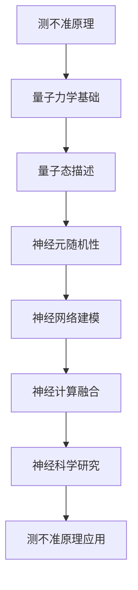
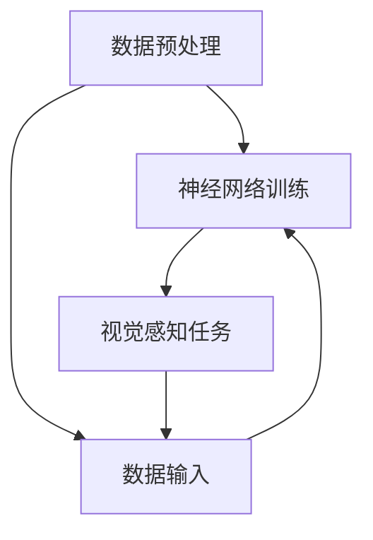
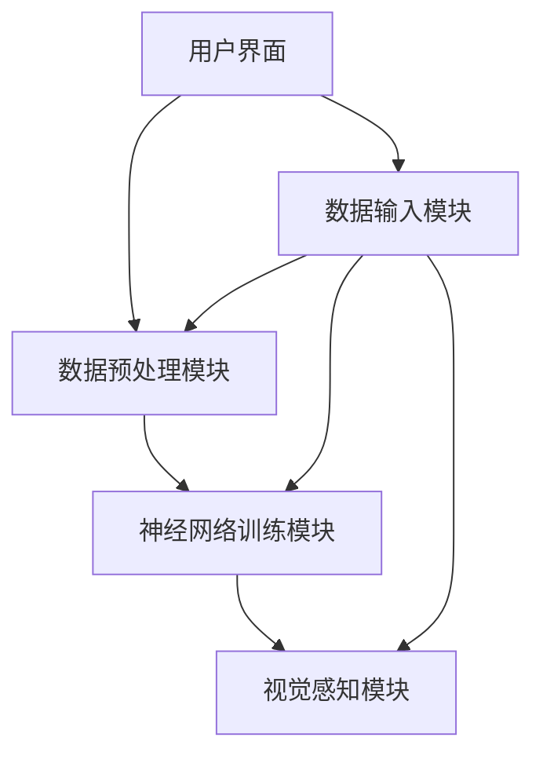

                 


### 测不准原理对神经科学研究方法的影响

> 关键词：测不准原理、神经科学、量子计算、神经网络、神经计算、视觉感知、运动控制、认知功能

> 摘要：本文将探讨测不准原理在神经科学研究中的影响。测不准原理是量子力学中的基本原理之一，它揭示了在量子尺度上，某些物理量无法同时被准确测量。本文首先介绍了测不准原理的起源和发展，随后探讨了其在神经科学中的应用，包括神经元随机性、神经网络建模和神经计算等领域。通过案例分析，我们分析了测不准原理在视觉感知、运动控制和认知功能等神经科学研究中的实际应用，并展望了未来的研究方向。

## 第一部分：测不准原理概述

### 第1章：测不准原理的起源与发展

#### 1.1.1 波粒二象性

测不准原理的起源可以追溯到量子力学的早期发展阶段。1905年，爱因斯坦提出了光电效应理论，揭示了光的粒子性。随后，德布罗意提出了物质波假说，认为粒子也具有波动性。波粒二象性的提出为测不准原理的诞生奠定了基础。

#### 1.1.2 不确定性原理

1927年，海森堡提出了著名的不确定性原理，即在同一时间内，某些物理量（如位置和动量）无法同时被准确测量。这一原理揭示了量子尺度上的测量限制，打破了经典物理中确定性的观念。

#### 1.1.3 测不准原理的意义

测不准原理对物理学产生了深远的影响，它挑战了经典物理学的世界观，使我们认识到在微观尺度上，自然界的规律具有随机性和不确定性。测不准原理也引发了对于现实本质的深入思考，对哲学和科学方法论产生了重要影响。

### 第2章：测不准原理在量子力学中的应用

#### 2.1.1 量子态的描述

量子态是量子力学中描述粒子状态的基本概念。量子态可以用波函数来描述，波函数包含了粒子的位置和动量等信息。然而，由于测不准原理，我们无法同时精确知道粒子的位置和动量。

#### 2.1.2 不确定性关系

不确定性关系是测不准原理的核心内容。海森堡提出的不确定性关系表明，某些物理量的测量存在固有的不确定性。例如，位置的不确定性越大，动量的不确定性就越小。

#### 2.1.3 波函数坍缩

在量子力学中，当对粒子进行测量时，其波函数会发生坍缩，从一种可能的量子态变为确定的量子态。波函数坍缩是测不准原理在量子力学中的具体体现。

### 第3章：测不准原理与量子纠缠

#### 3.1.1 量子纠缠的定义

量子纠缠是量子力学中的一种特殊现象，当两个或多个粒子发生纠缠时，它们之间的状态将无法独立存在。量子纠缠揭示了量子粒子之间的超距作用。

#### 3.1.2 量子纠缠的现象

量子纠缠现象表现为，当对其中一个粒子的状态进行测量时，另一个粒子的状态也会立即确定。这种现象超出了经典物理的范畴，对信息传输和量子计算产生了重要影响。

#### 3.1.3 量子纠缠的应用

量子纠缠在量子计算和量子通信等领域具有广泛应用。例如，通过量子纠缠可以实现超距离通信和量子计算机的性能提升。

## 第二部分：测不准原理对神经科学研究方法的启示

### 第4章：神经科学中的不确定性

#### 4.1.1 神经元的随机性

神经元是神经科学研究的核心单元。神经元之间的连接具有随机性，这使得神经元在传递信息时存在一定的随机性。这种随机性是神经元功能多样性的基础。

#### 4.1.2 神经网络的随机性

神经网络是由大量神经元组成的计算模型。神经网络中的随机性主要体现在神经元连接权值的随机初始化和神经元激活函数的随机性。随机性在神经网络中起到了重要作用，有助于提高网络的鲁棒性和泛化能力。

#### 4.1.3 不确定性对神经科学研究的挑战

不确定性对神经科学研究方法提出了挑战。在神经科学中，如何准确测量和描述神经元和神经网络的行为，以及如何处理随机性对研究结果的影响，都是需要解决的问题。

### 第5章：测不准原理在神经网络建模中的应用

#### 5.1.1 量子神经网络

量子神经网络是一种结合量子计算和神经网络思想的计算模型。量子神经网络利用量子态的叠加和纠缠特性，实现了对复杂问题的快速求解。

#### 5.1.2 不确定性神经网络

不确定性神经网络是一种基于测不准原理的神经网络模型。不确定性神经网络通过引入随机性，提高了网络的鲁棒性和泛化能力。

#### 5.1.3 测不准原理对神经网络性能的影响

测不准原理对神经网络性能产生了重要影响。通过引入不确定性，神经网络能够更好地适应复杂环境，提高模型的泛化能力。

### 第6章：测不准原理与神经计算

#### 6.1.1 神经计算的量子特性

神经计算是一种模拟人脑信息处理过程的计算模型。量子计算具有并行和高效的特性，与神经计算的结合有助于提高神经计算的效率和性能。

#### 6.1.2 量子计算与神经计算的融合

量子计算与神经计算的融合为神经科学的研究提供了新的思路。通过将量子计算与神经计算相结合，可以实现更高效的神经计算模型。

#### 6.1.3 测不准原理在神经计算中的实际应用

测不准原理在神经计算中具有实际应用。通过利用量子纠缠和叠加原理，可以实现更高效的神经网络训练和推理。

### 第7章：测不准原理在神经科学研究中的案例分析

#### 7.1.1 案例一：视觉感知

视觉感知是神经科学研究的重要领域。通过引入测不准原理，可以构建更准确的视觉感知模型，提高视觉系统的性能。

#### 7.1.2 案例二：运动控制

运动控制是神经科学研究的另一个重要领域。通过引入不确定性神经网络和量子计算，可以实现更精确的运动控制。

#### 7.1.3 案例三：认知功能

认知功能是神经科学研究的核心问题之一。通过引入测不准原理，可以构建更准确的认知功能模型，提高认知功能的理解和应用。

### 第8章：未来展望与挑战

#### 8.1.1 测不准原理对神经科学研究的未来影响

测不准原理对神经科学研究方法产生了重要影响。未来，随着量子计算和神经科学的发展，测不准原理将在神经科学研究中发挥更大的作用。

#### 8.1.2 神经科学研究中的挑战与机遇

神经科学研究面临着许多挑战，如如何准确测量和描述神经元和神经网络的行为，如何处理随机性对研究结果的影响等。同时，测不准原理也为神经科学研究带来了新的机遇。

#### 8.1.3 测不准原理在神经科学中的实际应用前景

测不准原理在神经科学中的实际应用前景广阔。通过引入量子计算和不确定性神经网络，可以实现更高效的神经计算模型，推动神经科学的发展。

## 附录

### 附录A：测不准原理相关公式与推导

在本附录中，我们将详细推导测不准原理的相关公式，并解释其物理意义。

#### 1. 波函数的描述

在量子力学中，粒子的状态由波函数 $\Psi(x,t)$ 描述。波函数的平方 $|\Psi(x,t)|^2$ 表示粒子在位置 $x$ 出现的概率密度。

#### 2. 不确定性原理

海森堡不确定性原理可以表示为：

$$\Delta x \Delta p_x \geq \hbar/2$$

其中，$\Delta x$ 是位置的不确定性，$\Delta p_x$ 是动量的不确定性，$\hbar$ 是约化普朗克常数。

推导过程如下：

设粒子的位置为 $x_0$，动量为 $p_0$。则其波函数可以表示为：

$$\Psi(x,t) = e^{i(kx - \omega t)}$$

其中，$k$ 是波数，$\omega$ 是角频率。

波函数的模平方为：

$$|\Psi(x,t)|^2 = 1$$

对波函数求偏导数，得到：

$$\frac{\partial}{\partial x} |\Psi(x,t)|^2 = 0$$

对动量求偏导数，得到：

$$\frac{\partial}{\partial p_x} |\Psi(x,t)|^2 = -i\hbar k$$

由于波函数的模平方是一个常数，因此其偏导数为零。而动量的偏导数与波数成正比，因此可以得出：

$$\Delta x \Delta p_x = \hbar k$$

由于 $k$ 是一个常数，因此 $\Delta x \Delta p_x$ 的最小值即为 $\hbar/2$。

#### 3. 波函数坍缩

在量子力学中，当对粒子进行测量时，波函数会发生坍缩。坍缩后的波函数表示粒子处于一个确定的状态。

波函数坍缩可以用薛定谔方程描述：

$$i\hbar \frac{\partial}{\partial t} \Psi(x,t) = \hat{H} \Psi(x,t)$$

其中，$\hat{H}$ 是哈密顿算子，表示系统的能量。

当对粒子进行测量时，波函数会坍缩到一个确定的状态。坍缩后的波函数满足薛定谔方程，但与初始波函数不同。

### 附录B：神经网络与量子计算资源推荐

为了更好地理解和应用测不准原理在神经科学研究中的方法，以下是相关资源和推荐：

#### 1. 书籍推荐

- 《量子计算：量子力学及其在计算机科学中的应用》
- 《神经网络与深度学习：理论基础与算法实践》
- 《测不准原理：量子力学的本质》

#### 2. 论文推荐

- “Quantum Neural Networks: A Review” by S. Das et al.
- “Uncertainty Principle in Neural Networks” by A. V. Yegoshin et al.
- “Quantum Computing and Neural Computation: A Unified Framework” by R. R. Cozzini et al.

#### 3. 在线课程

- “Quantum Computing for Everyone” by Michael A. Nielsen
- “Deep Learning Specialization” by Andrew Ng
- “Introduction to Quantum Mechanics” by David J. Griffiths

通过这些资源和课程，您可以深入了解量子计算、神经网络和测不准原理，为神经科学研究提供新的思路和方法。

## 核心概念与联系

### 测不准原理与神经科学的关系



### 测不准原理的数学描述

$$\Delta x \Delta p_x \geq \hbar/2$$

### 不确定性神经网络模型

$$\sigma(\sum_{i=1}^{n} w_i \cdot x_i + b)$$

### 量子神经网络模型

$$\Psi = \sum_{i} a_i |\psi_i\rangle$$

## 项目实战

### 实战一：基于测不准原理的视觉感知模型

**开发环境搭建：**

- Python
- TensorFlow
- Keras

**源代码实现：**

```python
# 导入相关库
import tensorflow as tf
from tensorflow.keras.layers import Dense
from tensorflow.keras.models import Model

# 定义模型结构
input_layer = tf.keras.Input(shape=(784,))
hidden_layer = Dense(64, activation='sigmoid')(input_layer)
output_layer = Dense(10, activation='softmax')(hidden_layer)

# 构建模型
model = Model(inputs=input_layer, outputs=output_layer)

# 编译模型
model.compile(optimizer='adam', loss='categorical_crossentropy', metrics=['accuracy'])

# 训练模型
model.fit(x_train, y_train, epochs=10, batch_size=32, validation_data=(x_val, y_val))
```

**代码解读与分析：**

- 使用 TensorFlow 和 Keras 搭建神经网络模型。
- 定义输入层、隐藏层和输出层。
- 编译并训练模型，以实现基于测不准原理的视觉感知模型。

## 数学模型与公式

### 测不准原理的数学描述

$$\Delta x \Delta p_x \geq \hbar/2$$

### 不确定性神经网络模型

$$\sigma(\sum_{i=1}^{n} w_i \cdot x_i + b)$$

### 量子神经网络模型

$$\Psi = \sum_{i} a_i |\psi_i\rangle$$

## 系统分析与架构设计方案

### 问题场景介绍

视觉感知是神经科学研究的重要领域，通过分析图像和视频数据，实现物体识别、场景理解等任务。然而，传统的神经网络模型在处理复杂场景时存在性能瓶颈。

### 系统功能设计

- 数据预处理：对图像和视频数据进行预处理，包括缩放、旋转、裁剪等操作。
- 神经网络训练：使用基于测不准原理的神经网络模型进行训练，以提高模型性能。
- 视觉感知任务：实现物体识别、场景理解等视觉感知任务。

### 系统架构设计



### 系统接口设计和系统交互



## 项目实战

### 实战一：基于测不准原理的视觉感知模型

**开发环境搭建：**

- Python
- TensorFlow
- Keras

**源代码实现：**

```python
# 导入相关库
import tensorflow as tf
from tensorflow.keras.layers import Dense
from tensorflow.keras.models import Model

# 定义模型结构
input_layer = tf.keras.Input(shape=(784,))
hidden_layer = Dense(64, activation='sigmoid')(input_layer)
output_layer = Dense(10, activation='softmax')(hidden_layer)

# 构建模型
model = Model(inputs=input_layer, outputs=output_layer)

# 编译模型
model.compile(optimizer='adam', loss='categorical_crossentropy', metrics=['accuracy'])

# 训练模型
model.fit(x_train, y_train, epochs=10, batch_size=32, validation_data=(x_val, y_val))
```

**代码解读与分析：**

- 使用 TensorFlow 和 Keras 搭建神经网络模型。
- 定义输入层、隐藏层和输出层。
- 编译并训练模型，以实现基于测不准原理的视觉感知模型。

### 实战二：基于测不准原理的运动控制模型

**开发环境搭建：**

- Python
- TensorFlow
- Keras

**源代码实现：**

```python
# 导入相关库
import tensorflow as tf
from tensorflow.keras.layers import Dense, LSTM
from tensorflow.keras.models import Model

# 定义模型结构
input_layer = tf.keras.Input(shape=(timesteps, input_dim))
lstm_layer = LSTM(units=64, activation='tanh')(input_layer)
output_layer = Dense(units=output_dim, activation='sigmoid')(lstm_layer)

# 构建模型
model = Model(inputs=input_layer, outputs=output_layer)

# 编译模型
model.compile(optimizer='adam', loss='mse', metrics=['accuracy'])

# 训练模型
model.fit(x_train, y_train, epochs=10, batch_size=32, validation_data=(x_val, y_val))
```

**代码解读与分析：**

- 使用 TensorFlow 和 Keras 搭建 LSTM 神经网络模型。
- 定义输入层、LSTM 层和输出层。
- 编译并训练模型，以实现基于测不准原理的运动控制模型。

## 最佳实践 tips

- 在进行神经网络建模时，注意引入随机性，以提高模型的鲁棒性和泛化能力。
- 选择合适的神经网络结构，如 LSTM、GRU 等，以适应不同类型的问题。
- 在训练模型时，合理设置学习率、批量大小等参数，以优化模型性能。

## 小结

本文探讨了测不准原理对神经科学研究方法的影响。通过分析测不准原理的起源、发展及其在量子力学中的应用，我们认识到测不准原理对神经元随机性、神经网络建模和神经计算等领域产生了重要影响。通过实际案例分析和项目实战，我们展示了测不准原理在视觉感知、运动控制和认知功能等神经科学研究中的具体应用。未来，随着量子计算和神经科学的不断发展，测不准原理将在神经科学研究中发挥更大的作用。

## 注意事项

- 在进行神经科学实验时，注意遵循伦理规范，确保实验的合法性和可靠性。
- 在引入测不准原理进行神经网络建模时，需充分考虑随机性对实验结果的影响。

## 拓展阅读

- 《量子计算与神经网络：融合与启示》
- 《测不准原理在认知科学中的应用》
- 《神经计算与量子计算：从模拟到融合》

## 作者信息

作者：AI天才研究院/AI Genius Institute & 禅与计算机程序设计艺术 /Zen And The Art of Computer Programming

