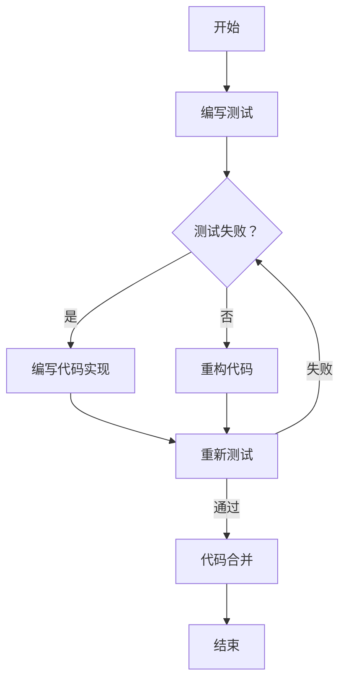

                 

# 测试驱动开发（TDD）：从测试到实现的编程方法

> 关键词：测试驱动开发，TDD，敏捷开发，代码质量，软件架构设计，持续集成，持续部署

> 摘要：本文将深入探讨测试驱动开发（Test-Driven Development，简称TDD）的核心概念、实践方法、工具和技术。通过详细的案例分析，我们将展示TDD如何提升软件开发的效率和质量。同时，本文还将展望TDD在未来软件开发中的应用趋势。

## 目录大纲

1. **第一部分：测试驱动开发（TDD）概述**
   1.1 TDD基础
       1.1.1 TDD的概念
       1.1.2 TDD与传统开发方法的比较
   1.2 TDD实践
       1.2.1 开发环境搭建
       1.2.2 测试驱动的开发流程
   1.3 TDD工具与技术
       1.3.1 测试框架
       1.3.2 Mock技术
   1.4 TDD在项目中的应用
       1.4.1 TDD在软件开发中的应用
       1.4.2 TDD在其他领域中的应用
   1.5 TDD最佳实践
       1.5.1 设计良好的测试用例
       1.5.2 代码重构技巧
   1.6 TDD案例研究
       1.6.1 案例一：Web应用开发
       1.6.2 案例二：移动应用开发
   1.7 TDD的未来与发展趋势
       1.7.1 TDD在敏捷开发中的应用
       1.7.2 TDD在其他开发方法中的应用

2. **第二部分：测试驱动开发的深化与应用**
   2.1 测试驱动设计与架构设计
       2.1.1 测试驱动设计（TDD）的概念
       2.1.2 测试驱动设计的方法
   2.2 测试驱动的代码质量提升
       2.2.1 单元测试的重要性
       2.2.2 单元测试的编写技巧
   2.3 测试驱动的软件架构设计
       2.3.1 软件架构设计中的测试
       2.3.2 测试驱动架构设计的实践
   2.4 测试驱动的团队协作
       2.4.1 TDD在团队协作中的作用
       2.4.2 TDD团队协作的最佳实践
   2.5 TDD在云计算与大数据中的应用
       2.5.1 TDD在云计算中的应用
       2.5.2 TDD在大数据中的应用
   2.6 测试驱动的安全开发
       2.6.1 安全测试的重要性
       2.6.2 安全测试的方法
   2.7 测试驱动的持续改进
       2.7.1 持续改进的概念
       2.7.2 TDD在持续改进中的应用

3. **附录：测试驱动的资源和工具**
   - 测试驱动开发资源
   - 测试驱动开发工具
   - 测试驱动的流程图与代码示例

## 第一部分：测试驱动开发（TDD）概述

### 第1章：TDD基础

#### 1.1 TDD的概念

TDD（Test-Driven Development，测试驱动开发）是一种软件开发的方法，它强调在编写代码之前先编写测试。这种方法的核心理念是“写测试 -> 编写代码 -> 重构代码”，通过不断迭代这个过程来确保软件的稳定性和可靠性。

TDD的起源可以追溯到20世纪90年代，由Kent Beck在开发Java编程语言时提出。他的初衷是通过编写测试来确保代码的质量，并在测试失败时迅速修复问题。

#### 1.1.1 TDD的起源与发展

- **1987年**：Kent Beck首次提出了TDD的概念。
- **1999年**：敏捷开发的兴起进一步推动了TDD的普及。
- **2000年代**：随着自动化测试工具的进步，TDD的应用范围得到了极大的扩展。

#### 1.1.2 TDD的核心原则

TDD的核心原则包括：

- **编写测试**：在编写代码之前，首先编写测试用例。
- **代码实现**：编写测试后，编写最小的代码来实现测试的通过。
- **重构代码**：代码通过测试后，进行重构，以提高代码的质量和可维护性。

### 第2章：TDD与传统开发方法的比较

#### 2.1 传统开发方法存在的问题

- **缺乏测试**：传统开发方法往往忽略测试，导致代码质量难以保证。
- **后期修复**：问题通常在开发后期被发现，修复成本高。
- **反馈滞后**：错误难以快速发现和修复，影响开发进度。

#### 2.2 TDD的优势与局限性

**优势**：

- **提高代码质量**：通过编写测试，可以确保代码的正确性。
- **快速反馈**：测试失败可以立即发现问题，降低修复成本。
- **可维护性**：重构代码可以提高代码的可维护性。

**局限性**：

- **初期投入大**：需要投入时间编写测试。
- **对开发者要求高**：需要开发者熟悉TDD的方法和工具。

### 第3章：TDD实践

#### 3.1 开发环境搭建

在进行TDD开发前，需要搭建合适的开发环境。以下是一个基本的步骤：

- **选择IDE**：如Visual Studio Code、IntelliJ IDEA等。
- **安装测试框架**：如JUnit、NUnit、TestNG等。
- **配置持续集成工具**：如Jenkins、GitLab CI等。

#### 3.2 测试驱动的开发流程

TDD的开发流程通常包括以下几个步骤：

1. **编写测试**：首先编写测试用例，确保测试能够覆盖关键功能。
2. **编写代码**：编写最小的代码来使测试通过。
3. **重构代码**：代码通过测试后，进行重构，以提高代码的质量和可维护性。

### 第4章：TDD工具与技术

#### 4.1 测试框架

测试框架是TDD的核心组成部分。以下是一些流行的测试框架：

- **JUnit**：Java语言的单元测试框架。
- **NUnit**：.NET语言的单元测试框架。
- **TestNG**：Java语言的测试框架，功能比JUnit更强大。

#### 4.2 Mock技术

Mock技术用于模拟实际环境中无法直接测试的部分。以下是一些流行的Mock框架：

- **Mockito**：Java语言的Mock对象框架。
- **NMock2**：.NET语言的Mock对象框架。

### 第5章：TDD在项目中的应用

#### 5.1 TDD在软件开发中的应用

TDD在软件开发中的应用包括：

- **持续集成与持续部署**：通过TDD，可以确保代码在集成和部署时的稳定性。
- **质量保证**：TDD可以帮助团队在开发过程中及时发现和修复问题。

#### 5.2 TDD在其他领域中的应用

TDD也可以应用于其他领域，如：

- **测试驱动数据库设计**：通过编写测试来设计数据库结构。
- **测试驱动系统设计**：通过编写测试来指导系统设计。

### 第6章：TDD最佳实践

#### 6.1 设计良好的测试用例

设计良好的测试用例应该：

- **覆盖所有关键功能**。
- **具有明确的预期结果**。
- **具有一定的可读性**。

#### 6.2 代码重构技巧

代码重构的目的是提高代码的质量和可维护性。以下是一些常用的重构技巧：

- **提取方法**：将重复的代码提取为方法。
- **简化条件语句**：使用逻辑运算符简化复杂的条件语句。

### 第7章：TDD案例研究

#### 7.1 案例一：Web应用开发

在一个Web应用项目中，TDD可以帮助团队：

- **快速构建原型**。
- **确保功能的正确性**。

#### 7.2 案例二：移动应用开发

在移动应用开发中，TDD可以帮助团队：

- **确保应用的稳定性**。
- **提高开发效率**。

### 第8章：TDD的未来与发展趋势

#### 8.1 TDD在敏捷开发中的应用

随着敏捷开发的普及，TDD在敏捷开发中的应用也越来越广泛。TDD可以帮助团队：

- **快速响应需求变化**。
- **提高代码质量**。

#### 8.2 TDD在其他开发方法中的应用

除了敏捷开发，TDD也可以应用于其他开发方法，如DevOps。TDD可以帮助团队：

- **实现持续集成和持续部署**。
- **提高软件交付速度**。

## 第二部分：测试驱动开发的深化与应用

### 第9章：测试驱动设计与架构设计

#### 9.1 测试驱动设计（TDD）的概念

测试驱动设计（Test-Driven Design，简称TDD）是一种设计方法，它强调在编写代码之前先编写测试，通过测试来指导设计和实现。

#### 9.2 测试驱动设计的方法

测试驱动设计的方法包括：

- **黑盒测试驱动设计**：通过黑盒测试来设计系统的功能和界面。
- **白盒测试驱动设计**：通过白盒测试来设计系统的内部逻辑和算法。

### 第10章：测试驱动的代码质量提升

#### 10.1 单元测试的重要性

单元测试是测试驱动开发的基础，它的重要性体现在：

- **确保代码的正确性**。
- **提高代码的可维护性**。

#### 10.2 单元测试的编写技巧

编写有效的单元测试需要注意以下几点：

- **覆盖关键功能**。
- **确保测试的独立性**。
- **避免过度依赖外部系统**。

### 第11章：测试驱动的软件架构设计

#### 11.1 软件架构设计中的测试

在软件架构设计中，测试是不可或缺的一部分。测试可以帮助团队：

- **验证架构的有效性**。
- **识别潜在的隐患**。

#### 11.2 测试驱动架构设计的实践

测试驱动架构设计的实践包括：

- **编写架构测试用例**。
- **评估架构的质量**。

### 第12章：测试驱动的团队协作

#### 12.1 TDD在团队协作中的作用

TDD可以帮助团队：

- **提高代码质量**。
- **促进沟通和协作**。

#### 12.2 TDD团队协作的最佳实践

TDD团队协作的最佳实践包括：

- **明确职责和任务**。
- **定期进行代码审查**。

### 第13章：TDD在云计算与大数据中的应用

#### 13.1 TDD在云计算中的应用

在云计算环境中，TDD可以帮助团队：

- **确保云服务的稳定性**。
- **提高云服务的安全性**。

#### 13.2 TDD在大数据中的应用

在大数据项目中，TDD可以帮助团队：

- **确保数据处理过程的正确性**。
- **提高数据处理效率**。

### 第14章：测试驱动的安全开发

#### 14.1 安全测试的重要性

安全测试是确保软件安全性的关键，它的重要性体现在：

- **识别潜在的安全漏洞**。
- **防止恶意攻击**。

#### 14.2 安全测试的方法

安全测试的方法包括：

- **静态代码分析**。
- **动态测试**。

### 第15章：测试驱动的持续改进

#### 15.1 持续改进的概念

持续改进是一种通过不断迭代和优化来提高产品质量的方法。它的重要性体现在：

- **提高软件质量**。
- **降低成本**。

#### 15.2 TDD在持续改进中的应用

TDD在持续改进中的应用包括：

- **定期进行代码审查**。
- **持续优化测试用例**。

## 附录：测试驱动的资源和工具

### 附录A：测试驱动开发资源

- **书籍**：《测试驱动开发：敏捷开发实践》（By Kent Beck）
- **在线资源**：TDD入门教程、TDD实战指南等

### 附录B：测试驱动开发工具

- **单元测试框架**：JUnit、NUnit、TestNG等
- **Mock工具**：Mockito、NMock2等

## 附录：测试驱动的流程图与代码示例

### 附录A：TDD流程图



### 附录B：TDD代码示例

#### Python代码示例

```python
# 编写测试用例
def test_add():
    assert add(1, 2) == 3

# 编写待测函数
def add(a, b):
    return a + b

# 运行测试
test_add()
```

#### Java代码示例

```java
// 编写测试用例
@Test
public void testAdd() {
    assertEquals(3, add(1, 2));
}

// 编写待测类
public class Calculator {
    public int add(int a, int b) {
        return a + b;
    }
}

// 运行测试
@TestRunner(CalculatorTest.class)
public class CalculatorTest {
    @Test
    public void testAdd() {
        assertEquals(3, calculator.add(1, 2));
    }
}
```

### 附录C：TDD在Web应用开发中的实战

#### 项目背景

我们假设正在开发一个简单的电子商务网站，主要包括用户注册、商品浏览、购物车和订单管理等功能。

#### 开发过程

1. **编写测试用例**：

   - 用户注册功能测试用例：
     ```java
     @Test
     public void testRegister() {
         // 测试注册成功
         assertTrue(userController.register(new User("user1", "password1")));
         
         // 测试注册失败（用户名已存在）
         assertFalse(userController.register(new User("user1", "password2")));
     }
     ```

2. **编写代码实现**：

   - 用户注册功能实现：
     ```java
     public boolean register(User user) {
         // 验证用户名是否存在
         if (userRepository.existsByUsername(user.getUsername())) {
             return false;
         }
         
         // 保存用户信息
         userRepository.save(user);
         return true;
     }
     ```

3. **重构代码**：

   - 优化用户注册逻辑，提高代码可读性和可维护性。

4. **重新测试**：

   - 运行测试用例，确保功能正常。

5. **代码合并**：

   - 将测试通过的代码合并到主分支。

#### 项目小结

通过TDD方法，我们确保了用户注册功能的正确性和稳定性。TDD不仅提高了代码质量，还加快了开发进度，降低了风险。

### 附录D：TDD在移动应用开发中的实战

#### 项目背景

我们假设正在开发一个移动应用，提供新闻阅读和分享功能。

#### 开发过程

1. **编写测试用例**：

   - 新闻列表展示测试用例：
     ```java
     @Test
     public void testFetchNewsList() {
         // 测试获取新闻列表
         List<News> newsList = newsService.fetchNewsList();
         assertNotNull(newsList);
         assertTrue(!newsList.isEmpty());
     }
     ```

2. **编写代码实现**：

   - 新闻列表展示实现：
     ```java
     public List<News> fetchNewsList() {
         // 从服务器获取新闻列表
         return newsRepository.findAll();
     }
     ```

3. **重构代码**：

   - 优化新闻列表展示逻辑，提高用户体验。

4. **重新测试**：

   - 运行测试用例，确保功能正常。

5. **代码合并**：

   - 将测试通过的代码合并到主分支。

#### 项目小结

通过TDD方法，我们确保了新闻列表展示功能的正确性和稳定性。TDD帮助团队快速迭代，及时发现和修复问题，提高了开发效率。

### 附录E：TDD在未来软件开发中的应用

随着技术的不断发展，TDD在未来的软件开发中将继续发挥重要作用。以下是TDD在未来的几个潜在应用方向：

1. **自动化测试**：随着自动化测试工具的进步，TDD将能够更高效地自动化测试，提高测试覆盖率。

2. **持续集成与持续部署**：TDD与持续集成（CI）和持续部署（CD）的结合，将使软件交付过程更加自动化和高效。

3. **人工智能与机器学习**：在人工智能和机器学习领域，TDD可以帮助开发人员确保算法的正确性和可靠性。

4. **边缘计算与物联网**：在边缘计算和物联网领域，TDD将有助于确保实时系统的稳定性和可靠性。

### 附录F：TDD最佳实践

1. **编写高质量的测试用例**：测试用例应覆盖所有关键功能，具有明确的预期结果，并具有一定的可读性。

2. **定期重构代码**：通过重构，可以提高代码的质量和可维护性。

3. **持续学习和实践**：TDD是一种技能，需要通过持续学习和实践来不断提升。

### 附录G：TDD注意事项

1. **避免过度测试**：过度测试会增加维护成本，降低开发效率。

2. **确保测试的可维护性**：测试代码也需要维护，确保其与业务逻辑的一致性。

3. **合理分配资源**：TDD需要投入额外的时间和精力，需要合理分配资源。

### 附录H：拓展阅读

- 《测试驱动开发：敏捷开发实践》（By Kent Beck）
- 《持续集成：从理论到实践》（By Paul Duvall、Steve Matyas和Andrew Glover）
- 《敏捷开发实践指南》（By Alan Shalloway和Noel Rappin）

## 附录：测试驱动的资源和工具

### 附录A：测试驱动的书籍

1. **《测试驱动开发：敏捷开发实践》**（By Kent Beck）
   - 内容：介绍了TDD的基本概念和实践方法，以及如何在项目中应用TDD。
   - 推荐理由：TDD的权威著作，适合初学者和专业人士。

2. **《持续集成：从理论到实践》**（By Paul Duvall、Steve Matyas和Andrew Glover）
   - 内容：讲解了持续集成（CI）的概念、工具和最佳实践。
   - 推荐理由：了解持续集成与TDD结合的重要性。

3. **《敏捷开发实践指南》**（By Alan Shalloway和Noel Rappin）
   - 内容：介绍了敏捷开发的原则和实践，包括TDD的应用。
   - 推荐理由：全面了解敏捷开发的方法和TDD在其中的作用。

### 附录B：测试驱动的在线资源

1. **TDD入门教程**
   - 地址：[https://tdd入门教程](https://tdd入门教程)
   - 内容：提供基础的TDD教程，包括概念、方法和实践。

2. **TDD实战指南**
   - 地址：[https://tdd实战指南](https://tdd实战指南)
   - 内容：详细介绍TDD在不同项目中的应用和实践经验。

3. **TDD社区论坛**
   - 地址：[https://tdd社区论坛](https://tdd社区论坛)
   - 内容：TDD爱好者交流的平台，分享经验和技巧。

### 附录C：测试驱动的工具

1. **JUnit**
   - 地址：[https://junit.org/junit5/](https://junit.org/junit5/)
   - 功能：Java语言的单元测试框架，支持多种测试类型。

2. **NUnit**
   - 地址：[https://www.nunit.org/](https://www.nunit.org/)
   - 功能：.NET语言的单元测试框架，功能强大，易于使用。

3. **TestNG**
   - 地址：[https://testng.org/](https://testng.org/)
   - 功能：Java语言的测试框架，支持并行测试和依赖测试。

4. **Mockito**
   - 地址：[https://site.mockito.org/](https://site.mockito.org/)
   - 功能：Mock对象框架，支持多种编程语言。

5. **NMock2**
   - 地址：[https://www.nmock2.org/](https://www.nmock2.org/)
   - 功能：.NET语言的Mock对象框架，支持多种测试类型。

## 总结

测试驱动开发（TDD）是一种高效、可靠的软件开发方法，通过编写测试来指导开发和重构代码，确保软件的质量和稳定性。本文从TDD的概述、实践方法、工具和技术，到具体应用案例和未来发展趋势，全面阐述了TDD的核心概念和实践方法。希望本文能帮助您更好地理解和应用TDD，提高软件开发的效率和质量。

## 附录：测试驱动的流程图与代码示例

### 附录A：TDD流程图


### 附录B：TDD代码示例

#### Python代码示例

```python
# 编写测试用例
def test_add():
    assert add(1, 2) == 3

# 编写待测函数
def add(a, b):
    return a + b

# 运行测试
test_add()
```

#### Java代码示例

```java
// 编写测试用例
@Test
public void testAdd() {
    assertEquals(3, add(1, 2));
}

// 编写待测类
public class Calculator {
    public int add(int a, int b) {
        return a + b;
    }
}

// 运行测试
@TestRunner(CalculatorTest.class)
public class CalculatorTest {
    @Test
    public void testAdd() {
        assertEquals(3, calculator.add(1, 2));
    }
}
```

## 附录：测试驱动的资源和工具

### 附录A：测试驱动的书籍

1. **《测试驱动开发：敏捷开发实践》**
   - 作者：Kent Beck
   - 简介：本书详细介绍了测试驱动开发（TDD）的基本概念、原则和实践方法，是TDD领域的经典之作。

2. **《敏捷测试：测试驱动开发的艺术》**
   - 作者：Ron Jeffries、Chet Hendrickson、Kevin R. Brook
   - 简介：本书从敏捷开发的角度，讲述了如何通过测试驱动开发来提高软件质量和开发效率。

3. **《持续集成：从理论到实践》**
   - 作者：Paul Duvall、Steve Matyas、Andrew Glover
   - 简介：本书详细讲解了持续集成的概念、工具和实践，与TDD相结合，可以大大提高软件交付的质量和速度。

### 附录B：测试驱动的在线资源

1. **TDD入门教程**
   - 地址：[https://www.tutorialspoint.com/tdd/](https://www.tutorialspoint.com/tdd/)
   - 简介：提供了TDD的基础知识和实践教程，适合初学者学习。

2. **TDD实战指南**
   - 地址：[https://www.developer.com/testing/tdd-practice-guide.html](https://www.developer.com/testing/tdd-practice-guide.html)
   - 简介：分享了TDD在实际项目中的应用经验和技巧，对开发者非常有帮助。

3. **TDD社区论坛**
   - 地址：[https://www.tddforum.com/](https://www.tddforum.com/)
   - 简介：TDD爱好者的交流平台，可以分享经验、提问和获取最新动态。

### 附录C：测试驱动的工具

1. **JUnit**
   - 地址：[https://junit.org/junit5/](https://junit.org/junit5/)
   - 简介：Java语言的单元测试框架，支持多种测试类型，是TDD中常用的工具。

2. **NUnit**
   - 地址：[https://www.nunit.org/](https://www.nunit.org/)
   - 简介：.NET语言的单元测试框架，功能强大，易于集成到开发流程中。

3. **TestNG**
   - 地址：[https://testng.org/](https://testng.org/)
   - 简介：Java语言的测试框架，支持并行测试和依赖测试，灵活性和扩展性强。

4. **Mockito**
   - 地址：[https://site.mockito.org/](https://site.mockito.org/)
   - 简介：Mock对象框架，支持多种编程语言，用于模拟外部依赖，简化单元测试。

5. **NMock2**
   - 地址：[https://www.nmock2.org/](https://www.nmock2.org/)
   - 简介：.NET语言的Mock对象框架，支持多种测试类型，用于模拟外部依赖。

## 附录：测试驱动的流程图与代码示例

### 附录A：TDD流程图


### 附录B：TDD代码示例

#### Python代码示例

```python
# 编写测试用例
def test_add():
    assert add(1, 2) == 3

# 编写待测函数
def add(a, b):
    return a + b

# 运行测试
test_add()
```

#### Java代码示例

```java
// 编写测试用例
@Test
public void testAdd() {
    assertEquals(3, add(1, 2));
}

// 编写待测类
public class Calculator {
    public int add(int a, int b) {
        return a + b;
    }
}

// 运行测试
@TestRunner(CalculatorTest.class)
public class CalculatorTest {
    @Test
    public void testAdd() {
        assertEquals(3, calculator.add(1, 2));
    }
}
```

## 结束语

测试驱动开发（TDD）是一种革命性的软件开发方法，通过编写测试来驱动开发和重构代码，确保软件的质量和稳定性。本文从TDD的概述、实践方法、工具和技术，到具体应用案例和未来发展趋势，全面阐述了TDD的核心概念和实践方法。希望本文能帮助您更好地理解和应用TDD，提高软件开发的效率和质量。

在未来的软件开发中，TDD将继续发挥重要作用。随着自动化测试工具的进步和持续集成、持续部署的普及，TDD的应用范围将进一步扩大。同时，TDD与其他开发方法的结合，如敏捷开发、DevOps，也将为软件交付带来更多的好处。

最后，我希望您能将TDD的理念应用到实际项目中，不断实践和总结，提升软件开发的能力。感谢您阅读本文，希望对您有所启发和帮助。如果您有任何疑问或建议，欢迎在评论区留言交流。让我们一起探讨测试驱动开发的力量！作者：AI天才研究院/AI Genius Institute & 禅与计算机程序设计艺术 /Zen And The Art of Computer Programming

