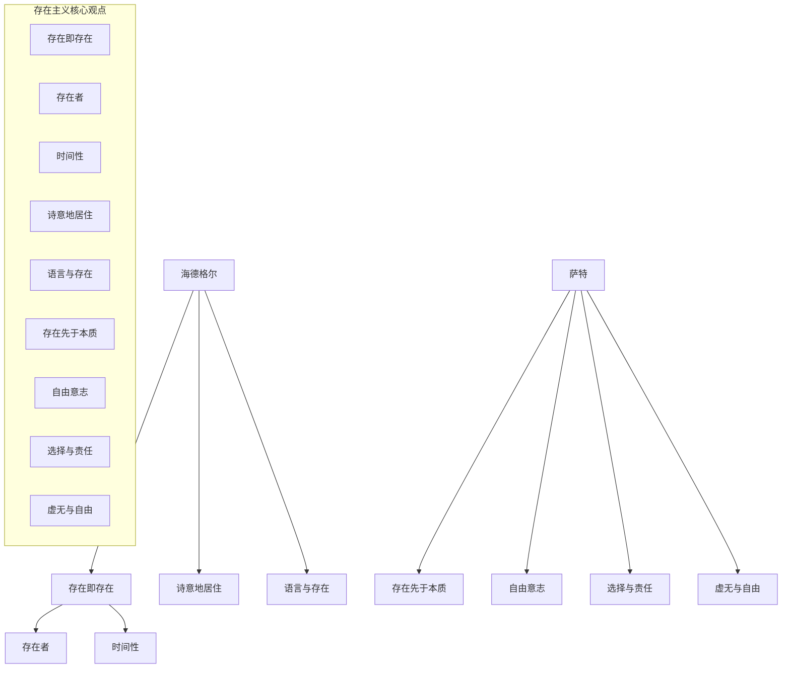

                 

### 第一部分：引言

### 1.1 研究背景与意义

#### 海德格尔与萨特的思想背景介绍

马丁·海德格尔（Martin Heidegger）是20世纪最具影响力的哲学家之一，他的哲学思想对西方哲学产生了深远的影响。海德格尔于1889年出生在德国西南部的小镇梅斯堡，他的哲学主要围绕着“存在”（Being）的概念展开，提出了“存在主义”（Existentialism）这一哲学流派。海德格尔关注人的存在状态，探讨了人与世界、时间、语言等之间的关系。

让-保罗·萨特（Jean-Paul Sartre）是另一位在20世纪具有广泛影响力的哲学家，他也是存在主义的代表人物之一。萨特于1905年出生在法国巴黎，他的哲学思想强调了个体自由、选择和责任。萨特的作品《存在与虚无》（Being and Nothingness）是他最重要的哲学著作之一，对存在主义进行了深入探讨。

#### 存在与虚无的哲学探讨

存在主义哲学的核心问题是“存在”与“虚无”的关系。海德格尔认为，存在是超越了传统哲学理解的一个概念，他提出了“存在即存在”（Being-there）的观点，强调了个体存在的独特性和主观性。海德格尔的存在主义思想强调人的自由和创造性，他认为人是“存在者”（Dasein），即“在世界中存在的人”。

萨特则将存在主义推向了极端，他认为人类的存在本身就是一种“虚无”（Nothingness），但通过自由的选择和行动，个体可以创造自己的意义。萨特的存在主义哲学强调个体的主观性和自由意志，认为人类通过选择和行动来定义自己。

#### 本文的研究意义

本文旨在通过分析海德格尔与萨特的存在主义思想，探讨存在与虚无的关系，并分析二者在哲学思考中的差异与联系。本文的研究意义在于：

1. 深入理解存在主义哲学的核心概念，为读者提供一种新的哲学思考方式。
2. 通过对比分析，揭示海德格尔与萨特哲学思想的共性与差异，为哲学研究提供新的视角。
3. 探讨存在主义哲学在当代社会中的应用，为解决现实问题提供理论支持。

### 1.2 存在与虚无的概念分析

#### 存在主义的起源与发展

存在主义哲学的起源可以追溯到古希腊哲学，特别是苏格拉底和柏拉图的思想。然而，存在主义作为一种独立的哲学流派，主要是在20世纪初期发展起来的。存在主义的先驱包括尼采和克尔凯郭尔，他们的思想对后来的哲学家产生了深远的影响。

海德格尔是存在主义哲学的奠基人之一，他的著作《存在与时间》（Being and Time）对存在主义哲学进行了系统阐述。海德格尔的存在主义思想强调了个体存在的独特性和主观性，他认为人类的存在是一种“存在者”，即“在世界中存在的人”。

萨特则将存在主义推向了极端，他的哲学著作《存在与虚无》对存在主义进行了深入的探讨。萨特的存在主义哲学强调了个体自由、选择和责任，他认为人类的存在本身就是一种“虚无”，但通过自由的选择和行动，个体可以创造自己的意义。

#### 虚无的概念及其影响

虚无（Nothingness）在存在主义哲学中具有重要的地位。海德格尔认为，虚无是存在的本质，是人类存在的背景。他提出了“虚无即存在”（Nothingness is being）的观点，认为虚无是存在的根基。

萨特则将虚无视为人类存在的状态，他认为人类的存在本身就是一种“虚无”，但通过自由的选择和行动，个体可以摆脱虚无的束缚，创造自己的意义。萨特的存在主义哲学强调了虚无的存在，但他同时也认为，虚无并不是人类的终结，而是一种挑战，一种需要通过行动和选择来克服的困境。

#### 存在主义与虚无主义的关系

存在主义与虚无主义在概念上有所关联，但二者有着本质的区别。虚无主义认为世界和存在本身没有意义，人类的生命和努力都是徒劳的。而存在主义则认为，尽管世界和存在本身可能没有意义，但个体可以通过自由的选择和行动，为自己创造意义。

海德格尔和萨特都在自己的哲学体系中探讨了虚无的概念，但他们都认为虚无不是人类存在的终点，而是一种需要通过行动和选择来超越的困境。因此，存在主义与虚无主义在根本上是有区别的。

### 1.3 海德格尔与萨特的思想比较

#### 存在主义的分歧与融合

海德格尔和萨特的存在主义思想在许多方面存在分歧，但同时也存在一定的融合。

首先，在海德格尔看来，存在是一种超越传统的概念，他提出了“存在即存在”（Being-there）的观点，强调了个体存在的独特性和主观性。海德格尔认为，存在是超越语言的，不能用传统哲学的方式去理解。

萨特则将存在主义推向了极端，他的哲学著作《存在与虚无》对存在主义进行了深入的探讨。萨特的存在主义哲学强调了个体自由、选择和责任，他认为人类的存在本身就是一种“虚无”，但通过自由的选择和行动，个体可以创造自己的意义。

其次，在虚无的概念上，海德格尔认为虚无是存在的本质，是人类存在的背景。萨特则将虚无视为人类存在的状态，他认为人类的存在本身就是一种“虚无”，但通过自由的选择和行动，个体可以摆脱虚无的束缚，创造自己的意义。

尽管海德格尔和萨特在许多观点上存在分歧，但他们都认为虚无不是人类存在的终点，而是一种需要通过行动和选择来超越的困境。这种分歧与融合体现了存在主义哲学的复杂性和多样性。

### 总结

本文通过对海德格尔与萨特的存在主义思想进行了深入分析，探讨了存在与虚无的概念及其哲学意义。在接下来的部分中，我们将分别对海德格尔和萨特的存在主义思想进行详细阐述，进一步分析他们在存在与虚无问题上的观点和理论。通过这样的分析，我们希望能够为读者提供一种新的哲学思考方式，并对当代哲学研究提供一定的理论支持。

### 2.1 存在主义的起源与核心观点

#### 海德格尔哲学的起源

马丁·海德格尔（Martin Heidegger）是20世纪最具影响力的哲学家之一，他的哲学思想对西方哲学产生了深远的影响。海德格尔于1889年出生在德国西南部的小镇梅斯堡，他的哲学主要围绕着“存在”（Being）的概念展开，提出了“存在主义”（Existentialism）这一哲学流派。

海德格尔的哲学思想深受尼采的影响。尼采的“超人”概念和“上帝已死”的论断激发了海德格尔对传统哲学的反思，促使他重新审视人类的存在状态。海德格尔在《存在与时间》（Being and Time）一书中提出了他的核心思想，即存在是一种超越传统哲学理解的概念，人类的存在是一种独特的、主观的体验。

#### 存在主义的基本观点

海德格尔的存在主义哲学有几个核心观点：

1. **存在即存在**：这是海德格尔哲学中最基本的观点。他强调了存在的独特性和个体性。存在不是一种可以被描述或定义的状态，而是一种“存在者”的动态体验。

2. **存在者**：海德格尔用“存在者”（Dasein）来描述人类的存在状态。“存在者”意味着人类不仅存在于世界中，而且与世界有着紧密的联系。人类的存在是一种“在世界中存在”的状态。

3. **存在的时间性**：海德格尔认为，时间是存在的核心特征。存在不是静态的，而是一种动态的过程。人类的存在是时间性的，意味着我们的存在是一种持续不断的体验，而非固定不变的状态。

4. **语言的构成与存在的关系**：海德格尔认为，语言不仅仅是人类交流的工具，而且是存在的构成要素。语言不仅反映了我们的思维，也创造了我们的存在方式。

5. **诗意与存在**：海德格尔提出了“诗意地居住”（dwelling poetically）的概念，他认为通过诗歌和艺术，人类可以更深刻地体验存在的意义。

#### 存在主义的核心观点解析

**存在即存在**：这个观点挑战了传统的哲学思维方式，传统的哲学往往试图用定义和概念来描述存在，而海德格尔认为这种描述是有限的，存在本身是超越语言和概念的。

**存在者**：海德格尔通过“存在者”这个概念强调了人类的独特性和个体性。每个“存在者”都有其独特的存在方式，这种独特性体现在人类与世界的关系中。

**存在的时间性**：海德格尔认为，时间是存在的核心特征，这与牛顿物理学中时间的观念有很大不同。在牛顿物理学中，时间是一个绝对的、连续的量，而在海德格尔看来，时间是一种人类体验的存在方式。

**语言的构成与存在的关系**：海德格尔认为，语言不仅是表达思想的工具，而且是构成我们存在的手段。语言不仅反映了我们的思维，也影响了我们的存在方式。

**诗意与存在**：海德格尔通过“诗意地居住”这个概念，强调了艺术和诗歌在人类生活中的重要性。他认为，通过诗歌和艺术，人类可以超越日常生活的表面现象，体验到更深层次的存在意义。

### 结论

海德格尔的存在主义哲学提出了许多与传统哲学不同的观点，强调了存在的独特性、个体性和时间性。通过分析“存在即存在”、“存在者”、“存在的时间性”、“语言的构成与存在的关系”和“诗意与存在”等核心观点，我们可以更深入地理解海德格尔的存在主义哲学。在接下来的部分中，我们将进一步探讨存在与时间的关系，以及海德格尔如何通过时间性来理解存在的本质。

### 2.2 存在与时间

#### 时间性与存在论

在海德格尔的存在主义哲学中，时间性（ temporality）是一个核心概念。时间性不仅是存在的构成要素，而且是理解存在方式的关键。海德格尔通过时间性来揭示存在的本质，强调了人类存在的动态性和历史性。

海德格尔将时间性分为三个层面：先行性（temporalizing）、当前性（presence）和随后性（duration）。这三个层面共同构成了人类存在的时间结构。

1. **先行性**：先行性是指人类对未来事物的期待和向往。它代表了人类存在的开放性和可能性。人类通过先行性来设定目标和规划未来，这种先行性是存在的基础。

2. **当前性**：当前性是指人类对现实的关注和体验。它是人类存在的核心，是我们与世界的直接接触和互动。当前性使人类能够感知和理解存在。

3. **随后性**：随后性是指人类对过去事物的回顾和反思。它代表了人类存在的回顾性和历史性。通过随后性，人类能够从历史中吸取教训，形成自我意识。

#### 存在的时间结构

海德格尔认为，时间性是存在的本质特征。存在不是静态的，而是一种动态的过程，这种动态过程通过时间性来体现。

1. **过去**：海德格尔将过去视为存在的背景。过去不仅包含了人类的历史，也包含了存在的记忆和传统。人类通过回忆过去来理解自己的存在。

2. **现在**：现在是指人类存在的当前时刻。现在是存在的核心，是我们与世界互动和体验的时刻。海德格尔强调，现在不是简单的瞬间，而是一种持续的、动态的体验。

3. **未来**：未来是指人类存在的可能性。未来代表了人类存在的开放性和未完成性。通过设定目标和规划未来，人类能够为自己创造意义。

#### 存在与时间的关系

海德格尔认为，存在与时间密不可分。存在不是独立于时间的，而是通过时间来体现和表达的。时间性不仅揭示了存在的本质，也影响了人类的思维和行为。

1. **时间性对存在的构成**：时间性构成了存在的结构。人类的存在是通过时间性来体验和表达的，没有时间性，就没有存在。

2. **存在对时间性的影响**：存在也影响了时间性的体验。人类的存在方式决定了他们对时间的感知和体验。例如，一个乐观的人可能会感受到时间的流逝较快，而一个悲观的人可能会感受到时间的流逝较慢。

#### 时间性的哲学意义

海德格尔的时间性概念具有重要的哲学意义：

1. **批判传统哲学**：海德格尔通过时间性来批判传统哲学，特别是牛顿物理学中时间观念的局限性。他认为，传统哲学忽视了时间性，将时间视为一种客观的、连续的量，而不是人类体验的动态过程。

2. **强调个体性**：海德格尔的时间性概念强调了人类存在的个体性和独特性。每个人的时间体验都是独特的，这种独特性构成了人类存在的丰富性和多样性。

3. **提供新的哲学视角**：海德格尔的时间性概念为哲学提供了一种新的视角，使我们能够更深入地理解人类的存在方式。通过时间性，我们可以更好地理解人类的历史、文化和社会。

### 结论

通过分析存在的时间性，我们可以更深入地理解海德格尔的存在主义哲学。时间性不仅是存在的构成要素，也是理解存在方式的关键。海德格尔通过时间性揭示了存在的本质，强调了人类存在的动态性和历史性。在接下来的部分中，我们将探讨海德格尔如何通过言说来理解存在的本质，以及语言在存在中的角色。

### 2.3 言说与存在

#### 语言的构成与存在的关系

在海德格尔的存在主义哲学中，语言是一个核心概念。他提出，语言不仅仅是人类交流的工具，更是存在的构成要素。海德格尔认为，存在是通过语言来表达的，语言与存在有着密不可分的关系。

海德格尔提出了“语言即存在”（Language is Being）的观点，他认为语言不仅是人类思维的表达，更是人类存在的本质。语言不仅是信息的传递工具，更是人类与世界互动的方式。通过语言，人类能够理解世界，同时也塑造了自身的存在。

#### 言说的本体论意义

海德格尔将言说（ speech）视为一种本体论活动。他提出了“言说即存在”（Speech is Being）的观点，认为言说是人类存在的根本方式。言说不仅仅是说话的行为，更是一种存在的方式。

海德格尔认为，言说具有本体论的意义，因为它揭示了存在的本质。通过言说，人类能够表达自己的存在，也能够理解和反思自己的存在。言说不仅是人类交流的工具，更是人类存在的方式。

#### 语言的构成要素

海德格尔认为，语言的构成要素包括词语、句法和语境。这些要素共同构成了人类交流和理解的基础。

1. **词语**：词语是语言的最基本单位，它们承载了特定的意义。海德格尔强调，词语的意义不是固定的，而是通过与世界的互动中不断生成的。

2. **句法**：句法是语言的结构规则，它决定了词语之间的关系和组合方式。海德格尔认为，句法不仅仅是语言的规则，更是人类思维和存在的方式。

3. **语境**：语境是指语言使用的具体情境。海德格尔认为，语境对于理解语言的意义至关重要。不同的语境会影响词语和句法的理解，从而影响存在的表达。

#### 语言与存在的关系

海德格尔通过“言说即存在”的观点，强调了语言与存在的密切关系。他认为，语言不仅表达了存在的意义，更是存在的构成要素。

1. **存在的表达**：通过语言，人类能够表达自己的存在状态。语言是人类存在的直接表达方式，它使我们能够与他人交流和沟通。

2. **存在的理解**：语言也是人类理解世界和自身存在的方式。通过语言，我们能够理解和反思自己的存在，从而获得更深层次的存在体验。

3. **存在的创造**：海德格尔认为，语言具有创造存在的力量。通过言说，人类能够创造出新的意义和存在方式，从而改变和塑造自己的存在。

#### 语言在存在中的角色

海德格尔认为，语言在存在中扮演了多重角色：

1. **交流工具**：语言是人类交流的基础，它使我们能够与他人分享信息和经验。

2. **理解工具**：语言是理解世界和自身存在的方式，它帮助我们理解和反思自己的存在状态。

3. **创造工具**：语言具有创造存在的力量，通过言说，人类能够创造出新的意义和存在方式。

### 结论

通过分析语言在存在中的角色，我们可以更深入地理解海德格尔的存在主义哲学。语言不仅是人类交流和理解的工具，更是存在的构成要素。海德格尔通过“言说即存在”的观点，强调了语言与存在的密切关系。在接下来的部分中，我们将探讨诗意的存在观，以及诗与真理之间的关系。

### 2.4 诗意与存在

#### 诗意的存在观

海德格尔提出了“诗意地居住”（dwelling poetically）的概念，他认为诗意是人类存在的本质。诗意不仅是一种艺术形式，更是一种存在的状态。海德格尔认为，通过诗意，人类能够超越日常生活的表面现象，体验到更深层次的存在意义。

海德格尔将诗意视为一种“解蔽”（Unmasking）的过程，他认为诗意能够揭示存在的真相，使人类能够直接体验存在。诗意不是一种简单的美，而是一种深刻的理解和感悟。通过诗意，人类能够与存在进行对话，体验到存在的本质。

#### 诗与真理

在海德格尔看来，诗与真理是紧密相连的。他提出了“诗即真理”（Poetry is Truth）的观点，认为诗是一种揭示真理的方式。海德格尔认为，真理不是一种客观的、静态的存在，而是一种动态的、生成的过程。

诗通过语言的表达，揭示了存在的真相。诗歌中的语言不仅是信息的传递，更是存在的表达。海德格尔认为，诗歌具有一种独特的力量，能够将人类从现实的束缚中解放出来，体验到存在的自由。

#### 诗意存在的意义

诗意存在的意义在于：

1. **超越日常现实**：诗意使人类能够超越日常生活的表面现象，体验到更深层次的存在意义。

2. **理解存在**：通过诗意，人类能够更深刻地理解存在，体验存在的本质。

3. **创造新的意义**：诗意能够创造出新的意义和存在方式，使人类能够不断超越自我，实现自我价值。

#### 诗意存在的哲学价值

海德格尔的诗意存在观具有重要的哲学价值：

1. **批判传统哲学**：海德格尔通过诗意存在观，批判了传统哲学中静态、理性的思维方式。他认为，传统哲学忽视了存在的动态性和诗意。

2. **强调个体性**：海德格尔的诗意存在观强调了人类存在的个体性和独特性。每个人的诗意体验都是独特的，这种独特性构成了人类存在的丰富性和多样性。

3. **提供新的哲学视角**：海德格尔的诗意存在观为哲学提供了一种新的视角，使我们能够更深入地理解人类的存在方式。

### 结论

通过分析诗意与存在的关系，我们可以更深入地理解海德格尔的存在主义哲学。诗意不仅是人类存在的本质，也是一种揭示真理的方式。海德格尔通过诗意存在观，强调了存在的动态性和个体性，为我们提供了一种新的哲学思考方式。在接下来的部分中，我们将探讨萨特的存在主义哲学，以及他在自由、选择和责任方面的观点。

### 3.1 萨特的存在主义哲学

#### 存在主义的基本观点

让-保罗·萨特（Jean-Paul Sartre）是20世纪最具影响力的哲学家之一，他的存在主义哲学对现代哲学产生了深远的影响。萨特的存在主义哲学有几个核心观点：

1. **自由意志**：萨特认为，人类是自由的存在，每个人都有权自由选择自己的行为和生活方式。自由意志是存在的本质，是人类的根本特征。

2. **选择与责任**：萨特强调，选择带来了责任。每个选择都是一种自由行为，但同时也要求个体为自己的选择承担责任。责任是自由意志的必然结果。

3. **存在先于本质**：萨特提出了“存在先于本质”的观点，即人类的存在是先于其本质的。人类不是生来就有固定本质的实体，而是通过自己的选择和行动来定义自己。

4. **孤独与自主性**：萨特认为，人类是孤独的存在，每个人都是独立的个体，没有预设的本质或目的。这种孤独促使个体追求自主性，通过自己的选择来创造自我。

#### 自我存在与自由意志

萨特的哲学认为，自我存在是通过自由意志来体现的。他提出了“自我存在先于自我定义”的观点，即我们首先存在，然后通过自由的选择和行动来定义自己。萨特认为，自由意志是存在的本质，它赋予了人类创造自己命运的能力。

萨特强调，自由意志不是无限制的，而是受到社会和历史条件的限制。个体在做出选择时，必须考虑到这些限制，但最终的选择权仍然属于个体。这种选择赋予了个体责任，个体必须为自己的选择承担责任。

#### 虚无与自由

萨特认为，虚无是存在的本质，人类的存在本身就是一种“虚无”。虚无并不是一种消极的概念，而是一种潜在的、无限的可能性。萨特认为，人类通过自由的选择和行动，可以超越虚无，为自己创造意义。

萨特的哲学中，虚无是一种存在的状态，它揭示了人类存在的无依无靠和孤立无援。然而，正是这种虚无，使人类具有了自由选择的权利，可以通过选择和行动来超越虚无，为自己创造存在的意义。

#### 选择与责任

萨特强调，选择带来了责任。每个选择都是一种自由行为，但同时也要求个体为自己的选择承担责任。萨特认为，责任是自由意志的必然结果，是人类的本质特征。

萨特提出了“选择即责任”的观点，即每个选择都是一种责任。个体必须为自己的选择承担责任，无论选择的结果是积极还是消极。这种责任意识使个体在自由的选择中保持了自我意识的清醒。

#### 存在先于本质

萨特的“存在先于本质”观点是他哲学思想的核心。他认为，人类不是生来就有固定本质的实体，而是通过自己的选择和行动来定义自己。存在的本质不是预先设定的，而是在个体的选择和行动中不断生成的。

萨特认为，这种观点打破了传统哲学中关于本质和存在的二元对立。在传统哲学中，本质是先于存在的，而萨特则认为，存在是先于本质的。这种观点强调了人类自由选择的重要性，使个体在自由和责任中找到了存在的意义。

#### 孤独与自主性

萨特认为，人类是孤独的存在，每个人都是独立的个体，没有预设的本质或目的。这种孤独促使个体追求自主性，通过自己的选择来创造自我。

萨特强调了个体在存在中的自主性，他认为，个体必须通过自己的选择和行动来定义自己。这种自主性使个体在孤独中找到了存在的意义，也使个体在自由和责任中保持了自我意识的清醒。

### 结论

通过分析萨特的存在主义哲学，我们可以更深入地理解自由、选择和责任在人类存在中的重要性。萨特的存在主义哲学强调了人类自由选择的权利和责任，他认为，通过自由的选择和行动，个体可以超越虚无，为自己创造存在的意义。在接下来的部分中，我们将进一步探讨虚无与自由的关系，以及选择与责任在萨特哲学中的具体体现。

### 3.2 虚无与自由

#### 虚无的哲学意义

在萨特的存在主义哲学中，虚无（Nothingness）是一个核心概念。虚无不仅是存在的本质，也是个体自由的前提。萨特认为，虚无是存在的起点，是人类存在的背景。

虚无并不是一种消极的概念，而是一种潜在的、无限的可能性。萨特将虚无视为一种“空白的画布”，人类可以在其上自由地描绘自己的存在。虚无揭示了人类存在的无依无靠和孤立无援，但也赋予了人类自由选择的权利。

#### 自由意志的哲学探讨

自由意志（Free Will）是萨特存在主义哲学的另一个核心概念。萨特认为，自由意志是存在的本质，是人类存在的根本特征。

自由意志并不意味着人类可以无限制地做出选择，而是意味着人类具有选择的能力和权利。萨特认为，自由意志使个体能够超越虚无，为自己创造存在的意义。

然而，自由意志也带来了责任。萨特强调，选择带来了责任，每个选择都是一种自由行为，但同时也要求个体为自己的选择承担责任。这种责任意识使个体在自由的选择中保持了自我意识的清醒。

#### 虚无与自由的关系

在萨特看来，虚无与自由是密不可分的。虚无是存在的背景，自由是存在的本质。萨特认为，虚无揭示了人类存在的无依无靠和孤立无援，但也赋予了人类自由选择的权利。

1. **虚无的背景**：虚无是存在的背景，它使人类的存在显得孤独和孤立。人类的存在不是预先设定的，而是在虚无的基础上通过自由的选择和行动来创造的。

2. **自由的本质**：自由是存在的本质，是人类存在的根本特征。自由意志使个体能够超越虚无，为自己创造存在的意义。

3. **自由的责任**：自由带来了责任，每个选择都是一种自由行为，但同时也要求个体为自己的选择承担责任。这种责任意识使个体在自由的选择中保持了自我意识的清醒。

#### 自由与选择

萨特认为，自由与选择是紧密相连的。自由意志使个体能够做出选择，而每个选择都是一种自由行为。萨特强调了选择的多样性，他认为，个体可以通过不同的选择来定义自己。

1. **选择的多样性**：萨特认为，个体可以通过多种不同的选择来定义自己。这种多样性反映了人类存在的丰富性和复杂性。

2. **选择的自由性**：萨特强调了选择的自由性，他认为，个体具有选择的权利和自由。这种自由使个体能够在虚无的基础上创造自己的存在。

#### 选择与责任

萨特认为，选择与责任是密不可分的。每个选择都是一种自由行为，但同时也要求个体为自己的选择承担责任。这种责任意识使个体在自由的选择中保持了自我意识的清醒。

1. **选择的责任**：萨特认为，选择带来了责任，个体必须为自己的选择承担责任。

2. **责任的意义**：责任使个体在自由的选择中保持了自我意识的清醒。通过承担责任，个体能够更好地理解自己的选择和存在的意义。

### 结论

通过分析虚无与自由的关系，我们可以更深入地理解萨特的存在主义哲学。虚无不仅是存在的背景，也是个体自由的前提。自由意志使个体能够超越虚无，为自己创造存在的意义。在自由的选择中，个体必须为自己的选择承担责任，这种责任意识使个体在自由的选择中保持了自我意识的清醒。在接下来的部分中，我们将进一步探讨选择与责任在萨特哲学中的具体体现，以及这些概念在现实生活中的应用。

### 3.3 选择与责任

#### 自我选择与个人责任

在萨特的存在主义哲学中，选择与责任是密不可分的。萨特认为，人类的存在是通过自我选择来定义的，而每个选择都伴随着相应的责任。自我选择是存在主义的核心概念，它强调了人类在创造自己命运中的主动性和自由性。

萨特提出了“存在先于本质”的观点，即人类先存在于世界，然后通过自己的选择和行动来定义自己。这种观点打破了传统哲学中关于预先设定的本质和存在的二元对立，强调了人类自由选择的自主性。每个选择都是一种自由行为，但同时也要求个体为自己的选择承担责任。

1. **自我选择的自由性**：萨特认为，个体具有选择的权利和自由。这种自由体现在个体能够自主决定自己的行为和生活方式，而不是被动地接受外界的安排。

2. **选择的责任性**：每个选择都带来了相应的责任。个体必须为自己的选择承担责任，无论选择的结果是积极还是消极。这种责任意识使个体在自由的选择中保持了自我意识的清醒。

#### 自由意志的必然结果

选择与责任是自由意志的必然结果。萨特认为，自由意志是人类存在的本质，它赋予了人类创造自己命运的能力。然而，自由意志也带来了责任。萨特强调，选择带来了责任，个体必须为自己的选择承担责任。

1. **选择的多样性**：自由意志使个体能够在多种选择中做出决定。这种多样性反映了人类存在的丰富性和复杂性。个体可以通过不同的选择来定义自己，从而创造出独特的存在方式。

2. **责任的意义**：责任使个体在自由的选择中保持了自我意识的清醒。通过承担责任，个体能够更好地理解自己的选择和存在的意义。责任不仅是对选择后果的承担，也是对自身存在的反思和肯定。

#### 选择与个人责任

选择与个人责任是萨特存在主义哲学中的核心概念。萨特认为，个体在自由的选择中必须为自己的选择承担责任。这种责任意识体现在以下几个方面：

1. **道德责任**：个体在道德上必须对自己的选择承担责任。道德责任要求个体遵守一定的道德规范，尊重他人的权利和尊严。通过承担道德责任，个体能够在自由的选择中保持道德的清醒。

2. **社会责任**：个体在社会中必须对自己的选择承担责任。社会责任要求个体对社会和他人负责，积极参与社会事务，为社会的发展和进步贡献自己的力量。

3. **自我责任**：个体在自我选择中必须对自己的选择承担责任。自我责任要求个体对自己的行为和生活方式负责，不断反思和改进自己的选择，追求个人成长和自我实现。

#### 选择与个人责任的关系

选择与个人责任是相互关联的。选择是个人自由的表达，而责任是对选择的回应。没有选择，就没有责任；没有责任，选择就失去了意义。选择与个人责任的关系体现了个体在自由与责任中的平衡。

1. **选择的自由性**：个体具有选择的权利和自由，但自由并不意味着无限制。个体在做出选择时必须考虑到责任，承担相应的责任。

2. **责任的选择性**：责任是对选择的回应，个体必须为自己的选择承担责任。责任的选择性体现了个体在自由选择中的自我约束和自律。

3. **选择的反思性**：通过承担责任，个体能够反思自己的选择，理解选择的后果，并在未来做出更好的选择。选择的反思性使个体在自由的选择中不断成长和进步。

### 结论

通过分析选择与责任的关系，我们可以更深入地理解萨特的存在主义哲学。选择与责任是密不可分的，它们共同构成了个体在自由与责任中的存在状态。自我选择与个人责任使个体能够在自由的选择中保持自我意识的清醒，并为自己的选择承担责任。在现实生活中的应用，这种哲学思想要求个体在自由与责任之间找到平衡，通过自主选择和承担责任来定义自己的存在。

### 3.4 恋爱与存在

#### 恋爱中的存在主义分析

萨特的存在主义哲学不仅探讨了个体自由、选择和责任，还涉及了恋爱关系中的存在主义分析。在萨特的哲学中，恋爱是一种存在主义的体验，它揭示了个体在关系中的自由选择和自我定义。

1. **存在的孤独性**：萨特认为，人类是孤独的存在，每个人都是独立的个体，没有预设的本质或目的。恋爱关系中的存在主义分析强调了个体在孤独中的自由选择和自我定义。

2. **自由选择的冲突**：在恋爱中，个体必须做出选择，选择与某个人建立关系。这种选择是自由的，但同时也带来了冲突。个体在恋爱关系中必须面对选择的自由和责任的冲突。

3. **关系中的自我定义**：恋爱关系中的存在主义分析强调了个体在关系中的自我定义。通过恋爱，个体能够更好地理解自己，同时也定义了对方的存在。

#### 存在主义视角下的爱情与孤独

萨特的存在主义哲学认为，爱情是一种存在主义的体验，它揭示了个体在关系中的自由选择和自我定义。从存在主义视角看，爱情与孤独密切相关。

1. **爱情的本质**：萨特认为，爱情是一种自由的选择，是一种相互尊重和理解的体验。在爱情中，个体能够超越孤独，与对方建立深刻的联系。

2. **孤独的影响**：孤独是爱情的背景，它揭示了人类存在的无依无靠和孤立无援。孤独使个体在恋爱关系中保持自我意识，同时也促进了个体在关系中的自我定义。

3. **爱情与孤独的辩证关系**：爱情与孤独是辩证的关系。孤独使个体在恋爱中保持自由选择的权利，而爱情则使个体在孤独中找到了归属和意义。

#### 恋爱中的选择与责任

在萨特的存在主义哲学中，恋爱中的选择与责任是密不可分的。个体在恋爱中必须为自己的选择承担责任。

1. **选择的权利**：恋爱中的选择是个体自由的权利，每个人都有权选择是否与他人建立关系。这种权利体现了存在的自由性。

2. **责任的重担**：然而，选择也带来了责任。个体必须为自己的选择承担责任，无论恋爱关系的结果是积极还是消极。这种责任意识使个体在恋爱中保持了自我意识的清醒。

3. **关系的平衡**：在恋爱中，个体必须在自由与责任之间找到平衡。这种平衡要求个体在自由选择的同时，也要承担相应的责任，从而维持关系的稳定和健康。

#### 存在主义视角下的爱情与责任

从存在主义视角看，爱情中的责任不仅是对伴侣的承诺，也是对自身存在的承诺。个体在恋爱中必须为自己的选择承担责任。

1. **承诺的重要性**：承诺是爱情中的核心要素，它体现了个体对选择的坚定和责任。通过承诺，个体能够在恋爱中保持稳定和信任。

2. **责任的意义**：责任使个体在恋爱中保持了自我意识的清醒，同时也促进了个体在关系中的自我成长。通过承担责任，个体能够更好地理解自己，并在关系中实现自我价值的提升。

3. **关系的可持续性**：责任是恋爱关系的基石，它使个体能够在面对挑战和困难时保持关系的稳定和可持续性。通过承担责任，个体能够共同克服困难，实现关系的长期发展。

### 结论

通过分析恋爱中的存在主义分析，我们可以更深入地理解萨特的存在主义哲学。恋爱是一种存在主义的体验，它揭示了个体在关系中的自由选择和自我定义。从存在主义视角看，爱情与孤独密切相关，爱情中的选择与责任是密不可分的。在恋爱中，个体必须在自由与责任之间找到平衡，从而实现自我成长和关系的发展。

### 4.1 存在主义对话的意义

#### 对话在哲学思考中的作用

哲学思考的根本在于对存在、真理、道德等基本问题的探讨。然而，这些问题往往具有复杂性和多样性，需要通过对话和辩论来深化理解。对话在哲学思考中具有至关重要的作用，它能够促进思想的碰撞和交流，激发新的见解和认识。

1. **思想碰撞**：通过对话，不同的思想观念可以在同一平台上进行碰撞。这种碰撞能够激发新的思考，推动哲学思考的深入发展。

2. **交流与理解**：对话使得哲学家们能够分享自己的观点和思考，通过倾听和交流来增进理解。这种理解不仅有助于澄清各自的观点，也能够促使哲学思考的全面发展。

3. **挑战与反思**：对话能够对现有的哲学观点进行挑战和反思，促使哲学家们重新审视自己的思想。这种挑战和反思有助于推动哲学思考的进步和变革。

#### 存在主义对话的目标

存在主义对话的目标在于探讨存在与虚无的关系，以及个体在存在中的角色和责任。通过海德格尔与萨特的存在主义对话，哲学家们试图解决以下几个核心问题：

1. **存在的本质**：探讨存在的本质和内涵，理解存在与个体之间的关系。

2. **虚无的含义**：探讨虚无的概念和哲学意义，理解虚无在存在中的地位和作用。

3. **自由与责任**：探讨个体在自由选择中的责任，理解自由与责任的辩证关系。

4. **自我定义**：探讨个体如何通过自由选择和行动来定义自己，理解自我在存在中的角色。

#### 存在主义对话的意义

存在主义对话的意义在于：

1. **深化哲学理解**：通过对话，哲学家们能够更深入地理解存在主义的基本概念和观点，从而深化对哲学问题的认识。

2. **推动哲学发展**：存在主义对话能够激发新的哲学思考，推动哲学的进步和发展。

3. **现实应用**：存在主义对话不仅有助于哲学理论的发展，也能够为现实生活中的问题提供哲学思考和解决方案。

4. **多元视角**：存在主义对话促进了不同哲学观念之间的交流与融合，形成了多元的哲学思考方式。

### 结论

通过分析存在主义对话的意义，我们可以看到对话在哲学思考中的重要作用。海德格尔与萨特的存在主义对话不仅有助于深化对存在与虚无的理解，也推动了哲学思考的进步。在接下来的部分中，我们将详细分析对话内容，探讨存在主义之间的思想交锋和理论差异。

### 4.2 对话内容与思想交锋

#### 存在论与认识论的交锋

海德格尔与萨特的存在主义对话中，存在论（Ontology）与认识论（Epistemology）是核心议题。两位哲学家的观点在存在与认识的关系上存在显著差异。

1. **海德格尔的存在论**：海德格尔强调存在的动态性和主体性。他认为，存在是一种“存在者”（Dasein），即“在世界中存在的人”。海德格尔的存在论关注个体存在的独特性和主观性，强调存在先于本质。

   - **存在与时间**：海德格尔认为，时间是存在的核心特征。存在是一种动态的过程，通过时间性来体现。人类的存在是时间性的，体现了个体的历史性和连续性。

   - **存在与语言**：海德格尔提出“语言即存在”的观点，认为语言不仅是表达思想的工具，也是构成人类存在的手段。语言揭示了存在的本质，使我们能够理解和表达存在。

2. **萨特的存在论**：萨特的存在主义哲学强调自由意志和个体责任。他认为，人类的存在是一种“虚无”（Nothingness），通过自由的选择和行动来定义自己。

   - **自由意志**：萨特认为，自由意志是存在的本质，人类通过自由的选择来定义自己。每个选择都是一种自由行为，但同时也要求个体承担责任。

   - **存在先于本质**：萨特认为，存在先于本质，人类不是生来就有固定本质的实体，而是通过自己的选择和行动来定义自己。这种观点打破了传统哲学中关于本质和存在的二元对立。

#### 存在论与认识论的交锋

在存在论与认识论的交锋中，海德格尔与萨特在以下方面存在分歧：

1. **存在的本质**：海德格尔认为，存在的本质是超越语言和概念的，而萨特则强调存在的具体性和个体性。海德格尔强调存在的动态性和主体性，而萨特则强调自由意志和个体责任。

2. **存在与时间**：海德格尔认为，时间是存在的核心特征，而萨特则认为时间是个体选择和行动的背景。海德格尔的存在论强调历史性和连续性，而萨特的存在论强调自由性和选择性。

3. **语言的角色**：海德格尔认为，语言是存在的构成要素，而萨特则认为语言是表达思想的工具。海德格尔强调语言与存在的紧密关系，而萨特则强调语言在个体自我定义中的作用。

#### 对话的融合与互补

尽管海德格尔与萨特在存在论与认识论上存在分歧，但他们的对话也体现了融合与互补：

1. **存在的个体性**：两位哲学家都强调了存在的个体性。海德格尔通过“存在者”的概念，强调了个体存在的独特性；萨特通过“存在先于本质”的观点，强调了个体在自由选择中的主动性。

2. **存在的动态性**：两位哲学家都认为，存在是一种动态的过程。海德格尔通过时间性来体现存在的动态性，而萨特则通过自由的选择和行动来体现存在的动态性。

3. **存在的意义**：两位哲学家都试图探讨存在的意义。海德格尔通过诗意和语言来揭示存在的本质，而萨特则通过自由和责任来探讨存在的意义。

### 结论

通过分析对话内容与思想交锋，我们可以看到海德格尔与萨特的存在主义在存在论与认识论上的差异和融合。他们的对话不仅揭示了存在主义的多样性和复杂性，也为我们提供了更深刻的哲学思考。在接下来的部分中，我们将探讨存在主义哲学在社会中的应用，以及它在解决现实问题中的作用。

### 4.3 存在主义在社会中的应用

#### 存在主义哲学对社会的影响

存在主义哲学对当代社会产生了深远的影响，尤其是在个人价值观、道德伦理、社会正义等方面。萨特和海德格尔的存在主义思想为个体提供了一种反思自我、追求自由和责任的哲学框架，这对现代社会有着重要的启示作用。

1. **个人价值观**：存在主义强调个体的自由和自主性，鼓励人们通过自我选择和行动来定义自己的价值观。这种思想有助于个体在多元文化和社会背景下找到自己的位置，树立独特的价值观体系。

2. **道德伦理**：存在主义哲学提出了道德责任和自由选择的观念，这为当代道德伦理提供了新的视角。存在主义认为，个体必须为自己的行为承担责任，即使在面对困境和道德抉择时也要坚持自己的原则。

3. **社会正义**：存在主义关注个体的自由和平等，这为当代社会正义问题提供了理论基础。存在主义哲学强调每个人都应该有机会自由选择和实现自己的潜能，这有助于推动社会公平和正义的实现。

#### 存在主义视角下的社会问题分析

从存在主义视角看，现代社会面临着一系列复杂的社会问题，如经济不平等、政治压迫、文化冲突等。存在主义哲学为我们提供了分析和解决这些问题的理论工具。

1. **经济不平等**：存在主义认为，经济不平等是现代社会的一个普遍问题。萨特的存在主义强调个体自由和平等，主张通过社会改革和制度创新来解决经济不平等。例如，通过税收改革和社会保障制度的完善，实现财富的再分配，减少贫富差距。

2. **政治压迫**：存在主义哲学关注个体的自由和权利。海德格尔和萨特都批判了极权主义和压制个体的政治体制。他们主张通过自由和民主的政治制度来保障个体的权利，推动社会的自由发展。

3. **文化冲突**：现代社会充满了文化多样性和冲突。存在主义哲学强调个体的自由选择和自我定义，有助于缓解文化冲突。通过尊重个体的自由选择和多样性，可以促进不同文化之间的对话和理解，实现文化的和谐共存。

#### 存在主义哲学在现实生活中的应用

存在主义哲学不仅在理论上具有重要价值，也在现实生活中得到了广泛应用。

1. **教育**：在教育领域，存在主义哲学鼓励学生通过自我探索和反思来发展自己的价值观和人生目标。教育者可以运用存在主义思想，帮助学生理解自我、培养批判思维和创新能力。

2. **心理健康**：存在主义哲学对心理健康领域也有重要影响。存在主义强调个体的自由选择和自我定义，这有助于人们面对心理困扰时找到自己的解决方式，培养积极的生活态度。

3. **社会运动**：存在主义哲学在当代社会运动中发挥了重要作用。从民权运动到性别平权运动，存在主义思想鼓励人们通过自由选择和行动来推动社会变革，实现社会正义。

### 结论

通过分析存在主义哲学在社会中的应用，我们可以看到它在个人价值观、道德伦理、社会正义等方面的深远影响。存在主义哲学为解决现代社会问题提供了理论支持和实践指导。在未来的发展中，存在主义哲学将继续为人类社会的进步和个体的自由发展提供重要的思想资源。

### 4.4 存在与虚无的现代意义

#### 现代社会中的存在主义思考

随着社会的发展和科技的进步，现代社会面临着前所未有的挑战和变革。在这个背景下，存在主义哲学为我们提供了深刻的思考和指导。

1. **技术发展的反思**：现代社会的技术发展极大地改变了人类的生活方式和社会结构。存在主义哲学提醒我们，技术发展虽然带来了便利和进步，但也带来了新的问题和困境。海德格尔提出了“技术追问”（Technikfrage），强调技术对人类存在的威胁和挑战。他认为，技术的发展可能导致人类与自然、人与人之间的疏离，使人类失去存在的意义。

2. **个体自由的挑战**：在现代社会中，个体自由面临着新的挑战。全球化、信息爆炸和社交媒体的发展使得个体的自由选择变得复杂和多样，但同时也受到更多的限制和约束。萨特的存在主义哲学强调个体在自由选择中的责任和自我定义。在现代社会，个体如何在自由与责任之间找到平衡，成为了一个重要的哲学问题。

3. **存在的本质探讨**：现代社会中，人们对存在的本质和意义有了更深入的探讨。随着科技的进步和信息的泛滥，人们开始反思存在的真实性和意义。海德格尔的“诗意居住”观念提醒我们，通过诗歌和艺术，人类可以超越现实的表象，体验到更深层次的存在意义。

#### 虚无主义与存在主义的当代对话

在现代哲学中，虚无主义（Nihilism）与存在主义（Existentialism）的对话具有重要意义。虚无主义认为，世界和存在本身没有意义，人类的生活和努力都是徒劳的。而存在主义则认为，尽管世界和存在可能没有固有的意义，但个体可以通过自由的选择和行动为自己创造意义。

1. **虚无主义的现代意义**：虚无主义在现代社会中具有一定的现实意义。面对科技发展带来的不确定性和社会变革，一些人对未来感到迷茫和恐惧，从而陷入虚无主义的思维。虚无主义提醒我们，面对不确定性和困境，我们需要找到自己的意义和方向。

2. **存在主义的回应**：存在主义对虚无主义进行了有力的回应。萨特的存在主义哲学强调，尽管存在本身可能没有固有的意义，但个体可以通过自由的选择和行动来为自己创造意义。海德格尔的“诗意居住”观念也强调了人类在存在中的创造性和主动性。存在主义认为，个体的选择和行动不仅能够改变自己的存在状态，也能够影响和塑造世界。

3. **当代对话的意义**：虚无主义与存在主义的对话为我们提供了深刻的哲学思考。通过这种对话，我们能够更好地理解人类存在的本质和意义，探讨如何在不确定和变革中找到自己的位置和方向。

### 结论

存在主义与虚无主义在现代社会中具有重要的哲学意义。它们为我们提供了对存在的深入思考和指导，帮助我们理解人类存在的本质和意义。在现代社会，我们面临着新的挑战和困境，但同时也拥有通过自由选择和行动为自己创造意义的可能性。通过存在主义与虚无主义的对话，我们能够更好地面对现实，寻找自己的存在意义。

### 5.1 存在与虚无的哲学思考

#### 存在主义哲学的总结

存在主义哲学是20世纪最具影响力的哲学流派之一，它对人类的存在状态、个体自由、选择和责任进行了深刻的探讨。存在主义的核心观点包括：

1. **存在即存在**：存在主义认为，存在是超越传统哲学理解的概念，它不是一种可以定义或描述的状态，而是一种个体存在的动态体验。

2. **存在者**：存在主义者强调个体存在的独特性和主观性，他们认为人类是“存在者”（Dasein），即“在世界中存在的人”。

3. **存在的时间性**：存在主义认为，时间是存在的核心特征，人类的存在是时间性的，体现了个体的历史性和连续性。

4. **自由意志**：存在主义哲学强调自由意志的重要性，认为个体通过自由的选择和行动来定义自己。

5. **选择与责任**：存在主义认为，选择带来了责任，个体必须为自己的选择承担责任。

通过这些核心观点，存在主义哲学揭示了人类存在的复杂性和多样性，为个体在现代社会中的自由选择和自我实现提供了哲学基础。

#### 虚无主义在现代哲学中的位置

虚无主义作为存在主义的重要对立面，在现代哲学中具有重要地位。虚无主义认为，世界和存在本身没有意义，人类的生活和努力都是徒劳的。虚无主义的主要观点包括：

1. **无意义的存在**：虚无主义认为，存在是没有固有意义的，人类的存在是空虚和无意义的。

2. **自由与孤立**：虚无主义强调个体的自由和孤立，认为个体在自由选择中面对的只有孤独和无助。

3. **人类困境**：虚无主义揭示了人类存在的困境，提出了人类在寻找意义和目的时的无力和绝望。

尽管虚无主义与存在主义在许多观点上存在对立，但它为我们理解人类存在的另一面提供了深刻的洞见。虚无主义提醒我们，在追求意义和目的时，我们必须面对存在的无意义和困境。

### 结论

存在主义和虚无主义在现代哲学中各自占据重要位置，它们从不同角度揭示了人类存在的复杂性和多样性。存在主义通过强调个体自由、选择和责任，为我们提供了自我实现和自我超越的哲学框架。虚无主义则揭示了人类存在的无意义和困境，提醒我们在追求意义时必须面对现实。通过这两者的对话，我们可以更全面地理解人类存在的本质和意义。

### 5.2 海德格尔与萨特思想的影响

#### 存在主义对当代哲学的影响

海德格尔和萨特的存在主义思想对当代哲学产生了深远的影响，不仅改变了哲学研究的方向，也为我们理解人类存在的本质提供了新的视角。

1. **存在主义的核心观点**：海德格尔和萨特的存在主义哲学提出了许多独特的观点，如“存在即存在”、“存在者”、“时间性”、“自由意志”和“选择与责任”。这些观点打破了传统哲学的框架，强调了人类存在的个体性和主观性。

2. **哲学研究的转变**：存在主义哲学促使哲学家们重新思考人类存在的本质和意义。它改变了哲学研究的方向，使哲学从传统的本体论和认识论转向更加关注个体存在的体验和自由。

3. **哲学教育的变革**：存在主义哲学对哲学教育产生了重要影响。当代哲学课程中，存在主义思想成为重要的教学内容，帮助学生理解人类存在的复杂性，培养批判思维和自我反思的能力。

#### 存在主义在现实生活中的应用

存在主义哲学不仅在学术领域具有重要影响，也在现实生活中的许多方面得到了应用。

1. **个人价值观**：存在主义哲学鼓励个体通过自我选择和行动来定义自己的价值观。它帮助人们在面对复杂的社会环境时，坚守自己的原则，追求自我实现。

2. **心理健康**：存在主义哲学强调个体的自由选择和自我定义，这有助于人们面对心理困扰时找到自己的解决方式，培养积极的生活态度。

3. **社会运动**：存在主义哲学为当代社会运动提供了理论基础。它鼓励人们通过自由选择和行动来推动社会变革，实现社会正义。

#### 海德格尔与萨特思想的当代意义

海德格尔和萨特的存在主义思想在当代社会仍然具有深刻的现实意义。

1. **技术发展的反思**：面对技术发展带来的变革和挑战，海德格尔的“技术追问”提醒我们，技术不仅带来了便利，也带来了存在的疏离和异化。萨特的存在主义哲学则强调了个体在技术社会中保持自由选择和自我定义的重要性。

2. **个体自由的挑战**：在现代社会中，个体自由面临着新的挑战。海德格尔和萨特的存在主义思想为我们提供了理解个体自由困境的哲学框架，帮助我们找到在自由与责任之间的平衡。

3. **存在的本质探讨**：海德格尔和萨特的存在主义哲学提醒我们，存在的本质和意义是一个永恒的哲学问题。通过他们的思想，我们可以更深入地探讨人类存在的本质，理解存在的多样性和复杂性。

### 结论

海德格尔和萨特的存在主义思想对当代哲学和现实生活产生了深远的影响。它们不仅改变了哲学研究的方向，也为我们在现代社会中理解个体存在的本质和意义提供了新的视角。在未来的哲学思考和现实生活中，海德格尔和萨特的存在主义思想将继续发挥重要作用。

### 5.3 存在与虚无的未来发展

#### 存在主义哲学的未来走向

随着科技的进步和社会的变革，存在主义哲学将继续在哲学领域扮演重要角色。未来存在主义哲学的发展可能会呈现以下几个趋势：

1. **科技与存在的融合**：随着科技的发展，人类与科技的关系将更加紧密。未来存在主义哲学可能会探讨科技对人类存在的影响，以及人类如何在科技环境中保持自我和自由。

2. **个体性与多样性的深化**：在全球化背景下，个体性与多样性将更加突出。未来存在主义哲学可能会更加关注个体在多元文化和社会背景中的自我定义和自由。

3. **生态存在主义的兴起**：面对环境危机和生态问题，生态存在主义将成为未来存在主义哲学的一个重要方向。生态存在主义将探讨人类与自然的关系，以及人类如何在生态危机中寻找存在的意义。

#### 虚无主义在现代社会中的影响

虚无主义在现代社会中的影响将继续存在，并且可能会随着社会变革和个体体验的变化而发生变化：

1. **焦虑与意义的探索**：在快速变化的社会中，人们可能会感到更多的焦虑和迷茫。虚无主义提醒我们，面对这些困境，我们需要探索存在的意义和目的。

2. **个体的自我反思**：虚无主义强调个体的自我反思和自我定义。在未来，个体可能会更加重视自我反思，通过探索自己的内心世界来寻找存在的意义。

3. **虚无主义的多元化**：虚无主义不再是一个统一的哲学流派，而是一个多元化的概念。未来虚无主义可能会呈现出更多的变体，如消极虚无主义、积极虚无主义等。

#### 未来发展的挑战与机遇

存在主义哲学和虚无主义在未来的发展中将面临一系列挑战和机遇：

1. **哲学与科学的融合**：随着科学的发展，哲学将不得不面对科学与哲学之间的界限问题。如何将哲学思考与科学发现相结合，将成为未来哲学发展的重要挑战。

2. **个体与社会的关系**：个体与社会的关系将更加复杂。未来存在主义哲学需要探讨个体在全球化和社会化背景下的自由和责任，以及个体与社会之间的平衡。

3. **新兴问题的关注**：未来存在主义哲学需要关注新兴的社会问题，如人工智能、虚拟现实、网络空间等。这些新兴问题将挑战传统存在主义哲学的理论框架，促使哲学思考的深化和拓展。

### 结论

存在主义和虚无主义在未来将继续发展和演变，面对新的挑战和机遇。通过不断的哲学思考和探索，我们可以更深入地理解人类存在的本质和意义，为现代社会中的个体和社会提供哲学支持和指导。

### 附录

#### A.1 参考文献

1. 海德格尔，M. (1927). 《存在与时间》(Being and Time).
2. 萨特，J.-P. (1943). 《存在与虚无》(Being and Nothingness).
3. 尼采，F. (1882). 《查拉图斯特拉如是说》(Thus Spoke Zarathustra).
4. 克尔凯郭尔，S. (1843). 《恐惧和战栗》(The Sickness unto Death).
5. 弗洛伊德，S. (1913). 《梦的解析》(The Interpretation of Dreams).
6. 柏拉图，Plato (360 BC). 《理想国》(The Republic).
7. 苏格拉底，Socrates (c. 400 BC). 《苏格拉底对话录》(The Dialogues of Plato).
8. 胡塞尔，E. (1929). 《欧洲的科学危机与先验现象学》(The Crisis of European Sciences and the Transcendental Phenomenology).

#### A.2 海德格尔与萨特思想图表

#### A.3 进一步阅读推荐

1. 海德格尔，M. (1962). 《诗意居住》(Building Dwelling Thinking).
2. 萨特，J.-P. (1944). 《存在主义是一种人道主义》(Existentialism: Humanism).
3. 尼采，F. (1886). 《道德的谱系》(The Genealogy of Morals).
4. 克尔凯郭尔，S. (1844). 《恐惧与战栗》(The Concept of Anxiety).
5. 弗洛姆，E. (1968). 《存在的艺术》(The Art of Being).
6. 胡塞尔，E. (1954). 《欧洲科学危机中的先验现象学》(The Phenomenology of Internal Time-Consciousness).
7. 雅斯贝尔斯，K. (1947). 《存在哲学》(The Origin and Goal of History).
8. 福柯，M. (1961). 《疯癫的历史》(The History of Madness).

