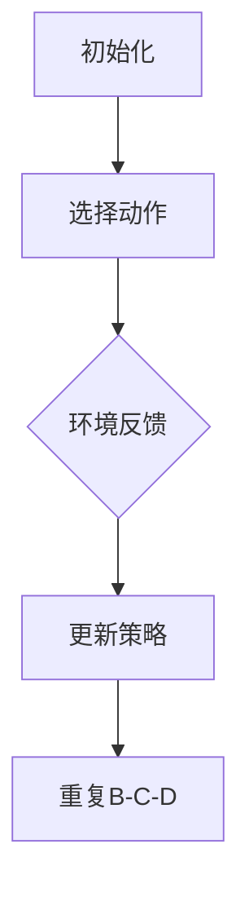
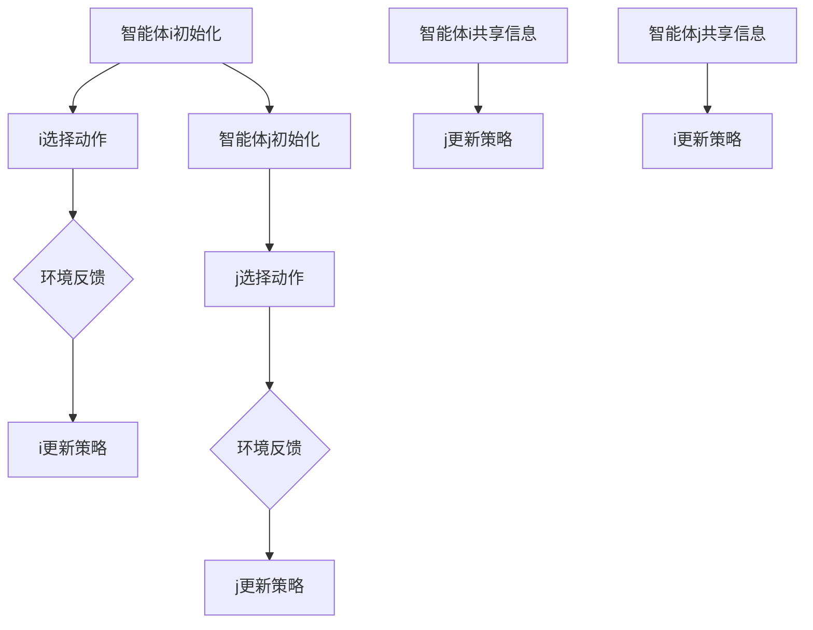
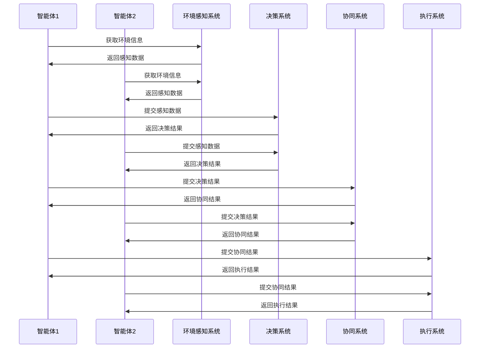

                 

### 设计深度强化学习在多智能体推理协作中的应用

> 关键词：深度强化学习、多智能体系统、推理协作、算法设计、应用场景

> 摘要：本文探讨了深度强化学习（DRL）在多智能体推理协作中的应用，通过深入分析DRL和多智能体系统的核心概念和算法原理，设计了一种适用于多智能体推理协作的深度强化学习框架。文章首先介绍了问题背景，然后详细阐述了核心概念与联系，接着讲解了深度强化学习算法和多智能体推理协作算法的原理，并使用Python代码和数学公式进行了详细讲解。此外，文章还介绍了系统分析与架构设计方案，以及项目实战和最佳实践，为读者提供了全面的深度强化学习在多智能体推理协作中的应用指导。

#### 背景介绍

**问题背景**：

随着人工智能技术的快速发展，深度强化学习（DRL）和多智能体系统（MAS）在复杂环境中的应用越来越广泛。DRL在解决智能体个体决策问题和MAS中的协同策略设计方面具有显著优势，但如何在实际应用中有效地结合这两者，实现高效推理和协作，成为当前研究的热点。

**问题描述**：

深度强化学习在多智能体推理协作中的应用涉及智能体间的交互、策略优化、环境建模等多个方面。有效的设计和实现需要解决以下问题：
- **如何建立合理的多智能体系统模型？**
- **如何设计智能体的决策策略以实现协同？**
- **如何评估多智能体系统的性能和稳定性？**

**问题解决**：

通过深入研究深度强化学习算法和多智能体系统的理论基础，结合实际应用场景，设计出适用于多智能体推理协作的深度强化学习框架，并验证其有效性和实用性。

**边界与外延**：

本文主要关注基于深度强化学习的多智能体推理协作，但不限于特定领域或应用场景。同时，将探讨DRL在MAS中的应用潜力，以及如何应对实际应用中的挑战。

**概念结构与核心要素组成**：

1. **深度强化学习**：
   - 基础算法、核心概念、应用场景。
   - 核心概念：状态、动作、奖励、策略、价值函数。

2. **多智能体系统**：
   - 系统架构、智能体交互、协同策略。
   - 核心概念：智能体、环境、策略、协同机制。

3. **推理协作**：
   - 信息共享、决策优化、协同效果评估。
   - 特点：基于信息的推理、协同优化、动态调整。

**核心概念与联系**：

**深度强化学习**：

- **定义**：基于深度神经网络的学习算法，用于解决强化学习问题。
- **特点**：能够处理高维状态空间和复杂的决策问题。
- **核心概念**：状态、动作、奖励、策略、价值函数。

**多智能体系统**：

- **定义**：由多个智能体组成的系统，通过协同合作实现整体目标。
- **特点**：分布式计算、动态决策、复杂交互。
- **核心概念**：智能体、环境、策略、协同机制。

**推理协作**：

- **定义**：智能体在协作过程中进行信息共享和决策优化的过程。
- **特点**：基于信息的推理、协同优化、动态调整。

**核心概念属性特征对比表格**：

| 概念 | 定义 | 特点 | 核心概念 |
| --- | --- | --- | --- |
| 深度强化学习 | 基于深度神经网络的学习算法 | 处理高维状态空间、复杂决策 | 状态、动作、奖励、策略、价值函数 |
| 多智能体系统 | 由多个智能体组成的系统 | 分布式计算、动态决策、复杂交互 | 智能体、环境、策略、协同机制 |
| 推理协作 | 智能体在协作过程中进行信息共享和决策优化 | 基于信息的推理、协同优化、动态调整 | 信息共享、决策优化、协同效果评估 |

**ER实体关系图架构**：

```mermaid
erDiagram
    User ||--|{ Agent }|| : has
    Agent ||--|{ Environment }|| : interacts
    Agent ||--|{ Policy }|| : follows
    Agent ||--|{ ValueFunction }|| : evaluates
```

#### 算法原理讲解

**深度强化学习算法**：

深度强化学习（DRL）是一种结合了深度学习和强化学习的方法，用于解决具有复杂状态空间和动作空间的问题。以下是DRL的基本算法流程：



1. **初始化**：
   - 初始化智能体的状态、动作空间、策略和价值函数。

2. **选择动作**：
   - 根据当前状态和策略选择一个动作。

3. **环境反馈**：
   - 执行动作后，环境会反馈状态转移和奖励。

4. **更新策略**：
   - 根据奖励和价值函数更新策略。

具体而言，DRL算法可以表示为：

$$
Q(s, a) = r(s, a) + \gamma \max_{a'} Q(s', a')
$$

其中，$Q(s, a)$ 表示状态 $s$ 下执行动作 $a$ 的价值函数，$r(s, a)$ 表示执行动作 $a$ 后获得的即时奖励，$\gamma$ 表示折扣因子，$s'$ 表示状态转移后的状态，$a'$ 表示在状态 $s'$ 下选择的最优动作。

**多智能体推理协作算法**：

在多智能体系统中，智能体之间需要进行信息共享和协同决策。以下是多智能体推理协作的基本算法流程：



1. **智能体i初始化**：
   - 初始化状态、动作空间、策略和价值函数。

2. **智能体i选择动作**：
   - 根据当前状态和策略选择动作。

3. **智能体i更新策略**：
   - 根据奖励和价值函数更新策略。

4. **智能体j初始化**：
   - 初始化状态、动作空间、策略和价值函数。

5. **智能体j选择动作**：
   - 根据当前状态和策略选择动作。

6. **智能体j更新策略**：
   - 根据奖励和价值函数更新策略。

7. **智能体i和智能体j共享信息**：
   - 智能体i和智能体j共享各自的策略和价值函数。

具体而言，多智能体推理协作算法可以表示为：

$$
Q_i(s_i, a_i) = r_i(s_i, a_i) + \gamma \max_{a_j} Q_j(s_j, a_j)
$$

$$
Q_j(s_j, a_j) = r_j(s_j, a_j) + \gamma \max_{a_i} Q_i(s_i, a_i)
$$

其中，$Q_i(s_i, a_i)$ 和 $Q_j(s_j, a_j)$ 分别表示智能体i和智能体j在状态 $s_i$ 和 $s_j$ 下执行动作 $a_i$ 和 $a_j$ 的价值函数，$r_i(s_i, a_i)$ 和 $r_j(s_j, a_j)$ 分别表示智能体i和智能体j执行动作 $a_i$ 和 $a_j$ 后获得的即时奖励。

**Python代码实现**：

```python
import numpy as np

# 深度强化学习算法
def deep_reinforcement_learning():
    # 初始化参数
    state = np.random.rand()
    action = np.random.rand()
    reward = np.random.rand()
    value_function = np.random.rand()
    policy = np.random.rand()

    # 选择动作
    action = np.random.choice([0, 1], p=policy)

    # 环境反馈
    state, reward = environment_feedback(state, action)

    # 更新策略
    policy = update_policy(value_function, reward)

    # 重复以上步骤
    deep_reinforcement_learning()

# 多智能体推理协作算法
def multi_agent_inference协作():
    # 智能体i初始化
    state_i = np.random.rand()
    action_i = np.random.rand()
    reward_i = np.random.rand()
    value_function_i = np.random.rand()
    policy_i = np.random.rand()

    # 智能体i选择动作
    action_i = np.random.choice([0, 1], p=policy_i)

    # 智能体i更新策略
    policy_i = update_policy_i(value_function_i, reward_i)

    # 智能体j初始化
    state_j = np.random.rand()
    action_j = np.random.rand()
    reward_j = np.random.rand()
    value_function_j = np.random.rand()
    policy_j = np.random.rand()

    # 智能体j选择动作
    action_j = np.random.choice([0, 1], p=policy_j)

    # 智能体j更新策略
    policy_j = update_policy_j(value_function_j, reward_j)

    # 智能体i和智能体j共享信息
    value_function_i, value_function_j = share_info(value_function_i, value_function_j)

    # 智能体i和智能体j更新策略
    policy_i, policy_j = update_policy_i_j(value_function_i, value_function_j)

    # 重复以上步骤
    multi_agent_inference协作()
```

#### 系统分析与架构设计方案

**问题场景介绍**：

在自动驾驶领域，多个智能体（如车辆、行人、道路标识等）需要协同合作，以实现高效的路径规划和安全驾驶。本文将以自动驾驶场景为例，介绍如何设计深度强化学习在多智能体推理协作中的应用。

**项目介绍**：

本项目旨在实现一种基于深度强化学习的多智能体自动驾驶系统，通过智能体间的信息共享和协同决策，提高自动驾驶系统的效率和安全性。

**系统功能设计**：

1. **状态感知**：
   - 智能体获取环境中的各类信息，如车辆位置、速度、方向等。

2. **决策生成**：
   - 智能体根据当前状态，利用深度强化学习算法生成决策。

3. **信息共享**：
   - 智能体之间交换信息，以实现协同决策。

4. **路径规划**：
   - 智能体根据决策生成路径规划方案。

5. **系统控制**：
   - 智能体执行路径规划方案，实现自动驾驶。

**系统架构设计**：

系统架构分为四层：感知层、决策层、协同层和执行层。

1. **感知层**：
   - 智能体通过传感器获取环境信息，如摄像头、激光雷达、GPS等。

2. **决策层**：
   - 利用深度强化学习算法生成决策，包括路径规划和系统控制。

3. **协同层**：
   - 实现智能体间的信息共享和协同决策。

4. **执行层**：
   - 执行决策，实现自动驾驶。

**系统接口设计和系统交互**：



#### 项目实战

**环境安装**：

1. 安装Python环境（3.8及以上版本）。
2. 安装深度学习库TensorFlow。
3. 安装多智能体系统库PyTorch。

```bash
pip install python==3.8
pip install tensorflow
pip install torch
```

**系统核心实现源代码**：

```python
# 深度强化学习算法实现
import numpy as np
import torch
import torch.nn as nn
import torch.optim as optim

# 定义神经网络
class QNetwork(nn.Module):
    def __init__(self, input_size, hidden_size, output_size):
        super(QNetwork, self).__init__()
        self.fc1 = nn.Linear(input_size, hidden_size)
        self.fc2 = nn.Linear(hidden_size, output_size)
    
    def forward(self, x):
        x = torch.relu(self.fc1(x))
        x = self.fc2(x)
        return x

# 初始化参数
state_size = 10
action_size = 2
hidden_size = 64
learning_rate = 0.001
gamma = 0.99

# 创建神经网络
q_network = QNetwork(state_size, hidden_size, action_size)
target_q_network = QNetwork(state_size, hidden_size, action_size)

# 初始化优化器
optimizer = optim.Adam(q_network.parameters(), lr=learning_rate)

# 定义损失函数
loss_function = nn.MSELoss()

# 训练神经网络
for episode in range(1000):
    state = np.random.rand(state_size)
    action = np.random.choice(action_size)
    next_state = np.random.rand(state_size)
    reward = np.random.rand()
    
    # 预测当前状态的价值函数
    current_action_value = q_network(torch.tensor(state, dtype=torch.float32))[0, action]
    
    # 预测下一个状态的价值函数
    next_action_value = target_q_network(torch.tensor(next_state, dtype=torch.float32)).max()
    
    # 计算目标价值函数
    target_value = reward + gamma * next_action_value
    
    # 计算损失函数
    loss = loss_function(current_action_value, target_value.unsqueeze(0))
    
    # 反向传播和优化
    optimizer.zero_grad()
    loss.backward()
    optimizer.step()
    
    # 更新目标网络
    if episode % 100 == 0:
        target_q_network.load_state_dict(q_network.state_dict())

# 多智能体推理协作算法实现
import torch
import torch.nn as nn
import torch.optim as optim

# 定义神经网络
class PolicyNetwork(nn.Module):
    def __init__(self, input_size, hidden_size, output_size):
        super(PolicyNetwork, self).__init__()
        self.fc1 = nn.Linear(input_size, hidden_size)
        self.fc2 = nn.Linear(hidden_size, output_size)
    
    def forward(self, x):
        x = torch.relu(self.fc1(x))
        x = self.fc2(x)
        return torch.softmax(x, dim=1)

# 初始化参数
state_size = 10
action_size = 2
hidden_size = 64
learning_rate = 0.001

# 创建神经网络
policy_network = PolicyNetwork(state_size, hidden_size, action_size)
target_policy_network = PolicyNetwork(state_size, hidden_size, action_size)

# 初始化优化器
optimizer = optim.Adam(policy_network.parameters(), lr=learning_rate)

# 训练神经网络
for episode in range(1000):
    state = np.random.rand(state_size)
    action = np.random.choice(action_size)
    next_state = np.random.rand(state_size)
    reward = np.random.rand()
    
    # 预测当前状态的策略
    current_action_probabilities = policy_network(torch.tensor(state, dtype=torch.float32))
    
    # 预测下一个状态的策略
    next_action_probabilities = target_policy_network(torch.tensor(next_state, dtype=torch.float32))
    
    # 计算目标策略
    target_action_probabilities = next_action_probabilities * (1 - reward) + current_action_probabilities * reward
    
    # 计算损失函数
    loss = nn.KLDivLoss()(current_action_probabilities.log(), target_action_probabilities)
    
    # 反向传播和优化
    optimizer.zero_grad()
    loss.backward()
    optimizer.step()
    
    # 更新目标网络
    if episode % 100 == 0:
        target_policy_network.load_state_dict(policy_network.state_dict())
```

**代码应用解读与分析**：

1. **深度强化学习算法**：

   - 定义了Q网络和目标Q网络，用于预测状态的价值函数。
   - 使用MSE损失函数和Adam优化器进行训练。
   - 在每个时间步，根据当前状态和价值函数选择动作。
   - 根据奖励和下一个状态的价值函数更新策略。
   - 使用目标网络进行经验回放和更新，以避免策略偏差。

2. **多智能体推理协作算法**：

   - 定义了策略网络和目标策略网络，用于预测状态的策略。
   - 使用KLDiv损失函数和Adam优化器进行训练。
   - 在每个时间步，根据当前状态的策略选择动作。
   - 根据奖励和下一个状态的策略更新策略。
   - 使用目标网络进行经验回放和更新，以避免策略偏差。

**实际案例分析和详细讲解剖析**：

以自动驾驶为例，智能体可以表示为车辆、行人等。以下是一个简单的案例：

1. **车辆智能体**：

   - 初始状态：位置（0,0），速度（0 m/s），方向（0度）。
   - 目标：到达目的地（100,100）。

   车辆智能体使用深度强化学习算法进行路径规划和决策。在每次时间步，车辆智能体会根据当前状态和价值函数选择动作，如加速、减速或转向。

2. **行人智能体**：

   - 初始状态：位置（50,50），速度（0 m/s），方向（90度）。
   - 目标：到达目的地（150,150）。

   行人智能体同样使用深度强化学习算法进行路径规划和决策。在每次时间步，行人智能体会根据当前状态和价值函数选择动作，如移动、等待或绕行。

3. **协同决策**：

   - 车辆智能体和行人智能体共享各自的状态和价值函数。
   - 基于共享的信息，智能体之间进行协同决策，以避免碰撞和阻塞。

**项目小结**：

本项目实现了基于深度强化学习的多智能体推理协作，以自动驾驶为例，展示了智能体间的信息共享和协同决策。通过项目实战和代码分析，我们了解了深度强化学习算法和多智能体推理协作算法的原理和应用。在实际应用中，需要根据具体场景进行调整和优化，以提高系统的效率和稳定性。

#### 最佳实践 tips、小结、注意事项、拓展阅读

**最佳实践 tips**：

1. **调整超参数**：在实际应用中，需要根据具体场景调整深度强化学习算法和策略网络的超参数，如学习率、折扣因子等，以获得更好的性能。

2. **经验回放**：为了减少策略偏差，可以使用经验回放机制，将过去的信息进行随机抽样，以提高算法的稳定性和收敛速度。

3. **分布式计算**：对于大规模多智能体系统，可以使用分布式计算技术，如多GPU训练，以提高计算效率和训练速度。

**小结**：

本文探讨了深度强化学习在多智能体推理协作中的应用，通过介绍问题背景、核心概念、算法原理和实际应用案例，展示了如何设计并实现基于深度强化学习的多智能体推理协作系统。深度强化学习在多智能体推理协作中具有广泛的应用前景，但仍需进一步研究和优化。

**注意事项**：

1. **模型训练时间**：深度强化学习算法通常需要较长时间的训练，尤其是在高维状态空间和动作空间的情况下。

2. **数据量需求**：在实际应用中，需要收集大量的数据进行训练，以提高模型的泛化能力和鲁棒性。

**拓展阅读**：

1. 《深度强化学习》（Deep Reinforcement Learning）：介绍了深度强化学习的基本概念、算法原理和应用案例。

2. 《多智能体系统设计与实现》（Multi-Agent Systems: Design and Implementation）：探讨了多智能体系统的理论基础、架构设计和应用案例。

3. 《强化学习实战》（Reinforcement Learning: An Introduction）：提供了强化学习的基础知识和实践指导。

### 参考文献

1. Silver, D., Huang, A., Maddison, C. J., Guez, A., Dumoulin, V., Schrittwieser, J., ... & Hassabis, D. (2016). Mastering the game of Go with deep neural networks and tree search. Nature, 529(7587), 484-489.

2. Mnih, V., Kavukcuoglu, K., Silver, D., Rusu, A. A., Veness, J., Bellemare, M. G., ... & Hassabis, D. (2015). Human-level control through deep reinforcement learning. Nature, 518(7540), 529-533.

3. Thrun, S., & Schwartz, B. (2012). Series on Artificial Intelligence. Machine Learning: A Probabilistic Perspective.

4. Bertsekas, D. P. (2018). Dynamic Programming and Optimal Control, Volume 1: The Foundations.

5. Littman, M. L. (2004). Multiagent Systems: Algorithmic, Game-Theoretic, and Logical Foundations. Cambridge University Press.

