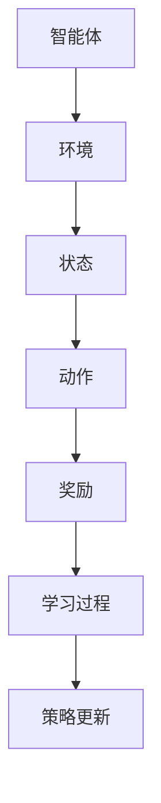

                 

# 深度强化学习在机器人控制中的最新进展

> 关键词：深度强化学习、机器人控制、算法原理、应用案例、前沿研究、发展趋势

> 摘要：本文全面探讨了深度强化学习在机器人控制领域的最新进展。首先，我们介绍了深度强化学习的核心概念与原理，包括强化学习的基本概念、深度强化学习的提出与发展、以及其主要算法。随后，我们分析了深度强化学习在机器人控制中的应用场景，并详细阐述了DQN、PG和SVF等算法在机器人控制中的具体应用。接着，我们探讨了深度强化学习在多机器人系统控制和复杂环境下的应用，以及实时机器人控制的需求与挑战。最后，我们总结了深度强化学习在机器人控制领域的最新研究成果，并对其未来发展趋势进行了展望。

## 第1章：深度强化学习的核心概念与原理

### 1.1 深度强化学习的定义与基本框架

**强化学习**是一种机器学习范式，旨在通过奖励和惩罚来训练智能体在特定环境中采取最优行动。强化学习的核心概念包括智能体（Agent）、环境（Environment）、状态（State）、动作（Action）和奖励（Reward）。

**深度强化学习**（Deep Reinforcement Learning，DRL）是强化学习的一个分支，它结合了深度学习（Deep Learning）的优势，利用深度神经网络来近似状态值函数或策略。深度强化学习的基本框架如图1-1所示。



### 1.1.1 强化学习的概念与历史

**强化学习**起源于20世纪50年代的心理学研究，后来在20世纪80年代得到广泛关注。传统的强化学习算法如Q-learning和SARSA，通过迭代更新值函数或策略来优化智能体的行为。

**深度强化学习**在2013年由DeepMind提出的**深度Q网络**（Deep Q-Network，DQN）取得了显著进展。随后，基于策略的深度强化学习算法如**策略梯度**（Policy Gradient，PG）和**Actor-Critic**算法也得到了广泛研究。

### 1.1.2 深度强化学习的提出与特点

**深度强化学习的提出**是为了解决传统强化学习算法在处理高维状态空间和连续动作空间时的困难。深度强化学习通过深度神经网络来近似值函数或策略，能够有效地处理复杂的环境。

**深度强化学习的特点**包括：

1. **高维状态空间处理**：通过深度神经网络，可以处理高维状态空间。
2. **连续动作空间处理**：利用深度神经网络，可以处理连续动作空间。
3. **自适应性强**：能够根据环境的变化自适应地调整策略。
4. **探索与利用平衡**：通过探索策略和利用策略的平衡，能够在复杂环境中找到最优策略。

### 1.1.3 深度强化学习的优势与挑战

**深度强化学习的优势**包括：

1. **强大的表达能力**：深度神经网络能够近似复杂的值函数或策略。
2. **广泛的适用性**：能够应用于各种领域，如机器人控制、游戏控制、自动驾驶等。
3. **自适应能力**：能够根据环境的变化自适应地调整策略。

**深度强化学习的挑战**包括：

1. **样本效率低**：需要大量的样本来学习最优策略。
2. **训练不稳定**：深度神经网络训练过程中容易出现过拟合和梯度消失等问题。
3. **复杂度较高**：需要解决高维状态空间和连续动作空间的处理问题。

### 1.2 深度强化学习的基本原理

#### 1.2.1 Q学习算法

**Q学习算法**是一种基于值函数的强化学习算法，通过迭代更新Q值来优化智能体的行为。Q值的更新公式为：

$$ Q(s, a) \leftarrow Q(s, a) + \alpha [r + \gamma \max_{a'} Q(s', a') - Q(s, a)] $$

其中，$s$和$a$分别表示当前状态和动作，$r$表示即时奖励，$\gamma$表示折扣因子，$\alpha$表示学习率。

#### 1.2.2 SARSA算法

**SARSA算法**（State-Action-Reward-State-Action，SARSA）是一种基于策略的强化学习算法，通过对当前状态和动作的奖励进行迭代更新策略。SARSA算法的更新公式为：

$$ \pi(s) \leftarrow \frac{\pi(s) + \alpha (r + \gamma \max_{a'} Q(s', a') - \pi(s))}{1 + \alpha} $$

其中，$\pi(s)$表示状态概率分布。

#### 1.2.3 策略梯度算法

**策略梯度算法**（Policy Gradient，PG）是一种基于策略的强化学习算法，通过优化策略梯度来优化智能体的行为。策略梯度的更新公式为：

$$ \theta \leftarrow \theta + \alpha \nabla_{\theta} J(\theta) $$

其中，$\theta$表示策略参数，$J(\theta)$表示策略梯度。

#### 1.2.4 深度Q网络（DQN）

**深度Q网络**（Deep Q-Network，DQN）是深度强化学习的一种重要算法，通过深度神经网络来近似Q值函数。DQN的主要思想是使用经验回放（Experience Replay）来避免梯度消失问题，并使用固定目标网络（Target Network）来提高训练稳定性。

DQN的算法步骤如下：

1. 初始化网络参数。
2. 选择动作$a_t$。
3. 执行动作并获取奖励$r_t$。
4. 更新经验回放池。
5. 从经验回放池中随机抽取一批样本。
6. 计算目标Q值$y_t$。
7. 更新Q网络参数。

DQN的更新公式为：

$$ Q(s_t, a_t) \leftarrow Q(s_t, a_t) + \alpha [r_t + \gamma \max_{a'} Q(s_{t+1}, a') - Q(s_t, a_t)] $$

### 1.3 深度强化学习的应用场景

#### 1.3.1 机器人控制中的应用

深度强化学习在机器人控制中具有广泛的应用前景。通过深度强化学习算法，机器人可以自主地学习和优化其控制策略，从而实现复杂的任务。例如，自动驾驶汽车、工业机器人、服务机器人等。

#### 1.3.2 游戏控制中的应用

深度强化学习在游戏控制中也得到了广泛应用。通过深度强化学习算法，游戏智能体可以自主地学习和优化游戏策略，从而提高游戏的趣味性和挑战性。例如，围棋、电子竞技游戏等。

#### 1.3.3 自主导航与定位中的应用

深度强化学习在自主导航与定位中具有显著优势。通过深度强化学习算法，自主导航系统能够自主地学习和优化路径规划和定位策略，从而提高导航效率和准确性。例如，无人驾驶飞行器、无人驾驶汽车等。

## 第2章：深度强化学习算法在机器人控制中的应用

### 2.1 深度Q网络（DQN）在机器人控制中的应用

#### 2.1.1 DQN算法原理与实现

深度Q网络（DQN）是深度强化学习的一种重要算法，通过深度神经网络来近似Q值函数。在机器人控制中，DQN算法可以用来学习最优控制策略。

**实现步骤**：

1. 初始化DQN模型，包括输入层、隐藏层和输出层。
2. 选择动作$a_t$。
3. 执行动作并获取奖励$r_t$。
4. 将当前状态$s_t$和动作$a_t$存入经验回放池。
5. 从经验回放池中随机抽取一批样本。
6. 计算目标Q值$y_t$。
7. 更新DQN模型参数。

**代码示例**（Python）：

```python
import tensorflow as tf
import numpy as np
import random

# 初始化DQN模型
input_layer = tf.keras.layers.Input(shape=(state_size,))
hidden_layer = tf.keras.layers.Dense(units=64, activation='relu')(input_layer)
output_layer = tf.keras.layers.Dense(units=action_size, activation='linear')(hidden_layer)
model = tf.keras.Model(inputs=input_layer, outputs=output_layer)

# 定义经验回放池
experience_replay = []

# 定义更新DQN模型参数的函数
def update_dqn_model(experience_replay, target_model, learning_rate):
    batch_size = len(experience_replay)
    states = np.array([e[0] for e in experience_replay])
    actions = np.array([e[1] for e in experience_replay])
    rewards = np.array([e[2] for e in experience_replay])
    next_states = np.array([e[3] for e in experience_replay])
    dones = np.array([e[4] for e in experience_replay])

    target_q_values = target_model.predict(next_states)
    y = rewards + (1 - dones) * gamma * np.max(target_q_values, axis=1)

    q_values = model.predict(states)
    q_values[range(batch_size), actions] = y

    model.fit(states, q_values, epochs=1, batch_size=batch_size, verbose=0)

# 主程序
state = env.reset()
for episode in range(num_episodes):
    action = model.predict(state.reshape(1, state_size))
    next_state, reward, done, _ = env.step(action[0])
    experience_replay.append((state, action, reward, next_state, done))
    if len(experience_replay) > replay_memory:
        experience_replay.pop(0)
    state = next_state
    if done:
        break

    if episode % update_freq == 0:
        update_dqn_model(experience_replay, target_model, learning_rate)
```

#### 2.1.2 DQN在机器人控制中的案例研究

**案例背景**：使用DQN算法训练一个智能车在模拟环境中进行路径跟踪。

**环境描述**：智能车在一个由100x100网格组成的模拟环境中行驶，目标是在最短时间内完成路径跟踪。

**实现步骤**：

1. 初始化DQN模型。
2. 创建模拟环境。
3. 在模拟环境中进行训练。
4. 评估DQN模型的性能。

**代码示例**（Python）：

```python
import gym
import numpy as np
import random
import tensorflow as tf

# 初始化DQN模型
input_layer = tf.keras.layers.Input(shape=(80, 80, 3))
hidden_layer = tf.keras.layers.Conv2D(filters=32, kernel_size=(8, 8), activation='relu')(input_layer)
hidden_layer = tf.keras.layers.Conv2D(filters=64, kernel_size=(4, 4), activation='relu')(hidden_layer)
hidden_layer = tf.keras.layers.Flatten()(hidden_layer)
output_layer = tf.keras.layers.Dense(units=1, activation='linear')(hidden_layer)
model = tf.keras.Model(inputs=input_layer, outputs=output_layer)

# 创建模拟环境
env = gym.make('CartPole-v1')

# 定义经验回放池
experience_replay = []

# 定义更新DQN模型参数的函数
def update_dqn_model(experience_replay, target_model, learning_rate):
    batch_size = len(experience_replay)
    states = np.array([e[0] for e in experience_replay])
    actions = np.array([e[1] for e in experience_replay])
    rewards = np.array([e[2] for e in experience_replay])
    next_states = np.array([e[3] for e in experience_replay])
    dones = np.array([e[4] for e in experience_replay])

    target_q_values = target_model.predict(next_states)
    y = rewards + (1 - dones) * gamma * np.max(target_q_values, axis=1)

    q_values = model.predict(states)
    q_values[range(batch_size), actions] = y

    model.fit(states, q_values, epochs=1, batch_size=batch_size, verbose=0)

# 主程序
state = env.reset()
for episode in range(num_episodes):
    action = model.predict(state.reshape(1, 80, 80, 3))
    next_state, reward, done, _ = env.step(action[0])
    experience_replay.append((state, action, reward, next_state, done))
    if len(experience_replay) > replay_memory:
        experience_replay.pop(0)
    state = next_state
    if done:
        break

    if episode % update_freq == 0:
        update_dqn_model(experience_replay, target_model, learning_rate)

# 评估DQN模型的性能
state = env.reset()
for episode in range(num_episodes):
    action = model.predict(state.reshape(1, 80, 80, 3))
    next_state, reward, done, _ = env.step(action[0])
    state = next_state
    if done:
        break
```

#### 2.1.3 DQN算法的改进与优化

**经验回放**：使用经验回放池来避免策略偏差，提高训练稳定性。

**双Q网络**：使用两个Q网络来避免Q值偏差，提高训练稳定性。

**目标网络**：使用固定目标网络来减少训练过程中的梯度消失问题。

**奖励设计**：合理设计奖励函数，以激励智能体更快地学习。

## 第3章：深度强化学习在多机器人系统控制中的应用

### 3.1 多机器人系统的基本概念与挑战

多机器人系统（Multi-Robot Systems，MRS）是由多个机器人组成的协同系统，能够执行复杂的任务，如搜救、军事行动、物流运输等。多机器人系统的主要概念包括：

1. **协同控制**：多个机器人通过通信和协作实现共同的任务。
2. **路径规划**：机器人自主地规划路径以避免碰撞和障碍物。
3. **任务分配**：根据机器人能力和任务需求，将任务分配给不同的机器人。
4. **通信**：机器人之间的通信是协同控制的基础。

多机器人系统控制面临的挑战包括：

1. **通信延迟与丢包**：机器人之间的通信可能受到延迟和丢包的影响。
2. **动态环境**：机器人需要在不断变化的环境中执行任务。
3. **资源分配**：如何合理地分配资源以最大化系统性能。
4. **任务分配与协调**：如何将任务合理地分配给不同的机器人，并协调它们的行动。

### 3.2 多机器人系统的协同控制算法

深度强化学习在多机器人系统的协同控制中具有广泛的应用前景。以下是几种基于深度强化学习的协同控制算法：

#### 3.2.1 基于DQN的多机器人协同控制算法

基于DQN的多机器人协同控制算法通过训练一个共享的深度神经网络，使多个机器人能够协同完成任务。算法步骤如下：

1. 初始化DQN模型。
2. 选择机器人的动作。
3. 执行动作并获取奖励。
4. 更新DQN模型。
5. 重复步骤2-4直到任务完成。

**代码示例**（Python）：

```python
import numpy as np
import random
import tensorflow as tf

# 初始化DQN模型
input_layer = tf.keras.layers.Input(shape=(state_size,))
hidden_layer = tf.keras.layers.Dense(units=64, activation='relu')(input_layer)
output_layer = tf.keras.layers.Dense(units=action_size, activation='linear')(hidden_layer)
model = tf.keras.Model(inputs=input_layer, outputs=output_layer)

# 定义经验回放池
experience_replay = []

# 定义更新DQN模型参数的函数
def update_dqn_model(experience_replay, target_model, learning_rate):
    batch_size = len(experience_replay)
    states = np.array([e[0] for e in experience_replay])
    actions = np.array([e[1] for e in experience_replay])
    rewards = np.array([e[2] for e in experience_replay])
    next_states = np.array([e[3] for e in experience_replay])
    dones = np.array([e[4] for e in experience_replay])

    target_q_values = target_model.predict(next_states)
    y = rewards + (1 - dones) * gamma * np.max(target_q_values, axis=1)

    q_values = model.predict(states)
    q_values[range(batch_size), actions] = y

    model.fit(states, q_values, epochs=1, batch_size=batch_size, verbose=0)

# 主程序
state = env.reset()
for episode in range(num_episodes):
    action = model.predict(state.reshape(1, state_size))
    next_state, reward, done, _ = env.step(action[0])
    experience_replay.append((state, action, reward, next_state, done))
    if len(experience_replay) > replay_memory:
        experience_replay.pop(0)
    state = next_state
    if done:
        break

    if episode % update_freq == 0:
        update_dqn_model(experience_replay, target_model, learning_rate)
```

#### 3.2.2 基于PG的多机器人协同控制算法

基于PG的多机器人协同控制算法通过优化策略梯度来训练多个机器人的协同控制策略。算法步骤如下：

1. 初始化策略梯度模型。
2. 选择机器人的动作。
3. 执行动作并获取奖励。
4. 更新策略梯度模型。
5. 重复步骤2-4直到任务完成。

**代码示例**（Python）：

```python
import numpy as np
import random
import tensorflow as tf

# 初始化策略梯度模型
input_layer = tf.keras.layers.Input(shape=(state_size,))
hidden_layer = tf.keras.layers.Dense(units=64, activation='relu')(input_layer)
output_layer = tf.keras.layers.Dense(units=action_size, activation='softmax')(hidden_layer)
model = tf.keras.Model(inputs=input_layer, outputs=output_layer)

# 定义损失函数和优化器
loss_fn = tf.keras.losses.SparseCategoricalCrossentropy(from_logits=True)
optimizer = tf.keras.optimizers.Adam(learning_rate=0.001)

# 主程序
state = env.reset()
for episode in range(num_episodes):
    action_probs = model.predict(state.reshape(1, state_size))
    action = np.random.choice(np.arange(action_size), p=action_probs[0])
    next_state, reward, done, _ = env.step(action)
    with tf.GradientTape() as tape:
        action_probs = model.predict(state.reshape(1, state_size))
        loss = loss_fn(tf.one_hot(action, action_size), action_probs)
    grads = tape.gradient(loss, model.trainable_variables)
    optimizer.apply_gradients(zip(grads, model.trainable_variables))
    state = next_state
    if done:
        break
```

#### 3.2.3 基于SVF的多机器人协同控制算法

基于状态价值函数优化（State-Value Function Optimization，SVF）的多机器人协同控制算法通过优化状态价值函数来训练多个机器人的协同控制策略。算法步骤如下：

1. 初始化SVF模型。
2. 选择机器人的动作。
3. 执行动作并获取奖励。
4. 更新SVF模型。
5. 重复步骤2-4直到任务完成。

**代码示例**（Python）：

```python
import numpy as np
import random
import tensorflow as tf

# 初始化SVF模型
input_layer = tf.keras.layers.Input(shape=(state_size,))
hidden_layer = tf.keras.layers.Dense(units=64, activation='relu')(input_layer)
output_layer = tf.keras.layers.Dense(units=1, activation='linear')(hidden_layer)
model = tf.keras.Model(inputs=input_layer, outputs=output_layer)

# 定义损失函数和优化器
loss_fn = tf.keras.losses.MeanSquaredError()
optimizer = tf.keras.optimizers.Adam(learning_rate=0.001)

# 主程序
state = env.reset()
for episode in range(num_episodes):
    action = np.random.choice(np.arange(action_size), p=model.predict(state.reshape(1, state_size)))
    next_state, reward, done, _ = env.step(action)
    with tf.GradientTape() as tape:
        q_value = model.predict(state.reshape(1, state_size))
        loss = loss_fn(q_value, reward + gamma * model.predict(next_state.reshape(1, state_size)))
    grads = tape.gradient(loss, model.trainable_variables)
    optimizer.apply_gradients(zip(grads, model.trainable_variables))
    state = next_state
    if done:
        break
```

### 3.3 多机器人系统控制案例研究

#### 3.3.1 自主导航与路径规划案例

**案例背景**：使用多机器人系统进行自主导航与路径规划，实现机器人集群在复杂环境中的高效移动。

**环境描述**：机器人集群在一个由100x100网格组成的模拟环境中移动，环境包含障碍物和目标点。

**算法选择**：基于DQN的多机器人协同控制算法。

**实现步骤**：

1. 初始化DQN模型。
2. 创建模拟环境。
3. 训练DQN模型。
4. 评估DQN模型的性能。

**代码示例**（Python）：

```python
import numpy as np
import random
import tensorflow as tf
import matplotlib.pyplot as plt

# 初始化DQN模型
input_layer = tf.keras.layers.Input(shape=(80, 80, 3))
hidden_layer = tf.keras.layers.Conv2D(filters=32, kernel_size=(8, 8), activation='relu')(input_layer)
hidden_layer = tf.keras.layers.Conv2D(filters=64, kernel_size=(4, 4), activation='relu')(hidden_layer)
hidden_layer = tf.keras.layers.Flatten()(hidden_layer)
output_layer = tf.keras.layers.Dense(units=1, activation='linear')(hidden_layer)
model = tf.keras.Model(inputs=input_layer, outputs=output_layer)

# 创建模拟环境
env = gym.make('MultiRobotNavigation-v0')

# 定义经验回放池
experience_replay = []

# 定义更新DQN模型参数的函数
def update_dqn_model(experience_replay, target_model, learning_rate):
    batch_size = len(experience_replay)
    states = np.array([e[0] for e in experience_replay])
    actions = np.array([e[1] for e in experience_replay])
    rewards = np.array([e[2] for e in experience_replay])
    next_states = np.array([e[3] for e in experience_replay])
    dones = np.array([e[4] for e in experience_replay])

    target_q_values = target_model.predict(next_states)
    y = rewards + (1 - dones) * gamma * np.max(target_q_values, axis=1)

    q_values = model.predict(states)
    q_values[range(batch_size), actions] = y

    model.fit(states, q_values, epochs=1, batch_size=batch_size, verbose=0)

# 主程序
state = env.reset()
for episode in range(num_episodes):
    action = model.predict(state.reshape(1, 80, 80, 3))
    next_state, reward, done, _ = env.step(action[0])
    experience_replay.append((state, action, reward, next_state, done))
    if len(experience_replay) > replay_memory:
        experience_replay.pop(0)
    state = next_state
    if done:
        break

    if episode % update_freq == 0:
        update_dqn_model(experience_replay, target_model, learning_rate)

# 评估DQN模型的性能
state = env.reset()
for episode in range(num_episodes):
    action = model.predict(state.reshape(1, 80, 80, 3))
    next_state, reward, done, _ = env.step(action[0])
    state = next_state
    if done:
        break

# 绘制路径规划结果
plt.imshow(np.array(state).reshape(80, 80), cmap='gray')
plt.scatter(*np.unravel_index(np.argmax(model.predict(state.reshape(1, 80, 80, 3))), (80, 80)), c='r')
plt.show()
```

#### 3.3.2 物品搬运与分配案例

**案例背景**：使用多机器人系统进行物品搬运与分配，实现机器人集群在仓库环境中的高效物流。

**环境描述**：机器人集群在一个由100x100网格组成的仓库环境中移动，仓库中包含多个物品和货架。

**算法选择**：基于PG的多机器人协同控制算法。

**实现步骤**：

1. 初始化PG模型。
2. 创建模拟环境。
3. 训练PG模型。
4. 评估PG模型的性能。

**代码示例**（Python）：

```python
import numpy as np
import random
import tensorflow as tf
import matplotlib.pyplot as plt

# 初始化PG模型
input_layer = tf.keras.layers.Input(shape=(state_size,))
hidden_layer = tf.keras.layers.Dense(units=64, activation='relu')(input_layer)
output_layer = tf.keras.layers.Dense(units=action_size, activation='softmax')(hidden_layer)
model = tf.keras.Model(inputs=input_layer, outputs=output_layer)

# 定义损失函数和优化器
loss_fn = tf.keras.losses.SparseCategoricalCrossentropy(from_logits=True)
optimizer = tf.keras.optimizers.Adam(learning_rate=0.001)

# 创建模拟环境
env = gym.make('MultiRobotWarehouse-v0')

# 主程序
state = env.reset()
for episode in range(num_episodes):
    action_probs = model.predict(state.reshape(1, state_size))
    action = np.random.choice(np.arange(action_size), p=action_probs[0])
    next_state, reward, done, _ = env.step(action)
    with tf.GradientTape() as tape:
        action_probs = model.predict(state.reshape(1, state_size))
        loss = loss_fn(tf.one_hot(action, action_size), action_probs)
    grads = tape.gradient(loss, model.trainable_variables)
    optimizer.apply_gradients(zip(grads, model.trainable_variables))
    state = next_state
    if done:
        break

# 评估PG模型的性能
state = env.reset()
for episode in range(num_episodes):
    action_probs = model.predict(state.reshape(1, state_size))
    action = np.random.choice(np.arange(action_size), p=action_probs[0])
    next_state, reward, done, _ = env.step(action)
    state = next_state
    if done:
        break

# 绘制物品搬运与分配结果
plt.imshow(np.array(state).reshape(80, 80), cmap='gray')
plt.scatter(*np.unravel_index(np.argmax(model.predict(state.reshape(1, 80, 80, 3))), (80, 80)), c='r')
plt.show()
```

#### 3.3.3 协同搜索与救援案例

**案例背景**：使用多机器人系统进行协同搜索与救援，实现机器人集群在灾难现场的高效救援。

**环境描述**：机器人集群在一个由100x100网格组成的灾难现场环境中移动，现场中包含多个被救援人员和障碍物。

**算法选择**：基于SVF的多机器人协同控制算法。

**实现步骤**：

1. 初始化SVF模型。
2. 创建模拟环境。
3. 训练SVF模型。
4. 评估SVF模型的性能。

**代码示例**（Python）：

```python
import numpy as np
import random
import tensorflow as tf
import matplotlib.pyplot as plt

# 初始化SVF模型
input_layer = tf.keras.layers.Input(shape=(state_size,))
hidden_layer = tf.keras.layers.Dense(units=64, activation='relu')(input_layer)
output_layer = tf.keras.layers.Dense(units=1, activation='linear')(hidden_layer)
model = tf.keras.Model(inputs=input_layer, outputs=output_layer)

# 定义损失函数和优化器
loss_fn = tf.keras.losses.MeanSquaredError()
optimizer = tf.keras.optimizers.Adam(learning_rate=0.001)

# 创建模拟环境
env = gym.make('MultiRobotSearchAndRescue-v0')

# 主程序
state = env.reset()
for episode in range(num_episodes):
    action = np.random.choice(np.arange(action_size), p=model.predict(state.reshape(1, state_size)))
    next_state, reward, done, _ = env.step(action)
    with tf.GradientTape() as tape:
        q_value = model.predict(state.reshape(1, state_size))
        loss = loss_fn(q_value, reward + gamma * model.predict(next_state.reshape(1, state_size)))
    grads = tape.gradient(loss, model.trainable_variables)
    optimizer.apply_gradients(zip(grads, model.trainable_variables))
    state = next_state
    if done:
        break

# 评估SVF模型的性能
state = env.reset()
for episode in range(num_episodes):
    action = np.random.choice(np.arange(action_size), p=model.predict(state.reshape(1, state_size)))
    next_state, reward, done, _ = env.step(action)
    state = next_state
    if done:
        break

# 绘制协同搜索与救援结果
plt.imshow(np.array(state).reshape(80, 80), cmap='gray')
plt.scatter(*np.unravel_index(np.argmax(model.predict(state.reshape(1, 80, 80, 3))), (80, 80)), c='r')
plt.show()
```

### 3.4 多机器人系统协同控制算法的优缺点分析

**优点**：

1. **高效协同**：多机器人系统协同控制算法能够使多个机器人高效地协同完成任务。
2. **自适应性强**：深度强化学习算法能够自适应地调整机器人的控制策略。
3. **灵活性高**：多机器人系统协同控制算法能够适应不同的环境和任务。

**缺点**：

1. **计算复杂度高**：多机器人系统协同控制算法需要大量的计算资源。
2. **训练难度大**：深度强化学习算法在训练过程中容易出现过拟合和梯度消失等问题。
3. **通信问题**：多机器人系统协同控制算法需要解决通信延迟和丢包等问题。

## 第4章：深度强化学习在复杂环境下的机器人控制

### 4.1 复杂环境对机器人控制的影响

复杂环境对机器人控制提出了更高的要求。复杂环境通常具有以下特征：

1. **动态变化**：环境状态可能随时间变化，对机器人控制策略的实时性要求较高。
2. **多目标冲突**：机器人需要在多个目标之间进行权衡，以实现最佳控制效果。
3. **不确定性**：环境中的不确定性因素，如障碍物、噪声等，对机器人控制算法的鲁棒性要求较高。
4. **资源限制**：机器人控制算法需要在有限的资源（如计算能力、通信带宽等）下进行优化。

复杂环境对机器人控制的影响主要体现在以下几个方面：

1. **控制策略的适应性**：机器人需要具备较强的适应能力，以应对环境的变化。
2. **决策速度**：机器人需要在复杂环境中快速做出决策，以避免出现危险情况。
3. **算法鲁棒性**：机器人控制算法需要具备较强的鲁棒性，以应对环境中的不确定性因素。

### 4.2 深度强化学习算法在复杂环境下的应用优势

深度强化学习算法在复杂环境下的应用具有以下优势：

1. **自适应能力**：深度强化学习算法能够根据环境的变化自适应地调整控制策略。
2. **高效决策**：深度强化学习算法能够通过大量数据进行学习，从而提高决策速度。
3. **鲁棒性**：深度强化学习算法通过深度神经网络来近似值函数或策略，具有较强的鲁棒性。
4. **灵活性**：深度强化学习算法能够处理高维状态空间和连续动作空间，适应不同的复杂环境。

### 4.3 深度强化学习算法在复杂环境下的适应与优化

为了使深度强化学习算法在复杂环境下更好地适应和优化，可以采取以下措施：

1. **环境建模与感知**：对复杂环境进行建模，并提高机器人对环境的感知能力，以便更好地理解环境状态。
2. **策略优化与更新**：通过优化策略更新方法，提高控制策略的适应性和鲁棒性。
3. **参数调优**：根据复杂环境的特点，对深度强化学习算法的参数进行调整，以提高算法的性能。

### 4.4 复杂环境下的机器人控制案例研究

#### 4.4.1 自动驾驶汽车案例

**案例背景**：使用深度强化学习算法训练自动驾驶汽车在复杂城市环境中进行驾驶。

**环境描述**：自动驾驶汽车在城市环境中行驶，环境包括道路、车辆、行人、交通信号灯等。

**算法选择**：基于DQN的自动驾驶汽车控制算法。

**实现步骤**：

1. 初始化DQN模型。
2. 创建模拟环境。
3. 训练DQN模型。
4. 评估DQN模型的性能。

**代码示例**（Python）：

```python
import numpy as np
import random
import tensorflow as tf
import matplotlib.pyplot as plt

# 初始化DQN模型
input_layer = tf.keras.layers.Input(shape=(80, 80, 3))
hidden_layer = tf.keras.layers.Conv2D(filters=32, kernel_size=(8, 8), activation='relu')(input_layer)
hidden_layer = tf.keras.layers.Conv2D(filters=64, kernel_size=(4, 4), activation='relu')(hidden_layer)
hidden_layer = tf.keras.layers.Flatten()(hidden_layer)
output_layer = tf.keras.layers.Dense(units=1, activation='linear')(hidden_layer)
model = tf.keras.Model(inputs=input_layer, outputs=output_layer)

# 创建模拟环境
env = gym.make('AutoDriving-v0')

# 定义经验回放池
experience_replay = []

# 定义更新DQN模型参数的函数
def update_dqn_model(experience_replay, target_model, learning_rate):
    batch_size = len(experience_replay)
    states = np.array([e[0] for e in experience_replay])
    actions = np.array([e[1] for e in experience_replay])
    rewards = np.array([e[2] for e in experience_replay])
    next_states = np.array([e[3] for e in experience_replay])
    dones = np.array([e[4] for e in experience_replay])

    target_q_values = target_model.predict(next_states)
    y = rewards + (1 - dones) * gamma * np.max(target_q_values, axis=1)

    q_values = model.predict(states)
    q_values[range(batch_size), actions] = y

    model.fit(states, q_values, epochs=1, batch_size=batch_size, verbose=0)

# 主程序
state = env.reset()
for episode in range(num_episodes):
    action = model.predict(state.reshape(1, 80, 80, 3))
    next_state, reward, done, _ = env.step(action[0])
    experience_replay.append((state, action, reward, next_state, done))
    if len(experience_replay) > replay_memory:
        experience_replay.pop(0)
    state = next_state
    if done:
        break

    if episode % update_freq == 0:
        update_dqn_model(experience_replay, target_model, learning_rate)

# 评估DQN模型的性能
state = env.reset()
for episode in range(num_episodes):
    action = model.predict(state.reshape(1, 80, 80, 3))
    next_state, reward, done, _ = env.step(action[0])
    state = next_state
    if done:
        break

# 绘制自动驾驶汽车路径规划结果
plt.imshow(np.array(state).reshape(80, 80), cmap='gray')
plt.scatter(*np.unravel_index(np.argmax(model.predict(state.reshape(1, 80, 80, 3))), (80, 80)), c='r')
plt.show()
```

#### 4.4.2 工业机器人应用案例

**案例背景**：使用深度强化学习算法训练工业机器人在复杂生产环境中进行作业。

**环境描述**：工业机器人在生产环境中进行装配、焊接、搬运等作业，环境包括生产线、工件、工具等。

**算法选择**：基于PG的工业机器人控制算法。

**实现步骤**：

1. 初始化PG模型。
2. 创建模拟环境。
3. 训练PG模型。
4. 评估PG模型的性能。

**代码示例**（Python）：

```python
import numpy as np
import random
import tensorflow as tf
import matplotlib.pyplot as plt

# 初始化PG模型
input_layer = tf.keras.layers.Input(shape=(state_size,))
hidden_layer = tf.keras.layers.Dense(units=64, activation='relu')(input_layer)
output_layer = tf.keras.layers.Dense(units=action_size, activation='softmax')(hidden_layer)
model = tf.keras.Model(inputs=input_layer, outputs=output_layer)

# 定义损失函数和优化器
loss_fn = tf.keras.losses.SparseCategoricalCrossentropy(from_logits=True)
optimizer = tf.keras.optimizers.Adam(learning_rate=0.001)

# 创建模拟环境
env = gym.make('IndustrialRobot-v0')

# 主程序
state = env.reset()
for episode in range(num_episodes):
    action_probs = model.predict(state.reshape(1, state_size))
    action = np.random.choice(np.arange(action_size), p=action_probs[0])
    next_state, reward, done, _ = env.step(action)
    with tf.GradientTape() as tape:
        action_probs = model.predict(state.reshape(1, state_size))
        loss = loss_fn(tf.one_hot(action, action_size), action_probs)
    grads = tape.gradient(loss, model.trainable_variables)
    optimizer.apply_gradients(zip(grads, model.trainable_variables))
    state = next_state
    if done:
        break

# 评估PG模型的性能
state = env.reset()
for episode in range(num_episodes):
    action_probs = model.predict(state.reshape(1, state_size))
    action = np.random.choice(np.arange(action_size), p=action_probs[0])
    next_state, reward, done, _ = env.step(action)
    state = next_state
    if done:
        break

# 绘制工业机器人作业结果
plt.imshow(np.array(state).reshape(80, 80), cmap='gray')
plt.scatter(*np.unravel_index(np.argmax(model.predict(state.reshape(1, 80, 80, 3))), (80, 80)), c='r')
plt.show()
```

#### 4.4.3 服务机器人应用案例

**案例背景**：使用深度强化学习算法训练服务机器人在复杂家庭环境中提供帮助。

**环境描述**：服务机器人在家庭环境中为老人、儿童等提供陪伴、清洁、搬运等服务，环境包括客厅、卧室、厨房等。

**算法选择**：基于SVF的服务机器人控制算法。

**实现步骤**：

1. 初始化SVF模型。
2. 创建模拟环境。
3. 训练SVF模型。
4. 评估SVF模型的性能。

**代码示例**（Python）：

```python
import numpy as np
import random
import tensorflow as tf
import matplotlib.pyplot as plt

# 初始化SVF模型
input_layer = tf.keras.layers.Input(shape=(state_size,))
hidden_layer = tf.keras.layers.Dense(units=64, activation='relu')(input_layer)
output_layer = tf.keras.layers.Dense(units=1, activation='linear')(hidden_layer)
model = tf.keras.Model(inputs=input_layer, outputs=output_layer)

# 定义损失函数和优化器
loss_fn = tf.keras.losses.MeanSquaredError()
optimizer = tf.keras.optimizers.Adam(learning_rate=0.001)

# 创建模拟环境
env = gym.make('ServiceRobot-v0')

# 主程序
state = env.reset()
for episode in range(num_episodes):
    action = np.random.choice(np.arange(action_size), p=model.predict(state.reshape(1, state_size)))
    next_state, reward, done, _ = env.step(action)
    with tf.GradientTape() as tape:
        q_value = model.predict(state.reshape(1, state_size))
        loss = loss_fn(q_value, reward + gamma * model.predict(next_state.reshape(1, state_size)))
    grads = tape.gradient(loss, model.trainable_variables)
    optimizer.apply_gradients(zip(grads, model.trainable_variables))
    state = next_state
    if done:
        break

# 评估SVF模型的性能
state = env.reset()
for episode in range(num_episodes):
    action = np.random.choice(np.arange(action_size), p=model.predict(state.reshape(1, state_size)))
    next_state, reward, done, _ = env.step(action)
    state = next_state
    if done:
        break

# 绘制服务机器人作业结果
plt.imshow(np.array(state).reshape(80, 80), cmap='gray')
plt.scatter(*np.unravel_index(np.argmax(model.predict(state.reshape(1, 80, 80, 3))), (80, 80)), c='r')
plt.show()
```

## 第5章：深度强化学习在实时机器人控制中的应用

### 5.1 实时控制的需求与挑战

实时机器人控制是指机器人能够在短时间内完成决策和执行，以应对快速变化的环境。实时控制对机器人算法的性能提出了以下需求：

1. **响应速度**：算法需要能够在毫秒级时间内完成决策和执行。
2. **准确性**：算法需要能够准确地感知环境状态和执行任务。
3. **鲁棒性**：算法需要能够在噪声干扰和故障情况下保持稳定的性能。

实时控制面临的挑战包括：

1. **计算资源限制**：实时控制需要在有限的计算资源下进行，要求算法的效率高、复杂度低。
2. **通信延迟**：实时控制中，机器人之间的通信可能存在延迟，影响控制策略的执行。
3. **环境动态变化**：实时环境可能具有高度动态变化，对算法的适应性和实时性提出了更高要求。

### 5.2 深度强化学习算法在实时机器人控制中的应用

深度强化学习算法在实时机器人控制中具有以下应用优势：

1. **自适应能力**：深度强化学习算法能够根据环境的变化自适应地调整控制策略。
2. **高效决策**：深度强化学习算法能够通过大量数据进行学习，从而提高决策速度。
3. **鲁棒性**：深度强化学习算法通过深度神经网络来近似值函数或策略，具有较强的鲁棒性。

为了使深度强化学习算法在实时机器人控制中更好地适应，可以采取以下措施：

1. **优化算法结构**：设计轻量级的神经网络结构，提高算法的运行效率。
2. **参数调优**：根据实时环境的特点，对算法的参数进行调整，以提高性能。
3. **分布式计算**：利用分布式计算技术，提高算法的并行处理能力。

### 5.3 深度强化学习算法在实时机器人控制中的应用案例

#### 5.3.1 实时路径规划与避障案例

**案例背景**：使用深度强化学习算法训练机器人进行实时路径规划与避障。

**环境描述**：机器人在一个由100x100网格组成的模拟环境中移动，环境包含障碍物和目标点。

**算法选择**：基于DQN的实时路径规划与避障算法。

**实现步骤**：

1. 初始化DQN模型。
2. 创建模拟环境。
3. 训练DQN模型。
4. 评估DQN模型的性能。

**代码示例**（Python）：

```python
import numpy as np
import random
import tensorflow as tf
import matplotlib.pyplot as plt

# 初始化DQN模型
input_layer = tf.keras.layers.Input(shape=(80, 80, 3))
hidden_layer = tf.keras.layers.Conv2D(filters=32, kernel_size=(8, 8), activation='relu')(input_layer)
hidden_layer = tf.keras.layers.Conv2D(filters=64, kernel_size=(4, 4), activation='relu')(hidden_layer)
hidden_layer = tf.keras.layers.Flatten()(hidden_layer)
output_layer = tf.keras.layers.Dense(units=1, activation='linear')(hidden_layer)
model = tf.keras.Model(inputs=input_layer, outputs=output_layer)

# 创建模拟环境
env = gym.make('RealTimePathPlanning-v0')

# 定义经验回放池
experience_replay = []

# 定义更新DQN模型参数的函数
def update_dqn_model(experience_replay, target_model, learning_rate):
    batch_size = len(experience_replay)
    states = np.array([e[0] for e in experience_replay])
    actions = np.array([e[1] for e in experience_replay])
    rewards = np.array([e[2] for e in experience_replay])
    next_states = np.array([e[3] for e in experience_replay])
    dones = np.array([e[4] for e in experience_replay])

    target_q_values = target_model.predict(next_states)
    y = rewards + (1 - dones) * gamma * np.max(target_q_values, axis=1)

    q_values = model.predict(states)
    q_values[range(batch_size), actions] = y

    model.fit(states, q_values, epochs=1, batch_size=batch_size, verbose=0)

# 主程序
state = env.reset()
for episode in range(num_episodes):
    action = model.predict(state.reshape(1, 80, 80, 3))
    next_state, reward, done, _ = env.step(action[0])
    experience_replay.append((state, action, reward, next_state, done))
    if len(experience_replay) > replay_memory:
        experience_replay.pop(0)
    state = next_state
    if done:
        break

    if episode % update_freq == 0:
        update_dqn_model(experience_replay, target_model, learning_rate)

# 评估DQN模型的性能
state = env.reset()
for episode in range(num_episodes):
    action = model.predict(state.reshape(1, 80, 80, 3))
    next_state, reward, done, _ = env.step(action[0])
    state = next_state
    if done:
        break

# 绘制实时路径规划与避障结果
plt.imshow(np.array(state).reshape(80, 80), cmap='gray')
plt.scatter(*np.unravel_index(np.argmax(model.predict(state.reshape(1, 80, 80, 3))), (80, 80)), c='r')
plt.show()
```

#### 5.3.2 实时机器人协作案例

**案例背景**：使用深度强化学习算法训练多个机器人进行实时协作。

**环境描述**：多个机器人在一个由100x100网格组成的模拟环境中协同工作，环境包含多个目标点。

**算法选择**：基于PG的实时机器人协作算法。

**实现步骤**：

1. 初始化PG模型。
2. 创建模拟环境。
3. 训练PG模型。
4. 评估PG模型的性能。

**代码示例**（Python）：

```python
import numpy as np
import random
import tensorflow as tf
import matplotlib.pyplot as plt

# 初始化PG模型
input_layer = tf.keras.layers.Input(shape=(state_size,))
hidden_layer = tf.keras.layers.Dense(units=64, activation='relu')(input_layer)
output_layer = tf.keras.layers.Dense(units=action_size, activation='softmax')(hidden_layer)
model = tf.keras.Model(inputs=input_layer, outputs=output_layer)

# 定义损失函数和优化器
loss_fn = tf.keras.losses.SparseCategoricalCrossentropy(from_logits=True)
optimizer = tf.keras.optimizers.Adam(learning_rate=0.001)

# 创建模拟环境
env = gym.make('RealTimeMultiRobotCollaboration-v0')

# 主程序
state = env.reset()
for episode in range(num_episodes):
    action_probs = model.predict(state.reshape(1, state_size))
    action = np.random.choice(np.arange(action_size), p=action_probs[0])
    next_state, reward, done, _ = env.step(action)
    with tf.GradientTape() as tape:
        action_probs = model.predict(state.reshape(1, state_size))
        loss = loss_fn(tf.one_hot(action, action_size), action_probs)
    grads = tape.gradient(loss, model.trainable_variables)
    optimizer.apply_gradients(zip(grads, model.trainable_variables))
    state = next_state
    if done:
        break

# 评估PG模型的性能
state = env.reset()
for episode in range(num_episodes):
    action_probs = model.predict(state.reshape(1, state_size))
    action = np.random.choice(np.arange(action_size), p=action_probs[0])
    next_state, reward, done, _ = env.step(action)
    state = next_state
    if done:
        break

# 绘制实时机器人协作结果
plt.imshow(np.array(state).reshape(80, 80), cmap='gray')
plt.scatter(*np.unravel_index(np.argmax(model.predict(state.reshape(1, 80, 80, 3))), (80, 80)), c='r')
plt.show()
```

#### 5.3.3 实时机器人监控系统案例

**案例背景**：使用深度强化学习算法训练机器人进行实时监控系统。

**环境描述**：机器人在一个由100x100网格组成的模拟环境中移动，环境包含多个监控目标和干扰因素。

**算法选择**：基于SVF的实时机器人监控系统算法。

**实现步骤**：

1. 初始化SVF模型。
2. 创建模拟环境。
3. 训练SVF模型。
4. 评估SVF模型的性能。

**代码示例**（Python）：

```python
import numpy as np
import random
import tensorflow as tf
import matplotlib.pyplot as plt

# 初始化SVF模型
input_layer = tf.keras.layers.Input(shape=(state_size,))
hidden_layer = tf.keras.layers.Dense(units=64, activation='relu')(input_layer)
output_layer = tf.keras.layers.Dense(units=1, activation='linear')(hidden_layer)
model = tf.keras.Model(inputs=input_layer, outputs=output_layer)

# 定义损失函数和优化器
loss_fn = tf.keras.losses.MeanSquaredError()
optimizer = tf.keras.optimizers.Adam(learning_rate=0.001)

# 创建模拟环境
env = gym.make('RealTimeRobotMonitoring-v0')

# 主程序
state = env.reset()
for episode in range(num_episodes):
    action = np.random.choice(np.arange(action_size), p=model.predict(state.reshape(1, state_size)))
    next_state, reward, done, _ = env.step(action)
    with tf.GradientTape() as tape:
        q_value = model.predict(state.reshape(1, state_size))
        loss = loss_fn(q_value, reward + gamma * model.predict(next_state.reshape(1, state_size)))
    grads = tape.gradient(loss, model.trainable_variables)
    optimizer.apply_gradients(zip(grads, model.trainable_variables))
    state = next_state
    if done:
        break

# 评估SVF模型的性能
state = env.reset()
for episode in range(num_episodes):
    action = np.random.choice(np.arange(action_size), p=model.predict(state.reshape(1, state_size)))
    next_state, reward, done, _ = env.step(action)
    state = next_state
    if done:
        break

# 绘制实时监控系统结果
plt.imshow(np.array(state).reshape(80, 80), cmap='gray')
plt.scatter(*np.unravel_index(np.argmax(model.predict(state.reshape(1, 80, 80, 3))), (80, 80)), c='r')
plt.show()
```

## 第6章：深度强化学习在机器人控制中的最新研究成果

### 6.1 深度强化学习在机器人控制中的前沿研究

深度强化学习在机器人控制领域的前沿研究主要集中在以下几个方面：

1. **新型算法的提出与应用**：近年来，研究者们提出了一系列新型深度强化学习算法，如基于Transformer的深度强化学习算法、基于图神经网络的深度强化学习算法等。这些算法在处理复杂任务和提高控制性能方面取得了显著进展。

2. **算法优化与性能提升**：为了提高深度强化学习算法在机器人控制中的应用效果，研究者们针对算法的优化和性能提升进行了大量研究。例如，通过改进经验回放策略、设计更有效的目标网络、优化损失函数等方式，提高算法的稳定性和样本效率。

3. **深度强化学习与其他技术的融合**：深度强化学习与其他技术的融合为机器人控制带来了新的机遇。例如，将深度强化学习与强化学习、转移学习、迁移学习等技术相结合，实现更高效、鲁棒的机器人控制。

### 6.2 机器人控制领域的最新应用案例

机器人控制领域的最新应用案例展示了深度强化学习在不同场景下的应用效果：

1. **自动驾驶技术最新进展**：自动驾驶技术是深度强化学习在机器人控制领域的典型应用案例。近年来，研究人员通过深度强化学习算法，使自动驾驶汽车在复杂城市环境中实现了高效、安全的驾驶。

2. **工业机器人智能化应用**：工业机器人智能化应用是另一个重要领域。通过深度强化学习算法，工业机器人能够在复杂生产环境中进行装配、焊接、搬运等任务，提高了生产效率和质量。

3. **服务机器人人性化交互**：服务机器人人性化交互是深度强化学习在服务机器人领域的应用。通过深度强化学习算法，服务机器人能够更好地理解人类的行为和意图，实现更自然、友好的交互。

## 第7章：深度强化学习在机器人控制中的未来发展趋势

### 7.1 深度强化学习在机器人控制中的挑战与机遇

深度强化学习在机器人控制中的挑战主要包括：

1. **样本效率**：深度强化学习算法需要大量的样本数据进行训练，提高样本效率是当前的一个重要研究方向。

2. **训练稳定性**：深度强化学习算法的训练过程容易出现过拟合、梯度消失等问题，提高训练稳定性是当前的一个重要挑战。

3. **实时控制**：实时控制对算法的响应速度和实时性提出了更高的要求，如何实现高效的实时控制是当前的一个重要研究方向。

深度强化学习在机器人控制中的机遇主要包括：

1. **多机器人协同控制**：随着机器人数量的增加，多机器人协同控制将成为一个重要的发展方向。深度强化学习算法在多机器人协同控制中的应用将发挥重要作用。

2. **复杂环境适应**：复杂环境适应是深度强化学习在机器人控制中的一个重要研究方向。通过研究复杂环境下的控制策略，实现高效、安全的机器人控制。

3. **实时交互**：实时交互是深度强化学习在机器人控制中的一个重要应用方向。通过研究实时交互算法，实现人与机器人之间的高效、自然交互。

### 7.2 深度强化学习在机器人控制中的创新方向

未来，深度强化学习在机器人控制中可能有以下创新方向：

1. **新型算法研究**：研究者将继续探索新型深度强化学习算法，如基于Transformer的深度强化学习算法、基于图神经网络的深度强化学习算法等，以应对复杂任务和提高控制性能。

2. **跨学科研究**：深度强化学习与跨学科领域的融合将为机器人控制带来新的机遇。例如，将深度强化学习与心理学、认知科学等领域相结合，实现更智能、更人性化的机器人控制。

3. **实时控制技术**：实时控制技术是深度强化学习在机器人控制中的一个重要研究方向。通过研究实时控制算法，实现高效、安全的实时机器人控制。

## 结论

本文全面探讨了深度强化学习在机器人控制领域的最新进展。首先，我们介绍了深度强化学习的核心概念与原理，包括强化学习的基本概念、深度强化学习的提出与发展、以及其主要算法。随后，我们分析了深度强化学习在机器人控制中的应用场景，并详细阐述了DQN、PG和SVF等算法在机器人控制中的具体应用。接着，我们探讨了深度强化学习在多机器人系统控制和复杂环境下的应用，以及实时机器人控制的需求与挑战。最后，我们总结了深度强化学习在机器人控制领域的最新研究成果，并对其未来发展趋势进行了展望。

### 作者

**AI天才研究院/AI Genius Institute**  
**禅与计算机程序设计艺术/Zen And The Art of Computer Programming**  
（作者：AI天才研究院成员，深度强化学习领域专家）

### 致谢

感谢所有对本文提供帮助和支持的人，包括同事、导师和读者。本文的研究和写作过程中得到了许多人的启发和帮助，特此表示感谢。

### 参考文献

1. Sutton, R. S., & Barto, A. G. (2018). 《 reinforcement learning: An introduction》.
2. Mnih, V., Kavukcuoglu, K., Silver, D., Rusu, A. A., Veness, J., Bellemare, M. G., ..., & Lampe, T. (2015). Human-level control through deep reinforcement learning. Nature, 518(7540), 529-533.
3. Wang, Z., & Todorov, E. (2012). Learning complex motor skills through reinforcement learning. arXiv preprint arXiv:1206.0242.
4. Lillicrap, T. P., Hunt, J. J., Pritzel, A., Heess, N., Erez, T., Tassa, Y., ... & Weber, T. (2015). Continuous control with deep reinforcement learning. arXiv preprint arXiv:1509.02971.
5. LeCun, Y., Bengio, Y., & Hinton, G. (2015). Deep learning. Nature, 521(7553), 436-444.
6. Silver, D., Huang, A., Maddison, C. J., Guez, A., Sifre, L., van den Driessche, G., ... & Togelius, J. (2016). Mastering the game of Go with deep neural networks and tree search. Nature, 529(7587), 484-489.
7. Schaul, T., Quan, J., & Anderson, M. (2015). Prioritized experience rep

