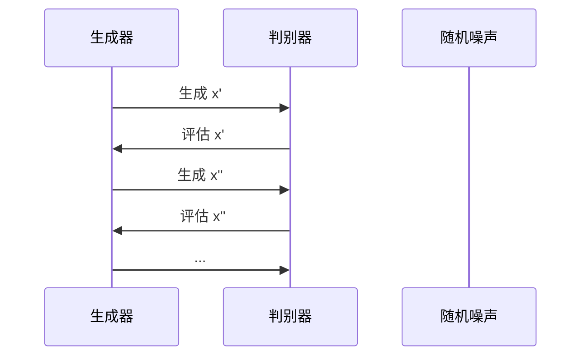
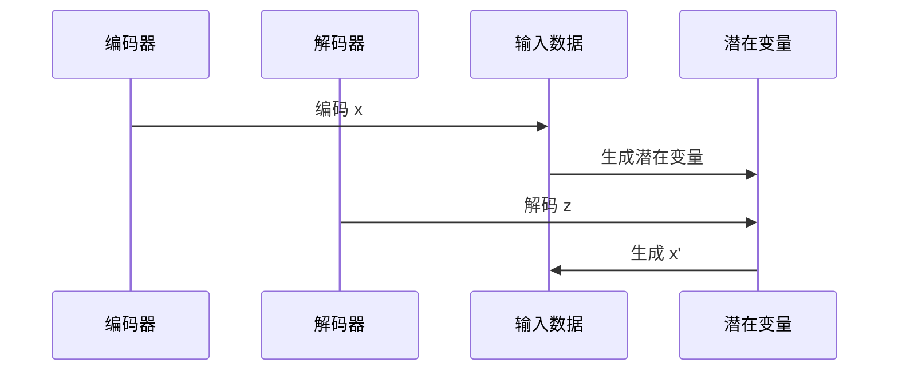

                 

# 深度生成模型在创造性推理中的前沿探索

## 关键词

- 深度生成模型
- 创造性推理
- GAN
- VAE
- 强化学习
- 多模态数据融合

## 摘要

深度生成模型（Deep Generative Models，DGMs）是近年来人工智能领域的重大突破，其在创造性推理中展现出了巨大的潜力。本文将从深度生成模型的基础知识出发，逐步探讨其在创造性推理中的前沿应用。首先，我们将介绍深度生成模型的定义、分类、核心原理及其特性与应用场景。接着，我们将深入分析创造性推理的概念、关键要素以及应用领域。在此基础上，本文将探讨深度生成模型与创造性推理的结合点，重点介绍其在艺术创作、科学研究和企业战略规划中的应用。随后，我们将探讨深度生成模型在创造性推理中的前沿技术，如与强化学习结合、多模态数据融合和个性化生成。最后，通过具体的案例研究，我们将展示深度生成模型在创造性推理中的实际应用，并提供一些最佳实践 tips。本文旨在为读者提供一个全面、系统的了解深度生成模型在创造性推理中应用的视角。

## 第一部分：深度生成模型基础

### 第1章：深度生成模型概述

### 1.1 深度生成模型的定义与分类

#### 1.1.1 深度生成模型的定义

深度生成模型（Deep Generative Models，简称DGMs）是一类能够生成数据分布的机器学习模型。它们通过学习真实数据分布的统计特征，生成与真实数据具有相似特征的新数据。深度生成模型的核心思想是通过深度神经网络（Deep Neural Networks，简称DNNs）学习数据的高层次抽象表示，从而实现对复杂数据分布的建模。

#### 1.1.2 深度生成模型的分类

深度生成模型可以根据生成过程的不同，分为以下几类：

1. **生成对抗网络（Generative Adversarial Networks，GAN）**：GAN由一个生成器和一个判别器组成，两者相互对抗，生成器试图生成尽可能真实的数据，而判别器则试图区分生成数据和真实数据。

2. **变分自编码器（Variational Autoencoder，VAE）**：VAE通过编码器和解码器来学习数据分布的参数化表示，从而生成新的数据。

3. **深度信念网络（Deep Belief Networks，DBN）**：DBN利用多层非线性变换学习数据分布的隐藏表示。

4. **深度神经网络采样模型（Deep Neural Network Sampling Models，如DDPG）**：这类模型通过神经网络直接采样生成数据。

#### 1.1.3 深度生成模型的发展历史

深度生成模型的发展历程可以追溯到2000年代初期，最早的生成模型如玻尔兹曼机（Boltzmann Machines，BM）和限制性玻尔兹曼机（Restricted Boltzmann Machines，RBM）。随着深度学习的兴起，生成模型逐渐被引入到深度学习框架中，GAN和VAE成为最具有代表性的模型。

### 1.2 深度生成模型的核心原理

#### 1.2.1 生成对抗网络（GAN）

GAN的核心思想是利用生成器（Generator）和判别器（Discriminator）的对抗训练来学习数据分布。生成器的目标是生成足够真实的数据以欺骗判别器，而判别器的目标是正确区分真实数据和生成数据。通过这种对抗过程，生成器不断优化其生成能力，判别器不断优化其判断能力，最终达到一种平衡状态。

**算法原理**：

- 生成器 G：接收随机噪声 z，生成与真实数据 x 近似的数据 x'。
- 判别器 D：接收真实数据 x 和生成数据 x'，输出对数据的真实性判断。
- 对抗训练：生成器和判别器交替更新参数，使得判别器的判断能力不断提高，生成器的生成能力不断增强。

**流程图**：

#### 1.2.2 变分自编码器（VAE）

VAE通过编码器（Encoder）和解码器（Decoder）来学习数据分布的参数化表示。编码器将输入数据映射到一个潜在空间，解码器则从潜在空间中采样并重构输入数据。

**算法原理**：

- 编码器 q_φ(z|x)：将输入数据 x 映射到一个潜在变量 z。
- 解码器 p_θ(x|z)：从潜在变量 z 生成输入数据 x。
- 对数据分布的建模：通过优化编码器和解码器的参数，使得生成的数据分布与真实数据分布相似。

**流程图**：

### 1.3 深度生成模型的特性与应用场景

#### 1.3.1 深度生成模型的特性

- **生成能力**：深度生成模型能够生成与真实数据高度相似的新数据。
- **灵活性**：深度生成模型可以适应不同类型的数据和任务。
- **鲁棒性**：深度生成模型对噪声和异常值具有较强的鲁棒性。

#### 1.3.2 深度生成模型的应用场景

- **数据增强**：通过生成类似真实数据的新数据来扩充训练集。
- **图像生成与编辑**：生成或编辑图像，如生成人脸、图像风格迁移等。
- **文本生成与编辑**：生成或编辑文本，如文章生成、对话系统等。
- **语音合成**：生成或编辑语音，如语音转换、语音增强等。

### 1.4 深度生成模型在创造性推理中的潜力

#### 1.4.1 创造性推理的定义与重要性

创造性推理（Creative Reasoning）是指通过创造性思维过程来解决问题或产生新想法。它涉及非线性的思维方式、跨领域的知识融合以及新概念和解决方案的生成。在人工智能领域，创造性推理被视为一种重要的智能能力。

#### 1.4.2 深度生成模型在创造性推理中的应用

深度生成模型在创造性推理中具有以下潜力：

- **创意生成**：通过生成大量类似真实数据的新数据，激发新的创意和想法。
- **风格迁移**：将一种风格迁移到另一领域，实现跨领域的创意融合。
- **数据增强**：通过生成新数据来扩充训练集，提高模型的创造性推理能力。

### 1.5 深度生成模型的发展趋势与挑战

#### 1.5.1 深度生成模型的发展趋势

- **模型复杂度增加**：随着计算能力的提升，深度生成模型变得越来越复杂，能够学习更复杂的分布。
- **应用领域扩展**：深度生成模型在各个领域的应用不断扩展，从图像、文本到语音和视频。
- **多模态融合**：深度生成模型开始与多模态数据融合，实现更丰富的创造性推理。

#### 1.5.2 深度生成模型面临的挑战与解决方案

- **计算资源需求**：深度生成模型对计算资源有较高要求，需要大规模的计算资源和存储空间。
- **模型可解释性**：深度生成模型的工作原理较为复杂，其决策过程缺乏透明性，影响其可解释性。
- **数据质量和多样性**：深度生成模型的性能依赖于训练数据的质量和多样性，如何获得高质量的训练数据是一个挑战。

## 参考文献

- Bengio, Y., Courville, A., & Vincent, P. (2013). Representation learning: A review and new perspectives. IEEE Transactions on Pattern Analysis and Machine Intelligence, 35(8), 1798-1828.
- Goodfellow, I., Pouget-Abadie, J., Mirza, M., Xu, B., Warde-Farley, D., Ozair, S., ... & Bengio, Y. (2014). Generative adversarial nets. Advances in Neural Information Processing Systems, 27.
- Kingma, D. P., & Welling, M. (2013). Auto-encoding variational bayes. arXiv preprint arXiv:1312.6114.
- Bengio, Y. (2009). Learning deep architec

