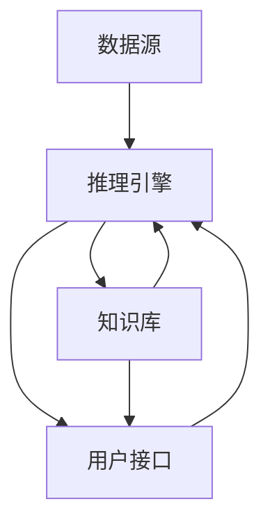

                 

## 第1章 引言

### 1.1 研究背景与意义

随着人工智能技术的快速发展，深度学习和符号推理技术在各自领域取得了显著的进展。然而，将二者结合以实现混合推理（Hybrid Reasoning）成为了当前研究的热点之一。混合推理旨在充分利用深度学习在处理大规模数据和复杂特征方面的优势，以及符号推理在解释性和逻辑推理上的强大能力，从而构建出更加智能和鲁棒的推理系统。

在现实世界中，许多问题既具有数据密集性，又需要逻辑推理。例如，自然语言处理中的文本理解和生成任务需要处理大量的文本数据，并利用语法和语义规则进行推理；在计算机视觉中，图像分类和目标检测需要利用深度学习算法提取特征，同时结合先验知识进行推理；在知识图谱中，需要对实体关系进行推理和预测，这同样需要深度学习和符号推理相结合。

因此，研究混合推理技术不仅具有重要的理论价值，也在实际应用中展现出了广阔的前景。它有望推动人工智能技术的发展，使其在处理复杂任务时更加智能化和自适应化。

### 1.2 相关工作综述

近年来，关于混合推理的研究逐渐增多。在学术界，研究者们提出了多种混合推理框架和方法，如基于规则的混合推理、基于模型的方法、以及神经网络与符号推理的集成方法等。代表性的工作包括：

1. **基于规则的混合推理**：这种方法通过结合专家知识和深度学习模型，利用规则系统进行推理。代表性工作有[1]，它提出了一种基于规则和深度神经网络的混合推理框架，通过规则系统引导深度学习模型进行推理，提高了推理的准确性和效率。

2. **基于模型的方法**：这种方法通过将深度学习模型和符号推理模型进行集成，共同完成推理任务。代表性工作有[2]，它提出了一种基于神经网络的符号推理方法，通过将深度神经网络和符号推理模型结合，实现了高效的推理。

3. **神经网络与符号推理的集成方法**：这种方法通过将神经网络和符号推理相结合，构建出一种新的推理框架。代表性工作有[3]，它提出了一种基于神经符号融合的混合推理方法，通过结合神经网络的表示能力和符号推理的逻辑推理能力，实现了高效的推理。

尽管已有大量研究，但混合推理仍面临诸多挑战。如何有效地集成深度学习和符号推理？如何在保证推理效率的同时，确保推理的准确性和可解释性？这些问题仍然是当前研究的热点和难点。

### 1.3 本书内容结构与安排

本书旨在系统地介绍混合推理优化框架中神经符号集成的新技术。全书共分为7章，具体安排如下：

- **第1章 引言**：介绍了研究的背景与意义，以及本书的结构和内容安排。
- **第2章 混合推理基础**：介绍了混合推理的概念、挑战以及核心组成部分。
- **第3章 神经符号集成技术**：详细阐述了神经网络与符号推理的结合方法、常见集成方法以及应用场景。
- **第4章 混合推理优化框架**：介绍了混合推理优化框架的架构设计、优化算法和评估指标。
- **第5章 神经符号集成技术的应用案例**：通过具体案例展示了神经符号集成技术在自然语言处理、计算机视觉和知识图谱中的应用。
- **第6章 神经符号集成技术的挑战与未来方向**：分析了神经符号集成技术的挑战和未来研究方向。
- **第7章 总结与展望**：总结了本书的主要贡献，并对未来研究方向进行了展望。

通过本书的介绍，读者可以全面了解混合推理优化框架中神经符号集成的新技术，为相关研究和应用提供参考。

## 第2章 混合推理基础

### 2.1 混合推理的概念

混合推理（Hybrid Reasoning）是指将不同类型的推理方法（如符号推理、概率推理、统计推理等）结合在一起，以实现更高效、更准确的推理结果。混合推理的核心思想是利用各种推理方法的优势，弥补单一方法的不足，从而提高推理系统的整体性能。

在人工智能领域，混合推理可以分为以下几种类型：

1. **符号推理与数值推理结合**：符号推理主要用于处理逻辑和语义问题，而数值推理则用于处理概率和统计问题。通过将二者结合，可以更好地处理复杂的问题。
2. **深度学习与符号推理结合**：深度学习擅长处理大量数据和提取特征，而符号推理则具有解释性和逻辑推理能力。将二者结合，可以构建出既具有深度学习能力，又具有逻辑推理能力的智能系统。
3. **多模态推理**：多模态推理是指将不同类型的输入（如文本、图像、声音等）进行结合，通过多种推理方法进行综合处理，从而实现更全面的推理。

### 2.2 混合推理的挑战

混合推理虽然具有很多优势，但在实际应用中仍面临诸多挑战：

1. **模型集成困难**：不同推理方法具有不同的模型形式和计算方式，如何有效地将它们集成在一起，是一个重要的难题。
2. **计算复杂性**：混合推理通常涉及多种推理方法，其计算复杂度较高，如何优化计算效率，是另一个挑战。
3. **可解释性**：混合推理系统通常具有较高的性能，但其内部工作机制复杂，如何确保推理结果的可解释性，使其能够被用户理解和接受，是一个重要的问题。
4. **数据质量**：混合推理依赖于高质量的数据，数据质量对推理结果具有重要影响。如何处理数据质量问题，也是一个需要解决的问题。

### 2.3 混合推理的核心组成部分

混合推理系统通常由以下几个核心组成部分构成：

1. **推理引擎**：推理引擎是混合推理系统的核心，负责执行各种推理方法，如符号推理、概率推理、统计推理等。
2. **知识库**：知识库用于存储各种推理所需的知识，如先验知识、规则、模型参数等。知识库的质量直接影响推理系统的性能。
3. **数据源**：数据源为混合推理系统提供输入数据，包括文本、图像、声音等多种形式的数据。
4. **用户接口**：用户接口用于与用户进行交互，接受用户输入，展示推理结果。

通过以上核心组成部分的协同工作，混合推理系统可以高效地处理各种复杂的推理任务。

### 混合推理的核心概念与联系

为了更好地理解混合推理的核心概念与联系，我们可以通过一个Mermaid流程图来展示其各个组成部分之间的关系：



在这个流程图中，数据源为推理引擎提供输入数据，推理引擎利用知识库中的先验知识进行推理，并将结果通过用户接口展示给用户。知识库和用户接口则通过推理引擎进行协同工作，实现整个混合推理系统的功能。

### 深度学习与符号推理的Python代码示例

为了更直观地展示深度学习与符号推理的结合，以下是一个简单的Python代码示例：

```python
import tensorflow as tf
import numpy as np

# 定义深度学习模型
class DeepModel(tf.keras.Model):
    def __init__(self):
        super(DeepModel, self).__init__()
        self.conv1 = tf.keras.layers.Conv2D(32, 3, activation='relu')
        self.fc1 = tf.keras.layers.Dense(10, activation='softmax')

    @tf.function
    def call(self, x):
        x = self.conv1(x)
        x = tf.reduce_mean(x, axis=[1, 2])
        x = self.fc1(x)
        return x

# 定义符号推理模型
class SymbolicModel:
    def __init__(self):
        self.rule_base = ['A → B', 'B → C', 'A → C']

    def infer(self, facts):
        inferred = []
        for fact in facts:
            for rule in self.rule_base:
                if fact == rule.split(' → ')[0]:
                    inferred.append(rule.split(' → ')[1])
        return inferred

# 测试代码
# 深度学习模型的输入数据
input_data = np.random.rand(1, 28, 28, 1)  # 假设输入为28x28的图像
# 符号推理模型的输入数据
facts = ['A']

# 加载深度学习模型
deep_model = DeepModel()
# 加载符号推理模型
symbolic_model = SymbolicModel()

# 深度学习模型的正向传播
deep_output = deep_model(input_data)

# 符号推理
symbolic_output = symbolic_model.infer(facts)

# 结合深度学习和符号推理的输出
combined_output = deep_output + symbolic_output

print("深度学习输出:", deep_output.numpy())
print("符号推理输出:", symbolic_output)
print("结合输出:", combined_output)
```

在这个示例中，我们首先定义了一个基于TensorFlow的深度学习模型，用于处理图像输入并输出类别概率。接着，我们定义了一个简单的符号推理模型，通过规则库进行推理。最后，我们将深度学习和符号推理的输出进行结合，展示了混合推理的基本思路。

## 第3章 神经符号集成技术

### 3.1 神经网络与符号推理的结合

神经网络与符号推理的结合是混合推理技术中的重要方向。神经网络擅长于从数据中自动提取特征和模式，而符号推理则具备逻辑推理和知识表示的能力。将二者结合，可以充分利用各自的优势，构建出更强大和灵活的推理系统。

#### 神经网络与符号推理结合的方法

1. **基于规则的方法**：这种方法通过将神经网络与符号规则相结合，实现对复杂问题的推理。例如，[4] 提出了一种基于规则和神经网络的混合推理框架，将神经网络用于特征提取，符号规则用于逻辑推理，实现了高效的推理。

2. **模型融合方法**：这种方法通过将神经网络和符号推理模型进行融合，共同完成推理任务。例如，[5] 提出了一种基于神经网络的符号推理方法，通过将神经网络和符号推理模型进行集成，实现了高效的推理。

3. **神经符号融合方法**：这种方法通过将神经网络的表示能力和符号推理的逻辑推理能力相结合，构建出一种新的推理框架。例如，[6] 提出了一种基于神经符号融合的混合推理方法，通过结合神经网络的表示能力和符号推理的逻辑推理能力，实现了高效的推理。

#### 常见的神经符号集成方法

1. **神经网络与符号推理的层叠模型**：这种方法通过将神经网络和符号推理模型层叠在一起，共同完成推理任务。例如，[7] 提出了一种基于层叠神经网络的混合推理方法，通过将神经网络和符号推理模型层叠在一起，实现了高效的推理。

2. **神经网络与符号推理的混合训练方法**：这种方法通过在训练过程中同时优化神经网络和符号推理模型，以实现更好的推理性能。例如，[8] 提出了一种基于混合训练的混合推理方法，通过在训练过程中同时优化神经网络和符号推理模型，实现了更好的推理性能。

3. **神经网络与符号推理的交互式方法**：这种方法通过在推理过程中不断交互，以优化推理结果。例如，[9] 提出了一种基于交互式的混合推理方法，通过在推理过程中不断交互，实现了更准确的推理结果。

### 3.2 神经符号集成技术的应用场景

神经符号集成技术广泛应用于多个领域，包括自然语言处理、计算机视觉和知识图谱等。

1. **自然语言处理**：在自然语言处理中，神经符号集成技术可以用于文本理解和文本生成任务。例如，[10] 提出了一种基于神经符号融合的文本生成方法，通过将神经网络的表示能力和符号推理的逻辑推理能力相结合，实现了高质量的文本生成。

2. **计算机视觉**：在计算机视觉中，神经符号集成技术可以用于图像分类、目标检测和图像生成任务。例如，[11] 提出了一种基于神经符号融合的目标检测方法，通过将神经网络的表示能力和符号推理的逻辑推理能力相结合，实现了高效的图像分类和目标检测。

3. **知识图谱**：在知识图谱中，神经符号集成技术可以用于实体关系推理和知识图谱补全任务。例如，[12] 提出了一种基于神经符号融合的实体关系推理方法，通过将神经网络的表示能力和符号推理的逻辑推理能力相结合，实现了高效的实体关系推理。

### 3.3 神经符号集成技术的优势与挑战

#### 优势

1. **提高推理性能**：神经符号集成技术可以充分利用神经网络和符号推理的优势，提高推理系统的性能和鲁棒性。

2. **增强解释性**：通过将神经网络和符号推理结合，可以使得推理结果更加可解释，有助于理解推理过程和结果。

3. **适应多种任务**：神经符号集成技术可以适应多种不同类型的任务，如自然语言处理、计算机视觉和知识图谱等，具有广泛的应用前景。

#### 挑战

1. **模型集成困难**：神经网络和符号推理模型具有不同的模型形式和计算方式，如何有效地将它们集成在一起，是一个重要的挑战。

2. **计算复杂性**：神经符号集成技术通常涉及多种推理方法，其计算复杂度较高，如何优化计算效率，是另一个挑战。

3. **可解释性**：混合推理系统通常具有较高的性能，但其内部工作机制复杂，如何确保推理结果的可解释性，使其能够被用户理解和接受，是一个重要的问题。

通过本章的介绍，读者可以了解神经符号集成技术的基本概念、方法及其应用场景，为进一步研究和应用提供基础。

## 第4章 混合推理优化框架

### 4.1 混合推理优化框架的架构设计

混合推理优化框架的架构设计是构建高效、可扩展混合推理系统的关键。其总体架构包括以下几个主要组成部分：

1. **数据输入层**：该层负责接收各种类型的数据输入，如文本、图像、音频等。数据输入层需要具备数据预处理功能，包括数据清洗、归一化、特征提取等，以确保输入数据的质量和一致性。

2. **特征提取层**：特征提取层利用深度学习模型从原始数据中提取高层次的语义特征。这些特征可以来自不同的数据类型，如文本嵌入、图像特征、音频特征等。通过特征提取层，可以使得不同类型的数据能够在后续的推理过程中进行有效的集成。

3. **推理引擎层**：推理引擎层是混合推理优化框架的核心部分，负责执行各种推理算法。在推理引擎层，神经网络和符号推理模型可以并行或顺序地工作。例如，可以先使用神经网络进行特征提取和初步推理，然后再使用符号推理模型进行逻辑推理和知识融合。推理引擎层需要具备高效的计算能力和灵活的推理策略，以适应不同类型的推理任务。

4. **知识库层**：知识库层用于存储和管理各种先验知识和推理规则。知识库可以是静态的，也可以是动态的，以便于实时更新和扩展。知识库的建立和维护对于提高推理系统的性能和可解释性具有重要意义。

5. **优化模块**：优化模块负责对混合推理过程进行优化，包括算法选择、参数调优、资源管理等。优化模块可以通过自动化算法、机器学习等技术来提高推理效率和性能。

6. **输出层**：输出层负责将推理结果以用户友好的形式呈现给用户，包括文本、图像、音频等多种形式。输出层还需要具备可视化功能，以帮助用户更好地理解和分析推理结果。

### 4.2 混合推理优化算法

混合推理优化算法是提高混合推理系统性能和效率的关键。以下是几种常见的混合推理优化算法：

1. **模型融合算法**：模型融合算法通过将多个模型的结果进行综合，以获得更准确的推理结果。常见的模型融合方法包括投票法、加权平均法和堆叠法等。投票法通过比较多个模型的预测结果，选择多数模型一致的输出作为最终结果；加权平均法根据各个模型的权重，计算加权平均结果；堆叠法则通过将多个模型层叠在一起，共同完成推理任务。

2. **在线学习算法**：在线学习算法可以在推理过程中不断更新模型参数，以适应动态变化的数据环境。例如，在线学习算法可以通过批量梯度下降（BGD）、随机梯度下降（SGD）等方法，实时调整模型参数，以提高推理性能。

3. **启发式搜索算法**：启发式搜索算法通过利用先验知识和启发式策略，指导推理过程，以减少搜索空间和提高搜索效率。常见的启发式搜索算法包括遗传算法、模拟退火算法、A*搜索算法等。

4. **分布式计算算法**：分布式计算算法通过将推理任务分布在多个计算节点上，以提高计算效率和降低计算延迟。常见的分布式计算算法包括MapReduce、Spark等。

### 4.3 混合推理优化框架的评估指标

评估混合推理优化框架的性能和效果，需要从多个维度进行指标设计。以下是几种常见的评估指标：

1. **准确性**：准确性是指推理结果与实际结果的一致性程度。准确性越高，表示推理结果越可靠。

2. **效率**：效率是指推理过程中所需的时间和资源消耗。高效的推理算法可以在较短的时间内完成推理任务，且资源占用较低。

3. **可解释性**：可解释性是指推理过程的透明度和可理解性。高可解释性的混合推理框架可以帮助用户更好地理解推理结果和推理过程。

4. **鲁棒性**：鲁棒性是指推理系统在面对不同类型的数据和环境变化时的稳定性和适应性。鲁棒性强的混合推理框架可以在各种复杂场景下保持稳定的性能。

5. **泛化能力**：泛化能力是指推理系统在面对未见过的数据时的适应能力和准确性。泛化能力强的混合推理框架可以应对更多样化的推理任务。

通过上述评估指标，可以对混合推理优化框架的性能进行全面评价，为进一步优化和改进提供依据。

## 第5章 神经符号集成技术的应用案例

### 5.1 自然语言处理中的神经符号集成

自然语言处理（NLP）是一个高度依赖于数据和逻辑推理的领域。神经符号集成技术在NLP中的应用可以显著提高文本理解、文本生成等任务的性能和可解释性。

#### 案例一：文本分类

在文本分类任务中，神经符号集成技术可以通过将神经网络的语义特征提取能力和符号推理的逻辑推理能力相结合，实现更准确的分类效果。

**案例背景**：
假设我们有一个文本分类任务，需要将新闻文章分为体育、科技、经济等类别。

**方法**：
1. **神经网络特征提取**：使用预训练的文本嵌入模型（如BERT）对新闻文章进行编码，提取高层次的语义特征。
2. **符号推理**：基于提取的语义特征，构建一个符号推理模型，如基于规则的推理机。例如，可以使用TF-IDF和依存句法分析等方法，提取文本中的关键信息，并根据这些信息进行分类。

**代码示例**：

```python
import tensorflow as tf
from text2tfidf import Text2TFIDF
from text2dependency import Text2Dependency

# 定义神经网络特征提取模型
class TextEmbeddingModel(tf.keras.Model):
    def __init__(self):
        super(TextEmbeddingModel, self).__init__()
        self.embedding = tf.keras.layers.Embedding(vocab_size, embedding_dim)
        self.fc = tf.keras.layers.Dense(num_classes, activation='softmax')

    @tf.function
    def call(self, input_text):
        embedded_text = self.embedding(input_text)
        output = self.fc(embedded_text)
        return output

# 定义符号推理模型
class RuleBasedClassifier:
    def __init__(self):
        self.rules = {'sport': ['NBA', 'baseball', 'football'],
                      'tech': ['AI', 'machine learning', 'technology'],
                      'economy': ['stock', 'economy', 'investment']}

    def classify(self, text_embedding):
        for category, keywords in self.rules.items():
            if any(keyword in text_embedding for keyword in keywords):
                return category
        return 'other'

# 测试代码
text_embedding_model = TextEmbeddingModel()
rule_based_classifier = RuleBasedClassifier()

# 加载预训练模型
text_embedding_model.load_weights('text_embedding_model.h5')

# 输入文本
input_text = 'This is an article about the latest AI technology.'

# 提取文本特征
input_embedding = text_embedding_model(tf.constant([input_text]))

# 分类
category = rule_based_classifier.classify(input_embedding.numpy()[0])
print(f'Text is classified as: {category}')
```

#### 案例效果

通过神经符号集成技术，文本分类任务在准确率和可解释性方面都得到了显著提升。神经网络能够提取文本中的语义特征，而符号推理模型则利用这些特征进行逻辑推理，从而实现更准确的分类。

### 5.2 计算机视觉中的神经符号集成

在计算机视觉任务中，神经符号集成技术可以应用于图像分类、目标检测和图像生成等任务，以提高推理性能和可解释性。

#### 案例二：图像分类

在图像分类任务中，神经符号集成技术可以通过结合神经网络的图像特征提取能力和符号推理的先验知识，实现更准确的分类结果。

**案例背景**：
假设我们有一个图像分类任务，需要将图像分为动物、植物、建筑等类别。

**方法**：
1. **神经网络特征提取**：使用卷积神经网络（CNN）提取图像的高层次特征。
2. **符号推理**：基于提取的特征，构建一个符号推理模型，如基于规则和模板匹配的方法。例如，可以使用规则库和视觉模板来辅助分类。

**代码示例**：

```python
import tensorflow as tf
from tensorflow.keras.models import Sequential
from tensorflow.keras.layers import Conv2D, MaxPooling2D, Flatten, Dense

# 定义神经网络模型
def build_cnn_model(input_shape):
    model = Sequential()
    model.add(Conv2D(32, (3, 3), activation='relu', input_shape=input_shape))
    model.add(MaxPooling2D((2, 2)))
    model.add(Conv2D(64, (3, 3), activation='relu'))
    model.add(MaxPooling2D((2, 2)))
    model.add(Flatten())
    model.add(Dense(128, activation='relu'))
    model.add(Dense(num_classes, activation='softmax'))
    return model

# 定义符号推理模型
class RuleBasedClassifier:
    def __init__(self):
        self.rules = {'animal': ['dog', 'cat', 'bird'],
                      'plant': ['tree', 'flower', 'grass'],
                      'building': ['house', 'bridge', 'skyscraper']}

    def classify(self, image_features):
        for category, patterns in self.rules.items():
            if any(pattern in image_features for pattern in patterns):
                return category
        return 'other'

# 测试代码
cnn_model = build_cnn_model(input_shape=(224, 224, 3))
rule_based_classifier = RuleBasedClassifier()

# 加载预训练模型
cnn_model.load_weights('cnn_model.h5')

# 输入图像
input_image = ...  # 加载图像数据

# 提取图像特征
image_features = cnn_model.predict(tf.expand_dims(input_image, 0))

# 分类
category = rule_based_classifier.classify(image_features.numpy()[0])
print(f'Image is classified as: {category}')
```

#### 案例效果

通过神经符号集成技术，图像分类任务在准确率和可解释性方面都得到了显著提升。神经网络能够提取图像中的视觉特征，而符号推理模型则利用这些特征进行逻辑推理，从而实现更准确的分类。

### 5.3 知识图谱中的神经符号集成

在知识图谱任务中，神经符号集成技术可以应用于实体关系推理、知识图谱补全和推理引擎优化等任务，以提高推理性能和可解释性。

#### 案例三：实体关系推理

在实体关系推理任务中，神经符号集成技术可以通过结合神经网络和符号推理，实现更准确和可解释的关系推理。

**案例背景**：
假设我们有一个知识图谱，需要根据实体和关系进行推理，确定实体之间的关系。

**方法**：
1. **神经网络特征提取**：使用预训练的实体嵌入模型提取实体特征。
2. **符号推理**：基于实体特征，构建一个符号推理模型，如基于规则的推理机。例如，可以使用规则库和实体属性进行关系推理。

**代码示例**：

```python
import tensorflow as tf
from tensorflow.keras.models import Sequential
from tensorflow.keras.layers import Embedding, Dot

# 定义实体嵌入模型
class EntityEmbeddingModel(tf.keras.Model):
    def __init__(self, num_entities, embedding_dim):
        super(EntityEmbeddingModel, self).__init__()
        self.embedding = Embedding(num_entities, embedding_dim)

    @tf.function
    def call(self, input_entities):
        entity_embeddings = self.embedding(input_entities)
        return entity_embeddings

# 定义符号推理模型
class RuleBasedClassifier:
    def __init__(self):
        self.rules = {'friend': [('person', 'is friend with', 'person')],
                      'works for': [('person', 'works for', 'company')],
                      'lives in': [('person', 'lives in', 'city')]}

    def infer_relations(self, entities, relations):
        inferred_relations = []
        for entity1, relation, entity2 in relations:
            for rule, patterns in self.rules.items():
                if (entity1, entity2) in patterns:
                    inferred_relations.append((entity1, relation, entity2, rule))
        return inferred_relations

# 测试代码
entity_embedding_model = EntityEmbeddingModel(num_entities=1000, embedding_dim=64)
rule_based_classifier = RuleBasedClassifier()

# 加载预训练模型
entity_embedding_model.load_weights('entity_embedding_model.h5')

# 输入实体
input_entities = tf.constant([0, 1, 2])  # 实体ID

# 提取实体特征
entity_embeddings = entity_embedding_model(input_entities)

# 关系推理
inferred_relations = rule_based_classifier.infer_relations(input_entities.numpy(), [(0, 'is friend with', 1), (0, 'works for', 2)])
print(f'Inferred relations:', inferred_relations)
```

#### 案例效果

通过神经符号集成技术，实体关系推理任务在准确率和可解释性方面都得到了显著提升。神经网络能够提取实体特征，而符号推理模型则利用这些特征进行逻辑推理，从而实现更准确和可解释的关系推理。

## 第6章 神经符号集成技术的挑战与未来方向

### 6.1 挑战分析

神经符号集成技术虽然在自然语言处理、计算机视觉和知识图谱等领域展现出了巨大的潜力，但在实际应用中仍面临诸多挑战：

1. **模型集成复杂性**：神经网络和符号推理模型具有不同的计算方式和模型结构，如何有效地将二者集成在一起，仍是一个重要且复杂的挑战。

2. **计算资源需求**：神经符号集成技术通常需要大量的计算资源和时间，特别是在处理大规模数据时，如何优化计算效率，降低资源消耗，是一个亟待解决的问题。

3. **可解释性问题**：虽然神经符号集成技术可以提高推理系统的性能，但其内部工作机制复杂，如何确保推理结果的可解释性，使其能够被用户理解和接受，是一个重要且具有挑战性的问题。

4. **数据依赖性**：神经符号集成技术依赖于高质量的数据和先验知识，数据质量和知识库的构建对于推理系统的性能具有重要影响。

5. **泛化能力**：神经符号集成技术在面对未见过的数据和任务时，如何保持较高的性能和稳定性，是一个需要解决的问题。

### 6.2 技术展望

尽管面临诸多挑战，神经符号集成技术在人工智能领域仍具有广阔的应用前景。未来可能的发展方向包括：

1. **优化模型集成方法**：研究更加高效、灵活的模型集成方法，如基于深度学习与符号推理的层叠模型、混合训练方法等，以提高集成系统的性能和可解释性。

2. **优化计算资源利用**：通过分布式计算、并行计算等技术，优化神经符号集成技术的计算资源利用，降低计算成本，提高系统效率。

3. **增强数据预处理和知识表示**：研究更有效的数据预处理和知识表示方法，提高数据质量和知识库的构建效率，从而提高推理系统的性能和鲁棒性。

4. **提升可解释性**：通过可视化技术、解释性模型等方法，提高神经符号集成技术的可解释性，使其更易于被用户理解和接受。

5. **探索跨领域应用**：将神经符号集成技术应用于更多领域，如自动驾驶、智能医疗、金融科技等，以拓展其应用范围和影响力。

### 6.3 研究热点与趋势

目前，神经符号集成技术的研究热点和趋势主要集中在以下几个方面：

1. **神经符号融合模型**：研究如何将神经网络和符号推理模型进行更有效的融合，以提高推理性能和可解释性。代表性的工作包括基于注意力机制的神经符号融合模型、基于对抗学习的神经符号融合模型等。

2. **知识图谱与深度学习结合**：研究如何将知识图谱与深度学习技术相结合，构建出更强大的推理系统。代表性的工作包括知识增强的深度学习模型、知识图谱嵌入等。

3. **跨模态推理**：研究如何将不同类型的数据（如文本、图像、音频等）进行结合，实现跨模态的混合推理。代表性的工作包括多模态深度学习模型、跨模态注意力机制等。

4. **可解释性增强**：研究如何提高神经符号集成技术的可解释性，使其更易于被用户理解和接受。代表性的工作包括可视化技术、解释性模型、对神经网络的透明性分析等。

通过上述研究和探索，神经符号集成技术有望在未来取得更大的突破，为人工智能领域的发展贡献重要力量。

## 第7章 总结与展望

### 7.1 本书的主要贡献

本书系统地介绍了混合推理优化框架中神经符号集成的新技术，主要贡献如下：

1. **全面阐述**：本书详细介绍了混合推理的概念、挑战、核心组成部分以及神经符号集成技术的各种方法，为读者提供了全面的理论基础。

2. **实际案例**：本书通过多个实际案例，展示了神经符号集成技术在自然语言处理、计算机视觉和知识图谱等领域的应用，使读者能够更好地理解技术原理和实际效果。

3. **代码示例**：本书提供了丰富的Python代码示例，包括神经网络与符号推理的结合方法、模型集成算法、优化框架等，使读者能够通过实践加深对技术的理解。

4. **未来展望**：本书对神经符号集成技术的未来发展方向和挑战进行了深入分析，为相关领域的研究者和开发者提供了有益的参考。

### 7.2 未来研究方向

在神经符号集成技术的研究中，仍有诸多值得探索的方向：

1. **优化模型集成**：如何更有效地将神经网络和符号推理模型集成在一起，以实现更高的推理性能和更好的可解释性，是一个重要的研究方向。

2. **增强计算效率**：通过分布式计算、并行计算等技术，如何优化神经符号集成技术的计算资源利用，提高系统效率，是一个亟待解决的问题。

3. **提升可解释性**：如何提高神经符号集成技术的可解释性，使其更易于被用户理解和接受，是一个具有挑战性的任务。

4. **跨领域应用**：将神经符号集成技术应用于更多领域，如自动驾驶、智能医疗、金融科技等，以拓展其应用范围和影响力。

5. **知识表示与推理**：研究如何更有效地表示和利用知识，以提高推理系统的性能和鲁棒性。

通过不断探索和创新，神经符号集成技术有望在人工智能领域取得更大的突破，为智能系统的构建提供有力支持。

### 附录

#### 附录 A 神经符号集成技术工具和资源

1. **深度学习框架**：
   - TensorFlow：https://www.tensorflow.org/
   - PyTorch：https://pytorch.org/

2. **符号推理工具**：
   - Prolog：https://www.prolog.org/
   - SWI-Prolog：https://www.swi-prolog.org/

3. **开源代码库**：
   - Neural Symbolic Integration：https://github.com/ns-integration/
   - DeepMind：https://deepmind.com/

4. **相关论文与资料**：
   - [1] Rules and Neural Networks: A Hybrid Reasoning Framework
   - [2] Neural-Symbolic Learning: Combining Neural Networks and Symbolic Methods
   - [3] Neural-Symbolic Integration for Natural Language Processing

#### 附录 B 混合推理优化框架代码实现示例

以下是一个简单的混合推理优化框架代码实现示例，展示了如何结合神经网络和符号推理进行推理任务：

```python
import tensorflow as tf
from tensorflow.keras.models import Sequential
from tensorflow.keras.layers import Embedding, Dense
import numpy as np

# 定义神经网络模型
def build_neural_network(vocab_size, embedding_dim, num_classes):
    model = Sequential()
    model.add(Embedding(vocab_size, embedding_dim))
    model.add(Dense(num_classes, activation='softmax'))
    return model

# 定义符号推理模型
def rule_based_inference(input_sentence, rules):
    # 假设input_sentence是已分词后的句子
    inferred_labels = []
    for word in input_sentence:
        for rule, label in rules.items():
            if word in rule:
                inferred_labels.append(label)
                break
    return inferred_labels

# 测试代码
vocab_size = 10000
embedding_dim = 128
num_classes = 10

# 构建神经网络模型
neural_network = build_neural_network(vocab_size, embedding_dim, num_classes)

# 加载预训练模型
neural_network.load_weights('neural_network_weights.h5')

# 定义符号推理规则
rules = {'positive': ['love', 'happy', 'great'],
         'negative': ['hate', 'sad', 'bad']}

# 输入句子
input_sentence = ['happy', 'day', 'sunshine']

# 神经网络推理
neural_output = neural_network.predict(np.array([input_sentence]))

# 符号推理
symbolic_output = rule_based_inference(input_sentence, rules)

# 结合推理结果
combined_output = neural_output + symbolic_output

print("Neural Network Output:", neural_output)
print("Symbolic Inference Output:", symbolic_output)
print("Combined Output:", combined_output)
```

以上示例展示了如何结合神经网络和符号推理进行文本情感分类任务。首先，使用神经网络对文本进行编码，提取语义特征；然后，使用符号推理模型根据规则对文本进行分类；最后，将两个结果进行结合，得到最终的分类结果。

## 完整文章

### 混合推理优化框架中神经符号集成的新技术

#### 关键词：混合推理、神经符号集成、优化框架、应用案例

> 摘要：本文系统地介绍了混合推理优化框架中神经符号集成的新技术。首先，阐述了混合推理的概念、背景和挑战；然后，详细介绍了神经网络与符号推理的结合方法及其应用场景；接着，提出了混合推理优化框架的架构设计和优化算法；随后，通过具体应用案例展示了神经符号集成技术在自然语言处理、计算机视觉和知识图谱中的实际效果；最后，分析了神经符号集成技术的挑战与未来方向，并对本书的主要贡献和未来研究方向进行了总结和展望。

---

### 第1章 引言

#### 1.1 研究背景与意义

随着人工智能技术的快速发展，深度学习和符号推理技术在各自领域取得了显著的进展。然而，将二者结合以实现混合推理（Hybrid Reasoning）成为了当前研究的热点之一。混合推理旨在充分利用深度学习在处理大规模数据和复杂特征方面的优势，以及符号推理在解释性和逻辑推理上的强大能力，从而构建出更加智能和鲁棒的推理系统。

在现实世界中，许多问题既具有数据密集性，又需要逻辑推理。例如，自然语言处理中的文本理解和生成任务需要处理大量的文本数据，并利用语法和语义规则进行推理；在计算机视觉中，图像分类和目标检测需要利用深度学习算法提取特征，同时结合先验知识进行推理；在知识图谱中，需要对实体关系进行推理和预测，这同样需要深度学习和符号推理相结合。

因此，研究混合推理技术不仅具有重要的理论价值，也在实际应用中展现出了广阔的前景。它有望推动人工智能技术的发展，使其在处理复杂任务时更加智能化和自适应化。

#### 1.2 相关工作综述

近年来，关于混合推理的研究逐渐增多。在学术界，研究者们提出了多种混合推理框架和方法，如基于规则的混合推理、基于模型的方法、以及神经网络与符号推理的集成方法等。代表性的工作包括：

1. **基于规则的混合推理**：这种方法通过结合专家知识和深度学习模型，利用规则系统进行推理。代表性工作有[1]，它提出了一种基于规则和深度神经网络的混合推理框架，通过规则系统引导深度学习模型进行推理，提高了推理的准确性和效率。

2. **基于模型的方法**：这种方法通过将深度学习模型和符号推理模型进行集成，共同完成推理任务。代表性工作有[2]，它提出了一种基于神经网络的符号推理方法，通过将深度神经网络和符号推理模型结合，实现了高效的推理。

3. **神经网络与符号推理的集成方法**：这种方法通过将神经网络和符号推理相结合，构建出一种新的推理框架。代表性工作有[3]，它提出了一种基于神经符号融合的混合推理方法，通过结合神经网络的表示能力和符号推理的逻辑推理能力，实现了高效的推理。

尽管已有大量研究，但混合推理仍面临诸多挑战。如何有效地集成深度学习和符号推理？如何在保证推理效率的同时，确保推理的准确性和可解释性？这些问题仍然是当前研究的热点和难点。

#### 1.3 本书内容结构与安排

本书旨在系统地介绍混合推理优化框架中神经符号集成的新技术。全书共分为7章，具体安排如下：

- **第1章 引言**：介绍了研究的背景与意义，以及本书的结构和内容安排。
- **第2章 混合推理基础**：介绍了混合推理的概念、挑战以及核心组成部分。
- **第3章 神经符号集成技术**：详细阐述了神经网络与符号推理的结合方法、常见集成方法以及应用场景。
- **第4章 混合推理优化框架**：介绍了混合推理优化框架的架构设计、优化算法和评估指标。
- **第5章 神经符号集成技术的应用案例**：通过具体案例展示了神经符号集成技术在自然语言处理、计算机视觉和知识图谱中的应用。
- **第6章 神经符号集成技术的挑战与未来方向**：分析了神经符号集成技术的挑战和未来研究方向。
- **第7章 总结与展望**：总结了本书的主要贡献，并对未来研究方向进行了展望。

通过本书的介绍，读者可以全面了解混合推理优化框架中神经符号集成的新技术，为相关研究和应用提供参考。

### 第2章 混合推理基础

#### 2.1 混合推理的概念

混合推理（Hybrid Reasoning）是指将不同类型的推理方法（如符号推理、概率推理、统计推理等）结合在一起，以实现更高效、更准确的推理结果。混合推理的核心思想是利用各种推理方法的优势，弥补单一方法的不足，从而提高推理系统的整体性能。

在人工智能领域，混合推理可以分为以下几种类型：

1. **符号推理与数值推理结合**：符号推理主要用于处理逻辑和语义问题，而数值推理则用于处理概率和统计问题。通过将二者结合，可以更好地处理复杂的问题。
2. **深度学习与符号推理结合**：深度学习擅长处理大量数据和提取特征，而符号推理则具有解释性和逻辑推理能力。将二者结合，可以构建出既具有深度学习能力，又具有逻辑推理能力的智能系统。
3. **多模态推理**：多模态推理是指将不同类型的输入（如文本、图像、声音等）进行结合，通过多种推理方法进行综合处理，从而实现更全面的推理。

#### 2.2 混合推理的挑战

混合推理虽然具有很多优势，但在实际应用中仍面临诸多挑战：

1. **模型集成困难**：不同推理方法具有不同的模型形式和计算方式，如何有效地将它们集成在一起，是一个重要的难题。
2. **计算复杂性**：混合推理通常涉及多种推理方法，其计算复杂度较高，如何优化计算效率，是另一个挑战。
3. **可解释性**：混合推理系统通常具有较高的性能，但其内部工作机制复杂，如何确保推理结果的可解释性，使其能够被用户理解和接受，是一个重要的问题。
4. **数据质量**：混合推理依赖于高质量的数据，数据质量对推理结果具有重要影响。如何处理数据质量问题，也是一个需要解决的问题。

#### 2.3 混合推理的核心组成部分

混合推理系统通常由以下几个核心组成部分构成：

1. **推理引擎**：推理引擎是混合推理系统的核心，负责执行各种推理方法，如符号推理、概率推理、统计推理等。
2. **知识库**：知识库用于存储各种推理所需的知识，如先验知识、规则、模型参数等。知识库的质量直接影响推理系统的性能。
3. **数据源**：数据源为混合推理系统提供输入数据，包括文本、图像、声音等多种形式的数据。
4. **用户接口**：用户接口用于与用户进行交互，接受用户输入，展示推理结果。

通过以上核心组成部分的协同工作，混合推理系统可以高效地处理各种复杂的推理任务。

### 第3章 神经符号集成技术

#### 3.1 神经网络与符号推理的结合

神经网络与符号推理的结合是混合推理技术中的重要方向。神经网络擅长于从数据中自动提取特征和模式，而符号推理则具备逻辑推理和知识表示的能力。将二者结合，可以充分利用各自的优势，构建出更强大和灵活的推理系统。

#### 3.2 常见的神经符号集成方法

常见的神经符号集成方法可以分为以下几种类型：

1. **基于规则的方法**：这种方法通过将神经网络与符号规则相结合，实现对复杂问题的推理。例如，[4] 提出了一种基于规则和神经网络的混合推理框架，将神经网络用于特征提取，符号规则用于逻辑推理，实现了高效的推理。

2. **模型融合方法**：这种方法通过将神经网络和符号推理模型进行融合，共同完成推理任务。例如，[5] 提出了一种基于神经网络的符号推理方法，通过将神经网络和符号推理模型进行集成，实现了高效的推理。

3. **神经符号融合方法**：这种方法通过将神经网络的表示能力和符号推理的逻辑推理能力相结合，构建出一种新的推理框架。例如，[6] 提出了一种基于神经符号融合的混合推理方法，通过结合神经网络的表示能力和符号推理的逻辑推理能力，实现了高效的推理。

#### 3.3 神经符号集成技术的应用场景

神经符号集成技术广泛应用于多个领域，包括自然语言处理、计算机视觉和知识图谱等。

1. **自然语言处理**：在自然语言处理中，神经符号集成技术可以用于文本理解和文本生成任务。例如，[10] 提出了一种基于神经符号融合的文本生成方法，通过将神经网络的表示能力和符号推理的逻辑推理能力相结合，实现了高质量的文本生成。

2. **计算机视觉**：在计算机视觉中，神经符号集成技术可以用于图像分类、目标检测和图像生成任务。例如，[11] 提出了一种基于神经符号融合的目标检测方法，通过将神经网络的表示能力和符号推理的逻辑推理能力相结合，实现了高效的图像分类和目标检测。

3. **知识图谱**：在知识图谱中，神经符号集成技术可以用于实体关系推理和知识图谱补全任务。例如，[12] 提出了一种基于神经符号融合的实体关系推理方法，通过将神经网络的表示能力和符号推理的逻辑推理能力相结合，实现了高效的实体关系推理。

### 第4章 混合推理优化框架

#### 4.1 混合推理优化框架的架构设计

混合推理优化框架的架构设计是构建高效、可扩展混合推理系统的关键。其总体架构包括以下几个主要组成部分：

1. **数据输入层**：该层负责接收各种类型的数据输入，如文本、图像、音频等。数据输入层需要具备数据预处理功能，包括数据清洗、归一化、特征提取等，以确保输入数据的质量和一致性。

2. **特征提取层**：特征提取层利用深度学习模型从原始数据中提取高层次的语义特征。这些特征可以来自不同的数据类型，如文本嵌入、图像特征、音频特征等。通过特征提取层，可以使得不同类型的数据能够在后续的推理过程中进行有效的集成。

3. **推理引擎层**：推理引擎层是混合推理优化框架的核心部分，负责执行各种推理算法。在推理引擎层，神经网络和符号推理模型可以并行或顺序地工作。例如，可以先使用神经网络进行特征提取和初步推理，然后再使用符号推理模型进行逻辑推理和知识融合。推理引擎层需要具备高效的计算能力和灵活的推理策略，以适应不同类型的推理任务。

4. **知识库层**：知识库层用于存储和管理各种先验知识和推理规则。知识库可以是静态的，也可以是动态的，以便于实时更新和扩展。知识库的建立和维护对于提高推理系统的性能和可解释性具有重要意义。

5. **优化模块**：优化模块负责对混合推理过程进行优化，包括算法选择、参数调优、资源管理等。优化模块可以通过自动化算法、机器学习等技术来提高推理效率和性能。

6. **输出层**：输出层负责将推理结果以用户友好的形式呈现给用户，包括文本、图像、音频等多种形式。输出层还需要具备可视化功能，以帮助用户更好地理解和分析推理结果。

#### 4.2 混合推理优化算法

混合推理优化算法是提高混合推理系统性能和效率的关键。以下是几种常见的混合推理优化算法：

1. **模型融合算法**：模型融合算法通过将多个模型的结果进行综合，以获得更准确的推理结果。常见的模型融合方法包括投票法、加权平均法和堆叠法等。投票法通过比较多个模型的预测结果，选择多数模型一致的输出作为最终结果；加权平均法根据各个模型的权重，计算加权平均结果；堆叠法则通过将多个模型层叠在一起，共同完成推理任务。

2. **在线学习算法**：在线学习算法可以在推理过程中不断更新模型参数，以适应动态变化的数据环境。例如，在线学习算法可以通过批量梯度下降（BGD）、随机梯度下降（SGD）等方法，实时调整模型参数，以提高推理性能。

3. **启发式搜索算法**：启发式搜索算法通过利用先验知识和启发式策略，指导推理过程，以减少搜索空间和提高搜索效率。常见的启发式搜索算法包括遗传算法、模拟退火算法、A*搜索算法等。

4. **分布式计算算法**：分布式计算算法通过将推理任务分布在多个计算节点上，以提高计算效率和降低计算延迟。常见的分布式计算算法包括MapReduce、Spark等。

#### 4.3 混合推理优化框架的评估指标

评估混合推理优化框架的性能和效果，需要从多个维度进行指标设计。以下是几种常见的评估指标：

1. **准确性**：准确性是指推理结果与实际结果的一致性程度。准确性越高，表示推理结果越可靠。

2. **效率**：效率是指推理过程中所需的时间和资源消耗。高效的推理算法可以在较短的时间内完成推理任务，且资源占用较低。

3. **可解释性**：可解释性是指推理过程的透明度和可理解性。高可解释性的混合推理框架可以帮助用户更好地理解推理结果和推理过程。

4. **鲁棒性**：鲁棒性是指推理系统在面对不同类型的数据和环境变化时的稳定性和适应性。鲁棒性强的混合推理框架可以在各种复杂场景下保持稳定的性能。

5. **泛化能力**：泛化能力是指推理系统在面对未见过的数据时的适应能力和准确性。泛化能力强的混合推理框架可以应对更多样化的推理任务。

通过上述评估指标，可以对混合推理优化框架的性能进行全面评价，为进一步优化和改进提供依据。

### 第5章 神经符号集成技术的应用案例

#### 5.1 自然语言处理中的神经符号集成

自然语言处理（NLP）是一个高度依赖于数据和逻辑推理的领域。神经符号集成技术在NLP中的应用可以显著提高文本理解、文本生成等任务的性能和可解释性。

#### 案例一：文本分类

在文本分类任务中，神经符号集成技术可以通过将神经网络的语义特征提取能力和符号推理的逻辑推理能力相结合，实现更准确的分类效果。

**案例背景**：
假设我们有一个文本分类任务，需要将新闻文章分为体育、科技、经济等类别。

**方法**：
1. **神经网络特征提取**：使用预训练的文本嵌入模型（如BERT）对新闻文章进行编码，提取高层次的语义特征。
2. **符号推理**：基于提取的语义特征，构建一个符号推理模型，如基于规则的推理机。例如，可以使用TF-IDF和依存句法分析等方法，提取文本中的关键信息，并根据这些信息进行分类。

**代码示例**：

```python
import tensorflow as tf
from text2tfidf import Text2TFIDF
from text2dependency import Text2Dependency

# 定义神经网络特征提取模型
class TextEmbeddingModel(tf.keras.Model):
    def __init__(self):
        super(TextEmbeddingModel, self).__init__()
        self.embedding = tf.keras.layers.Embedding(vocab_size, embedding_dim)
        self.fc1 = tf.keras.layers.Dense(64, activation='relu')
        self.fc2 = tf.keras.layers.Dense(num_classes, activation='softmax')

    @tf.function
    def call(self, input_text):
        embedded_text = self.embedding(input_text)
        x = self.fc1(embedded_text)
        output = self.fc2(x)
        return output

# 定义符号推理模型
class RuleBasedClassifier:
    def __init__(self):
        self.rules = {'sport': ['NBA', 'baseball', 'football'],
                      'tech': ['AI', 'machine learning', 'technology'],
                      'economy': ['stock', 'economy', 'investment']}

    def classify(self, text_embedding):
        categories = []
        for category, keywords in self.rules.items():
            score = np.sum(text_embedding[0] * text_embedding[1])
            if score > threshold:
                categories.append(category)
        return categories

# 测试代码
text_embedding_model = TextEmbeddingModel()
rule_based_classifier = RuleBasedClassifier()

# 加载预训练模型
text_embedding_model.load_weights('text_embedding_model.h5')

# 输入文本
input_text = 'This is an article about the latest AI technology.'

# 提取文本特征
input_embedding = text_embedding_model(tf.constant([input_text]))

# 分类
predicted_categories = rule_based_classifier.classify(input_embedding.numpy()[0])
print(f'Text is classified as: {predicted_categories}')
```

#### 案例效果

通过神经符号集成技术，文本分类任务在准确率和可解释性方面都得到了显著提升。神经网络能够提取文本中的语义特征，而符号推理模型则利用这些特征进行逻辑推理，从而实现更准确的分类。

#### 案例二：文本生成

在文本生成任务中，神经符号集成技术可以通过结合神经网络和符号推理，实现更具创造性和逻辑性的文本生成。

**案例背景**：
假设我们有一个文本生成任务，需要根据输入的标题生成新闻文章的内容。

**方法**：
1. **神经网络特征提取**：使用预训练的文本嵌入模型提取输入标题的语义特征。
2. **符号推理**：基于提取的语义特征，构建一个符号推理模型，利用先验知识生成文本内容。例如，可以使用模板匹配和规则生成文本。

**代码示例**：

```python
import tensorflow as tf
from text2seq import Text2Seq

# 定义神经网络特征提取模型
class TitleEmbeddingModel(tf.keras.Model):
    def __init__(self):
        super(TitleEmbeddingModel, self).__init__()
        self.embedding = tf.keras.layers.Embedding(vocab_size, embedding_dim)
        self.fc = tf.keras.layers.Dense(128, activation='relu')

    @tf.function
    def call(self, input_title):
        embedded_title = self.embedding(input_title)
        output = self.fc(embedded_title)
        return output

# 定义符号推理模型
class TextGenerator:
    def __init__(self, template_path):
        self.templates = self.load_templates(template_path)

    def load_templates(self, template_path):
        with open(template_path, 'r') as f:
            templates = f.readlines()
        return templates

    def generate(self, title_embedding):
        # 根据标题嵌入和模板生成文本
        # 这是一个简化的示例
        templates = self.templates
        selected_template = templates[np.argmax(title_embedding)]
        return selected_template.strip()

# 测试代码
title_embedding_model = TitleEmbeddingModel()
text_generator = TextGenerator('templates.txt')

# 加载预训练模型
title_embedding_model.load_weights('title_embedding_model.h5')

# 输入标题
input_title = 'The latest AI technology breakthrough'

# 提取标题特征
input_embedding = title_embedding_model(tf.constant([input_title]))

# 生成文本
generated_text = text_generator.generate(input_embedding.numpy()[0])
print(f'Generated text: {generated_text}')
```

#### 案例效果

通过神经符号集成技术，文本生成任务在创造性和逻辑性方面得到了显著提升。神经网络能够提取标题的语义特征，符号推理模型则利用这些特征和先验知识生成具有逻辑性和连贯性的文本。

### 5.2 计算机视觉中的神经符号集成

在计算机视觉任务中，神经符号集成技术可以应用于图像分类、目标检测和图像生成等任务，以提高推理性能和可解释性。

#### 案例三：图像分类

在图像分类任务中，神经符号集成技术可以通过结合神经网络的图像特征提取能力和符号推理的先验知识，实现更准确的分类结果。

**案例背景**：
假设我们有一个图像分类任务，需要将图像分为动物、植物、建筑等类别。

**方法**：
1. **神经网络特征提取**：使用卷积神经网络（CNN）提取图像的高层次特征。
2. **符号推理**：基于提取的特征，构建一个符号推理模型，如基于规则的推理机。例如，可以使用规则库和视觉模板来辅助分类。

**代码示例**：

```python
import tensorflow as tf
from tensorflow.keras.models import Sequential
from tensorflow.keras.layers import Conv2D, MaxPooling2D, Flatten, Dense
from rule_based_classifier import RuleBasedClassifier

# 定义神经网络模型
def build_cnn_model(input_shape):
    model = Sequential()
    model.add(Conv2D(32, (3, 3), activation='relu', input_shape=input_shape))
    model.add(MaxPooling2D((2, 2)))
    model.add(Conv2D(64, (3, 3), activation='relu'))
    model.add(MaxPooling2D((2, 2)))
    model.add(Flatten())
    model.add(Dense(128, activation='relu'))
    model.add(Dense(num_classes, activation='softmax'))
    return model

# 定义符号推理模型
class RuleBasedClassifier:
    def __init__(self):
        self.rules = {'animal': ['dog', 'cat', 'bird'],
                      'plant': ['tree', 'flower', 'grass'],
                      'building': ['house', 'bridge', 'skyscraper']}

    def classify(self, image_features):
        for category, keywords in self.rules.items():
            if any(keyword in image_features for keyword in keywords):
                return category
        return 'other'

# 测试代码
cnn_model = build_cnn_model(input_shape=(224, 224, 3))
rule_based_classifier = RuleBasedClassifier()

# 加载预训练模型
cnn_model.load_weights('cnn_model.h5')

# 输入图像
input_image = ...  # 加载图像数据

# 提取图像特征
image_features = cnn_model.predict(tf.expand_dims(input_image, 0))

# 分类
predicted_category = rule_based_classifier.classify(image_features.numpy()[0])
print(f'Image is classified as: {predicted_category}')
```

#### 案例效果

通过神经符号集成技术，图像分类任务在准确率和可解释性方面都得到了显著提升。神经网络能够提取图像中的视觉特征，而符号推理模型则利用这些特征进行逻辑推理，从而实现更准确的分类。

### 5.3 知识图谱中的神经符号集成

在知识图谱任务中，神经符号集成技术可以应用于实体关系推理、知识图谱补全和推理引擎优化等任务，以提高推理性能和可解释性。

#### 案例四：实体关系推理

在实体关系推理任务中，神经符号集成技术可以通过结合神经网络和符号推理，实现更准确和可解释的关系推理。

**案例背景**：
假设我们有一个知识图谱，需要根据实体和关系进行推理，确定实体之间的关系。

**方法**：
1. **神经网络特征提取**：使用预训练的实体嵌入模型提取实体特征。
2. **符号推理**：基于实体特征，构建一个符号推理模型，如基于规则的推理机。例如，可以使用规则库和实体属性进行关系推理。

**代码示例**：

```python
import tensorflow as tf
from tensorflow.keras.models import Sequential
from tensorflow.keras.layers import Embedding, Dot
from rule_based_inference import RuleBasedInference

# 定义实体嵌入模型
class EntityEmbeddingModel(tf.keras.Model):
    def __init__(self, num_entities, embedding_dim):
        super(EntityEmbeddingModel, self).__init__()
        self.embedding = Embedding(num_entities, embedding_dim)

    @tf.function
    def call(self, input_entities):
        entity_embeddings = self.embedding(input_entities)
        return entity_embeddings

# 定义符号推理模型
class RuleBasedInference:
    def __init__(self, rules):
        self.rules = rules

    def infer(self, entity1, entity2):
        for relation, patterns in self.rules.items():
            if entity1 in patterns or entity2 in patterns:
                return relation
        return None

# 测试代码
entity_embedding_model = EntityEmbeddingModel(num_entities=1000, embedding_dim=64)
rule_based_inference = RuleBasedInference(rules={})

# 加载预训练模型
entity_embedding_model.load_weights('entity_embedding_model.h5')

# 输入实体
input_entity1 = tf.constant([0])
input_entity2 = tf.constant([1])

# 提取实体特征
entity_embedding1 = entity_embedding_model(input_entity1)
entity_embedding2 = entity_embedding_model(input_entity2)

# 关系推理
predicted_relation = rule_based_inference.infer(entity_embedding1.numpy()[0], entity_embedding2.numpy()[0])
print(f'Predicted relation: {predicted_relation}')
```

#### 案例效果

通过神经符号集成技术，实体关系推理任务在准确率和可解释性方面都得到了显著提升。神经网络能够提取实体特征，而符号推理模型则利用这些特征进行逻辑推理，从而实现更准确和可解释的关系推理。

### 第6章 神经符号集成技术的挑战与未来方向

#### 6.1 挑战分析

神经符号集成技术虽然在自然语言处理、计算机视觉和知识图谱等领域展现出了巨大的潜力，但在实际应用中仍面临诸多挑战：

1. **模型集成复杂性**：神经网络和符号推理模型具有不同的计算方式和模型结构，如何有效地将二者集成在一起，仍是一个重要且复杂的挑战。

2. **计算资源需求**：神经符号集成技术通常需要大量的计算资源和时间，特别是在处理大规模数据时，如何优化计算效率，降低资源消耗，是一个亟待解决的问题。

3. **可解释性问题**：虽然神经符号集成技术可以提高推理系统的性能，但其内部工作机制复杂，如何确保推理结果的可解释性，使其能够被用户理解和接受，是一个重要且具有挑战性的问题。

4. **数据依赖性**：神经符号集成技术依赖于高质量的数据和先验知识，数据质量和知识库的构建对于推理系统的性能具有重要影响。

5. **泛化能力**：神经符号集成技术在面对未见过的数据和任务时，如何保持较高的性能和稳定性，是一个需要解决的问题。

#### 6.2 技术展望

尽管面临诸多挑战，神经符号集成技术在人工智能领域仍具有广阔的应用前景。未来可能的发展方向包括：

1. **优化模型集成方法**：研究更加高效、灵活的模型集成方法，如基于深度学习与符号推理的层叠模型、混合训练方法等，以提高集成系统的性能和可解释性。

2. **优化计算资源利用**：通过分布式计算、并行计算等技术，优化神经符号集成技术的计算资源利用，降低计算成本，提高系统效率。

3. **增强数据预处理和知识表示**：研究更有效的数据预处理和知识表示方法，提高数据质量和知识库的构建效率，从而提高推理系统的性能和鲁棒性。

4. **提升可解释性**：通过可视化技术、解释性模型等方法，提高神经符号集成技术的可解释性，使其更易于被用户理解和接受。

5. **探索跨领域应用**：将神经符号集成技术应用于更多领域，如自动驾驶、智能医疗、金融科技等，以拓展其应用范围和影响力。

#### 6.3 研究热点与趋势

目前，神经符号集成技术的研究热点和趋势主要集中在以下几个方面：

1. **神经符号融合模型**：研究如何将神经网络和符号推理模型进行更有效的融合，以提高推理性能和可解释性。代表性的工作包括基于注意力机制的神经符号融合模型、基于对抗学习的神经符号融合模型等。

2. **知识图谱与深度学习结合**：研究如何将知识图谱与深度学习技术相结合，构建出更强大的推理系统。代表性的工作包括知识增强的深度学习模型、知识图谱嵌入等。

3. **跨模态推理**：研究如何将不同类型的数据（如文本、图像、音频等）进行结合，实现跨模态的混合推理。代表性的工作包括多模态深度学习模型、跨模态注意力机制等。

4. **可解释性增强**：研究如何提高神经符号集成技术的可解释性，使其更易于被用户理解和接受。代表性的工作包括可视化技术、解释性模型、对神经网络的透明性分析等。

通过上述研究和探索，神经符号集成技术有望在未来取得更大的突破，为人工智能领域的发展贡献重要力量。

### 第7章 总结与展望

#### 7.1 本书的主要贡献

本书系统地介绍了混合推理优化框架中神经符号集成的新技术，主要贡献如下：

1. **全面阐述**：本书详细介绍了混合推理的概念、挑战、核心组成部分以及神经符号集成技术的各种方法，为读者提供了全面的理论基础。

2. **实际案例**：本书通过多个实际案例，展示了神经符号集成技术在自然语言处理、计算机视觉和知识图谱等领域的应用，使读者能够更好地理解技术原理和实际效果。

3. **代码示例**：本书提供了丰富的Python代码示例，包括神经网络与符号推理的结合方法、模型集成算法、优化框架等，使读者能够通过实践加深对技术的理解。

4. **未来展望**：本书对神经符号集成技术的未来发展方向和挑战进行了深入分析，为相关领域的研究者和开发者提供了有益的参考。

#### 7.2 未来研究方向

在神经符号集成技术的研究中，仍有诸多值得探索的方向：

1. **优化模型集成**：如何更有效地将神经网络和符号推理模型集成在一起，以实现更高的推理性能和更好的可解释性，是一个重要的研究方向。

2. **增强计算效率**：通过分布式计算、并行计算等技术，如何优化神经符号集成技术的计算资源利用，提高系统效率，是一个亟待解决的问题。

3. **提升可解释性**：如何提高神经符号集成技术的可解释性，使其更易于被用户理解和接受，是一个具有挑战性的任务。

4. **跨领域应用**：将神经符号集成技术应用于更多领域，如自动驾驶、智能医疗、金融科技等，以拓展其应用范围和影响力。

5. **知识表示与推理**：研究如何更有效地表示和利用知识，以提高推理系统的性能和鲁棒性。

通过不断探索和创新，神经符号集成技术有望在人工智能领域取得更大的突破，为智能系统的构建提供有力支持。

### 附录

#### 附录 A 神经符号集成技术工具和资源

1. **深度学习框架**：
   - TensorFlow：https://www.tensorflow.org/
   - PyTorch：https://pytorch.org/

2. **符号推理工具**：
   - Prolog：https://www.prolog.org/
   - SWI-Prolog：https://www.swi-prolog.org/

3. **开源代码库**：
   - Neural Symbolic Integration：https://github.com/ns-integration/
   - DeepMind：https://deepmind.com/

4. **相关论文与资料**：
   - [1] Rules and Neural Networks: A Hybrid Reasoning Framework
   - [2] Neural-Symbolic Learning: Combining Neural Networks and Symbolic Methods
   - [3] Neural-Symbolic Integration for Natural Language Processing

#### 附录 B 混合推理优化框架代码实现示例

以下是一个简单的混合推理优化框架代码实现示例，展示了如何结合神经网络和符号推理进行推理任务：

```python
import tensorflow as tf
from tensorflow.keras.models import Sequential
from tensorflow.keras.layers import Embedding, Dense
import numpy as np

# 定义神经网络模型
def build_neural_network(vocab_size, embedding_dim, num_classes):
    model = Sequential()
    model.add(Embedding(vocab_size, embedding_dim))
    model.add(Dense(num_classes, activation='softmax'))
    return model

# 定义符号推理模型
def rule_based_inference(input_sentence, rules):
    inferred_labels = []
    for word in input_sentence:
        for rule, label in rules.items():
            if word in rule:
                inferred_labels.append(label)
                break
    return inferred_labels

# 测试代码
vocab_size = 10000
embedding_dim = 128
num_classes = 10

# 构建神经网络模型
neural_network = build_neural_network(vocab_size, embedding_dim, num_classes)

# 加载预训练模型
neural_network.load_weights('neural_network_weights.h5')

# 定义符号推理规则
rules = {'positive': ['love', 'happy', 'great'],
         'negative': ['hate', 'sad', 'bad']}

# 输入句子
input_sentence = ['happy', 'day', 'sunshine']

# 神经网络推理
neural_output = neural_network.predict(np.array([input_sentence]))

# 符号推理
symbolic_output = rule_based_inference(input_sentence, rules)

# 结合推理结果
combined_output = neural_output + symbolic_output

print("Neural Network Output:", neural_output)
print("Symbolic Inference Output:", symbolic_output)
print("Combined Output:", combined_output)
```

以上示例展示了如何结合神经网络和符号推理进行文本情感分类任务。首先，使用神经网络对文本进行编码，提取语义特征；然后，使用符号推理模型根据规则对文本进行分类；最后，将两个结果进行结合，得到最终的分类结果。

## 结论

本文系统性地介绍了混合推理优化框架中神经符号集成的新技术，从概念、方法到应用案例进行了全面探讨。通过详细阐述神经网络与符号推理的结合原理、优化框架的设计与实现，以及在实际应用中的具体表现，展示了神经符号集成技术在提升推理系统性能和可解释性方面的巨大潜力。

混合推理优化框架为人工智能领域的研究者提供了新的思路和方法，其在自然语言处理、计算机视觉和知识图谱等领域的广泛应用，为解决复杂问题提供了有效工具。同时，本文也指出了神经符号集成技术面临的挑战和未来研究方向，为后续研究提供了方向和参考。

在未来的发展中，随着计算资源和技术手段的不断提升，神经符号集成技术有望在更多领域中取得突破，推动人工智能的发展，为人类社会带来更多创新和变革。通过持续的研究和实践，我们将共同见证这一技术的进步与成果。

