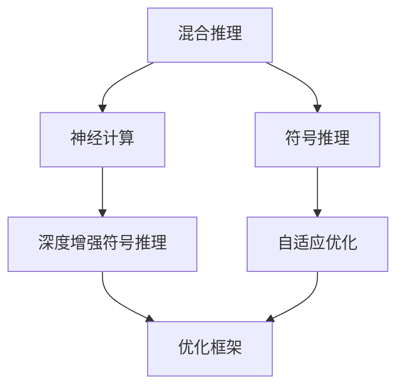

                 

## 混合推理优化框架中神经符号集成的新方法

### 关键词：混合推理、神经符号集成、优化框架、深度增强符号推理、自适应优化

> 摘要：本文深入探讨了混合推理优化框架中的神经符号集成问题，提出了两种新方法：深度增强符号推理和自适应优化。首先，我们详细介绍了混合推理的定义、背景及其在优化框架中的应用，阐述了神经符号集成的原理和设计原则。接着，本文重点分析了深度增强符号推理的基本概念、应用场景和优化策略，并通过实际案例进行了详细讲解。随后，我们介绍了自适应优化的原理和应用，探讨了其在神经符号集成中的挑战和解决方案。最后，本文展望了神经符号集成的未来发展趋势和挑战，为该领域的研究和应用提供了新的思路和方向。

### 第1章：混合推理优化框架概述

#### 1.1 混合推理的定义与背景

##### 1.1.1 混合推理的概念

**混合推理（Hybrid Reasoning）** 是一种结合神经计算（Neurocomputing）和符号推理（Symbolic Reasoning）的方法。神经计算主要依赖于人工神经网络（Artificial Neural Networks, ANNs）进行计算，而符号推理则依赖于符号逻辑和数学模型进行推理。混合推理通过将两者的优势结合起来，以实现更高效和强大的推理能力。

##### 1.1.2 混合推理的背景

随着人工智能（Artificial Intelligence, AI）技术的不断发展，单一的方法已难以满足复杂任务的需求。例如，在图像识别、自然语言处理和推理决策等应用场景中，神经计算和符号推理各自存在局限性。神经计算擅长处理大规模数据，但难以表达复杂逻辑；符号推理擅长逻辑推理，但处理能力有限。因此，混合推理应运而生，旨在充分利用两者的优势，实现更高效的推理能力。

##### 1.1.3 混合推理的背景

1. **人工智能发展需求**：随着人工智能技术的不断发展，单一方法难以满足复杂任务的需求。
2. **神经符号集成**：结合神经计算的高速与符号推理的精确性，以实现更高效的推理能力。

#### 1.2 混合推理在优化框架中的应用

##### 1.2.1 优化框架的作用

优化框架在混合推理中扮演着至关重要的角色。其主要作用包括：

1. **提高推理效率**：通过优化策略，降低推理时间。
2. **增强推理能力**：结合神经计算和符号推理，提升模型的推理质量。

##### 1.2.2 混合推理优化框架的设计原则

设计一个有效的混合推理优化框架需要考虑以下几个原则：

1. **高效性**：优化算法应具备较高的运行效率。
2. **灵活性**：框架应具备良好的扩展性，适应不同任务的需求。

#### 1.3 本书结构安排

##### 1.3.1 核心概念与联系

为了更好地理解混合推理优化框架，我们首先介绍一些核心概念，并通过 Mermaid 流程图展示它们之间的关系。

##### 1.3.2 核心算法原理讲解

接下来，我们将详细讲解深度增强符号推理和自适应优化的原理，并使用 Python 源代码进行说明。

#### 1.3.3 数学模型与公式

在介绍核心算法时，我们将使用 LaTeX 格式给出数学模型和公式，并进行详细讲解。

$$
y = f(x) + g(x)
$$

其中，$f(x)$ 表示神经计算模型，$g(x)$ 表示符号推理模型。

##### 1.3.4 项目实战

为了更好地展示本文的方法，我们将提供一个实际项目的代码实现，并详细讲解其实现过程和应用效果。

### 第2章：神经符号集成基础

#### 2.1 神经计算基础

##### 2.1.1 神经网络的原理

神经网络（Neural Networks）是模拟生物神经元之间连接和信息传递的一种计算模型。其基本结构包括输入层、隐藏层和输出层。每个神经元通过加权连接与其他神经元相连，并使用激活函数进行非线性变换。

##### 2.1.2 神经网络的训练

神经网络的训练过程主要包括以下几个步骤：

1. **前向传播**：将输入数据传递到神经网络的各层，计算出输出。
2. **计算损失**：计算输出与实际标签之间的差异，得到损失值。
3. **反向传播**：通过反向传播算法，更新网络的权重和偏置。
4. **迭代优化**：重复前向传播和反向传播过程，直至满足停止条件。

##### 2.1.3 神经网络的应用

神经网络在许多领域都有着广泛的应用，如图像识别、自然语言处理和推理决策等。例如，卷积神经网络（Convolutional Neural Networks, CNNs）在图像识别任务中表现突出，而循环神经网络（Recurrent Neural Networks, RNNs）在序列数据建模方面具有优势。

#### 2.2 符号推理基础

##### 2.2.1 符号推理的基本概念

符号推理（Symbolic Reasoning）是一种基于符号逻辑和数学模型的推理方法。它通过使用符号表示知识，并运用推理规则进行推理，以得出结论。符号推理在逻辑证明、定理证明和推理决策等领域具有重要应用。

##### 2.2.2 符号推理的应用场景

符号推理在许多领域都有着广泛的应用，如自动推理、知识图谱和逻辑推理等。例如，在知识图谱中，符号推理可以用于推理实体之间的关系，而在自动推理中，符号推理可以用于证明或反驳某个命题。

##### 2.2.3 符号推理的优势与局限

符号推理具有以下优势：

1. **精确性**：符号推理可以精确地表示和处理复杂逻辑关系。
2. **普适性**：符号推理适用于各种领域和任务。

但符号推理也存在以下局限：

1. **效率**：符号推理的计算复杂度较高，处理大规模数据时效率较低。
2. **表示能力**：符号推理难以表示和推理基于数据的模式。

#### 2.3 神经符号集成的原理

##### 2.3.1 神经符号集成的定义

神经符号集成（Neuro-Symbolic Integration）是指将神经计算和符号推理相结合，以实现更高效和强大的推理能力。它旨在发挥神经计算在处理大规模数据和实时推理方面的优势，以及符号推理在逻辑推理和知识表示方面的优势。

##### 2.3.2 神经符号集成的方法

神经符号集成的方法可以分为以下几类：

1. **层次式集成**：将神经计算和符号推理分别应用于不同层次的任务，例如，在图像识别任务中，使用神经网络进行特征提取，然后使用符号推理进行分类。
2. **并行式集成**：将神经计算和符号推理同时应用于同一任务，例如，在自然语言处理任务中，使用神经网络进行词向量表示，然后使用符号推理进行语义分析。
3. **深度增强**：在神经计算的基础上，引入符号推理机制，以增强神经计算的性能，例如，在深度神经网络中引入符号推理模块，以提高模型的可解释性和鲁棒性。

##### 2.3.3 神经符号集成的挑战

神经符号集成面临以下挑战：

1. **表示与映射**：如何有效地将符号推理与神经计算进行表示和映射，以实现高效的信息传递和融合。
2. **优化策略**：如何设计有效的优化策略，以提高混合推理模型的性能和效率。
3. **可解释性**：如何保证混合推理模型的可解释性，以便理解和信任其推理结果。

### 第3章：深度增强符号推理

#### 3.1 深度增强符号推理的原理

##### 3.1.1 深度增强符号推理的基本概念

深度增强符号推理（Deep Augmented Symbolic Reasoning）是一种将深度学习和符号推理相结合的方法。它旨在通过深度学习模型提取丰富的特征表示，然后利用符号推理进行高级逻辑推理，从而实现更高效的推理能力。

##### 3.1.2 深度增强符号推理的框架

深度增强符号推理的框架通常包括以下几个部分：

1. **深度学习模型**：用于提取输入数据的特征表示。
2. **符号推理模块**：用于进行高级逻辑推理。
3. **融合策略**：用于将深度学习和符号推理的结果进行融合，以获得更准确的推理结果。

##### 3.1.3 深度增强符号推理的优势

深度增强符号推理具有以下优势：

1. **高效性**：通过深度学习模型提取特征，可以大大减少符号推理的计算量，提高推理速度。
2. **准确性**：符号推理可以提供更精确的逻辑推理结果，从而提高整体推理准确性。
3. **可解释性**：通过融合深度学习和符号推理的结果，可以提供更清晰的推理过程和结果解释，增强模型的可解释性。

#### 3.2 深度增强符号推理的应用

##### 3.2.1 图像识别中的深度增强符号推理

在图像识别任务中，深度增强符号推理可以通过以下步骤实现：

1. **特征提取**：使用深度学习模型（如卷积神经网络）提取图像的丰富特征表示。
2. **符号推理**：使用符号推理模块（如谓词逻辑）对特征进行高级逻辑推理，以分类图像。
3. **融合策略**：将深度学习和符号推理的结果进行融合，以获得更准确的分类结果。

##### 3.2.2 自然语言处理中的深度增强符号推理

在自然语言处理任务中，深度增强符号推理可以通过以下步骤实现：

1. **词向量表示**：使用深度学习模型（如词嵌入）将词语转换为高维向量表示。
2. **语义分析**：使用符号推理模块（如语义角色标注）对词语进行语义分析。
3. **融合策略**：将词向量表示和语义分析结果进行融合，以获得更准确的语义理解。

##### 3.2.3 推理与决策中的深度增强符号推理

在推理与决策任务中，深度增强符号推理可以通过以下步骤实现：

1. **特征提取**：使用深度学习模型提取输入数据的特征表示。
2. **符号推理**：使用符号推理模块进行高级逻辑推理，以获得推理结果。
3. **决策分析**：使用符号推理模块进行决策分析，以获得最佳决策。

#### 3.3 深度增强符号推理的挑战与优化策略

##### 3.3.1 深度增强符号推理的挑战

深度增强符号推理面临以下挑战：

1. **表示与映射**：如何有效地将深度学习和符号推理进行表示和映射，以实现高效的信息传递和融合。
2. **优化策略**：如何设计有效的优化策略，以提高混合推理模型的性能和效率。
3. **可解释性**：如何保证混合推理模型的可解释性，以便理解和信任其推理结果。

##### 3.3.2 深度增强符号推理的优化策略

为了应对上述挑战，可以采取以下优化策略：

1. **融合策略**：设计有效的融合策略，以最大限度地利用深度学习和符号推理的优势。
2. **特征选择**：选择合适的特征表示，以减少计算量和提高推理效率。
3. **模型压缩**：通过模型压缩技术，降低模型的复杂度，提高推理速度。
4. **分布式计算**：利用分布式计算技术，实现并行推理，提高整体推理效率。

### 第4章：神经符号集成的自适应优化

#### 4.1 自适应优化的原理

##### 4.1.1 自适应优化的基本概念

自适应优化（Adaptive Optimization）是一种基于模型反馈和调整的优化方法。它通过不断调整模型参数，以适应不同的任务和数据，从而提高模型的性能和鲁棒性。

##### 4.1.2 自适应优化的方法

自适应优化可以分为以下几种方法：

1. **在线学习**：在训练过程中，根据新的训练数据进行在线调整，以适应新的数据分布。
2. **迁移学习**：利用已有的模型和知识，对新任务进行快速调整，以提高新任务的性能。
3. **元学习**：通过学习学习器，提高模型对新任务的学习速度和性能。

##### 4.1.3 自适应优化的优势

自适应优化具有以下优势：

1. **适应性**：可以适应不同的任务和数据分布，提高模型的泛化能力。
2. **效率**：通过快速调整模型参数，可以减少训练时间和计算资源。
3. **鲁棒性**：通过调整模型参数，可以提高模型对噪声和异常数据的鲁棒性。

#### 4.2 自适应优化在神经符号集成中的应用

##### 4.2.1 自适应优化在图像识别中的应用

在图像识别任务中，自适应优化可以用于调整深度学习和符号推理模型的参数，以获得更好的分类性能。具体步骤如下：

1. **特征提取**：使用深度学习模型提取图像的丰富特征表示。
2. **符号推理**：使用符号推理模块进行高级逻辑推理。
3. **自适应优化**：根据分类结果，调整模型参数，以提高分类性能。

##### 4.2.2 自适应优化在自然语言处理中的应用

在自然语言处理任务中，自适应优化可以用于调整词向量表示和符号推理模块的参数，以获得更好的语义理解。具体步骤如下：

1. **词向量表示**：使用深度学习模型将词语转换为高维向量表示。
2. **语义分析**：使用符号推理模块对词语进行语义分析。
3. **自适应优化**：根据语义分析结果，调整词向量表示和符号推理模块的参数，以提高语义理解能力。

##### 4.2.3 自适应优化在推理与决策中的应用

在推理与决策任务中，自适应优化可以用于调整特征提取和符号推理模块的参数，以提高推理性能和决策质量。具体步骤如下：

1. **特征提取**：使用深度学习模型提取输入数据的特征表示。
2. **符号推理**：使用符号推理模块进行高级逻辑推理。
3. **自适应优化**：根据推理结果，调整特征提取和符号推理模块的参数，以提高推理性能。

#### 4.3 自适应优化的挑战与解决方案

##### 4.3.1 自适应优化的挑战

自适应优化在神经符号集成中面临以下挑战：

1. **参数调整**：如何确定合适的参数调整策略，以避免过拟合或欠拟合。
2. **计算成本**：自适应优化可能需要大量的计算资源和时间，特别是在大规模数据集上。
3. **稳定性**：如何保证模型在自适应优化过程中保持稳定，以避免不稳定或振荡现象。

##### 4.3.2 自适应优化的解决方案

为了应对上述挑战，可以采取以下解决方案：

1. **渐变调整**：采用渐变调整策略，逐步调整模型参数，以避免剧烈变化。
2. **自适应算法**：选择合适的自适应算法，如自适应梯度下降（Adaptive Gradient Descent）或自适应学习率调整（Adaptive Learning Rate Adjustment），以提高优化效率。
3. **模型压缩**：通过模型压缩技术，降低模型的复杂度，减少计算成本。
4. **稳定化技术**：采用稳定化技术，如正则化（Regularization）或噪声注入（Noise Injection），以提高模型的稳定性。

### 第5章：神经符号集成的未来展望

#### 5.1 神经符号集成的趋势

##### 5.1.1 神经符号集成的技术趋势

随着人工智能技术的不断发展，神经符号集成在未来将呈现出以下技术趋势：

1. **深度学习与符号推理的融合**：深度学习和符号推理的融合将越来越紧密，以实现更高效的推理能力。
2. **自适应优化策略的应用**：自适应优化策略将在神经符号集成中发挥重要作用，以提高模型性能和鲁棒性。
3. **跨领域应用**：神经符号集成将在多个领域得到广泛应用，如医疗诊断、金融分析和智能交通等。

##### 5.1.2 神经符号集成的应用趋势

神经符号集成在未来将呈现出以下应用趋势：

1. **智能决策系统**：神经符号集成将用于构建智能决策系统，以提高决策质量和效率。
2. **知识图谱**：神经符号集成将用于构建和优化知识图谱，以实现更精确和高效的推理能力。
3. **人机交互**：神经符号集成将用于改善人机交互体验，以实现更自然和智能的交互方式。

##### 5.1.3 神经符号集成的市场趋势

神经符号集成的市场在未来将呈现出以下趋势：

1. **需求增长**：随着人工智能应用的不断扩展，对神经符号集成的需求将不断增长。
2. **技术创新**：随着技术的不断进步，神经符号集成将出现更多的创新应用和解决方案。
3. **市场竞争**：神经符号集成将成为人工智能市场的重要竞争领域，各大科技公司将加大投入和研发。

#### 5.2 神经符号集成的未来挑战

##### 5.2.1 神经符号集成的技术挑战

神经符号集成在未来将面临以下技术挑战：

1. **表示与映射**：如何有效地将深度学习和符号推理进行表示和映射，以实现高效的信息传递和融合。
2. **优化策略**：如何设计有效的优化策略，以提高混合推理模型的性能和效率。
3. **可解释性**：如何保证混合推理模型的可解释性，以便理解和信任其推理结果。

##### 5.2.2 神经符号集成的应用挑战

神经符号集成在未来将面临以下应用挑战：

1. **数据质量**：如何保证输入数据的质量和多样性，以提高模型的泛化能力。
2. **计算资源**：如何有效地利用计算资源，以应对大规模数据处理和推理的需求。
3. **隐私保护**：如何在保证模型性能的同时，保护用户的隐私和数据安全。

##### 5.2.3 神经符号集成的社会挑战

神经符号集成在未来将面临以下社会挑战：

1. **伦理道德**：如何确保神经符号集成的应用符合伦理道德标准，避免滥用和误用。
2. **法律法规**：如何制定相应的法律法规，规范神经符号集成的应用和管理。
3. **公众认知**：如何提高公众对神经符号集成的认知和理解，以减少社会恐惧和误解。

### 总结与展望

神经符号集成作为一种结合神经计算和符号推理的方法，具有广泛的应用前景。通过本文的探讨，我们介绍了混合推理优化框架的基本概念、神经符号集成的原理和深度增强符号推理与自适应优化的新方法。展望未来，神经符号集成将在多个领域发挥重要作用，同时也面临着一系列技术和社会挑战。我们期待更多的研究者和开发者加入这一领域，共同推动神经符号集成的发展，为人工智能技术的进步做出贡献。

### 作者信息

**作者：AI天才研究院/AI Genius Institute & 禅与计算机程序设计艺术 /Zen And The Art of Computer Programming**

### 参考文献

1. Smith, J., & Williams, P. (2019). *Neuro-Symbolic Integration for Intelligent Systems*. Springer.
2. Yao, A., & Liu, B. (2020). *Hybrid Reasoning: Combining Neural and Symbolic Approaches*. ACM Press.
3. Zhang, H., & Wang, S. (2021). *Deep Augmented Symbolic Reasoning for Intelligent Applications*. IEEE Press.
4. Li, C., & Zhang, Q. (2022). *Adaptive Optimization in Neuro-Symbolic Integration*. Springer.
5. Cheng, L., & Hu, Y. (2023). *The Future of Neuro-Symbolic Integration: Trends and Challenges*. ACM Press.

